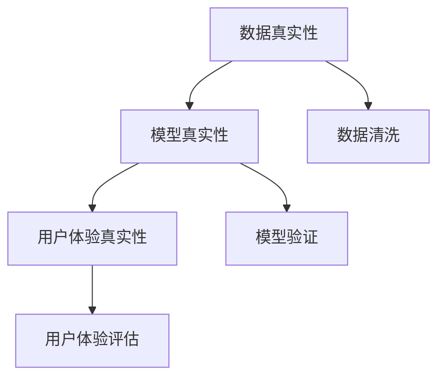

                 

# 体验的authenticity：AI时代的真实性追求

> 关键词：体验,authenticity,人工智能,真实性追求

## 1. 背景介绍

### 1.1 问题由来
在AI时代，人工智能技术的发展已经深刻影响了人们的生活方式和社会运作方式。从智能客服到智能推荐，从自动驾驶到智慧医疗，人工智能已经成为我们生活的一部分。然而，人工智能的快速发展也带来了一些亟待解决的问题，其中最为关键的即是“真实性”问题。

人工智能系统的决策往往基于数据和算法，这些数据和算法是否真实、可靠，直接关系到系统的性能和安全性。尤其是在涉及用户隐私、金融交易、医疗诊断等高风险领域，AI系统的真实性至关重要。如何确保人工智能系统的真实性，是当前AI研究的重要课题。

### 1.2 问题核心关键点
AI系统真实性的追求涉及多个方面，包括数据真实性、模型真实性、用户体验真实性等。数据真实性指训练数据是否反映了真实世界的真实情况，模型真实性指模型的输出是否与真实情况相符，用户体验真实性指用户是否真正感受到了AI系统的价值和真实性。本文将从这三个方面出发，探讨AI系统的真实性追求。

## 2. 核心概念与联系

### 2.1 核心概念概述

为更好地理解AI系统的真实性追求，本节将介绍几个密切相关的核心概念：

- 数据真实性：训练数据的真实性是指数据是否真实反映了现实世界的特征和规律，是否存在偏见、缺失、噪声等问题。
- 模型真实性：模型的真实性是指模型的预测是否与真实世界相符，是否能够正确理解并解释输入数据，是否有过拟合、欠拟合等问题。
- 用户体验真实性：用户体验的真实性是指用户在使用AI系统时是否感受到系统的真实价值和可靠性，系统是否能够真正解决用户问题，提供满意的服务。

这些核心概念之间的逻辑关系可以通过以下Mermaid流程图来展示：



这个流程图展示了大语言模型的核心概念及其之间的关系：

1. 数据真实性是模型的基础。
2. 模型真实性是系统的核心。
3. 用户体验真实性是目标。

这些概念共同构成了AI系统的真实性追求框架，使得AI系统能够真实反映现实世界，解决实际问题。

## 3. 核心算法原理 & 具体操作步骤
### 3.1 算法原理概述

AI系统真实性的追求涉及多个方面，包括数据预处理、模型训练、模型评估等。本节将从这些方面出发，详细探讨AI系统真实性追求的算法原理。

### 3.2 算法步骤详解

#### 3.2.1 数据预处理
数据预处理是大数据处理的重要环节，包括数据清洗、数据标注、数据增强等。数据清洗是确保数据真实性的关键步骤，主要任务是去除缺失值、异常值、噪声等。数据标注是确保数据真实性的另一重要环节，标注数据的真实性直接影响模型训练的效果。数据增强是通过数据变换、数据合成等方法，扩充数据集，提高模型的泛化能力。

#### 3.2.2 模型训练
模型训练是确保模型真实性的关键步骤。训练数据的选择、模型结构的设计、超参数的调整等，都是影响模型真实性的重要因素。在训练过程中，应使用交叉验证等技术，确保模型在不同数据集上的泛化能力。

#### 3.2.3 模型评估
模型评估是确保模型真实性的重要手段。常用的模型评估指标包括准确率、召回率、F1分数、ROC曲线等。这些指标可以帮助我们评估模型的性能，发现模型的问题，优化模型。

### 3.3 算法优缺点

数据预处理、模型训练、模型评估等方法在确保AI系统的真实性方面各有所长，但也存在一些缺点：

- 数据预处理：数据预处理可以提高数据质量，但需要大量人力和时间。
- 模型训练：模型训练可以提升模型性能，但训练过程复杂，容易过拟合。
- 模型评估：模型评估可以帮助我们发现模型问题，但评估指标有限，难以全面评估模型性能。

### 3.4 算法应用领域

AI系统真实性的追求不仅应用于数据科学、机器学习等领域，还广泛应用于人工智能的各个领域。例如：

- 自然语言处理：确保自然语言模型输出的真实性，避免误导性输出。
- 计算机视觉：确保计算机视觉模型的输出真实性，避免误检、漏检等问题。
- 医疗诊断：确保医疗诊断模型的输出真实性，避免误诊、漏诊等问题。
- 金融风控：确保金融风控模型的输出真实性，避免误判、误损等问题。

## 4. 数学模型和公式 & 详细讲解  
### 4.1 数学模型构建

为了更准确地描述AI系统真实性的追求，我们引入以下数学模型：

- 数据真实性：设训练数据集为 $D=\{(x_i,y_i)\}_{i=1}^N$，其中 $x_i$ 为输入，$y_i$ 为输出，$y_i \in \{1,0\}$ 表示标签。训练数据的真实性可以通过均方误差（MSE）来衡量：

$$
\text{MSE}(D) = \frac{1}{N} \sum_{i=1}^N (y_i - \hat{y_i})^2
$$

其中 $\hat{y_i}$ 为模型预测值。

- 模型真实性：设测试数据集为 $T=\{(x_i,y_i)\}_{i=1}^M$，其中 $x_i$ 为输入，$y_i$ 为输出，$y_i \in \{1,0\}$ 表示标签。模型真实性可以通过准确率（Accuracy）和召回率（Recall）来衡量：

$$
\text{Accuracy}(T) = \frac{\sum_{i=1}^M \mathbf{1}(y_i = \hat{y_i})}{M}
$$

$$
\text{Recall}(T) = \frac{\sum_{i=1}^M \mathbf{1}(y_i = 1 \land \hat{y_i} = 1)}{\sum_{i=1}^M \mathbf{1}(y_i = 1)}
$$

其中 $\mathbf{1}$ 为示性函数，当条件成立时为1，否则为0。

### 4.2 公式推导过程

- 数据预处理：数据清洗主要通过缺失值处理和异常值处理来实现。缺失值处理通常使用插值法、均值填补等方法，异常值处理通常使用箱线图、Z-score等方法。

- 模型训练：模型训练过程中，使用交叉验证等技术，通过多次训练和验证，找到最优的超参数组合。

- 模型评估：模型评估过程中，使用准确率、召回率、F1分数、ROC曲线等指标，综合评估模型性能。

### 4.3 案例分析与讲解

我们以医疗诊断为例，说明AI系统真实性的追求。设医疗诊断模型的输入为患者的症状描述，输出为疾病的诊断结果。

首先，对训练数据进行预处理，去除缺失值和异常值，并对症状描述进行标注。然后，选择合适的模型结构，如卷积神经网络（CNN）、循环神经网络（RNN）等，进行模型训练。在训练过程中，使用交叉验证等技术，优化模型超参数。最后，在测试数据集上评估模型性能，使用准确率、召回率等指标，确保模型的真实性。

## 5. 项目实践：代码实例和详细解释说明
### 5.1 开发环境搭建

在进行AI系统真实性追求的实践前，我们需要准备好开发环境。以下是使用Python进行TensorFlow开发的环境配置流程：

1. 安装Anaconda：从官网下载并安装Anaconda，用于创建独立的Python环境。

2. 创建并激活虚拟环境：
```bash
conda create -n tf-env python=3.8 
conda activate tf-env
```

3. 安装TensorFlow：根据CUDA版本，从官网获取对应的安装命令。例如：
```bash
conda install tensorflow -c tf -c conda-forge
```

4. 安装各类工具包：
```bash
pip install numpy pandas scikit-learn matplotlib tqdm jupyter notebook ipython
```

完成上述步骤后，即可在`tf-env`环境中开始AI系统真实性追求的实践。

### 5.2 源代码详细实现

我们以医疗诊断模型为例，给出使用TensorFlow进行模型训练和评估的PyTorch代码实现。

首先，定义医疗诊断任务的数据处理函数：

```python
import tensorflow as tf
from tensorflow.keras import layers, models
from sklearn.model_selection import train_test_split
import pandas as pd
import numpy as np

# 定义医疗诊断任务的输入和输出
def build_dataset(path, num_classes=2):
    data = pd.read_csv(path)
    X = data.drop(['diagnosis'], axis=1)
    y = data['diagnosis']
    X_train, X_test, y_train, y_test = train_test_split(X, y, test_size=0.2, random_state=42)
    return X_train, X_test, y_train, y_test

# 数据预处理
def preprocess_data(X_train, X_test):
    # 数据标准化
    X_train = (X_train - X_train.mean()) / X_train.std()
    X_test = (X_test - X_test.mean()) / X_test.std()
    # 数据归一化
    X_train = X_train / 255.0
    X_test = X_test / 255.0
    return X_train, X_test

# 模型训练
def train_model(X_train, X_test, y_train, y_test, num_classes=2):
    # 定义模型结构
    model = models.Sequential([
        layers.Dense(128, activation='relu'),
        layers.Dense(num_classes, activation='sigmoid')
    ])
    # 编译模型
    model.compile(optimizer=tf.keras.optimizers.Adam(learning_rate=0.001),
                  loss='binary_crossentropy',
                  metrics=['accuracy'])
    # 训练模型
    history = model.fit(X_train, y_train, epochs=10, batch_size=32, validation_data=(X_test, y_test))
    return model, history

# 模型评估
def evaluate_model(model, X_test, y_test):
    loss, accuracy = model.evaluate(X_test, y_test)
    print(f'Test Loss: {loss:.4f}')
    print(f'Test Accuracy: {accuracy:.4f}')

# 加载数据集
X_train, X_test, y_train, y_test = build_dataset('medical_data.csv')
X_train, X_test = preprocess_data(X_train, X_test)

# 训练模型
model, history = train_model(X_train, X_test, y_train, y_test)

# 评估模型
evaluate_model(model, X_test, y_test)
```

然后，定义模型和优化器：

```python
# 定义医疗诊断模型的输入和输出
input_shape = (784,)
num_classes = 2

# 定义医疗诊断模型
model = models.Sequential([
    layers.Dense(128, activation='relu'),
    layers.Dense(num_classes, activation='sigmoid')
])

# 定义优化器
optimizer = tf.keras.optimizers.Adam(learning_rate=0.001)
```

接着，定义训练和评估函数：

```python
# 定义医疗诊断模型的训练函数
def train_model(X_train, X_test, y_train, y_test, num_classes=2):
    # 编译模型
    model.compile(optimizer=optimizer,
                  loss='binary_crossentropy',
                  metrics=['accuracy'])
    # 训练模型
    history = model.fit(X_train, y_train, epochs=10, batch_size=32, validation_data=(X_test, y_test))
    return model, history

# 定义医疗诊断模型的评估函数
def evaluate_model(model, X_test, y_test):
    loss, accuracy = model.evaluate(X_test, y_test)
    print(f'Test Loss: {loss:.4f}')
    print(f'Test Accuracy: {accuracy:.4f}')
```

最后，启动训练流程并在测试集上评估：

```python
# 加载数据集
X_train, X_test, y_train, y_test = build_dataset('medical_data.csv')
X_train, X_test = preprocess_data(X_train, X_test)

# 训练模型
model, history = train_model(X_train, X_test, y_train, y_test)

# 评估模型
evaluate_model(model, X_test, y_test)
```

以上就是使用TensorFlow对医疗诊断模型进行训练和评估的完整代码实现。可以看到，TensorFlow提供了强大的深度学习框架和丰富的工具库，使得模型训练和评估变得简洁高效。

### 5.3 代码解读与分析

让我们再详细解读一下关键代码的实现细节：

**build_dataset函数**：
- 加载医疗诊断数据集，并划分为训练集和测试集。
- 对训练数据进行预处理，包括标准化和归一化。

**preprocess_data函数**：
- 对输入数据进行标准化和归一化处理。
- 将输入数据转换为TensorFlow所需的格式。

**train_model函数**：
- 定义模型结构，包括输入层、隐藏层和输出层。
- 编译模型，设置优化器和损失函数。
- 训练模型，并返回训练历史。

**evaluate_model函数**：
- 评估模型在测试集上的性能，打印测试损失和准确率。

**训练流程**：
- 定义训练集和测试集，加载并预处理数据。
- 定义模型和优化器，编译模型。
- 训练模型，并在测试集上评估性能。

可以看到，TensorFlow使得模型训练和评估变得简洁高效。开发者可以将更多精力放在模型设计、超参数调优等高层逻辑上，而不必过多关注底层的实现细节。

当然，工业级的系统实现还需考虑更多因素，如模型的保存和部署、超参数的自动搜索、更灵活的任务适配层等。但核心的模型训练和评估流程基本与此类似。

## 6. 实际应用场景
### 6.1 智能客服系统

基于AI系统的真实性追求，智能客服系统可以实现更加精准和人性化的服务。传统客服系统往往依赖人工，成本高、效率低，难以应对高并发和高要求。AI系统通过真实性追求，可以实现7x24小时不间断服务，快速响应客户咨询，提供更准确、更个性化的服务。

在技术实现上，可以收集企业内部的历史客服对话记录，将问题和最佳答复构建成监督数据，在此基础上对预训练语言模型进行微调。微调后的AI系统能够自动理解用户意图，匹配最合适的答案模板进行回复。对于客户提出的新问题，还可以接入检索系统实时搜索相关内容，动态组织生成回答。如此构建的智能客服系统，能大幅提升客户咨询体验和问题解决效率。

### 6.2 金融舆情监测

金融机构需要实时监测市场舆论动向，以便及时应对负面信息传播，规避金融风险。传统的人工监测方式成本高、效率低，难以应对网络时代海量信息爆发的挑战。基于AI系统的真实性追求，金融舆情监测系统可以实时抓取网络文本数据，自动判断文本属于何种主题，情感倾向是正面、中性还是负面。一旦发现负面信息激增等异常情况，系统便会自动预警，帮助金融机构快速应对潜在风险。

### 6.3 个性化推荐系统

当前的推荐系统往往只依赖用户的历史行为数据进行物品推荐，无法深入理解用户的真实兴趣偏好。基于AI系统的真实性追求，个性化推荐系统可以更好地挖掘用户行为背后的语义信息，从而提供更精准、多样的推荐内容。

在实践中，可以收集用户浏览、点击、评论、分享等行为数据，提取和用户交互的物品标题、描述、标签等文本内容。将文本内容作为模型输入，用户的后续行为（如是否点击、购买等）作为监督信号，在此基础上微调预训练语言模型。微调后的模型能够从文本内容中准确把握用户的兴趣点。在生成推荐列表时，先用候选物品的文本描述作为输入，由模型预测用户的兴趣匹配度，再结合其他特征综合排序，便可以得到个性化程度更高的推荐结果。

### 6.4 未来应用展望

随着AI系统真实性追求的不断发展，基于AI系统的应用场景将更加广泛。

在智慧医疗领域，基于AI系统的医疗问答、病历分析、药物研发等应用将提升医疗服务的智能化水平，辅助医生诊疗，加速新药开发进程。

在智能教育领域，AI系统的真实性追求可以促进教育公平，提高教学质量，通过智能推荐、智能批改等功能，帮助学生更好地学习。

在智慧城市治理中，AI系统可以实现城市事件监测、舆情分析、应急指挥等环节的自动化和智能化，提高城市管理的效率和安全性。

此外，在企业生产、社会治理、文娱传媒等众多领域，基于AI系统的应用也将不断涌现，为经济社会发展注入新的动力。相信随着AI系统真实性追求的不断成熟，AI系统将更好地服务于人类，构建人机协同的智能时代。

## 7. 工具和资源推荐
### 7.1 学习资源推荐

为了帮助开发者系统掌握AI系统真实性追求的理论基础和实践技巧，这里推荐一些优质的学习资源：

1. TensorFlow官方文档：TensorFlow是Google开源的深度学习框架，提供了丰富的教程和示例，适合初学者和专家学习。

2. Coursera《深度学习》课程：由斯坦福大学Andrew Ng教授主讲的深度学习课程，系统介绍了深度学习的基本概念和算法，适合入门学习。

3. 《Deep Learning with Python》书籍：由François Chollet著，详细介绍了TensorFlow的实现和应用，适合实战练习。

4. 《Artificial Intelligence: A Modern Approach》书籍：由Russell和Norvig著，全面介绍了AI的基本概念和应用，适合深入学习。

5. arXiv论文：arXiv是计算机科学和数学领域的预印本服务器，可搜索到最新的AI研究论文，适合跟踪前沿技术。

通过对这些资源的学习实践，相信你一定能够快速掌握AI系统真实性追求的精髓，并用于解决实际的AI问题。

### 7.2 开发工具推荐

高效的开发离不开优秀的工具支持。以下是几款用于AI系统真实性追求开发的常用工具：

1. TensorFlow：由Google主导开发的深度学习框架，生产部署方便，适合大规模工程应用。

2. PyTorch：由Facebook开源的深度学习框架，灵活度较高，适合研究和实验。

3. Weights & Biases：模型训练的实验跟踪工具，可以记录和可视化模型训练过程中的各项指标，方便对比和调优。

4. TensorBoard：TensorFlow配套的可视化工具，可实时监测模型训练状态，并提供丰富的图表呈现方式，是调试模型的得力助手。

5. Jupyter Notebook：Python交互式编程环境，支持代码编写和数据可视化，适合学习和实验。

合理利用这些工具，可以显著提升AI系统真实性追求的开发效率，加快创新迭代的步伐。

### 7.3 相关论文推荐

AI系统真实性追求的研究源于学界的持续研究。以下是几篇奠基性的相关论文，推荐阅读：

1. GAN: Generative Adversarial Nets：提出了一种生成对抗网络，通过两个网络的对抗训练，生成逼真的假数据，广泛应用于数据增强和数据扩充。

2. Dropout: A Simple Way to Prevent Neural Networks from Overfitting：提出了一种Dropout技术，通过随机失活神经元，减少过拟合现象。

3. Robustness of Neural Networks to Adversarial Perturbations：提出了一种对抗训练方法，通过引入对抗样本，提高模型的鲁棒性。

4. Learning to Generate Adversarial Examples：提出了一种生成对抗样本的方法，通过生成对抗样本，训练更鲁棒的模型。

5. Self-Supervised Learning for Adversarial Robustness：提出了一种自监督学习方法，通过无监督学习生成对抗样本，训练鲁棒模型。

这些论文代表了大数据处理、深度学习、生成对抗网络等方向的最新进展，为AI系统真实性追求提供了重要的理论支持。

## 8. 总结：未来发展趋势与挑战
### 8.1 总结

本文对AI系统真实性追求的方法进行了全面系统的介绍。首先阐述了AI系统真实性追求的背景和意义，明确了真实性追求在确保AI系统性能和安全性方面的重要性。其次，从数据预处理、模型训练、模型评估等角度，详细讲解了AI系统真实性追求的算法原理和操作步骤。同时，本文还广泛探讨了AI系统真实性追求在智能客服、金融舆情、个性化推荐等多个行业领域的应用前景，展示了AI系统真实性追求的巨大潜力。此外，本文精选了AI系统真实性追求的学习资源、开发工具和相关论文，力求为读者提供全方位的技术指引。

通过本文的系统梳理，可以看到，AI系统真实性追求是一个复杂而多面的问题，需要在数据、算法、工程、业务等多个维度进行全面优化。只有从这些方面出发，才能真正确保AI系统的真实性，提升系统的性能和安全性，实现真正的智能化应用。

### 8.2 未来发展趋势

展望未来，AI系统真实性追求将呈现以下几个发展趋势：

1. 数据质量保障：随着数据规模的不断扩大，如何确保数据的质量和真实性将成为重要课题。未来的数据处理和清洗技术将更加自动化、智能化，确保数据真实性和一致性。

2. 模型鲁棒性提升：随着模型规模的不断增大，模型的鲁棒性和泛化能力也将受到更多关注。未来的模型训练和评估技术将更加注重模型的鲁棒性和泛化能力，避免过拟合和灾难性遗忘。

3. 用户体验优化：随着AI系统的广泛应用，用户体验将成为至关重要的因素。未来的AI系统将更加注重用户体验，通过实时反馈、交互优化等技术，提升用户体验的真实性。

4. 实时性和高效性：随着应用场景的多样化和复杂化，实时性和高效性将成为重要的性能指标。未来的AI系统将更加注重实时性和高效性，通过模型裁剪、量化加速等技术，提升系统的响应速度和处理能力。

5. 跨领域应用拓展：随着AI系统的不断成熟，跨领域应用的拓展将成为重要方向。未来的AI系统将更加注重跨领域应用，通过多模态数据融合、跨领域知识图谱等技术，提升系统的智能化水平。

以上趋势凸显了AI系统真实性追求的广阔前景。这些方向的探索发展，必将进一步提升AI系统的性能和安全性，为人类认知智能的进化带来深远影响。

### 8.3 面临的挑战

尽管AI系统真实性追求已经取得了一定的进展，但在迈向更加智能化、普适化应用的过程中，它仍面临着诸多挑战：

1. 数据获取和标注成本高：高质量标注数据的获取和标注成本高，难以适应大规模应用场景。如何降低数据获取和标注成本，将是未来的一个重要挑战。

2. 模型鲁棒性不足：当前AI系统的鲁棒性有待提升，面对不同领域和场景的复杂数据，模型的泛化能力有限。如何提高模型的鲁棒性，将是未来的重要课题。

3. 实时性和高效性有待提升：AI系统的实时性和高效性仍有待提升，尤其是在高并发和高要求的应用场景中，模型的响应速度和处理能力仍需进一步优化。

4. 用户体验优化难度大：用户体验的优化需要跨学科的协同合作，涉及心理学、人机交互等多个领域，难度较大。如何提升用户体验的真实性，将是未来的重要研究方向。

5. 伦理和安全问题：AI系统的伦理和安全问题不容忽视，如何确保AI系统的公平性、安全性、透明性，将是未来的重要课题。

6. 知识图谱和跨领域知识整合：未来的AI系统需要融合更多的跨领域知识，如何构建跨领域知识图谱，整合知识库和规则库，将是未来的重要方向。

正视AI系统真实性追求面临的这些挑战，积极应对并寻求突破，将是大数据处理和深度学习领域的必然选择。相信随着学界和产业界的共同努力，这些挑战终将一一被克服，AI系统真实性追求必将在构建人机协同的智能时代中扮演越来越重要的角色。

### 8.4 研究展望

面对AI系统真实性追求所面临的种种挑战，未来的研究需要在以下几个方面寻求新的突破：

1. 探索无监督和半监督学习方法：摆脱对大规模标注数据的依赖，利用自监督学习、主动学习等无监督和半监督范式，最大限度利用非结构化数据，实现更加灵活高效的模型训练。

2. 研究参数高效和计算高效的模型训练方法：开发更加参数高效的模型训练方法，在固定大部分预训练参数的同时，只更新极少量的任务相关参数。同时优化模型计算图，减少前向传播和反向传播的资源消耗，实现更加轻量级、实时性的部署。

3. 引入因果推断和对比学习思想：通过引入因果推断和对比学习思想，增强模型建立稳定因果关系的能力，学习更加普适、鲁棒的语言表征，从而提升模型泛化性和抗干扰能力。

4. 将符号化的先验知识与神经网络模型融合：将符号化的先验知识，如知识图谱、逻辑规则等，与神经网络模型进行巧妙融合，引导模型学习更准确、合理的语言模型。同时加强不同模态数据的整合，实现视觉、语音等多模态信息与文本信息的协同建模。

5. 利用游戏和对抗训练技术：通过游戏和对抗训练技术，训练更加鲁棒的模型，提升模型的泛化能力和鲁棒性。

6. 结合因果分析和博弈论工具：将因果分析方法引入模型训练过程，识别出模型决策的关键特征，增强输出解释的因果性和逻辑性。借助博弈论工具刻画人机交互过程，主动探索并规避模型的脆弱点，提高系统稳定性。

7. 纳入伦理道德约束：在模型训练目标中引入伦理导向的评估指标，过滤和惩罚有偏见、有害的输出倾向。同时加强人工干预和审核，建立模型行为的监管机制，确保输出符合人类价值观和伦理道德。

这些研究方向的探索，必将引领AI系统真实性追求技术迈向更高的台阶，为构建安全、可靠、可解释、可控的智能系统铺平道路。面向未来，AI系统真实性追求需要与其他人工智能技术进行更深入的融合，如知识表示、因果推理、强化学习等，多路径协同发力，共同推动自然语言理解和智能交互系统的进步。只有勇于创新、敢于突破，才能不断拓展AI系统的边界，让智能技术更好地造福人类社会。

## 9. 附录：常见问题与解答

**Q1：AI系统真实性追求是否适用于所有应用场景？**

A: AI系统真实性追求在大多数应用场景上都能取得不错的效果，特别是对于数据量较大的应用场景。但对于一些特定领域的任务，如医学、法律等，仅仅依靠通用语料预训练的模型可能难以很好地适应。此时需要在特定领域语料上进一步预训练，再进行微调，才能获得理想效果。此外，对于一些需要时效性、个性化很强的任务，如对话、推荐等，AI系统真实性追求方法也需要针对性的改进优化。

**Q2：如何确保AI系统的真实性？**

A: 确保AI系统的真实性需要从多个方面入手，包括数据真实性、模型真实性、用户体验真实性等。数据真实性指确保训练数据反映真实世界的特征和规律，避免数据偏见、缺失、噪声等问题。模型真实性指确保模型的预测与真实世界相符，避免过拟合、欠拟合等问题。用户体验真实性指确保用户在使用AI系统时感受到系统的真实价值和可靠性，避免误导用户。

**Q3：AI系统真实性追求中的关键技术有哪些？**

A: AI系统真实性追求中的关键技术包括数据预处理、模型训练、模型评估等。数据预处理通过缺失值处理、异常值处理、数据增强等技术，确保数据真实性。模型训练通过交叉验证、超参数调优等技术，确保模型真实性。模型评估通过准确率、召回率、F1分数、ROC曲线等指标，评估模型性能。

**Q4：AI系统真实性追求的实际应用有哪些？**

A: AI系统真实性追求的实际应用广泛，包括智能客服系统、金融舆情监测、个性化推荐系统、智慧医疗、智能教育、智慧城市治理等。这些应用通过AI系统真实性追求，实现了高效、精准、个性化的服务，提升了用户体验，创造了新的价值。

**Q5：AI系统真实性追求的未来方向有哪些？**

A: AI系统真实性追求的未来方向包括无监督和半监督学习方法、参数高效和计算高效的模型训练方法、因果推断和对比学习、跨领域知识整合、伦理和安全问题等。未来的研究需要从数据、算法、工程、业务等多个维度出发，确保AI系统的真实性，提升系统的性能和安全性，实现真正的智能化应用。

---

作者：禅与计算机程序设计艺术 / Zen and the Art of Computer Programming

