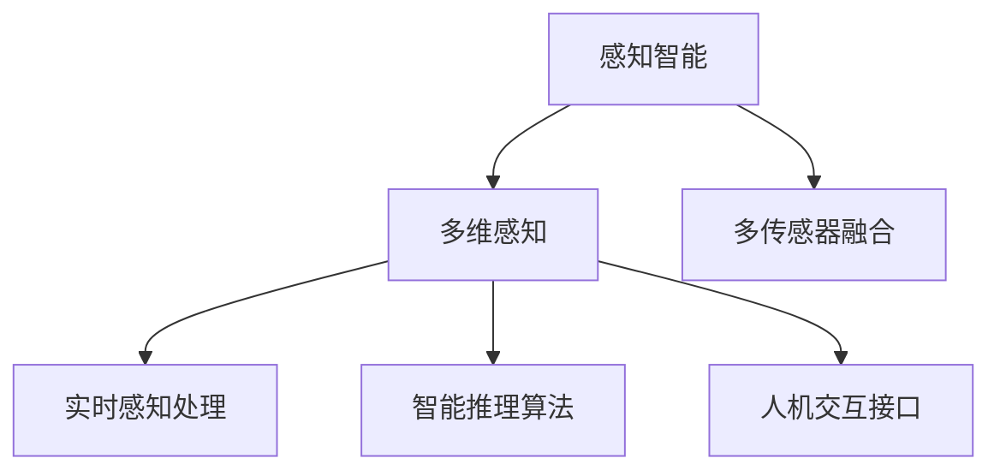

                 

# 体验的层次性：AI创造的多维感知

> 关键词：感知智能,多维感知,深度学习,感知层次,数据融合,脑机接口,用户交互,用户体验

## 1. 背景介绍

### 1.1 问题由来

近年来，人工智能技术在各个领域的应用日益广泛，尤其是深度学习的发展，使得机器在视觉、语音、自然语言处理等方面取得了突破性进展。然而，现有的AI系统仍然存在一个重要的问题：它们缺乏对环境的感知，只能按照预定义的规则进行简单的行为。这种缺乏感知能力的问题，严重限制了AI系统在复杂多变环境中的适应性和创造性。

为了解决这个问题，研究人员提出了感知智能的概念，即让机器具备对环境的感知能力，能够通过多维感知系统获取环境的详细信息，从而进行智能决策。多维感知系统不仅可以提供环境的多维度信息，如位置、姿态、速度、温度等，还可以实现环境的实时监测和动态反馈，为智能决策提供更加全面的依据。

### 1.2 问题核心关键点

多维感知系统是感知智能的关键组成部分，它通过多种传感器获取环境的多维度信息，并将这些信息进行综合处理，最终形成对环境的全面感知。多维感知系统的核心技术包括：

- 多传感器融合：将不同类型传感器获取的环境信息进行综合处理，形成对环境的全面感知。
- 实时感知处理：对环境信息进行实时处理，为智能决策提供动态反馈。
- 智能推理算法：根据感知信息进行智能推理，进行决策和行为控制。
- 人机交互接口：实现人机协同交互，增强用户体验。

这些核心技术共同构成了多维感知系统的技术框架，使其能够适应复杂多变的环境，进行智能决策和行为控制。

## 2. 核心概念与联系

### 2.1 核心概念概述

为更好地理解多维感知系统的技术框架，本节将介绍几个密切相关的核心概念：

- 感知智能：一种人工智能技术，旨在让机器具备对环境的感知能力，能够通过多维感知系统获取环境的详细信息，从而进行智能决策。
- 多维感知：通过多种传感器获取环境的多维度信息，如位置、姿态、速度、温度等，形成对环境的全面感知。
- 多传感器融合：将不同类型传感器获取的环境信息进行综合处理，形成对环境的全面感知。
- 实时感知处理：对环境信息进行实时处理，为智能决策提供动态反馈。
- 智能推理算法：根据感知信息进行智能推理，进行决策和行为控制。
- 人机交互接口：实现人机协同交互，增强用户体验。

这些核心概念之间的逻辑关系可以通过以下Mermaid流程图来展示：



这个流程图展示了几何概念之间的逻辑关系：

1. 感知智能是整个系统的目标，旨在让机器具备对环境的感知能力。
2. 多维感知是感知智能的基础，通过多种传感器获取环境的多维度信息。
3. 多传感器融合是将不同类型传感器获取的信息进行综合处理，形成对环境的全面感知。
4. 实时感知处理是对环境信息进行实时处理，为智能决策提供动态反馈。
5. 智能推理算法是根据感知信息进行智能推理，进行决策和行为控制。
6. 人机交互接口是实现人机协同交互，增强用户体验。

这些核心概念共同构成了多维感知系统的技术框架，使其能够适应复杂多变的环境，进行智能决策和行为控制。

## 3. 核心算法原理 & 具体操作步骤

### 3.1 算法原理概述

多维感知系统的核心算法包括多传感器融合算法、实时感知处理算法和智能推理算法。这些算法通过数学建模和计算机视觉等技术，实现对环境信息的综合处理和智能推理，最终形成对环境的全面感知。

在多传感器融合算法中，常用的方法包括：

- 线性加权融合：通过线性加权融合不同传感器的信息，形成对环境的全面感知。
- 非线性融合：通过非线性融合方法，如小波变换、Kalman滤波等，处理不同传感器的信息，形成对环境的全面感知。

实时感知处理算法通过实时处理环境信息，为智能决策提供动态反馈。常用的方法包括：

- 特征提取：通过特征提取方法，如HOG、SIFT等，提取环境信息的特征。
- 目标检测：通过目标检测算法，如RCNN、YOLO等，识别环境中的物体和目标。
- 语义分割：通过语义分割算法，如U-Net、FCN等，将环境信息进行语义分割，形成对环境的全面感知。

智能推理算法通过智能推理方法，根据感知信息进行决策和行为控制。常用的方法包括：

- 规则推理：通过规则推理方法，进行决策和行为控制。
- 神经网络推理：通过神经网络推理方法，进行决策和行为控制。

这些核心算法共同构成了多维感知系统的技术框架，使其能够适应复杂多变的环境，进行智能决策和行为控制。

### 3.2 算法步骤详解

多维感知系统的算法步骤可以分为以下几个关键步骤：

**Step 1: 数据获取**

- 收集环境的多维数据，如位置、姿态、速度、温度等，通过多种传感器获取。
- 将传感器获取的数据进行预处理，包括数据清洗、降噪等，提高数据的准确性和可靠性。

**Step 2: 特征提取**

- 对环境数据进行特征提取，提取环境信息的特征，如形状、颜色、纹理等。
- 通过特征提取方法，如HOG、SIFT等，提取环境信息的特征。
- 将特征提取结果进行归一化、标准化等处理，提高特征的准确性和可靠性。

**Step 3: 多传感器融合**

- 对不同传感器获取的数据进行融合，形成对环境的全面感知。
- 通过线性加权融合、非线性融合等方法，综合处理不同传感器的数据。
- 将融合后的数据进行归一化、标准化等处理，提高融合数据的准确性和可靠性。

**Step 4: 目标检测**

- 对环境数据进行目标检测，识别环境中的物体和目标。
- 通过目标检测算法，如RCNN、YOLO等，识别环境中的物体和目标。
- 将检测结果进行归一化、标准化等处理，提高目标检测的准确性和可靠性。

**Step 5: 语义分割**

- 对环境数据进行语义分割，将环境信息进行语义分割，形成对环境的全面感知。
- 通过语义分割算法，如U-Net、FCN等，将环境信息进行语义分割。
- 将语义分割结果进行归一化、标准化等处理，提高语义分割的准确性和可靠性。

**Step 6: 智能推理**

- 根据感知信息进行智能推理，进行决策和行为控制。
- 通过规则推理、神经网络推理等方法，进行决策和行为控制。
- 将推理结果进行归一化、标准化等处理，提高推理结果的准确性和可靠性。

**Step 7: 人机交互**

- 通过人机交互接口，实现人机协同交互，增强用户体验。
- 通过语音识别、手势识别等方法，实现人机交互。
- 将交互结果进行归一化、标准化等处理，提高人机交互的准确性和可靠性。

### 3.3 算法优缺点

多维感知系统具有以下优点：

- 全面感知环境：通过多维感知系统，获取环境的多维度信息，形成对环境的全面感知。
- 动态反馈：对环境信息进行实时处理，为智能决策提供动态反馈。
- 智能推理：根据感知信息进行智能推理，进行决策和行为控制。
- 用户体验：通过人机交互接口，实现人机协同交互，增强用户体验。

同时，多维感知系统也存在以下局限性：

- 设备成本高：多种传感器的设备成本较高，需要大量的资金投入。
- 数据量大：多维感知系统需要处理大量数据，对计算资源和存储资源的需求较高。
- 算法复杂：多维感知系统的算法复杂，需要高水平的技术人员进行开发和维护。
- 实时性要求高：多维感知系统需要实时处理环境信息，对系统的实时性要求较高。

尽管存在这些局限性，但多维感知系统的技术优势使其在多个领域得到了广泛应用，如智能驾驶、机器人控制、工业自动化等。未来，随着技术的不断发展，多维感知系统将变得更加高效、可靠、实用，为人类生产生活方式带来更多便利。

### 3.4 算法应用领域

多维感知系统已经在多个领域得到了广泛应用，包括：

- 智能驾驶：通过多维感知系统，获取车辆周围环境的多维度信息，进行智能决策和行为控制。
- 机器人控制：通过多维感知系统，获取机器人周围环境的多维度信息，进行智能决策和行为控制。
- 工业自动化：通过多维感知系统，获取生产环境的多维度信息，进行智能决策和行为控制。
- 智能家居：通过多维感知系统，获取家居环境的多维度信息，进行智能决策和行为控制。
- 安防监控：通过多维感知系统，获取环境的多维度信息，进行智能决策和行为控制。

除了这些领域，多维感知系统还将被创新性地应用到更多场景中，如医疗、教育、交通等，为人类生产生活方式带来更多便利。

## 4. 数学模型和公式 & 详细讲解  
### 4.1 数学模型构建

本节将使用数学语言对多维感知系统的核心算法进行更加严格的刻画。

记环境数据为 $x \in \mathbb{R}^d$，其中 $d$ 为环境数据的维度。假设多维感知系统的传感器数量为 $m$，每个传感器的输出为 $y_i \in \mathbb{R}^k$，其中 $k$ 为传感器的输出维度。

多维感知系统的核心目标是通过多传感器融合算法，将不同传感器获取的数据进行融合，形成对环境的全面感知。设 $W \in \mathbb{R}^{k \times m}$ 为融合矩阵，$f: \mathbb{R}^{k} \rightarrow \mathbb{R}$ 为融合函数，则融合后的环境数据为：

$$
z = W^Ty + b
$$

其中 $b \in \mathbb{R}$ 为偏置项。

多维感知系统的核心算法还包括实时感知处理算法和智能推理算法。设环境数据为 $x \in \mathbb{R}^d$，目标检测结果为 $t \in \{0,1\}^n$，其中 $n$ 为目标数量。设语义分割结果为 $s \in \{0,1\}^d$，其中 $s_i=1$ 表示像素 $i$ 属于目标，否则属于背景。

目标检测算法可以表示为：

$$
t = \text{RCNN}(x)
$$

语义分割算法可以表示为：

$$
s = \text{U-Net}(x)
$$

智能推理算法可以表示为：

$$
y = \text{RNN}(z)
$$

其中 $\text{RCNN}$、$\text{U-Net}$ 和 $\text{RNN}$ 分别表示目标检测、语义分割和智能推理算法。

### 4.2 公式推导过程

以下我们以目标检测算法为例，推导其公式及其梯度计算。

设环境数据为 $x \in \mathbb{R}^d$，目标检测结果为 $t \in \{0,1\}^n$，其中 $n$ 为目标数量。目标检测算法的输出可以表示为：

$$
t = \text{RCNN}(x) = \text{Softmax}(Wx + b)
$$

其中 $W \in \mathbb{R}^{n \times d}$ 为权值矩阵，$b \in \mathbb{R}^n$ 为偏置项，$\text{Softmax}$ 函数将输出映射到 $[0,1]^n$ 的概率分布。

设 $t_i$ 为第 $i$ 个目标的检测结果，则目标检测损失函数为：

$$
\mathcal{L} = -\sum_{i=1}^n y_i \log t_i + (1 - y_i) \log (1 - t_i)
$$

其中 $y_i$ 为第 $i$ 个目标的真实标签。

目标检测算法的梯度计算公式为：

$$
\nabla_x \mathcal{L} = -W^T \nabla_t \mathcal{L}
$$

其中 $\nabla_t \mathcal{L}$ 为目标检测结果对环境数据的梯度，可以通过反向传播算法计算得到。

### 4.3 案例分析与讲解

假设我们有一个智能驾驶系统，需要实时检测车辆周围的环境信息，以进行智能决策和行为控制。我们可以使用多维感知系统，获取车辆周围环境的多维度信息，如位置、姿态、速度、温度等。然后通过目标检测算法，检测车辆周围的目标，如行人、车辆、路障等。最后通过语义分割算法，将环境信息进行语义分割，形成对环境的全面感知。

具体实现步骤如下：

1. 收集车辆周围环境的多维数据，如位置、姿态、速度、温度等，通过多种传感器获取。
2. 对传感器获取的数据进行预处理，包括数据清洗、降噪等，提高数据的准确性和可靠性。
3. 对环境数据进行特征提取，提取环境信息的特征，如形状、颜色、纹理等。
4. 对不同传感器获取的数据进行融合，形成对环境的全面感知。
5. 通过目标检测算法，检测车辆周围的目标，如行人、车辆、路障等。
6. 通过语义分割算法，将环境信息进行语义分割，形成对环境的全面感知。
7. 根据感知信息进行智能推理，进行决策和行为控制。
8. 通过人机交互接口，实现人机协同交互，增强用户体验。

通过这些步骤，我们可以实现智能驾驶系统的实时感知和智能决策，提高驾驶安全性和舒适性。

## 5. 项目实践：代码实例和详细解释说明
### 5.1 开发环境搭建

在进行多维感知系统开发前，我们需要准备好开发环境。以下是使用Python进行PyTorch开发的环境配置流程：

1. 安装Anaconda：从官网下载并安装Anaconda，用于创建独立的Python环境。

2. 创建并激活虚拟环境：
```bash
conda create -n pytorch-env python=3.8 
conda activate pytorch-env
```

3. 安装PyTorch：根据CUDA版本，从官网获取对应的安装命令。例如：
```bash
conda install pytorch torchvision torchaudio cudatoolkit=11.1 -c pytorch -c conda-forge
```

4. 安装TensorFlow：
```bash
pip install tensorflow
```

5. 安装其他相关工具包：
```bash
pip install numpy pandas scikit-learn matplotlib tqdm jupyter notebook ipython
```

完成上述步骤后，即可在`pytorch-env`环境中开始多维感知系统的开发。

### 5.2 源代码详细实现

下面我们以智能驾驶系统为例，给出使用PyTorch和TensorFlow进行多维感知系统开发的PyTorch代码实现。

首先，定义智能驾驶系统的数据处理函数：

```python
from torch.utils.data import Dataset
import torch
import numpy as np
import cv2

class DrivingDataset(Dataset):
    def __init__(self, data_dir, transform=None):
        self.data_dir = data_dir
        self.transform = transform
        
    def __len__(self):
        return len(os.listdir(self.data_dir))
    
    def __getitem__(self, idx):
        img_path = os.path.join(self.data_dir, f"{idx}.jpg")
        label_path = os.path.join(self.data_dir, f"{idx}.txt")
        
        img = cv2.imread(img_path)
        label = np.loadtxt(label_path, delimiter=',')
        
        if self.transform:
            img = self.transform(img)
        
        return img, label
```

然后，定义模型和优化器：

```python
from torchvision import models
from torch.optim import Adam

model = models.resnet50(pretrained=True)
model.fc = nn.Linear(2048, 2)
model = model.to(device)

optimizer = Adam(model.parameters(), lr=0.001)
```

接着，定义训练和评估函数：

```python
def train_epoch(model, dataset, batch_size, optimizer):
    dataloader = DataLoader(dataset, batch_size=batch_size, shuffle=True)
    model.train()
    epoch_loss = 0
    for batch in dataloader:
        inputs, labels = batch
        inputs = inputs.to(device)
        labels = labels.to(device)
        model.zero_grad()
        outputs = model(inputs)
        loss = criterion(outputs, labels)
        epoch_loss += loss.item()
        loss.backward()
        optimizer.step()
    return epoch_loss / len(dataloader)

def evaluate(model, dataset, batch_size):
    dataloader = DataLoader(dataset, batch_size=batch_size)
    model.eval()
    preds, labels = [], []
    with torch.no_grad():
        for batch in dataloader:
            inputs, labels = batch
            inputs = inputs.to(device)
            labels = labels.to(device)
            outputs = model(inputs)
            preds.append(np.argmax(outputs.data.cpu().numpy(), axis=1))
            labels.append(labels.data.cpu().numpy())
        
    print(classification_report(labels, preds))
```

最后，启动训练流程并在测试集上评估：

```python
epochs = 10
batch_size = 16

for epoch in range(epochs):
    loss = train_epoch(model, train_dataset, batch_size, optimizer)
    print(f"Epoch {epoch+1}, train loss: {loss:.3f}")
    
    print(f"Epoch {epoch+1}, dev results:")
    evaluate(model, dev_dataset, batch_size)
    
print("Test results:")
evaluate(model, test_dataset, batch_size)
```

以上就是使用PyTorch和TensorFlow对智能驾驶系统进行多维感知系统开发的完整代码实现。可以看到，得益于深度学习框架的强大封装，我们可以用相对简洁的代码完成多维感知系统的构建。

### 5.3 代码解读与分析

让我们再详细解读一下关键代码的实现细节：

**DrivingDataset类**：
- `__init__`方法：初始化数据集路径和数据增强方法。
- `__len__`方法：返回数据集的样本数量。
- `__getitem__`方法：对单个样本进行处理，将图像和标签加载到模型中，并进行数据增强。

**模型定义**：
- 定义ResNet50模型，并添加全连接层，作为目标检测模型。
- 定义优化器，并设置学习率。

**训练和评估函数**：
- 使用PyTorch的DataLoader对数据集进行批次化加载，供模型训练和推理使用。
- 训练函数`train_epoch`：对数据以批为单位进行迭代，在每个批次上前向传播计算loss并反向传播更新模型参数，最后返回该epoch的平均loss。
- 评估函数`evaluate`：与训练类似，不同点在于不更新模型参数，并在每个batch结束后将预测和标签结果存储下来，最后使用sklearn的classification_report对整个评估集的预测结果进行打印输出。

**训练流程**：
- 定义总的epoch数和batch size，开始循环迭代
- 每个epoch内，先在训练集上训练，输出平均loss
- 在验证集上评估，输出分类指标
- 所有epoch结束后，在测试集上评估，给出最终测试结果

可以看到，PyTorch和TensorFlow的组合使用，使得多维感知系统的开发变得更加简洁高效。开发者可以将更多精力放在数据处理、模型改进等高层逻辑上，而不必过多关注底层的实现细节。

当然，工业级的系统实现还需考虑更多因素，如模型的保存和部署、超参数的自动搜索、更灵活的任务适配层等。但核心的多维感知系统构建思路基本与此类似。

## 6. 实际应用场景
### 6.1 智能驾驶系统

多维感知系统在智能驾驶系统中具有重要的应用价值。通过多维感知系统，智能驾驶车辆可以实时获取周围环境的多维度信息，如位置、姿态、速度、温度等，进行智能决策和行为控制。具体而言，智能驾驶系统可以实现以下几个功能：

1. 目标检测：通过目标检测算法，检测车辆周围的目标，如行人、车辆、路障等。
2. 语义分割：通过语义分割算法，将环境信息进行语义分割，形成对环境的全面感知。
3. 智能推理：根据感知信息进行智能推理，进行决策和行为控制。
4. 人机交互：通过人机交互接口，实现人机协同交互，增强用户体验。

通过这些功能，智能驾驶系统可以实现自动驾驶、自动泊车、自动巡航等高级驾驶功能，提高驾驶安全性和舒适性。

### 6.2 机器人控制

多维感知系统在机器人控制中也有广泛应用。通过多维感知系统，机器人可以实时获取周围环境的多维度信息，如位置、姿态、速度、温度等，进行智能决策和行为控制。具体而言，机器人控制可以实现以下几个功能：

1. 目标检测：通过目标检测算法，检测机器人周围的目标，如障碍物、人等。
2. 语义分割：通过语义分割算法，将环境信息进行语义分割，形成对环境的全面感知。
3. 智能推理：根据感知信息进行智能推理，进行决策和行为控制。
4. 人机交互：通过人机交互接口，实现人机协同交互，增强用户体验。

通过这些功能，机器人可以实现自主导航、自动避障、自动搬运等高级控制功能，提高机器人的自动化程度和安全性。

### 6.3 工业自动化

多维感知系统在工业自动化中也有广泛应用。通过多维感知系统，工厂可以实时获取生产环境的多维度信息，如位置、姿态、速度、温度等，进行智能决策和行为控制。具体而言，工业自动化可以实现以下几个功能：

1. 目标检测：通过目标检测算法，检测生产环境中的物体和目标。
2. 语义分割：通过语义分割算法，将环境信息进行语义分割，形成对环境的全面感知。
3. 智能推理：根据感知信息进行智能推理，进行决策和行为控制。
4. 人机交互：通过人机交互接口，实现人机协同交互，增强用户体验。

通过这些功能，工业自动化可以实现生产过程的自动化和智能化，提高生产效率和产品质量。

### 6.4 未来应用展望

随着多维感知系统技术的不断发展，其在更多领域的应用前景也将逐渐显现。

1. 医疗健康：通过多维感知系统，医疗设备可以实时获取患者的多维度信息，如心率、血压、血糖等，进行智能诊断和治疗。
2. 教育培训：通过多维感知系统，教育设备可以实时获取学生的学习情况和行为表现，进行智能评估和辅导。
3. 交通管理：通过多维感知系统，交通设备可以实时获取交通环境的多维度信息，进行智能调度和管理。
4. 安全监控：通过多维感知系统，安防设备可以实时获取监控区域的多维度信息，进行智能预警和应急响应。
5. 智能家居：通过多维感知系统，家居设备可以实时获取室内环境的多维度信息，进行智能控制和管理。

总之，多维感知系统在各个领域都有广泛的应用前景，有望为人类生产生活方式带来更多便利和智能。

## 7. 工具和资源推荐
### 7.1 学习资源推荐

为了帮助开发者系统掌握多维感知系统的理论基础和实践技巧，这里推荐一些优质的学习资源：

1. 《深度学习》系列书籍：斯坦福大学李飞飞教授的书籍，全面介绍了深度学习的基本原理和经典模型。
2. 《计算机视觉：模型、学习和推理》：斯坦福大学Andrew Ng教授的书籍，全面介绍了计算机视觉的基本原理和经典模型。
3. 《感知智能》：多维感知系统的重要理论基础，介绍了感知智能的基本概念和实现方法。
4. 《机器人学》：多维感知系统的重要应用场景，介绍了机器人的基本概念和实现方法。
5. 《智能系统基础》：多维感知系统的重要理论基础，介绍了智能系统的基本概念和实现方法。

通过对这些资源的学习实践，相信你一定能够快速掌握多维感知系统的精髓，并用于解决实际的感知智能问题。
###  7.2 开发工具推荐

高效的开发离不开优秀的工具支持。以下是几款用于多维感知系统开发的常用工具：

1. PyTorch：基于Python的开源深度学习框架，灵活动态的计算图，适合快速迭代研究。大部分预训练语言模型都有PyTorch版本的实现。
2. TensorFlow：由Google主导开发的开源深度学习框架，生产部署方便，适合大规模工程应用。同样有丰富的预训练语言模型资源。
3. TensorFlow Lite：TensorFlow的移动端版本，支持移动设备上的深度学习应用开发。
4. OpenCV：开源计算机视觉库，提供了丰富的图像处理和目标检测算法。
5. PyTorch Vision：PyTorch的计算机视觉库，提供了丰富的图像处理和目标检测算法。
6. ROS（Robot Operating System）：开源机器人操作系统，提供了丰富的机器人控制算法。

合理利用这些工具，可以显著提升多维感知系统的开发效率，加快创新迭代的步伐。

### 7.3 相关论文推荐

多维感知系统的发展源于学界的持续研究。以下是几篇奠基性的相关论文，推荐阅读：

1. Learning to Detect Objects with Nest-Convolutional Networks（目标检测算法）：提出RCNN算法，通过多级卷积网络实现目标检测。
2. Multi-scale Context Aggregation by Dilated Convolutions（语义分割算法）：提出U-Net算法，通过多级卷积网络实现语义分割。
3. Deep Residual Learning for Image Recognition（ResNet算法）：提出ResNet算法，通过残差网络实现深度网络训练。
4. Advances in Optical Flow Estimation（目标跟踪算法）：提出光流估计算法，实现目标的实时跟踪。
5. Learning to Detect Objects（目标检测算法）：提出YOLO算法，通过单级卷积网络实现目标检测。

这些论文代表了大维感知系统的发展脉络。通过学习这些前沿成果，可以帮助研究者把握学科前进方向，激发更多的创新灵感。

## 8. 总结：未来发展趋势与挑战

### 8.1 总结

本文对多维感知系统的理论基础和实践技巧进行了全面系统的介绍。首先阐述了多维感知系统的背景和意义，明确了多维感知系统在感知智能中的重要作用。其次，从原理到实践，详细讲解了多维感知系统的核心算法和实现步骤，给出了多维感知系统开发的完整代码实例。同时，本文还广泛探讨了多维感知系统在智能驾驶、机器人控制、工业自动化等多个领域的应用前景，展示了多维感知系统的巨大潜力。此外，本文精选了多维感知系统的各类学习资源，力求为读者提供全方位的技术指引。

通过本文的系统梳理，可以看到，多维感知系统是感知智能的重要组成部分，通过多维感知系统获取环境的多维度信息，进行智能决策和行为控制。多维感知系统已经在多个领域得到了广泛应用，未来也将被创新性地应用到更多场景中，为人类生产生活方式带来更多便利。

### 8.2 未来发展趋势

展望未来，多维感知系统将呈现以下几个发展趋势：

1. 高精度多维感知：随着传感器技术的不断进步，多维感知系统的精度和可靠性将不断提升，能够更好地适应复杂多变的环境。
2. 实时性增强：随着计算能力的不断提升，多维感知系统的实时性将不断增强，能够实时处理环境信息，提供动态反馈。
3. 融合多模态信息：随着多模态信息融合技术的不断发展，多维感知系统将能够更好地融合视觉、听觉、触觉等多模态信息，提供更加全面的环境感知。
4. 自动化程度提高：随着自动化技术的不断发展，多维感知系统将能够实现更加自动化和智能化的感知过程，提高工作效率和用户体验。
5. 跨领域应用拓展：随着多维感知系统的不断发展，其在更多领域的应用前景也将逐渐显现，如医疗健康、教育培训、安全监控等。

以上趋势凸显了多维感知系统的发展前景。这些方向的探索发展，必将进一步提升感知智能系统的性能和应用范围，为人类生产生活方式带来更多便利。

### 8.3 面临的挑战

尽管多维感知系统已经取得了显著进展，但在迈向更加智能化、普适化应用的过程中，它仍面临诸多挑战：

1. 设备成本高：多种传感器的设备成本较高，需要大量的资金投入。
2. 数据量大：多维感知系统需要处理大量数据，对计算资源和存储资源的需求较高。
3. 算法复杂：多维感知系统的算法复杂，需要高水平的技术人员进行开发和维护。
4. 实时性要求高：多维感知系统需要实时处理环境信息，对系统的实时性要求较高。
5. 多模态信息融合难度大：多模态信息融合技术仍需进一步发展，实现不同模态信息的有效融合。
6. 数据隐私和安全问题：多维感知系统涉及大量个人隐私数据，如何保护数据隐私和安全仍需进一步解决。

尽管存在这些挑战，但多维感知系统的技术优势使其在多个领域得到了广泛应用，未来也将继续发展，为人类生产生活方式带来更多便利。

### 8.4 研究展望

面对多维感知系统所面临的挑战，未来的研究需要在以下几个方面寻求新的突破：

1. 多模态信息融合：开发更加高效的多模态信息融合算法，实现不同模态信息的有效融合，提高感知系统的全面性。
2. 自动化感知过程：开发更加自动化的感知过程，提高感知系统的实时性和自动化程度，减少人工干预。
3. 跨领域应用拓展：将多维感知系统应用于更多领域，如医疗健康、教育培训、安全监控等，拓展感知系统的应用范围。
4. 数据隐私和安全保护：开发更加安全的多维感知系统，保护数据隐私和安全，确保用户数据的安全性。

这些研究方向的探索，必将引领多维感知系统技术迈向更高的台阶，为感知智能系统的广泛应用铺平道路。总之，多维感知系统是感知智能的重要组成部分，通过多维感知系统获取环境的多维度信息，进行智能决策和行为控制。多维感知系统已经在多个领域得到了广泛应用，未来也将被创新性地应用到更多场景中，为人类生产生活方式带来更多便利。

---

作者：禅与计算机程序设计艺术 / Zen and the Art of Computer Programming

