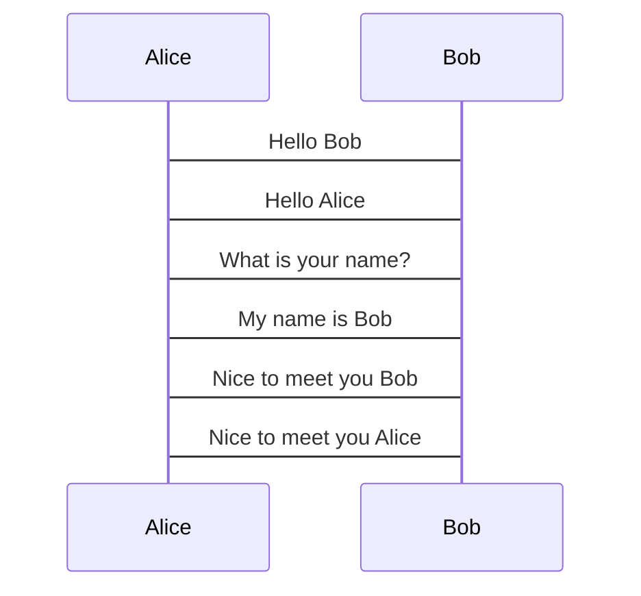
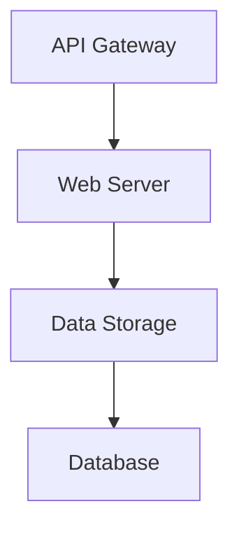
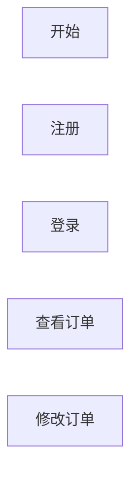

                 

# 使用Mermaid语法创建流程图表

> 关键词：流程图表, Mermaid, 语法, 图表绘制, 步骤详解, 实际应用

## 1. 背景介绍

### 1.1 问题由来
在软件开发过程中，流程图是非常常见的一种工具，用于描述和记录系统、算法或过程的执行流程。它可以帮助开发者更好地理解和沟通复杂的逻辑结构，提高软件的开发和维护效率。然而，手动绘制流程图不仅耗时耗力，还容易出现错误。

### 1.2 问题核心关键点
为了解决上述问题，开发人员需要一种便捷、高效且易于理解的图表绘制工具，而Mermaid正是一个非常好的选择。Mermaid是一个基于JavaScript的流程图和图表语法工具，可以用于描述各种流程、架构和图表，支持链图、时序图、状态图、组织图、流程图等。通过使用Mermaid，开发人员可以轻松绘制出清晰的流程图，大大提升开发效率。

### 1.3 问题研究意义
学习和掌握Mermaid语法，对于提升开发效率、改善团队协作以及优化软件架构具有重要意义。通过使用Mermaid，开发人员可以快速绘制出准确的流程图，减少沟通成本，提高系统开发和维护的效率，最终提升软件产品的质量和用户体验。

## 2. 核心概念与联系

### 2.1 核心概念概述
Mermaid的主要功能包括绘制各种类型的图表，如流程图、时序图、组织图、流程图等。这些图表的绘制主要基于Mermaid的语法规则，使用类JSON格式的代码，通过简单的字符串表示法即可生成各种图表。

### 2.2 Mermaid图表类型
以下是Mermaid支持的几种主要图表类型及其用途：

- **流程图**：用于描述系统的工作流程，可以用于敏捷开发、业务流程建模等。
- **时序图**：用于显示事件发生的时间顺序，常用于软件系统的架构设计。
- **组织图**：用于描述系统的组织结构，可以用于软件设计、项目管理等。
- **状态图**：用于描述系统的状态转换，常用于软件状态管理、用户界面设计等。

### 2.3 核心概念原理和架构的 Mermaid 流程图
以下是使用Mermaid语法绘制的一个简单的流程图示例：


该图表示一个简单的用户登录系统的工作流程，用户从开始到结束的整个过程。

## 3. 核心算法原理 & 具体操作步骤
### 3.1 算法原理概述

Mermaid的核心算法原理是基于简单的语法规则，将文本描述转换为图表。它主要通过以下几个步骤完成：

1. 解析文本：将用户输入的Mermaid语法文本解析为图表的节点和边。
2. 构建图表：根据解析结果构建图表的节点和边，并确定其布局和样式。
3. 渲染图表：将构建好的图表渲染为HTML、SVG等格式，供用户查看或保存。

### 3.2 算法步骤详解
下面是使用Mermaid绘制流程图的基本步骤：

1. 在支持Mermaid语法的编辑器中输入流程图代码。
2. 保存并渲染流程图，查看图表效果。
3. 根据渲染结果调整流程图代码，优化图表布局和样式。
4. 导出或嵌入流程图到其他文档中。

### 3.3 算法优缺点

使用Mermaid语法绘制流程图的优点包括：

- **简单易学**：Mermaid的语法非常简单，易于学习和掌握。
- **兼容性好**：支持多种图表类型和布局方式，适应不同的应用场景。
- **灵活性高**：用户可以根据自己的需求，自由定制图表的样式和布局。

缺点方面：

- **功能有限**：相较于专业的绘图工具，Mermaid的某些功能可能较为有限。
- **依赖性高**：依赖于JavaScript引擎的解析和渲染，可能存在兼容性问题。

### 3.4 算法应用领域

Mermaid语法主要应用于软件开发、项目管理、系统架构设计等领域，具体包括：

- **敏捷开发**：用于描述敏捷开发中的用户故事、任务清单和工作流程。
- **业务流程建模**：用于描述企业的业务流程和数据流。
- **系统架构设计**：用于描述软件系统的架构和组件关系。
- **项目管理和协作**：用于描述项目计划、任务分配和团队协作。

## 4. 数学模型和公式 & 详细讲解 & 举例说明

### 4.1 数学模型构建

Mermaid的图表绘制主要基于简单的文本语法，不涉及复杂的数学模型。以下是一个简单的流程图示例：


### 4.2 公式推导过程

由于Mermaid的图表绘制主要依赖于语法规则，没有复杂的数学模型推导过程。以下是上述流程图的代码，每个节点和边对应一个函数：

```js
graph LR
    node_start(A)[开始]
    node_end(F)[结束]
    node_process(B)[注册]
    node_process(C)[登录]
    node_process(D)[查看订单]
    node_process(E)[修改订单]
    edge_start_to_process(A, B)
    edge_process_to_process(B, C)
    edge_process_to_process(C, D)
    edge_process_to_process(D, E)
    edge_process_to_end(E, F)
```

### 4.3 案例分析与讲解

以下是一个使用Mermaid语法绘制的时序图示例：



该时序图表示Alice和Bob之间的对话过程。其中，`participant`用于定义参与者，`->`表示消息发送方向，箭头上方是消息内容。

## 5. 项目实践：代码实例和详细解释说明

### 5.1 开发环境搭建

首先，需要安装Mermaid的依赖库。以下是在Node.js环境下安装Mermaid的步骤：

1. 安装Node.js和npm。
2. 运行以下命令安装Mermaid：

```bash
npm install mermaid --save
```

### 5.2 源代码详细实现

以下是使用Mermaid语法绘制的流程图代码：


### 5.3 代码解读与分析

在上述代码中，`graph LR`表示创建一个流程图，`node`表示流程图中的节点，`edge`表示节点之间的边。每个节点和边都有唯一的标识符，用于区分不同的元素。通过简单的代码描述，即可绘制出一个清晰的流程图。

### 5.4 运行结果展示

保存上述代码到HTML文件中，并在浏览器中打开该文件，即可看到渲染后的流程图。以下是一个渲染后的流程图示例：

```
graph LR
    A[开始] --> B[注册]
    B --> C[登录]
    C --> D[查看订单]
    D --> E[修改订单]
    E --> F[结束]
```

## 6. 实际应用场景

### 6.1 软件开发

在软件开发过程中，使用Mermaid可以清晰地描述系统的架构和模块关系，帮助开发者更好地理解系统设计和实现。例如，以下是一个使用Mermaid语法绘制的架构图示例：



该架构图表示一个简单的API Gateway、Web Server和Data Storage之间的数据流。

### 6.2 项目管理

在项目管理中，使用Mermaid可以清晰地描述项目计划、任务分配和团队协作。例如，以下是一个使用Mermaid语法绘制的甘特图示例：

```mermaid
Gantt
    date 2022-01-01 2022-01-10
    section "项目阶段"
        1-A[阶段一]
        1-B[阶段二]
        1-C[阶段三]
    section "里程碑"
        1-A[里程碑一]
        1-B[里程碑二]
        1-C[里程碑三]
```

该甘特图表示项目分为三个阶段，每个阶段都有三个里程碑。

### 6.3 系统架构设计

在系统架构设计中，使用Mermaid可以清晰地描述系统组件之间的关系和数据流。例如，以下是一个使用Mermaid语法绘制的UML类图示例：

```mermaid
classDiagram
    Person "人"
    Person -->Carcass "肉"
    Person -->Blood "血"
    Carcass -->Bone "骨头"
    Bone -->Marrow "骨髓"
```

该UML类图表示一个简单的系统，包含人、肉、血、骨头和骨髓之间的类关系。

## 7. 工具和资源推荐

### 7.1 学习资源推荐

1. **Mermaid官网**：提供了详细的语法说明和示例，是学习Mermaid语法的首选资源。
2. **Mermaid图表教程**：一些在线资源提供了丰富的Mermaid图表绘制教程，包括流程图、时序图、状态图等。
3. **YouTube教学视频**：YouTube上有许多Mermaid语法的使用教程，适合视觉学习者。
4. **《JavaScript图表库：绘制流程图的简单工具》一书**：介绍了如何使用JavaScript实现流程图和图表的绘制，适合编程爱好者。

### 7.2 开发工具推荐

1. **Mermaid Live Editor**：一个在线的Mermaid图表编辑器，支持实时预览和调试。
2. **mermaid diagrams plugin**：适用于GitHub、GitLab等Git代码托管平台的Mermaid语法插件，方便在代码注释中直接绘制流程图。
3. **AutoDraw**：一个基于Mermaid语法的流程图编辑器，支持交互式绘制和导出。

### 7.3 相关论文推荐

以下是几篇关于Mermaid语法的相关论文，供深入学习参考：

1. **《Mermaid: A simple and powerful graph visualization library for developers》**：介绍了Mermaid语法的特点和使用方法。
2. **《Visualizing Complexity with Mermaid》**：介绍了如何使用Mermaid绘制复杂的图表，包括时序图、组织图、状态图等。
3. **《Designing User Interfaces with Mermaid》**：介绍了如何使用Mermaid绘制用户界面和系统架构图，提升用户体验。

## 8. 总结：未来发展趋势与挑战

### 8.1 研究成果总结

Mermaid语法作为一种简单的图表绘制工具，已经广泛应用于软件开发、项目管理、系统架构设计等多个领域。它的语法简洁明了，易于学习和使用，能够快速生成各种图表，极大地提升了开发效率。

### 8.2 未来发展趋势

1. **功能扩展**：随着需求的不断变化，未来Mermaid可能会扩展更多的图表类型和功能，支持更多复杂的场景。
2. **社区支持**：Mermaid社区会不断更新和完善语法规则和工具，提升用户体验和功能丰富度。
3. **应用场景拓展**：Mermaid将会进一步拓展应用场景，如游戏开发、艺术设计等领域。

### 8.3 面临的挑战

尽管Mermaid在语法和工具上已经非常成熟，但仍然面临一些挑战：

1. **兼容性和性能**：不同版本的浏览器和操作系统可能对Mermaid的兼容性有影响，需要持续优化和改进。
2. **语法规范**：Mermaid语法的规范和一致性还有待进一步提升，避免语法歧义和错误。
3. **教育普及**：如何让更多人了解和掌握Mermaid语法，需要进一步的宣传和教育。

### 8.4 研究展望

未来，Mermaid语法的应用将更加广泛，开发工具和社区支持将更加完善，语法规范和兼容性将进一步提升。开发者可以通过学习Mermaid语法，快速绘制各种图表，提升开发效率和系统设计水平。

## 9. 附录：常见问题与解答

**Q1: 如何使用Mermaid语法绘制流程图？**

A: 在Mermaid编辑器中输入流程图代码，保存并渲染即可。

**Q2: Mermaid语法是否支持中文？**

A: Mermaid语法本身不支持中文，但可以使用`&`转义符将中文代码进行转义，例如`"你好" -> "世界"`。

**Q3: Mermaid语法和UML类图有什么区别？**

A: Mermaid语法是一种通用的图表语法，可以绘制多种类型的图表，如流程图、时序图、状态图等。UML类图是Mermaid语法的一种特定应用，用于描述系统的类关系和结构。

**Q4: Mermaid语法是否支持嵌套？**

A: Mermaid语法支持嵌套，可以使用缩进来表示嵌套关系，例如：



**Q5: 如何修改Mermaid图表的样式？**

A: 可以通过在代码中添加样式属性来修改图表的样式，例如：


以上样式代码将节点A的背景色设置为红色。

---

作者：禅与计算机程序设计艺术 / Zen and the Art of Computer Programming

