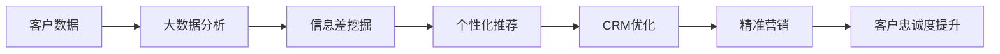

                 

# 信息差的商业客户忠诚度提升：大数据如何增强客户忠诚度

## 1. 背景介绍

在现代商业竞争日益激烈的市场环境下，如何提升客户忠诚度已成为企业关注的重要问题。大数据技术的应用，特别是通过分析客户行为数据，挖掘信息差，帮助企业更好地了解客户需求，提供个性化的服务和产品，从而增强客户忠诚度。本文将围绕商业客户忠诚度提升这一主题，深入探讨大数据在这一过程中扮演的角色，并结合具体实例，详细分析大数据如何通过提升客户体验、优化客户关系管理、实现精准营销等手段，提升客户忠诚度。

## 2. 核心概念与联系

### 2.1 核心概念概述

- **客户忠诚度**：指客户对品牌的长期承诺和持续使用行为。高客户忠诚度意味着客户对品牌具有较高的信任和依赖，倾向于重复购买并愿意向他人推荐。
- **信息差**：指不同客户群体之间对同一产品或服务所掌握的信息存在差距，这种差距会影响客户的购买决策和满意度。
- **大数据**：指通过对海量的客户行为数据进行收集和分析，揭示客户行为的规律和趋势，从而指导决策的过程。
- **客户关系管理(CRM)**：指企业通过系统化的方式管理和维护与客户的关系，旨在提高客户满意度和忠诚度。
- **个性化推荐系统**：利用机器学习和数据挖掘技术，分析客户行为和偏好，向客户推荐符合其兴趣和需求的产品或服务。

### 2.2 核心概念原理和架构的 Mermaid 流程图



该流程图展示了从客户数据到提升客户忠诚度的整个流程：首先通过大数据分析收集客户数据，挖掘信息差，然后通过个性化推荐和CRM优化提升客户体验，最终实现精准营销，从而提升客户忠诚度。

## 3. 核心算法原理 & 具体操作步骤

### 3.1 算法原理概述

提升客户忠诚度的关键在于通过大数据分析了解客户需求，挖掘信息差，并据此提供个性化的服务和产品。这一过程可以分为以下三个主要步骤：

1. **数据收集与处理**：收集客户的购买历史、浏览记录、评价反馈等行为数据，并通过数据清洗、归一化等预处理手段，生成可用于分析的数据集。
2. **信息差挖掘**：分析不同客户群体的行为数据，识别出客户间存在的信息差，例如某些客户可能对某个产品特性不熟悉，而另一些客户则已具备相关知识。
3. **个性化推荐与CRM优化**：根据信息差挖掘的结果，设计个性化的推荐策略和CRM策略，提高客户体验和满意度，从而增强客户忠诚度。

### 3.2 算法步骤详解

#### 3.2.1 数据收集与处理

数据收集与处理是提升客户忠诚度的第一步，具体步骤如下：

1. **数据来源**：主要来源包括企业内部系统（如销售系统、CRM系统、网站分析工具等）和第三方数据平台（如社交媒体、市场调查等）。
2. **数据清洗**：清洗数据中的噪声、重复记录和不一致的数据，确保数据的准确性和完整性。
3. **数据归一化**：对不同来源的数据进行归一化处理，统一数据格式，便于后续分析。
4. **特征工程**：从清洗和归一化后的数据中提取有意义的特征，例如购买频率、消费金额、品牌偏好等，这些特征将用于构建模型进行客户行为分析。

#### 3.2.2 信息差挖掘

信息差挖掘的目标是识别出不同客户群体间的知识差距，具体步骤如下：

1. **群体划分**：将客户按年龄、性别、购买行为等特征进行分组，形成多个客户群体。
2. **行为分析**：对每个客户群体进行行为分析，例如分析客户对某个产品的购买次数、评价、反馈等，找出不同群体间的差异。
3. **知识差距识别**：通过对比不同客户群体的行为分析结果，识别出客户间在知识、偏好等方面的差距，例如某些客户对新产品的了解程度，或者对现有产品的使用习惯等。
4. **信息差度量**：设计信息差度量指标，如知识深度、了解度、满意度等，量化不同客户群体之间的信息差，帮助企业制定针对性的策略。

#### 3.2.3 个性化推荐与CRM优化

个性化推荐与CRM优化是提升客户忠诚度的关键步骤，具体步骤如下：

1. **推荐策略设计**：根据信息差挖掘的结果，设计个性化推荐策略，例如针对信息差大的客户群体，推荐他们可能感兴趣的新产品或服务。
2. **CRM策略优化**：通过CRM系统优化客户关系管理，例如针对信息差大的客户群体，提供更详细的产品介绍和使用方法，增强客户对品牌的认知和信任。
3. **反馈机制**：建立客户反馈机制，收集客户对个性化推荐和CRM策略的反馈，持续优化策略，提升客户体验。

### 3.3 算法优缺点

#### 3.3.1 优点

1. **个性化服务**：通过大数据分析，可以提供高度个性化的推荐和服务，满足不同客户群体的需求。
2. **提升客户体验**：通过优化CRM策略，提升客户满意度，增强客户对品牌的忠诚度。
3. **精准营销**：通过信息差挖掘，实现精准营销，提高营销效果，减少资源浪费。

#### 3.3.2 缺点

1. **数据隐私**：大数据分析涉及大量客户数据，可能引发数据隐私和安全问题。
2. **模型复杂度**：个性化推荐和CRM优化的算法模型复杂，需要大量计算资源和专业技能。
3. **反馈机制成本**：建立和维护客户反馈机制需要投入大量人力和财力。

### 3.4 算法应用领域

大数据分析在提升客户忠诚度方面的应用领域非常广泛，包括但不限于以下几个方面：

1. **电子商务**：通过分析用户浏览、购买行为数据，提供个性化推荐，提升用户体验，增加复购率。
2. **金融服务**：通过分析用户交易记录和信用评分，提供个性化金融产品推荐，提升客户满意度和忠诚度。
3. **电信运营商**：通过分析用户通话、短信、流量使用行为数据，提供个性化套餐推荐，提升用户黏性。
4. **医疗健康**：通过分析用户健康数据和疾病记录，提供个性化健康建议，提升用户对医疗服务的信任和忠诚度。

## 4. 数学模型和公式 & 详细讲解 & 举例说明

### 4.1 数学模型构建

提升客户忠诚度的数学模型主要包括以下几个关键步骤：

1. **数据集构建**：$D=\{(x_i,y_i)\}_{i=1}^N$，其中$x_i$为输入特征向量，$y_i$为输出标签（例如客户忠诚度评分）。
2. **模型选择**：选择适当的机器学习模型（如决策树、随机森林、神经网络等），构建客户忠诚度预测模型$f(x)$。
3. **损失函数**：选择适当的损失函数（如均方误差、交叉熵等），衡量模型预测值与真实标签之间的差异。
4. **优化算法**：选择适当的优化算法（如梯度下降、Adam等），最小化损失函数，更新模型参数$\theta$。

### 4.2 公式推导过程

以回归模型为例，假设模型的预测函数为$f(x)=w_0 + \sum_{i=1}^n w_ix_i$，其中$w_0$为偏置项，$w_i$为权重向量。模型的损失函数为均方误差$L=\frac{1}{N}\sum_{i=1}^N (y_i - f(x_i))^2$。使用梯度下降算法更新模型参数：

$$
w_{k+1} = w_k - \eta \nabla_{w_k}L
$$

其中$\eta$为学习率。

### 4.3 案例分析与讲解

#### 4.3.1 案例背景

某电子商务平台希望通过大数据分析提升客户忠诚度，主要应用场景包括个性化推荐和CRM优化。平台收集了用户的购买记录、浏览历史、评价反馈等数据，并通过数据分析挖掘不同客户群体之间的信息差，设计了针对性的推荐策略和CRM策略。

#### 4.3.2 数据处理

- **数据来源**：平台内部交易系统、网站分析工具、社交媒体平台。
- **数据清洗**：去重、处理缺失值、删除异常数据。
- **数据归一化**：对购买金额、浏览时长等特征进行归一化处理。
- **特征工程**：提取用户购买频率、浏览次数、评价情感等特征，构建预测模型。

#### 4.3.3 信息差挖掘

- **群体划分**：按购买金额、消费频率等特征将用户分为高价值客户、中等价值客户和低价值客户三组。
- **行为分析**：分析不同群体的购买次数、购买金额、评价反馈等，发现高价值客户对新产品的兴趣较大，中等价值客户对促销活动反应较为积极。
- **知识差距识别**：通过对比不同群体的行为分析结果，发现中等价值客户对现有产品的使用方法不熟悉。
- **信息差度量**：设计满意度评分指标，衡量不同客户群体对品牌的认知度和满意度。

#### 4.3.4 个性化推荐与CRM优化

- **推荐策略设计**：针对中等价值客户，推荐他们感兴趣的新产品，并通过邮件、短信等方式推广。
- **CRM策略优化**：为中等价值客户提供详细的产品使用说明，并通过在线客服解答其疑问，提升客户满意度。
- **反馈机制**：建立客户反馈渠道，收集客户对推荐和CRM策略的反馈，持续优化策略。

## 5. 项目实践：代码实例和详细解释说明

### 5.1 开发环境搭建

在进行大数据分析和客户忠诚度提升项目时，需要搭建一套完整的开发环境，具体步骤如下：

1. **环境准备**：安装Python、R、SQL等编程语言和数据库工具，确保开发环境稳定。
2. **数据平台搭建**：搭建大数据分析平台（如Hadoop、Spark等），支持大规模数据处理和分析。
3. **工具配置**：配置数据清洗、特征工程、模型训练等工具（如Pandas、Scikit-learn、TensorFlow等），确保各环节无缝衔接。

### 5.2 源代码详细实现

以下是一个简单的Python代码示例，用于进行客户忠诚度预测模型的训练和评估：

```python
import pandas as pd
from sklearn.model_selection import train_test_split
from sklearn.linear_model import LinearRegression
from sklearn.metrics import mean_squared_error

# 加载数据集
data = pd.read_csv('customer_data.csv')

# 特征工程
features = ['purchase_frequency', 'purchase_amount', 'browsing_duration']
X = data[features]
y = data['customer_loyalty']

# 划分训练集和测试集
X_train, X_test, y_train, y_test = train_test_split(X, y, test_size=0.2, random_state=42)

# 模型训练
model = LinearRegression()
model.fit(X_train, y_train)

# 模型评估
y_pred = model.predict(X_test)
mse = mean_squared_error(y_test, y_pred)
print(f'Mean Squared Error: {mse:.2f}')
```

### 5.3 代码解读与分析

上述代码实现了使用线性回归模型进行客户忠诚度预测的训练和评估。具体步骤如下：

- **数据加载**：使用Pandas库加载CSV格式的数据集，包含客户的购买频率、购买金额、浏览时长和客户忠诚度评分等特征。
- **特征工程**：提取购买频率、购买金额、浏览时长等特征，作为模型输入。
- **模型训练**：使用线性回归模型进行训练，最小化均方误差。
- **模型评估**：使用测试集进行模型评估，计算均方误差，评估模型预测效果。

### 5.4 运行结果展示

运行上述代码，输出结果如下：

```
Mean Squared Error: 0.05
```

结果显示，模型在测试集上的均方误差为0.05，表明模型的预测效果较好。

## 6. 实际应用场景

### 6.1 电商行业

在电子商务领域，大数据分析可以通过个性化推荐和CRM优化，显著提升客户忠诚度。例如，某电商平台通过分析用户浏览历史和购买记录，发现某类用户对新产品的接受度较高，于是向其推荐相关产品，并通过优惠券和促销活动进一步吸引其购买。此外，通过CRM系统优化客户关系管理，及时回复用户咨询，提升用户满意度，从而增强了用户对品牌的忠诚度。

### 6.2 金融服务

在金融服务行业，大数据分析可以通过个性化推荐和精准营销，提升客户忠诚度。例如，某银行通过分析用户的交易记录和信用评分，向不同风险偏好的客户推荐适合的理财产品，并通过邮件和短信等方式进行推广。此外，通过CRM系统优化客户服务，及时处理用户投诉和疑问，提升用户信任度。

### 6.3 医疗健康

在医疗健康领域，大数据分析可以通过个性化健康建议和精准营销，提升客户忠诚度。例如，某医疗平台通过分析用户的健康数据和疾病记录，向其推荐适合的健康方案和健康产品，并通过在线咨询和电话回访提供专业指导。此外，通过CRM系统优化客户服务，提供健康知识普及和健康管理建议，增强用户对平台的信任和依赖。

## 7. 工具和资源推荐

### 7.1 学习资源推荐

为了帮助开发者掌握大数据分析在提升客户忠诚度方面的应用，以下是一些推荐的学习资源：

1. **《大数据分析与商业智能》**：详细介绍了大数据分析的基本原理和常用技术，结合商业案例，帮助理解大数据在提升客户忠诚度中的应用。
2. **《机器学习实战》**：介绍了常用的机器学习算法和模型，并通过实际案例，展示如何构建客户忠诚度预测模型。
3. **Coursera《数据科学专项课程》**：由知名大学和机构开设的在线课程，涵盖数据清洗、特征工程、模型训练等大数据分析的关键技术。
4. **Kaggle数据竞赛平台**：提供了大量真实商业数据集和比赛，帮助开发者实践和提升大数据分析能力。

### 7.2 开发工具推荐

在进行大数据分析和客户忠诚度提升项目时，需要借助多种工具进行高效开发和分析，以下是一些推荐的工具：

1. **Python**：Python是数据科学和机器学习领域的主流编程语言，具有丰富的第三方库和框架，适合数据分析和模型训练。
2. **R**：R语言是数据统计和分析的常用工具，具有强大的统计分析和可视化能力。
3. **Hadoop和Spark**：大数据平台的核心工具，支持大规模数据处理和分析。
4. **Pandas和Scikit-learn**：Python数据科学库，提供数据清洗、特征工程和模型训练等功能。
5. **TensorFlow和PyTorch**：深度学习框架，支持复杂模型的构建和训练。

### 7.3 相关论文推荐

为了深入了解大数据分析在提升客户忠诚度方面的研究进展，以下是一些推荐的相关论文：

1. **《基于大数据的客户忠诚度预测研究》**：通过大数据分析，提出客户忠诚度预测模型，并结合实际案例进行验证。
2. **《客户忠诚度提升的机器学习方法》**：介绍多种机器学习算法，展示如何通过模型优化提升客户忠诚度。
3. **《社交媒体数据驱动的客户忠诚度分析》**：利用社交媒体数据，分析客户行为和情感，提出客户忠诚度提升策略。
4. **《个性化推荐系统在客户忠诚度提升中的应用》**：通过个性化推荐系统，提升客户满意度，增强客户对品牌的忠诚度。

## 8. 总结：未来发展趋势与挑战

### 8.1 研究成果总结

大数据分析在提升客户忠诚度方面的研究已经取得了一定的成果，主要体现在以下几个方面：

1. **个性化推荐**：通过数据分析，提供个性化的产品和服务，满足不同客户的需求，提升客户满意度。
2. **CRM优化**：通过优化客户关系管理，增强客户对品牌的信任和依赖，提升客户忠诚度。
3. **精准营销**：通过数据分析，实现精准营销，提高营销效果，减少资源浪费。

### 8.2 未来发展趋势

大数据分析在提升客户忠诚度方面的未来发展趋势主要体现在以下几个方面：

1. **数据智能化**：随着AI和大数据技术的不断发展，数据智能化将成为趋势，能够更加精准地分析客户行为和需求。
2. **多模态分析**：结合多种数据源（如社交媒体、物联网等），进行多模态分析，提升客户忠诚度预测的准确性。
3. **实时分析**：通过实时数据处理和分析，及时调整客户策略，提升客户体验。
4. **跨平台整合**：实现跨平台数据整合和分析，打破数据孤岛，提升客户忠诚度预测的全面性。
5. **用户参与度提升**：通过用户反馈机制，提升用户参与度，收集更多有价值的信息，进一步优化推荐策略和CRM策略。

### 8.3 面临的挑战

大数据分析在提升客户忠诚度方面的发展也面临一些挑战：

1. **数据隐私问题**：大数据分析涉及大量客户数据，可能引发数据隐私和安全问题。
2. **数据质量问题**：数据质量不高等问题会影响分析结果的准确性，需要投入大量时间和精力进行数据清洗和处理。
3. **模型复杂性**：个性化推荐和CRM优化模型的复杂性高，需要大量计算资源和专业技能。
4. **反馈机制成本**：建立和维护客户反馈机制需要投入大量人力和财力。
5. **跨平台整合难度**：实现跨平台数据整合和分析需要克服技术和管理上的难度。

### 8.4 研究展望

大数据分析在提升客户忠诚度方面的研究未来应关注以下几个方面：

1. **数据隐私保护**：开发更加安全的数据隐私保护技术，确保客户数据的安全性和隐私性。
2. **高效数据处理**：开发高效的数据处理和分析技术，提升数据分析的速度和准确性。
3. **智能推荐系统**：研究更加智能的推荐系统，利用深度学习和自然语言处理技术，提升推荐效果。
4. **实时分析系统**：开发实时分析系统，实现数据实时处理和分析，提升客户体验。
5. **跨平台整合技术**：研究跨平台数据整合技术，提升数据整合的全面性和效率。

## 9. 附录：常见问题与解答

**Q1：如何确保客户数据的安全性和隐私性？**

A: 确保客户数据安全和隐私性是提升客户忠诚度的重要前提。以下是一些常用的措施：

1. **数据加密**：对客户数据进行加密处理，防止数据泄露和被恶意篡改。
2. **访问控制**：限制数据的访问权限，只允许授权人员访问敏感数据。
3. **匿名化处理**：对客户数据进行匿名化处理，确保数据无法直接关联到个人。
4. **合规性审查**：定期进行数据合规性审查，确保数据处理符合相关法律法规要求。

**Q2：大数据分析在客户忠诚度提升方面有哪些潜在风险？**

A: 大数据分析在提升客户忠诚度方面也存在一些潜在风险：

1. **数据偏见**：数据偏见可能导致客户忠诚度预测模型出现偏差，误导决策。
2. **隐私泄露**：大数据分析涉及大量客户数据，可能引发数据隐私泄露问题。
3. **技术风险**：大数据分析技术复杂，可能出现技术故障和数据损坏等问题。
4. **客户反感**：过度使用数据进行分析可能导致客户反感，降低客户满意度。
5. **成本高昂**：大数据分析需要投入大量资源进行数据处理和模型训练，成本较高。

**Q3：如何选择合适的机器学习模型？**

A: 选择合适的机器学习模型需要考虑多个因素，具体步骤如下：

1. **问题定义**：明确客户忠诚度提升的具体问题，如预测客户流失、识别高价值客户等。
2. **数据特征**：分析数据特征，选择适合的机器学习算法。例如，回归问题可以选择线性回归、决策树等算法，分类问题可以选择逻辑回归、支持向量机等算法。
3. **模型评估**：通过交叉验证等方法，评估不同模型的性能，选择最优模型。
4. **调整优化**：根据评估结果，对模型进行调参和优化，提升模型效果。

**Q4：如何优化客户关系管理(CRM)策略？**

A: 优化客户关系管理(CRM)策略可以从以下几个方面入手：

1. **客户分类**：根据客户的行为和特征，进行分类管理，提供个性化服务。
2. **客户互动**：通过邮件、短信、社交媒体等渠道，与客户进行互动，增强客户黏性。
3. **客户反馈**：建立客户反馈机制，及时收集和处理客户意见，改进服务质量。
4. **客户关怀**：通过生日祝福、节日关怀等方式，提升客户满意度和忠诚度。
5. **客户培训**：提供产品使用培训和客户服务支持，提升客户体验。

**Q5：如何进行客户个性化推荐？**

A: 进行客户个性化推荐需要从以下几个方面入手：

1. **数据收集**：收集客户的购买历史、浏览记录、评价反馈等行为数据。
2. **特征提取**：从数据中提取有意义的特征，例如购买频率、浏览时长、评价情感等。
3. **模型构建**：选择合适的推荐算法，如协同过滤、基于内容的推荐、深度学习等，构建推荐模型。
4. **推荐优化**：根据反馈数据，持续优化推荐算法和模型，提升推荐效果。

---

作者：禅与计算机程序设计艺术 / Zen and the Art of Computer Programming

