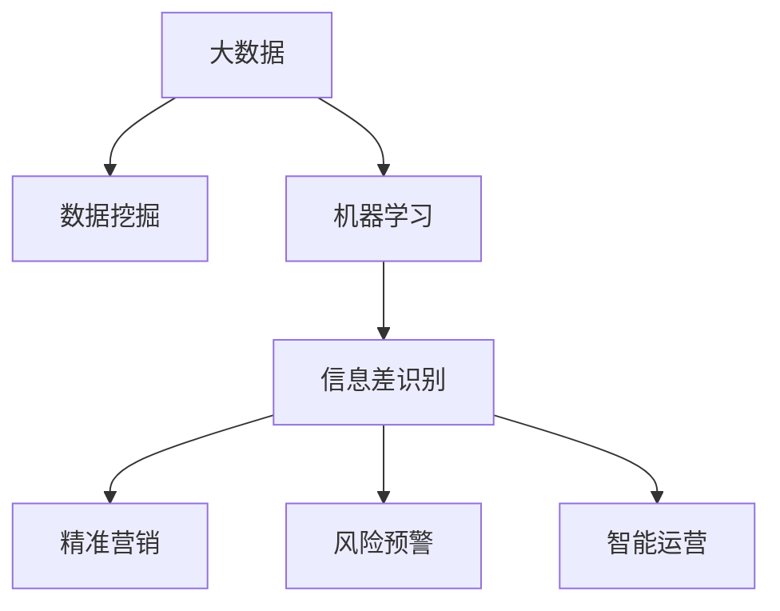

                 

# 信息差的商业机遇发现：大数据如何发现商业机遇

在数字经济时代，数据正成为一种宝贵的资源，企业可以通过大数据技术发现信息差，获取潜在的商业机遇。本文将系统探讨大数据如何帮助企业发现信息差，获取商业机遇。

## 1. 背景介绍

### 1.1 问题由来

随着互联网的普及和智能终端的广泛应用，数据已经成为各行业的重要资产。然而，海量的数据往往具有非结构化、异构性、复杂性等特点，传统的数据处理方法难以应对。如何在数据海洋中发现潜在的商业机遇，成为了各企业面临的重要挑战。

信息差，指的是市场信息的不对称。传统线下市场中，由于地域、时间、资源等因素的限制，商家与消费者之间存在信息差。而随着互联网的普及，这种信息差逐渐被打破。但信息差并未消失，反而在数据驱动的商业竞争中变得更为重要。大数据技术为企业提供了数据驱动的决策支持，帮助企业在数据中发现信息差，获取商业机遇。

### 1.2 问题核心关键点

- 数据驱动决策：通过数据挖掘、机器学习等技术，提取有价值的信息，辅助企业决策。
- 信息差识别：在市场中识别出供需失衡、价格波动等现象，发现潜在的商业机遇。
- 精准营销：通过数据分析，实现精准的目标市场定位，提升营销效果。
- 风险预警：在数据中检测出市场风险，提前做好应对措施。
- 智能运营：通过数据分析优化运营管理，提高企业效率和竞争力。

## 2. 核心概念与联系

### 2.1 核心概念概述

为更好地理解大数据如何发现商业机遇，本节将介绍几个密切相关的核心概念：

- 大数据：指规模大、速度高、类型多、价值密度低的数据集合，通过数据处理技术对其进行分析和利用。
- 数据挖掘：指从大数据中提取有价值信息和知识的过程，常用的技术包括分类、聚类、关联规则等。
- 机器学习：指通过训练模型，从数据中学习知识并用于预测或分类等任务的技术。
- 信息差：指市场中信息的不对称现象，供需、价格、市场动态等方面存在信息的不平衡。
- 商业机遇：指通过发现信息差，抓住市场机会，实现商业目标的过程。

这些核心概念之间的逻辑关系可以通过以下Mermaid流程图来展示：



这个流程图展示了大数据、数据挖掘、机器学习等信息技术与商业机遇发现之间的逻辑关系：

1. 大数据通过数据处理技术，为数据挖掘和机器学习提供了数据支持。
2. 数据挖掘和机器学习技术从大数据中提取有价值的信息，识别出市场信息差。
3. 信息差识别结果可以用于精准营销、风险预警和智能运营，帮助企业获取商业机遇。

## 3. 核心算法原理 & 具体操作步骤

### 3.1 算法原理概述

大数据通过数据挖掘和机器学习技术，从海量数据中提取有价值的信息，识别出市场中的信息差，发现商业机遇。其核心思想是：通过数据分析发现市场趋势、供需关系、价格波动等现象，进而识别出市场中的信息差，为企业的决策提供支持。

### 3.2 算法步骤详解

基于大数据技术发现商业机遇，一般包括以下几个关键步骤：

**Step 1: 数据收集与预处理**
- 确定数据来源，包括内部数据和外部数据。
- 对数据进行清洗、去重、归一化等预处理操作，确保数据质量。
- 对数据进行特征工程，提取关键特征，为后续分析提供支持。

**Step 2: 数据挖掘与建模**
- 选择合适的数据挖掘算法，如聚类、分类、关联规则等。
- 对数据进行建模，构建预测模型，评估模型的准确性和鲁棒性。
- 应用模型对数据进行预测，发现市场中的信息差。

**Step 3: 商业机遇分析**
- 识别出信息差后，进行商业分析，评估其潜在价值。
- 结合市场情况，制定具体的商业策略，抓住商业机遇。
- 实施商业策略，实现商业目标。

### 3.3 算法优缺点

基于大数据技术发现商业机遇，具有以下优点：
1. 数据驱动：通过数据分析，辅助企业决策，减少人为误差。
2. 精准识别：大数据技术可以从多角度分析市场数据，识别出细微的信息差。
3. 预测准确：通过建模和预测，企业可以预测市场趋势，及时抓住机遇。

同时，该方法也存在一定的局限性：
1. 数据质量要求高：需要高质量、大样本的数据支持，数据质量不高会导致分析结果不准确。
2. 算法复杂度大：数据挖掘和建模的复杂度较高，需要较强的技术能力。
3. 结果解释性不足：分析结果需要一定的专业知识，不易解释。

尽管存在这些局限性，但就目前而言，大数据技术仍然是大规模商业机遇发现的重要手段。未来相关研究的重点在于如何进一步降低算法复杂度，提高结果的可解释性，以及提升数据质量等。

### 3.4 算法应用领域

基于大数据技术发现商业机遇，已经在诸多领域得到应用，例如：

- 零售行业：通过大数据分析，发现消费者行为和市场趋势，制定精准营销策略，提升销售额。
- 金融行业：通过大数据分析，发现市场风险和投资机会，制定风险控制和投资策略，提升投资回报率。
- 医疗行业：通过大数据分析，发现疾病流行趋势和健康数据，制定预防措施，提升医疗服务质量。
- 制造行业：通过大数据分析，发现生产流程中的效率瓶颈，优化生产工艺，提升生产效率。
- 物流行业：通过大数据分析，发现运输路线和配送问题，优化物流路线，提升物流效率。
- 旅游行业：通过大数据分析，发现旅游热点的变化趋势，制定旅游促销策略，提升旅游收入。

除了上述这些经典领域外，大数据技术还在更多行业领域得到创新应用，为企业带来新的商业机遇。

## 4. 数学模型和公式 & 详细讲解 & 举例说明

### 4.1 数学模型构建

本节将使用数学语言对大数据技术发现商业机遇的过程进行更加严格的刻画。

记数据集为 $D=\{(x_i,y_i)\}_{i=1}^N$，其中 $x_i$ 为特征向量，$y_i$ 为标签。通过数据挖掘和机器学习，得到模型 $M$，对新数据 $x$ 进行预测，得到结果 $M(x)$。模型的预测误差为 $e_i=M(x_i)-y_i$。

### 4.2 公式推导过程

以下我们以聚类算法为例，推导聚类模型的核心公式。

聚类算法将数据分为若干组，使得组内数据相似度较高，组间数据相似度较低。常用的聚类算法有K-means、层次聚类等。

对于K-means算法，其核心公式为：

$$
\min_{\mu_k} \sum_{i=1}^N \min_{k=1}^K d(x_i,\mu_k)^2
$$

其中 $d(x_i,\mu_k)$ 为样本 $x_i$ 与聚类中心 $\mu_k$ 之间的距离，$K$ 为聚类组数。

### 4.3 案例分析与讲解

假设某零售企业想要通过大数据技术发现潜在的商业机遇。

**案例描述**：
- 数据来源：内部销售数据、顾客行为数据、天气数据、节假日数据等。
- 数据预处理：清洗数据、处理缺失值、特征工程等。
- 数据挖掘：通过聚类算法将顾客分为不同群体，发现顾客购买行为的差异性。
- 建模：构建回归模型，预测销售额的变化趋势。
- 商业分析：分析不同群体购买行为的差异，制定精准营销策略，提升销售额。

**案例分析**：
- 数据来源：内部销售数据、顾客行为数据、天气数据、节假日数据等。
- 数据预处理：清洗数据、处理缺失值、特征工程等。
- 数据挖掘：通过聚类算法将顾客分为不同群体，发现顾客购买行为的差异性。
- 建模：构建回归模型，预测销售额的变化趋势。
- 商业分析：分析不同群体购买行为的差异，制定精准营销策略，提升销售额。

**案例结论**：
- 通过大数据技术，该企业可以识别出顾客的购买行为差异，制定精准的营销策略，提升销售额。
- 大数据技术可以发现市场中的信息差，为企业提供有价值的商业机遇。

## 5. 项目实践：代码实例和详细解释说明

### 5.1 开发环境搭建

在进行大数据项目实践前，我们需要准备好开发环境。以下是使用Python进行项目实践的环境配置流程：

1. 安装Anaconda：从官网下载并安装Anaconda，用于创建独立的Python环境。

2. 创建并激活虚拟环境：
```bash
conda create -n data-env python=3.8 
conda activate data-env
```

3. 安装相关工具包：
```bash
pip install numpy pandas scikit-learn matplotlib seaborn
```

4. 安装数据处理工具：
```bash
pip install dask pandas-gbq
```

5. 安装可视化工具：
```bash
pip install matplotlib seaborn
```

完成上述步骤后，即可在`data-env`环境中开始项目实践。

### 5.2 源代码详细实现

我们以零售行业为例，给出使用Python进行大数据分析的代码实现。

**数据准备**：
```python
import pandas as pd
from google.cloud import bigquery
import gspread

# 从Google BigQuery中获取数据
client = bigquery.Client()
query = client.query('SELECT * FROM `project.dataset.table`')
df = query.to_dataframe()

# 将数据保存到本地
df.to_csv('data.csv', index=False)

# 从Google Sheets中获取数据
spreadsheet = gspread.open('SheetName')
worksheet = spreadsheet.get_worksheet('Sheet1')
rows = worksheet.get_all_records()
df = pd.DataFrame(rows)
df.to_csv('data.csv', index=False)
```

**数据清洗与预处理**：
```python
import pandas as pd

# 读取数据
df = pd.read_csv('data.csv')

# 数据清洗
df = df.dropna()  # 去除缺失值
df = df.drop_duplicates()  # 去除重复行

# 特征工程
df['weather'] = df['weather'].fillna(df['weather'].mode()[0])  # 处理缺失值
df['day'] = pd.to_datetime(df['date']).dt.day_name()  # 将日期转化为星期

# 特征选择
selected_features = ['price', 'category', 'date', 'weather', 'day', 'location']
df = df[selected_features]
```

**数据挖掘与建模**：
```python
import pandas as pd
from sklearn.cluster import KMeans
from sklearn.decomposition import PCA

# 数据挖掘：K-means聚类
X = df.drop('price', axis=1)
y = df['price']
kmeans = KMeans(n_clusters=5)
kmeans.fit(X)
df['cluster'] = kmeans.predict(X)

# 数据可视化
import matplotlib.pyplot as plt
plt.scatter(df['price'], df['cluster'])
plt.xlabel('Price')
plt.ylabel('Cluster')
plt.show()

# 建模：线性回归
from sklearn.linear_model import LinearRegression

X = df.drop(['price', 'cluster'], axis=1)
y = df['price']
model = LinearRegression()
model.fit(X, y)
```

**商业分析与策略制定**：
```python
import pandas as pd

# 商业分析：分析不同群体的购买行为
df_grouped = df.groupby('cluster').agg({'price': 'mean'})
df_grouped = df_grouped.reset_index()

# 策略制定：制定精准营销策略
strategy = pd.DataFrame()
strategy['group'] = df_grouped['cluster'].tolist()
strategy['sales'] = df_grouped['price'].tolist()
```

### 5.3 代码解读与分析

让我们再详细解读一下关键代码的实现细节：

**数据准备**：
- 使用Google BigQuery和Google Sheets获取数据，并将其保存到本地。

**数据清洗与预处理**：
- 使用Pandas进行数据清洗，包括去除缺失值、重复行，处理日期数据等。
- 使用特征工程方法，选择关键特征，为后续分析提供支持。

**数据挖掘与建模**：
- 使用K-means算法进行聚类，将数据分为不同群体，识别出顾客购买行为的差异性。
- 使用线性回归模型进行建模，预测销售额的变化趋势。

**商业分析与策略制定**：
- 使用Pandas进行数据分析，发现不同群体的购买行为差异。
- 制定精准营销策略，提升销售额。

## 6. 实际应用场景

### 6.1 智能制造

在智能制造领域，大数据技术可以用于优化生产流程、降低成本、提高生产效率。通过分析生产线上的数据，企业可以发现生产中的瓶颈，优化生产工艺，提高产品质量。

例如，某制造企业可以通过大数据分析，发现生产线上的故障点，及时进行维修，避免生产中断。同时，通过分析生产数据，优化生产计划，提高生产效率，减少生产成本。

### 6.2 智慧城市

在智慧城市领域，大数据技术可以用于交通管理、环境监测、城市规划等。通过分析城市中的数据，企业可以发现城市运行中的问题，提出优化方案，提高城市管理水平。

例如，某智慧城市可以通过大数据分析，发现交通拥堵情况，调整交通信号灯，缓解交通压力。同时，通过分析环境数据，预测污染情况，提出环保措施，改善城市环境。

### 6.3 医疗健康

在医疗健康领域，大数据技术可以用于疾病预测、病患管理、医疗资源优化等。通过分析医疗数据，企业可以发现疾病流行趋势，制定预防措施，提高医疗服务质量。

例如，某医疗机构可以通过大数据分析，发现某地区的疾病流行情况，制定预防措施，减少疾病传播。同时，通过分析病患数据，优化病患管理，提高医疗服务效率。

### 6.4 未来应用展望

随着大数据技术的不断发展，其在商业机遇发现中的应用将更加广泛。未来可能涉及以下领域：

1. 智能农业：通过大数据分析，优化农业生产，提高农业产量和质量。
2. 环境保护：通过大数据分析，发现环境污染趋势，制定环保措施，改善环境质量。
3. 智能物流：通过大数据分析，优化物流路线，提高物流效率，降低物流成本。
4. 金融服务：通过大数据分析，发现市场风险，制定投资策略，提升投资回报率。
5. 智能客服：通过大数据分析，优化客服流程，提高客户满意度，提升客户忠诚度。

以上领域的大数据应用，将为企业带来更多的商业机遇，提升企业的竞争力和市场份额。

## 7. 工具和资源推荐

### 7.1 学习资源推荐

为了帮助开发者系统掌握大数据技术的应用，这里推荐一些优质的学习资源：

1. 《Python数据分析》系列书籍：介绍了Python在数据分析中的应用，适合初学者入门。
2. 《数据科学导论》课程：由MIT开放课程，介绍了数据科学的基本概念和应用。
3. 《Big Data技术与应用》书籍：介绍了大数据技术的原理和应用，适合进阶学习。
4. Kaggle平台：数据科学竞赛平台，提供了大量的数据集和竞赛项目，适合实战练习。
5. DataCamp：在线学习平台，提供了丰富的数据分析和机器学习课程，适合自学。

通过对这些资源的学习实践，相信你一定能够快速掌握大数据技术的精髓，并用于解决实际的商业问题。

### 7.2 开发工具推荐

高效的开发离不开优秀的工具支持。以下是几款用于大数据项目开发的常用工具：

1. Jupyter Notebook：免费的开源交互式计算环境，支持Python、R等多种编程语言，方便实验和记录。
2. PySpark：Apache Spark的Python API，支持大规模数据处理和分析。
3. Hadoop：Apache Hadoop的开源实现，支持大规模数据存储和计算。
4. SparkSQL：Spark的SQL接口，支持大规模数据处理和分析。
5. Apache Flink：开源流处理框架，支持实时数据处理和分析。
6. TensorFlow：由Google开发的开源深度学习框架，支持大规模数据处理和分析。

合理利用这些工具，可以显著提升大数据项目开发的效率，加快创新迭代的步伐。

### 7.3 相关论文推荐

大数据技术的发展源于学界的持续研究。以下是几篇奠基性的相关论文，推荐阅读：

1. 《Google BigQuery：大规模数据查询服务》：介绍了Google BigQuery的大规模数据处理能力。
2. 《Apache Spark：快速大数据处理引擎》：介绍了Apache Spark的大数据处理能力。
3. 《TensorFlow：灵活的机器学习框架》：介绍了TensorFlow的机器学习能力。
4. 《K-means算法》：介绍了K-means算法的聚类能力。
5. 《线性回归模型》：介绍了线性回归模型的预测能力。

这些论文代表了大数据技术的发展脉络。通过学习这些前沿成果，可以帮助研究者把握学科前进方向，激发更多的创新灵感。

## 8. 总结：未来发展趋势与挑战

### 8.1 总结

本文对大数据技术如何发现商业机遇进行了全面系统的介绍。首先阐述了大数据技术在商业机遇发现中的重要性，明确了大数据技术如何帮助企业发现信息差，获取商业机遇。其次，从原理到实践，详细讲解了大数据技术发现商业机遇的数学模型和操作步骤，给出了大数据项目开发的完整代码实例。同时，本文还广泛探讨了大数据技术在智能制造、智慧城市、医疗健康等诸多行业领域的应用前景，展示了大数据技术的巨大潜力。最后，本文精选了大数据技术的各类学习资源，力求为读者提供全方位的技术指引。

通过本文的系统梳理，可以看到，大数据技术已经成为企业发现商业机遇的重要工具，大大提升了企业的竞争力和市场份额。未来，伴随大数据技术的不断演进，企业将更加依赖于数据分析来驱动决策，发现更多的商业机遇。

### 8.2 未来发展趋势

展望未来，大数据技术的发展趋势如下：

1. 数据规模继续增大：随着物联网、5G等技术的普及，数据量将进一步增大，大数据技术将面临更高的处理需求。
2. 数据处理效率提升：通过技术创新，提升数据处理效率，减少数据处理时间。
3. 数据处理能力增强：通过引入分布式计算、流处理等技术，提升大数据处理能力。
4. 数据处理成本降低：通过优化算法和资源配置，降低数据处理成本。
5. 数据质量提升：通过数据清洗、数据标注等方法，提升数据质量，确保分析结果的准确性。
6. 数据治理优化：通过数据治理技术，优化数据生命周期管理，提高数据利用率。

以上趋势凸显了大数据技术的广阔前景。这些方向的探索发展，必将进一步提升大数据技术在商业中的应用，为企业的决策支持提供更坚实的保障。

### 8.3 面临的挑战

尽管大数据技术已经取得了一定的进展，但在迈向更加智能化、普适化应用的过程中，它仍面临着诸多挑战：

1. 数据隐私和安全：大数据分析中涉及大量敏感数据，如何保障数据隐私和安全，防止数据泄露，是一个重要问题。
2. 数据质量问题：数据质量不高，数据不完整、不准确，会导致分析结果不准确。
3. 数据处理成本高：大数据处理需要大量的计算资源，如何降低成本，是当前的一个重要挑战。
4. 数据处理延迟：大规模数据处理需要较长的时间，如何提高数据处理速度，减少延迟，是未来的重要研究方向。
5. 数据标注难度大：数据标注需要大量人工工作，如何降低标注成本，提高标注效率，是一个重要问题。
6. 数据治理复杂：大数据治理涉及数据采集、存储、处理、应用等各个环节，如何全面治理，提高数据利用率，是未来的重要研究方向。

正视大数据技术面临的这些挑战，积极应对并寻求突破，将是大数据技术走向成熟的必由之路。相信随着学界和产业界的共同努力，这些挑战终将一一被克服，大数据技术必将在更多行业领域发挥重要作用。

### 8.4 研究展望

面对大数据技术面临的种种挑战，未来的研究需要在以下几个方面寻求新的突破：

1. 数据隐私保护技术：研究如何保护数据隐私，防止数据泄露，保障数据安全。
2. 数据质量提升技术：研究如何提高数据质量，确保分析结果的准确性。
3. 数据处理加速技术：研究如何提升数据处理速度，减少延迟，提高数据处理效率。
4. 数据标注自动化技术：研究如何降低数据标注成本，提高标注效率。
5. 数据治理技术：研究如何全面治理数据，提高数据利用率。
6. 智能数据分析技术：研究如何通过机器学习、深度学习等技术，提升数据分析的智能化水平，提高数据分析结果的准确性和可解释性。

这些研究方向的探索，必将引领大数据技术迈向更高的台阶，为构建安全、可靠、可解释、可控的智能系统铺平道路。面向未来，大数据技术还需要与其他人工智能技术进行更深入的融合，如知识表示、因果推理、强化学习等，多路径协同发力，共同推动大数据技术的发展。只有勇于创新、敢于突破，才能不断拓展大数据技术的边界，让数据驱动的决策更具科学性和可靠性。

## 9. 附录：常见问题与解答

**Q1：大数据技术如何发现商业机遇？**

A: 大数据技术可以通过数据挖掘和机器学习技术，从海量数据中提取有价值的信息，识别出市场中的信息差。通过分析不同群体的购买行为，识别出市场中的信息差，制定精准的营销策略，提升销售额。大数据技术可以发现市场中的信息差，为企业提供有价值的商业机遇。

**Q2：大数据技术发现商业机遇有哪些步骤？**

A: 大数据技术发现商业机遇一般包括以下几个关键步骤：数据收集与预处理、数据挖掘与建模、商业分析与策略制定。

1. 数据收集与预处理：确定数据来源，对数据进行清洗、去重、归一化等预处理操作，提取关键特征，为后续分析提供支持。
2. 数据挖掘与建模：选择合适的数据挖掘算法，对数据进行建模，构建预测模型，评估模型的准确性和鲁棒性。
3. 商业分析与策略制定：分析市场中的信息差，制定具体的商业策略，抓住商业机遇。

**Q3：大数据技术发现商业机遇有哪些应用场景？**

A: 大数据技术发现商业机遇已经在诸多领域得到应用，例如：

- 零售行业：通过大数据分析，发现消费者行为和市场趋势，制定精准营销策略，提升销售额。
- 金融行业：通过大数据分析，发现市场风险和投资机会，制定风险控制和投资策略，提升投资回报率。
- 医疗行业：通过大数据分析，发现疾病流行趋势和健康数据，制定预防措施，提升医疗服务质量。
- 制造行业：通过大数据分析，发现生产流程中的效率瓶颈，优化生产工艺，提升生产效率。
- 物流行业：通过大数据分析，发现运输路线和配送问题，优化物流路线，提升物流效率。
- 旅游行业：通过大数据分析，发现旅游热点的变化趋势，制定旅游促销策略，提升旅游收入。

除了上述这些经典领域外，大数据技术还在更多行业领域得到创新应用，为企业带来新的商业机遇。

**Q4：大数据技术发现商业机遇有哪些优点和缺点？**

A: 大数据技术发现商业机遇，具有以下优点：

1. 数据驱动：通过数据分析，辅助企业决策，减少人为误差。
2. 精准识别：大数据技术可以从多角度分析市场数据，识别出细微的信息差。
3. 预测准确：通过建模和预测，企业可以预测市场趋势，及时抓住机遇。

同时，该方法也存在一定的局限性：

1. 数据质量要求高：需要高质量、大样本的数据支持，数据质量不高会导致分析结果不准确。
2. 算法复杂度大：数据挖掘和建模的复杂度较高，需要较强的技术能力。
3. 结果解释性不足：分析结果需要一定的专业知识，不易解释。

尽管存在这些局限性，但就目前而言，大数据技术仍然是大规模商业机遇发现的重要手段。未来相关研究的重点在于如何进一步降低算法复杂度，提高结果的可解释性，以及提升数据质量等。

**Q5：大数据技术发现商业机遇有哪些未来发展趋势？**

A: 大数据技术发现商业机遇的未来发展趋势如下：

1. 数据规模继续增大：随着物联网、5G等技术的普及，数据量将进一步增大，大数据技术将面临更高的处理需求。
2. 数据处理效率提升：通过技术创新，提升数据处理效率，减少数据处理时间。
3. 数据处理能力增强：通过引入分布式计算、流处理等技术，提升大数据处理能力。
4. 数据处理成本降低：通过优化算法和资源配置，降低数据处理成本。
5. 数据质量提升：通过数据清洗、数据标注等方法，提升数据质量，确保分析结果的准确性。
6. 数据治理优化：通过数据治理技术，优化数据生命周期管理，提高数据利用率。

以上趋势凸显了大数据技术的广阔前景。这些方向的探索发展，必将进一步提升大数据技术在商业中的应用，为企业的决策支持提供更坚实的保障。

---

作者：禅与计算机程序设计艺术 / Zen and the Art of Computer Programming

