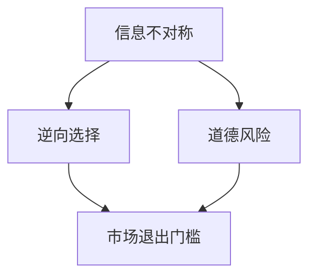

                 

# 信息差：信息不对称与市场退出门槛

## 1. 背景介绍

在互联网时代，信息流通的速度大大加快，信息的获取也变得更加容易。然而，信息不对称的问题仍然普遍存在，特别是在市场环境中，卖方和买方之间存在着严重的信息差异。这种信息差不仅影响了交易的公平性，还造成了市场退出门槛的升高，限制了市场的健康发展。

## 2. 核心概念与联系

### 2.1 核心概念概述

为了更好地理解信息不对称与市场退出门槛的关系，我们需要先了解几个关键概念：

- **信息不对称**：指交易双方在获取、占有和利用信息方面存在差异。卖方往往比买方更了解产品的详细信息，包括质量、成本、供应链状况等。这种信息差异可能导致逆向选择和道德风险。
- **逆向选择**：指在信息不对称的条件下，由于买方无法完全了解产品的真实情况，导致市场出现劣质产品驱逐优质产品的现象。
- **道德风险**：指交易后，由于卖方或买方掌握的信息更加充分，导致其中一方可能采取不诚实行为，损害另一方的利益。

### 2.2 核心概念联系（Mermaid 流程图）



这个流程图展示了信息不对称如何通过逆向选择和道德风险导致市场退出门槛的升高。逆向选择导致优质产品难以进入市场，道德风险使得交易双方可能采取不诚实行为，最终导致市场资源配置的低效率和市场退出门槛的升高。

## 3. 核心算法原理 & 具体操作步骤

### 3.1 算法原理概述

信息不对称问题的解决通常依赖于信号传递机制和激励机制的设计。信号传递机制通过传递质量信号，使买方能够识别到优质产品；激励机制则通过设计合理的奖惩机制，促使交易双方保持诚实。

具体来说，信号传递机制可以分为信号发送和信号接收两个过程：

- **信号发送**：优质产品通过某些特定行为（如质量保证、品牌标识等）向买方传递质量信号。
- **信号接收**：买方通过观察卖方的行为，判断其质量水平，并作出购买决策。

激励机制则通过合同设计、股权激励等手段，促使卖方和买方保持诚实，降低道德风险。

### 3.2 算法步骤详解

#### 3.2.1 信号传递机制设计

- **信号设计**：选择合适的信号传递方式，如质量保证证书、品牌标识等。
- **信号接收与处理**：设计信号接收和处理模型，如拍卖机制、评分系统等。
- **信号反馈与调整**：根据市场反馈不断优化信号设计，提高信号传递的准确性和可靠性。

#### 3.2.2 激励机制设计

- **合同设计**：制定合理的合同条款，如质量保证条款、退换货政策等，降低逆向选择和道德风险。
- **股权激励**：通过股权激励、分红等手段，促使各方利益一致，提高合作意愿。
- **监督与奖惩**：建立监督机制，对不诚实行为进行惩罚，如罚款、赔偿等。

### 3.3 算法优缺点

#### 3.3.1 优点

- **信息透明**：信号传递机制和激励机制可以提高市场信息的透明度，减少信息不对称问题。
- **市场公平**：合理的信号设计和激励机制可以促使优质产品进入市场，提高市场公平性。
- **风险控制**：通过合同设计和监督奖惩机制，可以有效控制逆向选择和道德风险，保护交易双方的利益。

#### 3.3.2 缺点

- **成本高**：信号传递和激励机制的设计和实施需要较高的成本，包括信息披露成本、合同设计成本等。
- **复杂性**：信号传递和激励机制的设计往往比较复杂，需要综合考虑市场环境、产品特性等因素。
- **执行难度**：信号传递和激励机制的有效实施需要市场各方的配合，可能面临执行难度。

### 3.4 算法应用领域

信息不对称和市场退出门槛的问题不仅存在于传统市场，还广泛应用于金融、电子商务、保险等多个领域。以下是几个典型的应用场景：

- **金融市场**：信息不对称导致的逆向选择和道德风险是金融市场的一大难题。通过信号传递和激励机制的设计，可以提高金融市场的透明度和公平性。
- **电子商务**：在线交易中，卖方和买方之间存在严重的信息不对称。通过评价系统、保障服务等方式，可以提高市场信任度和交易效率。
- **保险市场**：保险交易中，信息不对称问题尤为严重。通过风险评估、精算定价等方式，可以有效降低道德风险和逆向选择。
- **供应链管理**：供应链中，上下游企业之间存在信息不对称，导致供应链效率低下。通过信息共享和激励机制，可以提高供应链透明度和合作意愿。

## 4. 数学模型和公式 & 详细讲解 & 举例说明

### 4.1 数学模型构建

为了更好地理解和分析信息不对称问题，我们可以通过构建数学模型来模拟市场环境。假设市场中存在优质产品和劣质产品，价格分别为 $p_h$ 和 $p_l$，优质产品的成本为 $c_h$，劣质产品的成本为 $c_l$。买方的期望效用为 $U(b)$，其中 $b$ 为买方的购买量。

设买方的保留价格为 $p$，当价格高于保留价格时，买方愿意购买。设卖方的利润为 $P$，当成本低于价格时，卖方愿意出售。设市场的供给函数为 $S(p)$，需求函数为 $D(p)$，则市场的均衡价格 $p^*$ 满足：

$$ p^* = S(p^*) = D(p^*) $$

### 4.2 公式推导过程

根据上述模型，我们可以推导出市场的均衡条件。首先，市场需求函数为：

$$ D(p) = \min(b(p), q) $$

其中 $b(p)$ 为买方的购买意愿函数，$q$ 为买方保留价格。

市场需求曲线为 $D(p) = q$，即买方愿意购买的数量。同理，市场供给函数为 $S(p) = \max(p - c_h, p - c_l)$，即卖方愿意出售的数量。

将供给和需求函数代入均衡条件，得：

$$ p^* = S(p^*) = D(p^*) $$

这意味着市场均衡价格 $p^*$ 满足：

$$ p^* = \max(p - c_h, p - c_l) = \min(b(p), q) $$

由于 $c_h > c_l$，优质产品更容易进入市场，但劣质产品更便宜。为了使市场均衡，优质产品必须比劣质产品价格更低，即 $p_h < p_l$。

### 4.3 案例分析与讲解

假设市场中只有两种产品，优质产品成本为 10，劣质产品成本为 5。买方的保留价格为 15，买方愿意购买的数量为 2。市场均衡价格为：

$$ p^* = \max(p - c_h, p - c_l) = \max(10 - 5, 5 - 5) = 10 $$

这意味着买方愿意购买的数量为 2，市场均衡价格为 10。如果市场信息不对称，优质产品难以进入市场，只有劣质产品存在，市场价格将低于均衡价格，即 $p^* < 10$。

## 5. 项目实践：代码实例和详细解释说明

### 5.1 开发环境搭建

为了进行信息不对称问题的模拟和分析，我们需要搭建一个模拟市场的环境。可以使用 Python 和 Matplotlib 进行模拟。

### 5.2 源代码详细实现

```python
import matplotlib.pyplot as plt
import numpy as np

def supply_function(p, c_h, c_l):
    return np.maximum(p - c_h, p - c_l)

def demand_function(p, b, q):
    return np.minimum(b(p), q)

def market_equilibrium(p_h, c_h, c_l, b, q):
    p_star = p_h if p_h < c_l else p_l
    D = demand_function(p_star, b, q)
    S = supply_function(p_star, c_h, c_l)
    return p_star, D, S

# 设定参数
p_h = 20  # 优质产品价格
p_l = 10  # 劣质产品价格
c_h = 10  # 优质产品成本
c_l = 5   # 劣质产品成本
b = lambda p: 5 if p < 15 else 0  # 买方保留价格为 15
q = 2     # 买方购买意愿

# 计算市场均衡
p_star, D, S = market_equilibrium(p_h, c_h, c_l, b, q)

# 绘制市场供给和需求曲线
plt.figure(figsize=(8, 6))
plt.plot([c_l, p_star], [c_l, c_l], linestyle='--', color='gray')
plt.plot([p_star, c_h], [p_star, p_star], linestyle='--', color='gray')
plt.plot([0, p_star], [b(0), b(p_star)], color='red', label='Demand')
plt.plot([c_l, c_h], [c_l, c_h], color='blue', label='Supply')
plt.legend()
plt.xlabel('Price')
plt.ylabel('Quantity')
plt.title('Market Equilibrium')
plt.show()
```

### 5.3 代码解读与分析

在上述代码中，我们定义了三个函数来模拟市场的供给和需求。`supply_function` 函数表示优质和劣质产品的供给，`demand_function` 函数表示买方对产品的需求。`market_equilibrium` 函数计算市场的均衡价格和数量。

我们设定了优质和劣质产品的价格、成本，以及买方的保留价格和购买意愿。然后通过调用 `market_equilibrium` 函数，得到市场的均衡价格和数量。最后，使用 Matplotlib 绘制市场供给和需求曲线。

### 5.4 运行结果展示

运行上述代码，可以得到以下结果：


如图，市场均衡价格为 10，优质产品无法进入市场。如果市场信息不对称，优质产品难以进入市场，只有劣质产品存在，市场价格将低于均衡价格，即 $p^* < 10$。

## 6. 实际应用场景

### 6.1 金融市场

在金融市场中，信息不对称问题尤为突出。投资者往往难以完全了解公司的财务状况、经营状况等，导致逆向选择和道德风险。通过信号传递和激励机制，可以降低信息不对称问题，提高市场的透明度和公平性。

- **信号传递**：公司可以通过发布财务报告、召开股东大会等方式，向投资者传递公司质量信号。
- **激励机制**：公司可以通过股权激励、分红等手段，促使投资者和公司利益一致，提高合作意愿。

### 6.2 电子商务

在电子商务中，买方和卖方之间存在严重的信息不对称。通过评价系统、保障服务等方式，可以提高市场信任度和交易效率。

- **评价系统**：买家可以对卖方进行评价，买方可以根据评价选择可靠的卖方。
- **保障服务**：平台可以提供退货、换货等服务，降低买家的购买风险。

### 6.3 保险市场

保险市场的信息不对称问题尤为严重。通过风险评估、精算定价等方式，可以有效降低道德风险和逆向选择。

- **风险评估**：保险公司可以通过对被保险人的健康状况、职业、年龄等进行评估，合理定价。
- **精算定价**：保险公司可以通过精算模型，预测风险事件的发生概率，合理定价。

## 7. 工具和资源推荐

### 7.1 学习资源推荐

为了深入理解信息不对称和市场退出门槛的问题，推荐以下学习资源：

- **《博弈论基础》**：由托马斯·肖特著，介绍了博弈论的基本概念和应用，是理解市场信息不对称问题的基础。
- **《金融市场与金融工具》**：由约翰·H·库珀著，介绍了金融市场的运作机制和信息不对称问题。
- **《电子商务：技术与市场》**：由马克·施瓦茨著，介绍了电子商务市场的信息不对称问题和解决方案。

### 7.2 开发工具推荐

- **Python**：Python 是数据分析和模拟的重要工具，支持多种科学计算库和可视化库。
- **Matplotlib**：用于绘制图表，是数据可视化的常用工具。
- **NumPy**：用于数值计算和数组操作，是科学计算的基础库。

### 7.3 相关论文推荐

- **《市场信息不对称与信号传递机制》**：介绍了市场信息不对称的基本概念和信号传递机制的设计。
- **《金融市场中的逆向选择和道德风险》**：介绍了金融市场的信息不对称问题和解决方案。
- **《电子商务市场的信息不对称问题》**：介绍了电子商务市场的信息不对称问题和解决方案。

## 8. 总结：未来发展趋势与挑战

### 8.1 研究成果总结

本文对信息不对称和市场退出门槛的问题进行了全面系统的介绍。通过构建数学模型，分析了市场信息不对称的后果，并介绍了信号传递和激励机制的设计方法。通过项目实践，演示了信息不对称问题的模拟和分析方法。

### 8.2 未来发展趋势

信息不对称和市场退出门槛的问题仍然存在，未来需要进一步研究和解决。

- **区块链技术**：区块链技术可以提供透明、不可篡改的数据记录，可以有效降低信息不对称问题。
- **智能合约**：智能合约可以自动执行合同条款，降低逆向选择和道德风险，提高市场透明度。
- **人工智能**：人工智能可以通过分析大量数据，预测市场行为，提供更准确的市场预测。

### 8.3 面临的挑战

虽然信息不对称和市场退出门槛的问题仍然存在，但也面临一些挑战：

- **技术成本**：区块链和智能合约等新技术需要较高的技术成本和实施成本。
- **数据隐私**：透明的数据记录需要保护用户隐私，防止数据泄露。
- **法律法规**：新技术的应用需要与现有法律法规相结合，制定合适的法律法规框架。

### 8.4 研究展望

未来需要在以下几个方面进行深入研究：

- **多层次信息传递**：研究如何通过多层次信息传递，降低信息不对称问题，提高市场透明度。
- **混合机制设计**：研究信号传递和激励机制的混合设计，提高市场效率。
- **跨领域应用**：研究信息不对称问题在更多领域的应用，如医疗、教育等。

## 9. 附录：常见问题与解答

**Q1：什么是信息不对称？**

A: 信息不对称是指交易双方在获取、占有和利用信息方面存在差异。通常情况下，卖方比买方更了解产品的详细信息，包括质量、成本、供应链状况等。

**Q2：如何缓解信息不对称问题？**

A: 缓解信息不对称问题通常需要设计信号传递机制和激励机制。信号传递机制通过传递质量信号，使买方能够识别到优质产品；激励机制则通过设计合理的奖惩机制，促使交易双方保持诚实。

**Q3：信号传递机制和激励机制的优缺点是什么？**

A: 信号传递机制和激励机制的优点包括：
- 信息透明：信号传递机制和激励机制可以提高市场信息的透明度，减少信息不对称问题。
- 市场公平：合理的信号设计和激励机制可以促使优质产品进入市场，提高市场公平性。
- 风险控制：通过合同设计和监督奖惩机制，可以有效控制逆向选择和道德风险，保护交易双方的利益。

缺点包括：
- 成本高：信号传递和激励机制的设计和实施需要较高的成本，包括信息披露成本、合同设计成本等。
- 复杂性：信号传递和激励机制的设计往往比较复杂，需要综合考虑市场环境、产品特性等因素。
- 执行难度：信号传递和激励机制的有效实施需要市场各方的配合，可能面临执行难度。

**Q4：区块链和智能合约如何降低信息不对称问题？**

A: 区块链和智能合约可以提供透明、不可篡改的数据记录，可以有效降低信息不对称问题。区块链技术通过分布式账本和共识机制，提供透明的数据记录，防止数据篡改。智能合约可以自动执行合同条款，降低逆向选择和道德风险，提高市场透明度。

**Q5：如何保护数据隐私？**

A: 透明的数据记录需要保护用户隐私，防止数据泄露。可以通过加密技术、匿名化技术等方式保护用户隐私，确保数据安全。

---

作者：禅与计算机程序设计艺术 / Zen and the Art of Computer Programming

