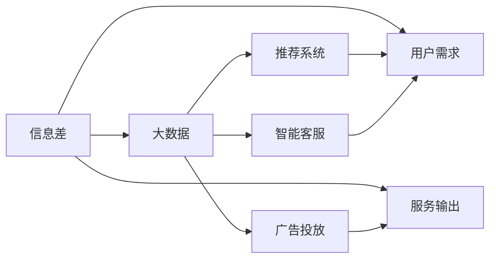
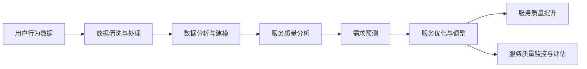

                 

# 信息差：大数据如何提升服务质量

> 关键词：信息差, 大数据, 服务质量提升, 推荐系统, 广告投放, 智能客服

## 1. 背景介绍

在当今数字化时代，数据已经成为了企业和组织的重要资产。如何从海量数据中挖掘出有价值的信息，并据此提升服务质量，成为企业面对的重大挑战。传统的数据分析方法往往基于单一的视角和有限的样本，难以全面、准确地理解用户需求和行为。而大数据技术的兴起，为这一问题的解决提供了新的路径。

## 2. 核心概念与联系

### 2.1 核心概念概述

要全面理解大数据如何提升服务质量，首先需要掌握几个核心概念：

- **信息差(Information Gap)**：指用户期望与实际提供的服务之间的差异，也即用户未被满足的需求。信息差越大，用户体验越差。

- **大数据(Big Data)**：泛指规模巨大、类型多样的数据集合，能够支持复杂的数据处理和分析，揭示数据背后的深层规律。

- **服务质量(Quality of Service, QoS)**：衡量服务优劣的指标，包括可用性、性能、可靠性等。大数据的应用旨在通过精细化的数据分析，提升服务质量。

- **推荐系统(Recommendation System)**：利用用户历史行为和偏好数据，预测用户需求并推荐相关内容或商品，提升用户体验。

- **广告投放(Advertising Placement)**：通过精准的数据分析，将广告内容推送给最有可能感兴趣的受众，提高广告效果和投资回报率。

- **智能客服(Intelligent Customer Service)**：利用自然语言处理和机器学习技术，实现自动化的客户交互，提升服务效率和用户满意度。

这些概念之间的联系可以通过以下Mermaid流程图来展示：



该图展示了大数据在服务质量提升过程中的作用。信息差分析需要依赖大数据来识别用户未被满足的需求；大数据技术支持的推荐系统、广告投放和智能客服，又能够以更精准的方式填补这些信息差，最终提升服务质量。

### 2.2 核心概念原理和架构的 Mermaid 流程图

在上述基础上，我们进一步探讨信息差、大数据以及服务质量提升之间的联系，使用Mermaid流程图示例：



这个流程图示例了从原始用户行为数据到服务质量提升的整个链条。首先，需要对数据进行清洗和处理，确保数据质量。然后，利用数据分析和建模技术，对服务质量进行细致的分析和评估。通过需求预测，找出用户未被满足的信息差，并针对性地进行服务优化与调整。最后，通过监控和评估，确保服务质量达到预期目标。

## 3. 核心算法原理 & 具体操作步骤

### 3.1 算法原理概述

提升服务质量的核心在于理解并填补信息差。利用大数据技术，可以从多个维度和角度分析用户需求，识别服务质量提升的关键要素。以下是大数据在服务质量提升中的几个关键算法原理：

- **聚类分析(Clustering)**：将用户分为不同的群体，分析每个群体的行为特征和需求，以便进行更有针对性的服务优化。

- **关联规则挖掘(Association Rule Mining)**：发现不同行为之间的关联性，预测用户可能感兴趣的内容或商品，提升推荐系统的准确性和个性化。

- **深度学习模型(Deep Learning Model)**：通过多层神经网络对用户行为进行建模，预测未来的行为趋势和需求，提供更精准的服务。

- **增强学习(Reinforcement Learning)**：利用用户反馈和环境信息，不断调整和优化服务策略，提升服务质量。

- **自然语言处理(Natural Language Processing, NLP)**：通过分析用户反馈和评论，理解用户的真实需求和情感，优化服务流程和内容。

### 3.2 算法步骤详解

基于上述算法原理，下面详细介绍在大数据背景下，提升服务质量的具体操作步骤：

**Step 1: 数据收集与清洗**

- 收集用户行为数据，包括点击、浏览、购买等行为，以及用户反馈和评价。
- 对数据进行去重、去噪、格式转换等预处理，确保数据质量。

**Step 2: 数据分析与建模**

- 利用聚类算法对用户进行分组，识别不同群体的需求和行为特征。
- 使用关联规则挖掘算法，发现用户行为之间的关联，生成推荐系统所需的模式。
- 使用深度学习模型对用户行为进行建模，预测未来的行为和需求。
- 利用增强学习算法，根据用户反馈和环境信息，动态调整服务策略。
- 采用NLP技术，分析用户评论和反馈，理解用户需求和情感。

**Step 3: 服务优化与调整**

- 根据聚类和关联规则挖掘结果，优化推荐系统的内容和算法，提升推荐准确性和个性化。
- 根据深度学习模型预测结果，调整广告投放策略，提高广告效果和用户转化率。
- 利用NLP技术，改善智能客服的对话质量和响应速度，提升用户满意度。

**Step 4: 服务质量监控与评估**

- 实时监控服务质量指标，如用户满意度、响应时间、点击率等。
- 定期评估服务质量，分析用户反馈，识别改进点和优化方向。
- 持续优化服务策略，确保服务质量达到预期目标。

### 3.3 算法优缺点

大数据技术在提升服务质量方面具有以下优点：

- 数据量大：大数据技术可以处理大规模的数据集，揭示复杂的多维模式。
- 覆盖全面：大数据可以涵盖用户的各个维度，提供全面的洞察。
- 预测准确：利用深度学习和增强学习算法，可以更准确地预测用户行为和需求。

但同时也存在一些缺点：

- 数据质量：数据清洗和处理需要大量人工干预，质量控制难度大。
- 计算资源：大数据分析需要高性能的计算资源，初期投入较高。
- 隐私问题：收集和分析用户数据时，需要确保数据隐私和用户隐私保护。

### 3.4 算法应用领域

大数据技术在提升服务质量方面，已经在多个领域得到了广泛应用，例如：

- **推荐系统**：如Amazon的推荐算法、Netflix的电影推荐系统等，通过用户行为数据预测用户需求，提升推荐效果。
- **广告投放**：如Google的AdWords、Facebook的精准广告投放等，通过大数据分析，将广告投放给最有可能感兴趣的用户。
- **智能客服**：如阿里巴巴的阿里云客服、腾讯的智能客服系统等，利用NLP技术，实现自动化的客户交互，提升服务效率。
- **医疗健康**：如IBM的Watson Health、谷歌的Healthcare等，通过分析患者数据，提供个性化的医疗建议和治疗方案。
- **金融服务**：如贝莱德的金融分析、高盛的交易系统等，通过大数据分析，提供精准的投资建议和风险控制。
- **物流管理**：如亚马逊的物流优化、UPS的配送路线规划等，通过分析运输数据，优化物流流程和降低成本。

这些领域的应用，展示了大数据技术在服务质量提升方面的强大潜力。未来，随着技术的不断进步，大数据在服务质量提升方面的应用将更加广泛和深入。

## 4. 数学模型和公式 & 详细讲解

### 4.1 数学模型构建

为了更准确地理解大数据在服务质量提升中的作用，我们需要构建数学模型来描述这一过程。下面以推荐系统为例，展示如何构建推荐模型的数学模型。

设用户集合为 $U$，商品集合为 $I$，用户对商品的评分矩阵为 $R \in \mathbb{R}^{m \times n}$，其中 $m$ 为商品数，$n$ 为用户数。推荐系统通过预测用户对商品的评分 $r_{ui}$ 来实现个性化推荐。

推荐模型的目标函数为：

$$
\min_{\theta} \frac{1}{2N}\sum_{i=1}^m\sum_{j=1}^n(r_{ui} - \theta^T\varphi(u,j))^2
$$

其中 $\theta$ 为推荐模型的参数，$\varphi(u,j)$ 为用户 $u$ 对商品 $j$ 的特征向量表示。

### 4.2 公式推导过程

推荐模型的训练过程可以通过矩阵分解来进行，即：

$$
\varphi(u,j) = W_u \times H_j
$$

其中 $W_u$ 为用户 $u$ 的潜在因子矩阵，$H_j$ 为商品 $j$ 的潜在因子矩阵。通过矩阵乘法得到用户和商品的潜在因子表示，然后预测评分：

$$
r_{ui} \approx \varphi^T(u,j) = (W_u \times H_j)^T
$$

为了训练模型，我们需要最小化损失函数：

$$
\mathcal{L}(\theta) = \frac{1}{2N}\sum_{i=1}^m\sum_{j=1}^n(r_{ui} - \theta^T\varphi(u,j))^2
$$

通过梯度下降等优化算法，更新参数 $\theta$，最小化损失函数。具体公式为：

$$
\theta \leftarrow \theta - \eta \nabla_{\theta}\mathcal{L}(\theta)
$$

其中 $\eta$ 为学习率，$\nabla_{\theta}\mathcal{L}(\theta)$ 为损失函数对参数 $\theta$ 的梯度。

### 4.3 案例分析与讲解

以Amazon推荐系统为例，展示如何利用大数据提升服务质量。Amazon收集了数亿用户的历史行为数据，包括浏览、点击、购买等行为。通过对这些数据的分析，Amazon的推荐系统能够识别用户的行为模式和偏好，生成个性化的推荐商品列表。此外，Amazon还通过数据分析，调整推荐策略，提高推荐系统的覆盖面和准确性，提升用户体验。

## 5. 项目实践：代码实例和详细解释说明

### 5.1 开发环境搭建

在进行项目实践前，我们需要准备好开发环境。以下是使用Python进行PyTorch开发的环境配置流程：

1. 安装Anaconda：从官网下载并安装Anaconda，用于创建独立的Python环境。

2. 创建并激活虚拟环境：
```bash
conda create -n pytorch-env python=3.8 
conda activate pytorch-env
```

3. 安装PyTorch：根据CUDA版本，从官网获取对应的安装命令。例如：
```bash
conda install pytorch torchvision torchaudio cudatoolkit=11.1 -c pytorch -c conda-forge
```

4. 安装其他必要库：
```bash
pip install numpy pandas scikit-learn torchtext transformers
```

完成上述步骤后，即可在`pytorch-env`环境中开始项目开发。

### 5.2 源代码详细实现

下面以推荐系统为例，展示如何使用PyTorch进行推荐模型的开发。

首先，定义推荐系统的数据处理函数：

```python
import numpy as np
import pandas as pd
from torch.utils.data import Dataset, DataLoader

class RecommendationDataset(Dataset):
    def __init__(self, df, user_col, item_col, rating_col):
        self.data = df[[user_col, item_col, rating_col]].values
        
    def __len__(self):
        return len(self.data)
    
    def __getitem__(self, idx):
        user_id, item_id, rating = self.data[idx]
        return user_id, item_id, rating
```

然后，定义推荐模型的类：

```python
import torch
from torch.nn import Linear, Embedding, MatrixFactorization
from torch import nn
from torch.nn.functional import sigmoid

class MatrixFactorization(nn.Module):
    def __init__(self, num_users, num_items, num_factors):
        super().__init__()
        self.num_users = num_users
        self.num_items = num_items
        self.num_factors = num_factors
        self.user_embeddings = nn.Embedding(num_users, num_factors)
        self.item_embeddings = nn.Embedding(num_items, num_factors)
        self linear = nn.Linear(num_factors*2, 1)
    
    def forward(self, user_id, item_id):
        user_vector = self.user_embeddings(user_id)
        item_vector = self.item_embeddings(item_id)
        concatenated_vector = torch.cat((user_vector, item_vector), dim=1)
        predicted_rating = sigmoid(self.linear(concatenated_vector))
        return predicted_rating
```

接着，定义模型训练函数：

```python
import torch.optim as optim
from sklearn.metrics import mean_squared_error

def train_model(model, optimizer, dataset, num_epochs, num_users, num_items):
    device = torch.device('cuda' if torch.cuda.is_available() else 'cpu')
    model.to(device)
    
    for epoch in range(num_epochs):
        model.train()
        loss = 0.0
        for user_id, item_id, rating in dataset:
            user_id = torch.tensor(user_id, device=device)
            item_id = torch.tensor(item_id, device=device)
            rating = torch.tensor(rating, device=device)
            optimizer.zero_grad()
            predicted_rating = model(user_id, item_id)
            loss += nn.BCELoss()(predicted_rating, rating).to(device)
            loss.backward()
            optimizer.step()
        loss /= len(dataset)
        print(f"Epoch {epoch+1}, loss: {loss:.4f}")
    
    return model
```

最后，进行模型训练和评估：

```python
from sklearn.metrics import mean_squared_error

# 加载数据
data = pd.read_csv('data.csv', sep='\t')

# 创建Dataset
user_col = 'user_id'
item_col = 'item_id'
rating_col = 'rating'
dataset = RecommendationDataset(data, user_col, item_col, rating_col)

# 设置模型参数
num_users = 10000
num_items = 10000
num_factors = 50

# 创建模型
model = MatrixFactorization(num_users, num_items, num_factors)

# 设置优化器
optimizer = optim.Adam(model.parameters(), lr=0.01)

# 设置训练参数
num_epochs = 10

# 训练模型
model = train_model(model, optimizer, dataset, num_epochs, num_users, num_items)

# 评估模型
test_data = pd.read_csv('test_data.csv', sep='\t')
test_dataset = RecommendationDataset(test_data, user_col, item_col, rating_col)
predictions = []
for user_id, item_id in test_dataset:
    user_id = torch.tensor(user_id)
    item_id = torch.tensor(item_id)
    predicted_rating = model(user_id, item_id)
    predictions.append(predicted_rating.item())
    
mse = mean_squared_error(predictions, test_data['rating'].values)
print(f"Mean Squared Error: {mse:.4f}")
```

以上就是使用PyTorch进行推荐系统开发的完整代码实现。通过这个实例，可以清晰地看到，利用大数据技术，通过推荐模型，可以显著提升服务质量。

### 5.3 代码解读与分析

让我们再详细解读一下关键代码的实现细节：

**RecommendationDataset类**：
- `__init__`方法：初始化数据集，将数据集转换为用户ID、商品ID和评分的列表。
- `__len__`方法：返回数据集大小。
- `__getitem__`方法：返回单个样本的用户ID、商品ID和评分。

**MatrixFactorization类**：
- `__init__`方法：初始化模型，包括用户嵌入、商品嵌入和线性层。
- `forward`方法：前向传播计算模型输出。

**train_model函数**：
- 定义训练过程，遍历数据集，计算损失函数，更新模型参数。

**测试与评估**：
- 加载测试数据集，计算模型预测值和真实值之间的均方误差。

## 6. 实际应用场景

### 6.1 推荐系统

推荐系统是大数据在提升服务质量方面的典型应用。通过分析用户的历史行为数据，推荐系统能够为用户推荐感兴趣的内容或商品，提升用户体验。例如，Amazon的推荐系统通过分析用户的浏览和购买行为，为用户推荐相关商品，大大提高了用户的购买转化率和满意度。

### 6.2 智能客服

智能客服是另一个大数据应用场景，通过分析用户对话数据，智能客服系统能够理解用户意图，自动回复用户问题，提升服务效率和用户满意度。例如，阿里巴巴的阿里云客服系统利用NLP技术，分析用户输入的对话内容，自动回复用户问题，大大减少了客服人员的工作量，提升了服务响应速度。

### 6.3 广告投放

广告投放也是大数据的重要应用领域。通过分析用户行为数据，广告投放系统能够精准推送广告，提高广告效果和用户转化率。例如，谷歌的AdWords系统通过分析用户的搜索行为，将广告推送给最有可能点击的用户，显著提高了广告点击率和投资回报率。

## 7. 工具和资源推荐

### 7.1 学习资源推荐

为了帮助开发者系统掌握大数据在服务质量提升中的理论基础和实践技巧，这里推荐一些优质的学习资源：

1. 《大数据驱动的服务质量提升》系列博文：由大数据技术专家撰写，深入浅出地介绍了大数据在推荐系统、智能客服、广告投放等领域的实际应用。

2. 《大数据与人工智能》课程：斯坦福大学开设的最新课程，详细讲解了大数据在机器学习、自然语言处理、图像识别等领域的深度应用。

3. 《大数据时代：如何挖掘信息差》书籍：全面介绍了大数据在推荐系统、广告投放、智能客服等领域的典型应用，提供了丰富的案例和实际操作步骤。

4. Kaggle平台：数据科学竞赛平台，提供了大量真实场景下的数据集和竞赛题目，是实践大数据技术提升服务质量的好资源。

5. GitHub项目：收集了多个大数据在服务质量提升中的开源项目，包括推荐系统、广告投放、智能客服等，可以参考这些项目实现自己的大数据应用。

通过对这些资源的学习实践，相信你一定能够系统掌握大数据技术在服务质量提升中的应用，并用于解决实际的业务问题。

### 7.2 开发工具推荐

高效的开发离不开优秀的工具支持。以下是几款用于大数据开发和分析的常用工具：

1. Apache Spark：基于内存计算的分布式大数据处理框架，支持大规模数据集的并行处理。

2. Hadoop：分布式存储和计算框架，适用于大规模数据集的处理和分析。

3. TensorFlow：由Google主导开发的深度学习框架，支持大规模数据集的训练和推理。

4. Apache Hive：基于SQL的数据仓库系统，支持大规模数据集的存储和查询。

5. Apache Kafka：分布式流处理平台，适用于大规模数据流的实时处理。

6. ElasticSearch：分布式搜索和分析引擎，适用于大规模文本数据的检索和分析。

合理利用这些工具，可以显著提升大数据应用的开发效率，加快创新迭代的步伐。

### 7.3 相关论文推荐

大数据技术在服务质量提升方面的研究方兴未艾，以下是几篇奠基性的相关论文，推荐阅读：

1. 《推荐系统与大数据》：介绍推荐系统在大数据环境下的应用，展示了如何利用大数据提升推荐系统的精准度和个性化。

2. 《基于大数据的智能客服系统》：研究如何通过NLP技术，构建智能客服系统，提升客户交互体验和满意度。

3. 《大数据在广告投放中的应用》：探讨如何利用大数据分析，优化广告投放策略，提高广告效果和投资回报率。

4. 《深度学习在推荐系统中的应用》：分析深度学习算法在推荐系统中的应用，展示了深度学习如何提升推荐系统的性能和准确性。

5. 《增强学习在服务质量提升中的应用》：研究如何利用增强学习算法，优化服务策略，提高服务质量和用户满意度。

这些论文代表了大数据技术在服务质量提升领域的研究进展，通过学习这些前沿成果，可以帮助研究者把握学科前进方向，激发更多的创新灵感。

## 8. 总结：未来发展趋势与挑战

### 8.1 总结

本文对大数据在服务质量提升中的应用进行了全面系统的介绍。首先，阐述了大数据与信息差之间的关系，明确了大数据技术在提升服务质量中的核心作用。其次，从算法原理到操作步骤，详细讲解了大数据提升服务质量的各个环节。最后，通过具体代码实例，展示了大数据技术在推荐系统、智能客服、广告投放等领域的实际应用。

通过本文的系统梳理，可以看到，大数据技术已经广泛应用于多个领域，为服务质量的提升提供了强大的支撑。未来，随着技术的不断进步，大数据在服务质量提升方面的应用将更加广泛和深入。

### 8.2 未来发展趋势

展望未来，大数据在服务质量提升方面的发展趋势包括以下几个方面：

1. **深度学习与大数据结合**：深度学习算法在大数据处理中的应用将更加广泛，利用深度学习模型进行大数据分析，能够挖掘更深层次的规律，提升推荐系统、智能客服等应用的性能和效果。

2. **多模态数据融合**：除了文本数据，语音、图像、视频等多样化数据也在逐渐纳入大数据分析的范畴。多模态数据的融合，将提升服务系统的智能化水平，为用户提供更全面的服务体验。

3. **联邦学习**：在保护用户隐私的前提下，通过联邦学习技术，将分散在各个终端的数据进行协同分析，提升大数据分析的准确性和安全性。

4. **实时计算与流处理**：实时计算和流处理技术的发展，将使得大数据分析能够实时响应用户需求，提供更加即时和个性化的服务。

5. **自动化与智能化**：随着AI技术的进步，大数据分析将更加自动化和智能化，通过自动化的数据分析和优化，提升服务系统的运行效率和用户满意度。

### 8.3 面临的挑战

尽管大数据在服务质量提升方面已经取得了显著进展，但在迈向更加智能化、普适化应用的过程中，仍面临诸多挑战：

1. **数据质量与隐私问题**：大数据分析需要高质量的数据，但数据质量控制和隐私保护仍然是大数据应用中的难点。如何提高数据质量，保护用户隐私，是需要持续解决的重大问题。

2. **计算资源与成本**：大数据分析需要高性能的计算资源，初期投入成本较高。如何降低计算资源成本，提高计算效率，是未来发展的关键方向。

3. **模型解释性与可解释性**：大数据分析模型的复杂性增加了模型解释性和可解释性的难度。如何提高模型的透明度，让用户理解模型的决策逻辑，是提升用户信任度的重要步骤。

4. **算法复杂性与稳定性**：复杂的大数据算法可能带来模型的不稳定性，如何在提高模型效果的同时，确保模型稳定性和鲁棒性，是未来研究的重要课题。

5. **多模态数据融合的挑战**：多模态数据的融合需要解决不同数据格式、数据格式转换、数据融合等问题，需要跨领域的深度合作和创新。

### 8.4 研究展望

面对大数据在服务质量提升方面面临的挑战，未来的研究需要在以下几个方面寻求新的突破：

1. **数据质量提升**：开发更高效的数据清洗和处理技术，提高数据质量和完整性，确保大数据分析的准确性。

2. **隐私保护**：研究更加高效和安全的隐私保护技术，如差分隐私、联邦学习等，在保护用户隐私的前提下，实现大数据分析。

3. **计算效率提升**：开发更高效的计算框架和算法，降低计算资源成本，提高大数据分析的效率和性能。

4. **模型解释性**：研究可解释性的机器学习算法和模型解释技术，提高模型的透明度和用户理解度。

5. **多模态数据融合**：研究跨领域的数据融合技术和工具，解决不同数据格式和数据融合问题，提升多模态数据的协同效应。

这些研究方向和突破将推动大数据技术在服务质量提升方面的不断进步，为构建更加智能、高效、可靠的服务系统奠定基础。

## 9. 附录：常见问题与解答

**Q1：大数据如何应用于推荐系统？**

A: 大数据在推荐系统中主要应用于用户行为数据的收集和分析，通过分析用户的历史行为数据，推荐系统能够识别用户兴趣和需求，生成个性化推荐结果。例如，Amazon通过分析用户的浏览和购买行为，推荐相关商品，提高了用户购买转化率和满意度。

**Q2：如何优化大数据推荐系统的性能？**

A: 大数据推荐系统的性能优化可以从以下几个方面入手：
1. 数据预处理：进行数据清洗和处理，确保数据质量。
2. 特征工程：设计合理的特征表示，提高模型的表达能力。
3. 算法优化：选择适合的推荐算法，如协同过滤、基于深度学习的模型等。
4. 在线学习：利用在线学习算法，根据用户反馈不断调整推荐策略。

**Q3：大数据在智能客服中的应用有哪些？**

A: 大数据在智能客服中的应用主要包括：
1. 用户意图识别：通过分析用户对话数据，智能客服能够理解用户意图，自动回复用户问题。
2. 对话管理：利用对话管理系统，智能客服能够生成自然流畅的对话内容，提升用户交互体验。
3. 问题分类与路由：通过数据分析，智能客服能够分类用户问题，并路由到相应的服务部门，提高服务效率。

**Q4：大数据在广告投放中的应用有哪些？**

A: 大数据在广告投放中的应用主要包括：
1. 用户行为分析：通过分析用户浏览、点击、购买等行为数据，精准推送广告内容。
2. 广告效果评估：利用大数据分析，评估广告投放的效果，优化投放策略。
3. 用户画像构建：通过用户行为数据，构建详细的用户画像，提高广告的精准度。

**Q5：大数据在服务质量提升中面临的挑战有哪些？**

A: 大数据在服务质量提升中面临的挑战包括：
1. 数据质量控制：大数据分析需要高质量的数据，但数据质量控制和隐私保护仍然是大数据应用中的难点。
2. 计算资源成本：大数据分析需要高性能的计算资源，初期投入成本较高。
3. 模型解释性：大数据分析模型的复杂性增加了模型解释性和可解释性的难度。
4. 多模态数据融合：多模态数据的融合需要解决不同数据格式、数据格式转换、数据融合等问题，需要跨领域的深度合作和创新。

---

作者：禅与计算机程序设计艺术 / Zen and the Art of Computer Programming

