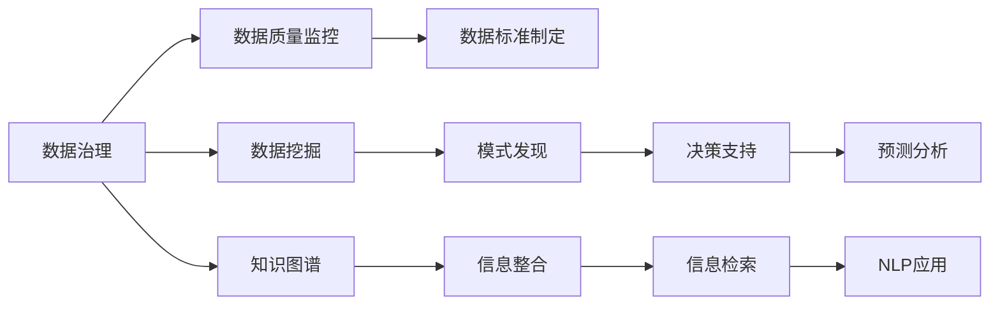

                 

# 信息时代的信息管理策略与实践：管理信息过载和复杂性

> 关键词：信息管理,信息过载,复杂性管理,数据治理,知识图谱,信息检索,大数据技术,自然语言处理(NLP)

## 1. 背景介绍

### 1.1 问题由来
信息时代，信息爆炸。无论是企业级还是个人用户，都面临着如何从海量数据中提取出有价值信息的挑战。同时，数据质量的参差不齐、数据格式的复杂性、以及数据量的不断增长，都给信息管理带来了前所未有的困难。如何高效地组织、存储和利用数据，已成为企业竞争力的重要体现。

大信息时代背景下的信息管理，已不再局限于传统的数据存储和查询。如何处理和管理信息过载和复杂性，已成为一个跨学科、跨领域的研究热点。本文将围绕信息管理的技术与策略展开，探讨在信息爆炸时代下，如何高效地管理和利用信息。

### 1.2 问题核心关键点
信息管理的核心在于对信息的有效提取、整合、存储和应用。而信息过载和复杂性的管理，则涉及到数据的收集、处理、分析和展示等各个环节，需要应用多种技术和方法，如数据治理、数据挖掘、知识图谱、自然语言处理等。

对于企业来说，信息的有效管理不仅能提升决策效率，还能降低运营成本，增加竞争力。对于个人用户，有效管理信息则能提升工作效率和生活质量。本文将结合实际案例，对信息管理策略与技术进行详细阐述。

### 1.3 问题研究意义
本文旨在探讨和分析信息管理的方法和策略，尤其针对信息过载和复杂性管理的问题，提供可行的解决方案和技术支持。通过研究企业级信息管理和个人用户信息管理策略，帮助读者系统了解信息管理的核心技术和方法，从而提升信息管理水平，实现信息价值最大化。

## 2. 核心概念与联系

### 2.1 核心概念概述

信息管理与信息过载和复杂性的管理紧密相关，涵盖了数据治理、数据挖掘、知识图谱、自然语言处理等多个方面。

- **数据治理(Data Governance)**：确保数据质量和一致性的过程，包括数据标准制定、数据质量监控、数据安全管理等。
- **数据挖掘(Data Mining)**：通过算法发现数据中的模式和知识，以便更好地进行决策和预测。
- **知识图谱(Knowledge Graph)**：一种语义网络表示知识的方式，用于整合和管理大量非结构化信息。
- **自然语言处理(NLP)**：使计算机能够理解、分析和生成人类语言的技术。

这些核心概念在信息管理中相互关联，共同构成了信息管理的基础。

### 2.2 核心概念原理和架构的 Mermaid 流程图



该流程图展示了信息管理中各个核心概念之间的联系和作用：

1. 数据治理确保数据质量，为数据挖掘提供高质量的数据基础。
2. 数据挖掘从数据中发现模式，用于决策支持和预测分析。
3. 知识图谱整合和管理非结构化信息，提升信息检索效率。
4. NLP技术使计算机能理解人类语言，用于信息检索和知识图谱的语义关联。

## 3. 核心算法原理 & 具体操作步骤

### 3.1 算法原理概述

信息管理的核心在于数据治理和数据挖掘。本文主要介绍数据治理中的数据清洗、数据标准化和数据质量监控，以及数据挖掘中的聚类、分类和关联规则。

### 3.2 算法步骤详解

#### 数据清洗和标准化
1. 清洗：去除数据中的噪声、重复和异常值，确保数据的一致性和完整性。
2. 标准化：将数据转换为统一的格式和单位，便于后续处理和分析。

#### 数据质量监控
1. 定期检查数据质量，发现异常数据并及时修正。
2. 制定数据质量指标，如准确性、完整性、一致性等，确保数据质量。

#### 数据挖掘
1. 聚类：将相似的数据分为一组，便于分析。
2. 分类：根据已有的类别标签，预测新数据所属的类别。
3. 关联规则：发现数据之间的关联性，用于挖掘潜在的商业价值。

### 3.3 算法优缺点

数据治理和数据挖掘技术的优点包括：

- **自动化程度高**：利用算法自动完成数据处理和分析，减轻人工负担。
- **精度高**：基于算法处理的数据质量通常较高，减少错误。

但同时，这些技术也存在以下缺点：

- **依赖数据质量**：如果原始数据质量差，处理结果也可能不准确。
- **处理复杂性**：数据挖掘算法复杂，需要专业技能支持。
- **资源消耗大**：大数据处理需要大量计算资源，可能存在资源瓶颈。

### 3.4 算法应用领域

数据治理和数据挖掘技术在多个领域得到广泛应用，包括但不限于：

- **金融行业**：用于风险管理、客户画像、市场营销等。
- **医疗行业**：用于疾病预测、药物研发、医疗影像分析等。
- **电商行业**：用于用户行为分析、个性化推荐、市场趋势预测等。
- **政府部门**：用于公共政策制定、环境监测、社会治安等。

这些应用场景展示了数据治理和数据挖掘技术的广泛适用性，有助于提升各行业的决策能力和管理水平。

## 4. 数学模型和公式 & 详细讲解 & 举例说明

### 4.1 数学模型构建

在信息管理中，常见的数据模型包括关系型数据库模型、NoSQL数据库模型和知识图谱模型。

- **关系型数据库模型**：通过表结构来存储和管理数据，适合结构化数据存储。
- **NoSQL数据库模型**：适合非结构化或半结构化数据存储，如JSON、XML等。
- **知识图谱模型**：基于图结构，适合表示和查询实体之间的关系。

### 4.2 公式推导过程

以知识图谱模型为例，其公式推导过程如下：

1. 知识表示：将知识表示为图结构，节点表示实体，边表示实体之间的关系。
2. 图嵌入：将节点和边的信息映射到低维空间中，便于计算机处理。
3. 图神经网络：通过图神经网络模型，从图结构中挖掘知识关系。

### 4.3 案例分析与讲解

假设有一家电商公司，其目的是通过分析用户行为数据，预测用户购买意向，并进行个性化推荐。

- **数据清洗**：清洗用户行为数据，去除重复和异常记录。
- **数据标准化**：将时间戳、商品ID等字段转换为统一格式。
- **数据挖掘**：使用聚类算法发现用户行为模式，使用分类算法预测用户购买意向。
- **个性化推荐**：根据用户的历史行为和预测结果，生成个性化推荐列表。

## 5. 项目实践：代码实例和详细解释说明

### 5.1 开发环境搭建

- **Python环境**：安装Python 3.8及以上版本，并使用Anaconda创建虚拟环境。
- **数据治理工具**：安装Apache Kafka、Apache Hive等数据治理工具。
- **数据挖掘工具**：安装Scikit-learn、TensorFlow等数据挖掘工具。
- **自然语言处理工具**：安装NLTK、spaCy等自然语言处理工具。

### 5.2 源代码详细实现

#### 数据清洗和标准化

```python
import pandas as pd
import numpy as np

# 读取数据
data = pd.read_csv('user_behavior_data.csv')

# 数据清洗
data = data.drop_duplicates()
data = data.dropna()

# 数据标准化
data['timestamp'] = pd.to_datetime(data['timestamp'])
data['item_id'] = data['item_id'].astype('str')
data = data.applymap(lambda x: x if pd.notnull(x) else np.nan)
```

#### 数据质量监控

```python
# 设置数据质量指标
quality_metrics = {
    'accuracy': 0.9,
    'completeness': 0.95,
    'consistency': 0.98
}

# 定期检查数据质量
def check_data_quality(data):
    accuracy = data['label'].value_counts(normalize=True)[1]
    completeness = (data['timestamp'].isnull().sum() / len(data)) * 100
    consistency = (data.groupby('item_id').size() == data.shape[0]).all()

    if accuracy < quality_metrics['accuracy'] or completeness > quality_metrics['completeness'] or not consistency:
        return False
    else:
        return True
```

#### 数据挖掘

```python
from sklearn.cluster import KMeans
from sklearn.preprocessing import StandardScaler

# 数据预处理
scaler = StandardScaler()
data_scaled = scaler.fit_transform(data)

# KMeans聚类
kmeans = KMeans(n_clusters=5, random_state=42)
kmeans.fit(data_scaled)

# 数据分类
from sklearn.ensemble import RandomForestClassifier
X = data_scaled[:, :-1]
y = data_scaled[:, -1]
clf = RandomForestClassifier(n_estimators=100, random_state=42)
clf.fit(X, y)

# 关联规则
from mlxtend.frequent_patterns import apriori
frequent_patterns = apriori(data_scaled, min_support=0.1)
```

### 5.3 代码解读与分析

以上代码实现了数据清洗、数据标准化、数据质量监控和数据挖掘的基本流程。在实际应用中，还需要根据具体场景进一步优化算法和模型，并注意代码的可扩展性和可维护性。

## 6. 实际应用场景

### 6.1 企业级信息管理

企业在信息管理方面面临着巨大的挑战。信息过载和数据复杂性管理是企业决策和运营的基础。通过建立完善的数据治理体系，采用数据挖掘技术，企业可以更好地理解市场动态和客户需求，提升运营效率和决策质量。

#### 数据治理体系

1. **数据标准制定**：统一数据格式和命名规范，减少数据冗余和歧义。
2. **数据质量监控**：实时监控数据质量，及时发现并修正问题。
3. **数据安全管理**：采用加密和访问控制等措施，确保数据安全。

#### 数据挖掘应用

1. **客户画像**：通过聚类算法对客户进行分组，提升个性化营销效果。
2. **市场营销**：利用分类算法预测客户行为，优化广告投放策略。
3. **风险管理**：使用关联规则挖掘潜在风险因素，提升风险防范能力。

### 6.2 个人用户信息管理

对于个人用户，信息管理同样重要。高效的信息管理不仅能提升工作效率，还能保护个人隐私。

#### 个人信息管理策略

1. **数据分类**：将信息按类别分组，便于检索和处理。
2. **智能助理**：使用NLP技术，自动化信息整理和管理。
3. **隐私保护**：采用数据加密和访问控制，保护个人隐私。

### 6.3 未来应用展望

随着技术的不断发展，信息管理将更加智能化和自动化。人工智能、大数据和知识图谱等技术将进一步融合，提升信息管理的效率和质量。

- **自动化数据治理**：利用机器学习技术，自动发现和修正数据质量问题。
- **智能信息检索**：通过自然语言处理技术，实现更精准的信息检索和推荐。
- **多模态信息管理**：融合图像、视频等多模态数据，提升信息管理的全面性。

## 7. 工具和资源推荐

### 7.1 学习资源推荐

1. **《数据科学实战》**：详细讲解数据治理和数据挖掘的原理和实践，适合入门学习。
2. **Coursera《数据治理与大数据技术》课程**：由知名专家授课，涵盖数据治理和大数据技术的各个方面。
3. **Kaggle竞赛**：通过实际数据集竞赛，锻炼数据挖掘和信息管理技能。
4. **NLP相关书籍**：如《自然语言处理综论》，介绍自然语言处理的基本原理和应用。
5. **GitHub开源项目**：参与和贡献开源项目，积累实践经验。

### 7.2 开发工具推荐

1. **Python**：作为数据科学的主要编程语言，提供了丰富的数据处理和分析工具。
2. **Apache Hadoop**：用于大规模数据存储和处理，适合大数据环境。
3. **Apache Spark**：支持分布式数据处理，提供高效的数据挖掘和分析能力。
4. **TensorFlow**：用于机器学习和深度学习模型的训练和部署。
5. **Jupyter Notebook**：提供交互式编程环境，方便数据处理和模型调试。

### 7.3 相关论文推荐

1. **《大数据时代下的数据治理研究》**：介绍了大数据环境下的数据治理技术。
2. **《知识图谱构建与应用的实践》**：探讨了知识图谱在信息管理中的应用。
3. **《基于自然语言处理的信息检索技术》**：详细讲解了NLP技术在信息检索中的应用。
4. **《数据挖掘中的聚类算法研究》**：介绍了常见的聚类算法及其应用场景。

## 8. 总结：未来发展趋势与挑战

### 8.1 研究成果总结

本文系统介绍了信息管理中的数据治理和数据挖掘技术，探讨了信息过载和复杂性的管理方法。通过案例分析和实际应用，展示了信息管理的重要性和实践价值。

### 8.2 未来发展趋势

信息管理技术的未来发展趋势包括：

1. **自动化和智能化**：利用机器学习和人工智能技术，实现自动化数据治理和智能信息检索。
2. **多模态融合**：融合图像、视频等多模态数据，提升信息管理的全面性和准确性。
3. **隐私保护**：加强数据隐私保护，确保数据安全。
4. **跨领域应用**：将信息管理技术应用于更多行业，提升各行业的决策和管理能力。

### 8.3 面临的挑战

信息管理技术在发展过程中仍面临诸多挑战：

1. **数据质量问题**：数据质量参差不齐，处理难度大。
2. **技术复杂性**：需要多学科知识支持，技术门槛高。
3. **资源消耗大**：大数据处理需要大量计算资源，可能存在资源瓶颈。
4. **隐私保护**：数据隐私保护需加强，避免数据泄露风险。

### 8.4 研究展望

未来，信息管理技术需从以下几个方向进行深入研究：

1. **自动化数据治理**：研究自动化数据清洗和质量监控算法，降低人工干预。
2. **智能信息检索**：改进自然语言处理技术，实现更精准的信息检索和推荐。
3. **隐私保护技术**：研究数据加密和访问控制技术，提升数据隐私保护能力。
4. **多模态信息管理**：研究多模态数据融合技术，提升信息管理的全面性。

## 9. 附录：常见问题与解答

**Q1：数据清洗和标准化在信息管理中的重要性？**

A: 数据清洗和标准化是信息管理的基础。通过清洗去除噪声和异常值，标准化统一数据格式，确保数据的一致性和完整性。这对于后续的数据挖掘和分析至关重要，有助于提升信息管理的精度和效率。

**Q2：如何进行数据质量监控？**

A: 数据质量监控应定期进行，主要关注数据准确性、完整性和一致性等指标。可以利用数据标准和质量指标，自动化监控数据质量问题，及时发现并修正数据问题。

**Q3：大数据环境下如何优化数据处理效率？**

A: 在大数据环境下，可以利用分布式计算技术，如Apache Hadoop和Apache Spark，提升数据处理效率。同时，可以采用流式数据处理技术，实现实时数据挖掘和分析。

**Q4：如何保护数据隐私？**

A: 数据隐私保护需从多个方面入手，包括数据加密、访问控制、匿名化等措施。同时，应建立健全的数据隐私政策和法律法规，确保数据使用的合规性和合法性。

**Q5：信息管理技术在各行业中的应用前景？**

A: 信息管理技术在各行业都有广泛应用前景。例如，金融行业可用于风险管理、客户画像、市场营销等；医疗行业可用于疾病预测、药物研发、医疗影像分析等。未来，随着技术的不断发展，信息管理技术将更加广泛地应用于各行业，提升决策和管理能力。

---

作者：禅与计算机程序设计艺术 / Zen and the Art of Computer Programming

