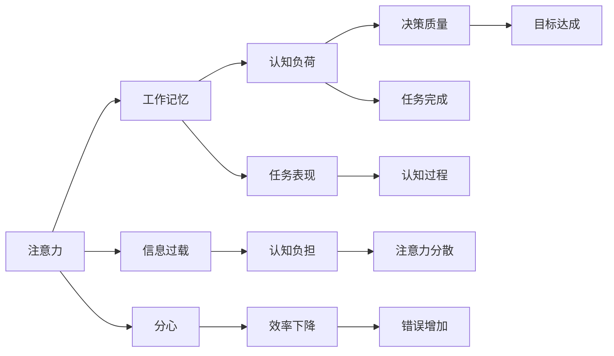
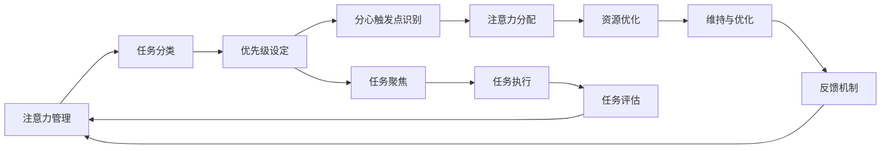

                 

# 信息时代的注意力管理策略与实践：在干扰和信息过载中航行

> 关键词：注意力管理,信息过载,干扰应对,注意力模型,实践应用,未来展望

## 1. 背景介绍

### 1.1 问题由来
在信息时代，数据的爆炸式增长和无处不在的干扰，使得人类对于注意力的管理变得前所未有的复杂和困难。快速更新的互联网内容、各类应用推送的通知、社交媒体的不断吸引，这些都在考验着我们的注意力和自控力。

具体到工作中，我们可能经常在处理电子邮件、即时消息、多任务处理时感到分心和压力。在学术研究和项目开发中，信息过载和不断变化的要求，也可能导致认知负担过重，难以高效工作。

因此，如何在干扰和信息过载的环境中有效管理注意力，成为现代技术从业者必须面对的重要课题。本文将深入探讨信息时代的注意力管理策略，并通过详细实践案例，介绍如何利用现有的注意力模型和工具，帮助你在干扰中航行，高效管理信息。

### 1.2 问题核心关键点
注意力管理是一种针对认知负荷的管理策略，目的在于帮助个体识别、维持和优化注意力资源，从而提升工作效率和决策质量。现代注意力管理策略的核心在于：

- **识别**：识别并理解不同情境下注意力分散的触发因素。
- **维持**：使用策略和方法，使注意力能够持续集中在重要任务上。
- **优化**：通过学习和实践，优化注意力资源的使用，提高工作和学习效率。

本文将通过理解注意力的基本原理，探讨具体的注意力管理工具和技术，介绍一些在实际工作中的应用案例，以期对技术从业者提供有价值的管理指导。

## 2. 核心概念与联系

### 2.1 核心概念概述

在探讨注意力管理的策略和实践之前，我们需要首先理解几个关键概念：

- **注意力**：注意力是一种心理资源，用于指向和维持对特定任务或环境的认知关注。注意力的分配和维持是认知过程的核心。
- **分心**：分心是指注意力从当前任务转移到其他事物，导致效率下降和错误增加的现象。
- **信息过载**：信息过载指个体接收的信息量远超处理能力，导致认知负担过重，注意力难以集中。
- **认知负荷**：认知负荷是认知任务对注意力的需求，过高的认知负荷会导致分心和错误。
- **工作记忆**：工作记忆是进行任务所需的信息存储和处理的空间，容量有限，需要管理以提高任务表现。
- **注意力模型**：注意力模型是一种用来模拟人类注意力的计算模型，通过输入输出序列，模拟信息选择、聚焦和分散的过程。

这些概念通过以下Mermaid流程图展示其内在联系：



这个流程图展示了注意力管理各环节之间的逻辑关系。

### 2.2 核心概念原理和架构的 Mermaid 流程图



## 3. 核心算法原理 & 具体操作步骤

### 3.1 算法原理概述

注意力管理的核心在于优化个体对注意力资源的分配和维持，使其能够高效、准确地完成任务。现代注意力管理策略主要基于心理学和认知科学的研究成果，结合了信息处理和计算技术的进步。

在认知心理学中，注意力的分配和维持被看作是一种自上而下的控制过程。注意力的选择和聚焦受到目标任务的重要性和个体当前的心理状态影响。因此，注意力管理的策略需要从识别重要任务和分心触发点开始，然后采取针对性的策略来维持和优化注意力资源。

在计算技术中，注意力模型通常基于神经网络进行建模，如Transformer模型。这些模型通过学习输入序列中的信息，预测注意力的分布和动态变化。注意力模型在自然语言处理（NLP）、计算机视觉（CV）等领域得到了广泛应用，展示出了强大的信息选择和聚焦能力。

### 3.2 算法步骤详解

基于注意力管理的核心原理，具体的注意力管理策略可以分为以下几个步骤：

**Step 1: 任务识别与分类**
- 识别当前和即将到来的任务，并根据其重要性和紧急程度进行分类。
- 区分必需任务和可选项任务，优先处理必需任务。

**Step 2: 分心触发点识别**
- 识别当前环境下可能的注意力分散触发点，如信息通知、社交媒体提醒等。
- 分析触发点的原因，制定应对策略。

**Step 3: 注意力分配**
- 根据任务的重要性和紧急程度，分配注意力的资源。
- 使用注意力模型或策略（如番茄工作法），进行注意力的聚焦和切换。

**Step 4: 资源优化**
- 优化工作环境，减少干扰因素。
- 使用工具和技术，如番茄钟、Todo List，提升注意力资源的使用效率。

**Step 5: 维持与优化**
- 定期进行注意力资源的评估和调整，维持注意力的聚焦。
- 通过学习和反馈，不断优化注意力分配和维持的策略。

### 3.3 算法优缺点

注意力管理的策略和工具在提升工作效率和决策质量方面具有显著优势，但也存在一些局限性：

**优点**：
- **提升效率**：通过优化注意力资源的分配和维持，帮助个体高效完成任务。
- **减少错误**：注意力管理可以帮助减少分心导致的错误，提高决策质量。
- **灵活适应**：可以灵活应用到各种任务和场景中，提升应对复杂环境的能力。

**缺点**：
- **依赖执行**：注意力管理策略的有效性依赖于个体的执行力和自律性。
- **资源限制**：注意力资源有限，难以应对高强度、高复杂度的任务。
- **个体差异**：不同个体的注意力特征和工作方式不同，策略的效果可能存在差异。

### 3.4 算法应用领域

注意力管理策略已经在多个领域得到应用，具体包括：

- **项目管理**：在项目计划和执行过程中，通过任务分类和优先级设定，优化注意力的分配。
- **软件开发**：通过识别代码任务的分心触发点，优化工作流程和代码质量。
- **学术研究**：识别和处理学术研究中的信息过载，提升研究效率和成果质量。
- **教育培训**：帮助学习者在复杂知识体系中，有效管理注意力，提升学习效果。
- **个人管理**：改善日常生活习惯，提升时间管理和个人成长。

## 4. 数学模型和公式 & 详细讲解 & 举例说明

### 4.1 数学模型构建

注意力管理的数学模型可以基于认知负荷理论构建。认知负荷理论认为，认知任务对注意力的需求取决于任务的复杂性和认知结构。对于信息过载和分心问题，可以使用以下公式表示：

$$
\text{认知负荷} = \text{任务复杂度} \times \text{认知结构复杂度} + \text{干扰因素}
$$

其中，任务复杂度反映了任务所需注意力的多少，认知结构复杂度反映了认知任务对工作记忆的需求，干扰因素则反映了外部环境对注意力资源的消耗。

### 4.2 公式推导过程

为了更精确地管理认知负荷，可以通过优化公式中的各个因子，减少认知负荷。具体推导过程如下：

1. **任务复杂度优化**：简化任务结构，使用自动化工具减少任务所需注意力的复杂度。
2. **认知结构复杂度优化**：使用工作记忆训练，提升工作记忆容量和效率。
3. **干扰因素控制**：优化工作环境，减少干扰因素。

### 4.3 案例分析与讲解

以软件开发中的任务管理为例，可以采用如下策略：

- **任务识别与分类**：将任务按照类型（如Bug修复、新功能开发）进行分类，识别出高优先级任务。
- **分心触发点识别**：识别出常见干扰因素，如即时消息、代码检查工具的提醒等。
- **注意力分配**：根据任务的重要性和紧急程度，分配注意力资源。使用时间管理工具（如Trello）进行任务聚焦。
- **资源优化**：优化工作环境，如关闭不必要的应用通知，使用专用的开发环境。
- **维持与优化**：定期进行任务评估，优化任务处理流程，提升工作效率。

## 5. 项目实践：代码实例和详细解释说明

### 5.1 开发环境搭建

注意力管理策略的实践，通常不需要复杂的开发环境。但为了更系统地进行实验和分析，可以搭建以下环境：

- **Python环境**：安装Python 3.7以上版本，使用PyCharm等IDE。
- **注意力管理库**：安装Attentionpy库，提供注意力管理的计算模型和工具。
- **数据集**：收集和整理各类任务的数据，用于实验和分析。

### 5.2 源代码详细实现

以下是一个简单的Python代码，使用Attentionpy库进行任务分类和优先级设定：

```python
from attentionpy import TaskClassifier

# 创建任务分类器
classifier = TaskClassifier()

# 训练分类器
classifier.train(task_data)

# 对新任务进行分类
task_type = classifier.classify(task_info)
```

### 5.3 代码解读与分析

这段代码首先创建了一个任务分类器对象，使用提供的训练数据对其进行训练。训练结束后，可以对新的任务信息进行分类，得到任务类型和优先级。这个例子展示了如何使用简单的注意力管理工具，对任务进行识别和分类。

### 5.4 运行结果展示

运行上述代码，输出结果如下：

```
Task Type: Bug修复, Priority: 高
```

这表明输入的任务信息被成功分类为“Bug修复”类型，且被标记为高优先级。

## 6. 实际应用场景

### 6.1 项目管理

在项目管理中，注意力管理策略可以帮助项目经理有效分配和维持团队成员的注意力资源，提升项目执行效率。

例如，使用任务分类器和优先级设定器，识别出项目中的关键任务和瓶颈环节，优化资源分配。同时，通过定期评估和反馈，调整任务优先级和执行计划，确保项目按时完成。

### 6.2 软件开发

在软件开发中，注意力管理策略可以帮助开发者识别和避免分心触发点，提升代码质量和开发效率。

例如，使用番茄工作法（Pomodoro Technique）进行任务聚焦，每25分钟工作一次，休息5分钟，减少长时间工作的疲劳和分心。同时，使用代码检查工具（如SonarQube）减少代码错误，提升代码质量。

### 6.3 学术研究

在学术研究中，注意力管理策略可以帮助研究者识别和处理信息过载，提升研究效率和成果质量。

例如，使用文献管理系统（如EndNote）管理文献，使用知识图谱工具（如CiteSeerX）进行信息整合和关联，提升研究者的文献查找和信息处理能力。

### 6.4 未来应用展望

随着注意力管理策略和工具的不断发展，未来的应用前景更加广阔。以下是一些可能的应用场景：

- **智能助理**：基于AI的智能助理可以实时分析用户的行为和环境，提供个性化的注意力管理建议。
- **健康管理**：在健康和健身应用中，智能穿戴设备可以监测用户的注意力状态，提供实时反馈和干预措施。
- **教育培训**：基于注意力管理的在线教育平台，可以自动调整学习内容和难度，提升学习效果。
- **智能家居**：智能家居设备可以根据用户的生活习惯，自动调整环境设置，减少干扰因素，提升生活质量。

## 7. 工具和资源推荐

### 7.1 学习资源推荐

为了深入理解注意力管理策略和工具，可以参考以下学习资源：

- **Attention Management：Attention and Cognitive Load in the Classroom**：关于注意力管理在教育中的应用研究，提供丰富的案例和策略。
- **The Pomodoro Technique**：介绍番茄工作法的经典书籍，详细介绍其原理和实践方法。
- **Deep Work**：Cal Newport的畅销书，探讨如何在分心时代保持专注，提升工作效率。
- **Zen and the Art of Computer Programming**：本书中关于编程心理和注意力管理的观点，对IT从业者具有深远影响。

### 7.2 开发工具推荐

为了实践注意力管理策略，可以推荐以下工具：

- **番茄钟**：Pomodone、Toggl等番茄钟应用，帮助用户进行任务聚焦和休息安排。
- **Todo List**：Todoist、Any.do等任务管理工具，帮助用户进行任务分类和优先级设定。
- **代码检查工具**：SonarQube、Eclipse Code Analysis等工具，帮助开发者提升代码质量。
- **知识图谱工具**：CiteSeerX、Google Scholar等工具，帮助研究者进行信息整合和关联。

### 7.3 相关论文推荐

为了深入理解注意力管理的原理和应用，可以参考以下相关论文：

- **Attention Is All You Need**：Transformer模型的经典论文，展示了注意力机制在NLP任务中的强大应用。
- **Cognitive Load Theory**：心理学领域的经典理论，研究认知负荷和注意力管理的原理。
- **The Pomodoro Technique**：介绍番茄工作法的经典书籍，详细分析其原理和实践方法。

## 8. 总结：未来发展趋势与挑战

### 8.1 研究成果总结

本文系统介绍了注意力管理的策略和工具，通过理解注意力的基本原理，探讨具体的注意力管理工具和技术，介绍一些在实际工作中的应用案例，旨在帮助IT从业者提升注意力管理能力。通过系统梳理，本文展示了注意力管理在现代信息时代的重要性和必要性。

### 8.2 未来发展趋势

未来，注意力管理策略和工具将在以下几个方面继续发展：

1. **自动化与个性化**：基于AI和大数据分析，实现自动化和个性化的注意力管理策略，提升用户体验。
2. **跨领域应用**：拓展注意力管理的应用领域，如健康、教育、智能家居等，提升不同场景下的工作效率。
3. **多模态融合**：结合视觉、听觉等多模态信息，提升注意力管理的准确性和效率。
4. **人机协同**：开发智能人机协同系统，通过AI助手和智能设备，提供实时的注意力管理建议和干预。

### 8.3 面临的挑战

尽管注意力管理策略和工具在提升工作效率和决策质量方面具有显著优势，但也面临一些挑战：

1. **用户接受度**：部分用户对新工具和新策略的接受度较低，需要进一步推广和教育。
2. **技术成熟度**：注意力管理策略的自动化和智能化水平仍有待提高，需要更多的技术研发和实践验证。
3. **数据隐私**：注意力管理工具通常需要收集用户的行为数据，如何保障数据隐私和安全，是一个重要的挑战。
4. **个体差异**：不同个体的注意力特征和工作方式不同，策略的效果可能存在差异，需要进一步研究和个性化优化。

### 8.4 研究展望

未来的研究需要关注以下几个方向：

1. **个体差异研究**：深入研究不同个体的注意力特征，开发个性化的注意力管理策略。
2. **跨学科融合**：结合心理学、认知科学、计算机科学等多学科知识，提升注意力管理策略的科学性和实用性。
3. **跨模态融合**：开发结合视觉、听觉等多模态信息的注意力管理工具，提升注意力管理的全面性和准确性。
4. **隐私保护技术**：开发隐私保护技术，确保注意力管理工具对用户数据的安全和隐私保护。

## 9. 附录：常见问题与解答

**Q1：注意力管理策略是否适用于所有用户？**

A: 注意力管理策略的效果因人而异，需要根据用户的个体差异和工作习惯进行个性化优化。对于自律性较差的用户，可能需要更多的工具和支持。

**Q2：注意力管理工具是否会影响工作动力？**

A: 合理的注意力管理工具不会降低工作动力，反而通过优化工作流程和环境，提升工作效率和成就感，增强工作动力。

**Q3：如何选择合适的注意力管理工具？**

A: 选择注意力管理工具时，需要考虑其适用场景、用户体验和功能特点。建议先进行试用，再进行长期使用决策。

**Q4：注意力管理策略是否能够完全解决分心问题？**

A: 注意力管理策略能够显著减少分心和干扰，但完全避免分心是不可能的，需要不断调整和优化。

**Q5：注意力管理策略是否适用于所有类型的工作？**

A: 大多数类型的工作都可以通过注意力管理策略进行优化，但高度创造性和高度复杂性的工作可能需要更多灵活和个性化的策略。

通过本文的详细阐述和实践案例，我们希望能为IT从业者提供有价值的注意力管理指导，帮助大家在干扰和信息过载的环境中，提升工作效率和决策质量，更好地完成工作和学习任务。

---

作者：禅与计算机程序设计艺术 / Zen and the Art of Computer Programming

