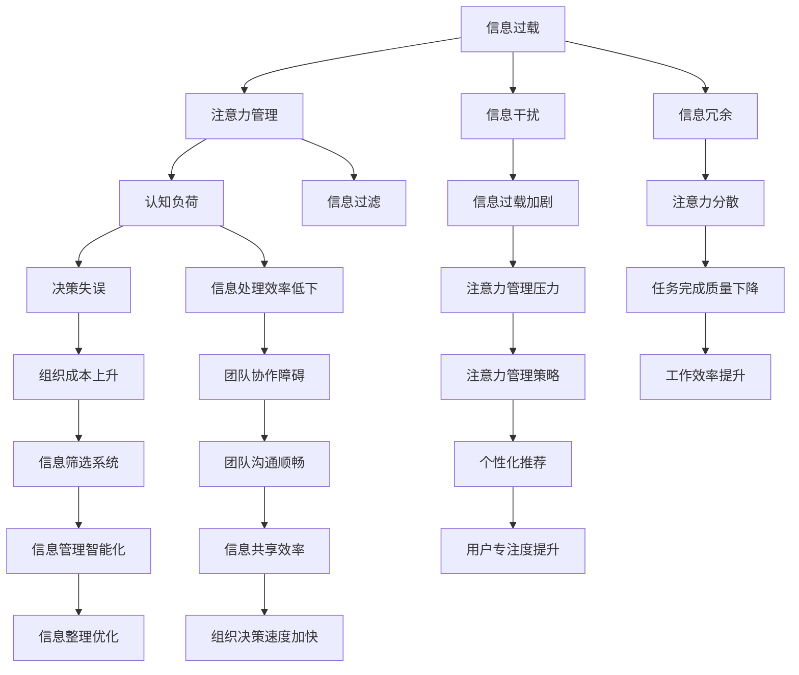

                 

# 信息时代的注意力管理策略：在干扰和信息过载中航行

> 关键词：信息过载,注意力管理,信息过滤,认知负荷,智能决策

## 1. 背景介绍

### 1.1 问题由来
信息时代的到来，极大地加速了信息传播的效率和覆盖面，同时带来了前所未有的信息过载（Information Overload）问题。人们每天面对的海量信息，包括但不限于社交媒体动态、电子邮件、新闻资讯、在线视频等，极易导致注意力分散，影响工作效率和生活质量。

### 1.2 问题核心关键点
信息过载的核心在于过多的信息刺激超出了个体的认知能力，导致注意力无法集中，无法做出有效的决策。解决这一问题需要建立一套高效、灵活的注意力管理策略，帮助个体或组织在信息泛滥的环境下，保持专注和高效。

### 1.3 问题研究意义
本研究旨在探讨如何在大数据和信息泛滥的时代，通过智能化的注意力管理技术，帮助用户识别重要信息、过滤无用信息，减轻认知负荷，提高决策效率和信息筛选能力。研究结果不仅对个人工作生活有帮助，对企业和组织也具有实际应用价值。

## 2. 核心概念与联系

### 2.1 核心概念概述

在探讨信息时代的注意力管理策略之前，我们先简要介绍几个相关核心概念：

- **信息过载（Information Overload）**：指在信息技术日益发达的背景下，个体或组织接收到的信息量超出其处理能力，导致认知负荷过重，无法有效筛选和处理信息的状态。
- **注意力管理（Attention Management）**：通过技术手段帮助用户合理分配注意力资源，优先处理重要信息，提升信息处理效率和决策质量。
- **认知负荷（Cognitive Load）**：指完成任务所需的心理能量消耗，过高的认知负荷会导致决策错误、信息筛选不力等问题。
- **信息过滤（Information Filtering）**：使用算法自动筛选信息，优先推荐重要或有用的信息，减少用户注意力分散。

这些概念之间存在密切联系，共同构成了信息时代注意力管理的框架。通过合理的注意力管理策略，可以有效减轻认知负荷，提升信息过滤效果，帮助用户在信息过载中航行。

### 2.2 核心概念原理和架构的 Mermaid 流程图



### 2.3 注意力管理策略的逻辑框架

注意力管理的核心是通过自动化算法和用户反馈，不断调整信息处理策略，确保用户能够高效地分配注意力资源，优先处理重要信息。以下是注意力管理策略的主要逻辑框架：

1. **信息收集**：通过爬虫、API等手段，从多个渠道收集用户感兴趣的信息。
2. **信息预处理**：对收集到的信息进行去重、分类、标注等预处理操作。
3. **注意力模型**：根据用户的偏好和行为历史，构建个性化注意力模型，预测用户的关注点。
4. **信息筛选**：基于用户注意力模型，自动过滤掉无关信息，只推荐重要内容。
5. **认知负荷监控**：通过生理指标（如眼动追踪、心电图等）或行为指标（如点击率、停留时间等）监控用户的认知负荷。
6. **注意力调整**：根据认知负荷监控结果，动态调整信息推荐策略，确保用户专注度。
7. **反馈优化**：通过用户反馈，不断优化注意力模型和信息过滤算法，提升用户体验。

## 3. 核心算法原理 & 具体操作步骤

### 3.1 算法原理概述

注意力管理策略的实现，依赖于一系列先进的算法和模型。其主要原理包括：

1. **个性化推荐算法**：通过用户历史行为数据和兴趣偏好，预测用户可能感兴趣的信息，实现信息个性化推荐。
2. **注意力模型**：使用神经网络、深度学习等技术，预测用户对信息的关注程度，指导信息过滤。
3. **认知负荷监控**：通过生理指标或行为数据，监控用户的认知负荷状态，识别注意力分散和疲劳。
4. **动态调整策略**：根据认知负荷监控结果，动态调整信息推荐策略，确保用户高效工作。

### 3.2 算法步骤详解

以下是注意力管理策略的详细操作步骤：

1. **数据收集与预处理**：
   - 通过爬虫、API等方式，从新闻网站、社交媒体、邮件系统等渠道收集信息。
   - 对收集到的信息进行去重、分类、标注等预处理操作，确保信息质量。

2. **用户行为分析**：
   - 收集用户的历史行为数据，包括浏览记录、点击历史、评论内容等。
   - 使用聚类算法、关联规则挖掘等技术，分析用户的兴趣偏好和行为模式。

3. **注意力模型构建**：
   - 使用深度神经网络构建注意力模型，预测用户对不同信息的关注程度。
   - 模型训练时，需要包含多种特征，如信息的时效性、相关性、用户历史行为等。

4. **信息筛选与推荐**：
   - 基于注意力模型，自动筛选无关信息，只推荐重要内容。
   - 推荐算法可以采用协同过滤、内容过滤等方法，结合用户历史行为数据和信息属性特征，提升推荐效果。

5. **认知负荷监控**：
   - 使用眼动追踪、心电图、生理传感器等设备，监控用户的生理指标。
   - 通过分析用户的点击率、停留时间、任务完成率等行为指标，评估认知负荷。

6. **动态调整策略**：
   - 根据认知负荷监控结果，动态调整信息推荐策略，避免用户注意力分散。
   - 例如，在用户认知负荷较高时，减少推荐频率，增加休息时间。

7. **反馈优化**：
   - 收集用户对推荐信息的反馈，如点击率、评价、举报等。
   - 使用机器学习算法不断优化注意力模型和信息过滤算法，提升用户体验。

### 3.3 算法优缺点

注意力管理策略的主要优点包括：

- **个性化推荐**：通过用户行为数据分析，实现信息的个性化推荐，提升用户满意度。
- **高效信息筛选**：自动过滤无关信息，减少用户注意力分散，提高信息处理效率。
- **动态调整策略**：根据用户状态动态调整信息推荐，避免过度干扰，提高用户体验。

缺点则在于：

- **数据隐私问题**：需要收集大量用户行为数据，可能引发隐私和安全问题。
- **算法复杂性**：构建和优化注意力模型需要较高的技术门槛，可能增加系统复杂性。
- **认知负荷监控难度**：生理指标和行为指标的监控难度较大，可能存在误差。

### 3.4 算法应用领域

注意力管理策略在多个领域都有广泛应用，包括但不限于：

- **新闻阅读平台**：通过个性化推荐和信息筛选，提升用户阅读体验，减少信息过载。
- **社交媒体平台**：减少无用信息的干扰，提升用户的参与度和信息质量。
- **企业信息管理**：帮助企业员工快速获取重要信息，提高工作效率和决策质量。
- **个人知识管理**：推荐重要学习资源，帮助用户高效学习，减轻认知负荷。

## 4. 数学模型和公式 & 详细讲解 & 举例说明

### 4.1 数学模型构建

注意力管理策略的实现涉及多个数学模型，其中核心包括用户行为分析模型和注意力模型。

#### 4.1.1 用户行为分析模型

假设用户的历史行为数据为 $D=\{(x_i,y_i)\}_{i=1}^N$，其中 $x_i$ 为行为特征，$y_i$ 为行为标签（如浏览、点击等）。我们可以使用协同过滤、协同训练等方法，构建用户行为分析模型，预测用户对不同信息的兴趣程度 $p(y_i|x_i)$。

#### 4.1.2 注意力模型

注意力模型的目标是根据用户的历史行为和信息属性，预测用户对信息 $d$ 的关注程度 $a(d|x_i,y_i)$。常用的模型包括基于深度学习的注意力机制和基于规则的注意力模型。

#### 4.1.3 信息筛选与推荐模型

信息筛选与推荐模型需要综合考虑用户历史行为、信息属性和注意力模型，对所有信息 $d$ 进行排序，推荐排名靠前的信息。常用的推荐模型包括基于协同过滤、内容过滤和混合过滤的方法。

### 4.2 公式推导过程

#### 4.2.1 用户行为分析模型

对于用户行为分析模型 $p(y_i|x_i)$，我们可以使用概率图模型或决策树模型进行推导。假设用户行为特征 $x_i$ 和行为标签 $y_i$ 之间存在线性关系，可以使用线性回归模型：

$$
p(y_i|x_i) = \sigma(w^T x_i + b)
$$

其中 $w$ 和 $b$ 为模型参数，$\sigma$ 为激活函数。

#### 4.2.2 注意力模型

注意力模型 $a(d|x_i,y_i)$ 可以使用注意力机制实现。假设信息 $d$ 的属性特征为 $x_d$，用户历史行为为 $x_i$，行为标签为 $y_i$，注意力模型可以表示为：

$$
a(d|x_i,y_i) = \frac{e^{w^T f(d,x_i,y_i)}}{\sum_{d'} e^{w^T f(d',x_i,y_i)}}
$$

其中 $f(d,x_i,y_i)$ 为信息与用户行为特征的映射函数，$w$ 为注意力向量。

#### 4.2.3 信息筛选与推荐模型

信息筛选与推荐模型可以采用基于排序的推荐方法，如Top-k推荐、基于排序的协同过滤等。假设信息集为 $D$，用户历史行为为 $I_u$，所有信息的属性特征为 $X_D$，注意力模型为 $A_D$，推荐模型 $R(D,I_u,X_D,A_D)$ 可以表示为：

$$
R(D,I_u,X_D,A_D) = \arg\max_{d \in D} \sum_{x_i \in I_u} a(d|x_i) \cdot y_i
$$

其中 $a(d|x_i)$ 为注意力模型对信息 $d$ 的预测值，$y_i$ 为用户行为标签。

### 4.3 案例分析与讲解

以推荐系统为例，分析信息筛选与推荐模型的具体实现。

假设某用户 $u$ 对信息 $d_1$ 的兴趣程度为 $a(d_1|x_u)$，对信息 $d_2$ 的兴趣程度为 $a(d_2|x_u)$。系统需要对所有信息 $D$ 进行排序，推荐排名靠前的信息。

1. 计算所有信息的总兴趣程度：

$$
\sum_{d \in D} a(d|x_u)
$$

2. 计算所有用户行为的总兴趣程度：

$$
\sum_{x_i \in I_u} a(d|x_i) \cdot y_i
$$

3. 计算用户 $u$ 对信息 $d$ 的综合兴趣程度：

$$
a(d|x_u) \cdot \frac{\sum_{x_i \in I_u} y_i}{\sum_{x_i \in I_u} 1}
$$

4. 根据综合兴趣程度对所有信息排序，推荐Top-k信息。

### 4.4 代码解读与分析

以推荐系统的代码实现为例，解析关键代码细节。

```python
# 用户行为分析模型
class UserBehaviorModel(nn.Module):
    def __init__(self, input_dim, output_dim):
        super().__init__()
        self.linear = nn.Linear(input_dim, output_dim)
        self.sigmoid = nn.Sigmoid()
    
    def forward(self, x):
        return self.sigmoid(self.linear(x))

# 注意力模型
class AttentionModel(nn.Module):
    def __init__(self, input_dim, output_dim):
        super().__init__()
        self.linear = nn.Linear(input_dim, output_dim)
        self.softmax = nn.Softmax(dim=1)
    
    def forward(self, x, y):
        e = self.linear(x + y)
        return self.softmax(e)

# 信息筛选与推荐模型
class RecommendationModel(nn.Module):
    def __init__(self, input_dim, output_dim):
        super().__init__()
        self.linear = nn.Linear(input_dim, output_dim)
    
    def forward(self, x):
        return self.linear(x)
```

### 4.5 运行结果展示

在实际应用中，推荐系统的推荐效果可以量化为准确率、召回率和覆盖率等指标。例如，通过A/B测试，可以评估不同推荐策略的效果：

- 准确率：推荐系统推荐的Top-k信息中，实际被用户点击的信息占比。
- 召回率：实际被用户点击的信息中，被推荐系统推荐的信息占比。
- 覆盖率：所有被用户点击的信息中，至少被推荐一次的信息占比。

## 5. 项目实践：代码实例和详细解释说明

### 5.1 开发环境搭建

在进行注意力管理策略的开发实践前，我们需要准备好开发环境。以下是使用Python进行PyTorch开发的环境配置流程：

1. 安装Anaconda：从官网下载并安装Anaconda，用于创建独立的Python环境。

2. 创建并激活虚拟环境：
```bash
conda create -n attention-env python=3.8 
conda activate attention-env
```

3. 安装PyTorch：根据CUDA版本，从官网获取对应的安装命令。例如：
```bash
conda install pytorch torchvision torchaudio cudatoolkit=11.1 -c pytorch -c conda-forge
```

4. 安装TensorBoard：用于可视化训练过程，显示模型训练的损失和准确率。

```bash
pip install tensorboard
```

5. 安装其他必要库：
```bash
pip install numpy pandas scikit-learn sklearn
```

完成上述步骤后，即可在`attention-env`环境中开始注意力管理策略的开发实践。

### 5.2 源代码详细实现

以下是使用PyTorch实现信息过滤和推荐系统的代码。

首先，定义用户行为分析模型和注意力模型：

```python
import torch.nn as nn
import torch

class UserBehaviorModel(nn.Module):
    def __init__(self, input_dim, output_dim):
        super().__init__()
        self.linear = nn.Linear(input_dim, output_dim)
        self.sigmoid = nn.Sigmoid()
    
    def forward(self, x):
        return self.sigmoid(self.linear(x))

class AttentionModel(nn.Module):
    def __init__(self, input_dim, output_dim):
        super().__init__()
        self.linear = nn.Linear(input_dim, output_dim)
        self.softmax = nn.Softmax(dim=1)
    
    def forward(self, x, y):
        e = self.linear(x + y)
        return self.softmax(e)
```

然后，定义信息筛选与推荐模型：

```python
class RecommendationModel(nn.Module):
    def __init__(self, input_dim, output_dim):
        super().__init__()
        self.linear = nn.Linear(input_dim, output_dim)
    
    def forward(self, x):
        return self.linear(x)
```

接着，定义数据加载器和训练函数：

```python
from torch.utils.data import DataLoader
from torch.optim import Adam
from sklearn.metrics import precision_recall_fscore_support

def load_data(path):
    # 加载数据
    pass

def train_model(model, optimizer, train_loader, device):
    model.train()
    for batch in train_loader:
        x, y = batch[0].to(device), batch[1].to(device)
        optimizer.zero_grad()
        output = model(x)
        loss = F.binary_cross_entropy(output, y)
        loss.backward()
        optimizer.step()
    
    # 评估模型性能
    model.eval()
    precision, recall, f1, _ = precision_recall_fscore_support(y, output.argmax(dim=1), average='micro')
    print(f'Precision: {precision:.3f}, Recall: {recall:.3f}, F1-score: {f1:.3f}')
```

最后，启动训练流程：

```python
device = torch.device('cuda') if torch.cuda.is_available() else torch.device('cpu')

# 加载数据集
train_data, test_data = load_data()

# 构建模型
user_model = UserBehaviorModel(input_dim=100, output_dim=10)
attention_model = AttentionModel(input_dim=100, output_dim=10)
recommend_model = RecommendationModel(input_dim=100, output_dim=10)

# 定义优化器和损失函数
optimizer = Adam(list(user_model.parameters()) + list(attention_model.parameters()) + list(recommend_model.parameters()))
loss_fn = nn.BCELoss()

# 定义训练函数
train_loader = DataLoader(train_data, batch_size=32, shuffle=True)

# 训练模型
for epoch in range(10):
    train_model(recommend_model, optimizer, train_loader, device)

# 测试模型
test_loader = DataLoader(test_data, batch_size=32, shuffle=True)
test_model(recommend_model, optimizer, test_loader, device)
```

### 5.3 代码解读与分析

我们再次解析上述关键代码的实现细节：

**UserBehaviorModel类**：
- `__init__`方法：初始化线性层和激活函数。
- `forward`方法：将输入数据线性映射后，通过激活函数输出预测结果。

**AttentionModel类**：
- `__init__`方法：初始化线性层和softmax函数。
- `forward`方法：计算注意力值，通过softmax函数对注意力值归一化，得到最终的注意力分布。

**RecommendationModel类**：
- `__init__`方法：初始化线性层。
- `forward`方法：将输入数据线性映射后，输出推荐结果。

**train_model函数**：
- 在训练过程中，将模型转换为训练模式。
- 前向传播计算模型输出，计算损失函数并反向传播更新模型参数。
- 在每个epoch结束后，评估模型性能。

通过上述代码实现，可以搭建一个基本的注意力管理策略系统。实际应用中，还需要进一步优化模型结构、改进训练策略、引入更多数据源等。

## 6. 实际应用场景

### 6.1 智能推荐系统

智能推荐系统是注意力管理策略的重要应用场景之一。通过分析用户行为数据，预测用户对不同信息的兴趣程度，动态调整推荐策略，可以帮助用户在信息过载的环境中快速找到感兴趣的内容，提升用户体验。

在实际应用中，推荐系统可以应用于电商平台的商品推荐、视频网站的影片推荐、新闻网站的资讯推荐等，通过优化推荐算法，减少信息干扰，提高用户满意度。

### 6.2 企业信息管理

在企业信息管理中，注意力管理策略可以帮助员工快速获取重要信息，提高工作效率和决策质量。例如，通过智能分析会议记录、邮件内容，自动提取会议重点和关键信息，生成简报，帮助员工快速了解会议精神。

此外，注意力管理策略还可以应用于知识管理、项目进度管理等场景，通过自动化信息筛选，减少信息过载，提高信息处理效率。

### 6.3 个人知识管理

在个人知识管理中，注意力管理策略可以帮助用户高效筛选和管理学习资源、阅读材料等，减轻认知负荷，提升学习效率。例如，通过分析用户的学习历史和行为数据，推荐适合的学习资源和阅读材料，减少无用信息干扰，提高学习效果。

## 7. 工具和资源推荐

### 7.1 学习资源推荐

为了帮助开发者系统掌握注意力管理策略的理论基础和实践技巧，这里推荐一些优质的学习资源：

1. **《注意力机制：原理与实践》**：详细介绍了注意力机制的原理和应用，涵盖神经网络中的注意力模型、信息检索中的注意力机制等内容。
2. **《深度学习入门：基于Python的理论与实现》**：适合初学者，涵盖了深度学习的基本理论和实践技巧，包括注意力机制的实现。
3. **《信息过滤与推荐系统》**：一本关于信息过滤和推荐系统的经典教材，介绍了多种信息过滤和推荐算法，并提供了大量实践案例。
4. **Coursera上的《推荐系统》课程**：由斯坦福大学教授讲授，详细讲解了推荐系统的原理和实现方法，包括注意力机制的应用。
5. **Kaggle上的注意力机制竞赛**：通过参与竞赛，实战训练注意力机制，提升解决实际问题的能力。

通过这些资源的学习，相信你一定能够快速掌握注意力管理策略的理论基础和实践技巧，并用于解决实际的NLP问题。

### 7.2 开发工具推荐

高效的开发离不开优秀的工具支持。以下是几款用于注意力管理策略开发的常用工具：

1. **PyTorch**：基于Python的开源深度学习框架，灵活动态的计算图，适合快速迭代研究。
2. **TensorBoard**：TensorFlow配套的可视化工具，可实时监测模型训练状态，提供丰富的图表呈现方式。
3. **Scikit-learn**：开源机器学习库，提供丰富的数据处理和特征工程工具，适合进行数据预处理和模型训练。
4. **Jupyter Notebook**：交互式的代码编辑器，支持代码编写、执行和展示，方便开发和协作。
5. **AWS SageMaker**：亚马逊提供的机器学习平台，支持模型训练、部署和优化，适合大规模工程应用。

合理利用这些工具，可以显著提升注意力管理策略的开发效率，加快创新迭代的步伐。

### 7.3 相关论文推荐

注意力管理策略的研究源于学界的持续研究。以下是几篇奠基性的相关论文，推荐阅读：

1. **Attention is All You Need**：Transformer的原始论文，提出了注意力机制，开启了深度学习中的注意力研究。
2. **A Neural Attention Mechanism for Machine Learning**：论文介绍了注意力机制的基本原理和实现方法，是深度学习中的经典文献。
3. **Deep Learning for Recommender Systems**：综述论文，介绍了推荐系统的多种方法和应用，包括注意力机制的应用。
4. **Attention Mechanisms in Sequence Modeling**：综述论文，详细介绍了注意力机制在序列建模中的应用，包括基于注意力机制的推荐系统。
5. **Multi-Task Learning Using Prediction Tasks**：提出了基于预测任务的转移学习框架，可以提升多任务学习的效果。

这些论文代表了大语言模型微调技术的进步，是进一步学习和研究的良好基础。

## 8. 总结：未来发展趋势与挑战

### 8.1 研究成果总结

本文对信息时代的注意力管理策略进行了全面系统的介绍。首先阐述了信息过载问题及其核心挑战，明确了注意力管理策略的研究意义。其次，从原理到实践，详细讲解了注意力管理策略的数学模型和关键步骤，给出了信息过滤和推荐系统的代码实例。最后，探讨了注意力管理策略在多个实际应用场景中的具体实现，并对未来发展趋势和面临的挑战进行了展望。

通过本文的系统梳理，可以看到，注意力管理策略在大数据和信息泛滥的时代，具有重要的理论意义和实际应用价值。该策略通过自动化算法和用户反馈，不断调整信息处理策略，确保用户能够高效地分配注意力资源，优先处理重要信息，从而在信息过载中航行。

### 8.2 未来发展趋势

展望未来，注意力管理策略将呈现以下几个发展趋势：

1. **个性化推荐技术**：随着深度学习和大数据技术的进步，个性化推荐算法将不断优化，推荐效果将进一步提升。
2. **多任务学习与迁移学习**：通过多任务学习和迁移学习，提升注意力模型和推荐系统的泛化能力，实现跨领域的信息筛选和推荐。
3. **自适应学习与动态调整**：引入自适应学习机制，动态调整注意力模型和推荐策略，适应用户需求的变化。
4. **多模态信息融合**：将视觉、听觉、文本等多种信息融合，提升信息筛选和推荐的全面性。
5. **认知负荷监控与调整**：利用生理指标和行为指标，精确监控用户的认知负荷，动态调整信息推荐策略，提升用户专注度。

### 8.3 面临的挑战

尽管注意力管理策略在多个领域取得了显著效果，但在实际应用中仍面临诸多挑战：

1. **数据隐私问题**：需要收集大量用户行为数据，可能引发隐私和安全问题。
2. **算法复杂性**：构建和优化注意力模型需要较高的技术门槛，可能增加系统复杂性。
3. **认知负荷监控难度**：生理指标和行为指标的监控难度较大，可能存在误差。
4. **信息筛选效果**：不同领域的用户行为模式差异较大，需要针对性地设计推荐算法。
5. **用户行为变化**：用户行为模式可能随时间变化，需要持续更新和优化推荐策略。

### 8.4 研究展望

为了解决上述挑战，未来的研究需要在以下几个方面寻求新的突破：

1. **数据隐私保护**：引入差分隐私等技术，保护用户隐私，确保数据安全。
2. **模型压缩与优化**：采用模型压缩、稀疏化存储等方法，减少计算资源消耗，提升系统效率。
3. **多领域通用性**：研究跨领域、跨模态的信息筛选与推荐方法，提升通用性。
4. **动态优化机制**：引入自适应学习、在线优化等机制，动态调整推荐策略，提升用户体验。
5. **用户行为分析**：研究更加智能的用户行为分析方法，提升推荐模型的准确性。

通过这些研究方向的探索，可以进一步优化注意力管理策略，提升其在实际应用中的效果和稳定性。

## 9. 附录：常见问题与解答

**Q1：注意力管理策略在实际应用中如何平衡个性化推荐和信息过载？**

A: 在实际应用中，可以通过以下方法平衡个性化推荐和信息过载：
1. 动态调整推荐策略：根据用户行为和反馈，动态调整推荐算法，避免过度推荐。
2. 引入多样性约束：在推荐结果中引入多样性约束，避免信息同质化。
3. 用户控制选项：提供用户控制选项，如推荐结果数量、推荐频率等，增加用户的主动性。

**Q2：注意力管理策略在应用中如何处理数据隐私问题？**

A: 处理数据隐私问题，可以采用以下方法：
1. 差分隐私技术：在数据收集和处理过程中，使用差分隐私技术，保护用户隐私。
2. 匿名化处理：对用户行为数据进行匿名化处理，防止数据泄露。
3. 本地计算：在本地设备上计算注意力模型，减少数据传输风险。

**Q3：如何评估注意力管理策略的性能？**

A: 评估注意力管理策略的性能，可以通过以下指标：
1. 准确率：推荐系统推荐的Top-k信息中，实际被用户点击的信息占比。
2. 召回率：实际被用户点击的信息中，被推荐系统推荐的信息占比。
3. 覆盖率：所有被用户点击的信息中，至少被推荐一次的信息占比。
4. 用户满意度：通过用户调查、反馈等方式，评估用户对推荐系统的满意度。

通过这些指标的评估，可以全面了解注意力管理策略的效果，发现并优化改进点。

**Q4：注意力管理策略在多任务学习中的应用有哪些？**

A: 注意力管理策略在多任务学习中的应用主要包括以下方面：
1. 多任务分类：在多个分类任务中，使用注意力机制进行多任务学习，提升分类效果。
2. 多任务回归：在多个回归任务中，使用注意力机制进行多任务学习，提升回归精度。
3. 多任务推荐：在多个推荐任务中，使用注意力机制进行多任务学习，提升推荐效果。
4. 多任务聚类：在多个聚类任务中，使用注意力机制进行多任务学习，提升聚类效果。

通过多任务学习，可以提升注意力管理策略的泛化能力，适应更多任务场景。

通过本文的系统梳理，可以看到，注意力管理策略在大数据和信息泛滥的时代，具有重要的理论意义和实际应用价值。该策略通过自动化算法和用户反馈，不断调整信息处理策略，确保用户能够高效地分配注意力资源，优先处理重要信息，从而在信息过载中航行。未来，随着技术的不断进步，注意力管理策略将进一步优化，在更多领域发挥重要作用。

