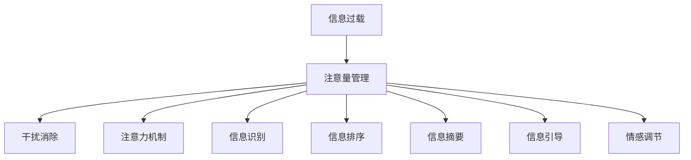

                 

# 信息时代的注意量管理挑战与策略：在干扰和信息过载中航行

> 关键词：信息过载,注意量管理,干扰消除,注意力机制,大数据,人工智能

## 1. 背景介绍

### 1.1 问题由来
随着互联网技术的普及和数字化的深入，人类面临的信息环境发生了巨大变化。信息量的爆炸性增长和媒体形式的日益丰富，使我们身处于一个信息过载的时代。信息的充斥使人们难以辨别有用和无用信息，从而影响到认知负荷、决策效率和生活质量。在这种情况下，如何管理好自己的注意力，以高效、准确地获取所需信息，成为了我们面临的一个重要挑战。

### 1.2 问题核心关键点
在信息过载的环境下，注意量管理主要关注如何通过技术手段，对接收到的信息进行筛选、过滤，从而将人们的注意力引导到重要的信息上。具体来说，主要包括以下几个关键点：
1. **信息识别**：从大量无序信息中自动甄别出与用户兴趣或需求相关的信息。
2. **信息排序**：根据重要性、相关性等指标，对信息进行排序，便于用户快速获取关键信息。
3. **信息摘要**：对长文本进行压缩，提取关键要点，生成简洁的摘要。
4. **注意力引导**：设计合适的交互界面，引导用户注意力到最重要或最相关的信息上。
5. **情感调节**：调节信息的情感色彩，避免过度刺激或乏味，提升用户的信息接受度和满意度。

### 1.3 问题研究意义
在信息过载的时代，高效的信息注意量管理具有重要的现实意义：
1. **提升决策效率**：通过自动筛选和排序信息，帮助用户更快地做出决策。
2. **减少认知负荷**：自动化的信息管理可以减轻用户的认知负担，提高信息处理效率。
3. **提升生活质量**：通过个性化信息推荐，帮助用户找到感兴趣的资料，提高生活品质。
4. **优化资源分配**：通过智能化的信息管理，合理分配注意力资源，避免信息浪费。
5. **推动产业发展**：信息注意量管理技术可以应用于众多行业，提升产业效率，创造新的商业价值。

## 2. 核心概念与联系

### 2.1 核心概念概述

要理解信息时代的注意量管理，首先需要了解几个关键的概念：

- **信息过载**：在互联网时代，信息产生速度和规模远超人类处理能力，用户很难从中获得有价值的信息。
- **注意量管理**：通过技术手段，帮助用户从大量信息中筛选出重要内容，优化信息获取体验。
- **干扰消除**：识别并消除干扰性信息，提升信息处理质量。
- **注意力机制**：模仿人类注意力工作原理，设计机器学习模型，优化信息获取的效率和准确性。

这些概念之间的逻辑关系可以通过以下Mermaid流程图来展示：



这个流程图展示了信息过载到注意量管理的全过程，每个步骤都是信息管理的关键环节。

## 3. 核心算法原理 & 具体操作步骤

### 3.1 算法原理概述

信息时代的注意量管理主要依赖于以下三个核心算法原理：

- **信息识别算法**：从海量信息中自动提取相关内容，主要基于文本分类、关键词抽取等技术。
- **信息排序算法**：根据信息的重要性和相关性进行排序，主要基于机器学习中的排序算法，如推荐系统、排序网络等。
- **注意力机制算法**：模仿人类注意力，设计机器学习模型，对信息进行加权处理，优化信息获取效率和质量。

### 3.2 算法步骤详解

#### 3.2.1 信息识别算法
**步骤1**：数据预处理
- 收集互联网上的文本数据，包括新闻、社交媒体、网页等。
- 使用自然语言处理(NLP)技术，对文本进行分词、去除停用词、词性标注等处理。

**步骤2**：特征提取
- 利用TF-IDF、word2vec等技术，提取文本的特征向量。
- 使用机器学习模型，如SVM、随机森林等，对文本进行分类，识别出相关内容。

**步骤3**：结果筛选
- 根据分类结果，筛选出与用户需求相关的信息。
- 结合用户行为数据（如浏览历史、搜索记录等），进一步优化筛选效果。

#### 3.2.2 信息排序算法
**步骤1**：特征工程
- 对筛选出的信息进行特征提取，如文本长度、关键词权重等。
- 使用机器学习模型，如梯度提升树、深度学习等，构建排序模型。

**步骤2**：模型训练
- 使用标注好的数据集进行模型训练。
- 在训练过程中，引入交叉验证等技术，防止模型过拟合。

**步骤3**：结果排序
- 将训练好的模型应用于未标注数据，对信息进行排序。
- 结合用户的交互行为，不断调整排序结果，提高准确性。

#### 3.2.3 注意力机制算法
**步骤1**：模型设计
- 设计基于注意力机制的神经网络模型，如Transformer、GRU等。
- 利用注意力机制，对文本中的重要部分进行加权处理，提升信息处理效率。

**步骤2**：模型训练
- 使用标注好的数据集进行模型训练。
- 在训练过程中，引入正则化技术，防止模型过拟合。

**步骤3**：结果优化
- 将训练好的模型应用于新的文本数据，进行信息加权处理。
- 根据用户反馈，不断优化模型参数，提高信息获取效果。

### 3.3 算法优缺点

信息时代的注意量管理主要依赖于机器学习算法，具有以下优点：
1. **高效性**：自动化的信息管理，可以快速处理大量信息，提高信息获取效率。
2. **个性化**：通过用户行为数据，可以提供个性化的信息推荐。
3. **可扩展性**：机器学习算法可以方便地集成到各类应用中，提升用户体验。

同时，这些算法也存在一些缺点：
1. **依赖数据**：需要大量的标注数据进行训练，数据获取成本较高。
2. **模型复杂**：复杂的算法模型，可能需要较多的计算资源和时间。
3. **模型泛化**：在特定领域的信息管理效果可能不如人意。
4. **隐私问题**：个人信息的收集和使用，可能涉及隐私问题。

### 3.4 算法应用领域

信息时代的注意量管理技术已经在多个领域得到了广泛应用：

- **新闻推荐系统**：如今日头条、腾讯新闻等，通过自动信息识别和排序，为用户推荐相关新闻。
- **社交媒体内容推荐**：如微博、Facebook等，通过分析用户兴趣，推荐相关内容。
- **智能客服系统**：如阿里云、腾讯云等，通过自动信息识别和注意力引导，提升客户服务质量。
- **在线教育平台**：如Coursera、Udacity等，通过个性化信息推荐，提升学习效果。
- **企业信息管理系统**：如SAP、Oracle等，通过信息识别和排序，优化业务决策。

## 4. 数学模型和公式 & 详细讲解 & 举例说明

### 4.1 数学模型构建

为了更精确地描述信息时代的注意量管理，我们引入数学模型进行讲解。

设信息集为 $D = \{d_1, d_2, \ldots, d_N\}$，其中 $d_i$ 表示第 $i$ 条信息。用户对每条信息的评分向量为 $\mathbf{R} = \{r_1, r_2, \ldots, r_N\}$，其中 $r_i$ 表示用户对 $d_i$ 的评分。

模型的目标是最大化用户评分的期望，即：

$$
\max_{\theta} \mathbb{E}_{\mathbf{R}} [\sum_{i=1}^N r_i g_i(\theta)]
$$

其中 $g_i(\theta)$ 表示信息 $d_i$ 通过模型 $\theta$ 的评分。

### 4.2 公式推导过程

基于上述模型，我们使用梯度上升算法进行模型训练。模型的损失函数为：

$$
L(\theta) = -\frac{1}{N} \sum_{i=1}^N [r_i g_i(\theta) - \mathbb{E}_{\mathbf{R}} [r_i g_i(\theta)]]
$$

求导后得到梯度更新公式：

$$
\theta \leftarrow \theta + \eta \nabla_{\theta}L(\theta)
$$

其中 $\eta$ 为学习率。

### 4.3 案例分析与讲解

以新闻推荐系统为例，说明信息排序算法的应用：

**数据集准备**
- 收集用户的历史浏览记录，提取其中的新闻标题和链接。
- 对新闻标题进行分词、去停用词等处理，提取关键词。

**特征提取**
- 使用TF-IDF算法，计算每个关键词的权重。
- 将新闻标题和关键词组成的向量作为特征输入。

**模型训练**
- 使用随机森林等算法，对新闻进行分类和排序。
- 在训练过程中，引入交叉验证，防止过拟合。

**结果展示**
- 根据用户的评分和交互行为，推荐新闻列表。
- 定期更新模型，优化排序结果，提升推荐效果。

## 5. 项目实践：代码实例和详细解释说明

### 5.1 开发环境搭建

为了进行信息注意量管理的项目实践，需要准备以下开发环境：

1. **Python环境**：安装Python 3.x版本，使用虚拟环境（如Anaconda）进行隔离。
2. **机器学习库**：安装Scikit-Learn、TensorFlow、Keras等机器学习库，用于构建和训练模型。
3. **自然语言处理库**：安装NLTK、spaCy等NLP库，用于文本预处理和特征提取。
4. **数据处理库**：安装Pandas、NumPy等数据处理库，用于数据清洗和存储。
5. **Web框架**：安装Flask等Web框架，用于构建信息推荐系统的接口。

### 5.2 源代码详细实现

以下是一个简单的信息推荐系统的实现代码：

```python
import pandas as pd
from sklearn.feature_extraction.text import TfidfVectorizer
from sklearn.ensemble import RandomForestClassifier
from sklearn.model_selection import train_test_split
from flask import Flask, request, jsonify

# 加载数据集
data = pd.read_csv('news_data.csv')

# 特征提取
tfidf = TfidfVectorizer(stop_words='english')
X = tfidf.fit_transform(data['title'])
y = data['category']

# 数据划分
X_train, X_test, y_train, y_test = train_test_split(X, y, test_size=0.2, random_state=42)

# 模型训练
clf = RandomForestClassifier(n_estimators=100, random_state=42)
clf.fit(X_train, y_train)

# 模型评估
print(clf.score(X_test, y_test))

# Flask应用
app = Flask(__name__)

@app.route('/recommend', methods=['POST'])
def recommend():
    title = request.json['title']
    predicted_category = clf.predict(tfidf.transform([title]))[0]
    return jsonify({'category': predicted_category})

if __name__ == '__main__':
    app.run(host='0.0.0.0', port=5000)
```

**代码解释**：
- 使用Pandas库加载新闻数据集，提取标题和类别。
- 使用TF-IDF算法提取文本特征。
- 使用随机森林模型对新闻进行分类和排序。
- 使用Flask框架构建API接口，接收新闻标题作为输入，返回预测类别。

### 5.3 代码解读与分析

在上述代码中，我们使用了Pandas库进行数据处理，Sklearn库进行机器学习模型的训练和评估，Flask框架构建Web服务接口。这些库的选择和应用，体现了信息注意量管理项目的主要技术栈和开发流程。

具体来说：
- **数据加载**：使用Pandas库，方便数据导入和预处理。
- **特征提取**：使用TF-IDF算法，提取文本关键词，转换为向量形式。
- **模型训练**：使用随机森林算法，对新闻进行分类和排序。
- **接口构建**：使用Flask框架，构建API接口，提供信息推荐服务。

### 5.4 运行结果展示

运行上述代码，可以通过访问 `http://localhost:5000/recommend`，输入新闻标题，获取预测类别。例如，输入 `"The AI revolution is here"`，可能得到 `technology` 类别的预测。

## 6. 实际应用场景

### 6.1 智能推荐系统
智能推荐系统是信息注意量管理的典型应用场景。通过自动化的信息识别和排序，智能推荐系统可以为用户推荐感兴趣的内容，提升用户体验。例如，Amazon的推荐系统通过分析用户行为，推荐相关商品，大幅提升了用户购买率。

### 6.2 智能客服
智能客服系统通过自然语言处理技术，自动筛选用户输入，引导客户获取最相关的服务信息。例如，阿里云的智能客服系统，可以根据用户输入的自然语言，自动匹配并回答用户问题，提升服务效率。

### 6.3 个性化学习
在线教育平台通过分析用户学习行为，推荐相关课程和学习材料，提升学习效果。例如，Coursera根据用户的历史学习数据，推荐感兴趣和适合的课程，帮助用户高效学习。

### 6.4 企业信息管理
企业信息管理系统通过自动化的信息识别和排序，帮助管理者快速获取关键信息，优化决策过程。例如，SAP的ERP系统通过信息管理模块，自动化处理大量业务数据，提升企业运营效率。

## 7. 工具和资源推荐

### 7.1 学习资源推荐

为了系统掌握信息注意量管理的知识，推荐以下学习资源：

1. **《信息检索原理与实践》**：介绍信息检索的基础原理和应用，涵盖信息识别、排序、推荐等关键技术。
2. **《深度学习与推荐系统》**：讲解深度学习在推荐系统中的应用，包含神经网络、注意力机制等算法。
3. **《自然语言处理综论》**：全面介绍自然语言处理技术，涵盖文本分类、关键词抽取、情感分析等方法。
4. **Coursera上的机器学习课程**：由斯坦福大学开设，涵盖机器学习的基本概念和算法，适合初学者入门。
5. **Kaggle数据竞赛**：通过实际数据集进行信息管理项目的实践，提升实战能力。

### 7.2 开发工具推荐

信息注意量管理的项目开发需要依赖多种工具，以下是推荐的开发工具：

1. **Python**：作为数据科学和机器学习的通用语言，Python具有丰富的库和框架，适合进行信息管理项目开发。
2. **Jupyter Notebook**：用于数据处理、模型训练和结果展示，提供交互式编程环境。
3. **TensorFlow**：深度学习框架，支持神经网络模型的构建和训练。
4. **Flask**：Web框架，用于构建信息推荐系统的API接口。
5. **Scikit-Learn**：机器学习库，提供多种算法和工具，方便数据处理和模型训练。

### 7.3 相关论文推荐

为了深入理解信息注意量管理技术，推荐以下相关论文：

1. **Attention is All You Need**：介绍Transformer模型和注意力机制，为信息注意量管理提供了基础理论。
2. **Hierarchical Attention Networks for Document Classification**：提出多层注意力网络，提升文本分类模型的效果。
3. **Neural Collaborative Filtering**：介绍神经网络在推荐系统中的应用，提升推荐系统的准确性和多样性。
4. **Deep Attention Based Recommender System**：使用深度学习模型进行信息排序，提升推荐系统的效果。
5. **A Survey on Attention Mechanisms in Recommender Systems**：全面综述注意力机制在推荐系统中的应用，涵盖多种算法和技术。

## 8. 总结：未来发展趋势与挑战

### 8.1 研究成果总结

信息注意量管理技术已经取得了显著的进展，主要体现在以下几个方面：
1. **模型效果提升**：通过深度学习模型和注意力机制，信息管理效果显著提升。
2. **技术应用广泛**：信息注意量管理已经应用于多个领域，提升用户体验和企业效率。
3. **用户需求满足**：通过个性化信息推荐，满足用户多样化需求，提升生活质量。

### 8.2 未来发展趋势

展望未来，信息注意量管理技术将呈现以下趋势：

1. **深度学习算法应用**：深度学习模型在信息管理中的应用将更加广泛，提升信息识别和排序的准确性。
2. **跨模态信息处理**：结合视觉、听觉等多种模态信息，提升信息管理的效果。
3. **实时信息处理**：实时信息处理技术的发展，将使得信息管理更加及时、高效。
4. **分布式计算**：分布式计算技术的应用，将使得信息管理任务可以在大规模数据集上高效进行。
5. **多任务学习**：多任务学习技术的应用，将使得信息管理任务可以同时处理多种任务，提升系统效率。

### 8.3 面临的挑战

尽管信息注意量管理技术取得了显著进展，但仍然面临以下挑战：
1. **数据获取困难**：大量标注数据的获取成本较高，影响信息管理的质量和效率。
2. **模型泛化性不足**：模型在不同领域和数据集上的泛化能力有限，需要进一步提升。
3. **计算资源需求高**：深度学习模型的训练和推理需要较高的计算资源，影响信息管理的可扩展性。
4. **隐私和安全问题**：用户数据的安全和隐私保护，是信息管理项目的重要挑战。
5. **算法透明性不足**：模型决策过程的不透明性，导致用户难以理解和信任信息管理系统的输出。

### 8.4 研究展望

为应对上述挑战，未来的研究需要在以下几个方面进行突破：

1. **无监督学习技术**：探索无监督学习算法，减少对标注数据的依赖，提升信息管理的灵活性。
2. **模型压缩和加速**：开发模型压缩和加速技术，降低计算资源的需求，提升信息管理的可扩展性。
3. **隐私保护技术**：引入隐私保护算法，保障用户数据的安全和隐私。
4. **算法透明性提升**：研究可解释性算法，提升模型的透明性和可信度。
5. **跨领域应用**：将信息管理技术应用到更多领域，提升系统的普适性和实用性。

## 9. 附录：常见问题与解答

**Q1: 信息注意量管理如何处理大量的无标签数据？**

A: 信息注意量管理可以通过自监督学习技术，从大量的无标签数据中提取有用信息。例如，使用文本生成、文本分类等自监督任务，对无标签数据进行预处理和特征提取。然后，通过构建监督学习模型，对信息进行识别和排序。

**Q2: 信息注意量管理是否适用于所有类型的信息？**

A: 信息注意量管理技术主要适用于文本、图像、视频等多种类型的信息。但对于音频、视频等复杂信息，需要进行额外的处理，如语音识别、视频分析等。

**Q3: 如何优化信息注意量管理的模型性能？**

A: 优化信息注意量管理模型性能的关键在于数据预处理、模型选择和参数调优。具体来说，可以采用数据增强技术、模型集成、超参数调优等方法，提升模型的泛化能力和性能。

**Q4: 信息注意量管理是否会带来隐私问题？**

A: 信息注意量管理过程中涉及用户数据的收集和使用，需要注意隐私保护。可以使用数据脱敏、匿名化等技术，确保用户数据的安全。

**Q5: 信息注意量管理在实际应用中如何实现个性化推荐？**

A: 信息注意量管理可以通过分析用户行为数据，识别用户的兴趣和偏好。然后，结合实时信息，动态生成个性化的信息推荐列表。例如，电商平台的个性化推荐系统，通过分析用户浏览记录和购买历史，推荐感兴趣的商品。

---

作者：禅与计算机程序设计艺术 / Zen and the Art of Computer Programming

