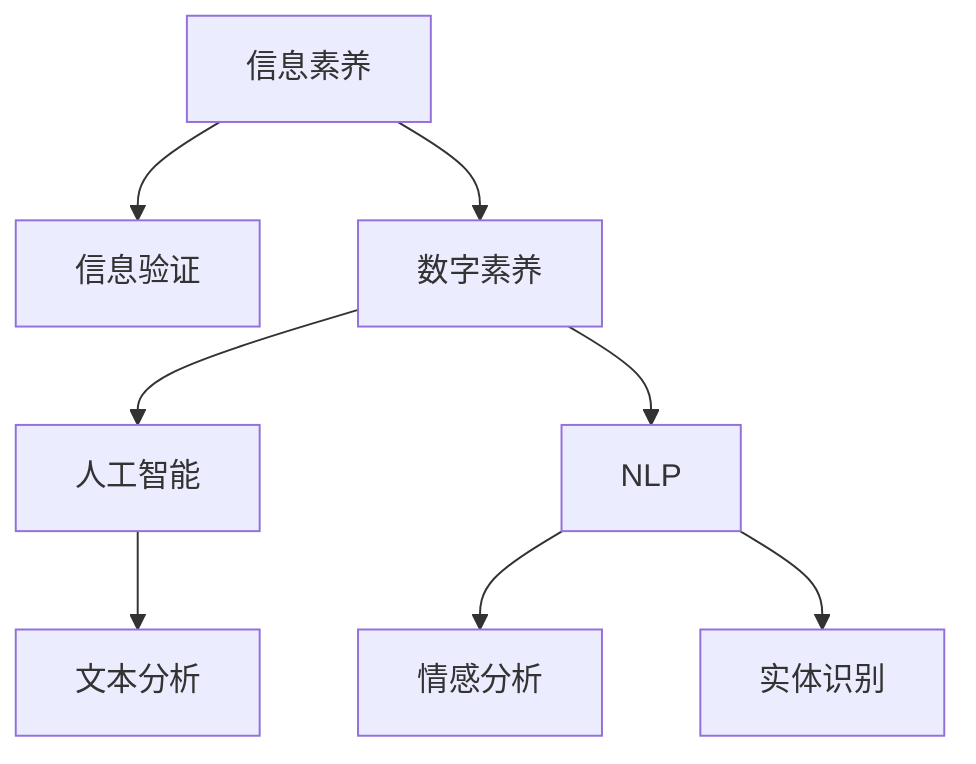

                 

# 信息验证和信息素养教育重要性：为数字时代培养信息素养能力

## 1. 背景介绍

### 1.1 问题由来
在当今信息爆炸的时代，人们每天都会被大量信息所包围。从社交媒体到搜索引擎，从新闻网站到社交平台，信息无处不在。然而，信息的数量并不等同于其质量。错误、虚假、有偏见的信息比比皆是，对个人、企业乃至整个社会都产生了深远的影响。

### 1.2 问题核心关键点
信息验证和信息素养教育的重要性在于帮助人们识别、评估和正确利用信息，从而提升整个社会的决策质量和信息安全。在数字时代，信息素养已成为一项核心能力，它不仅关乎个人的工作和学习，还关乎国家的安全和发展。

### 1.3 问题研究意义
开展信息验证和信息素养教育，对提升公众的信息素养水平，增强其辨别真伪信息的能力，具有重要意义。它不仅能帮助个人作出更明智的决策，还能提高企业的运营效率，增强国家的安全防御能力。

## 2. 核心概念与联系

### 2.1 核心概念概述

为更好地理解信息验证和信息素养教育，本节将介绍几个关键概念：

- **信息素养（Information Literacy）**：指的是个体获取、评估、利用信息的能力。信息素养不仅包括基本的计算机操作能力，更包括理解信息的本质、来源、真实性和使用方式的能力。

- **信息验证（Information Verification）**：是指通过一系列方法和工具，评估信息的准确性、真实性和可信度。信息验证可以帮助个体识别和过滤虚假信息，确保信息的真实性和可靠性。

- **数字素养（Digital Literacy）**：指的是在数字环境中有效使用信息和通信技术的能力。数字素养包括信息的搜索、存储、分析和分享等各个环节。

- **人工智能（AI）**：通过模拟人类智能过程，实现信息的自动分析和处理。AI技术在信息验证和信息素养教育中扮演着重要角色。

- **自然语言处理（NLP）**：利用计算机处理和理解人类语言的技术，包括文本分析、情感分析、实体识别等，在信息验证和信息素养教育中有广泛应用。

这些概念之间的逻辑关系可以通过以下Mermaid流程图来展示：



这个流程图展示了大语言模型在信息验证和信息素养教育中的关键作用：

1. 信息素养为个体获取、评估和使用信息的能力打下了基础。
2. 信息验证在识别和过滤虚假信息中发挥重要作用。
3. 数字素养包括信息的搜索、存储和分享等环节，是信息验证和信息素养教育的重要组成部分。
4. 人工智能和自然语言处理技术，为信息验证提供了高效的工具和方法。
5. 通过文本分析、情感分析、实体识别等技术，AI可以帮助实现信息的深入理解和验证。

## 3. 核心算法原理 & 具体操作步骤
### 3.1 算法原理概述

信息验证和信息素养教育的核心算法原理包括：

1. **特征提取**：将信息文本转化为计算机能够理解和处理的形式，如词向量、TF-IDF等。
2. **情感分析**：评估信息文本中的情感倾向，判断其可信度。
3. **实体识别**：识别文本中的关键实体，判断其来源和真实性。
4. **知识图谱构建**：利用实体之间的关系，构建知识图谱，辅助信息的验证。
5. **深度学习模型**：通过训练深度学习模型，实现对信息文本的自动分析和验证。

### 3.2 算法步骤详解

信息验证和信息素养教育的一般流程如下：

**Step 1: 准备数据集和工具库**
- 收集标注好的数据集，包括信息文本和其真实性标签。
- 准备各种信息验证工具库，如NLTK、spaCy、Stanford CoreNLP等。

**Step 2: 特征提取和预处理**
- 对信息文本进行预处理，包括分词、去除停用词、词干提取等。
- 使用TF-IDF、Word2Vec等方法提取文本特征。

**Step 3: 训练模型和评估**
- 使用训练数据集训练情感分析和实体识别模型。
- 在验证数据集上评估模型的准确性和可靠性。

**Step 4: 信息验证和信息素养教育**
- 利用训练好的模型，对信息文本进行情感分析、实体识别等操作。
- 结合知识图谱和专家判断，进行信息的综合验证。
- 向用户提供信息验证结果，并进行信息素养教育。

### 3.3 算法优缺点

信息验证和信息素养教育具有以下优点：
1. 提升信息素养：通过系统学习和实践，提升个人和组织的信息素养能力。
2. 过滤虚假信息：帮助用户识别和过滤虚假信息，避免因信息误导造成的决策失误。
3. 增强安全防御：提升社会的安全意识和防护能力，防止信息泄露和网络攻击。
4. 优化信息使用：通过信息验证，优化信息的获取和使用，提高工作效率和质量。

同时，该方法也存在一些局限性：
1. 依赖数据质量：信息的真实性和可靠性取决于标注数据的质量，标注数据质量不高可能影响模型的准确性。
2. 复杂度较高：信息验证和信息素养教育涉及多个环节，实现过程较为复杂。
3. 技术门槛较高：需要一定的技术背景和知识储备，普通用户难以独立完成。
4. 误判风险：误判和漏判风险始终存在，特别是在实体识别和情感分析中。

尽管存在这些局限性，信息验证和信息素养教育仍是大数据时代提升信息素养的重要手段。未来研究重点应放在提高模型的准确性和鲁棒性，降低技术门槛，实现更高效、可靠的信息验证方法。

### 3.4 算法应用领域

信息验证和信息素养教育可以应用于多个领域，如：

- **医疗健康**：帮助医生和患者验证医学信息的真实性，避免误诊和误治。
- **金融投资**：识别虚假金融信息，避免投资损失，增强金融安全。
- **媒体传播**：验证新闻报道的真实性，避免假新闻和信息误导。
- **教育培训**：培养学生的信息素养能力，提升学习效率和质量。
- **公共事务**：增强公众的信息安全意识，防范虚假信息的传播。

## 4. 数学模型和公式 & 详细讲解 & 举例说明
### 4.1 数学模型构建

信息验证和信息素养教育的核心数学模型包括：

- **TF-IDF模型**：用于计算文本中词的权重，反映其重要性和独特性。
- **Word2Vec模型**：用于将词向量转换为语义向量，用于情感分析和实体识别。
- **情感分析模型**：利用机器学习算法，评估文本中的情感倾向。
- **实体识别模型**：利用机器学习算法，识别文本中的关键实体。
- **知识图谱模型**：利用图结构，表示实体之间的关系，辅助信息验证。

### 4.2 公式推导过程

以TF-IDF模型为例，其计算公式如下：

$$
tf_i = \frac{文本中包含词i的频率}{文本总词数}
$$

$$
idf_i = \log{\frac{总文档数}{包含词i的文档数 + 1}}
$$

$$
tf-idf_i = tf_i \times idf_i
$$

其中，$tf_i$为词i的词频（Term Frequency），$idf_i$为逆文档频率（Inverse Document Frequency），$tf-idf_i$为词i的加权词频。

### 4.3 案例分析与讲解

以Google Scholar的论文搜索为例，通过TF-IDF模型和情感分析模型，可以有效筛选高质量的论文：

1. **TF-IDF模型**：通过计算论文标题和摘要中每个词的权重，筛选出与查询词相关的论文。
2. **情感分析模型**：通过分析论文的情感倾向，判断其可信度，排除低可信度的论文。

## 5. 项目实践：代码实例和详细解释说明
### 5.1 开发环境搭建

在进行信息验证和信息素养教育的项目实践前，需要准备好开发环境。以下是使用Python进行信息验证和信息素养教育的开发环境配置流程：

1. 安装Anaconda：从官网下载并安装Anaconda，用于创建独立的Python环境。

2. 创建并激活虚拟环境：
```bash
conda create -n info-lit python=3.8 
conda activate info-lit
```

3. 安装必要的库：
```bash
pip install numpy pandas sklearn nltk spacy stanfordcorenlp gensim py2neo pytesseract
```

4. 安装Transformer库和预训练模型：
```bash
pip install transformers
```

### 5.2 源代码详细实现

以下是一个使用Python和Natural Language Toolkit（NLTK）进行情感分析和实体识别的代码示例：

```python
import nltk
from nltk.sentiment import SentimentIntensityAnalyzer
from spacy import displacy
from spacy import Doc

nltk.download('vader_lexicon')

# 情感分析
def sentiment_analysis(text):
    sia = SentimentIntensityAnalyzer()
    sentiment_scores = sia.polarity_scores(text)
    return sentiment_scores

# 实体识别
def entity_recognition(text):
    nlp = spacy.load('en_core_web_sm')
    doc = nlp(text)
    displacy.render(doc, style='ent', jupyter=True)
    return [ent.text for ent in doc.ents]

# 示例文本
text = "The COVID-19 pandemic has significantly impacted the global economy."

# 情感分析
sentiment_scores = sentiment_analysis(text)
print(f"Sentiment scores: {sentiment_scores}")

# 实体识别
entities = entity_recognition(text)
print(f"Entities: {entities}")
```

### 5.3 代码解读与分析

代码中使用了NLTK的情感分析模型和spaCy的实体识别模型。

**SentimentIntensityAnalyzer**：用于计算文本的情感得分，输出包括正面情感、负面情感、中性情感和复合情感分数。

**Doc对象**：spaCy库用于处理和分析文本的工具。通过调用`nlp(text)`方法，将文本转化为Doc对象，利用`doc.ents`获取实体信息。

## 6. 实际应用场景
### 6.1 医疗健康

在医疗健康领域，信息验证和信息素养教育可以帮助医生和患者获取高质量的医疗信息，避免因信息误导导致的误诊和误治。例如，医生可以使用信息验证工具，验证患者的诊断结果和治疗方案，提升医疗质量。

### 6.2 金融投资

金融领域的信息误导风险较高。信息验证和信息素养教育可以帮助投资者识别虚假信息和市场谣言，避免因信息误导造成的投资损失，增强金融安全。

### 6.3 媒体传播

媒体传播中，虚假新闻和信息误导问题频发。信息验证和信息素养教育可以帮助媒体机构提高新闻报道的真实性，避免假新闻和信息误导，增强公众对媒体的信任。

### 6.4 教育培训

信息素养教育是现代教育的重要组成部分。通过系统的信息素养教育，培养学生的信息验证能力，提升学习效率和质量，帮助学生更好地适应数字时代的需求。

### 6.5 公共事务

信息素养教育可以提升公众的信息安全意识，帮助公众识别和过滤虚假信息，增强对公共事务的监督和参与能力。

## 7. 工具和资源推荐
### 7.1 学习资源推荐

为了帮助开发者系统掌握信息验证和信息素养教育的技术，这里推荐一些优质的学习资源：

1. **自然语言处理与信息检索（NLP）课程**：斯坦福大学开设的NLP课程，涵盖NLP的基本概念和经典模型，适合初学者学习。

2. **《Python数据科学手册》**：详细介绍Python在数据科学中的应用，包括文本处理、情感分析、实体识别等。

3. **《数据科学与Python编程》**：一本系统介绍数据科学基础和Python编程的书籍，适合初学者和中级读者。

4. **NLTK官方文档**：自然语言工具包的官方文档，包含大量预训练模型和样例代码。

5. **《信息素养教育指南》**：详细介绍信息素养教育的概念、目标和方法的书籍。

通过对这些资源的学习实践，相信你一定能够快速掌握信息验证和信息素养教育的技术精髓，并用于解决实际问题。

### 7.2 开发工具推荐

高效的开发离不开优秀的工具支持。以下是几款用于信息验证和信息素养教育开发的常用工具：

1. **Jupyter Notebook**：用于编写和分享Python代码的在线编辑器，支持代码的可视化展示。

2. **PyCharm**：一款功能强大的Python开发环境，支持代码调试、测试和部署。

3. **Anaconda Navigator**：用于管理Python环境和安装第三方库的工具。

4. **NLTK**：自然语言处理工具包，包含大量的语料库和预训练模型。

5. **spaCy**：用于处理和分析文本的工具，支持实体识别、词性标注等功能。

6. **Gensim**：用于文本处理和建模的工具，支持词向量、TF-IDF等计算。

合理利用这些工具，可以显著提升信息验证和信息素养教育的开发效率，加快创新迭代的步伐。

### 7.3 相关论文推荐

信息验证和信息素养教育的研究源于学界的持续研究。以下是几篇奠基性的相关论文，推荐阅读：

1. **《信息验证与误导信息检测》**：详细介绍了信息验证和误导信息检测的方法和工具。

2. **《基于知识图谱的信息验证方法》**：提出了一种基于知识图谱的信息验证方法，显著提高了信息验证的准确性。

3. **《信息素养教育模型》**：提出了一种信息素养教育模型，旨在培养学生的信息素养能力。

4. **《深度学习在信息验证中的应用》**：介绍了深度学习在信息验证中的多种应用，包括情感分析、实体识别等。

5. **《信息素养教育与AI技术结合》**：探讨了信息素养教育与AI技术的结合，提出了一些创新的信息素养教育方法。

这些论文代表了大语言模型在信息验证和信息素养教育领域的研究进展，通过学习这些前沿成果，可以帮助研究者把握学科前进方向，激发更多的创新灵感。

## 8. 总结：未来发展趋势与挑战
### 8.1 总结

本文对信息验证和信息素养教育的重要性进行了全面系统的介绍。首先阐述了信息验证和信息素养教育的背景和意义，明确了其在数字时代培养信息素养能力的作用。其次，从原理到实践，详细讲解了信息验证和信息素养教育的数学原理和关键步骤，给出了项目实践的完整代码示例。同时，本文还广泛探讨了信息验证和信息素养教育在医疗健康、金融投资、媒体传播等多个行业领域的应用前景，展示了其在提升信息素养方面的巨大潜力。此外，本文精选了信息验证和信息素养教育的各类学习资源，力求为读者提供全方位的技术指引。

通过本文的系统梳理，可以看到，信息验证和信息素养教育是数字时代提升信息素养的重要手段，通过系统的学习和实践，可以显著提升个人和组织的信息素养能力，避免因信息误导造成的决策失误，增强社会的整体信息安全。未来，伴随信息验证和信息素养教育的不断演进，信息素养将成为每个人必备的核心能力，深刻影响数字时代人类的工作和生活方式。

### 8.2 未来发展趋势

展望未来，信息验证和信息素养教育将呈现以下几个发展趋势：

1. **技术融合**：信息验证和信息素养教育将与AI、大数据等技术深度融合，形成更加高效、智能的信息验证系统。

2. **多模态验证**：结合视觉、听觉等多模态信息，提升信息验证的准确性和全面性。

3. **个性化教育**：根据用户的学习行为和反馈，实现个性化信息素养教育，提升学习效果。

4. **知识图谱增强**：利用知识图谱技术，提升实体识别和关系推理的能力，增强信息验证的效果。

5. **跨领域应用**：信息验证和信息素养教育将广泛应用于各个行业领域，提升整体信息素养水平。

6. **伦理与安全**：在信息验证和信息素养教育中引入伦理与安全导向，确保信息的安全性和合法性。

以上趋势凸显了信息验证和信息素养教育的广阔前景，这些方向的探索发展，必将进一步提升信息素养教育的质量和效果，为数字时代的健康发展提供坚实的基础。

### 8.3 面临的挑战

尽管信息验证和信息素养教育已经取得了一定的进展，但在迈向更加智能化、普适化应用的过程中，它仍面临着诸多挑战：

1. **数据隐私**：信息验证和信息素养教育依赖大量的标注数据，涉及用户隐私保护的问题。如何在保护隐私的同时，提高信息验证的准确性，是一个重要的挑战。

2. **技术门槛**：信息验证和信息素养教育需要一定的技术背景和知识储备，普通用户难以独立完成。如何降低技术门槛，普及信息素养教育，是亟待解决的问题。

3. **误判风险**：误判和漏判风险始终存在，特别是在实体识别和情感分析中。如何降低误判风险，提高信息验证的可靠性，需要进一步研究。

4. **伦理问题**：信息验证和信息素养教育需要引入伦理导向，确保信息的安全性和合法性。如何制定合理的伦理标准和规范，避免误导信息传播，是一个重要的课题。

5. **社会适应性**：信息素养教育需要与社会文化、教育体系等深度融合，适应不同国家和地区的文化差异，才能实现全球范围内的普及。

这些挑战凸显了信息验证和信息素养教育的复杂性和重要性，需要多方面共同努力，才能实现其在数字时代的应用。

### 8.4 未来突破

面对信息验证和信息素养教育所面临的种种挑战，未来的研究需要在以下几个方面寻求新的突破：

1. **数据隐私保护**：研究如何在保护用户隐私的同时，提高信息验证的准确性。例如，采用差分隐私、联邦学习等技术，实现数据的安全共享。

2. **技术普适性**：研究如何降低信息验证和信息素养教育的技术门槛，推广普及信息素养教育。例如，开发易于使用的工具和平台，提供简单易懂的使用教程。

3. **误判风险控制**：研究如何降低误判和漏判风险，提高信息验证的可靠性。例如，结合专家知识和模型自解释能力，提高模型的透明性和可解释性。

4. **伦理导向**：研究如何制定合理的伦理标准和规范，确保信息验证和信息素养教育的安全性和合法性。例如，引入伦理审查机制，确保信息的安全传播和应用。

5. **跨文化融合**：研究如何适应不同国家和地区的文化差异，推广信息素养教育。例如，开发多语言版本的信息素养教育平台，结合本地文化特点，设计个性化教育内容。

这些研究方向将引领信息验证和信息素养教育技术迈向更高的台阶，为数字时代的健康发展提供坚实的技术保障。

## 9. 附录：常见问题与解答

**Q1：信息验证和信息素养教育是否适用于所有领域？**

A: 信息验证和信息素养教育适用于大多数领域，特别是在信息误导问题频发的领域。例如，医疗健康、金融投资、媒体传播等领域，都可以通过信息验证和信息素养教育，提升信息素养水平，增强信息安全。

**Q2：信息验证和信息素养教育是否需要大量标注数据？**

A: 信息验证和信息素养教育需要一定的标注数据进行模型训练，但可以通过技术手段减少对标注数据的依赖。例如，利用无监督学习和半监督学习的方法，在有限标注数据的基础上，提升模型的准确性。

**Q3：信息验证和信息素养教育是否需要高技术门槛？**

A: 信息验证和信息素养教育需要一定的技术背景和知识储备，但可以通过开发易用的工具和平台，降低技术门槛。例如，使用预训练模型和可视化工具，简化信息验证和信息素养教育的过程。

**Q4：信息验证和信息素养教育是否面临隐私保护问题？**

A: 信息验证和信息素养教育涉及大量的标注数据，隐私保护是一个重要问题。可以通过差分隐私、联邦学习等技术，保护用户隐私，同时提高信息验证的准确性。

**Q5：信息验证和信息素养教育是否需要多模态融合？**

A: 信息验证和信息素养教育可以通过多模态融合，提升信息验证的准确性和全面性。例如，结合视觉、听觉等多模态信息，构建更加智能的信息验证系统。

总之，信息验证和信息素养教育是大数据时代提升信息素养的重要手段。通过系统的学习和实践，可以显著提升个人和组织的信息素养能力，避免因信息误导造成的决策失误，增强社会的整体信息安全。未来，伴随信息验证和信息素养教育的不断演进，信息素养将成为每个人必备的核心能力，深刻影响数字时代人类的工作和生活方式。

