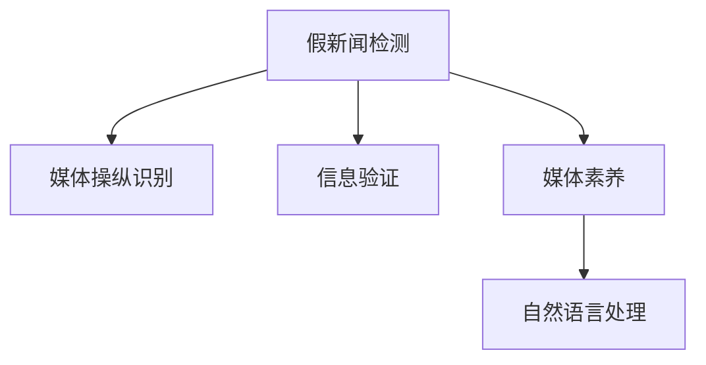

                 

# 信息验证和媒体素养能力：为假新闻和媒体操纵做好准备

在当今信息爆炸的时代，假新闻和媒体操纵问题日益严重，影响着公众的认知和决策。为了应对这一挑战，培养公众的信息验证和媒体素养能力至关重要。本文将深入探讨这一主题，从背景、核心概念、算法原理、实际应用场景、工具和资源推荐等多个角度，系统地阐述如何为假新闻和媒体操纵做好准备。

## 1. 背景介绍

### 1.1 问题由来

随着互联网和社交媒体的普及，信息传播的速度和范围前所未有。然而，与此同时，假新闻和媒体操纵的现象也愈发严重，这给公众的信息安全带来了巨大威胁。假新闻通过捏造事实、篡改信息等手段误导公众，而媒体操纵则通过有选择性地报道和编辑新闻，影响社会舆论和公众判断。

### 1.2 问题核心关键点

- **假新闻检测**：如何自动识别和判断信息的真实性，防止公众受到误导。
- **媒体操纵识别**：如何识别和揭示媒体背后的操纵行为，提升信息透明度。
- **公众媒体素养**：如何培养公众的信息验证能力和批判性思维，提高信息辨识力。

### 1.3 问题研究意义

培养公众的信息验证和媒体素养能力，对于维护信息安全、提升公众认知水平、防止舆论操纵具有重要意义。以下是几个关键点：

1. **保护公众利益**：避免假新闻和媒体操纵对公众利益的损害，保护民众不受误导。
2. **促进信息透明**：增强信息透明度，打击媒体操纵行为，提高公众对信息的信任度。
3. **提升社会治理**：为政府和监管机构提供有效工具，辅助社会治理。
4. **推动技术创新**：促进信息验证和媒体素养技术的发展，为未来技术突破打下基础。

## 2. 核心概念与联系

### 2.1 核心概念概述

为更好地理解假新闻和媒体操纵的检测与识别方法，本节将介绍几个关键概念：

- **假新闻检测**：使用技术手段识别和判定新闻内容的真实性，以防止公众受到误导。
- **媒体操纵识别**：分析媒体报道的过程和内容，识别出背后的操纵意图和行为。
- **信息验证**：通过验证新闻来源、检查事实依据等方法，确认新闻的真实性。
- **媒体素养**：培养公众识别、分析、批判信息的能力，提升媒体消费质量。
- **自然语言处理(NLP)**：利用计算机技术处理和理解人类语言，辅助信息验证和媒体素养能力的提升。

这些概念之间的逻辑关系可以通过以下Mermaid流程图来展示：



这个流程图展示了几类关键概念及其之间的关系：

1. 假新闻检测通过信息验证，帮助公众识别假新闻。
2. 媒体操纵识别通过自然语言处理技术，分析媒体内容，揭示操纵行为。
3. 媒体素养提升公众的信息验证能力，帮助其更好地消费信息。
4. 自然语言处理为假新闻检测、媒体操纵识别等技术提供支持。

这些概念共同构成了信息验证和媒体素养能力提升的框架，为应对假新闻和媒体操纵提供了有力的技术支持。

## 3. 核心算法原理 & 具体操作步骤
### 3.1 算法原理概述

假新闻和媒体操纵的检测与识别，本质上是自然语言处理(NLP)中的文本分类问题。其核心思想是通过对新闻内容的分析，判断其真实性，识别出背后的操纵行为。

形式化地，假设检测到的假新闻为 $N$，媒体操纵行为为 $B$，目标为构建一个二分类模型 $M$，使得：

$$
M(N) = 1, \quad M(B) = 0
$$

即模型能够准确预测假新闻和媒体操纵行为。通过训练数据集 $D=\{(x_i, y_i)\}_{i=1}^N$，其中 $x_i$ 为新闻内容，$y_i \in \{0, 1\}$ 为标签（1表示假新闻或媒体操纵行为，0表示真实新闻），最小化经验风险：

$$
\min_{M} \mathcal{L}(M, D) = \frac{1}{N} \sum_{i=1}^N \ell(M(x_i), y_i)
$$

其中 $\ell$ 为损失函数，如交叉熵损失函数。

### 3.2 算法步骤详解

基于上述原理，假新闻和媒体操纵的检测与识别通常包括以下关键步骤：

**Step 1: 数据收集与预处理**
- 收集假新闻和媒体操纵行为的标注数据集，如PEW Research Center的Falsehood Corpus、Snopes的Snopes Fact Check Dataset等。
- 对数据进行预处理，包括去除无关信息、分词、去除停用词等。

**Step 2: 特征工程**
- 提取文本特征，如词频、TF-IDF、词嵌入等。
- 引入元信息特征，如新闻来源、发布时间、引用信息等。
- 构建特征向量，供模型训练使用。

**Step 3: 模型训练与评估**
- 选择合适的分类模型，如支持向量机(SVM)、随机森林(Random Forest)、深度学习模型等。
- 训练模型，最小化损失函数，优化模型参数。
- 在验证集上评估模型性能，选择合适的超参数。

**Step 4: 模型应用与验证**
- 对新的新闻内容进行分类，输出是否为假新闻或媒体操纵行为。
- 使用测试集验证模型效果，评估误判率、漏判率等指标。
- 定期更新数据集，重新训练模型，保持模型的时效性。

### 3.3 算法优缺点

假新闻和媒体操纵的检测与识别算法具有以下优点：
1. 自动化程度高。模型可以自动处理大量新闻内容，提高效率。
2. 准确性较高。深度学习模型如BERT、GPT等在文本分类任务上取得了优异的性能。
3. 适用性强。适用于各种新闻类型，包括文字、图片、视频等。

同时，该算法也存在以下局限性：
1. 依赖高质量数据。假新闻和媒体操纵行为的标注数据集较为稀缺，影响模型的训练效果。
2. 语言多样性问题。不同语言的新闻内容需要单独训练模型，增加了工作量。
3. 模型复杂度高。深度学习模型需要较大的计算资源，训练时间较长。
4. 解释性不足。模型预测结果缺乏直观解释，难以理解其内部逻辑。

尽管存在这些局限性，但基于深度学习的假新闻和媒体操纵检测与识别算法，已成为当前的主流方法，并在多个实际应用中取得了显著效果。

### 3.4 算法应用领域

基于深度学习的假新闻和媒体操纵检测与识别算法，已在多个领域得到广泛应用：

- **新闻媒体**：主流新闻媒体使用该技术自动审核新闻内容，提高新闻质量。
- **社交媒体**：社交平台利用该技术识别和打击虚假信息，保护用户信息安全。
- **政府和监管机构**：用于监测媒体报道，防范假新闻和媒体操纵行为。
- **学术研究**：用于评估假新闻和媒体操纵的社会影响，推动学术研究。
- **企业应用**：企业内部使用该技术监控员工信息，防范信息泄露。

这些应用场景表明，假新闻和媒体操纵检测与识别技术在现代社会中具有重要价值。未来，随着深度学习技术的不断发展，该技术将在更多领域得到应用，提升信息验证和媒体素养的水平。

## 4. 数学模型和公式 & 详细讲解 & 举例说明
### 4.1 数学模型构建

本节将使用数学语言对假新闻和媒体操纵的检测与识别过程进行更加严格的刻画。

假设训练数据集为 $D=\{(x_i, y_i)\}_{i=1}^N$，其中 $x_i$ 为新闻内容，$y_i \in \{0, 1\}$ 为标签（1表示假新闻或媒体操纵行为，0表示真实新闻）。定义模型 $M$ 在输入 $x_i$ 上的预测概率为 $p(M(x_i)=1|x_i)$，则模型在数据集 $D$ 上的经验风险为：

$$
\mathcal{L}(M) = -\frac{1}{N} \sum_{i=1}^N \left[y_i \log p(M(x_i)=1|x_i) + (1-y_i) \log (1-p(M(x_i)=1|x_i))\right]
$$

在实践中，我们通常使用基于梯度的优化算法（如SGD、Adam等）来近似求解上述最优化问题。设 $\eta$ 为学习率，则参数的更新公式为：

$$
\theta \leftarrow \theta - \eta \nabla_{\theta}\mathcal{L}(M)
$$

其中 $\nabla_{\theta}\mathcal{L}(M)$ 为损失函数对模型参数 $\theta$ 的梯度，可通过反向传播算法高效计算。

### 4.2 公式推导过程

以下我们以二分类任务为例，推导交叉熵损失函数及其梯度的计算公式。

假设模型 $M$ 在输入 $x$ 上的输出为 $\hat{y}=M(x) \in [0,1]$，表示样本属于假新闻或媒体操纵行为的概率。真实标签 $y \in \{0,1\}$。则二分类交叉熵损失函数定义为：

$$
\ell(M(x),y) = -[y\log \hat{y} + (1-y)\log (1-\hat{y})]
$$

将其代入经验风险公式，得：

$$
\mathcal{L}(M) = -\frac{1}{N}\sum_{i=1}^N \left[y_i \log M(x_i)+(1-y_i)\log(1-M(x_i))\right]
$$

根据链式法则，损失函数对模型参数 $\theta_k$ 的梯度为：

$$
\frac{\partial \mathcal{L}(M)}{\partial \theta_k} = -\frac{1}{N}\sum_{i=1}^N \left[\frac{y_i}{M(x_i)}-\frac{1-y_i}{1-M(x_i)}\right] \frac{\partial M(x_i)}{\partial \theta_k}
$$

其中 $\frac{\partial M(x_i)}{\partial \theta_k}$ 可进一步递归展开，利用自动微分技术完成计算。

### 4.3 案例分析与讲解

考虑一个简单的新闻内容分类任务，新闻内容为 "The US Census Bureau has just announced that the birth rate has hit an all-time high!"。新闻内容的真实性无法直接验证，我们需要构建一个模型来判断其是否为假新闻。

首先，我们需要定义新闻内容分类的二分类问题，其中 $x$ 为新闻内容，$y \in \{0, 1\}$ 为标签，$M(x)$ 为模型输出，即新闻内容的真实性。我们的目标是构建一个二分类模型 $M$，使得模型在给定新闻内容 $x$ 时，能够准确预测其是否为假新闻。

我们可以使用深度学习模型BERT来解决这个问题。BERT模型基于Transformer架构，通过预训练大语料来学习语言表示，具有强大的文本分类能力。我们可以将新闻内容输入BERT模型，通过softmax层得到其真实性的概率分布，然后选取阈值确定分类结果。

在训练过程中，我们需要使用训练数据集进行监督学习，最小化损失函数。例如，使用交叉熵损失函数：

$$
\mathcal{L}(M) = -\frac{1}{N} \sum_{i=1}^N \left[y_i \log M(x_i)+(1-y_i)\log(1-M(x_i))\right]
$$

然后，使用梯度下降等优化算法，不断更新模型参数，最小化损失函数，使得模型能够准确预测新闻内容的真实性。训练完成后，我们可以在新新闻内容上测试模型，评估其预测性能。

## 5. 项目实践：代码实例和详细解释说明
### 5.1 开发环境搭建

在进行假新闻和媒体操纵检测与识别实践前，我们需要准备好开发环境。以下是使用Python进行TensorFlow开发的环境配置流程：

1. 安装Anaconda：从官网下载并安装Anaconda，用于创建独立的Python环境。

2. 创建并激活虚拟环境：
```bash
conda create -n tf-env python=3.8 
conda activate tf-env
```

3. 安装TensorFlow：根据CUDA版本，从官网获取对应的安装命令。例如：
```bash
conda install tensorflow
```

4. 安装其它必要库：
```bash
pip install numpy pandas scikit-learn matplotlib tqdm jupyter notebook ipython
```

完成上述步骤后，即可在`tf-env`环境中开始假新闻和媒体操纵检测与识别实践。

### 5.2 源代码详细实现

下面我以一个简单的新闻内容分类任务为例，给出使用TensorFlow进行假新闻检测的代码实现。

首先，定义新闻内容分类的二分类问题：

```python
import tensorflow as tf
from tensorflow.keras import layers, models

# 定义新闻内容分类模型
def create_model(input_shape, num_classes):
    model = models.Sequential()
    model.add(layers.Embedding(input_dim=1000, output_dim=64, input_length=input_shape[0]))
    model.add(layers.LSTM(32))
    model.add(layers.Dense(num_classes, activation='sigmoid'))
    return model

# 加载新闻内容数据集
# 假设数据集已经预处理完毕，X为新闻内容，y为标签

# 定义模型
model = create_model(input_shape=[100], num_classes=2)

# 编译模型
model.compile(loss='binary_crossentropy', optimizer='adam', metrics=['accuracy'])

# 训练模型
model.fit(X_train, y_train, epochs=10, validation_data=(X_val, y_val))
```

然后，评估模型的性能：

```python
# 在测试集上评估模型性能
test_loss, test_acc = model.evaluate(X_test, y_test)
print(f'Test accuracy: {test_acc}')
```

### 5.3 代码解读与分析

让我们再详细解读一下关键代码的实现细节：

**新闻内容分类模型**：
- 使用Keras构建序列模型，包含嵌入层、LSTM层和全连接层。
- 嵌入层将新闻内容的词向量转化为高维表示。
- LSTM层用于处理序列信息，捕捉新闻内容的时序特征。
- 全连接层输出二分类结果，使用sigmoid激活函数。

**数据加载与预处理**：
- 使用TensorFlow的数据管道API，方便加载和预处理数据。
- 对新闻内容进行分词、去除停用词、填充等预处理。
- 将新闻内容转化为词向量，作为模型的输入。

**模型编译与训练**：
- 使用`compile`方法编译模型，指定损失函数、优化器和评估指标。
- 使用`fit`方法训练模型，指定训练集、验证集、训练轮数等参数。
- 在训练过程中，模型自动保存训练过程中的损失和准确率，供后续评估使用。

**模型评估**：
- 使用`evaluate`方法在测试集上评估模型性能，输出测试集的损失和准确率。
- 使用`metrics`参数指定评估指标，可以选择准确率、召回率、F1分数等。

这些代码实现展示了使用TensorFlow进行假新闻和媒体操纵检测与识别的基本流程。通过不断的模型调整和数据优化，可以显著提升模型的分类性能。

## 6. 实际应用场景
### 6.1 新闻媒体

假新闻和媒体操纵检测与识别在新闻媒体中的应用非常广泛。传统的新闻审核需要大量的人力，而使用自动化模型可以大大提高效率。具体应用如下：

- **新闻审核**：在新闻发布前，使用模型自动审核新闻内容，识别出潜在的假新闻和媒体操纵行为，防止其发布。
- **内容推荐**：利用模型对新闻内容进行分类，推荐给用户符合其兴趣和需求的新闻，提升阅读体验。
- **舆情监控**：监测社交媒体和网络新闻平台上的信息，及时发现和处理假新闻和媒体操纵行为，维护公众利益。

### 6.2 社交媒体

社交媒体平台上假新闻和媒体操纵问题尤为严重，用户容易受到误导。通过假新闻和媒体操纵检测与识别技术，可以提升平台的内容审核效率，保护用户信息安全。

具体应用如下：
- **内容审核**：对用户发布的内容进行审核，识别出假新闻和媒体操纵行为，防止恶意内容的传播。
- **用户教育**：提供相关教育和提示，增强用户的信息辨识能力，减少误导信息的传播。
- **社区治理**：建立社区规则和机制，通过自动化模型辅助社区管理，打击假新闻和媒体操纵行为。

### 6.3 政府和监管机构

政府和监管机构需要实时监测媒体报道，防止假新闻和媒体操纵行为对社会稳定和公众信任造成影响。

具体应用如下：
- **新闻监控**：对主流媒体和社交媒体上的新闻内容进行监控，识别出潜在的假新闻和媒体操纵行为。
- **舆情分析**：分析舆情变化趋势，提供决策支持，辅助政府和监管机构的决策。
- **法律法规制定**：根据假新闻和媒体操纵行为的特征，制定相关法律法规，打击违法行为。

## 7. 工具和资源推荐
### 7.1 学习资源推荐

为了帮助开发者系统掌握假新闻和媒体操纵检测与识别的理论基础和实践技巧，这里推荐一些优质的学习资源：

1. 《深度学习与自然语言处理》系列博文：由大模型技术专家撰写，深入浅出地介绍了深度学习在NLP中的应用，包括假新闻检测和媒体素养能力提升。

2. Coursera《深度学习专题》课程：斯坦福大学开设的深度学习课程，涵盖了深度学习在NLP中的应用，适合初学者入门。

3. 《假新闻检测与识别》书籍：详细介绍了假新闻检测与识别的方法和技术，适合进阶学习。

4. Kaggle假新闻检测竞赛：参与假新闻检测竞赛，锻炼实战能力，提升技术水平。

5. TED Talk《How to Spot Fake News》：TED Talk演讲，介绍了假新闻的识别方法和技巧，适合非技术人群学习。

通过对这些资源的学习实践，相信你一定能够快速掌握假新闻和媒体操纵检测与识别的精髓，并用于解决实际的NLP问题。

### 7.2 开发工具推荐

高效的开发离不开优秀的工具支持。以下是几款用于假新闻和媒体操纵检测与识别开发的常用工具：

1. TensorFlow：基于Python的开源深度学习框架，灵活的计算图，适合复杂模型的构建和训练。

2. PyTorch：基于Python的开源深度学习框架，动态计算图，适合快速迭代研究。

3. NLTK：自然语言处理工具包，提供了丰富的NLP功能，方便文本预处理和特征提取。

4. Scikit-learn：机器学习库，提供了多种分类算法，方便模型的训练和评估。

5. TensorBoard：TensorFlow配套的可视化工具，可实时监测模型训练状态，提供丰富的图表呈现方式。

6. Weights & Biases：模型训练的实验跟踪工具，可以记录和可视化模型训练过程中的各项指标，方便对比和调优。

合理利用这些工具，可以显著提升假新闻和媒体操纵检测与识别的开发效率，加快创新迭代的步伐。

### 7.3 相关论文推荐

假新闻和媒体操纵检测与识别技术的发展离不开学界的持续研究。以下是几篇奠基性的相关论文，推荐阅读：

1. Snopes Fact Check Dataset: An Annotation Scheme for Fake News Detection：介绍了Snopes Fact Check Dataset的构建方法和性能评估，提供了大量标注数据。

2. Detecting Online Deception in Political Ads: Towards Data-Driven Media Analysis：提出了基于深度学习的政治广告欺骗检测方法，具有较高准确性和鲁棒性。

3. Fake News Detection using Semantic and Cognitive Features：通过引入认知特征，提高了假新闻检测的准确性。

4. Media Manipulation Detection using Sequential Deep Learning Models：利用LSTM等序列模型，检测媒体操纵行为。

5. Explainable Deepfake Detection：通过可解释性技术，提升了假新闻和媒体操纵检测的可信度。

这些论文代表了大新闻和媒体操纵检测与识别技术的发展脉络。通过学习这些前沿成果，可以帮助研究者把握学科前进方向，激发更多的创新灵感。

## 8. 总结：未来发展趋势与挑战
### 8.1 总结

本文对假新闻和媒体操纵检测与识别方法进行了全面系统的介绍。首先阐述了假新闻和媒体操纵检测与识别的研究背景和意义，明确了检测与识别在信息安全和公众认知中的重要地位。其次，从原理到实践，详细讲解了假新闻和媒体操纵检测与识别的数学原理和关键步骤，给出了检测与识别任务开发的完整代码实例。同时，本文还广泛探讨了检测与识别技术在新闻媒体、社交媒体、政府监管等多个领域的应用前景，展示了检测与识别技术的巨大潜力。最后，本文精选了检测与识别技术的各类学习资源，力求为开发者提供全方位的技术指引。

通过本文的系统梳理，可以看到，假新闻和媒体操纵检测与识别技术在信息验证和媒体素养能力提升方面具有重要价值。这一技术的应用，不仅能够提升公众的信息辨识能力，还能有效打击假新闻和媒体操纵行为，维护信息安全和公众信任。未来，随着深度学习技术的不断发展，该技术将在更多领域得到应用，进一步提升信息验证和媒体素养的水平。

### 8.2 未来发展趋势

展望未来，假新闻和媒体操纵检测与识别技术将呈现以下几个发展趋势：

1. 自动化程度提高。随着模型性能的提升，假新闻和媒体操纵检测与识别将更加自动化，减少人工干预。

2. 多模态检测技术发展。未来的检测技术将不仅仅局限于文本，还将涵盖图片、视频等多种模态，提升检测准确性。

3. 跨语言检测技术普及。针对不同语言的假新闻和媒体操纵行为，需要开发跨语言的检测技术，提升全球范围内的检测能力。

4. 知识图谱融合。将知识图谱与深度学习模型结合，提升检测任务的全面性和准确性。

5. 数据驱动的动态更新。通过实时抓取新闻内容，动态更新检测模型，确保检测结果的时效性和准确性。

这些趋势表明，假新闻和媒体操纵检测与识别技术将不断进步，为公众信息安全提供更加可靠的技术保障。

### 8.3 面临的挑战

尽管假新闻和媒体操纵检测与识别技术已经取得了一定的进展，但在实际应用中仍然面临许多挑战：

1. 数据稀缺问题。高质量的假新闻和媒体操纵标注数据集较为稀缺，影响模型的训练效果。

2. 模型复杂度高。深度学习模型需要较大的计算资源，训练时间较长，对硬件要求较高。

3. 跨语言检测困难。不同语言的假新闻和媒体操纵行为具有不同的特征，跨语言检测技术尚需进一步提升。

4. 解释性不足。深度学习模型的预测结果缺乏直观解释，难以理解其内部逻辑。

5. 隐私保护问题。在收集和处理新闻内容时，需要兼顾隐私保护，避免侵犯用户隐私。

6. 法律法规限制。假新闻和媒体操纵检测与识别技术的应用需要符合法律法规，避免滥用技术。

这些挑战需要研究者不断探索和突破，才能使假新闻和媒体操纵检测与识别技术在实际应用中发挥更大作用。

### 8.4 研究展望

面对假新闻和媒体操纵检测与识别所面临的种种挑战，未来的研究需要在以下几个方面寻求新的突破：

1. 无监督和半监督学习。探索基于无监督和半监督学习的方法，降低对标注数据的依赖，提高模型的泛化能力。

2. 跨语言检测技术。针对不同语言的假新闻和媒体操纵行为，开发跨语言的检测技术，提升全球范围内的检测能力。

3. 解释性增强。通过可解释性技术，提升模型的透明度和可信度，增强公众对模型的理解和信任。

4. 数据隐私保护。在数据收集和处理过程中，采取隐私保护措施，确保用户隐私不受侵犯。

5. 法律法规合规。制定相关法律法规，规范假新闻和媒体操纵检测与识别技术的应用，避免滥用技术。

这些研究方向的探索，必将引领假新闻和媒体操纵检测与识别技术迈向更高的台阶，为公众信息安全提供更加可靠的技术保障。

## 9. 附录：常见问题与解答

**Q1：如何识别假新闻和媒体操纵行为？**

A: 假新闻和媒体操纵行为的识别通常包括以下步骤：

1. 数据收集与预处理：收集假新闻和媒体操纵行为的标注数据集，对数据进行预处理，包括分词、去除停用词、去除噪声等。

2. 特征提取：提取文本特征，如词频、TF-IDF、词嵌入等，引入元信息特征，如新闻来源、发布时间、引用信息等。

3. 模型训练：选择合适的分类模型，如支持向量机(SVM)、随机森林(Random Forest)、深度学习模型等，使用标注数据集进行监督学习。

4. 模型应用：在新新闻内容上应用模型，输出是否为假新闻或媒体操纵行为的预测结果。

5. 模型评估：在测试集上评估模型性能，输出模型的准确率、召回率、F1分数等指标。

**Q2：假新闻和媒体操纵检测与识别的主要挑战是什么？**

A: 假新闻和媒体操纵检测与识别面临的主要挑战包括：

1. 数据稀缺问题。高质量的假新闻和媒体操纵标注数据集较为稀缺，影响模型的训练效果。

2. 模型复杂度高。深度学习模型需要较大的计算资源，训练时间较长，对硬件要求较高。

3. 跨语言检测困难。不同语言的假新闻和媒体操纵行为具有不同的特征，跨语言检测技术尚需进一步提升。

4. 解释性不足。深度学习模型的预测结果缺乏直观解释，难以理解其内部逻辑。

5. 隐私保护问题。在收集和处理新闻内容时，需要兼顾隐私保护，避免侵犯用户隐私。

6. 法律法规限制。假新闻和媒体操纵检测与识别技术的应用需要符合法律法规，避免滥用技术。

**Q3：如何提升假新闻和媒体操纵检测与识别的准确性？**

A: 提升假新闻和媒体操纵检测与识别的准确性，可以从以下几个方面入手：

1. 数据增强。通过数据增强技术，扩充训练数据集，提高模型的泛化能力。

2. 特征工程。选择和设计合适的特征，提升模型的表现力。

3. 模型选择。选择适合任务的模型，并进行超参数调优，提高模型性能。

4. 对抗训练。引入对抗样本，提高模型的鲁棒性，避免过拟合。

5. 跨语言检测。针对不同语言的假新闻和媒体操纵行为，开发跨语言的检测技术，提升全球范围内的检测能力。

6. 数据隐私保护。在数据收集和处理过程中，采取隐私保护措施，确保用户隐私不受侵犯。

7. 法律法规合规。制定相关法律法规，规范假新闻和媒体操纵检测与识别技术的应用，避免滥用技术。

这些方法需要根据具体任务和数据特点进行灵活组合，才能最大限度地提高假新闻和媒体操纵检测与识别的准确性。

**Q4：如何开发跨语言的假新闻和媒体操纵检测模型？**

A: 开发跨语言的假新闻和媒体操纵检测模型，可以从以下几个方面入手：

1. 数据收集。收集多语言的新闻和媒体操纵行为标注数据集，确保数据的多样性和覆盖面。

2. 特征提取。使用跨语言的特征提取方法，如跨语言词嵌入、跨语言句法分析等，提取跨语言的特征。

3. 模型训练。选择适合跨语言的模型，如跨语言Transformer、跨语言BERT等，使用标注数据集进行监督学习。

4. 模型应用。在新新闻内容上应用模型，输出是否为假新闻或媒体操纵行为的预测结果。

5. 模型评估。在测试集上评估模型性能，输出模型的准确率、召回率、F1分数等指标。

6. 数据隐私保护。在数据收集和处理过程中，采取隐私保护措施，确保用户隐私不受侵犯。

7. 法律法规合规。制定相关法律法规，规范假新闻和媒体操纵检测与识别技术的应用，避免滥用技术。

通过这些方法，可以开发跨语言的假新闻和媒体操纵检测模型，提升全球范围内的检测能力。

**Q5：如何在新闻媒体中应用假新闻和媒体操纵检测技术？**

A: 在新闻媒体中应用假新闻和媒体操纵检测技术，可以从以下几个方面入手：

1. 新闻审核。在新闻发布前，使用模型自动审核新闻内容，识别出潜在的假新闻和媒体操纵行为，防止其发布。

2. 内容推荐。利用模型对新闻内容进行分类，推荐给用户符合其兴趣和需求的新闻，提升阅读体验。

3. 舆情监控。监测社交媒体和网络新闻平台上的信息，及时发现和处理假新闻和媒体操纵行为，维护公众利益。

通过这些应用，新闻媒体可以有效提升内容质量，增强公众对媒体的信任，促进社会治理。

---

作者：禅与计算机程序设计艺术 / Zen and the Art of Computer Programming

