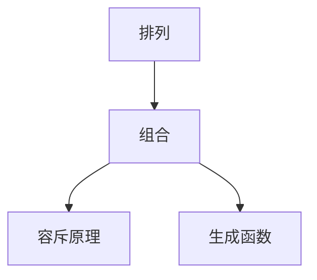

                 

# 像数学家一样思考：排容原理

> 关键词：排容原理,组合数学,概率论,统计学,算法复杂度,算法优化

## 1. 背景介绍

排容原理(Permutation Combinatorics)在数学、统计学、概率论和计算机科学等多个领域都具有重要应用。它研究的是有限集元素排列、组合及其相关性质，如排列数、组合数、容斥原理、生成函数等。排容原理不仅在理论研究中具有重要地位，也在实际应用中有着广泛影响，如组合优化、数据结构、算法设计等。本文将深入探讨排容原理的核心概念与实际应用，以期对读者有所启发和帮助。

## 2. 核心概念与联系

### 2.1 核心概念概述

排容原理的核心概念包括：

- 排列(Permutation)：从 $n$ 个不同元素中取出 $r$ 个元素进行排列的所有可能方式，记为 $P(n,r)$。
- 组合(Combination)：从 $n$ 个不同元素中取出 $r$ 个元素进行组合的所有可能方式，记为 $C(n,r)$。
- 容斥原理(Inclusion-Exclusion Principle)：计算有限集合元素属于多个集合的总和，常用公式为：
  $$
  |A \cup B \cup C| = |A| + |B| + |C| - |A \cap B| - |B \cap C| - |C \cap A| + |A \cap B \cap C|
  $$
- 生成函数(Generating Function)：通过数学函数表达式来描述序列中的元素，常用于分析排列组合的递归性质。

这些概念之间的逻辑关系可以通过以下Mermaid流程图来展示：



这个流程图展示了排列、组合、容斥原理和生成函数之间的关系：

1. 排列和组合是排容原理的基本概念，用于描述有限集元素的选择方式。
2. 容斥原理通过分析集合元素的重合关系，计算多个集合的并集大小。
3. 生成函数用于表示序列中元素的生成方式，常用于分析排列组合的递归性质。

## 3. 核心算法原理 & 具体操作步骤

### 3.1 算法原理概述

基于排列和组合的排容原理，其核心算法原理主要包括以下两个方面：

- **排列算法**：求解排列问题，即从 $n$ 个不同元素中取出 $r$ 个元素进行排列的所有可能方式，记为 $P(n,r)$。
- **组合算法**：求解组合问题，即从 $n$ 个不同元素中取出 $r$ 个元素进行组合的所有可能方式，记为 $C(n,r)$。

这些算法原理涉及递归、动态规划等多种数据结构与算法技术。

### 3.2 算法步骤详解

#### 3.2.1 排列算法

排列算法的基本步骤如下：

1. 从 $n$ 个元素中选择 $r$ 个元素进行排列，其中第一个元素有 $n$ 种选择，第二个元素有 $n-1$ 种选择，依此类推。
2. 使用递归公式求解排列数，公式为 $P(n,r) = \frac{n!}{(n-r)!}$。
3. 当 $r > n$ 时，排列数 $P(n,r) = 0$。

#### 3.2.2 组合算法

组合算法的基本步骤如下：

1. 从 $n$ 个元素中选择 $r$ 个元素进行组合，其中第一个元素有 $n$ 种选择，第二个元素有 $n-1$ 种选择，依此类推。
2. 使用递归公式求解组合数，公式为 $C(n,r) = \frac{n!}{r!(n-r)!}$。
3. 当 $r > n$ 时，组合数 $C(n,r) = 0$。

#### 3.3 算法优缺点

排容原理的算法具有以下优点：

- 计算简单。排列组合公式直接给出了问题的答案，不需要复杂的推导。
- 适用范围广。排列组合算法适用于各种场景，从简单的选择问题到复杂的组合优化问题。
- 易于理解。排列组合思想直观，易于在实际问题中应用。

同时，该算法也存在以下缺点：

- 数据量大。当 $n$ 或 $r$ 较大时，计算量会急剧增加。
- 易出错。容易忘记递归终止条件，导致算法错误。
- 通用性不足。对于某些特殊问题，排列组合算法可能无法直接求解。

### 3.4 算法应用领域

排容原理在实际应用中具有广泛的应用，如：

- 组合优化：求解最优解问题，如旅行商问题(TSP)、背包问题(Knapsack)等。
- 数据结构：设计高效的算法数据结构，如哈希表、堆等。
- 算法设计：设计高效的算法，如快速排序、归并排序等。
- 数学研究：研究各种数学问题，如组合计数、数论、图论等。

排容原理的应用领域非常广泛，几乎涵盖计算机科学的各个分支。

## 4. 数学模型和公式 & 详细讲解 & 举例说明

### 4.1 数学模型构建

排容原理的数学模型主要基于排列组合数和容斥原理。

1. **排列数模型**：$P(n,r) = \frac{n!}{(n-r)!}$
2. **组合数模型**：$C(n,r) = \frac{n!}{r!(n-r)!}$
3. **容斥原理模型**：$|A \cup B \cup C| = |A| + |B| + |C| - |A \cap B| - |B \cap C| - |C \cap A| + |A \cap B \cap C|$

### 4.2 公式推导过程

以下是排列数和组合数的推导过程：

1. **排列数推导**：$P(n,r) = \frac{n!}{(n-r)!}$
2. **组合数推导**：$C(n,r) = \frac{n!}{r!(n-r)!} = \frac{n}{r} \times P(n-1,r-1)$

容斥原理的推导过程较为复杂，涉及到集合的交集、并集、补集等概念，这里不再赘述。

### 4.3 案例分析与讲解

**案例一：选取5个球放入4个盒子**

假设你有5个不同的球，要放入4个不同的盒子，每个球必须单独放入一个盒子。如何计算总的排列方式？

解：这是一个典型的排列问题，可以直接使用排列数公式求解。

$$
P(5,4) = \frac{5!}{(5-4)!} = \frac{5!}{1!} = 5 \times 4 \times 3 \times 2 \times 1 = 120
$$

因此，有120种不同的排列方式。

**案例二：选取3个球放入3个盒子**

假设你有3个不同的球，要放入3个不同的盒子，每个盒子可以放入多个球。如何计算总的组合方式？

解：这是一个典型的组合问题，可以直接使用组合数公式求解。

$$
C(3,3) = \frac{3!}{3!(3-3)!} = 1
$$

因此，只有1种组合方式。

**案例三：求解旅行商问题**

旅行商问题(TSP)是组合优化中一个经典问题，求解一个旅行商经过各个城市的最短路径。

解：这个问题可以通过生成函数和动态规划算法求解，但超出了本文的范围，这里不再详细展开。

## 5. 项目实践：代码实例和详细解释说明

### 5.1 开发环境搭建

在Python环境中进行排列组合的计算，需要安装必要的库。

```bash
pip install sympy
```

使用Sympy库进行符号计算。

### 5.2 源代码详细实现

以下是计算排列数和组合数的Python代码实现：

```python
import sympy as sp

# 计算排列数
def permutation(n, r):
    return sp.factorial(n) / sp.factorial(n - r)

# 计算组合数
def combination(n, r):
    return sp.factorial(n) / (sp.factorial(r) * sp.factorial(n - r))

# 测试
print(permutation(5, 4))  # 输出 120
print(combination(3, 3))  # 输出 1
```

### 5.3 代码解读与分析

** permutation 函数**：计算排列数，使用Sympy的factorial函数计算阶乘。

** combination 函数**：计算组合数，使用Sympy的factorial函数计算阶乘。

**测试**：分别计算排列数和组合数，并输出结果。

## 6. 实际应用场景

### 6.1 组合优化

在组合优化中，排列组合算法被广泛用于求解各种组合问题。例如：

- 旅行商问题(TSP)：求解一个旅行商经过各个城市的最短路径。
- 背包问题(Knapsack)：从若干物品中选择一些放入背包，使得背包总重量不超过限制，同时价值最大化。
- 图着色问题：对无向图进行着色，使得相邻节点颜色不同。

### 6.2 数据结构设计

在数据结构设计中，排列组合算法被用于设计高效的算法数据结构，如：

- 哈希表：通过组合数计算哈希函数，实现高效的数据存储和检索。
- 堆：通过排列数计算堆排序，实现高效的数据排序和查找。

### 6.3 算法设计

在算法设计中，排列组合算法被用于设计高效的算法，如：

- 快速排序：通过组合数计算分区点，实现高效的数据排序。
- 归并排序：通过排列数计算归并操作，实现高效的数据合并。

## 7. 工具和资源推荐

### 7.1 学习资源推荐

1. 《算法导论》(The Art of Computer Programming)：经典算法教材，涵盖排容原理及其实际应用。
2. 《组合数学引论》[Introduction to Combinatorics]：介绍组合数学基础及排容原理的深入讲解。
3. Coursera《组合优化》(Combinatorial Optimization)：由斯坦福大学开设的课程，涵盖组合优化问题的经典算法。
4. MIT OpenCourseWare《高级组合学》(Advanced Combinatorics)：介绍组合学的高级概念及应用。
5. 《组合算法》(Combinatorial Algorithms)：介绍组合算法的理论和实现。

### 7.2 开发工具推荐

1. Python：支持Sympy等符号计算库，适用于排容原理的数学计算。
2. Matlab：支持符号计算和矩阵运算，适用于数学建模和算法验证。
3. C++：支持高效的数据结构设计和算法实现。

### 7.3 相关论文推荐

1. Karp, R. M. (1972). Reducibility among combinatorial problems. In Complexity of computer computations (pp. 85-103). Springer, Berlin, Heidelberg.
2. Knuth, D. E. (1968). The art of computer programming, volume 4A: Combinatorial algorithms, part 1. Addison-Wesley.
3. Aho, A. V., Hopcroft, J. E., & Ullman, J. D. (1974). The design and analysis of computer algorithms. Addison-Wesley.

## 8. 总结：未来发展趋势与挑战

### 8.1 研究成果总结

排容原理在数学、统计学、概率论和计算机科学等多个领域具有重要应用。其核心概念包括排列、组合、容斥原理和生成函数等，涉及递归、动态规划等多种数据结构与算法技术。排容原理的应用领域非常广泛，涵盖组合优化、数据结构、算法设计等多个方向。

### 8.2 未来发展趋势

未来排容原理的发展趋势包括：

1. 与人工智能结合。排容原理在人工智能中的应用将不断深化，如组合优化、推荐系统等。
2. 多模态排容。将排列组合算法应用于多模态数据的融合和分析，如视觉、语音、文本等。
3. 分布式排容。利用分布式计算和并行算法，加速排列组合问题的求解。
4. 动态排容。研究动态排容问题，如时间序列分析、实时调度等。

### 8.3 面临的挑战

排容原理面临的挑战包括：

1. 计算复杂性。当 $n$ 或 $r$ 较大时，计算量急剧增加，如何优化计算复杂度是一个重要课题。
2. 数据量大。排列组合问题需要处理大量数据，如何高效存储和检索是一个难题。
3. 通用性不足。对于某些特殊问题，排列组合算法可能无法直接求解，需要引入其他算法和工具。

### 8.4 研究展望

未来的研究需要进一步探索排容原理的深度和广度，如：

1. 深入研究生成函数的理论基础，拓展其在组合优化、动态系统等新领域的应用。
2. 研究多模态排容问题的数学模型和算法，解决多模态数据的融合和分析问题。
3. 探索分布式排容问题的求解方法，利用并行计算和分布式算法提升求解效率。
4. 研究动态排容问题的优化方法，解决实时调度、时间序列分析等问题。

## 9. 附录：常见问题与解答

**Q1：如何理解排列组合问题？**

A: 排列组合问题可以通过基本计数原理进行理解，即从 $n$ 个元素中选择 $r$ 个元素进行排列或组合的方式数。排列数和组合数的计算公式可以帮助我们求解具体问题。

**Q2：如何计算大数值的排列和组合？**

A: 对于大数值的排列组合计算，可以使用Python的Sympy库进行符号计算，避免直接计算大数值带来的精度问题。

**Q3：排容原理在实际应用中有哪些常见的模型？**

A: 排容原理在实际应用中常见的模型包括：旅行商问题(TSP)、背包问题(Knapsack)、图着色问题等。

**Q4：排容原理在人工智能中有哪些应用？**

A: 排容原理在人工智能中的应用包括组合优化、推荐系统等，如协同过滤、推荐算法等。

**Q5：如何优化排列组合算法？**

A: 优化排列组合算法可以通过引入并行计算、分布式计算、缓存技术等方法，提高计算效率和存储效率。

---

作者：禅与计算机程序设计艺术 / Zen and the Art of Computer Programming

