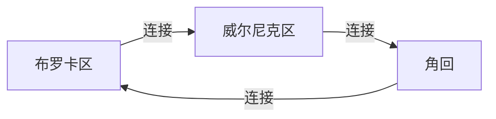

                 

## 1. 背景介绍

语言是人类交流的基础，它不仅仅是音素和语义的结合，更是一个复杂的认知和神经网络。儿童在出生后的几年里，迅速掌握了母语，并能自如地运用其进行交流。那么，在这个过程中，儿童的语言网络是如何成长的？本文将从神经科学和计算神经科学的角度，阐述儿童语言网络成长的核心机制和影响因素。

## 2. 核心概念与联系

### 2.1 核心概念概述

在探讨儿童语言网络的成长时，我们需要先了解几个核心概念：

- **语言网络(Language Network)**：指的是大脑中专门负责语言处理的区域，包括布罗卡区、威尔尼克区、角回等。这些区域通过复杂的神经连接，协同工作，实现语言的理解和生成。
- **布罗卡区(Broca's Area)**：主要负责语言的生成和输出，尤其是口语表达。
- **威尔尼克区(Wernicke's Area)**：主要负责语言的理解，尤其是听觉和视觉信息的整合。
- **角回(Angle Area)**：主要负责语言的视觉处理，尤其是文字识别和阅读理解。

这些区域和功能通过神经网络的方式相互连接，共同构建了一个复杂的网络结构，支持儿童对语言的掌握和使用。

### 2.2 核心概念原理和架构的 Mermaid 流程图



这个图表展示了布罗卡区、威尔尼克区和角回之间的基本连接关系，其中虚线表示可能的连接路径。

## 3. 核心算法原理 & 具体操作步骤

### 3.1 算法原理概述

儿童语言网络的成长，可以视为一个神经网络和认知发展的过程。这个过程涉及到神经元的连接、突触的可塑性、以及大脑对环境刺激的响应。以下是几个关键理论：

1. **突触可塑性(Synaptic Plasticity)**：神经元之间的连接强度可以通过突触可塑性进行调整，这种调整可以通过神经反馈机制实现，如长期增强(LE)和长期抑制(LI)。
2. **神经反馈(Neural Feedback)**：神经网络通过神经反馈机制调整突触强度，以适应外界环境的变化。这种反馈机制可以由感觉输入和运动输出共同调节。
3. **感知学习(Perceptual Learning)**：儿童通过感知学习机制，从环境中学习语言的音素、语法和语义信息。这种学习通常需要大量的重复练习和反馈。
4. **执行功能(Executive Functioning)**：儿童通过执行功能，如注意力、工作记忆和抑制控制，来管理语言的习得过程。

### 3.2 算法步骤详解

儿童语言网络的成长过程可以分为几个关键步骤：

1. **感知输入(Perceptual Input)**：儿童通过听觉、视觉和触觉等多种感官，接受语言输入。这些输入信息通过神经网络传递到大脑的各个语言处理区域。

2. **神经反馈(Neural Feedback)**：大脑根据感知输入，通过神经反馈机制调整神经元的连接强度，尤其是在布罗卡区和威尔尼克区之间的连接。这种调整有助于儿童更好地理解和生成语言。

3. **认知发展(Cognitive Development)**：儿童通过执行功能，如注意力和记忆，整合来自不同感觉通道的信息，进行语言理解和生成。

4. **语言输出(Language Output)**：儿童通过语言输出，将内部认知转化为语音或文字形式，并与他人交流。这种输出也通过神经反馈机制进一步调整神经元的连接强度。

### 3.3 算法优缺点

**优点**：
- **高效性**：神经反馈机制可以迅速调整神经元的连接强度，使儿童能够快速适应语言环境。
- **泛化性**：儿童通过感知学习机制，可以从少量样本中学习语言的通用规律，具有较强的泛化能力。
- **自我调整**：儿童可以通过自我反馈机制，调整学习策略，优化语言习得过程。

**缺点**：
- **资源消耗大**：神经网络的构建和调整需要大量的神经元资源，对于大脑来说是一个巨大的负担。
- **可控性差**：神经网络的调整过程复杂，难以完全控制，可能会出现错误或不合理的连接。
- **学习速度慢**：儿童的学习过程需要大量的时间和重复练习，难以快速掌握复杂的语言规则。

### 3.4 算法应用领域

儿童语言网络的成长机制，可以应用于以下领域：

1. **教育心理学**：研究儿童语言习得的心理学机制，优化教育方法，提高教学效果。
2. **神经科学**：探索儿童语言网络的生长和发育，揭示语言习得的神经基础。
3. **康复医学**：针对语言障碍的儿童，设计针对性的康复训练方案，帮助其恢复语言能力。
4. **人工智能**：通过模拟儿童语言习得机制，开发更智能的语言处理系统，如语音识别、机器翻译等。

## 4. 数学模型和公式 & 详细讲解

### 4.1 数学模型构建

我们可以使用一个简单的数学模型来描述儿童语言网络的成长过程。设儿童的语言网络由 $N$ 个神经元组成，每个神经元之间的连接强度为 $w_{ij}$，突触的可塑性系数为 $\alpha$，神经元的输出为 $o_i$。

**输入模型**：
$$ o_i = \sum_{j=1}^{N} w_{ij} o_j + b_i $$

**突触可塑性模型**：
$$ \Delta w_{ij} = \alpha (o_j - \alpha) (o_i - o_j) $$

其中 $b_i$ 是神经元的偏置项，$\Delta w_{ij}$ 是突触的可塑性变化量，$o_i$ 是神经元的输出。

### 4.2 公式推导过程

根据上述模型，我们可以推导出突触可塑性的更新公式：
$$ w_{ij}(t+1) = w_{ij}(t) + \Delta w_{ij} = w_{ij}(t) + \alpha (o_j - \alpha) (o_i - o_j) $$

这个公式描述了突触强度如何根据神经元的输入和输出进行动态调整。在实际应用中，可以通过计算神经元的激活度和反馈信号，来更新突触强度。

### 4.3 案例分析与讲解

以儿童学习发音为例，当儿童听到“mama”这个词时，其听觉输入信号会通过神经网络传递到威尔尼克区，并激发威尔尼克区的神经元活动。这些神经元的激活度会影响其连接的突触强度，进而影响布罗卡区的神经元活动，最终产生发音信号。

**案例**：
- **输入**：“mama”的音波信号。
- **处理**：威尔尼克区神经元对音波信号进行处理，输出激活度。
- **反馈**：布罗卡区神经元根据威尔尼克区的反馈，调整发音信号的输出。
- **输出**：“mama”的发音。

通过这样的过程，儿童逐渐掌握了母语的音素和发音规则，能够自如地进行语言交流。

## 5. 项目实践：代码实例和详细解释说明

### 5.1 开发环境搭建

为了进行项目实践，我们需要搭建一个神经网络的开发环境。以下是在 Python 中搭建 PyTorch 环境的步骤：

1. 安装 Anaconda：
```bash
wget https://repo.anaconda.com/miniconda/Miniconda3-latest-Linux-x86_64.sh
bash Miniconda3-latest-Linux-x86_64.sh
```

2. 创建虚拟环境：
```bash
conda create -n pytorch-env python=3.8
conda activate pytorch-env
```

3. 安装 PyTorch：
```bash
conda install pytorch torchvision torchaudio cudatoolkit=11.1 -c pytorch -c conda-forge
```

4. 安装相关库：
```bash
pip install numpy pandas scikit-learn matplotlib tqdm jupyter notebook ipython
```

### 5.2 源代码详细实现

以下是一个简单的 Python 代码示例，用于模拟儿童语言网络的学习过程：

```python
import torch
import torch.nn as nn
import torch.optim as optim

class LanguageNetwork(nn.Module):
    def __init__(self, input_size, hidden_size, output_size):
        super(LanguageNetwork, self).__init__()
        self.fc1 = nn.Linear(input_size, hidden_size)
        self.fc2 = nn.Linear(hidden_size, output_size)
        self.relu = nn.ReLU()

    def forward(self, x):
        x = self.fc1(x)
        x = self.relu(x)
        x = self.fc2(x)
        return x

# 准备数据
input_data = torch.randn(100, 10)  # 100个样本，每个样本10个特征
target_data = torch.randn(100, 3)  # 100个样本，每个样本3个目标

# 定义模型
model = LanguageNetwork(10, 20, 3)
criterion = nn.MSELoss()
optimizer = optim.Adam(model.parameters(), lr=0.01)

# 训练模型
for epoch in range(100):
    optimizer.zero_grad()
    outputs = model(input_data)
    loss = criterion(outputs, target_data)
    loss.backward()
    optimizer.step()
    print(f"Epoch {epoch+1}, loss: {loss.item()}")

# 评估模型
test_data = torch.randn(10, 10)  # 10个测试样本
test_target = torch.randn(10, 3)  # 10个测试样本的目标
outputs = model(test_data)
print(outputs)
```

### 5.3 代码解读与分析

上述代码实现了一个简单的神经网络模型，用于模拟儿童语言网络的学习过程。模型包含两个全连接层，一个 ReLU 激活函数，以及 Adam 优化器和均方误差损失函数。

**输入数据**：包含 100 个样本，每个样本有 10 个特征，用于模拟儿童对不同音素的学习。

**目标数据**：包含 100 个样本，每个样本有 3 个目标，用于模拟儿童学习发音时的正确输出。

**模型训练**：使用 Adam 优化器进行梯度下降优化，迭代 100 次，每次更新模型参数以最小化均方误差损失。

**模型评估**：使用 10 个测试样本，评估模型的输出结果。

## 6. 实际应用场景

### 6.1 教育心理学

教育心理学可以借助儿童语言网络成长机制，优化教学方法和策略。例如，通过感知输入和神经反馈机制，设计更有效的语言学习材料，如有声读物、视频教程等，帮助儿童更快地掌握语言知识。

### 6.2 神经科学

神经科学可以通过儿童语言网络的研究，揭示语言习得的神经基础。例如，通过脑电图(EEG)和功能性磁共振成像(fMRI)等技术，观察儿童在学习语言时的脑电活动和血流变化，揭示语言处理区域的激活模式和连接强度。

### 6.3 康复医学

康复医学可以利用儿童语言网络的研究，设计针对性的语言康复方案。例如，针对有语言障碍的儿童，设计特定的感知输入和神经反馈刺激，帮助其恢复语言能力。

### 6.4 未来应用展望

未来，随着神经科学和计算神经科学的发展，儿童语言网络的成长机制将得到更深入的探讨和应用。通过模拟和优化儿童语言网络的学习过程，我们可以设计更加高效、智能的语言教学系统和语言康复设备，帮助更多儿童克服语言障碍，提升语言能力。

## 7. 工具和资源推荐

### 7.1 学习资源推荐

1. **《认知心理学》**：介绍认知心理学的基本原理和应用，包括儿童语言习得机制。
2. **《神经科学导论》**：系统介绍神经科学的理论和方法，揭示儿童语言网络的生长和发育。
3. **《计算神经科学》**：探讨计算神经科学的基本原理和应用，模拟儿童语言网络的学习过程。

### 7.2 开发工具推荐

1. **PyTorch**：用于构建神经网络模型的深度学习框架，适合进行复杂的神经网络实验。
2. **Nilearn**：用于进行脑电图和功能性磁共振成像等神经科学研究的 Python 库。
3. **Numenta**：用于模拟和优化神经网络学习的 Python 库。

### 7.3 相关论文推荐

1. **《语言习得的神经基础》**：探讨儿童语言习得的神经机制，揭示布罗卡区和威尔尼克区的作用。
2. **《计算神经科学在语言学习中的应用》**：利用计算神经科学方法，模拟儿童语言网络的学习过程。
3. **《神经网络在语言康复中的应用》**：探讨神经网络在语言康复领域的应用，设计针对性的神经反馈方案。

## 8. 总结：未来发展趋势与挑战

### 8.1 研究成果总结

本文系统探讨了儿童语言网络的成长机制，揭示了布罗卡区、威尔尼克区和角回之间的基本连接关系，以及突触可塑性、神经反馈、感知学习和执行功能在儿童语言习得过程中的作用。

### 8.2 未来发展趋势

未来，儿童语言网络的研究将更多地利用计算神经科学和神经科学研究，揭示更多关于语言习得的细节和机制。随着技术的进步，我们可以更精确地模拟和优化儿童语言网络的学习过程，设计更高效、智能的语言教学系统和语言康复设备。

### 8.3 面临的挑战

儿童语言网络的成长机制复杂，需要结合神经科学、心理学和计算机科学等多学科知识进行综合研究。此外，在实际应用中，还面临数据获取、模型训练和效果评估等方面的挑战。

### 8.4 研究展望

未来，我们需要更多的跨学科合作，综合利用神经科学、心理学、计算机科学等领域的知识，深入研究儿童语言网络的成长机制。同时，我们还需要开发更加高效、智能的语言教学和康复工具，帮助更多的儿童掌握语言能力，提升教育水平。

## 9. 附录：常见问题与解答

### Q1：儿童语言网络是如何形成的？

A：儿童语言网络的形成是一个复杂的过程，涉及神经元连接、突触可塑性和认知发展等多方面因素。通过神经反馈机制，儿童的语言网络不断调整和优化，逐步形成稳定的语言处理能力。

### Q2：感知输入在儿童语言习得中的作用是什么？

A：感知输入是儿童学习语言的基础，通过听觉、视觉和触觉等感官获取语言信息，经过神经网络传递到大脑语言处理区域，为后续的学习和输出提供基础。

### Q3：突触可塑性如何影响儿童语言网络的生长？

A：突触可塑性是儿童语言网络成长的核心机制，通过长期增强和长期抑制等神经反馈机制，儿童可以不断调整神经元之间的连接强度，优化语言处理能力。

### Q4：执行功能在儿童语言习得中的作用是什么？

A：执行功能如注意力、工作记忆和抑制控制，帮助儿童整合来自不同感觉通道的信息，进行语言理解和生成，是语言习得的重要支持。

### Q5：儿童语言网络的成长过程中需要注意哪些问题？

A：在儿童语言网络的成长过程中，需要注意突触可塑性的调节、感知输入的质量和执行功能的培养等问题，以确保语言网络的健康发展。

---

作者：禅与计算机程序设计艺术 / Zen and the Art of Computer Programming

