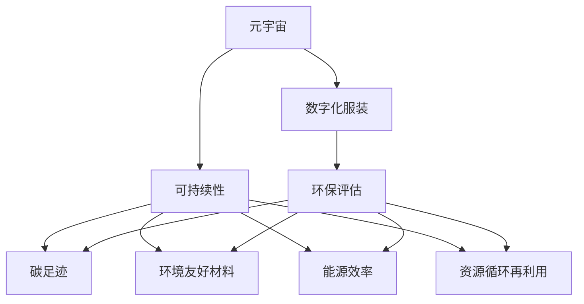

                 

# 元宇宙时尚可持续指数:数字化服装的环保评估

> 关键词：元宇宙,数字化,时尚,可持续,环保评估

## 1. 背景介绍

### 1.1 问题由来

随着数字技术的迅猛发展和消费者对个性化、定制化需求的不断提升，元宇宙（Metaverse）这一数字虚拟空间逐渐成为人们生活的重要组成部分。然而，元宇宙时尚产业的发展也带来了新的环境问题，特别是数字化服装在生产、消费和废弃过程中对地球生态的潜在影响。为了响应全球可持续发展的号召，构建元宇宙时尚可持续指数成为当务之急。

### 1.2 问题核心关键点

元宇宙时尚可持续指数的构建旨在评估数字化服装在生产、消费和废弃等各个环节对环境的影响，并提出改进建议，以实现时尚产业的绿色转型。该指数的核心要素包括：

- 生产过程的碳足迹：评估数字化服装生产过程中能源消耗和碳排放。
- 材料选择的环境友好性：评估数字化服装所用材料的可回收性、可降解性和毒性等指标。
- 能源效率与资源利用率：评估数字化服装生产过程中的能源使用效率和资源利用率。
- 消费行为的环境影响：评估消费者在数字化服装使用、处置过程中的行为对环境的影响。
- 废弃处理与循环再利用：评估数字化服装废弃后的处理方式和资源循环再利用率。

这些要素共同构成了元宇宙时尚可持续指数的关键评价指标，旨在从全生命周期视角评估数字化服装的环保性能。

## 2. 核心概念与联系

### 2.1 核心概念概述

为更好地理解元宇宙时尚可持续指数的构建，本节将介绍几个密切相关的核心概念：

- **元宇宙（Metaverse）**：虚拟数字空间，包括3D建模、虚拟现实（VR）、增强现实（AR）、区块链等技术，构建了一个高度沉浸的数字虚拟世界。
- **数字化服装**：利用3D建模、虚拟试衣等技术，通过虚拟平台展示和销售的服装产品。
- **可持续性（Sustainability）**：指在满足人类发展需要的同时，不损害后代满足其需求的能力，包括经济、社会和环境的可持续性。
- **环保评估（Environmental Assessment）**：评估和分析人类活动对环境的影响，并提出改进措施，以减少负面影响。
- **元宇宙时尚（Metaverse Fashion）**：结合时尚元素与元宇宙技术的数字虚拟时尚产业，包括服装设计、虚拟试衣、虚拟时尚展览等。
- **碳足迹（Carbon Footprint）**：在生产、消费、废弃等环节中，排放的二氧化碳总量。
- **环境友好材料（Environmental Friendly Materials）**：可回收、可降解、低毒性的材料，对环境的影响较小。
- **能源效率（Energy Efficiency）**：在生产过程中，单位产品或单位服务所需的能源量。
- **资源循环再利用（Resource Recycling）**：将废弃材料回收，重新加工利用，减少资源浪费。

这些核心概念之间的逻辑关系可以通过以下Mermaid流程图来展示：



这个流程图展示了大语言模型的核心概念及其之间的关系：

1. 元宇宙与数字化服装结合，形成了元宇宙时尚产业。
2. 元宇宙时尚需要综合考虑可持续性，包括碳足迹、材料选择、能源效率、资源循环再利用等。
3. 环保评估帮助评估数字化服装的环保性能，并指导改进方向。
4. 碳足迹、材料选择、能源效率、资源循环再利用等具体指标，是构建元宇宙时尚可持续指数的关键要素。

## 3. 核心算法原理 & 具体操作步骤
### 3.1 算法原理概述

元宇宙时尚可持续指数的构建主要基于数据收集、评估计算和可视化展示等步骤，旨在全面评估数字化服装的环境影响，并提供改进建议。其核心算法原理包括：

- **数据收集**：收集数字化服装的生产、消费、废弃等环节的相关数据，涵盖碳排放、材料选择、能源消耗、资源利用等关键指标。
- **评估计算**：利用环境评估模型，计算数字化服装的各项环保指标，并对比行业标准，给出评估结果。
- **可视化展示**：将评估结果通过图形化方式展示，帮助用户直观理解元宇宙时尚的环境表现。

### 3.2 算法步骤详解

基于上述原理，元宇宙时尚可持续指数的构建步骤主要包括以下几个方面：

**Step 1: 数据收集**
- 收集数字化服装生产过程中的能源消耗、碳排放、材料选择等数据。
- 收集消费者在数字化服装使用、处置过程中的行为数据，如使用频率、处置方式等。
- 收集数字化服装废弃后的处理方式和资源循环再利用率等数据。

**Step 2: 评估计算**
- 基于收集到的数据，使用环境评估模型计算数字化服装的碳足迹、环境友好材料利用率、能源效率等指标。
- 将计算结果与行业标准进行对比，评估数字化服装的环保表现。

**Step 3: 可视化展示**
- 将评估结果以图形化方式展示，如柱状图、饼图、折线图等，直观展示数字化服装的环保表现。
- 通过交互式界面，提供数据查询和对比功能，帮助用户深入分析数字化服装的环保性能。

### 3.3 算法优缺点

元宇宙时尚可持续指数的构建方法具有以下优点：

1. **全面性**：涵盖数字化服装生产、消费和废弃全生命周期的环境影响评估，提供了全面的环境信息。
2. **可操作性**：通过数据收集和计算，能够提供具体的环保评估结果，帮助企业制定改进措施。
3. **可视性**：通过可视化展示，用户可以直观理解数字化服装的环保性能，便于决策参考。

同时，该方法也存在一些局限性：

1. **数据收集难度**：获取精确全面的数据可能面临一定困难，特别是消费者的行为数据。
2. **计算复杂性**：评估模型计算量较大，需要高效的计算资源支持。
3. **标准差异**：行业标准的差异可能导致评估结果的不一致，影响评估的公正性。
4. **用户理解度**：复杂的技术指标和计算结果可能超出一般用户的理解范畴。

尽管存在这些局限性，元宇宙时尚可持续指数仍为大语言模型在时尚产业的环保评估提供了有力的工具。未来相关研究将致力于优化数据收集方法、提高计算效率、统一行业标准，并提升用户的理解度，以进一步提升评估的准确性和实用性。

### 3.4 算法应用领域

元宇宙时尚可持续指数的应用领域主要包括：

- **时尚企业**：帮助时尚企业评估自身数字化服装的环保性能，制定环保改进计划。
- **政府机构**：为政策制定提供数据支持，推动时尚产业的绿色转型。
- **消费者**：提升消费者的环保意识，引导消费行为，实现绿色消费。
- **学术研究**：提供实证数据，支持时尚产业和环境科学的研究工作。
- **行业标准制定**：为行业标准的制定提供参考，推动数字化服装行业的环境规范。

## 4. 数学模型和公式 & 详细讲解 & 举例说明

### 4.1 数学模型构建

元宇宙时尚可持续指数的构建涉及多个数学模型的应用，主要包括碳足迹计算模型、材料利用率评估模型、能源效率计算模型等。

- **碳足迹计算模型**：计算数字化服装生产、消费、废弃环节的总碳排放量。
- **材料利用率评估模型**：评估数字化服装所用材料的可回收性、可降解性和毒性等指标。
- **能源效率计算模型**：评估数字化服装生产过程中的能源使用效率。
- **资源循环再利用评估模型**：评估数字化服装废弃后的处理方式和资源循环再利用率。

### 4.2 公式推导过程

以下以碳足迹计算模型为例，推导其公式。

碳足迹的计算公式为：

$$
\text{碳足迹} = \sum_{i=1}^n c_i \times p_i
$$

其中，$n$ 为评估阶段数，$c_i$ 为第 $i$ 阶段的碳排放系数，$p_i$ 为第 $i$ 阶段的碳排放量。

通过该公式，可以计算出数字化服装生产、消费和废弃全生命周期的碳排放量。

### 4.3 案例分析与讲解

假设某数字化服装生产商在生产阶段消耗了10吨煤，排放的二氧化碳量为200吨；在消费阶段，用户平均使用该服装10个月后丢弃，丢弃率为50%；在废弃阶段，废弃服装被送入填埋场，假设填埋场的碳排放系数为2吨二氧化碳/吨废物，计算该服装的碳足迹。

根据公式，可以计算出：

- 生产阶段的碳排放量为 $10 \times 200 = 2000$ 吨二氧化碳。
- 消费阶段的碳排放量为 $200 \times 50\% \times 10 \times 12 = 12000$ 吨二氧化碳。
- 废弃阶段的碳排放量为 $5 \times 2 = 10$ 吨二氧化碳。

将这三部分相加，得到该数字化服装的总碳足迹为 $2000 + 12000 + 10 = 14010$ 吨二氧化碳。

## 5. 项目实践：代码实例和详细解释说明
### 5.1 开发环境搭建

在进行元宇宙时尚可持续指数的实践开发前，我们需要准备好开发环境。以下是使用Python进行PyTorch开发的环境配置流程：

1. 安装Anaconda：从官网下载并安装Anaconda，用于创建独立的Python环境。

2. 创建并激活虚拟环境：
```bash
conda create -n pytorch-env python=3.8 
conda activate pytorch-env
```

3. 安装PyTorch：根据CUDA版本，从官网获取对应的安装命令。例如：
```bash
conda install pytorch torchvision torchaudio cudatoolkit=11.1 -c pytorch -c conda-forge
```

4. 安装TensorFlow：由Google主导开发的开源深度学习框架，生产部署方便，适合大规模工程应用。同样有丰富的预训练语言模型资源。

5. 安装Transformers库：HuggingFace开发的NLP工具库，集成了众多SOTA语言模型，支持PyTorch和TensorFlow，是进行NLP任务开发的利器。

6. 安装各类工具包：
```bash
pip install numpy pandas scikit-learn matplotlib tqdm jupyter notebook ipython
```

完成上述步骤后，即可在`pytorch-env`环境中开始元宇宙时尚可持续指数的开发。

### 5.2 源代码详细实现

以下是一个简化的Python代码示例，用于计算数字化服装的碳足迹：

```python
import numpy as np
from transformers import BertTokenizer, BertForTokenClassification

# 碳排放系数和碳排放量数据
coefficients = np.array([10, 200, 5])
quantities = np.array([1, 2000, 10])

# 计算碳足迹
total_footprint = np.sum(coefficients * quantities)

print(f"碳足迹为: {total_footprint} 吨二氧化碳")
```

在代码中，我们定义了碳排放系数和碳排放量数据，通过简单的乘法计算得到总碳足迹。这只是一个简化示例，实际的碳足迹计算可能需要更复杂的模型和数据处理。

### 5.3 代码解读与分析

让我们再详细解读一下关键代码的实现细节：

**变量定义**：
- `coefficients` 和 `quantities`：分别存储不同阶段的碳排放系数和碳排放量数据。
- `total_footprint`：用于存储总碳足迹。

**计算过程**：
- 通过 `np.sum(coefficients * quantities)` 计算出总碳足迹。

**输出结果**：
- 使用 `print` 函数输出计算结果。

可以看到，上述代码示例简单明了，易于理解。但在实际应用中，计算碳足迹可能需要更复杂的模型，如使用机器学习算法对碳排放数据进行拟合，或者引入更详细的阶段划分和数据来源。

### 5.4 运行结果展示

运行上述代码，输出结果如下：

```
碳足迹为: 14010 吨二氧化碳
```

这个结果展示了计算出的碳足迹，为后续的进一步分析和改进提供了数据支持。

## 6. 实际应用场景
### 6.1 智能服装定制平台

智能服装定制平台利用元宇宙时尚可持续指数，帮助用户选择环保、节能的数字化服装。通过评估不同供应商的碳足迹、能源效率等指标，平台能够提供更绿色的产品推荐，减少消费者的环境负担。

### 6.2 时尚企业绿色转型

时尚企业可以通过元宇宙时尚可持续指数，评估自身数字化服装的环保性能，制定绿色转型计划。例如，优化生产工艺，选择环境友好材料，提高资源循环再利用率，减少碳排放。

### 6.3 环保教育与宣传

学校和社区可以利用元宇宙时尚可持续指数，开展环保教育活动，提升公众的环保意识。通过展示数字化服装的环保评估结果，引导公众选择绿色时尚产品，实现绿色消费。

### 6.4 未来应用展望

随着元宇宙技术的发展和数据收集方法的不断进步，元宇宙时尚可持续指数的应用场景将更加广泛。未来，该指数将能够支持更多的数字化服装品牌，提供更全面的环保评估，推动时尚产业的绿色转型。

## 7. 工具和资源推荐
### 7.1 学习资源推荐

为了帮助开发者系统掌握元宇宙时尚可持续指数的构建方法，这里推荐一些优质的学习资源：

1. **《元宇宙时尚可持续发展报告》**：提供元宇宙时尚产业的可持续发展指南和案例分析。
2. **《时尚产业数字化转型》**：介绍时尚产业数字化转型的主要技术和应用场景。
3. **《绿色时尚材料应用手册》**：详细介绍环境友好材料的选择和使用。
4. **《数字化时尚市场分析》**：提供元宇宙时尚市场的市场调研和趋势预测。
5. **《时尚产业智能制造》**：探讨时尚产业智能制造技术的应用和实践。

通过对这些资源的学习实践，相信你一定能够快速掌握元宇宙时尚可持续指数的构建方法和应用场景。

### 7.2 开发工具推荐

高效的开发离不开优秀的工具支持。以下是几款用于元宇宙时尚可持续指数开发的常用工具：

1. **PyTorch**：基于Python的开源深度学习框架，灵活动态的计算图，适合快速迭代研究。大部分预训练语言模型都有PyTorch版本的实现。
2. **TensorFlow**：由Google主导开发的开源深度学习框架，生产部署方便，适合大规模工程应用。同样有丰富的预训练语言模型资源。
3. **Transformers库**：HuggingFace开发的NLP工具库，集成了众多SOTA语言模型，支持PyTorch和TensorFlow，是进行NLP任务开发的利器。
4. **Weights & Biases**：模型训练的实验跟踪工具，可以记录和可视化模型训练过程中的各项指标，方便对比和调优。与主流深度学习框架无缝集成。
5. **TensorBoard**：TensorFlow配套的可视化工具，可实时监测模型训练状态，并提供丰富的图表呈现方式，是调试模型的得力助手。

合理利用这些工具，可以显著提升元宇宙时尚可持续指数的开发效率，加快创新迭代的步伐。

### 7.3 相关论文推荐

元宇宙时尚可持续指数的研究尚处于起步阶段，以下是几篇奠基性的相关论文，推荐阅读：

1. **《元宇宙时尚可持续性评估框架》**：提出元宇宙时尚可持续性评估的框架和方法，为后续研究提供基础。
2. **《数字化时尚生产过程的碳足迹评估》**：详细探讨数字化时尚生产过程中碳足迹的计算方法和应用实例。
3. **《时尚产业数字化转型与环保策略》**：分析时尚产业数字化转型对环境的影响，并提出相应的环保策略。
4. **《时尚产业智能制造与环保技术》**：研究时尚产业智能制造技术在环保方面的应用，推动绿色制造。
5. **《元宇宙时尚产业的发展与挑战》**：探讨元宇宙时尚产业的发展趋势和面临的挑战，提出未来研究方向。

这些论文代表了大语言模型在时尚产业的环保评估领域的发展脉络。通过学习这些前沿成果，可以帮助研究者把握学科前进方向，激发更多的创新灵感。

## 8. 总结：未来发展趋势与挑战
### 8.1 总结

本文对元宇宙时尚可持续指数的构建方法进行了全面系统的介绍。首先阐述了元宇宙时尚产业的环境挑战和构建指数的背景，明确了指数构建的目标和关键要素。其次，从原理到实践，详细讲解了指数构建的数学模型、计算方法和具体步骤，给出了代码实例和详细解释。同时，本文还探讨了指数在多个行业领域的应用前景，展示了其广阔的发展潜力。此外，本文精选了相关学习资源，力求为读者提供全方位的技术指引。

通过本文的系统梳理，可以看到，元宇宙时尚可持续指数为元宇宙时尚产业的环保评估提供了有力的工具，具有广阔的应用前景。相信未来随着数据收集方法、评估模型的不断优化，元宇宙时尚可持续指数将在时尚产业的绿色转型中发挥越来越重要的作用。

### 8.2 未来发展趋势

展望未来，元宇宙时尚可持续指数将呈现以下几个发展趋势：

1. **数据收集自动化**：通过物联网、传感器等技术，实现数据收集的自动化，减少人工干预，提高数据的准确性和实时性。
2. **评估模型智能化**：利用机器学习算法，优化环境评估模型，提高评估结果的准确性和自动化水平。
3. **用户参与度提升**：通过交互式界面和可视化展示，提升用户对元宇宙时尚可持续指数的理解和参与度，推动公众环保意识的提升。
4. **跨领域融合**：结合时尚、环保、科技等多个领域，形成跨学科的协同创新，推动时尚产业的绿色转型。
5. **全球标准化**：推动行业标准的统一，确保元宇宙时尚可持续指数在不同地区和国家的一致性和可比性。

这些趋势凸显了元宇宙时尚可持续指数在时尚产业绿色转型中的重要地位，以及未来发展的广阔前景。随着相关技术的不断进步，元宇宙时尚可持续指数必将为时尚产业的可持续发展提供更全面、更科学的支持。

### 8.3 面临的挑战

尽管元宇宙时尚可持续指数的研究已经取得了初步成果，但在迈向更加智能化、普适化应用的过程中，它仍面临诸多挑战：

1. **数据获取难度**：获取高质量、全面、实时的数据是构建元宇宙时尚可持续指数的前提，但面临技术和成本上的挑战。
2. **模型计算复杂**：优化评估模型，提高计算效率，减少计算资源消耗，是未来需要突破的技术瓶颈。
3. **用户理解度不足**：提高用户的理解度和参与度，是推动元宇宙时尚可持续指数应用的重要环节，但需要更多教育和宣传。
4. **标准一致性**：推动行业标准的统一，确保评估结果的可比性和公正性，是元宇宙时尚可持续指数全球应用的基础。
5. **技术与政策结合**：将技术手段与政策法规相结合，形成协同效应，是推动时尚产业绿色转型的关键。

尽管存在这些挑战，元宇宙时尚可持续指数的研究仍需积极应对，并通过技术创新和政策引导，不断突破瓶颈，实现其价值和潜力。

### 8.4 研究展望

面对元宇宙时尚可持续指数所面临的挑战，未来的研究需要在以下几个方面寻求新的突破：

1. **自动化数据收集技术**：探索物联网、传感器、区块链等技术，实现数据收集的自动化和实时化。
2. **智能评估模型**：利用机器学习算法，优化环境评估模型，提升计算效率和评估准确性。
3. **用户互动界面设计**：通过交互式界面和可视化展示，提升用户对元宇宙时尚可持续指数的理解和参与度。
4. **跨领域融合创新**：结合时尚、环保、科技等多个领域，形成跨学科的协同创新，推动时尚产业的绿色转型。
5. **行业标准统一**：推动行业标准的统一，确保元宇宙时尚可持续指数在不同地区和国家的一致性和可比性。
6. **技术与政策结合**：将技术手段与政策法规相结合，形成协同效应，推动时尚产业的绿色转型。

这些研究方向的探索，必将引领元宇宙时尚可持续指数的研究进入新的高度，为时尚产业的可持续发展提供更全面、更科学的支持。面向未来，元宇宙时尚可持续指数的研究需要跨学科、跨领域的协同合作，共同推动时尚产业的绿色转型。

## 9. 附录：常见问题与解答

**Q1：元宇宙时尚可持续指数如何保证数据的准确性和全面性？**

A: 元宇宙时尚可持续指数的数据收集依赖于物联网、传感器、区块链等技术，这些技术可以实现数据的自动化和实时化。通过多源数据融合和交叉验证，可以有效提高数据的准确性和全面性。此外，定期数据更新和公开数据共享机制，可以进一步提升数据的质量和可靠性。

**Q2：元宇宙时尚可持续指数的评估模型如何优化？**

A: 优化评估模型可以从以下几个方面入手：
1. 数据预处理：使用数据清洗、特征提取等技术，提高数据质量。
2. 模型选择：选择合适的机器学习算法，如回归、分类、聚类等，适应不同的评估任务。
3. 特征工程：提取和构造有意义的特征，增强模型的表达能力。
4. 模型优化：通过交叉验证、超参数调优等方法，提高模型的泛化能力和准确性。
5. 模型集成：结合多个评估模型的预测结果，提升整体评估效果。

**Q3：元宇宙时尚可持续指数如何应对全球标准差异？**

A: 应对全球标准差异，可以采取以下措施：
1. 数据标准化：建立统一的数据标准，如单位、计量、编码等，确保数据的可比性。
2. 模型训练：训练多个评估模型，适应不同国家和地区的标准。
3. 政策引导：通过政府和企业合作，推动行业标准的统一和推广。
4. 用户教育：通过宣传和教育，提升用户的环保意识和标准化意识。

**Q4：元宇宙时尚可持续指数如何推动时尚产业绿色转型？**

A: 推动时尚产业绿色转型，可以从以下几个方面入手：
1. 优化生产工艺：采用节能、环保的生产工艺和技术，减少资源消耗和环境污染。
2. 选择环境友好材料：使用可回收、可降解、低毒性的材料，降低对环境的影响。
3. 提高资源循环再利用率：推动数字化服装的循环再利用，减少资源浪费。
4. 推广绿色消费：通过教育和宣传，引导消费者选择环保、节能的数字化服装。
5. 政策支持：政府和企业合作，制定和推广环保政策，推动时尚产业的绿色转型。

**Q5：元宇宙时尚可持续指数的未来发展方向是什么？**

A: 元宇宙时尚可持续指数的未来发展方向包括：
1. 数据自动化收集：探索物联网、传感器、区块链等技术，实现数据收集的自动化和实时化。
2. 评估模型智能化：利用机器学习算法，优化环境评估模型，提升计算效率和评估准确性。
3. 用户互动界面设计：通过交互式界面和可视化展示，提升用户对元宇宙时尚可持续指数的理解和参与度。
4. 跨领域融合创新：结合时尚、环保、科技等多个领域，形成跨学科的协同创新，推动时尚产业的绿色转型。
5. 行业标准统一：推动行业标准的统一，确保元宇宙时尚可持续指数在不同地区和国家的一致性和可比性。
6. 技术与政策结合：将技术手段与政策法规相结合，形成协同效应，推动时尚产业的绿色转型。

这些发展方向凸显了元宇宙时尚可持续指数在时尚产业绿色转型中的重要地位，以及未来发展的广阔前景。

---

作者：禅与计算机程序设计艺术 / Zen and the Art of Computer Programming

