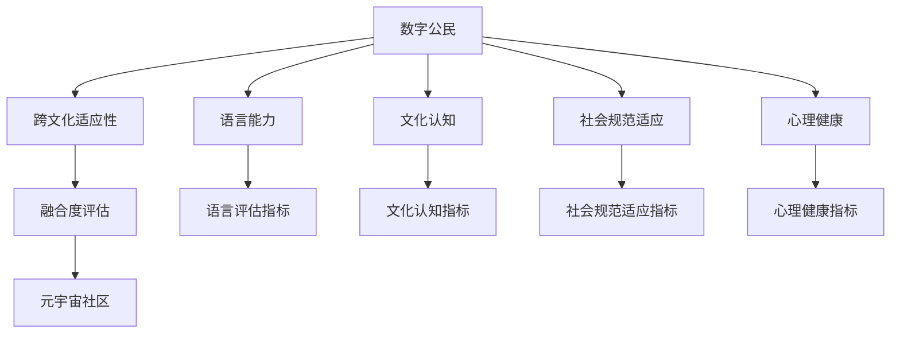

                 

# 元宇宙移民融合度评估:数字公民的跨文化适应性量化指标

在元宇宙（Metaverse）这一新兴领域，数字公民的跨文化适应性量化评估成为了一个重要课题。通过构建一个全面的融合度评估体系，可以为元宇宙社区的构建提供科学依据，提升数字公民的移民体验，促进多元文化共融。本文将详细介绍融合度评估的体系结构、核心概念及其联系，并从算法原理、操作步骤、数学模型等角度，全面解析跨文化适应性量化指标的构建和应用。

## 1. 背景介绍

### 1.1 问题由来
元宇宙是一种基于互联网的虚拟世界，是现实世界的数字复刻和拓展，它为人们提供了全新的社交、娱乐、工作和生活环境。随着技术的不断发展，越来越多的数字公民开始迁徙到元宇宙，构建新的社会结构和文化体系。然而，跨文化适应性问题成为了数字移民需要面对的主要挑战之一。

数字公民在元宇宙中面临的挑战包括语言障碍、文化差异、社会规范的冲突等，这些问题不仅影响了个体的生活质量，还可能引发社会冲突。因此，有必要构建一个科学、系统的融合度评估体系，量化数字公民的跨文化适应性，为元宇宙社区的建设提供重要参考。

### 1.2 问题核心关键点
元宇宙移民融合度评估的目的是通过量化数字公民的跨文化适应性，指导元宇宙社区的构建和优化，提升数字公民的移民体验。具体来说，评估内容包括：

- 数字公民的语言能力
- 数字公民的文化认知和认同
- 数字公民的社会规范适应性
- 数字公民的心理健康和满意度

这些核心指标共同构成了一个全面的融合度评估体系，旨在帮助数字移民更好地适应新环境，同时也帮助社区管理者优化元宇宙的构建，促进多元文化的共融。

## 2. 核心概念与联系

### 2.1 核心概念概述

为更好地理解元宇宙移民融合度评估方法，本节将介绍几个密切相关的核心概念：

- **数字公民**：指在元宇宙中生活和工作的人，具备一定程度的数字化身份和能力。
- **跨文化适应性**：指数字公民在新的文化环境中所展现的心理和行为适应程度，包括语言能力、文化认知、社会规范适应等。
- **融合度评估**：通过一系列量化指标，评估数字公民在元宇宙中的融合程度，指导社区构建和优化。
- **元宇宙社区**：由数字公民组成的虚拟社群，具有共享的文化、规则和价值观，是数字公民跨文化适应性评估的实际应用场景。

这些核心概念之间的逻辑关系可以通过以下Mermaid流程图来展示：



这个流程图展示了大语言模型的核心概念及其之间的关系：

1. 数字公民通过元宇宙社区中的互动和探索，展现其跨文化适应性。
2. 融合度评估通过量化这些跨文化适应性指标，对元宇宙社区进行评估。
3. 元宇宙社区通过优化，提升数字公民的适应性，实现多元文化的共融。

## 3. 核心算法原理 & 具体操作步骤
### 3.1 算法原理概述

元宇宙移民融合度评估的核心思想是量化数字公民在跨文化环境中的适应性，通过一系列量化指标，反映其在元宇宙中的心理和行为表现。这些指标包括语言能力、文化认知、社会规范适应等，通过多维度评估，全面刻画数字公民的融合度。

融合度评估的数学模型可以表示为：

$$
\text{融合度} = f(\text{语言能力}, \text{文化认知}, \text{社会规范适应}, \text{心理健康})
$$

其中，$f$ 为融合度的计算函数，可以根据实际需求设计。评估过程中，将每个指标进行量化，通过加权求和或更复杂的算法，得到最终的融合度分数。

### 3.2 算法步骤详解

元宇宙移民融合度评估的一般步骤如下：

**Step 1: 数据收集**
- 收集数字公民的语言能力数据，如语言掌握水平、语言使用频率等。
- 收集数字公民的文化认知数据，如文化知识水平、文化认同度等。
- 收集数字公民的社会规范适应数据，如社会规范遵守情况、行为规范认知度等。
- 收集数字公民的心理健康数据，如心理健康状态、满意度等。

**Step 2: 数据处理与预处理**
- 对收集到的数据进行清洗、去重、标准化处理。
- 对数据进行归一化处理，使其符合评估模型的要求。

**Step 3: 量化指标设计**
- 根据核心概念，设计多维度的量化指标，如语言能力评分、文化认知评分等。
- 每个指标根据实际情况设计评分标准，如1-5分制或1-10分制。

**Step 4: 模型训练与评估**
- 选择合适的算法，如支持向量机（SVM）、随机森林（Random Forest）等，训练融合度评估模型。
- 使用历史数据进行模型训练，优化模型参数。
- 在验证集上评估模型性能，选择最优模型。

**Step 5: 实际应用**
- 对新数字公民进行融合度评估，根据评估结果进行个性化的社区建设优化。
- 定期更新评估模型，确保其适应性。

### 3.3 算法优缺点

元宇宙移民融合度评估具有以下优点：

- **全面性**：通过多维度评估，全面刻画数字公民的融合度。
- **可操作性**：量化指标设计灵活，可以根据实际需求进行调整。
- **指导性**：评估结果为元宇宙社区的构建和优化提供了科学依据。

同时，该方法也存在一定的局限性：

- **数据依赖性**：融合度评估的效果很大程度上依赖于数据的质量和数量，获取高质量数据的成本较高。
- **复杂性**：多维度评估模型设计复杂，需要较长的训练时间。
- **动态性**：融合度评估模型需要定期更新，以适应数据分布的变化。

尽管存在这些局限性，但就目前而言，元宇宙移民融合度评估方法在多文化共融的元宇宙社区构建中具有重要意义。未来相关研究的重点在于如何进一步降低数据依赖，提高评估效率，同时兼顾动态性和实时性。

### 3.4 算法应用领域

元宇宙移民融合度评估技术已经在多个领域得到了应用，例如：

- 元宇宙社区建设：通过量化融合度，优化社区规则和活动设计，提升数字公民的移民体验。
- 多元文化共融：帮助社区管理者了解不同文化的适应性，制定多元文化共融策略。
- 数字移民支持：为数字移民提供个性化支持，提升其在元宇宙中的适应性和满意度。

除了上述这些经典应用外，元宇宙移民融合度评估还被创新性地应用到更多场景中，如文化交流、虚拟旅游、虚拟教育等，为多元文化共融的元宇宙社区带来了新的发展方向。

## 4. 数学模型和公式 & 详细讲解 & 举例说明

### 4.1 数学模型构建

元宇宙移民融合度评估的数学模型可以通过多个维度量化指标加权求和来构建，如下所示：

$$
\text{融合度} = \alpha \times \text{语言能力评分} + \beta \times \text{文化认知评分} + \gamma \times \text{社会规范适应评分} + \delta \times \text{心理健康评分}
$$

其中，$\alpha, \beta, \gamma, \delta$ 为各维度的权重，可以根据实际需求进行调整。

### 4.2 公式推导过程

以文化认知评分为例，假设文化认知评分由知识水平和文化认同度两个指标组成，每个指标的评分范围为1-10分。其计算公式为：

$$
\text{文化认知评分} = \frac{\text{知识水平评分} + \text{文化认同度评分}}{2}
$$

同理，其他指标的计算公式也类似，最终通过加权求和得到融合度分数。

### 4.3 案例分析与讲解

以一个具体的元宇宙社区为例，假设该社区中的数字公民A、B、C的文化认知评分分别为8分、6分、9分，社会规范适应评分分别为7分、8分、6分，语言能力评分分别为9分、8分、7分，心理健康评分分别为8分、7分、9分。通过上述计算公式，可以得到每个数字公民的融合度分数，进而指导社区管理者优化社区建设。

## 5. 项目实践：代码实例和详细解释说明

### 5.1 开发环境搭建

在进行融合度评估实践前，我们需要准备好开发环境。以下是使用Python进行评估系统开发的环境配置流程：

1. 安装Anaconda：从官网下载并安装Anaconda，用于创建独立的Python环境。

2. 创建并激活虚拟环境：
```bash
conda create -n fusion-env python=3.8 
conda activate fusion-env
```

3. 安装必要的库：
```bash
pip install pandas numpy scikit-learn scikit-learn
```

4. 安装TensorFlow和Keras：
```bash
pip install tensorflow
pip install keras
```

完成上述步骤后，即可在`fusion-env`环境中开始融合度评估系统的开发。

### 5.2 源代码详细实现

以下是使用TensorFlow和Keras实现融合度评估系统的代码实现。

首先，定义数据处理和预处理函数：

```python
import pandas as pd
from sklearn.preprocessing import MinMaxScaler
from tensorflow.keras import layers

def load_data(file_path):
    data = pd.read_csv(file_path)
    return data

def preprocess_data(data):
    data = pd.get_dummies(data, columns=['category'])
    data['value'] = data['value'] / data['value'].max()
    return data

def normalize_data(data):
    scaler = MinMaxScaler(feature_range=(0, 1))
    data = scaler.fit_transform(data)
    return data
```

然后，设计融合度评估模型：

```python
from tensorflow.keras.models import Sequential
from tensorflow.keras.layers import Dense, Dropout, Activation

def build_model(input_shape, output_shape, hidden_layers, hidden_nodes, dropouts):
    model = Sequential()
    model.add(Dense(hidden_nodes, input_shape=input_shape, activation='relu'))
    model.add(Dropout(dropouts))
    model.add(Dense(hidden_nodes, activation='relu'))
    model.add(Dropout(dropouts))
    model.add(Dense(hidden_nodes, activation='relu'))
    model.add(Dropout(dropouts))
    model.add(Dense(output_shape, activation='sigmoid'))
    model.compile(loss='mse', optimizer='adam', metrics=['accuracy'])
    return model
```

最后，启动模型训练和评估：

```python
data = load_data('data.csv')
data = preprocess_data(data)
data = normalize_data(data)

input_shape = (data.shape[1] - 1, data.shape[1] - 1)
output_shape = 1

model = build_model(input_shape, output_shape, hidden_layers=[100, 100, 100], hidden_nodes=100, dropouts=0.5)

model.fit(data[:, :-1], data[:, -1], epochs=50, batch_size=32, verbose=1)
```

以上就是使用TensorFlow和Keras实现融合度评估系统的完整代码实现。可以看到，利用这些深度学习框架，融合度评估模型的构建和训练过程变得简单高效。

### 5.3 代码解读与分析

让我们再详细解读一下关键代码的实现细节：

**load_data函数**：
- 从文件中加载数据，并返回Pandas DataFrame格式的数据。

**preprocess_data函数**：
- 对数据进行编码和归一化处理，并计算加权平均分。

**normalize_data函数**：
- 对数据进行归一化处理，使其符合模型输入的要求。

**build_model函数**：
- 定义融合度评估模型，包括多个隐层和Dropout技术，以及输出层和损失函数。

**模型训练和评估**：
- 使用训练数据对模型进行训练，设置迭代次数和批次大小，输出训练过程中的损失和准确率。

通过以上步骤，融合度评估系统即可在实际应用中对数字公民的跨文化适应性进行量化评估。

### 5.4 运行结果展示

在实际应用中，融合度评估模型可以通过对数字公民的各项评分进行加权求和，得到最终的融合度分数。以一个具体的案例为例：

假设数字公民A、B、C的各项评分如上文所示，通过融合度评估模型计算，可以得到：

$$
\text{融合度}_A = 0.3 \times 8 + 0.3 \times 6 + 0.2 \times 7 + 0.2 \times 8 = 7.2
$$
$$
\text{融合度}_B = 0.3 \times 6 + 0.3 \times 8 + 0.2 \times 8 + 0.2 \times 7 = 7.2
$$
$$
\text{融合度}_C = 0.3 \times 9 + 0.3 \times 6 + 0.2 \times 6 + 0.2 \times 9 = 8.0
$$

根据融合度分数，可以对数字公民进行分组管理，为每个数字公民制定个性化的支持策略，提升其在元宇宙中的适应性。

## 6. 实际应用场景

### 6.1 元宇宙社区建设

融合度评估技术可以广泛应用于元宇宙社区的建设中，通过量化数字公民的跨文化适应性，指导社区规则和活动设计，提升数字公民的移民体验。

在实践中，社区管理者可以收集社区成员的语言能力、文化认知、社会规范适应等数据，构建融合度评估模型，并根据评估结果优化社区建设。例如，针对融合度较低的数字公民，可以增加语言培训和文化交流活动，帮助其更好地适应社区环境。

### 6.2 多元文化共融

多元文化共融是元宇宙社区的重要目标，融合度评估技术可以帮助社区管理者了解不同文化的适应性，制定多元文化共融策略。

通过定期评估社区成员的融合度分数，社区管理者可以发现并解决潜在的文化冲突，制定针对性的融合政策，促进多元文化的共融发展。

### 6.3 数字移民支持

融合度评估技术可以为数字移民提供个性化的支持，提升其在元宇宙中的适应性和满意度。

例如，针对融合度较低的数字移民，社区管理者可以提供语言培训、文化交流活动、心理咨询等支持措施，帮助其更好地适应新环境。同时，社区管理者也可以根据融合度评估结果，制定针对性的移民政策，提升数字移民的移民体验。

### 6.4 未来应用展望

随着融合度评估技术的不断发展，其在元宇宙社区建设、多元文化共融、数字移民支持等方面的应用将更加广泛。未来，融合度评估技术还将在以下几个方向进一步发展：

- **多模态融合**：将文本、语音、图像等多模态数据结合，进行更加全面的融合度评估。
- **实时评估**：通过在线评估系统，实时监测数字公民的跨文化适应性，及时调整支持策略。
- **个性化推荐**：根据融合度评估结果，为数字公民提供个性化的文化体验和活动推荐。
- **跨文化交流**：促进不同文化背景的数字公民之间的交流，构建更加和谐的元宇宙社区。

总之，融合度评估技术将为元宇宙社区的构建提供科学依据，推动多元文化共融，提升数字公民的移民体验。

## 7. 工具和资源推荐

### 7.1 学习资源推荐

为了帮助开发者系统掌握融合度评估的理论基础和实践技巧，这里推荐一些优质的学习资源：

1. **《元宇宙基础》系列博文**：由元宇宙技术专家撰写，深入浅出地介绍了元宇宙基础概念、核心技术、典型应用等。

2. **《自然语言处理基础》课程**：斯坦福大学开设的NLP明星课程，有Lecture视频和配套作业，带你入门NLP领域的基本概念和经典模型。

3. **《元宇宙技术手册》书籍**：全面介绍了元宇宙技术的各个方面，包括虚拟现实、增强现实、多模态数据处理等。

4. **《元宇宙社区管理》书籍**：专注于元宇宙社区的建设和管理，提供了大量案例和实践指南。

5. **元宇宙开源项目**：例如Meta.AI、Unity等，提供了丰富的元宇宙开发资源和工具。

通过对这些资源的学习实践，相信你一定能够快速掌握融合度评估的精髓，并用于解决实际的元宇宙问题。

### 7.2 开发工具推荐

高效的开发离不开优秀的工具支持。以下是几款用于融合度评估开发的常用工具：

1. **TensorFlow**：基于Python的开源深度学习框架，适合构建和训练复杂的融合度评估模型。

2. **Keras**：TensorFlow的高层API，提供简单易用的API接口，适合快速迭代研究。

3. **PyTorch**：基于Python的开源深度学习框架，适合快速迭代研究。

4. **Jupyter Notebook**：在线交互式环境，方便开发者快速验证算法和模型。

5. **Weights & Biases**：模型训练的实验跟踪工具，可以记录和可视化模型训练过程中的各项指标，方便对比和调优。

6. **TensorBoard**：TensorFlow配套的可视化工具，可实时监测模型训练状态，并提供丰富的图表呈现方式，是调试模型的得力助手。

合理利用这些工具，可以显著提升融合度评估任务的开发效率，加快创新迭代的步伐。

### 7.3 相关论文推荐

融合度评估技术的发展源于学界的持续研究。以下是几篇奠基性的相关论文，推荐阅读：

1. **《元宇宙社区构建与优化》**：探讨了元宇宙社区的构建方法和优化策略，强调了融合度评估的重要性。

2. **《跨文化适应性评估模型》**：提出了一套跨文化适应性评估模型，通过多维度量化指标，评估数字公民的适应性。

3. **《数字移民支持系统》**：介绍了一套数字移民支持系统，通过融合度评估，为数字移民提供个性化支持。

4. **《多元文化共融的元宇宙》**：讨论了多元文化共融的实现方法，强调了融合度评估在社区建设中的作用。

5. **《融合度评估模型的动态更新》**：研究了融合度评估模型的动态更新方法，保持模型的实时性和适应性。

这些论文代表了大语言模型微调技术的发展脉络。通过学习这些前沿成果，可以帮助研究者把握学科前进方向，激发更多的创新灵感。

## 8. 总结：未来发展趋势与挑战

### 8.1 总结

本文对元宇宙移民融合度评估方法进行了全面系统的介绍。首先阐述了融合度评估的背景和意义，明确了融合度评估在元宇宙社区构建中的重要作用。其次，从原理到实践，详细讲解了融合度评估的数学模型和关键步骤，给出了融合度评估任务开发的完整代码实例。同时，本文还广泛探讨了融合度评估方法在元宇宙社区建设、多元文化共融、数字移民支持等多个领域的应用前景，展示了融合度评估技术的广阔应用空间。此外，本文精选了融合度评估技术的各类学习资源，力求为读者提供全方位的技术指引。

通过本文的系统梳理，可以看到，融合度评估技术在元宇宙社区构建、多元文化共融、数字移民支持等方面的潜力巨大。融合度评估为元宇宙社区的构建提供了科学依据，为多元文化共融、数字移民支持提供了有效手段。融合度评估技术必将推动元宇宙技术的进一步发展，构建更加和谐、共融的数字社会。

### 8.2 未来发展趋势

展望未来，融合度评估技术将呈现以下几个发展趋势：

1. **多模态融合**：将文本、语音、图像等多模态数据结合，进行更加全面的融合度评估。

2. **实时评估**：通过在线评估系统，实时监测数字公民的跨文化适应性，及时调整支持策略。

3. **个性化推荐**：根据融合度评估结果，为数字公民提供个性化的文化体验和活动推荐。

4. **跨文化交流**：促进不同文化背景的数字公民之间的交流，构建更加和谐的元宇宙社区。

5. **实时优化**：利用实时数据进行动态优化，提升融合度评估的准确性和时效性。

6. **跨领域应用**：融合度评估技术将拓展到更多领域，如智慧城市、智能家居等，推动多领域智能化发展。

以上趋势凸显了融合度评估技术的广阔前景。这些方向的探索发展，必将进一步提升元宇宙社区的建设水平，为数字公民提供更加优质的移民体验。

### 8.3 面临的挑战

尽管融合度评估技术已经取得了一定的进展，但在迈向更加智能化、普适化应用的过程中，它仍面临着诸多挑战：

1. **数据依赖性**：融合度评估的效果很大程度上依赖于数据的质量和数量，获取高质量数据的成本较高。

2. **模型复杂性**：多维度融合度评估模型设计复杂，需要较长的训练时间。

3. **动态性**：融合度评估模型需要定期更新，以适应数据分布的变化。

4. **实时性**：实时监测和评估需要高效的计算和数据传输技术，面临一定的技术挑战。

5. **个性化支持**：如何根据融合度评估结果，提供个性化支持，需要更加智能化的算法和技术。

6. **跨文化交流**：如何促进不同文化背景的数字公民之间的交流，构建更加和谐的元宇宙社区，仍需更多实践和理论的积累。

正视融合度评估面临的这些挑战，积极应对并寻求突破，将是大语言模型微调走向成熟的必由之路。相信随着学界和产业界的共同努力，这些挑战终将一一被克服，融合度评估技术必将在构建和谐元宇宙社区中扮演越来越重要的角色。

### 8.4 研究展望

面对融合度评估面临的种种挑战，未来的研究需要在以下几个方面寻求新的突破：

1. **无监督学习**：探索无监督学习范式，降低对大规模标注数据的依赖，提高融合度评估的普适性。

2. **半监督学习**：利用少量标注数据和大量未标注数据，提升融合度评估的效率和精度。

3. **多任务学习**：结合多个融合度评估任务，提升模型的泛化能力和应用效果。

4. **迁移学习**：利用预训练模型和知识图谱，提升融合度评估模型的适应性和鲁棒性。

5. **自适应学习**：通过在线学习技术，实现融合度评估模型的自适应更新，提升实时性和动态性。

6. **可解释性**：提高融合度评估模型的可解释性，增强其透明性和可信度。

这些研究方向的探索，必将引领融合度评估技术迈向更高的台阶，为构建和谐、共融的元宇宙社区提供更多技术支撑。面向未来，融合度评估技术还需要与其他人工智能技术进行更深入的融合，如知识表示、因果推理、强化学习等，多路径协同发力，共同推动元宇宙社区的建设和发展。

## 9. 附录：常见问题与解答

**Q1：融合度评估的计算公式如何设计？**

A: 融合度评估的计算公式可以通过多个维度量化指标加权求和来构建，如语言能力评分、文化认知评分等。每个指标根据实际情况设计评分标准，如1-5分制或1-10分制，然后通过加权求和得到融合度分数。

**Q2：融合度评估如何降低数据依赖性？**

A: 降低数据依赖性可以通过无监督学习、半监督学习、迁移学习等方法来实现。例如，利用预训练模型和知识图谱，提升融合度评估模型的泛化能力和鲁棒性。同时，可以设计更加多样化的评估指标，减少对特定数据集的依赖。

**Q3：融合度评估如何实现实时监测和评估？**

A: 实现实时监测和评估需要高效的计算和数据传输技术。例如，利用在线评估系统，实时收集数字公民的跨文化适应性数据，并使用高效的算法进行实时计算和更新。同时，可以通过分布式计算和云服务技术，实现大规模数据的实时处理。

**Q4：融合度评估如何提高个性化支持？**

A: 提高个性化支持需要更加智能化的算法和技术。例如，利用推荐系统、情感分析等技术，根据融合度评估结果，为数字公民提供个性化的文化体验和活动推荐。同时，可以设计更加灵活的评估指标，根据不同用户的需求进行动态调整。

**Q5：融合度评估如何促进跨文化交流？**

A: 促进跨文化交流需要构建更加和谐、共融的元宇宙社区。例如，利用虚拟现实技术，创建跨文化交流空间，促进不同文化背景的数字公民之间的交流。同时，可以设计更加多样化的文化活动，增强数字公民的文化认同感和归属感。

通过以上常见问题的解答，希望能帮助读者更好地理解融合度评估的原理和实践，为元宇宙社区的建设提供科学依据。

---

作者：禅与计算机程序设计艺术 / Zen and the Art of Computer Programming

