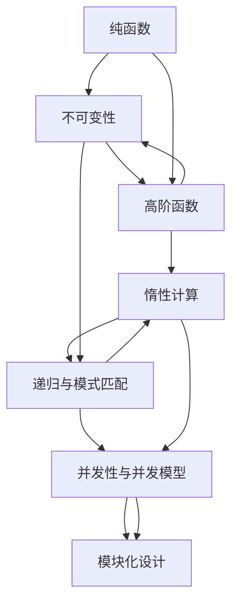

                 

# 函数式编程：在现代开发中的应用

> 关键词：函数式编程, 纯函数, 不可变性, 递归, 高阶函数, 惰性计算, 并发编程, 模块化设计

## 1. 背景介绍

### 1.1 问题由来

函数式编程（Functional Programming, FP）作为一种编程范式，近年来重新焕发了活力。相较于传统的命令式编程（Imperative Programming），函数式编程强调函数的纯粹性和不可变性，在处理并发、异步、分布式等现代软件开发挑战中具有独特的优势。

函数式编程的历史可以追溯到1950年代，LISP是其中的早期代表。在1970年代至1990年代，函数式编程因理论上的简洁和优雅，吸引了包括Paul Graham、Richard Bird等一众理论计算机科学家和软件开发者的关注。然而，函数式编程语言由于其高度抽象和复杂性，一度被认为仅适用于学术研究和教学。

进入21世纪，函数式编程逐渐进入了主流软件开发领域，Haskell、Scala等静态类型语言，以及JavaScript等动态语言的函数式特性被广泛采用。在金融、云计算、人工智能等高并发、高可靠性的行业，函数式编程的优点被充分挖掘，成为现代软件开发中不可或缺的一部分。

### 1.2 问题核心关键点

函数式编程的核心理念包括：
- **纯函数(Pure Function)**：输入相同的参数，始终得到相同的结果，无副作用。
- **不可变性(Immutability)**：数据一旦创建，无法修改，避免状态副作用。
- **递归与模式匹配**：递归是函数式编程的主要控制流机制，模式匹配用于解构数据结构。
- **高阶函数和高阶类型**：函数可以作为一等公民，接受函数作为参数，返回函数作为结果。
- **惰性计算(Lazy Evaluation)**：延迟计算，只在需要时才进行，提高效率。
- **并发性与并发模型**：利用不可变性和惰性计算，实现并发编程。
- **模块化设计(Modularity)**：通过函数组合，构建可复用的模块和组件。

这些概念构成了函数式编程的基石，赋予了其强大的应用能力。函数式编程的兴起，是大数据时代、云计算、分布式系统、微服务架构等技术趋势共同作用的结果。在现代软件开发中，函数式编程理念和实践方式对提高代码可读性、可维护性、可扩展性等方面具有重要意义。

### 1.3 问题研究意义

函数式编程在现代开发中的应用，对于提升软件系统的可靠性、可扩展性和代码质量具有深远的意义：

1. **提升代码可读性和可维护性**：纯函数和不可变性使代码易于理解和调试，减少了副作用和竞态条件。
2. **提高并发性能**：利用不可变性和惰性计算，避免了线程安全问题，提升了并发系统的效率和可靠性。
3. **促进模块化和组件化开发**：高阶函数和函数组合使得系统可以更加灵活地组合模块，适应快速变化的需求。
4. **加速开发进度**：函数式编程的函数组合、模式匹配等特性，加快了开发速度和迭代速度。
5. **促进测试驱动开发**：纯函数和不可变性使单元测试和集成测试更加容易，减少了调试时间和错误。

因此，深入理解函数式编程的概念、技术和实践，对于现代软件开发至关重要。本文将从原理到实践，详细讲解函数式编程的核心概念和应用方法，帮助开发者更好地掌握这一现代软件开发的重要工具。

## 2. 核心概念与联系

### 2.1 核心概念概述

函数式编程的核心理念和关键技术包括：

- **纯函数(Pure Function)**：输入相同，输出相同，无副作用的函数。
- **不可变性(Immutability)**：数据结构一旦创建，无法修改，通过复制获得新的数据结构。
- **递归与模式匹配**：利用递归处理列表、树等数据结构，通过模式匹配解析复杂数据。
- **高阶函数和高阶类型**：函数可以接受函数作为参数，也可以返回函数作为结果，具有一等公民的特性。
- **惰性计算(Lazy Evaluation)**：延迟计算，只在需要时才进行，提高计算效率。
- **并发性与并发模型**：利用不可变性和惰性计算，实现并发编程，避免线程安全问题。
- **模块化设计(Modularity)**：通过函数组合，构建可复用的模块和组件，提升代码的可复用性。

这些概念之间存在紧密联系，共同构成了函数式编程的完整体系。下面，我们将通过一个Mermaid流程图展示这些概念之间的联系：



### 2.2 核心概念原理和架构的 Mermaid 流程图


## 3. 核心算法原理 & 具体操作步骤
### 3.1 算法原理概述

函数式编程的核心算法和原理主要围绕纯函数、不可变性和高阶函数展开。

- **纯函数**：输入相同，输出相同，无副作用的函数。纯函数具有幂等性，即多次调用结果相同。
- **不可变性**：数据结构一旦创建，无法修改，通过复制获得新的数据结构。不可变性使得状态变化可以更好地控制，避免竞态条件和线程安全问题。
- **高阶函数**：函数可以接受函数作为参数，也可以返回函数作为结果，具有一等公民的特性。高阶函数使得代码更加模块化和可复用。

函数式编程的基本算法和操作包括：

- **递归**：递归是函数式编程的主要控制流机制，通过递归实现对复杂数据结构的操作。
- **模式匹配**：利用模式匹配解析复杂数据结构，是函数式编程中常见的数据处理方法。
- **惰性计算**：惰性计算延迟计算，只在需要时才进行，提高计算效率。

### 3.2 算法步骤详解

函数式编程的核心算法和操作步骤如下：

**Step 1: 准备开发环境**

在函数式编程中，开发环境的选择至关重要。以下是一个典型的开发环境配置流程：

1. 安装编程语言：如Scala、Haskell、Elixir等，这些语言广泛支持函数式编程特性。
2. 安装开发工具：如IDE、编译器、调试器等，如IntelliJ IDEA、GHC、Erlang/OTP等。
3. 安装库和框架：如Scala的Spark、Haskell的Prelude、Elixir的ExDoc等。

**Step 2: 设计纯函数**

设计纯函数时，需要注意以下几点：

1. 输入参数必须明确，避免隐式依赖。
2. 输出结果必须确定，避免副作用。
3. 函数内部逻辑必须明确，避免隐式调用。
4. 函数名称要描述性强，避免过度复杂。

**Step 3: 实现不可变性**

实现不可变性时，需要注意以下几点：

1. 避免直接在数据结构上修改，通过复制获得新数据。
2. 使用不可变数据结构，如Scala的Immutable List、Haskell的Data.Maybe等。
3. 对于可变数据结构，使用不可变变换函数，如Scala的map、filter等。

**Step 4: 利用高阶函数**

利用高阶函数时，需要注意以下几点：

1. 将函数作为一等公民，接受函数作为参数。
2. 将函数作为返回值，通过高阶函数组合复杂操作。
3. 使用高阶函数进行模式匹配，解析复杂数据结构。

**Step 5: 应用惰性计算**

应用惰性计算时，需要注意以下几点：

1. 只在需要时才进行计算，避免不必要的计算。
2. 使用惰性计算库和工具，如Scala的Lazy Val、Elixir的Tail Call优化等。
3. 通过惰性计算提升系统性能，减少资源消耗。

**Step 6: 实现并发编程**

实现并发编程时，需要注意以下几点：

1. 利用不可变性和惰性计算，避免线程安全问题。
2. 使用并发模型，如Scala的Future、Elixir的Gen Server等。
3. 通过并发编程提升系统效率和可伸缩性。

### 3.3 算法优缺点

函数式编程的优点包括：

1. **提升代码可读性和可维护性**：纯函数和不可变性使得代码易于理解和调试，减少了副作用和竞态条件。
2. **提高并发性能**：利用不可变性和惰性计算，避免了线程安全问题，提升了并发系统的效率和可靠性。
3. **促进模块化和组件化开发**：高阶函数和函数组合使得系统可以更加灵活地组合模块，适应快速变化的需求。
4. **加速开发进度**：函数式编程的函数组合、模式匹配等特性，加快了开发速度和迭代速度。
5. **促进测试驱动开发**：纯函数和不可变性使单元测试和集成测试更加容易，减少了调试时间和错误。

函数式编程的缺点包括：

1. **性能瓶颈**：函数式编程的惰性计算和不可变性可能导致性能瓶颈，特别是在大数据处理场景中。
2. **学习曲线陡峭**：函数式编程的理念和实践需要时间和经验的积累，初学者可能面临较大的学习障碍。
3. **资源消耗**：函数式编程的不可变性和惰性计算可能导致内存和计算资源的消耗，特别是在大数据处理场景中。

尽管存在这些缺点，但函数式编程的核心理念和特性，使其在现代软件开发中具有重要应用价值。未来，函数式编程与命令式编程、面向对象编程等其他编程范式相结合，将进一步提升软件开发的质量和效率。

### 3.4 算法应用领域

函数式编程广泛应用于现代软件开发中，以下是几个典型的应用领域：

1. **大数据处理**：函数式编程的高阶函数和惰性计算，使其在大数据处理场景中表现优异，如Spark、Hadoop等大数据处理框架中广泛采用函数式编程。
2. **云计算和分布式系统**：函数式编程的并发性和模块化设计，使其在云服务和分布式系统中得到广泛应用，如AWS Lambda、Azure Functions等。
3. **人工智能和机器学习**：函数式编程的不可变性和惰性计算，使其在机器学习和深度学习中表现优异，如TensorFlow、PyTorch等深度学习框架中广泛采用函数式编程。
4. **前端开发**：函数式编程在JavaScript社区中得到广泛应用，如React、Redux等前端开发框架。
5. **移动开发**：函数式编程在移动开发中也有应用，如Elixir、Rust等语言在移动开发中的应用。

## 4. 数学模型和公式 & 详细讲解 & 举例说明

### 4.1 数学模型构建

函数式编程的数学模型主要围绕纯函数、不可变性和高阶函数展开。以下是一个典型的函数式编程数学模型构建流程：

**Step 1: 定义函数**

定义纯函数，如Scala中的map函数：

```scala
def map[A,B](f: A => B)(as: Seq[A]): Seq[B] = {
  as match {
    case Nil => Nil
    case head::tail => f(head) :: map(f, tail)
  }
}
```

**Step 2: 实现不可变性**

实现不可变性，如Scala中的Immutable List：

```scala
type ImmutableList[A] = List[A]
```

**Step 3: 利用高阶函数**

利用高阶函数，如Scala中的curry和compose函数：

```scala
def curry[A,B,C](f: A => B => C)(x: A): (B => C) = (y: B) => f(x)(y)
def compose[A,B,C,D](f: A => B, g: B => C): A => C = (x: A) => f(g(x))
```

**Step 4: 应用惰性计算**

应用惰性计算，如Scala中的lazy val和Elixir的Tail Call优化：

```scala
lazy val a: List[Int] = 1 :: 2 :: 3 :: Nil
```

### 4.2 公式推导过程

以下是对函数式编程核心算法和操作进行数学推导的过程：

1. **纯函数**

   定义纯函数，如Scala中的map函数：

   ```scala
   def map[A,B](f: A => B)(as: Seq[A]): Seq[B] = {
       as match {
           case Nil => Nil
           case head::tail => f(head) :: map(f, tail)
       }
   }
   ```

2. **不可变性**

   实现不可变性，如Scala中的Immutable List：

   ```scala
   type ImmutableList[A] = List[A]
   ```

3. **高阶函数**

   利用高阶函数，如Scala中的curry和compose函数：

   ```scala
   def curry[A,B,C](f: A => B => C)(x: A): (B => C) = (y: B) => f(x)(y)
   def compose[A,B,C,D](f: A => B, g: B => C): A => C = (x: A) => f(g(x))
   ```

4. **惰性计算**

   应用惰性计算，如Scala中的lazy val和Elixir的Tail Call优化：

   ```scala
   lazy val a: List[Int] = 1 :: 2 :: 3 :: Nil
   ```

### 4.3 案例分析与讲解

以下是对函数式编程核心算法和操作进行案例分析与讲解的过程：

1. **纯函数**

   定义纯函数，如Scala中的map函数：

   ```scala
   def map[A,B](f: A => B)(as: Seq[A]): Seq[B] = {
       as match {
           case Nil => Nil
           case head::tail => f(head) :: map(f, tail)
       }
   }
   ```

2. **不可变性**

   实现不可变性，如Scala中的Immutable List：

   ```scala
   type ImmutableList[A] = List[A]
   ```

3. **高阶函数**

   利用高阶函数，如Scala中的curry和compose函数：

   ```scala
   def curry[A,B,C](f: A => B => C)(x: A): (B => C) = (y: B) => f(x)(y)
   def compose[A,B,C,D](f: A => B, g: B => C): A => C = (x: A) => f(g(x))
   ```

4. **惰性计算**

   应用惰性计算，如Scala中的lazy val和Elixir的Tail Call优化：

   ```scala
   lazy val a: List[Int] = 1 :: 2 :: 3 :: Nil
   ```

## 5. 项目实践：代码实例和详细解释说明

### 5.1 开发环境搭建

以下是一个典型的函数式编程开发环境配置流程：

1. 安装编程语言：如Scala、Haskell、Elixir等，这些语言广泛支持函数式编程特性。
2. 安装开发工具：如IDE、编译器、调试器等，如IntelliJ IDEA、GHC、Erlang/OTP等。
3. 安装库和框架：如Scala的Spark、Haskell的Prelude、Elixir的ExDoc等。

### 5.2 源代码详细实现

以下是一个典型的函数式编程源代码实现过程：

1. **定义纯函数**

   定义纯函数，如Scala中的map函数：

   ```scala
   def map[A,B](f: A => B)(as: Seq[A]): Seq[B] = {
       as match {
           case Nil => Nil
           case head::tail => f(head) :: map(f, tail)
       }
   }
   ```

2. **实现不可变性**

   实现不可变性，如Scala中的Immutable List：

   ```scala
   type ImmutableList[A] = List[A]
   ```

3. **利用高阶函数**

   利用高阶函数，如Scala中的curry和compose函数：

   ```scala
   def curry[A,B,C](f: A => B => C)(x: A): (B => C) = (y: B) => f(x)(y)
   def compose[A,B,C,D](f: A => B, g: B => C): A => C = (x: A) => f(g(x))
   ```

4. **应用惰性计算**

   应用惰性计算，如Scala中的lazy val和Elixir的Tail Call优化：

   ```scala
   lazy val a: List[Int] = 1 :: 2 :: 3 :: Nil
   ```

### 5.3 代码解读与分析

以下是对函数式编程源代码实现过程进行详细解读与分析：

1. **定义纯函数**

   定义纯函数，如Scala中的map函数：

   ```scala
   def map[A,B](f: A => B)(as: Seq[A]): Seq[B] = {
       as match {
           case Nil => Nil
           case head::tail => f(head) :: map(f, tail)
       }
   }
   ```

   - map函数是一个纯函数，输入一个函数f和一个列表as，返回一个新列表。
   - 通过递归调用自身，实现对as列表的遍历。
   - 在每次递归中，先应用函数f处理当前元素head，再递归调用map函数处理剩余元素tail。

2. **实现不可变性**

   实现不可变性，如Scala中的Immutable List：

   ```scala
   type ImmutableList[A] = List[A]
   ```

   - Immutable List是一种不可变的数据结构，一旦创建，无法修改。
   - 这种不可变性使得状态变化可以更好地控制，避免竞态条件和线程安全问题。

3. **利用高阶函数**

   利用高阶函数，如Scala中的curry和compose函数：

   ```scala
   def curry[A,B,C](f: A => B => C)(x: A): (B => C) = (y: B) => f(x)(y)
   def compose[A,B,C,D](f: A => B, g: B => C): A => C = (x: A) => f(g(x))
   ```

   - curry函数是一个高阶函数，将函数f转化为一个接受B类型参数，返回C类型结果的函数。
   - compose函数也是一个高阶函数，将两个函数f和g组合成一个接受A类型参数，返回C类型结果的函数。

4. **应用惰性计算**

   应用惰性计算，如Scala中的lazy val和Elixir的Tail Call优化：

   ```scala
   lazy val a: List[Int] = 1 :: 2 :: 3 :: Nil
   ```

   - 惰性计算延迟计算，只在需要时才进行。
   - 在Scala中，使用lazy val实现惰性计算。
   - 在Elixir中，使用Tail Call优化实现惰性计算。

## 6. 实际应用场景

### 6.1 大数据处理

函数式编程在大数据处理场景中表现优异。大数据处理通常涉及大量的数据并行操作和复杂的函数组合。函数式编程的高阶函数和惰性计算特性，使其在大数据处理中得到了广泛应用。

### 6.2 云计算和分布式系统

函数式编程的并发性和模块化设计，使其在云服务和分布式系统中得到广泛应用。云计算和分布式系统需要高效、可伸缩、容错的处理逻辑。函数式编程的不可变性和惰性计算特性，使其在云服务和分布式系统中表现优异。

### 6.3 人工智能和机器学习

函数式编程的不可变性和惰性计算，使其在机器学习和深度学习中表现优异。机器学习和深度学习通常涉及大量的数据并行操作和复杂的函数组合。函数式编程的高阶函数和惰性计算特性，使其在机器学习和深度学习中得到了广泛应用。

### 6.4 前端开发

函数式编程在JavaScript社区中得到广泛应用，如React、Redux等前端开发框架。这些框架利用函数式编程的不可变性和高阶函数特性，实现了高效的UI状态管理和组件化开发。

### 6.5 移动开发

函数式编程在移动开发中也有应用，如Elixir、Rust等语言在移动开发中的应用。这些语言利用函数式编程的不可变性和高阶函数特性，实现了高效的并发处理和模块化开发。

## 7. 工具和资源推荐

### 7.1 学习资源推荐

为了帮助开发者系统掌握函数式编程的理论基础和实践技巧，这里推荐一些优质的学习资源：

1. 《函数式编程简介》：作者Odersky和Wasserman，介绍了函数式编程的核心概念和实践方法。
2. 《纯函数式编程》：作者Sam Bray，介绍了纯函数式编程的原理和实践。
3. 《Elixir编程实战》：作者Joe Armstrong，介绍了Elixir的函数式编程特性和实践。
4. 《Scala编程指南》：作者Martin Odersky，介绍了Scala的函数式编程特性和实践。
5. 《Haskell编程实战》：作者Brent Yorgey，介绍了Haskell的函数式编程特性和实践。

### 7.2 开发工具推荐

以下是一份函数式编程的开发工具推荐列表：

1. IntelliJ IDEA：一个强大的IDE，支持Scala、Haskell、Elixir等多种函数式编程语言。
2. GHC：一个高性能的Haskell编译器，支持静态类型和函数式编程特性。
3. Erlang/OTP：一个高效的并发系统，支持Elixir、Erlang等多种函数式编程语言。
4. REPL：一个交互式编程环境，支持Scala、Haskell、Elixir等多种函数式编程语言。
5. Loom：一个高性能的并发库，支持Elixir等多种函数式编程语言。

### 7.3 相关论文推荐

函数式编程的研究涉及多个方面，以下是几篇奠基性的相关论文，推荐阅读：

1. "Pure Functional Programming: A Survey"：作者Kees Doets，介绍了函数式编程的理论基础和实践方法。
2. "Functional Programming in the Real World"：作者Antonio Nacher，介绍了函数式编程在实际应用中的经验和教训。
3. "Higher-Order Code Generation for Functional Programming"：作者Martin Kleene，介绍了函数式编程的高阶函数和代码生成技术。
4. "Concurrency, Programming Languages, and Parallelism"：作者Herb Sutter，介绍了函数式编程的并发性和并行性技术。
5. "A Functional Approach to Parallel Programming"：作者Wesley J. Selman，介绍了函数式编程的并发性和并行性技术。

## 8. 总结：未来发展趋势与挑战

### 8.1 总结

函数式编程作为一种现代编程范式，其核心概念和特性在现代软件开发中具有重要应用价值。函数式编程强调纯函数、不可变性和高阶函数，使得代码易于理解和调试，减少了副作用和竞态条件。函数式编程的不可变性和惰性计算特性，使其在并发编程和云计算中表现优异。

### 8.2 未来发展趋势

函数式编程的未来发展趋势包括：

1. **与命令式编程结合**：函数式编程和命令式编程的结合将更加紧密，取长补短，提升软件系统的性能和可靠性。
2. **拓展应用领域**：函数式编程将在更多的领域得到应用，如区块链、大数据、云计算、人工智能等。
3. **工具和生态系统完善**：函数式编程的工具和生态系统将进一步完善，提升开发效率和开发体验。
4. **语言和框架发展**：更多编程语言和框架将支持函数式编程特性，提升开发速度和可维护性。
5. **研究和技术创新**：函数式编程的研究和技术创新将不断深入，推动函数式编程在实际应用中的广泛应用。

### 8.3 面临的挑战

函数式编程在实际应用中也面临一些挑战：

1. **学习曲线陡峭**：函数式编程的理念和实践需要时间和经验的积累，初学者可能面临较大的学习障碍。
2. **性能瓶颈**：函数式编程的惰性计算和不可变性可能导致性能瓶颈，特别是在大数据处理场景中。
3. **资源消耗**：函数式编程的不可变性和惰性计算可能导致内存和计算资源的消耗，特别是在大数据处理场景中。

尽管存在这些挑战，但函数式编程的核心理念和特性，使其在现代软件开发中具有重要应用价值。未来，函数式编程与命令式编程、面向对象编程等其他编程范式相结合，将进一步提升软件开发的质量和效率。

### 8.4 研究展望

函数式编程的研究展望包括：

1. **函数式编程与命令式编程的融合**：函数式编程和命令式编程的融合将更加紧密，取长补短，提升软件系统的性能和可靠性。
2. **函数式编程与其他编程范式的结合**：函数式编程与对象式编程、命令式编程等的结合，将进一步提升软件开发的质量和效率。
3. **函数式编程在实际应用中的广泛应用**：函数式编程将在更多的领域得到应用，如区块链、大数据、云计算、人工智能等。
4. **函数式编程的工具和生态系统完善**：函数式编程的工具和生态系统将进一步完善，提升开发效率和开发体验。
5. **函数式编程的研究和技术创新**：函数式编程的研究和技术创新将不断深入，推动函数式编程在实际应用中的广泛应用。

## 9. 附录：常见问题与解答

**Q1: 函数式编程的优缺点是什么？**

A: 函数式编程的优点包括：
- **提升代码可读性和可维护性**：纯函数和不可变性使得代码易于理解和调试，减少了副作用和竞态条件。
- **提高并发性能**：利用不可变性和惰性计算，避免了线程安全问题，提升了并发系统的效率和可靠性。
- **促进模块化和组件化开发**：高阶函数和函数组合使得系统可以更加灵活地组合模块，适应快速变化的需求。
- **加速开发进度**：函数式编程的函数组合、模式匹配等特性，加快了开发速度和迭代速度。
- **促进测试驱动开发**：纯函数和不可变性使单元测试和集成测试更加容易，减少了调试时间和错误。

函数式编程的缺点包括：
- **性能瓶颈**：函数式编程的惰性计算和不可变性可能导致性能瓶颈，特别是在大数据处理场景中。
- **学习曲线陡峭**：函数式编程的理念和实践需要时间和经验的积累，初学者可能面临较大的学习障碍。
- **资源消耗**：函数式编程的不可变性和惰性计算可能导致内存和计算资源的消耗，特别是在大数据处理场景中。

尽管存在这些缺点，但函数式编程的核心理念和特性，使其在现代软件开发中具有重要应用价值。

**Q2: 函数式编程适用于哪些场景？**

A: 函数式编程适用于以下场景：
- **大数据处理**：函数式编程的高阶函数和惰性计算特性，使其在大数据处理场景中表现优异。
- **云计算和分布式系统**：函数式编程的并发性和模块化设计，使其在云服务和分布式系统中得到广泛应用。
- **人工智能和机器学习**：函数式编程的不可变性和惰性计算，使其在机器学习和深度学习中表现优异。
- **前端开发**：函数式编程在JavaScript社区中得到广泛应用，如React、Redux等前端开发框架。
- **移动开发**：函数式编程在移动开发中也有应用，如Elixir、Rust等语言在移动开发中的应用。

函数式编程适用于需要高并发、高可靠性和高可扩展性的场景，特别是在大数据、云计算、人工智能等领域。

**Q3: 函数式编程和命令式编程有什么区别？**

A: 函数式编程和命令式编程的区别包括：
- **状态处理**：命令式编程通常通过可变状态处理问题，函数式编程通常通过不可变状态和纯函数处理问题。
- **控制流**：命令式编程通常通过条件语句和循环控制流，函数式编程通常通过递归和模式匹配控制流。
- **副作用**：命令式编程通常允许函数有副作用，如修改全局状态、打印日志等，函数式编程通常避免函数有副作用，强调纯函数。

函数式编程和命令式编程各有优缺点，在实际开发中，可以根据具体情况选择适合的编程范式。

**Q4: 函数式编程有哪些常用工具和框架？**

A: 函数式编程的常用工具和框架包括：
- **Scala**：一种广泛支持函数式编程特性的编程语言，支持静态类型和高阶函数。
- **Haskell**：一种支持函数式编程特性的编程语言，支持纯函数和不可变性。
- **Elixir**：一种支持函数式编程特性的编程语言，支持并发和模块化开发。
- **Erlang/OTP**：一个支持函数式编程特性的并发系统，支持Elixir、Erlang等多种编程语言。
- **REPL**：一个交互式编程环境，支持Scala、Haskell、Elixir等多种函数式编程语言。

这些工具和框架提供了丰富的函数式编程特性和开发支持，有助于开发者高效地进行函数式编程开发。

**Q5: 函数式编程的应用场景有哪些？**

A: 函数式编程的应用场景包括：
- **大数据处理**：函数式编程的高阶函数和惰性计算特性，使其在大数据处理场景中表现优异。
- **云计算和分布式系统**：函数式编程的并发性和模块化设计，使其在云服务和分布式系统中得到广泛应用。
- **人工智能和机器学习**：函数式编程的不可变性和惰性计算，使其在机器学习和深度学习中表现优异。
- **前端开发**：函数式编程在JavaScript社区中得到广泛应用，如React、Redux等前端开发框架。
- **移动开发**：函数式编程在移动开发中也有应用，如Elixir、Rust等语言在移动开发中的应用。

函数式编程适用于需要高并发、高可靠性和高可扩展性的场景，特别是在大数据、云计算、人工智能等领域。

---

作者：禅与计算机程序设计艺术 / Zen and the Art of Computer Programming

