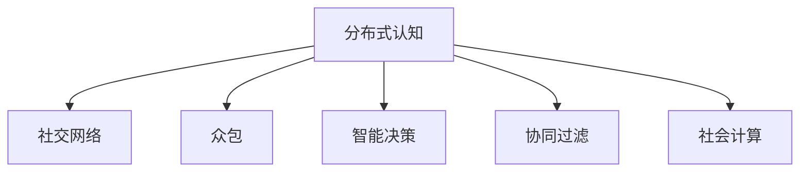

                 

# 分布式认知：揭开群体智慧的神秘面纱

> 关键词：分布式认知, 群体智慧, 社交网络, 众包, 人工智能, 机器学习, 智能决策, 协同过滤, 社会计算

## 1. 背景介绍

### 1.1 问题由来
在现代社会，我们越来越多地依赖于群体智慧来解决问题。无论是商业决策、医疗诊断，还是环境保护，群体智慧都扮演着越来越重要的角色。然而，群体智慧并非总能发挥其全部潜力。它受限于个体的知识水平、认知偏差、社会动态等因素，常常不能产生最优的决策。

### 1.2 问题核心关键点
群体智慧的实质是“分布式认知”，即个体间的知识、信息和观点通过交流和协作进行整合和扩散，从而形成群体层面的智慧。分布式认知的优化依赖于个体和群体之间的有效互动。因此，如何优化群体互动过程，成为提高群体智慧的关键。

### 1.3 问题研究意义
研究分布式认知及其优化方法，对于推动群体智慧的应用，提升群体决策的科学性和合理性，具有重要意义。具体而言：

1. **提升决策质量**：通过优化群体互动，可以减少群体认知偏差，避免决策失误。
2. **提高决策效率**：通过自动化和智能化的手段，加速群体智慧的形成过程。
3. **促进创新**：分布式认知有助于整合不同个体的独特视角，促进知识创新和交叉融合。
4. **支持大尺度问题解决**：分布式认知能够有效应对复杂多变的社会问题，如环境保护、灾害应对等。
5. **增强社会凝聚力**：通过分布式认知平台，促进社会成员之间的互动和理解，增强社会凝聚力。

## 2. 核心概念与联系

### 2.1 核心概念概述

为了更好地理解分布式认知及其优化方法，本节将介绍几个密切相关的核心概念：

- **分布式认知**：群体智慧的核心，通过个体间的交流和协作，形成群体层面的智慧。
- **社交网络**：个体之间的交流和协作关系网络，是分布式认知的基础。
- **众包**：将任务分发给大众群体完成，实现知识的分散和聚合。
- **智能决策**：利用人工智能技术，自动化分析处理大量数据，辅助群体做出决策。
- **协同过滤**：推荐系统中的一种方法，利用用户间的相似性，推荐可能感兴趣的产品或内容。
- **社会计算**：通过计算方法分析社会行为和社会结构，以提升社会决策的科学性和合理性。

这些核心概念之间的逻辑关系可以通过以下Mermaid流程图来展示：



这个流程图展示了一些核心概念之间的关系：

1. 分布式认知通过社交网络实现个体之间的交流协作。
2. 众包和智能决策都是利用分布式认知，通过群体智慧来解决具体问题。
3. 协同过滤基于分布式认知，推荐用户可能感兴趣的内容。
4. 社会计算通过计算分析，提升社会决策的科学性。

## 3. 核心算法原理 & 具体操作步骤
### 3.1 算法原理概述

分布式认知的优化依赖于个体和群体之间的有效互动。传统的优化方法包括：

- **协同过滤**：通过计算用户间的相似性，推荐可能感兴趣的产品或内容。
- **社交网络分析**：通过计算社交网络中的中心性、凝聚子群等指标，识别关键个体和群组。
- **众包平台设计**：通过设计任务分发和奖励机制，引导群体智慧的形成和传播。
- **社交启发式算法**：利用社交网络中传播的信息，辅助个体和群体进行决策。

### 3.2 算法步骤详解

以协同过滤为例，其优化步骤如下：

**Step 1: 数据收集**
- 收集用户行为数据，如浏览记录、评分等。

**Step 2: 相似性计算**
- 使用余弦相似度、皮尔逊相关系数等方法计算用户间的相似性。

**Step 3: 协同过滤**
- 利用相似性计算结果，推荐用户可能感兴趣的产品或内容。

**Step 4: 反馈处理**
- 收集用户反馈，更新相似性矩阵，提升推荐准确性。

**Step 5: 效果评估**
- 通过精确度、召回率、F1值等指标评估推荐效果。

### 3.3 算法优缺点

协同过滤具有以下优点：

- **简单易用**：方法简单，实现成本低。
- **快速推荐**：能够快速给出推荐结果，满足用户即时需求。
- **灵活性高**：适用于多种推荐场景，如商品推荐、新闻推荐等。

然而，协同过滤也存在以下局限性：

- **数据稀疏性问题**：用户行为数据往往非常稀疏，难以有效计算相似性。
- **冷启动问题**：新用户的推荐效果较差，需要额外的方法进行补充。
- **多样性不足**：容易产生“信息茧房”，用户只接触到自己感兴趣的内容。

### 3.4 算法应用领域

协同过滤在电子商务、社交媒体、在线视频等多个领域都有广泛应用：

- **电商推荐系统**：亚马逊、淘宝等电商平台广泛应用协同过滤算法，为用户推荐商品。
- **社交媒体内容推荐**：微博、微信等社交平台利用协同过滤推荐用户可能感兴趣的内容。
- **在线视频推荐**：Netflix、优酷等视频网站推荐用户可能喜欢的电影和剧集。

## 4. 数学模型和公式 & 详细讲解  
### 4.1 数学模型构建

协同过滤的数学模型可以表示为：

$$
\hat{y} = f(x; \theta)
$$

其中，$x$ 为输入特征，$y$ 为推荐结果，$f(\cdot)$ 为模型函数，$\theta$ 为模型参数。协同过滤的目标是最小化预测误差：

$$
\min_{\theta} \sum_{i=1}^N \sum_{j=1}^M (y_{ij} - f(x_i; \theta))^2
$$

### 4.2 公式推导过程

设$u$表示用户，$i$表示物品，$x_{ui}$表示用户$u$对物品$i$的评分。协同过滤的目标是找到一个函数$f(\cdot)$，使得预测评分$\hat{y}_{ui} = f(x_{ui}; \theta)$尽可能接近真实评分$y_{ui}$。常用的协同过滤方法包括：

- **基于矩阵分解的方法**：将用户评分矩阵$X$分解为$U$和$V$两个矩阵，$X=UVT^T$。其中$U$和$V$为用户和物品的特征矩阵，$T^T$为矩阵转置。
- **基于模型的协同过滤**：利用用户和物品的隐含特征进行推荐，常用的模型包括SVD、ALS等。

### 4.3 案例分析与讲解

假设我们有一组用户对电影的评分数据，使用基于矩阵分解的协同过滤方法。首先，将用户评分矩阵$X$分解为$U$和$V$两个矩阵：

$$
X=UVT^T
$$

其中，$U$和$V$的每个元素$u_{ij}$和$v_{ij}$表示用户$i$和物品$j$的隐含特征，$T^T$为矩阵转置。通过计算$u_{ij}$和$v_{ij}$的乘积，可以得到用户$i$对物品$j$的预测评分：

$$
\hat{y}_{ui} = \sum_{j=1}^M u_{ij}v_{ju}
$$

在实际应用中，可以通过最大化预测评分的期望，即最小化均方误差损失，来优化模型参数。具体而言，使用梯度下降等优化算法，最小化目标函数：

$$
\min_{U,V} \frac{1}{2} \sum_{i=1}^N \sum_{j=1}^M (y_{ij} - \hat{y}_{ui})^2
$$

## 5. 项目实践：代码实例和详细解释说明
### 5.1 开发环境搭建

在进行协同过滤实践前，我们需要准备好开发环境。以下是使用Python进行TensorFlow实现协同过滤的环境配置流程：

1. 安装Anaconda：从官网下载并安装Anaconda，用于创建独立的Python环境。

2. 创建并激活虚拟环境：
```bash
conda create -n tf-env python=3.8 
conda activate tf-env
```

3. 安装TensorFlow：根据CUDA版本，从官网获取对应的安装命令。例如：
```bash
conda install tensorflow
```

4. 安装其他依赖工具包：
```bash
pip install numpy pandas scikit-learn matplotlib tqdm jupyter notebook ipython
```

完成上述步骤后，即可在`tf-env`环境中开始协同过滤实践。

### 5.2 源代码详细实现

我们以Amazon商品推荐系统为例，给出使用TensorFlow实现协同过滤的PyTorch代码实现。

首先，定义协同过滤模型的类：

```python
import tensorflow as tf

class CollaborativeFiltering(tf.keras.Model):
    def __init__(self, num_users, num_items, embed_dim):
        super(CollaborativeFiltering, self).__init__()
        self.num_users = num_users
        self.num_items = num_items
        self.embed_dim = embed_dim
        
        # 用户特征矩阵
        self.user_embeddings = tf.keras.layers.Embedding(num_users, embed_dim)
        # 物品特征矩阵
        self.item_embeddings = tf.keras.layers.Embedding(num_items, embed_dim)
        
        # 评分预测
        selfdot_product = tf.keras.layers.Dot(axes=1, normalize=True)
        self rating_layer = tf.keras.layers.Dense(1, activation='linear')
    
    def call(self, user_ids, item_ids):
        # 用户和物品的特征嵌入
        user_features = self.user_embeddings(user_ids)
        item_features = self.item_embeddings(item_ids)
        
        # 评分预测
        dot_product = selfdot_product([user_features, item_features])
        rating = self.rating_layer(dot_product)
        
        return rating
```

然后，定义数据集和模型训练函数：

```python
# 创建数据集
data = {
    'user_ids': np.random.randint(0, 100, size=(1000,)),
    'item_ids': np.random.randint(0, 100, size=(1000,)),
    'ratings': np.random.randn(1000)
}

# 定义数据集类
class DataLoader(tf.data.Dataset):
    def __init__(self, data):
        self.data = data
        
    def __len__(self):
        return len(self.data)
    
    def __getitem__(self, item):
        return self.data[item]

# 定义模型训练函数
def train_model(model, data_loader, batch_size, num_epochs, learning_rate):
    optimizer = tf.keras.optimizers.Adam(learning_rate)
    model.compile(optimizer=optimizer, loss='mse')
    
    for epoch in range(num_epochs):
        for batch in data_loader:
            user_ids = batch['user_ids']
            item_ids = batch['item_ids']
            ratings = batch['ratings']
            
            with tf.GradientTape() as tape:
                predictions = model(user_ids, item_ids)
                loss = tf.keras.losses.mean_squared_error(ratings, predictions)
            
            grads = tape.gradient(loss, model.trainable_variables)
            optimizer.apply_gradients(zip(grads, model.trainable_variables))
            
        print(f'Epoch {epoch+1}, loss: {loss:.4f}')
    
    return model
```

最后，启动模型训练：

```python
# 创建数据集
train_data = DataLoader(data)

# 定义模型
num_users = 100
num_items = 100
embed_dim = 10
model = CollaborativeFiltering(num_users, num_items, embed_dim)

# 训练模型
train_model(model, train_data, batch_size=32, num_epochs=10, learning_rate=0.001)

# 测试模型
test_data = DataLoader(data)
predictions = model(test_data)
print(f'Predictions: {predictions}')
```

以上就是使用TensorFlow实现协同过滤的完整代码实现。可以看到，利用TensorFlow的高效计算能力，我们能够轻松地实现协同过滤模型的训练和推理。

### 5.3 代码解读与分析

让我们再详细解读一下关键代码的实现细节：

**CollaborativeFiltering类**：
- `__init__`方法：初始化用户、物品、特征维度的参数，定义用户和物品的嵌入层，以及评分预测层。
- `call`方法：根据输入的用户ID和物品ID，计算评分预测值。

**DataLoader类**：
- `__init__`方法：初始化数据集。
- `__len__`方法：返回数据集的长度。
- `__getitem__`方法：获取指定位置的样本。

**train_model函数**：
- 定义优化器和损失函数。
- 循环迭代模型训练，每批次输入样本，计算损失，反向传播更新模型参数。

**训练流程**：
- 创建数据集。
- 定义模型和训练参数。
- 训练模型。
- 测试模型。

可以看到，TensorFlow使得协同过滤模型的实现变得简单高效。开发者可以将更多精力放在模型优化和效果评估上，而不必过多关注底层实现细节。

当然，工业级的系统实现还需考虑更多因素，如模型保存和部署、超参数调优等。但核心的协同过滤范式基本与此类似。

## 6. 实际应用场景
### 6.1 电商平台推荐系统

在电商平台，协同过滤可以应用于商品推荐，提升用户购物体验。利用用户的浏览、评分、购买等行为数据，协同过滤模型可以自动推荐用户可能感兴趣的商品。同时，可以通过A/B测试等方法，不断优化推荐算法，提升用户点击率和转化率。

### 6.2 社交媒体内容推荐

社交媒体平台可以利用协同过滤推荐用户可能感兴趣的内容，提升用户活跃度和平台粘性。通过分析用户对内容的互动数据，协同过滤模型可以推荐相关文章、视频、话题等，满足用户的个性化需求。

### 6.3 在线视频推荐系统

在线视频平台如Netflix、优酷等，利用协同过滤推荐用户可能喜欢的电影和剧集。通过分析用户的观看记录和评分数据，协同过滤模型可以推荐符合用户兴趣的视频内容，增加平台的用户粘性和订阅率。

### 6.4 未来应用展望

随着数据量的不断增长和计算能力的提升，协同过滤的应用将更加广泛。未来，协同过滤技术可以应用于更多领域，如医疗诊断、金融投资、智慧城市等。同时，结合分布式计算和大数据技术，协同过滤模型可以处理更大规模的数据集，支持大尺度问题解决。

## 7. 工具和资源推荐
### 7.1 学习资源推荐

为了帮助开发者系统掌握协同过滤的原理和实践技巧，这里推荐一些优质的学习资源：

1. 《Recommender Systems》系列博文：由领域专家撰写，系统介绍了协同过滤的原理、算法和应用场景。

2. CS550《推荐系统》课程：斯坦福大学开设的推荐系统课程，有Lecture视频和配套作业，带你深入了解推荐系统的基本概念和经典模型。

3. 《Introduction to Recommender Systems》书籍：推荐系统领域入门书籍，全面介绍了协同过滤等主流推荐方法。

4. KDD Cup 2020 Recommendation Challenge：推荐系统领域的顶级比赛，通过实战项目帮助你提升协同过滤的实战能力。

5. PyTorch官方文档：PyTorch的推荐系统教程，提供了丰富的协同过滤样例代码，是学习推荐系统的必读资料。

通过对这些资源的学习实践，相信你一定能够快速掌握协同过滤的核心原理和应用技巧，并用于解决实际的推荐问题。

### 7.2 开发工具推荐

高效的开发离不开优秀的工具支持。以下是几款用于协同过滤开发的常用工具：

1. PyTorch：基于Python的开源深度学习框架，灵活动态的计算图，适合快速迭代研究。

2. TensorFlow：由Google主导开发的开源深度学习框架，生产部署方便，适合大规模工程应用。

3. Scikit-learn：Python的机器学习库，提供了丰富的协同过滤算法和评估工具。

4. PyTorch Lightning：基于PyTorch的分布式深度学习框架，方便进行模型训练和部署。

5. Dask：Python的分布式计算库，可以处理大规模数据集，支持多机分布式计算。

合理利用这些工具，可以显著提升协同过滤任务的开发效率，加快创新迭代的步伐。

### 7.3 相关论文推荐

协同过滤在推荐系统领域的研究非常活跃，以下是几篇奠基性的相关论文，推荐阅读：

1. matrix factorization techniques for recommender systems（马特里克斯分解技术）：提出了矩阵分解方法，通过分解用户评分矩阵来推荐商品。

2. improving the latent factor model for collaborative filtering（改进隐式因子模型）：提出ALS算法，通过交替最小化来优化协同过滤模型。

3. the bellkhop model for collaborative filtering（贝尔科普模型）：提出贝尔科普模型，通过正则化来解决协同过滤中的冷启动问题。

4. implicit collaborative filtering using item-based clustering：提出基于物品聚类的协同过滤方法，利用物品聚类来提升推荐效果。

5. deep collaborative filtering for recommender systems（深度协同过滤）：提出深度神经网络协同过滤方法，通过多层次表示学习提升推荐效果。

这些论文代表了大规模推荐系统的技术演进，深入理解这些前沿成果，可以帮助你把握协同过滤的发展脉络，激发更多的创新灵感。

## 8. 总结：未来发展趋势与挑战
### 8.1 总结

本文对协同过滤技术进行了全面系统的介绍。首先阐述了协同过滤技术在推荐系统中的应用背景和意义，明确了协同过滤在提升推荐系统效果方面的独特价值。其次，从原理到实践，详细讲解了协同过滤的数学原理和关键步骤，给出了协同过滤任务开发的完整代码实例。同时，本文还广泛探讨了协同过滤技术在电商、社交媒体、在线视频等多个领域的应用前景，展示了协同过滤范式的巨大潜力。此外，本文精选了协同过滤技术的各类学习资源，力求为读者提供全方位的技术指引。

通过本文的系统梳理，可以看到，协同过滤技术已经广泛应用于推荐系统领域，成为推荐系统的重要技术手段。未来，伴随推荐系统的不断发展，协同过滤技术必将发挥更大的作用，提升用户个性化推荐的质量和效率。

### 8.2 未来发展趋势

展望未来，协同过滤技术将呈现以下几个发展趋势：

1. **深度协同过滤**：利用深度神经网络，提升协同过滤模型的表达能力和预测精度。深度协同过滤已经成为推荐系统的新热门方向。

2. **跨模态协同过滤**：将图像、文本、音频等多模态数据进行融合，提升推荐效果。跨模态协同过滤有望成为未来推荐系统的重要方向。

3. **分布式协同过滤**：通过分布式计算技术，处理更大规模的数据集，提升协同过滤模型的效率和性能。

4. **混合协同过滤**：结合多种协同过滤方法，利用其优点，提升推荐效果。混合协同过滤已经成为推荐系统的常规方法。

5. **元学习协同过滤**：通过元学习技术，适应不同领域、不同场景的推荐需求，提升推荐系统的灵活性。

6. **公平性协同过滤**：在推荐系统中加入公平性约束，消除推荐偏差，提升推荐系统的公正性和透明性。

以上趋势凸显了协同过滤技术的广阔前景。这些方向的探索发展，必将进一步提升推荐系统的性能和应用范围，为人类认知智能的进化带来深远影响。

### 8.3 面临的挑战

尽管协同过滤技术已经取得了瞩目成就，但在迈向更加智能化、普适化应用的过程中，它仍面临着诸多挑战：

1. **数据稀疏性**：用户行为数据往往非常稀疏，难以有效计算相似性。如何处理数据稀疏性，提升推荐效果，仍然是一个重要问题。

2. **冷启动问题**：新用户的推荐效果较差，需要额外的方法进行补充。如何快速融入新用户，提升推荐质量，需要更多方法支持。

3. **多样性不足**：容易产生“信息茧房”，用户只接触到自己感兴趣的内容。如何提升推荐多样性，消除“信息茧房”，需要更多创新思路。

4. **算法复杂性**：深度协同过滤等方法的实现复杂度高，计算成本高。如何简化模型结构，提升算法效率，仍然是一个挑战。

5. **推荐公平性**：推荐算法容易产生偏见，导致推荐不公平。如何在推荐系统中加入公平性约束，消除推荐偏差，需要更多探索。

6. **用户隐私保护**：推荐系统需要处理大量用户数据，如何保护用户隐私，防止数据滥用，仍然是一个重要问题。

正视协同过滤面临的这些挑战，积极应对并寻求突破，将是协同过滤技术未来发展的关键。

### 8.4 研究展望

面对协同过滤技术面临的诸多挑战，未来的研究需要在以下几个方面寻求新的突破：

1. **大数据处理**：结合大数据技术，处理更大规模的数据集，提升推荐系统的效率和性能。

2. **算法优化**：结合深度学习、元学习等先进算法，提升协同过滤模型的表达能力和预测精度。

3. **跨领域应用**：结合不同领域的知识，提升协同过滤模型的灵活性和泛化能力。

4. **用户反馈机制**：通过用户反馈机制，不断优化推荐系统，提升推荐效果。

5. **推荐公平性**：加入公平性约束，消除推荐偏差，提升推荐系统的公正性和透明性。

6. **隐私保护**：结合隐私保护技术，保护用户隐私，防止数据滥用。

这些研究方向的发展，必将推动协同过滤技术迈向新的高度，为推荐系统带来更大的突破。总之，协同过滤技术需要在数据、算法、应用等多个维度协同发力，才能真正实现其潜力，为人类认知智能的进化带来深远影响。

## 9. 附录：常见问题与解答
### 9.1 常见问题

**Q1：协同过滤适用于所有推荐场景吗？**

A: 协同过滤在推荐系统中应用广泛，但并不适用于所有推荐场景。对于一些需要个性化很强的推荐场景，如医疗推荐、金融推荐等，协同过滤可能难以满足需求。此时需要结合领域知识，引入其他推荐方法。

**Q2：协同过滤能否处理多模态数据？**

A: 协同过滤主要处理文本和数字数据，对于多模态数据，如图像、音频等，需要进行特征提取和融合。跨模态协同过滤已经成为推荐系统的新热门方向。

**Q3：协同过滤是否会过拟合？**

A: 协同过滤模型容易出现过拟合，尤其是在数据稀疏性严重的情况下。可以通过正则化、特征选择等方法缓解过拟合问题。

**Q4：协同过滤如何处理冷启动问题？**

A: 冷启动问题可以通过引入上下文信息、先验知识等方法进行缓解。同时，利用先验知识进行推荐也是一种有效的方法。

**Q5：协同过滤的公平性问题如何解决？**

A: 协同过滤容易产生推荐偏差，可以通过公平性约束、正则化等方法解决。同时，利用用户反馈机制，不断优化推荐系统，提升推荐公平性。

### 9.2 解答

这些问题和解答凸显了协同过滤技术在推荐系统中的重要性和面临的挑战。通过对这些问题的深入探讨，相信你一定能够更好地掌握协同过滤的核心原理和应用技巧，并用于解决实际的推荐问题。

