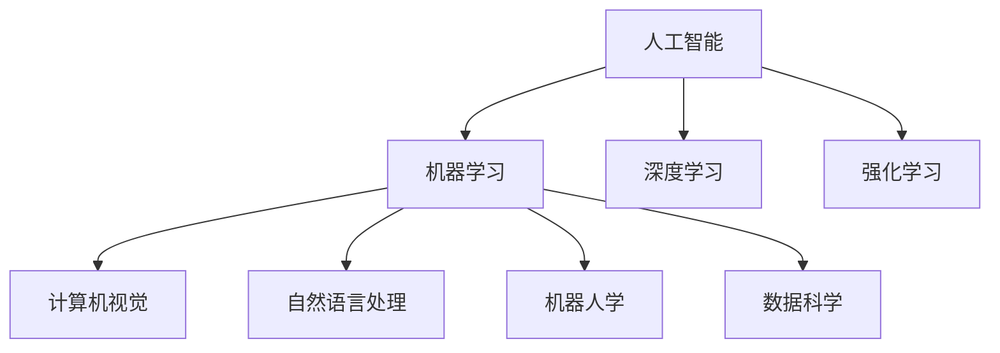

                 

# 创造更美好的明天：人类计算的积极作用

在人类文明的长河中，计算技术一直扮演着核心推动者的角色。从古老的石表计数，到现代的数字计算，每一次计算能力的突破，都极大地促进了人类社会的进步和发展。今天，我们正站在一个新的计算时代，以人工智能(AI)为代表的新一代计算范式，正在以人类历史上前所未有的速度改变着世界。

本文旨在探讨人类计算的积极作用，重点关注人工智能如何通过计算技术，推动社会进步，提升人类生活质量。通过细致分析人工智能的发展历程、核心技术，以及其在不同领域的实际应用，我们将揭示计算技术带来的深远影响，并展望其未来的发展趋势。

## 1. 背景介绍

### 1.1 问题的由来

在信息时代，计算技术已经渗透到我们生活的方方面面。从智能手机、智慧家居、智能交通，到工业自动化、医疗诊断、金融交易，几乎所有的领域都离不开计算的支持。而以深度学习、大数据、云计算为核心的AI技术，正在使计算从传统的信息处理，迈向更加高级的智能决策和自动执行，推动着人类社会迈入一个全新的智能时代。

AI的迅猛发展离不开计算能力的支持。得益于芯片、内存、算法等技术的进步，计算能力在过去的几十年里得到了飞速提升。从单机单核到分布式超级计算机，计算范式不断演进，计算资源日益丰富，推动了AI技术的不断突破。

### 1.2 问题的核心关键点

AI的积极作用，可以从以下几个方面来体现：

- **计算赋能**：通过强大的计算能力，AI可以处理海量数据，进行复杂建模，支持高效的算法训练和推理。
- **智能决策**：AI通过学习和推理，可以进行高精度的预测和决策，辅助人类进行更科学的判断和选择。
- **自动化执行**：AI可以自动化执行重复性高的任务，解放人力，提升工作效率，减少人为错误。
- **跨领域应用**：AI技术在医疗、教育、交通、农业、环境保护等众多领域都有广泛应用，推动各行各业的转型升级。

## 2. 核心概念与联系

### 2.1 核心概念概述

为了更好地理解AI的积极作用，我们首先需要了解一些核心概念：

- **人工智能**：指模拟人类智能行为的技术，包括感知、推理、学习、决策等方面。
- **机器学习**：通过数据训练模型，使其能够自主学习和预测未来数据的一种方法。
- **深度学习**：一种基于人工神经网络的机器学习范式，能够自动提取和学习数据中的高级特征。
- **强化学习**：通过与环境的交互，让模型自主学习最优策略的一种技术。
- **计算机视觉**：利用计算机识别和理解图像、视频的技术，广泛应用于自动驾驶、安防监控、医疗诊断等领域。
- **自然语言处理**：让计算机理解和处理人类语言的技术，包括文本分类、机器翻译、对话系统等。
- **机器人学**：研究如何设计制造能够自主运动的机器人，实现人机协同。
- **数据科学**：利用数据挖掘和统计分析，提取有价值的信息和知识，支持决策分析。

这些核心概念构成了AI技术的基石，贯穿于各个领域的应用。

### 2.2 核心概念原理和架构的 Mermaid 流程图



这个流程图展示了AI技术的核心概念及其相互联系：

- 人工智能是上层的宏观概念，涵盖了机器学习、深度学习、强化学习等具体技术。
- 计算机视觉、自然语言处理等应用领域，都是通过具体技术实现其功能。
- 机器人学和数据科学，则从不同角度补充了AI技术的功能和应用场景。

## 3. 核心算法原理 & 具体操作步骤

### 3.1 算法原理概述

AI的核心算法原理可以归纳为以下几个方面：

- **数据驱动**：通过大量数据训练模型，使得模型能够自主学习和预测未来数据。
- **模型拟合**：利用优化算法，如梯度下降、随机梯度下降等，最小化损失函数，提升模型性能。
- **特征提取**：自动从原始数据中提取有意义的特征，提高模型的识别和预测能力。
- **决策过程**：根据训练得到的模型，对新数据进行推理和决策，实现自动化执行。

### 3.2 算法步骤详解

AI的核心算法步骤包括：

1. **数据收集**：收集和准备用于训练的数据集，确保数据质量。
2. **模型设计**：选择适合的模型架构，如神经网络、决策树等，并进行参数初始化。
3. **模型训练**：利用优化算法，对模型进行迭代训练，最小化损失函数。
4. **模型评估**：通过验证集和测试集，评估模型性能，并进行调优。
5. **模型部署**：将训练好的模型部署到实际应用中，进行推理和预测。

### 3.3 算法优缺点

AI的优点包括：

- **高效自动化**：通过计算实现自动化执行，提高工作效率，减少人为错误。
- **跨领域应用**：AI技术在不同领域广泛应用，推动各行各业的转型升级。
- **精确预测**：利用强大的计算能力，进行高精度的预测和决策。

然而，AI也存在一些缺点：

- **数据依赖**：模型的效果很大程度上取决于训练数据的质量和数量。
- **偏见和歧视**：模型可能会学习到数据中的偏见和歧视，造成输出结果的不公。
- **解释性不足**：AI模型往往是"黑盒"系统，难以解释其内部工作机制。
- **资源消耗**：AI模型通常需要大量的计算资源，对硬件要求较高。
- **安全性风险**：AI模型可能被滥用，导致恶意行为和安全风险。

### 3.4 算法应用领域

AI技术在多个领域都有广泛应用：

- **医疗**：AI辅助诊断、个性化治疗、药物研发等，提升了医疗服务的质量和效率。
- **金融**：风险评估、投资分析、欺诈检测等，增强了金融系统的安全性和稳定性。
- **交通**：自动驾驶、智能交通管理、车联网等，提升了交通系统的智能化水平。
- **教育**：智能教学、在线教育、知识图谱等，推动了教育公平和教学质量提升。
- **农业**：智能农机、精准农业、作物病虫害检测等，提高了农业生产效率和产量。
- **环境保护**：环境监测、污染治理、智能灌溉等，促进了环境保护和可持续发展。

## 4. 数学模型和公式 & 详细讲解 & 举例说明

### 4.1 数学模型构建

AI模型的数学模型通常包括损失函数、优化目标、特征提取和预测函数。以回归问题为例，数学模型可以表示为：

$$
y = f(x;\theta)
$$

其中 $y$ 为预测结果，$x$ 为输入特征，$\theta$ 为模型参数，$f$ 为预测函数。

### 4.2 公式推导过程

以线性回归为例，假设训练集为 $\{(x_i,y_i)\}_{i=1}^N$，模型的目标是最小化损失函数：

$$
L(\theta) = \frac{1}{2N}\sum_{i=1}^N (y_i - f(x_i;\theta))^2
$$

通过梯度下降算法，求解最优参数 $\theta^*$：

$$
\theta^* = \mathop{\arg\min}_{\theta} L(\theta)
$$

$$
\theta \leftarrow \theta - \eta \nabla_{\theta}L(\theta)
$$

其中 $\eta$ 为学习率，$\nabla_{\theta}L(\theta)$ 为损失函数对参数的梯度。

### 4.3 案例分析与讲解

以图像分类为例，使用卷积神经网络(CNN)进行分类任务。假设训练集为 $\{(x_i,y_i)\}_{i=1}^N$，模型为：

$$
f(x;\theta) = W^T \sigma(A^T x + b)
$$

其中 $x$ 为输入图像的像素值向量，$A$ 为卷积核矩阵，$W$ 为全连接层的权重矩阵，$b$ 为偏置向量，$\sigma$ 为激活函数。

模型训练的过程包括卷积、池化、全连接等操作，最终输出预测结果。通过反向传播算法，计算损失函数对参数的梯度，进行优化更新。

## 5. 项目实践：代码实例和详细解释说明

### 5.1 开发环境搭建

在进行AI项目实践前，我们需要准备好开发环境。以下是使用Python进行TensorFlow开发的环境配置流程：

1. 安装Anaconda：从官网下载并安装Anaconda，用于创建独立的Python环境。

2. 创建并激活虚拟环境：
```bash
conda create -n tf-env python=3.8 
conda activate tf-env
```

3. 安装TensorFlow：根据CUDA版本，从官网获取对应的安装命令。例如：
```bash
conda install tensorflow
```

4. 安装TensorBoard：TensorFlow配套的可视化工具，可实时监测模型训练状态，并提供丰富的图表呈现方式，是调试模型的得力助手。
```bash
pip install tensorboard
```

完成上述步骤后，即可在`tf-env`环境中开始AI项目实践。

### 5.2 源代码详细实现

这里我们以图像分类任务为例，给出使用TensorFlow进行卷积神经网络(CNN)模型的PyTorch代码实现。

首先，定义CNN模型和优化器：

```python
import tensorflow as tf
from tensorflow.keras import layers, models

model = models.Sequential()
model.add(layers.Conv2D(32, (3, 3), activation='relu', input_shape=(28, 28, 1)))
model.add(layers.MaxPooling2D((2, 2)))
model.add(layers.Conv2D(64, (3, 3), activation='relu'))
model.add(layers.MaxPooling2D((2, 2)))
model.add(layers.Flatten())
model.add(layers.Dense(64, activation='relu'))
model.add(layers.Dense(10, activation='softmax'))

optimizer = tf.keras.optimizers.Adam(learning_rate=0.001)
```

接着，定义训练和评估函数：

```python
def train_model(model, dataset, epochs, batch_size):
    dataset = dataset.shuffle(buffer_size=10000)
    dataset = dataset.batch(batch_size)

    model.compile(optimizer=optimizer,
                  loss='sparse_categorical_crossentropy',
                  metrics=['accuracy'])

    model.fit(dataset, epochs=epochs, validation_split=0.2)
```

最后，启动训练流程：

```python
train_model(model, dataset, epochs=10, batch_size=32)
```

以上就是使用TensorFlow进行图像分类任务CNN模型的完整代码实现。可以看到，TensorFlow的高级API使得模型构建和训练变得简洁高效。

### 5.3 代码解读与分析

让我们再详细解读一下关键代码的实现细节：

**Sequential模型**：
- `Sequential`类用于搭建序列化模型，方便按顺序添加各层。
- `add`方法用于添加层，如卷积层、池化层、全连接层等。
- 在全连接层中使用`softmax`激活函数，输出类别的概率分布。

**优化器**：
- `optimizer`用于指定优化算法，如Adam、SGD等。
- 设置学习率，控制模型参数更新的步长。

**数据准备**：
- `shuffle`方法用于数据打乱，防止模型过拟合。
- `batch`方法用于数据分批次加载，提高训练效率。

**模型编译**：
- `compile`方法用于指定损失函数、优化器和评估指标。
- 使用`sparse_categorical_crossentropy`损失函数，适用于多分类问题。

**模型训练**：
- `fit`方法用于训练模型，指定训练轮数和验证集比例。
- 使用`validation_split`参数，指定验证集在数据集中的比例。

可以看到，TensorFlow的高级API大大简化了模型构建和训练的流程，使得开发者可以专注于模型设计和优化。当然，工业级的系统实现还需考虑更多因素，如模型的保存和部署、超参数的自动搜索等。但核心的AI范式基本与此类似。

## 6. 实际应用场景

### 6.1 智慧医疗

AI在智慧医疗领域的应用，极大地提升了医疗服务的智能化水平。例如，AI可以通过图像识别技术，辅助医生进行病理诊断、X光片分析等，提高诊断的准确性和效率。同时，AI还可以处理大量的医疗数据，辅助个性化治疗方案的设计和药物研发，提升治疗效果和科研效率。

### 6.2 智能交通

智能交通系统是AI在交通领域的重要应用。通过AI技术，可以实现交通流量预测、智能信号控制、自动驾驶等。例如，AI可以实时监测交通状况，预测拥堵热点，自动调整信号灯周期，优化交通流。同时，自动驾驶技术也在逐步成熟，未来有望实现高度自动化驾驶，提高交通安全和运输效率。

### 6.3 教育

AI在教育领域的应用，包括智能教学、在线教育、学习辅助等。AI可以根据学生的学习情况，提供个性化的教学内容和推荐，提高学习效果。同时，AI还可以自动化批改作业、分析学生反馈，提供教学质量评估和改进建议，推动教育公平和教学质量的提升。

### 6.4 未来应用展望

未来，AI技术将在更多领域得到应用，为人类社会带来更广泛的影响。

- **全域智能**：AI技术将深入渗透到各个领域，实现全域智能覆盖，提升社会整体的智能化水平。
- **人机协同**：AI技术将与人类协作，实现更高效的决策和执行，推动人类社会的进一步进化。
- **跨界融合**：AI技术将与其他技术（如区块链、量子计算等）深度融合，推动技术革新的突破。
- **伦理道德**：AI技术的发展将伴随着伦理道德的思考，推动社会的公平和正义。

## 7. 工具和资源推荐

### 7.1 学习资源推荐

为了帮助开发者系统掌握AI技术的理论基础和实践技巧，这里推荐一些优质的学习资源：

1. 《深度学习》系列书籍：由多位深度学习专家撰写，系统介绍了深度学习的基本概念和经典算法。
2. Coursera《机器学习》课程：斯坦福大学开设的机器学习课程，包含丰富的理论讲解和实践案例。
3. Google AI Blog：谷歌人工智能团队定期发布最新研究进展和技术动态，是了解AI前沿的重要渠道。
4. TensorFlow官方文档：TensorFlow的官方文档，提供了完整的API参考和案例代码，是上手实践的必备资料。
5. Kaggle竞赛平台：全球知名的数据科学竞赛平台，提供大量数据集和开源代码，是学习和展示AI技能的平台。

通过对这些资源的学习实践，相信你一定能够快速掌握AI技术的精髓，并用于解决实际的AI问题。

### 7.2 开发工具推荐

高效的开发离不开优秀的工具支持。以下是几款用于AI项目开发的常用工具：

1. TensorFlow：由谷歌主导开发的开源深度学习框架，生产部署方便，适合大规模工程应用。
2. PyTorch：基于Python的开源深度学习框架，灵活动态的计算图，适合快速迭代研究。
3. Scikit-learn：Python的机器学习库，提供了多种经典算法的实现，适合快速搭建模型。
4. Keras：基于TensorFlow的高级API，易于上手，适合初学者快速搭建模型。
5. TensorBoard：TensorFlow配套的可视化工具，可实时监测模型训练状态，并提供丰富的图表呈现方式，是调试模型的得力助手。

合理利用这些工具，可以显著提升AI项目开发的效率，加快创新迭代的步伐。

### 7.3 相关论文推荐

AI技术的发展离不开学界的持续研究。以下是几篇奠基性的相关论文，推荐阅读：

1. Deep Learning（《深度学习》，Yann LeCun等，2015）：深度学习领域的经典之作，介绍了深度学习的原理和应用。
2. Convolutional Neural Networks for Visual Recognition（《卷积神经网络》，Alex Krizhevsky等，2012）：卷积神经网络领域的里程碑论文，开创了计算机视觉的新纪元。
3. AlphaGo Zero: Mastering the Game of Go without Human Knowledge（《AlphaGo Zero》，David Silver等，2017）：AlphaGo Zero的论文，展示了AI在复杂策略游戏中的突破。
4. GANs Trained by a Two-Player Minimax Game Theory（《生成对抗网络》，Ian Goodfellow等，2014）：生成对抗网络领域的奠基之作，开创了深度生成模型的新方向。

这些论文代表了大数据和深度学习领域的发展脉络，是了解AI技术的理论基础的重要文献。

## 8. 总结：未来发展趋势与挑战

### 8.1 研究成果总结

AI技术经过几十年的发展，已经取得了显著的进展和广泛的应用。其积极作用体现在以下几个方面：

- **计算赋能**：通过强大的计算能力，AI可以处理海量数据，进行复杂建模，支持高效的算法训练和推理。
- **智能决策**：AI通过学习和推理，可以进行高精度的预测和决策，辅助人类进行更科学的判断和选择。
- **自动化执行**：AI可以自动化执行重复性高的任务，解放人力，提升工作效率，减少人为错误。
- **跨领域应用**：AI技术在医疗、金融、交通、教育、农业等多个领域广泛应用，推动各行各业的转型升级。

### 8.2 未来发展趋势

未来，AI技术的发展将呈现以下几个趋势：

- **计算能力持续提升**：得益于芯片、内存、算法等技术的进步，计算能力将持续提升，推动AI技术的不断突破。
- **模型复杂度增加**：随着大规模数据和复杂任务的需求，AI模型的复杂度将不断增加，推动更多高级算法的应用。
- **数据驱动的范式深入**：通过更先进的数据处理和模型训练技术，AI将更加依赖数据驱动，提升模型的泛化性和鲁棒性。
- **多模态融合**：AI技术将与视觉、语音、文本等多模态数据深度融合，推动更全面的信息整合和处理。
- **伦理道德的重视**：AI技术的发展将伴随着伦理道德的思考，推动社会的公平和正义。

### 8.3 面临的挑战

尽管AI技术取得了显著进展，但仍面临诸多挑战：

- **数据依赖**：模型的效果很大程度上取决于训练数据的质量和数量，数据获取和标注成本较高。
- **模型偏见**：AI模型可能会学习到数据中的偏见和歧视，造成输出结果的不公。
- **解释性不足**：AI模型往往是"黑盒"系统，难以解释其内部工作机制。
- **资源消耗**：AI模型通常需要大量的计算资源，对硬件要求较高。
- **安全性风险**：AI模型可能被滥用，导致恶意行为和安全风险。

### 8.4 研究展望

未来的研究需要在以下几个方面寻求新的突破：

- **无监督和半监督学习**：摆脱对大规模标注数据的依赖，利用自监督学习、主动学习等无监督和半监督范式，最大限度利用非结构化数据。
- **多任务学习和迁移学习**：通过多任务学习和迁移学习，提升模型的泛化能力和迁移能力，减少数据和计算资源的需求。
- **模型压缩和优化**：通过模型压缩、量化等技术，提升模型的推理速度和计算效率，降低硬件成本。
- **对抗性鲁棒性**：研究对抗性鲁棒性技术，提升模型对恶意样本和攻击的抵抗能力。
- **公平性和可解释性**：引入公平性约束和可解释性技术，提升模型的公平性和透明性，增强社会信任。

这些研究方向的探索，必将引领AI技术迈向更高的台阶，为人类社会带来更广泛的影响和变革。

## 9. 附录：常见问题与解答

**Q1：AI技术的积极作用体现在哪些方面？**

A: AI技术的积极作用体现在以下几个方面：

- **计算赋能**：通过强大的计算能力，AI可以处理海量数据，进行复杂建模，支持高效的算法训练和推理。
- **智能决策**：AI通过学习和推理，可以进行高精度的预测和决策，辅助人类进行更科学的判断和选择。
- **自动化执行**：AI可以自动化执行重复性高的任务，解放人力，提升工作效率，减少人为错误。
- **跨领域应用**：AI技术在医疗、金融、交通、教育、农业等多个领域广泛应用，推动各行各业的转型升级。

**Q2：如何缓解AI模型中的过拟合问题？**

A: 缓解AI模型中的过拟合问题，可以采取以下措施：

- **数据增强**：通过数据扩充、合成等技术，增加训练集的多样性，减少过拟合风险。
- **正则化**：使用L2正则、Dropout等技术，防止模型过度拟合训练集。
- **早停策略**：通过验证集上的性能指标，及时停止训练，避免过拟合。
- **模型简化**：通过减少模型层数、参数量等，降低模型的复杂度，减少过拟合风险。
- **集成学习**：通过模型集成技术，提高模型的鲁棒性和泛化能力，减少过拟合。

这些方法需要根据具体任务和数据特点进行灵活组合，以达到最佳的模型性能。

**Q3：AI模型在实际应用中面临哪些挑战？**

A: AI模型在实际应用中面临以下挑战：

- **数据依赖**：模型的效果很大程度上取决于训练数据的质量和数量，数据获取和标注成本较高。
- **模型偏见**：AI模型可能会学习到数据中的偏见和歧视，造成输出结果的不公。
- **解释性不足**：AI模型往往是"黑盒"系统，难以解释其内部工作机制。
- **资源消耗**：AI模型通常需要大量的计算资源，对硬件要求较高。
- **安全性风险**：AI模型可能被滥用，导致恶意行为和安全风险。

**Q4：如何提高AI模型的公平性和透明性？**

A: 提高AI模型的公平性和透明性，可以采取以下措施：

- **公平性约束**：在模型训练目标中引入公平性约束，过滤和惩罚有偏见和歧视的输出倾向。
- **模型解释**：使用可解释性技术，如LIME、SHAP等，提升模型的透明度和可解释性，增强社会信任。
- **数据多样性**：确保训练数据的多样性，防止模型学习到数据中的固有偏见。
- **公平性评估**：通过公平性评估指标，如Calibration、Equalized Odds等，评估和改进模型的公平性。

这些方法需要结合具体应用场景，进行全面考虑和实施。

---

作者：禅与计算机程序设计艺术 / Zen and the Art of Computer Programming

