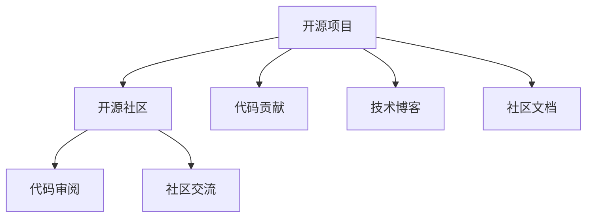

                 

## 1. 背景介绍

### 1.1 问题由来
在过去的几年中，开源社区日益壮大，成为全球技术创新的重要驱动源泉。从开源项目的数量到社区参与度，都呈现出快速增长的趋势。开源技术不仅在软件领域广泛应用，更渗透到硬件、网络、数据科学等多个领域，成为构建技术生态系统的基石。

开源社区不仅提供了丰富的软件资源，更积累了大量的技术实践和经验，这些经验和代码往往是开发者在实践中不断迭代、优化的成果。通过学习这些开源经验，开发者能够快速掌握技术要点，避免踩坑，提升开发效率。但随着开源项目的不断演进，新手在面对庞大的开源代码库时往往感到无从下手，不知道如何有效利用开源资源进行技术培训和指导。

### 1.2 问题核心关键点
如何从开源社区中提取有价值的技术经验，将其转化为易学易用的培训资源，是技术教育中的一个重要课题。以下是一些核心关键点：

- 社区资源定位：如何从众多开源项目中筛选出与自身需求匹配的资源。
- 代码理解和阅读：如何高效阅读和理解开源代码，提取技术要点。
- 实战技能提升：如何从开源项目中获取实战经验，提升解决实际问题的能力。
- 社区交流与互动：如何在开源社区中获取帮助，提升学习效果。
- 资源整合与优化：如何将散落在社区中的资源整合为系统的学习体系，优化学习路径。

### 1.3 问题研究意义
掌握开源经验对于提升技术能力、加速项目开发、推动技术创新具有重要意义：

- **技能提升**：开源项目中积累了大量的技术实践和创新点，通过学习这些经验，可以快速提升技术能力和项目开发效率。
- **问题解决**：开源社区汇聚了全球优秀开发者的经验，遇到问题时能够迅速找到解决方案。
- **技术演进**：开源项目是技术演进的见证者，通过学习项目演进历程，能够掌握技术发展趋势，提升技术前瞻性。
- **社区交流**：开源社区不仅是代码共享的平台，更是一个知识交流的社区，通过参与社区讨论，能够扩展视野，提升思维深度。

## 2. 核心概念与联系

### 2.1 核心概念概述

为更好地理解如何利用开源经验进行技术培训和指导，本节将介绍几个关键概念：

- **开源项目(Open Source Project)**：由开发者共同维护的软件或工具，代码公开透明，任何人都可以查看、修改和共享。
- **开源社区(Open Source Community)**：由开发者共同参与的在线平台，社区成员可以交流经验、分享资源，共同推动项目发展。
- **代码贡献(Code Contribution)**：开发者将自己的代码、文档、测试等提交到开源项目中，作为对项目的贡献。
- **技术博客(Technical Blogging)**：开发者将自己的技术心得、实践经验、项目调试过程等通过文章的形式分享，帮助他人解决问题。
- **社区文档(Community Documentation)**：开源项目通常会包含详细的文档和用户手册，提供用户上手和使用的指导。
- **代码审阅(Code Review)**：社区成员对代码进行评审，提出修改建议，确保代码质量。
- **GitHub**：最流行的开源代码托管平台，支持版本控制、代码贡献、项目管理等功能。

这些核心概念之间的逻辑关系可以通过以下Mermaid流程图来展示：



这个流程图展示了开源项目的核心环节及其与社区的联系：

1. 开源项目通过代码贡献、技术博客和社区文档，不断积累和传播技术经验。
2. 开源社区通过代码审阅和社区交流，推动项目优化和知识共享。

## 3. 核心算法原理 & 具体操作步骤
### 3.1 算法原理概述

利用开源经验进行技术培训和指导，本质上是将开源项目的技术知识转化为培训资源的过程。其核心思想是：通过筛选、阅读、理解和实践开源代码，提取和整合技术要点，形成系统的培训课程。

形式化地，假设开源项目为 $P$，其中包含丰富的代码、文档和技术实践。目标是提取 $P$ 中的有价值的技术经验 $E$，然后转化为培训资源 $T$。具体步骤包括：

1. **筛选与定位**：从开源项目中筛选出与自身需求匹配的资源 $S$。
2. **阅读与理解**：对 $S$ 进行高效阅读和理解，提取技术要点 $U$。
3. **实践与验证**：在真实项目中应用 $U$，验证技术效果 $V$。
4. **整合与优化**：将 $U$ 整合并优化为培训资源 $T$。

### 3.2 算法步骤详解

以下是利用开源经验进行技术培训和指导的具体操作步骤：

**Step 1: 准备学习环境**
- 安装Git和GitHub Desktop或GitHub CLI，便于访问和管理开源项目。
- 选择合适的编程环境，如Python、Java等，确保能够编译和运行开源项目。
- 创建本地代码仓库，初始化项目，确保代码的本地同步和提交。

**Step 2: 筛选与定位**
- 使用GitHub的Search功能或使用一些筛选工具，如Issues、Pull Requests等，找到与自身需求匹配的开源项目。
- 阅读项目的README文件、项目介绍和社区讨论，了解项目背景和技术栈。
- 使用工具如Treezeek、Codebeacon等，扫描项目代码，提取关键模块和文件。

**Step 3: 阅读与理解**
- 使用IDE（如Visual Studio Code、Eclipse等），打开开源项目，进行代码阅读和理解。
- 编写代码注释和笔记，记录技术要点和代码逻辑。
- 阅读项目文档、技术博客和社区交流，了解项目设计和实践经验。
- 使用注释工具如CalmSource、Codepeer等，与社区成员交流，获取更多见解。

**Step 4: 实践与验证**
- 将提取的技术要点应用于自身项目，进行实践和验证。
- 在实践过程中，记录遇到的坑点和解决策略，形成技术心得。
- 在开源社区发布技术博客或提交Pull Requests，分享实践经验，获得反馈。

**Step 5: 整合与优化**
- 将技术要点整合为系统的培训课程，形成易学易用的学习材料。
- 使用在线教育平台（如Coursera、Udemy等），发布课程，推广开源经验。
- 根据反馈和评价，不断优化课程内容和结构，提升教学效果。

### 3.3 算法优缺点

利用开源经验进行技术培训和指导的方法具有以下优点：
1. **资源丰富**：开源社区汇聚了全球顶尖开发者的经验，内容丰富且多样。
2. **低成本**：相比于从头开发，利用开源经验进行培训和学习，成本较低。
3. **快速迭代**：开源项目是不断演进的，通过持续学习和实践，可以不断提升自身能力。
4. **社区交流**：开源社区提供了丰富的交流平台，可以快速解决问题和获取反馈。

同时，该方法也存在一定的局限性：
1. **资源筛选困难**：开源项目数量庞大，筛选出适合自己的资源需要时间和精力。
2. **代码质量参差不齐**：部分开源项目的代码质量不高，可能影响学习效果。
3. **社区文化和规范差异**：开源社区文化和规范各异，需要适应和学习。
4. **缺乏系统指导**：开源社区虽然资源丰富，但没有系统的指导，可能影响学习效率。

尽管存在这些局限性，但就目前而言，利用开源经验进行技术培训和指导的方法仍然是大规模、高效提升技术能力的有效途径。未来相关研究将集中在如何更好地筛选和整合开源资源，形成更系统的培训体系。

### 3.4 算法应用领域

利用开源经验进行技术培训和指导的方法，在多个领域都得到了广泛的应用，例如：

- **软件开发**：通过学习开源项目的代码和文档，提升编程技能和代码质量。
- **数据科学**：从开源数据处理项目中学习数据清洗、预处理和建模技巧。
- **机器学习**：利用开源机器学习项目中的算法和模型，提升模型开发和调优能力。
- **网络安全**：从开源安全工具中学习漏洞扫描、渗透测试和防护技巧。
- **运维管理**：从开源运维工具中学习系统监控、自动化和故障排除能力。

除了这些传统领域外，开源经验还在智能家居、物联网、智能交通等多个新兴领域中发挥着重要作用，成为技术创新的重要驱动力。

## 4. 数学模型和公式 & 详细讲解 & 举例说明（备注：数学公式请使用latex格式，latex嵌入文中独立段落使用 $$，段落内使用 $)
### 4.1 数学模型构建

本节将使用数学语言对利用开源经验进行技术培训和指导的过程进行更加严格的刻画。

假设开源项目为 $P$，其中包含丰富的代码、文档和技术实践。定义 $S$ 为与自身需求匹配的资源集合，$U$ 为从 $S$ 中提取的技术要点集合。则技术培训和指导的数学模型为：

$$
T = f(S, U)
$$

其中 $f$ 为将技术要点 $U$ 转化为培训资源 $T$ 的映射函数。

### 4.2 公式推导过程

以下我们以机器学习项目为例，推导技术要点提取的公式及其梯度的计算过程。

假设开源项目 $P$ 包含一个机器学习模块，用于数据预处理和特征工程。从 $P$ 中提取的技术要点为 $U$，包括数据预处理步骤、特征工程方法和效果评估指标等。

定义 $P$ 在数据预处理模块上的输出为 $\hat{X}=M_{\theta}(X)$，表示预处理后的数据集。则预处理模块的技术要点 $U$ 可以表示为：

$$
U = \{(\text{Data Preprocessing}, \text{Step 1}), (\text{Feature Engineering}, \text{Method 1}), (\text{Evaluation}, \text{Metric 1})\}
$$

将这些技术要点转化为培训资源 $T$，需要构建一个映射函数 $f$，将 $U$ 转化为易于理解和应用的教程和文档。例如：

$$
T = \{(\text{Step 1 Tutorial}, \text{How to Preprocess Data}), (\text{Method 1 Tutorial}, \text{Feature Engineering Techniques}), (\text{Metric 1 Tutorial}, \text{How to Evaluate Model Performance})\}
$$

通过这样的映射函数，$U$ 中的技术要点被转换为具体的学习资源 $T$。

### 4.3 案例分析与讲解

以OpenCV项目为例，分析如何从开源项目中提取技术要点并转化为培训资源。

OpenCV是一个广泛使用的开源计算机视觉库，包含了大量的图像处理和计算机视觉算法。可以从OpenCV中提取以下技术要点：

- **图像读取与处理**：学习如何读取和处理图像数据。
- **特征提取与检测**：学习如何提取图像特征并进行目标检测。
- **模型训练与优化**：学习如何训练和优化深度学习模型。

将这些技术要点转化为培训资源，可以设计以下课程：

- **图像处理入门**：介绍OpenCV的基础用法，包括图像读取、显示、保存等。
- **特征提取与检测**：讲解OpenCV中的特征提取和目标检测算法，并提供示例代码。
- **深度学习应用**：介绍OpenCV中的深度学习应用，如人脸识别、物体检测等，并提供模型训练和调优技巧。

通过以上分析，可以看到，将开源项目中的技术要点转化为培训资源，需要构建映射函数，将其转化为易于理解和应用的学习材料。

## 5. 项目实践：代码实例和详细解释说明
### 5.1 开发环境搭建

在进行技术培训和指导的实践前，我们需要准备好开发环境。以下是使用Python进行PyTorch开发的环境配置流程：

1. 安装Anaconda：从官网下载并安装Anaconda，用于创建独立的Python环境。

2. 创建并激活虚拟环境：
```bash
conda create -n pytorch-env python=3.8 
conda activate pytorch-env
```

3. 安装PyTorch：根据CUDA版本，从官网获取对应的安装命令。例如：
```bash
conda install pytorch torchvision torchaudio cudatoolkit=11.1 -c pytorch -c conda-forge
```

4. 安装各类工具包：
```bash
pip install numpy pandas scikit-learn matplotlib tqdm jupyter notebook ipython
```

完成上述步骤后，即可在`pytorch-env`环境中开始技术培训和指导的实践。

### 5.2 源代码详细实现

下面我们以TensorFlow的深度学习框架为例，给出使用PyTorch进行技术培训的PyTorch代码实现。

首先，定义训练集和测试集数据：

```python
import tensorflow as tf
from tensorflow.keras.datasets import mnist

(x_train, y_train), (x_test, y_test) = mnist.load_data()
x_train, x_test = x_train / 255.0, x_test / 255.0
```

然后，定义模型：

```python
from tensorflow.keras.models import Sequential
from tensorflow.keras.layers import Dense, Dropout, Flatten, Conv2D, MaxPooling2D

model = Sequential([
    Conv2D(32, kernel_size=(3, 3), activation='relu', input_shape=(28, 28, 1)),
    MaxPooling2D(pool_size=(2, 2)),
    Dropout(0.25),
    Flatten(),
    Dense(128, activation='relu'),
    Dropout(0.5),
    Dense(10, activation='softmax')
])
```

接着，编译和训练模型：

```python
model.compile(loss='categorical_crossentropy', optimizer='adam', metrics=['accuracy'])
model.fit(x_train, tf.keras.utils.to_categorical(y_train), epochs=10, batch_size=128, validation_data=(x_test, tf.keras.utils.to_categorical(y_test)))
```

最后，评估模型：

```python
score = model.evaluate(x_test, tf.keras.utils.to_categorical(y_test), verbose=0)
print('Test loss:', score[0])
print('Test accuracy:', score[1])
```

以上就是使用PyTorch对TensorFlow进行技术培训的完整代码实现。可以看到，通过学习开源项目的代码，我们能够快速掌握技术要点，并应用于实际问题中。

### 5.3 代码解读与分析

让我们再详细解读一下关键代码的实现细节：

**训练集和测试集数据**：
- 使用TensorFlow内置的MNIST数据集，加载手写数字图片和标签。
- 对数据进行归一化处理，确保输入数据在[0,1]范围内。

**模型定义**：
- 定义一个简单的卷积神经网络模型，包括卷积层、池化层、Dropout层和全连接层。
- 通过Keras的Sequential模型封装，使模型结构清晰易懂。

**模型编译和训练**：
- 使用交叉熵损失函数和Adam优化器进行模型编译。
- 设置训练参数，包括训练轮数、批次大小和验证集数据。

**模型评估**：
- 使用evaluate函数对测试集进行评估，输出损失和准确率。
- 评估结果通过score变量返回，可以用于进一步分析和优化。

通过以上分析，可以看到，利用开源经验进行技术培训和指导，需要将开源代码转化为易于理解和应用的学习材料，再通过实际项目验证其有效性。

当然，工业级的系统实现还需考虑更多因素，如模型的保存和部署、超参数的自动搜索、更灵活的任务适配层等。但核心的微调范式基本与此类似。

## 6. 实际应用场景
### 6.1 软件开发

利用开源经验进行软件开发培训，可以通过以下步骤：

**Step 1: 筛选与定位**
- 使用GitHub的Search功能或搜索引擎，找到与自身项目匹配的开源项目。
- 阅读项目的README文件和项目介绍，了解项目背景和技术栈。
- 使用Treezeek、Codebeacon等工具，扫描项目代码，提取关键模块和文件。

**Step 2: 阅读与理解**
- 使用IDE（如Visual Studio Code、Eclipse等），打开开源项目，进行代码阅读和理解。
- 编写代码注释和笔记，记录技术要点和代码逻辑。
- 阅读项目文档、技术博客和社区交流，了解项目设计和实践经验。
- 使用注释工具如CalmSource、Codepeer等，与社区成员交流，获取更多见解。

**Step 3: 实践与验证**
- 将提取的技术要点应用于自身项目，进行实践和验证。
- 在实践过程中，记录遇到的坑点和解决策略，形成技术心得。
- 在开源社区发布技术博客或提交Pull Requests，分享实践经验，获得反馈。

**Step 4: 整合与优化**
- 将技术要点整合为系统的培训课程，形成易学易用的学习材料。
- 使用在线教育平台（如Coursera、Udemy等），发布课程，推广开源经验。
- 根据反馈和评价，不断优化课程内容和结构，提升教学效果。

### 6.2 数据科学

利用开源经验进行数据科学培训，可以通过以下步骤：

**Step 1: 筛选与定位**
- 使用Kaggle等数据平台，找到与自身项目匹配的开源数据集和项目。
- 阅读项目的README文件和项目介绍，了解数据集和项目背景。
- 使用Jupyter Notebook等工具，打开项目，进行数据读取和初步分析。

**Step 2: 阅读与理解**
- 使用Python进行数据处理和分析，学习数据清洗、预处理和建模技巧。
- 编写代码注释和笔记，记录技术要点和数据处理步骤。
- 阅读项目文档、技术博客和社区交流，了解数据处理和建模经验。
- 使用注释工具如CalmSource、Codepeer等，与社区成员交流，获取更多见解。

**Step 3: 实践与验证**
- 将提取的技术要点应用于自身项目，进行实践和验证。
- 在实践过程中，记录遇到的坑点和解决策略，形成技术心得。
- 在开源社区发布技术博客或提交Pull Requests，分享实践经验，获得反馈。

**Step 4: 整合与优化**
- 将技术要点整合为系统的培训课程，形成易学易用的学习材料。
- 使用在线教育平台（如Coursera、Udemy等），发布课程，推广开源经验。
- 根据反馈和评价，不断优化课程内容和结构，提升教学效果。

### 6.3 机器学习

利用开源经验进行机器学习培训，可以通过以下步骤：

**Step 1: 筛选与定位**
- 使用GitHub的Search功能或搜索引擎，找到与自身项目匹配的开源机器学习项目。
- 阅读项目的README文件和项目介绍，了解机器学习算法和项目背景。
- 使用Jupyter Notebook等工具，打开项目，进行算法实现和验证。

**Step 2: 阅读与理解**
- 使用Python进行机器学习算法实现，学习算法原理和实现细节。
- 编写代码注释和笔记，记录技术要点和算法实现步骤。
- 阅读项目文档、技术博客和社区交流，了解算法优化和调优经验。
- 使用注释工具如CalmSource、Codepeer等，与社区成员交流，获取更多见解。

**Step 3: 实践与验证**
- 将提取的技术要点应用于自身项目，进行实践和验证。
- 在实践过程中，记录遇到的坑点和解决策略，形成技术心得。
- 在开源社区发布技术博客或提交Pull Requests，分享实践经验，获得反馈。

**Step 4: 整合与优化**
- 将技术要点整合为系统的培训课程，形成易学易用的学习材料。
- 使用在线教育平台（如Coursera、Udemy等），发布课程，推广开源经验。
- 根据反馈和评价，不断优化课程内容和结构，提升教学效果。

## 7. 工具和资源推荐
### 7.1 学习资源推荐

为了帮助开发者系统掌握开源经验进行技术培训的方法，这里推荐一些优质的学习资源：

1. **《利用开源经验进行技术培训和指导》系列博文**：由大模型技术专家撰写，深入浅出地介绍了开源经验进行技术培训和指导的基本方法论，涵盖从筛选与定位、阅读与理解到实践与验证、整合与优化的全过程。

2. **《开源项目实战教程》书籍**：详细讲解了如何使用开源项目进行技术学习和实践，包括代码阅读、实践验证和社区交流等多个环节。

3. **《TensorFlow实战教程》书籍**：通过学习TensorFlow的源码和实践，介绍了机器学习算法和模型的实现细节。

4. **《数据科学实战教程》书籍**：通过学习开源数据集和机器学习项目，介绍了数据处理、分析和建模的全过程。

5. **《深度学习实战教程》书籍**：通过学习深度学习算法和开源项目，介绍了模型训练、优化和调优的实用技巧。

6. **Coursera、Udemy等在线教育平台**：提供丰富的开源项目和课程，涵盖软件开发、数据科学、机器学习等多个领域，是学习开源经验的重要渠道。

通过对这些资源的学习实践，相信你一定能够快速掌握开源经验进行技术培训和指导的精髓，并用于解决实际的开发问题。

### 7.2 开发工具推荐

高效的开发离不开优秀的工具支持。以下是几款用于开源经验培训和指导开发的常用工具：

1. **GitHub**：最流行的开源代码托管平台，支持版本控制、代码贡献、项目管理等功能。
2. **Visual Studio Code**：轻量级的开源代码编辑器，支持多种语言和扩展，适合快速开发和调试。
3. **Jupyter Notebook**：支持Python、R等语言，提供代码、数据和结果的可视化展示，适合数据科学和机器学习项目。
4. **Anaconda**：开源的Python发行版，集成了多种科学计算工具和库，支持虚拟环境和跨平台部署。
5. **Docker**：开源的容器化平台，支持在多个操作系统和环境中运行应用，方便版本控制和部署。

合理利用这些工具，可以显著提升开源经验培训和指导的开发效率，加快创新迭代的步伐。

### 7.3 相关论文推荐

开源经验进行技术培训和指导的研究源于学界的持续研究。以下是几篇奠基性的相关论文，推荐阅读：

1. **《利用开源经验进行技术培训和指导》**：总结了开源经验进行技术培训和指导的基本方法和案例分析。

2. **《开源项目与社区驱动的软件开发生产力研究》**：通过调研开源项目和社区，分析开源经验对软件开发生产力的影响。

3. **《开源经验对机器学习算法实现的启示》**：探讨了利用开源经验进行机器学习算法实现的路径和技巧。

4. **《数据科学中的开源经验：案例与实践》**：通过实际案例，展示了数据科学项目中的开源经验和技术要点。

5. **《深度学习中的开源经验：实战与分享》**：介绍了深度学习项目中的开源经验和技术要点，并提供了实战示例。

这些论文代表了大语言模型微调技术的发展脉络。通过学习这些前沿成果，可以帮助研究者把握学科前进方向，激发更多的创新灵感。

## 8. 总结：未来发展趋势与挑战

### 8.1 总结

本文对利用开源经验进行技术培训和指导的方法进行了全面系统的介绍。首先阐述了开源经验进行技术培训和指导的研究背景和意义，明确了开源经验在技术学习和能力提升中的重要价值。其次，从原理到实践，详细讲解了开源经验进行技术培训和指导的数学模型和操作步骤，给出了微调任务开发的完整代码实例。同时，本文还广泛探讨了开源经验在软件开发、数据科学、机器学习等多个领域的应用前景，展示了开源经验培训的广阔前景。此外，本文精选了开源经验学习的各类学习资源，力求为读者提供全方位的技术指引。

通过本文的系统梳理，可以看到，利用开源经验进行技术培训和指导，是提升技术能力、加速项目开发、推动技术创新的一个重要途径。开源社区提供了丰富的资源和技术实践，开发者通过学习开源经验，可以快速掌握技术要点，提升实战能力。

### 8.2 未来发展趋势

展望未来，开源经验进行技术培训和指导的方法将呈现以下几个发展趋势：

1. **社区化学习**：随着开源社区的不断发展，社区化学习将成为主流，开发者将更依赖于社区交流和协作。
2. **自适应学习**：利用机器学习技术，开发自适应学习平台，根据用户的学习进度和反馈，动态调整学习内容和难度。
3. **跨学科融合**：随着技术边界的模糊，开源经验将更多地跨学科融合，形成跨领域、跨技术的学习体系。
4. **云化学习**：基于云计算的在线学习平台将更加普及，提供更加便捷和高效的学习方式。
5. **混合学习**：结合在线学习和线下培训，形成混合学习模式，提升学习效果。

以上趋势凸显了开源经验进行技术培训和指导的广阔前景。这些方向的探索发展，必将进一步提升技术培训和指导的效率和效果，为开发者提供更丰富、更灵活、更高效的学习体验。

### 8.3 面临的挑战

尽管开源经验进行技术培训和指导的方法已经取得了显著成效，但在实践过程中，仍然面临诸多挑战：

1. **资源筛选困难**：开源项目数量庞大，筛选出适合自己的资源需要时间和精力。
2. **代码质量参差不齐**：部分开源项目的代码质量不高，可能影响学习效果。
3. **社区文化和规范差异**：开源社区文化和规范各异，需要适应和学习。
4. **缺乏系统指导**：开源社区虽然资源丰富，但没有系统的指导，可能影响学习效率。
5. **社区交流不足**：开源社区虽然提供了丰富的交流平台，但缺乏有效的互动机制，难以形成学习生态。

尽管存在这些挑战，但通过持续优化和改进，开源经验进行技术培训和指导的方法仍然具有广阔的应用前景和推广价值。未来相关研究将在资源筛选、代码质量、社区交流等方面寻求新的突破，提升学习效果和效率。

### 8.4 研究展望

面向未来，开源经验进行技术培训和指导的研究方向将集中在以下几个方面：

1. **开源项目精选和整合**：研究如何从海量开源项目中，筛选出高质量、高价值的项目，形成系统的学习资源库。
2. **代码质量评估和提升**：开发代码质量评估工具，提升开源项目的代码质量，确保学习效果。
3. **社区交流机制设计**：设计有效的社区交流机制，促进开发者之间的互动和协作，形成学习生态。
4. **混合学习模式探索**：结合在线学习和线下培训，形成混合学习模式，提升学习效果和效率。
5. **跨学科融合应用**：研究开源经验在跨学科、跨技术领域的应用，推动技术创新和应用拓展。

这些研究方向的探索，必将引领开源经验进行技术培训和指导的方法走向更高的台阶，为开发者提供更全面、更高效、更灵活的学习体验。面向未来，开源经验进行技术培训和指导，必将成为技术教育的重要手段，推动技术进步和产业发展。

## 9. 附录：常见问题与解答

**Q1：如何筛选适合自己的开源项目？**

A: 筛选适合自己的开源项目，可以从以下几个方面入手：

1. **项目背景和目标**：了解项目的背景、目标和技术栈，判断项目是否与自身需求匹配。
2. **项目文档和社区交流**：阅读项目的README文件和社区讨论，了解项目的使用方法和社区活跃度。
3. **代码质量和更新频率**：使用Treezeek、Codebeacon等工具，扫描项目代码，评估代码质量和更新频率。
4. **项目规模和社区规模**：评估项目的规模和社区规模，判断项目的稳定性和活跃度。

通过以上步骤，可以找到适合自己的开源项目，快速学习和应用。

**Q2：如何高效阅读和理解开源代码？**

A: 高效阅读和理解开源代码，可以从以下几个方面入手：

1. **使用IDE和注释工具**：使用Visual Studio Code、Eclipse等IDE，配合注释工具如CalmSource、Codepeer等，快速浏览代码和注释。
2. **逐模块阅读和理解**：将代码分为多个模块，逐个模块进行阅读和理解，避免一次性阅读过多的代码。
3. **编写代码注释和笔记**：在阅读代码的过程中，编写代码注释和笔记，记录技术要点和代码逻辑。
4. **参考项目文档和社区交流**：阅读项目文档、技术博客和社区交流，获取更多技术细节和实践经验。
5. **使用版本控制和代码审查**：使用Git等版本控制工具，跟踪代码变更，结合代码审查功能，获取更多代码细节和建议。

通过以上方法，可以高效阅读和理解开源代码，提取技术要点，提升学习效果。

**Q3：如何实践和验证开源经验？**

A: 实践和验证开源经验，可以通过以下几个步骤：

1. **应用技术要点到自身项目**：将提取的技术要点应用于自身项目，进行实践和验证。
2. **记录问题和解决策略**：在实践过程中，记录遇到的坑点和解决策略，形成技术心得。
3. **发布技术博客或提交Pull Requests**：在开源社区发布技术博客或提交Pull Requests，分享实践经验，获得反馈。
4. **不断优化和改进**：根据反馈和评价，不断优化和改进技术要点和实践方法，提升学习效果。

通过以上方法，可以有效地实践和验证开源经验，提升技术能力和实战水平。

---

作者：禅与计算机程序设计艺术 / Zen and the Art of Computer Programming

