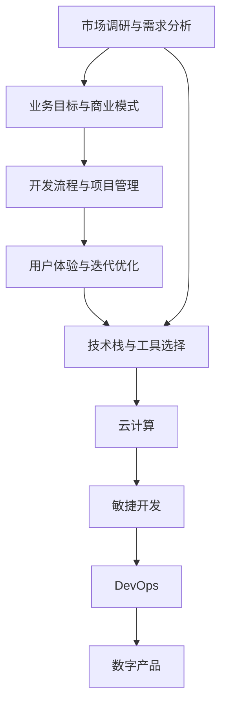

                 

# 利用技术能力创建数字产品

在数字化转型的浪潮下，越来越多的企业和技术团队意识到，利用技术能力创建数字产品，不仅能够开辟新的市场空间，还能大幅提升企业的竞争力和创新力。本文将系统探讨如何利用技术能力创建数字产品，从背景介绍、核心概念、算法原理、实践指南、应用场景、资源推荐、未来趋势和挑战等角度进行深入解析，旨在为技术团队提供全面的指导，帮助他们成功实现技术创新与商业化的结合。

## 1. 背景介绍

### 1.1 问题由来

数字化转型已成为当今企业战略的核心。随着互联网、云计算、大数据、人工智能等技术的飞速发展，技术团队被赋予了更多创造数字产品的任务。企业希望通过数字化产品，实现业务模式创新，提升运营效率，开拓新的市场机会。

然而，很多技术团队在创建数字产品时，常常面临一些问题：
- 缺乏全面的市场调研和用户需求分析。
- 缺乏明确的业务目标和产品定位。
- 缺乏系统化的产品开发流程和项目管理方法。
- 缺乏合适的技术栈和开发工具。

这些问题如果不加以解决，可能会影响数字产品的成功开发和市场表现。因此，本文旨在通过系统化的方法，帮助技术团队克服这些挑战，成功创建具有市场竞争力的数字产品。

### 1.2 问题核心关键点

成功创建数字产品，需要关注以下几个核心关键点：
- **市场调研与需求分析**：了解目标用户和市场环境，明确产品定位和需求。
- **业务目标与商业模式**：设定明确的业务目标和商业模式，确保产品的市场可行性和可持续性。
- **开发流程与项目管理**：采用敏捷开发、DevOps等现代项目管理方法，提升产品开发效率和质量。
- **技术栈与工具选择**：根据产品需求，选择合适的技术栈和开发工具，保障开发效率和产品质量。
- **用户体验与迭代优化**：注重用户体验设计，通过迭代优化提升产品的市场接受度。

这些关键点共同构成了一个成功的数字产品开发框架，有助于技术团队在实际工作中高效地应对各种挑战。

## 2. 核心概念与联系

### 2.1 核心概念概述

为了更好地理解如何利用技术能力创建数字产品，本文将介绍以下几个核心概念：

- **数字产品(Digital Product)**：指利用技术手段开发出来的，能够满足用户需求、提升企业价值的软件产品。
- **敏捷开发(Agile Development)**：一种以用户需求为核心，强调快速迭代和持续改进的开发方法。
- **DevOps(Development Operations)**：将软件开发和运维整合为一个持续交付的过程，强调自动化和持续集成。
- **用户体验设计(User Experience Design, UXD)**：通过用户研究、设计原型、用户测试等手段，提升产品的用户体验。
- **技术栈(Technology Stack)**：指开发数字产品所需的技术和工具的组合，如前端框架、后端语言、数据库等。
- **云计算(Cloud Computing)**：通过互联网提供按需计算资源，支持数字产品的开发、部署和管理。

这些核心概念之间存在紧密的联系，共同构成了数字产品开发的全流程。理解这些概念及其相互关系，有助于技术团队系统化地推进数字产品开发工作。

### 2.2 核心概念原理和架构的 Mermaid 流程图



这个流程图展示了从市场调研到数字产品开发的全流程，以及各阶段之间的联系。市场调研与需求分析是产品开发的起点，业务目标与商业模式是产品开发的指导，用户体验与迭代优化是产品开发的重点，技术栈与工具选择是产品开发的基础，云计算提供支撑，敏捷开发和DevOps则贯穿始终。

## 3. 核心算法原理 & 具体操作步骤

### 3.1 算法原理概述

数字产品的开发和优化过程，实际上是一个数据驱动的算法优化过程。基于市场需求和用户反馈，通过不断的迭代和优化，实现产品的不断提升。这一过程可以分为以下几个步骤：

1. **市场调研与需求分析**：通过问卷调查、用户访谈、市场分析等手段，了解用户需求和市场趋势。
2. **业务目标与商业模式**：根据调研结果，设定产品的业务目标和商业模式，明确产品的发展方向和盈利模式。
3. **用户体验设计**：设计符合用户需求的用户界面和交互流程，提升产品的用户体验。
4. **敏捷开发与迭代优化**：采用敏捷开发方法，快速迭代产品原型，根据用户反馈进行迭代优化。
5. **技术栈与工具选择**：根据产品需求，选择合适的技术栈和开发工具，保障开发效率和产品质量。
6. **云计算与DevOps**：利用云计算资源和DevOps方法，保障产品的快速部署和持续交付。

### 3.2 算法步骤详解

以下是对上述步骤的详细讲解：

#### 步骤1：市场调研与需求分析

市场调研与需求分析是数字产品开发的起点，通过了解用户需求和市场环境，明确产品的定位和需求。

**步骤详解**：
1. **定义调研目标**：明确调研的业务目标和用户群体，如用户体验、市场趋势、竞争对手分析等。
2. **选择调研方法**：根据调研目标，选择合适的调研方法，如问卷调查、用户访谈、用户测试等。
3. **数据收集与分析**：通过调研方法收集数据，并进行分析，得出用户需求和市场趋势。
4. **需求分析与需求文档**：根据调研结果，分析用户需求和市场趋势，撰写需求文档。

#### 步骤2：业务目标与商业模式

业务目标与商业模式是数字产品开发的指导，设定明确的业务目标和商业模式，确保产品的市场可行性和可持续性。

**步骤详解**：
1. **设定业务目标**：根据市场需求，设定产品的业务目标，如提高市场份额、提升用户体验、增加收入等。
2. **制定商业模式**：根据业务目标，制定产品的商业模式，如订阅模式、广告模式、交易模式等。
3. **制定关键指标(KPI)**：设定关键指标(KPI)，用于衡量产品的市场表现和用户满意度。
4. **撰写业务文档**：将业务目标、商业模式和KPI写入业务文档，作为产品开发的指导。

#### 步骤3：用户体验设计

用户体验设计是数字产品开发的重点，通过设计符合用户需求的用户界面和交互流程，提升产品的用户体验。

**步骤详解**：
1. **用户研究**：通过用户访谈、问卷调查、用户测试等手段，了解用户需求和使用场景。
2. **设计原型**：根据用户研究结果，设计用户界面和交互流程，使用设计工具如Sketch、Figma等。
3. **用户测试**：将原型交付给用户进行测试，收集用户反馈。
4. **迭代优化**：根据用户反馈，对原型进行迭代优化，提升用户体验。

#### 步骤4：敏捷开发与迭代优化

敏捷开发与迭代优化是数字产品开发的核心，采用敏捷开发方法，快速迭代产品原型，根据用户反馈进行迭代优化。

**步骤详解**：
1. **制定迭代计划**：根据业务目标和用户需求，制定迭代计划，设定每个迭代的目标和任务。
2. **开发与测试**：按照迭代计划进行开发，并定期进行测试，确保代码质量和性能。
3. **用户反馈**：收集用户对原型的反馈，并据此进行优化。
4. **迭代发布**：每个迭代完成后，发布新版本，供用户测试使用。

#### 步骤5：技术栈与工具选择

技术栈与工具选择是数字产品开发的基础，根据产品需求，选择合适的技术栈和开发工具，保障开发效率和产品质量。

**步骤详解**：
1. **评估技术栈**：根据产品需求，评估各技术栈的优势和劣势。
2. **选择合适的技术栈**：根据评估结果，选择合适的技术栈，如React、Vue、Angular等。
3. **选择工具**：选择合适的开发工具，如Git、Jira、Slack等。
4. **编写文档**：撰写技术栈和工具的选择文档，确保团队成员理解并遵循。

#### 步骤6：云计算与DevOps

云计算与DevOps是数字产品开发的支撑，利用云计算资源和DevOps方法，保障产品的快速部署和持续交付。

**步骤详解**：
1. **选择合适的云平台**：根据产品需求，选择合适的云平台，如AWS、Azure、Google Cloud等。
2. **部署应用**：将产品部署到云平台，并进行测试。
3. **配置DevOps环境**：配置DevOps环境，包括自动化测试、持续集成、持续交付等。
4. **监控与优化**：监控产品性能，并根据监控结果进行优化。

### 3.3 算法优缺点

数字产品开发基于算法优化，具有以下优点：
1. **快速迭代**：通过快速迭代，快速响应市场变化，提升产品竞争力。
2. **用户反馈驱动**：以用户反馈为核心，持续优化产品，提升用户体验。
3. **数据驱动**：利用数据分析，指导产品开发，提升产品决策的科学性。

同时，数字产品开发也存在以下缺点：
1. **高成本**：开发和维护数字产品需要大量人力和资源投入。
2. **复杂度高**：数字产品开发涉及多个环节，复杂度高。
3. **风险大**：市场变化快，产品开发和市场表现的不确定性较大。

### 3.4 算法应用领域

数字产品开发技术广泛应用在多个领域，如：

- **电商**：电商网站、电商平台、移动应用等，帮助企业实现线上销售。
- **金融**：金融理财、在线支付、金融数据分析等，提升金融服务的效率和质量。
- **医疗**：在线医疗咨询、医疗数据分析、健康管理应用等，改善医疗服务体验。
- **教育**：在线教育平台、教育数据分析、智能教育应用等，提升教育质量。
- **游戏**：游戏开发、游戏数据分析、游戏社区等，提供丰富娱乐体验。
- **社交**：社交平台、社交数据分析、社交应用等，增强用户互动和粘性。

这些领域的应用展示了数字产品开发技术的强大生命力，为各行各业带来了新的商业机会和发展方向。

## 4. 数学模型和公式 & 详细讲解 & 举例说明

### 4.1 数学模型构建

数字产品开发涉及多个环节，可以抽象为一个基于用户需求的数据驱动优化过程。

设市场需求为 $D$，用户反馈为 $F$，产品设计为 $P$，产品迭代优化为 $I$。则数字产品开发的数学模型可以表示为：

$$ P = f(D, F, I) $$

其中，$f$ 表示产品优化函数，根据市场需求和用户反馈，通过迭代优化生成最终产品。

### 4.2 公式推导过程

以下是基于用户反馈的迭代优化公式推导过程：

1. **用户需求分析**：设用户需求为 $D_i$，根据调研结果，得到 $D_i$。
2. **用户反馈收集**：设用户反馈为 $F_i$，通过用户测试，收集用户反馈 $F_i$。
3. **产品迭代优化**：设产品优化函数为 $f$，根据用户反馈 $F_i$ 和市场需求 $D_i$，进行产品迭代优化，得到新的产品设计 $P_{i+1}$。
4. **迭代更新**：重复上述过程，不断迭代更新产品设计，直到收敛。

### 4.3 案例分析与讲解

以下是一个简化的案例分析：

假设我们要开发一款电商应用，需求为提供个性化推荐和在线支付功能。通过市场调研，我们发现用户对个性化推荐的需求很高。于是，我们将用户需求 $D_1 = \text{个性化推荐}$ 和在线支付 $D_2 = \text{在线支付}$ 输入产品优化函数 $f$，得到初步的产品设计 $P_1$。

通过用户测试，我们收集到部分用户反馈 $F_1 = \{ \text{推荐系统准确度低} \}$。根据用户反馈，我们进行产品迭代优化，得到新的产品设计 $P_2$。

重复上述过程，不断迭代更新产品设计，最终得到成熟的产品设计 $P_n$，满足市场需求和用户需求。

## 5. 项目实践：代码实例和详细解释说明

### 5.1 开发环境搭建

以下是一个简化的开发环境搭建流程：

1. **选择开发环境**：选择适当的开发环境，如Visual Studio、IntelliJ IDEA、PyCharm等。
2. **配置开发环境**：配置开发环境，包括安装编程语言、框架和工具等。
3. **版本控制**：使用Git等版本控制工具，管理代码版本。
4. **持续集成**：配置持续集成工具，如Jenkins、Travis CI等，自动化代码测试和构建。

### 5.2 源代码详细实现

以下是一个简化的源代码实现示例：

```python
from flask import Flask, request
import json

app = Flask(__name__)

@app.route('/recommend', methods=['POST'])
def recommend():
    data = request.get_json()
    user_id = data['user_id']
    query = data['query']
    
    # 个性化推荐算法
    recommendation = personalized_recommend(user_id, query)
    
    # 返回推荐结果
    return json.dumps({'recommendation': recommendation})

def personalized_recommend(user_id, query):
    # 个性化推荐算法实现
    # ...
    
    return recommendation
```

### 5.3 代码解读与分析

以上代码实现了一个简单的个性化推荐接口，通过用户ID和查询词，调用个性化推荐算法，返回推荐结果。

**代码解读**：
- 使用Flask框架，实现RESTful接口。
- 接收POST请求，解析JSON数据。
- 调用个性化推荐算法，生成推荐结果。
- 将推荐结果返回给客户端。

### 5.4 运行结果展示

运行上述代码，可以访问以下接口：

- `/recommend`：接收POST请求，返回个性化推荐结果。

## 6. 实际应用场景

### 6.1 电商场景

电商场景是数字产品开发的重要应用领域，通过数字产品开发，电商企业可以实现全渠道销售、精准营销、库存管理等功能。

**应用示例**：
- **个性化推荐**：利用推荐算法，根据用户历史行为和偏好，生成个性化推荐结果。
- **库存管理**：通过数据分析，优化库存管理，提升库存周转率。
- **在线支付**：实现便捷的在线支付功能，提升用户购买体验。

### 6.2 金融场景

金融场景是数字产品开发的重要应用领域，通过数字产品开发，金融企业可以实现在线理财、风险管理、智能投顾等功能。

**应用示例**：
- **风险管理**：利用风险评估算法，评估用户的风险承受能力，提供个性化的理财方案。
- **智能投顾**：通过智能投顾算法，根据用户需求和市场行情，提供投资建议。
- **在线理财**：实现便捷的在线理财功能，提升用户理财体验。

### 6.3 医疗场景

医疗场景是数字产品开发的重要应用领域，通过数字产品开发，医疗企业可以实现在线问诊、健康管理、医疗数据分析等功能。

**应用示例**：
- **在线问诊**：利用自然语言处理技术，实现在线问诊功能，提供便捷的医疗咨询服务。
- **健康管理**：通过健康数据分析，提供个性化的健康管理方案。
- **医疗数据分析**：利用数据分析技术，分析医疗数据，提供医疗决策支持。

### 6.4 未来应用展望

数字产品开发技术在未来将有更广阔的应用前景，具体展望如下：

1. **多模态融合**：利用多模态融合技术，实现语音、图像、文本等多种数据形式的综合处理和应用。
2. **人工智能嵌入**：将人工智能技术嵌入到产品开发中，实现智能推荐、智能客服、智能搜索等功能。
3. **区块链应用**：利用区块链技术，提升产品数据的安全性和可信度。
4. **物联网应用**：利用物联网技术，实现设备的互联互通，提升产品智能化水平。
5. **5G应用**：利用5G技术，实现产品的实时数据传输和处理，提升用户体验。

## 7. 工具和资源推荐

### 7.1 学习资源推荐

以下推荐一些优质的学习资源：

1. **《敏捷开发实践》**：介绍敏捷开发方法论和技术，帮助技术团队提升敏捷开发能力。
2. **《DevOps实践》**：介绍DevOps方法论和技术，帮助技术团队提升持续交付能力。
3. **《用户体验设计手册》**：介绍用户体验设计的原则和方法，帮助技术团队提升用户体验设计能力。
4. **《技术栈选择与优化》**：介绍如何选择和优化技术栈，提升技术栈的适应性和可维护性。
5. **《云计算基础》**：介绍云计算的概念和应用，帮助技术团队提升云平台的使用能力。

### 7.2 开发工具推荐

以下推荐一些常用的开发工具：

1. **Flask**：轻量级的Web框架，适用于快速开发RESTful接口。
2. **Django**：全栈Web框架，适用于大规模开发项目。
3. **Angular**：前端开发框架，适用于开发单页面应用。
4. **Vue**：前端开发框架，适用于开发渐进式Web应用。
5. **Jenkins**：持续集成工具，适用于自动化代码测试和构建。
6. **Git**：版本控制工具，适用于管理代码版本。

### 7.3 相关论文推荐

以下推荐一些重要的相关论文：

1. **《敏捷软件开发模式》**：介绍敏捷开发的方法论和技术。
2. **《DevOps实践指南》**：介绍DevOps的方法论和技术。
3. **《用户体验设计原则》**：介绍用户体验设计的原则和方法。
4. **《技术栈选择与优化》**：介绍如何选择和优化技术栈。
5. **《云计算基础》**：介绍云计算的概念和应用。

## 8. 总结：未来发展趋势与挑战

### 8.1 研究成果总结

本文从背景介绍、核心概念、算法原理、操作步骤、实际应用、资源推荐等多个角度，全面系统地探讨了如何利用技术能力创建数字产品。通过深入分析，本文得出以下研究成果：

1. **数字产品开发是一个数据驱动的算法优化过程**。通过市场调研与需求分析、业务目标与商业模式、用户体验设计、敏捷开发与迭代优化、技术栈与工具选择、云计算与DevOps等环节，系统化地推进数字产品开发。
2. **敏捷开发与迭代优化是数字产品开发的核心**。通过快速迭代和持续改进，不断优化产品，提升用户体验和市场竞争力。
3. **用户体验设计是数字产品开发的重点**。通过设计符合用户需求的用户界面和交互流程，提升产品的用户体验。
4. **技术栈与工具选择是数字产品开发的基础**。根据产品需求，选择合适的技术栈和开发工具，保障开发效率和产品质量。
5. **云计算与DevOps是数字产品开发的支撑**。利用云计算资源和DevOps方法，保障产品的快速部署和持续交付。

### 8.2 未来发展趋势

数字产品开发技术的未来发展趋势如下：

1. **多模态融合**：利用多模态融合技术，实现语音、图像、文本等多种数据形式的综合处理和应用。
2. **人工智能嵌入**：将人工智能技术嵌入到产品开发中，实现智能推荐、智能客服、智能搜索等功能。
3. **区块链应用**：利用区块链技术，提升产品数据的安全性和可信度。
4. **物联网应用**：利用物联网技术，实现设备的互联互通，提升产品智能化水平。
5. **5G应用**：利用5G技术，实现产品的实时数据传输和处理，提升用户体验。

### 8.3 面临的挑战

数字产品开发技术的未来发展仍面临以下挑战：

1. **高成本**：开发和维护数字产品需要大量人力和资源投入。
2. **复杂度高**：数字产品开发涉及多个环节，复杂度高。
3. **风险大**：市场变化快，产品开发和市场表现的不确定性较大。

### 8.4 研究展望

未来的研究应在以下几个方向进行探索：

1. **多模态融合**：利用多模态融合技术，实现语音、图像、文本等多种数据形式的综合处理和应用。
2. **人工智能嵌入**：将人工智能技术嵌入到产品开发中，实现智能推荐、智能客服、智能搜索等功能。
3. **区块链应用**：利用区块链技术，提升产品数据的安全性和可信度。
4. **物联网应用**：利用物联网技术，实现设备的互联互通，提升产品智能化水平。
5. **5G应用**：利用5G技术，实现产品的实时数据传输和处理，提升用户体验。

总之，数字产品开发技术具有广阔的应用前景，但也需要不断探索和优化，才能满足市场和用户的多样化需求。

## 9. 附录：常见问题与解答

**Q1：数字产品开发需要哪些核心技术？**

A: 数字产品开发需要以下核心技术：

1. **市场调研与需求分析**：通过问卷调查、用户访谈、市场分析等手段，了解用户需求和市场环境。
2. **业务目标与商业模式**：根据市场需求，设定产品的业务目标和商业模式，明确产品的发展方向和盈利模式。
3. **用户体验设计**：通过用户研究、设计原型、用户测试等手段，提升产品的用户体验。
4. **敏捷开发与迭代优化**：采用敏捷开发方法，快速迭代产品原型，根据用户反馈进行迭代优化。
5. **技术栈与工具选择**：根据产品需求，选择合适的技术栈和开发工具，保障开发效率和产品质量。
6. **云计算与DevOps**：利用云计算资源和DevOps方法，保障产品的快速部署和持续交付。

**Q2：数字产品开发中，如何确保用户需求被满足？**

A: 确保用户需求被满足，可以采取以下措施：

1. **市场调研与需求分析**：通过问卷调查、用户访谈、市场分析等手段，了解用户需求和市场环境，明确产品的定位和需求。
2. **用户体验设计**：通过用户研究、设计原型、用户测试等手段，设计符合用户需求的用户界面和交互流程，提升产品的用户体验。
3. **敏捷开发与迭代优化**：采用敏捷开发方法，快速迭代产品原型，根据用户反馈进行迭代优化，确保产品不断提升用户体验。
4. **持续用户反馈**：通过用户反馈机制，持续收集用户意见，及时调整产品设计和功能，确保用户需求得到满足。

**Q3：数字产品开发中，如何确保产品质量？**

A: 确保产品质量，可以采取以下措施：

1. **测试驱动开发(TDD)**：通过编写测试用例，确保代码质量。
2. **持续集成(CI)**：通过持续集成工具，自动化代码测试和构建，确保代码质量。
3. **代码审查(Code Review)**：通过代码审查机制，发现和修正代码中的错误和问题，提升代码质量。
4. **DevOps方法**：通过DevOps方法，实现自动化运维和部署，保障产品的稳定性和性能。

**Q4：数字产品开发中，如何提升用户体验？**

A: 提升用户体验，可以采取以下措施：

1. **用户体验设计(UXD)**：通过用户研究、设计原型、用户测试等手段，设计符合用户需求的用户界面和交互流程，提升产品的用户体验。
2. **快速迭代**：采用敏捷开发方法，快速迭代产品原型，根据用户反馈进行迭代优化，确保产品不断提升用户体验。
3. **多渠道支持**：通过多种渠道支持用户使用产品，如Web、iOS、Android等，提升用户使用便利性。
4. **持续优化**：通过持续优化产品设计和功能，提升产品的用户体验。

**Q5：数字产品开发中，如何选择合适的技术栈？**

A: 选择合适的技术栈，可以采取以下措施：

1. **需求分析**：根据产品需求，分析技术栈的优势和劣势，选择最适合的技术栈。
2. **行业调研**：调研行业内常用的技术栈，借鉴行业最佳实践，选择最适合的技术栈。
3. **社区支持**：选择有广泛社区支持的技术栈，便于获取技术支持和资源。
4. **技术成熟度**：选择技术成熟度高的技术栈，降低技术风险。

---

作者：禅与计算机程序设计艺术 / Zen and the Art of Computer Programming

