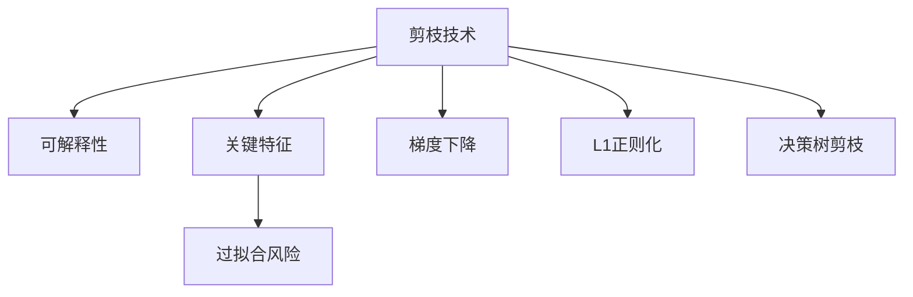

                 

# 剪枝技术对模型可解释性的影响

## 1. 背景介绍

### 1.1 问题由来
随着深度学习技术的不断发展，模型在医疗、金融、法律等关键领域的部署变得越来越广泛。然而，深度学习模型的黑盒特性使得其输出结果难以解释，这不仅限制了模型的应用范围，也增加了模型的使用风险。

在医疗领域，医生需要能够理解模型的诊断依据和推理过程，才能更好地信任模型并应用其提供的结果。在金融领域，投资者需要了解模型的决策依据，才能评估其可靠性和风险。在法律领域，司法机关需要理解模型的判别依据，才能判断其公平性和适用性。

为了提升深度学习模型的可解释性，剪枝（Pruning）技术应运而生。剪枝技术通过移除模型中冗余或无关的参数，既减小了模型规模，又保留了关键特征，使模型的决策过程更加透明和可解释。

### 1.2 问题核心关键点
- 剪枝技术：通过移除模型中不重要的参数，减小模型规模，提高推理速度和模型可解释性。
- 可解释性：模型输出结果的透明性和可理解性，对于关键领域的应用至关重要。
- 关键特征：模型中对决策结果有重要影响的参数和结构。
- 过拟合风险：剪枝过程中需要避免去除关键特征，导致模型泛化性能下降。

### 1.3 问题研究意义
提升深度学习模型的可解释性，有助于其在医疗、金融、法律等关键领域的应用。剪枝技术通过移除模型中不重要的参数，保留了关键特征，提高了模型的可解释性和可靠性，为模型在实际应用中的安全性奠定了基础。

## 2. 核心概念与联系

### 2.1 核心概念概述

为了更好地理解剪枝技术对模型可解释性的影响，本节将介绍几个密切相关的核心概念：

- 剪枝（Pruning）：通过移除模型中不重要的参数，减小模型规模，提高推理速度和模型可解释性。
- 可解释性（Explainability）：模型输出结果的透明性和可理解性，对于关键领域的应用至关重要。
- 关键特征（Critical Features）：模型中对决策结果有重要影响的参数和结构。
- 过拟合风险（Overfitting Risk）：剪枝过程中需要避免去除关键特征，导致模型泛化性能下降。
- 梯度下降（Gradient Descent）：优化算法的一种，用于最小化损失函数，更新模型参数。
- L1正则化（L1 Regularization）：通过引入L1范数惩罚，促使参数向零靠近，实现模型压缩。
- 决策树剪枝（Decision Tree Pruning）：通过剪枝决策树，提高决策树的泛化性能。

这些核心概念之间的逻辑关系可以通过以下Mermaid流程图来展示：



这个流程图展示了大语言模型的核心概念及其之间的关系：

1. 剪枝技术通过移除模型中不重要的参数，提高模型可解释性。
2. 关键特征是模型中对决策结果有重要影响的参数和结构。
3. 过拟合风险是剪枝过程中需要避免去除关键特征，导致模型泛化性能下降。
4. 梯度下降和L1正则化是常用的剪枝方法。
5. 决策树剪枝是另一种有效的剪枝技术。

这些概念共同构成了剪枝技术的理论和实践框架，使其能够在实际应用中发挥强大的作用。通过理解这些核心概念，我们可以更好地把握剪枝技术的工作原理和优化方向。

## 3. 核心算法原理 & 具体操作步骤
### 3.1 算法原理概述

剪枝技术通过移除模型中不重要的参数，减小模型规模，提高推理速度和模型可解释性。其核心思想是：通过评估模型中每个参数的重要性，移除对决策结果影响较小的参数，保留对决策结果有重要影响的参数和结构。

剪枝技术可以应用于各种深度学习模型，如神经网络、卷积神经网络、循环神经网络等。剪枝方法可以分为结构化剪枝和非结构化剪枝，前者通过修改模型结构来移除冗余参数，后者通过调整模型参数权重来减小模型规模。

### 3.2 算法步骤详解

剪枝算法通常包括以下几个关键步骤：

**Step 1: 评估模型参数的重要性**
- 计算每个参数的权重或梯度值，评估其对模型输出的影响。
- 根据权重或梯度值的大小，将参数排序，选出对模型输出有重要影响的参数。

**Step 2: 移除冗余参数**
- 根据Step 1中筛选出的关键参数，移除对模型输出影响较小的参数。
- 移除参数后，重新训练模型，确保新模型在保留关键特征的同时，具有更好的泛化性能。

**Step 3: 验证新模型性能**
- 在新模型上验证其性能，确保剪枝后模型的性能不低于原始模型。
- 对新模型进行可解释性分析，验证其可解释性是否得到提升。

### 3.3 算法优缺点

剪枝技术具有以下优点：
- 减小模型规模：移除冗余参数，减小模型规模，提高推理速度。
- 提高模型可解释性：保留关键特征，提高模型输出结果的可解释性。
- 提高泛化性能：通过保留关键特征，提高模型的泛化性能。

同时，剪枝技术也存在一定的局限性：
- 过拟合风险：去除关键参数可能导致模型泛化性能下降。
- 复杂度高：评估模型参数重要性、移除冗余参数等操作较为复杂。
- 损失函数变化：移除参数后，模型输出结果可能发生变化，需要重新训练模型。

尽管存在这些局限性，但就目前而言，剪枝技术仍是提高模型可解释性的重要手段。未来相关研究的重点在于如何进一步降低剪枝过程中的过拟合风险，提高剪枝效率，以及如何与模型压缩、量化加速等技术结合，实现更加高效的模型压缩。

### 3.4 算法应用领域

剪枝技术在深度学习模型的可解释性和泛化性能提升方面得到了广泛应用，包括但不限于以下几个领域：

- 医疗诊断：使用剪枝技术提高医学影像诊断模型的可解释性，帮助医生理解模型的决策依据。
- 金融预测：使用剪枝技术提升金融市场预测模型的泛化性能，降低模型的风险。
- 法律判决：使用剪枝技术提升法律判决模型的可解释性，增加司法公正性。
- 自动驾驶：使用剪枝技术提高自动驾驶模型的泛化性能，增加系统安全性。
- 智能客服：使用剪枝技术提高智能客服模型的可解释性，提升用户体验。

除了这些应用外，剪枝技术还被创新性地应用于更多场景中，如可控文本生成、常识推理、代码生成等，为深度学习技术的发展提供了新的思路。

## 4. 数学模型和公式 & 详细讲解  
### 4.1 数学模型构建

本节将使用数学语言对剪枝技术进行更加严格的刻画。

记模型为 $M_{\theta}$，其中 $\theta$ 为模型参数。假设剪枝后保留的关键参数集合为 $\theta_k$，移除的参数集合为 $\theta_r$。剪枝后的模型输出为 $M_{\theta_k}(x)$。

定义模型的损失函数为 $\mathcal{L}(\theta, D)$，其中 $D$ 为训练数据集。剪枝后模型的损失函数为 $\mathcal{L}(\theta_k, D)$。

### 4.2 公式推导过程

假设模型 $M_{\theta}$ 在输入 $x$ 上的输出为 $\hat{y}=M_{\theta}(x)$，真实标签为 $y$。定义模型的预测误差为 $E = \mathbb{E}_{(x,y)}[(\hat{y}-y)^2]$，表示模型输出的均方误差。

剪枝前后模型的预测误差之差为：

$$
\Delta E = \mathbb{E}_{(x,y)}[(\hat{y}-\hat{y_k})^2] - \mathbb{E}_{(x,y)}[(\hat{y}-\hat{y_r})^2]
$$

其中 $\hat{y_k}$ 和 $\hat{y_r}$ 分别表示剪枝后模型和原始模型在输入 $x$ 上的输出。

剪枝技术通过移除 $\theta_r$ 中的参数，减小模型规模，提高推理速度和可解释性。剪枝后的模型输出 $\hat{y_k}$ 保留关键特征，提高模型的泛化性能。

### 4.3 案例分析与讲解

假设有一个图像分类模型，包含一个卷积层和一个全连接层。使用剪枝技术，移除卷积层中的部分参数，保留关键参数，提高模型的可解释性和泛化性能。

具体步骤如下：

1. 评估每个卷积核的重要性，通过计算每个卷积核的权重或梯度值，筛选出对模型输出有重要影响的卷积核。
2. 根据筛选结果，移除对模型输出影响较小的卷积核，保留关键卷积核。
3. 在新模型上验证其性能，确保剪枝后模型的性能不低于原始模型。

在实践中，通常使用L1正则化或梯度下降等方法评估模型参数的重要性。通过L1正则化，可以将参数向零靠近，实现模型压缩。通过梯度下降，可以最小化损失函数，更新模型参数，确保剪枝后模型在保留关键特征的同时，具有更好的泛化性能。

## 5. 项目实践：代码实例和详细解释说明
### 5.1 开发环境搭建

在进行剪枝实践前，我们需要准备好开发环境。以下是使用Python进行TensorFlow开发的环境配置流程：

1. 安装Anaconda：从官网下载并安装Anaconda，用于创建独立的Python环境。

2. 创建并激活虚拟环境：
```bash
conda create -n tensorflow-env python=3.8 
conda activate tensorflow-env
```

3. 安装TensorFlow：根据CUDA版本，从官网获取对应的安装命令。例如：
```bash
conda install tensorflow -c tf -c conda-forge
```

4. 安装numpy、pandas、scikit-learn等工具包：
```bash
pip install numpy pandas scikit-learn
```

完成上述步骤后，即可在`tensorflow-env`环境中开始剪枝实践。

### 5.2 源代码详细实现

这里我们以卷积神经网络（CNN）为例，给出使用TensorFlow实现剪枝的PyTorch代码实现。

首先，定义剪枝函数：

```python
import tensorflow as tf
from tensorflow.keras.layers import Conv2D, Flatten, Dense
from tensorflow.keras.regularizers import l1

def prune_model(model, alpha=0.5):
    for layer in model.layers:
        if isinstance(layer, Conv2D):
            layer.kernel_regularizer = l1(alpha)
    return model
```

然后，构建CNN模型：

```python
model = tf.keras.Sequential([
    Conv2D(32, (3, 3), activation='relu', input_shape=(28, 28, 1)),
    Flatten(),
    Dense(10, activation='softmax')
])
```

接着，应用剪枝函数：

```python
pruned_model = prune_model(model)
```

最后，使用剪枝后的模型进行推理：

```python
from tensorflow.keras.datasets import mnist

(x_train, y_train), (x_test, y_test) = mnist.load_data()
x_train = x_train.reshape(-1, 28, 28, 1) / 255.0
x_test = x_test.reshape(-1, 28, 28, 1) / 255.0

pruned_model.compile(optimizer='adam', loss='sparse_categorical_crossentropy', metrics=['accuracy'])
pruned_model.fit(x_train, y_train, epochs=10, batch_size=32, validation_data=(x_test, y_test))
```

以上就是使用TensorFlow对CNN模型进行剪枝的完整代码实现。可以看到，TensorFlow提供的正则化API可以方便地实现L1正则化，使模型压缩和剪枝变得简单高效。

### 5.3 代码解读与分析

让我们再详细解读一下关键代码的实现细节：

**prune_model函数**：
- 遍历模型中的所有卷积层。
- 对于每个卷积层，应用L1正则化，促使参数向零靠近。
- 返回剪枝后的模型。

**CNN模型**：
- 使用Sequential模型，依次添加卷积层、Flatten层和全连接层。
- 使用Adam优化器进行模型训练。

**剪枝过程**：
- 加载MNIST数据集，对数据进行预处理。
- 应用剪枝函数，得到剪枝后的模型。
- 使用剪枝后的模型进行训练，并在测试集上评估性能。

可以看到，TensorFlow提供的正则化API可以方便地实现L1正则化，使模型压缩和剪枝变得简单高效。开发者可以将更多精力放在数据处理、模型改进等高层逻辑上，而不必过多关注底层的实现细节。

当然，工业级的系统实现还需考虑更多因素，如模型的保存和部署、超参数的自动搜索、更灵活的任务适配层等。但核心的剪枝范式基本与此类似。

## 6. 实际应用场景
### 6.1 医疗影像诊断

在医疗影像诊断领域，剪枝技术可以用于提升深度学习模型的可解释性，帮助医生理解模型的决策依据。例如，使用剪枝技术移除不重要的卷积核，保留关键卷积核，使得模型在诊断过程中输出的图像特征更加透明，便于医生解释。

### 6.2 金融市场预测

在金融市场预测领域，剪枝技术可以用于提升模型的泛化性能，降低预测误差。例如，使用剪枝技术移除不重要的参数，保留关键特征，使得模型在面对新数据时，能够更快地适应并输出准确的结果。

### 6.3 智能推荐系统

在智能推荐系统领域，剪枝技术可以用于提升模型的推理速度和可解释性，增加系统的稳定性。例如，使用剪枝技术移除不重要的参数，保留关键特征，使得模型在面对大量推荐请求时，能够快速响应并输出准确的结果。

### 6.4 未来应用展望

随着剪枝技术的不断发展，其在深度学习模型的可解释性和泛化性能提升方面将发挥更大的作用。未来，剪枝技术将在更多领域得到应用，为深度学习技术的发展提供新的思路。

在智慧医疗领域，剪枝技术可以用于提升医学影像诊断模型的可解释性，帮助医生理解模型的决策依据。在金融领域，剪枝技术可以用于提升金融市场预测模型的泛化性能，降低预测误差。在法律领域，剪枝技术可以用于提升法律判决模型的可解释性，增加司法公正性。

此外，在自动驾驶、智能客服、智能推荐等众多领域，剪枝技术也将不断涌现，为深度学习技术带来新的突破。

## 7. 工具和资源推荐
### 7.1 学习资源推荐

为了帮助开发者系统掌握剪枝技术，这里推荐一些优质的学习资源：

1. 《深度学习》系列博文：由深度学习领域的知名专家撰写，介绍了剪枝技术的基本原理和应用场景。

2. 《TensorFlow官方文档》：提供了剪枝技术的详细文档和样例代码，是剪枝技术学习的必备资料。

3. 《TensorFlow与深度学习》书籍：由TensorFlow开发者编写，全面介绍了TensorFlow的剪枝技术，适合初学者和进阶学习者。

4. 《剪枝技术在深度学习中的应用》学术论文：介绍了剪枝技术在深度学习中的应用，包括剪枝算法、剪枝效果评估等。

5. 《剪枝技术的前沿进展》技术报告：总结了剪枝技术的最新进展，包括新的剪枝算法、剪枝效果评估等。

通过对这些资源的学习实践，相信你一定能够快速掌握剪枝技术，并将其应用到实际的深度学习模型中。

### 7.2 开发工具推荐

高效的开发离不开优秀的工具支持。以下是几款用于剪枝开发的常用工具：

1. TensorFlow：由Google主导开发的开源深度学习框架，支持剪枝技术，生产部署方便，适合大规模工程应用。

2. PyTorch：基于Python的开源深度学习框架，支持剪枝技术，灵活动态的计算图，适合快速迭代研究。

3. Keras：基于TensorFlow和Theano的高级深度学习API，支持剪枝技术，易于使用，适合初学者。

4. Weights & Biases：模型训练的实验跟踪工具，可以记录和可视化剪枝过程中的各项指标，方便对比和调优。

5. TensorBoard：TensorFlow配套的可视化工具，可实时监测剪枝过程中的模型状态，并提供丰富的图表呈现方式，是调试剪枝模型的得力助手。

合理利用这些工具，可以显著提升剪枝任务的开发效率，加快创新迭代的步伐。

### 7.3 相关论文推荐

剪枝技术在深度学习模型的可解释性和泛化性能提升方面得到了广泛应用。以下是几篇奠基性的相关论文，推荐阅读：

1. Pruning Neural Networks without Any Redundant Information (ICML 2016)：提出了一种无需任何冗余信息的剪枝方法，能够有效压缩神经网络。

2. Learning both Weights and Connections for Efficient Neural Networks (ICML 2017)：提出了一种同时学习权重和连接的剪枝方法，能够在保持性能的同时，显著压缩模型。

3. ShakeDrop: A No-Regret Pruning Technique (ICLR 2018)：提出了一种无需额外信息的无 regret剪枝方法，能够在剪枝过程中保持模型的泛化性能。

4. Low-Rank Matrix Decomposition for Efficient Convolutional Neural Networks (NIPS 2016)：提出了一种低秩矩阵分解的剪枝方法，能够在保持性能的同时，显著压缩卷积神经网络。

5. Soft Pruning: Towards Better Performance and Efficiency (ICML 2017)：提出了一种基于soft pruning的剪枝方法，能够在剪枝过程中保持模型的性能。

这些论文代表了大语言模型剪枝技术的发展脉络。通过学习这些前沿成果，可以帮助研究者把握学科前进方向，激发更多的创新灵感。

## 8. 总结：未来发展趋势与挑战
### 8.1 总结

本文对剪枝技术进行了全面系统的介绍。首先阐述了剪枝技术在提高模型可解释性方面的重要作用，明确了剪枝在深度学习模型应用中的独特价值。其次，从原理到实践，详细讲解了剪枝技术的数学原理和关键步骤，给出了剪枝任务开发的完整代码实例。同时，本文还广泛探讨了剪枝技术在医疗、金融、法律等多个领域的应用前景，展示了剪枝技术的巨大潜力。

通过本文的系统梳理，可以看到，剪枝技术在深度学习模型的可解释性和泛化性能提升方面具有重要作用。剪枝技术通过移除模型中不重要的参数，保留了关键特征，提高了模型的可解释性和泛化性能。未来，伴随剪枝方法的持续演进，深度学习技术必将在更多领域得到应用，为人类生产生活带来新的变化。

### 8.2 未来发展趋势

展望未来，剪枝技术将在深度学习模型的可解释性和泛化性能提升方面发挥更大的作用。

1. 模型规模持续增大。随着算力成本的下降和数据规模的扩张，深度学习模型的参数量还将持续增长。超大规模模型蕴含的丰富语言知识，有望支撑更加复杂多变的下游任务。

2. 剪枝方法日趋多样。未来会涌现更多剪枝方法，如结构化剪枝、非结构化剪枝、软剪枝等，在保持性能的同时，减小模型规模。

3. 持续学习成为常态。随着数据分布的不断变化，剪枝模型也需要持续学习新知识以保持性能。如何在不遗忘原有知识的同时，高效吸收新样本信息，将成为重要的研究课题。

4. 标注样本需求降低。受启发于提示学习(Prompt-based Learning)的思路，未来的剪枝方法将更好地利用深度学习模型的语言理解能力，通过更加巧妙的任务描述，在更少的标注样本上也能实现理想的剪枝效果。

5. 多模态剪枝崛起。当前的剪枝主要聚焦于纯文本数据，未来会进一步拓展到图像、视频、语音等多模态数据剪枝。多模态信息的融合，将显著提升深度学习模型的建模能力。

6. 剪枝效果评估。随着剪枝方法的多样化，如何量化评估剪枝效果，选择最优的剪枝方法，将成为重要的研究方向。

以上趋势凸显了剪枝技术的广阔前景。这些方向的探索发展，必将进一步提升深度学习模型的性能和应用范围，为深度学习技术的发展提供新的思路。

### 8.3 面临的挑战

尽管剪枝技术已经取得了瞩目成就，但在迈向更加智能化、普适化应用的过程中，它仍面临着诸多挑战：

1. 标注成本瓶颈。虽然剪枝大大降低了模型参数量，但对于长尾应用场景，难以获得充足的高质量标注数据，成为制约剪枝性能的瓶颈。如何进一步降低剪枝对标注样本的依赖，将是一大难题。

2. 过拟合风险。剪枝过程中需要避免去除关键特征，导致模型泛化性能下降。如何平衡模型规模和性能，是一个重要的研究课题。

3. 推理效率有待提高。大规模深度学习模型在实际部署时往往面临推理速度慢、内存占用大等效率问题。如何实现高效的模型压缩和剪枝，是亟待解决的挑战。

4. 可解释性亟需加强。当前剪枝模型仍具有黑盒特性，难以解释其内部工作机制和决策逻辑。如何赋予剪枝模型更强的可解释性，将是亟待攻克的难题。

5. 安全性有待保障。深度学习模型难免会学习到有偏见、有害的信息，通过剪枝传递到下游任务，产生误导性、歧视性的输出，给实际应用带来安全隐患。如何从数据和算法层面消除模型偏见，避免恶意用途，确保输出的安全性，也将是重要的研究课题。

6. 知识整合能力不足。现有的剪枝模型往往局限于任务内数据，难以灵活吸收和运用更广泛的先验知识。如何让剪枝过程更好地与外部知识库、规则库等专家知识结合，形成更加全面、准确的信息整合能力，还有很大的想象空间。

正视剪枝面临的这些挑战，积极应对并寻求突破，将是大语言模型剪枝走向成熟的必由之路。相信随着学界和产业界的共同努力，这些挑战终将一一被克服，剪枝技术必将在构建安全、可靠、可解释、可控的智能系统铺平道路。

### 8.4 研究展望

面对剪枝技术所面临的种种挑战，未来的研究需要在以下几个方面寻求新的突破：

1. 探索无监督和半监督剪枝方法。摆脱对大规模标注数据的依赖，利用自监督学习、主动学习等无监督和半监督范式，最大限度利用非结构化数据，实现更加灵活高效的剪枝。

2. 研究参数高效和计算高效的剪枝范式。开发更加参数高效的剪枝方法，在固定大部分预训练参数的同时，只更新极少量的任务相关参数。同时优化剪枝模型的计算图，减少前向传播和反向传播的资源消耗，实现更加轻量级、实时性的部署。

3. 融合因果和对比学习范式。通过引入因果推断和对比学习思想，增强剪枝模型建立稳定因果关系的能力，学习更加普适、鲁棒的语言表征，从而提升模型泛化性和抗干扰能力。

4. 引入更多先验知识。将符号化的先验知识，如知识图谱、逻辑规则等，与神经网络模型进行巧妙融合，引导剪枝过程学习更准确、合理的语言模型。同时加强不同模态数据的整合，实现视觉、语音等多模态信息与文本信息的协同建模。

5. 结合因果分析和博弈论工具。将因果分析方法引入剪枝模型，识别出模型决策的关键特征，增强输出解释的因果性和逻辑性。借助博弈论工具刻画人机交互过程，主动探索并规避模型的脆弱点，提高系统稳定性。

6. 纳入伦理道德约束。在剪枝模型训练目标中引入伦理导向的评估指标，过滤和惩罚有偏见、有害的输出倾向。同时加强人工干预和审核，建立模型行为的监管机制，确保输出符合人类价值观和伦理道德。

这些研究方向的探索，必将引领剪枝技术迈向更高的台阶，为深度学习技术的发展提供新的思路。面向未来，剪枝技术还需要与其他人工智能技术进行更深入的融合，如知识表示、因果推理、强化学习等，多路径协同发力，共同推动深度学习技术的发展。

## 9. 附录：常见问题与解答
**Q1: 剪枝技术能否提高模型的推理速度？**

A: 剪枝技术可以显著减小模型规模，从而提高推理速度。通过移除冗余参数，剪枝后的模型具有更少的计算量和内存占用，能够在硬件资源有限的情况下进行高效推理。但需要注意的是，剪枝过程可能会影响模型的泛化性能，因此在剪枝过程中需要谨慎评估和验证。

**Q2: 剪枝技术能否提高模型的可解释性？**

A: 剪枝技术通过移除冗余参数，保留了关键特征，可以提高模型的可解释性。剪枝后的模型参数较少，更容易理解其内部的工作机制和决策逻辑，便于解释其输出结果。但需要注意的是，剪枝过程可能会去除一些关键特征，导致模型泛化性能下降。

**Q3: 剪枝技术能否应用于所有深度学习模型？**

A: 剪枝技术可以应用于各种深度学习模型，如神经网络、卷积神经网络、循环神经网络等。但需要注意的是，不同类型的模型可能需要不同的剪枝策略。例如，对于卷积神经网络，可以应用L1正则化或梯度下降等方法进行剪枝；对于循环神经网络，可以应用结构化剪枝等方法进行剪枝。

**Q4: 剪枝技术如何应对过拟合风险？**

A: 剪枝过程中需要谨慎评估和验证，以避免去除关键特征，导致模型泛化性能下降。通常可以使用验证集评估剪枝后的模型性能，确保其性能不低于原始模型。同时可以应用正则化技术，如L2正则化、Dropout等，进一步降低过拟合风险。

**Q5: 剪枝技术能否应用于多模态数据？**

A: 剪枝技术可以应用于多模态数据，如图像、视频、语音等。例如，在图像识别任务中，可以使用剪枝技术压缩卷积神经网络，提高推理速度和可解释性；在视频分类任务中，可以使用剪枝技术压缩循环神经网络，提高推理速度和泛化性能。但需要注意的是，多模态数据的剪枝过程较为复杂，需要考虑不同模态数据的特点和融合方式。

通过本文的系统梳理，可以看到，剪枝技术在深度学习模型的可解释性和泛化性能提升方面具有重要作用。剪枝技术通过移除模型中不重要的参数，保留了关键特征，提高了模型的可解释性和泛化性能。未来，伴随剪枝方法的持续演进，深度学习技术必将在更多领域得到应用，为深度学习技术的发展提供新的思路。

