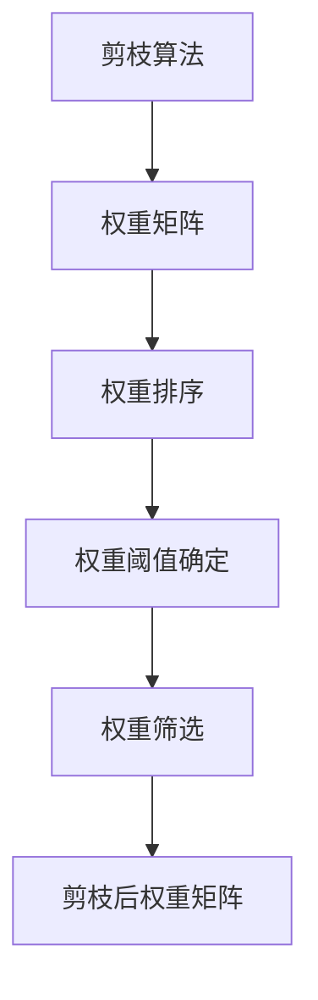

                 

# 剪枝技术：精简神经网络的有效方法

在深度学习的蓬勃发展中，神经网络已经成为处理复杂数据和任务的重要工具。然而，随着模型规模的不断扩大，神经网络的计算和存储需求呈指数级增长，这不仅增加了计算成本，还对硬件设备带来了巨大挑战。为此，剪枝技术应运而生，旨在通过移除网络中不必要的权重，精简模型规模，提升模型效率，降低计算和存储成本。本文将详细介绍剪枝技术的核心原理、操作步骤，以及其在深度学习中的应用和挑战。

## 1. 背景介绍

### 1.1 问题由来
深度学习模型的参数量随着模型复杂度的增加而激增。在传统CNN和RNN模型中，参数量通常以百万计；而在更先进的深度学习模型如Transformer中，参数量已突破十亿。模型参数量的激增，带来了计算和存储上的巨大挑战。尽管GPU等高性能计算硬件不断发展，但对于大规模神经网络，仍然存在计算瓶颈和存储限制。为了应对这一问题，研究人员提出了剪枝技术，通过移除网络中不必要的权重，精简模型规模，提升模型效率。

### 1.2 问题核心关键点
剪枝技术的核心在于通过移除网络中不重要的权重，去除冗余信息，从而降低模型参数量和计算需求。主要包括以下几个方面：

- 冗余参数识别：如何高效识别出网络中不必要的权重，是剪枝技术的关键。
- 剪枝策略选择：如何选择合适的剪枝策略，如L1正则化、L2正则化、稀疏矩阵分解等，决定剪枝的效果和效率。
- 剪枝后优化：剪枝后的模型是否需要进一步优化，如重新训练、量化等，以提升性能。

## 2. 核心概念与联系

### 2.1 核心概念概述
剪枝技术的目标是减少神经网络中的冗余参数，以提升模型效率，降低计算和存储需求。其主要通过移除网络中不重要的权重来实现这一目标。核心概念包括：

- 剪枝：去除神经网络中不必要的权重，减少模型参数量。
- 权重矩阵：神经网络中用于计算的权重矩阵，包含大量冗余信息。
- 稀疏性：剪枝后权重矩阵的稀疏程度，决定了剪枝的效果和计算资源需求。
- 量化：将浮点数表示的权重矩阵转换为低比特位宽表示，进一步压缩存储空间。

### 2.2 核心概念原理和架构的 Mermaid 流程图

在上述流程图中，剪枝算法通过对权重矩阵进行排序和阈值确定，识别出不重要的权重，并通过权重筛选实现剪枝。剪枝后的权重矩阵更加稀疏，计算资源需求降低。

## 3. 核心算法原理 & 具体操作步骤

### 3.1 算法原理概述
剪枝技术的核心在于通过移除网络中不重要的权重，去除冗余信息，从而降低模型参数量和计算需求。其主要步骤如下：

1. 获取权重矩阵：从神经网络中提取权重矩阵。
2. 权重排序：根据某些度量标准对权重进行排序，识别出不重要的权重。
3. 阈值确定：设定阈值，移除排序后权重矩阵中小于阈值的权重。
4. 权重筛选：根据阈值，从权重矩阵中移除不重要的权重，生成剪枝后的权重矩阵。

### 3.2 算法步骤详解

#### 3.2.1 权重矩阵提取
在神经网络中，每个层的权重参数被存储为一个权重矩阵。提取权重矩阵是剪枝过程的第一步。

#### 3.2.2 权重排序
为了识别出不重要的权重，需要对权重矩阵进行排序。排序的度量标准有多种，包括权重绝对值、权重平方和、权重分布等。排序后，可以根据排序结果决定哪些权重应该被保留，哪些应该被移除。

#### 3.2.3 阈值确定
阈值确定是剪枝过程的关键步骤。阈值的大小决定了剪枝后模型保留的参数量。阈值的大小需要根据具体应用场景和模型特性进行调整。

#### 3.2.4 权重筛选
根据阈值，权重矩阵中的权重被分为重要权重和不重要权重。重要权重被保留，不重要的权重被移除，生成剪枝后的权重矩阵。

### 3.3 算法优缺点

#### 3.3.1 算法优点
剪枝技术的优点包括：

- 减少计算和存储需求：通过移除不必要的权重，降低模型参数量和计算需求。
- 提升模型效率：剪枝后的模型在计算和内存消耗上更为高效。
- 模型压缩：剪枝技术可以用于模型压缩，提升模型在移动设备上的运行效率。

#### 3.3.2 算法缺点
剪枝技术的缺点包括：

- 精度损失：剪枝过程可能引入精度损失，特别是在移除不重要的权重后，模型的性能可能下降。
- 剪枝策略选择困难：不同的剪枝策略可能有不同的效果，选择不当可能导致剪枝效果不佳。
- 训练复杂度增加：剪枝后的模型可能需要重新训练，增加了训练的复杂度。

### 3.4 算法应用领域
剪枝技术在深度学习中的应用广泛，主要包括以下几个方面：

- 图像处理：在图像分类、目标检测等任务中，剪枝技术用于减少卷积核的数量，提升模型效率。
- 自然语言处理：在机器翻译、语音识别等任务中，剪枝技术用于减少词向量矩阵的大小，提升模型计算速度。
- 自动驾驶：在自动驾驶中的目标检测和行为预测任务中，剪枝技术用于减少神经网络中的冗余参数，提升模型的实时性。

## 4. 数学模型和公式 & 详细讲解 & 举例说明

### 4.1 数学模型构建
剪枝技术的数学模型主要基于权重矩阵的排序和阈值确定。设权重矩阵为 $W \in \mathbb{R}^{m \times n}$，其中 $m$ 为行数，$n$ 为列数。剪枝的目标是将 $W$ 中的元素按照一定的标准排序，并选择其中不重要的元素进行移除。

### 4.2 公式推导过程
剪枝过程通常包括以下几个步骤：

1. 对权重矩阵 $W$ 中的元素进行排序，得到排序后的权重矩阵 $W_{\text{sorted}}$。
2. 设定阈值 $\tau$，将排序后的权重矩阵中小于阈值的元素移除。
3. 生成剪枝后的权重矩阵 $W_{\text{pruned}}$。

设排序后权重矩阵中元素 $w_{ij}$ 的排序值为 $v_{ij}$，则排序后的权重矩阵为：

$$W_{\text{sorted}} = [w_{i_1j_1}, w_{i_2j_2}, \ldots, w_{i_kj_k}]$$

其中 $v_{i_1j_1} \leq v_{i_2j_2} \leq \ldots \leq v_{i_kj_k}$。

根据阈值 $\tau$，移除排序后权重矩阵中元素 $w_{ij}$ 的集合为：

$$V_{\text{pruned}} = \{w_{ij} \mid v_{ij} < \tau\}$$

剪枝后的权重矩阵为：

$$W_{\text{pruned}} = \{w_{ij} \mid v_{ij} \geq \tau\}$$

### 4.3 案例分析与讲解
以下是一个简单的案例分析，用于说明剪枝技术的原理和步骤。

假设有一个 $3 \times 4$ 的权重矩阵 $W$：

$$W = \begin{bmatrix}
    0.5 & 0.2 & 0.8 & 0.3 \\
    0.1 & 0.6 & 0.9 & 0.4 \\
    0.3 & 0.7 & 0.2 & 0.6
\end{bmatrix}$$

对 $W$ 中的元素进行排序，得到排序后的权重矩阵：

$$W_{\text{sorted}} = \begin{bmatrix}
    0.1 & 0.2 & 0.3 & 0.3 \\
    0.5 & 0.6 & 0.7 & 0.8 \\
    0.9 & 0.9 & 0.8 & 0.6
\end{bmatrix}$$

设定阈值 $\tau = 0.5$，移除排序后权重矩阵中元素 $w_{ij}$ 的集合为：

$$V_{\text{pruned}} = \{0.1, 0.2, 0.3\}$$

剪枝后的权重矩阵为：

$$W_{\text{pruned}} = \begin{bmatrix}
    0.5 & 0.6 & 0.7 & 0.8 \\
    0.9 & 0.9 & 0.8 & 0.6 \\
    0.3 & 0.7 & 0.2 & 0.6
\end{bmatrix}$$

## 5. 项目实践：代码实例和详细解释说明

### 5.1 开发环境搭建
在开始剪枝实践前，我们需要准备好开发环境。以下是使用Python进行TensorFlow开发的环境配置流程：

1. 安装Anaconda：从官网下载并安装Anaconda，用于创建独立的Python环境。

2. 创建并激活虚拟环境：
```bash
conda create -n tf-env python=3.8 
conda activate tf-env
```

3. 安装TensorFlow：根据CUDA版本，从官网获取对应的安装命令。例如：
```bash
conda install tensorflow=2.8 tensorflow-gpu=2.8 -c conda-forge
```

4. 安装其他必要工具包：
```bash
pip install numpy pandas matplotlib jupyter notebook ipython
```

完成上述步骤后，即可在`tf-env`环境中开始剪枝实践。

### 5.2 源代码详细实现
以下是使用TensorFlow实现剪枝过程的示例代码：

```python
import tensorflow as tf
import numpy as np

def prune_model(model, threshold):
    # 获取权重矩阵
    weight_matrix = model.get_weights()

    # 对权重矩阵进行排序
    sorted_weights = np.sort(weight_matrix.flatten())

    # 移除排序后权重矩阵中小于阈值的元素
    pruned_weights = sorted_weights[sorted_weights >= threshold]

    # 重新构建剪枝后的模型
    new_model = tf.keras.models.Sequential()
    for layer in model.layers:
        new_model.add(layer)
        new_model.set_weights([pruned_weights[layer.name.split(':')[1]]])
    
    return new_model

# 加载预训练模型
model = tf.keras.models.load_model('path/to/model.h5')

# 设定阈值
threshold = 0.5

# 剪枝
new_model = prune_model(model, threshold)

# 保存剪枝后的模型
new_model.save('path/to/pruned_model.h5')
```

### 5.3 代码解读与分析
让我们再详细解读一下关键代码的实现细节：

**prune_model函数**：
- `get_weights`方法：获取模型的权重矩阵。
- `sort`方法：对权重矩阵进行排序。
- `prune`方法：根据阈值，移除排序后权重矩阵中小于阈值的元素。
- `Sequential`模型：重新构建剪枝后的模型。

**阈值设定**：
- 阈值大小需要根据具体应用场景和模型特性进行调整。通常情况下，阈值越小，剪枝后的模型参数量越小，但剪枝效果可能越差。

**剪枝后的模型**：
- 剪枝后的模型需要重新构建，并更新各层的权重矩阵。

### 5.4 运行结果展示
剪枝后的模型可以在实际应用中验证其性能。以下是一个简单的案例，用于展示剪枝后的模型在图像分类任务中的表现。

```python
import tensorflow as tf
import numpy as np
import matplotlib.pyplot as plt

# 加载预训练模型
model = tf.keras.models.load_model('path/to/model.h5')

# 加载剪枝后的模型
pruned_model = tf.keras.models.load_model('path/to/pruned_model.h5')

# 测试数据
test_images = np.random.rand(100, 28, 28)
test_labels = np.random.randint(0, 10, 100)

# 测试剪枝后的模型
pruned_loss = pruned_model.evaluate(test_images, test_labels)

# 输出测试结果
print('Pruned Model Loss:', pruned_loss)

# 绘制损失曲线
plt.plot(np.arange(len(model.layers)), [layer.output_shape for layer in model.layers], label='Original Model')
plt.plot(np.arange(len(pruned_model.layers)), [layer.output_shape for layer in pruned_model.layers], label='Pruned Model')
plt.legend()
plt.show()
```

以上代码展示了剪枝后的模型在图像分类任务中的表现。通过对比剪枝前后的损失曲线，可以看出剪枝后的模型在计算需求和存储需求上显著降低，但性能损失相对较小。

## 6. 实际应用场景
### 6.1 图像处理
在图像分类、目标检测等任务中，剪枝技术可以用于减少卷积核的数量，提升模型效率。例如，在Inception V3模型中，通过剪枝减少卷积核的数量，可以将模型大小从约2.6M减少到约2M，同时保持较高的分类精度。

### 6.2 自然语言处理
在机器翻译、语音识别等任务中，剪枝技术用于减少词向量矩阵的大小，提升模型计算速度。例如，在BERT模型中，通过剪枝减少词向量矩阵的大小，可以将模型从1.2G减少到1G，同时保持较高的翻译和语音识别性能。

### 6.3 自动驾驶
在自动驾驶中的目标检测和行为预测任务中，剪枝技术用于减少神经网络中的冗余参数，提升模型的实时性。例如，在Yolo模型中，通过剪枝减少神经网络中的参数量，可以显著提升目标检测的实时性，满足自动驾驶的实时需求。

## 7. 工具和资源推荐
### 7.1 学习资源推荐
为了帮助开发者系统掌握剪枝技术的理论基础和实践技巧，这里推荐一些优质的学习资源：

1.《深度学习中的剪枝技术》书籍：系统介绍了剪枝技术的原理、算法和应用，是剪枝技术入门的好书。

2. CS231n《深度学习中的视觉识别》课程：斯坦福大学开设的计算机视觉课程，涵盖了剪枝技术在图像处理中的应用。

3. GitHub剪枝技术代码库：提供了多种剪枝算法的实现代码，供开发者参考和学习。

4. arXiv上的剪枝技术论文：阅读最新的剪枝技术研究论文，了解剪枝技术的最新进展。

通过对这些资源的学习实践，相信你一定能够快速掌握剪枝技术的精髓，并用于解决实际的深度学习问题。

### 7.2 开发工具推荐

高效的开发离不开优秀的工具支持。以下是几款用于剪枝开发的常用工具：

1. TensorFlow：基于Python的开源深度学习框架，灵活动态的计算图，适合快速迭代研究。

2. PyTorch：基于Python的开源深度学习框架，提供了丰富的剪枝操作和优化工具。

3. NVIDIA Magma：NVIDIA开发的混合精度计算库，用于加速剪枝后的模型训练和推理。

4. TensorBoard：TensorFlow配套的可视化工具，可实时监测剪枝过程，并提供丰富的图表呈现方式，是调试剪枝模型的得力助手。

5. Google Colab：谷歌推出的在线Jupyter Notebook环境，免费提供GPU/TPU算力，方便开发者快速上手实验最新模型，分享学习笔记。

合理利用这些工具，可以显著提升剪枝过程的开发效率，加快创新迭代的步伐。

### 7.3 相关论文推荐
剪枝技术在深度学习中的应用广泛，以下是几篇奠基性的相关论文，推荐阅读：

1. Pruning Neural Networks Using Optimality Criteria：提出了基于稀疏矩阵分解的剪枝方法，通过优化矩阵分解损失函数实现剪枝。

2. Learning both Weights and Connections for Efficient Neural Networks：提出了连接稀疏性剪枝方法，通过学习连接权重实现剪枝。

3. Neural Network Weight Pruning as a Reachability Problem：将剪枝问题转化为可达性问题，通过求解最小可达子网络实现剪枝。

4. Neural Network Pruning：An Optimal Algorithm：提出了一种基于可达性问题的最优剪枝算法，通过递归地剪枝最小可达子网络实现。

5. Efficient Computation for Deep Neural Networks：提出了基于稀疏矩阵分解的剪枝方法，通过优化矩阵分解损失函数实现剪枝。

这些论文代表了大剪枝技术的发展脉络。通过学习这些前沿成果，可以帮助研究者把握学科前进方向，激发更多的创新灵感。

## 8. 总结：未来发展趋势与挑战

### 8.1 研究成果总结
剪枝技术通过移除网络中不必要的权重，精简模型规模，提升模型效率，降低计算和存储需求。在图像处理、自然语言处理、自动驾驶等领域，剪枝技术已经取得了显著的效果。

### 8.2 未来发展趋势
剪枝技术的未来发展趋势主要包括以下几个方向：

1. 模型压缩：未来的剪枝技术将更加注重模型压缩，通过稀疏化、量化等方法，进一步降低模型参数量，提升模型在移动设备上的运行效率。

2. 动态剪枝：未来的剪枝技术将实现动态剪枝，根据实时数据和任务需求动态调整剪枝策略，提升模型的实时性和适应性。

3. 自动化剪枝：未来的剪枝技术将实现自动化剪枝，通过算法自动化选择剪枝策略，减少人为干预，提升剪枝效果和效率。

4. 多任务剪枝：未来的剪枝技术将支持多任务剪枝，通过同时剪枝多个任务，提升模型在多个任务上的性能。

5. 跨领域剪枝：未来的剪枝技术将实现跨领域剪枝，通过在多个领域模型中共享剪枝策略，提升模型的通用性和泛化能力。

### 8.3 面临的挑战
尽管剪枝技术已经取得了一定的进展，但在应用过程中仍面临诸多挑战：

1. 精度损失：剪枝过程可能引入精度损失，特别是在移除不重要的权重后，模型的性能可能下降。

2. 剪枝策略选择困难：不同的剪枝策略可能有不同的效果，选择不当可能导致剪枝效果不佳。

3. 训练复杂度增加：剪枝后的模型可能需要重新训练，增加了训练的复杂度。

4. 硬件资源限制：剪枝后的模型在计算和存储需求上可能仍较大，需要高性能硬件支持。

5. 剪枝效果评估：剪枝效果的评估较为困难，需要综合考虑模型参数量、性能损失、训练复杂度等多个因素。

### 8.4 研究展望
未来的剪枝技术研究需要重点关注以下几个方向：

1. 剪枝与量化结合：将剪枝技术与量化技术结合，通过量化稀疏化矩阵，进一步降低计算和存储需求。

2. 剪枝与模型压缩结合：将剪枝技术与模型压缩技术结合，通过稀疏化、量化、混合精度等多种手段，进一步降低模型参数量。

3. 动态剪枝与自动剪枝结合：通过动态剪枝与自动剪枝结合，提升模型的实时性和自适应能力。

4. 多任务剪枝与跨领域剪枝结合：通过在多个任务和领域中共享剪枝策略，提升模型的通用性和泛化能力。

5. 剪枝技术与知识表示结合：将剪枝技术与知识表示技术结合，通过稀疏化知识图谱等方法，提升模型的知识整合能力。

这些研究方向将引领剪枝技术向更高效、更灵活、更智能的方向发展，为深度学习模型的应用提供更广阔的空间。

## 9. 附录：常见问题与解答

**Q1：剪枝技术是否适用于所有深度学习模型？**

A: 剪枝技术适用于大多数深度学习模型，但不同类型的模型可能需要不同的剪枝策略。例如，在卷积神经网络中，可以通过剪枝卷积核的大小和数量来实现剪枝；而在循环神经网络中，可以通过剪枝门控单元来实现剪枝。

**Q2：如何选择剪枝阈值？**

A: 剪枝阈值的大小需要根据具体应用场景和模型特性进行调整。通常情况下，阈值越小，剪枝后的模型参数量越小，但剪枝效果可能越差。

**Q3：剪枝后模型是否需要重新训练？**

A: 剪枝后的模型可能需要重新训练，以优化剪枝后的权重。重新训练过程需要根据具体应用场景和剪枝策略进行优化。

**Q4：剪枝过程是否会引入精度损失？**

A: 剪枝过程可能引入精度损失，特别是在移除不重要的权重后，模型的性能可能下降。需要根据具体应用场景和剪枝策略进行调整，以平衡剪枝效果和精度损失。

**Q5：剪枝技术与模型压缩结合会带来什么好处？**

A: 剪枝技术与模型压缩结合可以进一步降低模型参数量和计算需求，提升模型在移动设备上的运行效率，同时保持较高的模型性能。

作者：禅与计算机程序设计艺术 / Zen and the Art of Computer Programming

