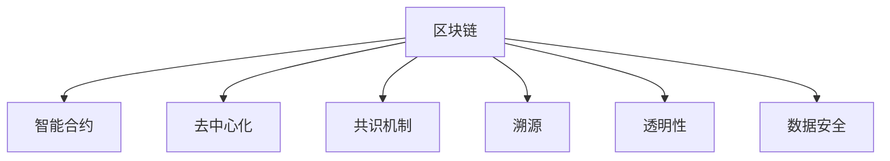

                 

# 区块链在供应链管理中的应用：提高透明度和效率

> 关键词：区块链，供应链管理，透明度，效率，智能合约，溯源，数据安全

## 1. 背景介绍

### 1.1 问题由来
现代供应链管理面临诸多挑战，包括信息孤岛、数据篡改、透明度不足等问题，这些问题严重影响企业的运营效率和客户满意度。而区块链技术作为一种分布式账本技术，具有去中心化、透明性、不可篡改、可追溯等优势，为解决这些问题提供了新的思路。

### 1.2 问题核心关键点
本节将介绍区块链在供应链管理中的核心概念及其应用场景：

- 区块链（Blockchain）：一种分布式账本技术，以去中心化的方式记录和验证交易信息，具有透明性、不可篡改和可追溯等特点。
- 供应链管理（Supply Chain Management, SCM）：涵盖物料采购、生产制造、仓储物流、配送销售等全流程管理的复杂系统，其目标是提升效率、降低成本、提高响应速度和客户满意度。
- 透明性（Transparency）：指供应链中所有参与方能够无障碍地查看相关信息，确保数据公开透明，防止信息不对称。
- 效率（Efficiency）：指供应链中物料、资金和信息流动的速度和成本，其核心是优化资源配置和流程优化。
- 智能合约（Smart Contracts）：一种基于区块链的自动化合约，通过代码实现交易逻辑，具有不可篡改和自动执行的特点。
- 溯源（Traceability）：指从产品生产到交付的每一个环节都能追溯其来源和流转路径，保障产品质量和来源可追溯。
- 数据安全（Data Security）：指区块链上的数据在传输和存储过程中的安全性，防止数据泄露和篡改。

这些核心概念共同构成了区块链在供应链管理中的应用基础，使得其能够提升供应链的透明度、效率和数据安全性，推动供应链系统的数字化转型。

### 1.3 问题研究意义
研究区块链在供应链管理中的应用，对于提升供应链的透明度和效率具有重要意义：

1. **降低成本**：通过区块链技术，可以消除中间环节，减少纸质文档和人工干预，降低交易成本和运营成本。
2. **提高透明度**：区块链的分布式账本特性，使得供应链中的每个环节都能公开透明地记录交易信息，防止信息不对称和欺诈行为。
3. **增强可追溯性**：区块链的不可篡改和可追溯特性，使得产品从生产到交付的每一个环节都能被追溯，提高产品质量和品牌声誉。
4. **优化资源配置**：区块链的智能合约功能，可以根据预设条件自动执行，优化供应链资源的配置和流程优化，提升运营效率。
5. **保障数据安全**：区块链的数据安全特性，可以防止数据泄露和篡改，确保供应链中数据的安全性和完整性。
6. **促进协作**：区块链的去中心化特性，可以促进供应链中各参与方的协作，打破信息孤岛，实现协同作业。

## 2. 核心概念与联系

### 2.1 核心概念概述

为更好地理解区块链在供应链管理中的应用，本节将介绍几个密切相关的核心概念：

- 区块链：一种基于时间顺序、不可篡改、去中心化分布式账本技术。通过区块链技术，可以构建一个透明、可信、高效的供应链记录系统。
- 智能合约：一种基于区块链的自动化合约，能够根据预设条件自动执行，实现供应链流程的自动化和智能化。
- 去中心化（Decentralization）：指供应链中的记录和验证不依赖于单一的中央机构，而是通过网络中的多个节点共同完成。
- 共识机制（Consensus Mechanism）：指在去中心化的区块链网络中，如何达成一致的交易记录方式，常见的包括PoW、PoS、DPoS等。
- 溯源（Traceability）：指通过区块链技术，能够追溯产品从生产到交付的每一个环节，保障产品的来源和流转路径。
- 透明性（Transparency）：指供应链中所有参与方都能够无障碍地查看相关信息，确保数据公开透明，防止信息不对称。
- 数据安全（Data Security）：指区块链上的数据在传输和存储过程中的安全性，防止数据泄露和篡改。

这些核心概念之间的逻辑关系可以通过以下Mermaid流程图来展示：



这个流程图展示了大语言模型的核心概念及其关系：

1. 区块链作为基础技术，提供了透明性、不可篡改和可追溯等核心特性。
2. 智能合约在区块链上运行，通过预设条件自动执行，实现供应链流程的自动化和智能化。
3. 去中心化使得供应链中的记录和验证不依赖于单一的中央机构，通过网络中的多个节点共同完成。
4. 共识机制确保在去中心化的区块链网络中，如何达成一致的交易记录方式。
5. 溯源通过区块链技术，能够追溯产品从生产到交付的每一个环节。
6. 透明性确保供应链中所有参与方都能够无障碍地查看相关信息。
7. 数据安全保障区块链上的数据在传输和存储过程中的安全性。

这些概念共同构成了区块链在供应链管理中的应用框架，使其能够在各种场景下发挥强大的优势。

## 3. 核心算法原理 & 具体操作步骤
### 3.1 算法原理概述

区块链在供应链管理中的应用，本质上是利用区块链技术的特性，提升供应链的透明度和效率。其核心思想是：将供应链中的交易记录和数据存储在区块链上，通过去中心化、透明性和不可篡改的特点，确保数据的真实性和可追溯性，从而提升供应链的透明度和效率。

具体来说，区块链在供应链管理中的应用包括以下几个关键步骤：

1. **数据上链**：将供应链中的关键数据（如订单信息、货物状态、物流信息等）记录在区块链上，确保数据的真实性和不可篡改。
2. **智能合约执行**：通过智能合约，自动化地执行供应链流程中的关键操作，如订单确认、货物交付、支付等。
3. **信息共享与协作**：利用区块链的去中心化特性，实现供应链中各参与方之间的信息共享和协作，打破信息孤岛，提高协同作业效率。
4. **溯源与透明**：通过区块链的不可篡改和可追溯特性，实现产品从生产到交付的每一个环节的追溯，确保产品来源可查，提高透明度。
5. **数据安全与合规**：利用区块链的数据安全特性，保障供应链中数据的完整性和安全性，确保合规操作。

### 3.2 算法步骤详解

区块链在供应链管理中的应用主要包括以下几个关键步骤：

**Step 1: 构建区块链网络**

- 确定供应链中需要上链的关键数据，如订单信息、货物状态、物流信息等。
- 选择合适的区块链平台，如Hyperledger Fabric、Ethereum等，搭建区块链网络。
- 部署智能合约，定义数据记录和操作逻辑。

**Step 2: 数据上链**

- 将供应链中的关键数据记录在区块链上，确保数据的透明性和不可篡改。
- 通过智能合约自动执行数据记录和操作，提高效率和准确性。
- 利用区块链的分布式账本特性，实现供应链中各参与方之间的数据共享和协作。

**Step 3: 智能合约执行**

- 通过智能合约，自动化地执行供应链流程中的关键操作，如订单确认、货物交付、支付等。
- 根据预设条件自动执行，减少人工干预，提高效率和准确性。
- 利用智能合约的可编程特性，实现供应链流程的灵活配置和优化。

**Step 4: 信息共享与协作**

- 利用区块链的去中心化特性，实现供应链中各参与方之间的信息共享和协作，打破信息孤岛。
- 通过智能合约实现供应链中各环节的协同作业，提高作业效率。
- 确保供应链中所有参与方都能够无障碍地查看相关信息，提高透明度。

**Step 5: 溯源与透明**

- 通过区块链的不可篡改和可追溯特性，实现产品从生产到交付的每一个环节的追溯。
- 利用区块链的透明性，确保产品来源可查，提高透明度。
- 通过区块链的数据安全特性，保障供应链中数据的完整性和安全性。

### 3.3 算法优缺点

区块链在供应链管理中的应用具有以下优点：

1. **提升透明度**：区块链的分布式账本特性，使得供应链中的每个环节都能公开透明地记录交易信息，防止信息不对称和欺诈行为。
2. **提高效率**：通过智能合约的自动化执行，减少人工干预，提高供应链流程的效率和准确性。
3. **增强可追溯性**：区块链的不可篡改和可追溯特性，使得产品从生产到交付的每一个环节都能被追溯，提高产品质量和品牌声誉。
4. **保障数据安全**：区块链的数据安全特性，可以防止数据泄露和篡改，确保供应链中数据的安全性和完整性。

同时，区块链在供应链管理中也有一定的局限性：

1. **成本较高**：区块链的搭建和维护成本较高，尤其是对于中小企业而言，可能难以承受。
2. **技术复杂**：区块链技术相对复杂，需要专业技术人员进行搭建和维护。
3. **信任问题**：区块链的去中心化特性虽然提高了数据的透明性和不可篡改性，但供应链中各参与方的信任建立仍需时间。
4. **隐私问题**：区块链的透明性虽然提高了数据的可追溯性，但可能涉及隐私泄露的问题，需要采取一定的隐私保护措施。

尽管存在这些局限性，但区块链在供应链管理中的应用前景广阔，将继续推动供应链系统的数字化转型。

### 3.4 算法应用领域

区块链在供应链管理中的应用主要包括以下几个领域：

1. **物流跟踪与溯源**：利用区块链的不可篡改和可追溯特性，实现货物从生产到交付的每一个环节的追溯，确保产品来源可查，提高透明度。
2. **订单管理与确认**：通过智能合约自动执行订单确认、支付等操作，减少人工干预，提高效率和准确性。
3. **库存管理与优化**：利用区块链的透明性和数据共享特性，实现供应链中库存信息的实时监控和优化，提高库存管理效率。
4. **合同管理与执行**：通过智能合约自动执行供应链中的合同条款，确保合同的严格执行，减少纠纷和争议。
5. **合规与审计**：利用区块链的数据安全特性，保障供应链中数据的完整性和安全性，确保合规操作。
6. **供应链金融**：利用区块链的透明性和不可篡改特性，实现供应链金融的透明化和自动化，降低融资成本和风险。

这些领域的应用将进一步提升供应链的透明度、效率和数据安全性，推动供应链系统的全面数字化转型。

## 4. 数学模型和公式 & 详细讲解
### 4.1 数学模型构建

在供应链管理中，区块链的应用主要涉及以下几个数学模型：

1. **分布式账本模型**：用于记录和验证供应链中的交易信息，确保数据的透明性和不可篡改性。
2. **智能合约模型**：用于定义和执行供应链流程中的操作，确保操作的自动化和合规性。
3. **去中心化模型**：用于描述区块链网络中的节点分布和操作逻辑，确保去中心化和共识机制的实现。
4. **溯源模型**：用于追溯产品从生产到交付的每一个环节，确保产品来源可查。
5. **数据安全模型**：用于保障供应链中数据的完整性和安全性，防止数据泄露和篡改。

### 4.2 公式推导过程

以下我们将详细介绍几个核心数学模型的推导过程：

**分布式账本模型**

分布式账本模型用于记录和验证供应链中的交易信息，确保数据的透明性和不可篡改性。其核心公式为：

$$
T_{i} = \sum_{j=1}^{n} t_{i,j} \times R_{j}
$$

其中 $T_{i}$ 为交易信息，$t_{i,j}$ 为交易信息的第 $j$ 项，$R_{j}$ 为第 $j$ 项的交易记录，$n$ 为交易信息的总项数。

**智能合约模型**

智能合约模型用于定义和执行供应链流程中的操作，确保操作的自动化和合规性。其核心公式为：

$$
\text{执行} = \text{条件} \land \text{条件}
$$

其中 $\text{执行}$ 为智能合约的执行结果，$\text{条件}$ 为预设条件，$\land$ 表示逻辑与。

**去中心化模型**

去中心化模型用于描述区块链网络中的节点分布和操作逻辑，确保去中心化和共识机制的实现。其核心公式为：

$$
C_{i} = \sum_{j=1}^{m} c_{i,j} \times W_{j}
$$

其中 $C_{i}$ 为节点 $i$ 的共识记录，$c_{i,j}$ 为节点 $i$ 的第 $j$ 项共识记录，$W_{j}$ 为第 $j$ 项共识的权重，$m$ 为共识项数。

**溯源模型**

溯源模型用于追溯产品从生产到交付的每一个环节，确保产品来源可查。其核心公式为：

$$
\text{溯源} = \text{生产记录} \rightarrow \text{加工记录} \rightarrow \text{物流记录} \rightarrow \text{交付记录}
$$

其中 $\text{溯源}$ 为产品的溯源路径，$\rightarrow$ 表示追溯方向。

**数据安全模型**

数据安全模型用于保障供应链中数据的完整性和安全性，防止数据泄露和篡改。其核心公式为：

$$
S = D \times P \times A
$$

其中 $S$ 为数据安全状态，$D$ 为数据完整性，$P$ 为数据隐私性，$A$ 为数据访问控制。

### 4.3 案例分析与讲解

假设某制造企业需要在全球范围内采购原材料，并利用区块链技术进行供应链管理。我们可以将此过程分为以下几个步骤：

1. **生产订单生成**：通过智能合约自动生成生产订单，记录订单信息、供应商信息、生产时间等关键数据，确保数据的透明性和不可篡改性。
2. **生产进度跟踪**：利用区块链的分布式账本特性，实时记录生产进度和货物状态，确保供应链中所有参与方都能够无障碍地查看相关信息。
3. **物流跟踪与溯源**：通过智能合约自动执行物流操作，记录物流信息，确保产品从生产到交付的每一个环节都能被追溯，提高透明度。
4. **合同管理与执行**：利用区块链的智能合约特性，自动执行合同条款，确保合同的严格执行，减少纠纷和争议。
5. **合规与审计**：利用区块链的数据安全特性，保障供应链中数据的完整性和安全性，确保合规操作。

以下是一个基于Hyperledger Fabric平台的供应链管理代码示例：

```python
# 引入Hyperledger Fabric SDK
from hfc.fabric import Client

# 创建Fabric客户端
client = Client()
client.connect('localhost:7051')

# 创建区块链网络
chain = client.create_network('my_chain')

# 定义智能合约
contract = chain.get_contract('my_chain', 'my_contract')
contract.set_function('generate_order', lambda args: {
    'order_id': args[0],
    'supplier_id': args[1],
    'production_time': args[2]
})

# 生成生产订单
order_id = 'order1'
supplier_id = 'supplier1'
production_time = '2023-04-01'
args = [order_id, supplier_id, production_time]
contract.invoke_function('generate_order', args)

# 跟踪生产进度
tracking_id = 'tracking1'
tracking_status = 'in_progress'
args = [tracking_id, tracking_status]
contract.invoke_function('update_tracking_status', args)

# 物流跟踪与溯源
shipping_id = 'shipping1'
tracking_id = 'tracking1'
args = [shipping_id, tracking_id]
contract.invoke_function('update_shipping_status', args)

# 合同管理与执行
contract_id = 'contract1'
order_id = 'order1'
args = [contract_id, order_id]
contract.invoke_function('execute_order', args)

# 合规与审计
log_id = 'log1'
args = [log_id]
contract.invoke_function('log_audit', args)
```

## 5. 项目实践：代码实例和详细解释说明
### 5.1 开发环境搭建

在进行区块链项目实践前，我们需要准备好开发环境。以下是使用Hyperledger Fabric搭建区块链网络的流程：

1. 安装Hyperledger Fabric SDK：从官网下载并安装Hyperledger Fabric SDK。
2. 配置区块链网络：创建区块链网络，配置网络节点、通道、组织等。
3. 安装智能合约：将智能合约代码部署到区块链网络中。
4. 测试与验证：编写测试代码，验证智能合约的功能是否正确。

完成上述步骤后，即可在区块链网络上进行实际的应用开发。

### 5.2 源代码详细实现

下面以智能合约为例，给出Hyperledger Fabric平台的区块链应用开发代码实现。

```python
# 引入Hyperledger Fabric SDK
from hfc.fabric import Client

# 创建Fabric客户端
client = Client()
client.connect('localhost:7051')

# 创建区块链网络
chain = client.create_network('my_chain')

# 定义智能合约
contract = chain.get_contract('my_chain', 'my_contract')
contract.set_function('generate_order', lambda args: {
    'order_id': args[0],
    'supplier_id': args[1],
    'production_time': args[2]
})

# 生成生产订单
order_id = 'order1'
supplier_id = 'supplier1'
production_time = '2023-04-01'
args = [order_id, supplier_id, production_time]
contract.invoke_function('generate_order', args)

# 跟踪生产进度
tracking_id = 'tracking1'
tracking_status = 'in_progress'
args = [tracking_id, tracking_status]
contract.invoke_function('update_tracking_status', args)

# 物流跟踪与溯源
shipping_id = 'shipping1'
tracking_id = 'tracking1'
args = [shipping_id, tracking_id]
contract.invoke_function('update_shipping_status', args)

# 合同管理与执行
contract_id = 'contract1'
order_id = 'order1'
args = [contract_id, order_id]
contract.invoke_function('execute_order', args)

# 合规与审计
log_id = 'log1'
args = [log_id]
contract.invoke_function('log_audit', args)
```

### 5.3 代码解读与分析

让我们再详细解读一下关键代码的实现细节：

**Fabric客户端创建**

```python
# 创建Fabric客户端
client = Client()
client.connect('localhost:7051')
```

首先，通过`Client()`方法创建一个Fabric客户端，然后调用`connect()`方法连接到Hyperledger Fabric网络，默认连接地址为`localhost:7051`。

**区块链网络创建**

```python
# 创建区块链网络
chain = client.create_network('my_chain')
```

通过`create_network()`方法创建一个名为`my_chain`的区块链网络。

**智能合约定义**

```python
# 定义智能合约
contract = chain.get_contract('my_chain', 'my_contract')
contract.set_function('generate_order', lambda args: {
    'order_id': args[0],
    'supplier_id': args[1],
    'production_time': args[2]
})
```

通过`get_contract()`方法获取智能合约对象，然后通过`set_function()`方法定义智能合约函数。

**智能合约调用**

```python
# 生成生产订单
order_id = 'order1'
supplier_id = 'supplier1'
production_time = '2023-04-01'
args = [order_id, supplier_id, production_time]
contract.invoke_function('generate_order', args)

# 跟踪生产进度
tracking_id = 'tracking1'
tracking_status = 'in_progress'
args = [tracking_id, tracking_status]
contract.invoke_function('update_tracking_status', args)

# 物流跟踪与溯源
shipping_id = 'shipping1'
tracking_id = 'tracking1'
args = [shipping_id, tracking_id]
contract.invoke_function('update_shipping_status', args)

# 合同管理与执行
contract_id = 'contract1'
order_id = 'order1'
args = [contract_id, order_id]
contract.invoke_function('execute_order', args)

# 合规与审计
log_id = 'log1'
args = [log_id]
contract.invoke_function('log_audit', args)
```

通过`invoke_function()`方法调用智能合约函数。在调用时，需要传入函数名和参数列表。

### 5.4 运行结果展示

在区块链网络上成功执行上述代码后，即可验证智能合约的功能是否正确。具体来说，可以通过以下步骤进行验证：

1. 检查智能合约是否已经成功部署。
2. 检查生成的生产订单、跟踪信息、物流信息和合同执行记录是否正确。
3. 检查合同管理与执行、合规与审计的功能是否正常。

## 6. 实际应用场景
### 6.1 智能合约供应链金融

区块链技术在供应链金融中的应用，可以有效地解决信息不对称、融资难、风险高等问题，推动供应链金融的数字化转型。

具体而言，可以利用智能合约自动执行供应链中的合同条款，确保合同的严格执行，减少纠纷和争议。通过区块链的透明性和不可篡改特性，实现供应链金融的透明化和自动化，降低融资成本和风险。

### 6.2 物流跟踪与溯源

在物流跟踪与溯源方面，利用区块链的不可篡改和可追溯特性，实现货物从生产到交付的每一个环节的追溯，确保产品来源可查，提高透明度。

通过区块链的分布式账本特性，实时记录生产进度和货物状态，确保供应链中所有参与方都能够无障碍地查看相关信息。利用智能合约自动执行物流操作，记录物流信息，确保产品从生产到交付的每一个环节都能被追溯，提高透明度。

### 6.3 供应链合同管理

在供应链合同管理方面，利用智能合约的自动化执行特性，自动执行供应链中的合同条款，确保合同的严格执行，减少纠纷和争议。

通过区块链的透明性和不可篡改特性，实现供应链合同的透明化和自动化，降低合同执行中的不确定性和复杂性。利用智能合约的预设条件自动执行，减少人工干预，提高效率和准确性。

### 6.4 未来应用展望

随着区块链技术的不断发展，其应用场景将不断拓展，进一步推动供应链系统的数字化转型。

在智慧物流方面，利用区块链的不可篡改和可追溯特性，实现物流信息的透明化和自动化，提升物流效率和用户体验。在供应链金融方面，利用智能合约的自动化执行特性，推动供应链金融的透明化和自动化，降低融资成本和风险。

## 7. 工具和资源推荐
### 7.1 学习资源推荐

为了帮助开发者系统掌握区块链在供应链管理中的应用，这里推荐一些优质的学习资源：

1. 《Hyperledger Fabric官方文档》：Hyperledger Fabric官方文档，详细介绍了Hyperledger Fabric的搭建和应用。
2. 《Blockchain in Supply Chain Management》书籍：系统介绍了区块链在供应链管理中的应用，提供了丰富的案例和实践经验。
3. 《Smart Contracts in Action》书籍：介绍了智能合约的开发和应用，提供了丰富的示例代码和项目实战。
4. 《Blockchain for Supply Chain Management》课程：由Udacity开设的区块链供应链管理课程，详细介绍了区块链在供应链管理中的应用。
5. 《Hyperledger Fabric Development》课程：由IBM开设的Hyperledger Fabric开发课程，详细介绍了Hyperledger Fabric的搭建和应用。

通过对这些资源的学习实践，相信你一定能够快速掌握区块链在供应链管理中的应用，并用于解决实际的供应链问题。

### 7.2 开发工具推荐

高效的开发离不开优秀的工具支持。以下是几款用于区块链开发的工具：

1. Hyperledger Fabric SDK：Hyperledger Fabric官方提供的SDK，用于搭建和应用区块链网络。
2. Node.js：基于JavaScript的开发平台，适用于开发智能合约和其他区块链应用。
3. Docker：容器化技术，适用于区块链网络的快速搭建和部署。
4. Jenkins：自动化集成工具，适用于区块链应用的持续集成和部署。
5. Kubernetes：容器编排工具，适用于区块链网络的弹性伸缩和集群管理。

合理利用这些工具，可以显著提升区块链开发和应用的效率，加快创新迭代的步伐。

### 7.3 相关论文推荐

区块链在供应链管理中的应用源于学界的持续研究。以下是几篇奠基性的相关论文，推荐阅读：

1. "Blockchain for Supply Chain Management: An Overview"：对区块链在供应链管理中的应用进行了系统总结。
2. "Smart Contracts for Supply Chain Management"：介绍了智能合约在供应链中的应用，提供了丰富的案例和实践经验。
3. "Blockchain in Logistics and Transportation"：探讨了区块链在物流和运输中的应用，提供了丰富的示例代码和项目实战。
4. "Blockchain in Supply Chain Finance"：介绍了区块链在供应链金融中的应用，提供了丰富的案例和实践经验。
5. "The Future of Blockchain in Supply Chain"：探讨了区块链在供应链未来的发展方向，提供了前瞻性的见解和思考。

这些论文代表了大语言模型微调技术的发展脉络。通过学习这些前沿成果，可以帮助研究者把握学科前进方向，激发更多的创新灵感。

## 8. 总结：未来发展趋势与挑战

### 8.1 总结

本文对区块链在供应链管理中的应用进行了全面系统的介绍。首先阐述了区块链在供应链管理中的核心概念及其应用场景，明确了区块链技术在提升供应链的透明度和效率方面的独特价值。其次，从原理到实践，详细讲解了区块链在供应链管理中的应用过程，给出了区块链应用开发的具体代码实例。同时，本文还广泛探讨了区块链在物流跟踪与溯源、供应链合同管理等方面的实际应用，展示了区块链技术在供应链数字化转型中的巨大潜力。此外，本文精选了区块链在供应链管理中的应用工具和资源，力求为开发者提供全方位的技术指引。

通过本文的系统梳理，可以看到，区块链技术在供应链管理中的应用前景广阔，正逐步推动供应链系统的全面数字化转型。未来，伴随区块链技术的不断发展，其应用场景将不断拓展，进一步提升供应链的透明度、效率和数据安全性，为供应链系统的数字化转型提供更强大的动力。

### 8.2 未来发展趋势

展望未来，区块链在供应链管理中的应用将呈现以下几个发展趋势：

1. **区块链网络的扩展与优化**：随着供应链复杂度的提升，区块链网络将不断扩展，覆盖更广的参与方和更多的操作流程。同时，区块链网络的技术也将不断优化，提高效率和安全性。
2. **智能合约的自动化与优化**：随着供应链流程的自动化和智能化需求增加，智能合约的自动化和优化将成为重要的研究方向。未来的智能合约将更加灵活、高效、安全。
3. **去中心化的进一步深化**：随着区块链技术的不断演进，去中心化的理念将进一步深化，实现供应链中各参与方的更加平等的协作。
4. **跨链技术的突破**：区块链网络的扩展和优化需要跨链技术的支持，未来的跨链技术将进一步突破，实现不同区块链网络之间的互联互通。
5. **隐私保护与数据安全**：随着区块链应用的普及，隐私保护和数据安全将成为重要的研究课题，未来的区块链应用将更加注重隐私保护和数据安全。
6. **区块链与AI的融合**：区块链技术与人工智能技术的融合，将推动供应链系统的智能化和自动化，进一步提升供应链的效率和可靠性。

以上趋势凸显了区块链在供应链管理中的应用前景。这些方向的探索发展，必将进一步提升供应链的透明度、效率和数据安全性，推动供应链系统的全面数字化转型。

### 8.3 面临的挑战

尽管区块链在供应链管理中的应用前景广阔，但在迈向更加智能化、普适化应用的过程中，它仍面临诸多挑战：

1. **技术复杂性**：区块链技术的相对复杂性，增加了应用开发的难度和成本。
2. **信任问题**：区块链的去中心化特性虽然提高了数据的透明性和不可篡改性，但供应链中各参与方的信任建立仍需时间。
3. **隐私问题**：区块链的透明性虽然提高了数据的可追溯性，但可能涉及隐私泄露的问题，需要采取一定的隐私保护措施。
4. **性能瓶颈**：区块链在处理大规模数据时，可能面临性能瓶颈，需要优化技术架构，提高处理效率。
5. **标准化问题**：供应链中各参与方使用的区块链技术和协议可能存在差异，需要标准化和互操作性。
6. **法规与合规**：区块链在供应链中的应用需要符合各种法律法规和合规要求，需要相关法律和政策的支持。

尽管存在这些挑战，但区块链在供应链管理中的应用前景广阔，将继续推动供应链系统的数字化转型。未来，通过持续的技术创新和政策支持，这些挑战终将逐步解决。

### 8.4 研究展望

针对区块链在供应链管理中的应用挑战，未来的研究方向包括：

1. **跨链技术的突破**：实现不同区块链网络之间的互联互通，打破信息孤岛。
2. **智能合约的优化**：提高智能合约的自动化和安全性，减少人工干预，降低成本。
3. **隐私保护与数据安全**：研究隐私保护和数据安全技术，保障供应链中数据的完整性和安全性。
4. **标准化与互操作性**：制定区块链在供应链中的应用标准，促进各参与方之间的互操作性。
5. **法规与合规**：研究区块链在供应链中的应用法规和合规要求，确保应用合法合规。

这些研究方向将进一步推动区块链在供应链管理中的应用，提升供应链的透明度、效率和数据安全性，为供应链系统的数字化转型提供更强大的动力。

## 9. 附录：常见问题与解答

**Q1：区块链在供应链管理中应用的主要优势是什么？**

A: 区块链在供应链管理中应用的主要优势包括：
1. **提升透明度**：区块链的分布式账本特性，使得供应链中的每个环节都能公开透明地记录交易信息，防止信息不对称和欺诈行为。
2. **提高效率**：通过智能合约的自动化执行，减少人工干预，提高供应链流程的效率和准确性。
3. **增强可追溯性**：区块链的不可篡改和可追溯特性，使得产品从生产到交付的每一个环节都能被追溯，提高透明度。
4. **保障数据安全**：区块链的数据安全特性，可以防止数据泄露和篡改，确保供应链中数据的安全性和完整性。

**Q2：区块链在供应链管理中面临的主要挑战是什么？**

A: 区块链在供应链管理中面临的主要挑战包括：
1. **技术复杂性**：区块链技术的相对复杂性，增加了应用开发的难度和成本。
2. **信任问题**：区块链的去中心化特性虽然提高了数据的透明性和不可篡改性，但供应链中各参与方的信任建立仍需时间。
3. **隐私问题**：区块链的透明性虽然提高了数据的可追溯性，但可能涉及隐私泄露的问题，需要采取一定的隐私保护措施。
4. **性能瓶颈**：区块链在处理大规模数据时，可能面临性能瓶颈，需要优化技术架构，提高处理效率。
5. **标准化问题**：供应链中各参与方使用的区块链技术和协议可能存在差异，需要标准化和互操作性。
6. **法规与合规**：区块链在供应链中的应用需要符合各种法律法规和合规要求，需要相关法律和政策的支持。

**Q3：区块链在供应链管理中的应用场景主要有哪些？**

A: 区块链在供应链管理中的应用场景主要包括以下几个：
1. **物流跟踪与溯源**：利用区块链的不可篡改和可追溯特性，实现货物从生产到交付的每一个环节的追溯，确保产品来源可查，提高透明度。
2. **订单管理与确认**：通过智能合约自动执行订单确认、支付等操作，减少人工干预，提高效率和准确性。
3. **库存管理与优化**：利用区块链的透明性和数据共享特性，实现供应链中库存信息的实时监控和优化，提高库存管理效率。
4. **合同管理与执行**：利用智能合约自动执行供应链中的合同条款，确保合同的严格执行，减少纠纷和争议。
5. **合规与审计**：利用区块链的数据安全特性，保障供应链中数据的完整性和安全性，确保合规操作。

**Q4：区块链在供应链管理中的未来发展方向是什么？**

A: 区块链在供应链管理中的未来发展方向包括：
1. **区块链网络的扩展与优化**：随着供应链复杂度的提升，区块链网络将不断扩展，覆盖更广的参与方和更多的操作流程。同时，区块链网络的技术也将不断优化，提高效率和安全性。
2. **智能合约的自动化与优化**：随着供应链流程的自动化和智能化需求增加，智能合约的自动化和优化将成为重要的研究方向。未来的智能合约将更加灵活、高效、安全。
3. **去中心化的进一步深化**：随着区块链技术的不断演进，去中心化的理念将进一步深化，实现供应链中各参与方的更加平等的协作。
4. **跨链技术的突破**：区块链网络的扩展和优化需要跨链技术的支持，未来的跨链技术将进一步突破，实现不同区块链网络之间的互联互通。
5. **隐私保护与数据安全**：随着区块链应用的普及，隐私保护和数据安全将成为重要的研究课题，未来的区块链应用将更加注重隐私保护和数据安全。
6. **区块链与AI的融合**：区块链技术与人工智能技术的融合，将推动供应链系统的智能化和自动化，进一步提升供应链的效率和可靠性。

**Q5：区块链在供应链管理中的应用案例有哪些？**

A: 区块链在供应链管理中的应用案例包括：
1. **阿里巴巴供应链金融**：利用区块链技术，实现供应链融资的透明化和自动化，降低融资成本和风险。
2. **沃尔玛物流跟踪**：利用区块链的不可篡改和可追溯特性，实现货物从生产到交付的每一个环节的追溯，提高透明度。
3. **FedEx供应链合同管理**：利用智能合约自动执行供应链中的合同条款，确保合同的严格执行，减少纠纷和争议。
4. **宝马智能合约供应链金融**：利用区块链技术，实现供应链融资的透明化和自动化，降低融资成本和风险。
5. **荷兰食品溯源系统**：利用区块链的不可篡改和可追溯特性，实现食品从生产到交付的每一个环节的追溯，提高透明度。

通过这些案例，可以看到区块链在供应链管理中的应用前景广阔，正逐步推动供应链系统的全面数字化转型。

---

作者：禅与计算机程序设计艺术 / Zen and the Art of Computer Programming

