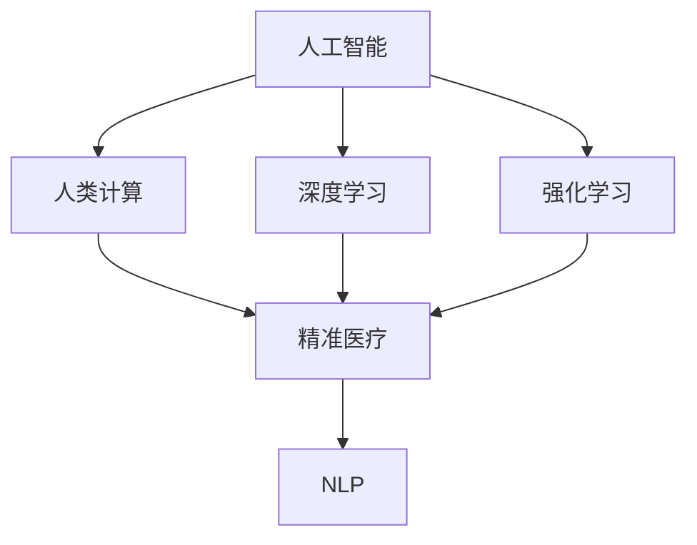

                 

## 1. 背景介绍

### 1.1 问题由来

医疗保健行业长期以来面临诸多挑战，其中包括：高昂的医疗成本、资源分配不均、误诊率高、药物研发周期长等问题。这些问题不仅影响了患者的健康和生活质量，也对社会经济带来了巨大的负担。近年来，随着计算技术和人工智能（AI）的飞速发展，越来越多的研究者和医疗机构开始探索如何利用这些技术来提升医疗保健水平。

特别是基于人类计算（Human Computation）的AI方法，通过大规模的数据收集和分析，为精准医疗提供了新的可能性。这些方法不仅能够提高诊断的准确性，还可以为个性化治疗、药物研发、公共卫生监测等领域带来革命性的改变。

### 1.2 问题核心关键点

人类计算在医疗保健中的应用，主要是通过大规模数据集（如基因组数据、电子病历、临床试验数据等）和先进算法（如深度学习、强化学习等）来进行分析和预测。其核心关键点包括：

- **数据驱动**：依赖于大量的临床数据进行训练和预测。
- **模型智能**：使用机器学习和深度学习模型，从数据中提取出复杂的模式和规律。
- **跨界融合**：将多学科知识（如医学、生物信息学、统计学等）与计算技术融合，提升医疗决策的准确性和效率。
- **个性化医疗**：基于患者的基因、病史、生活习惯等多方面数据，提供个性化的诊断和治疗方案。

### 1.3 问题研究意义

人类计算在医疗保健中的应用，具有以下重要意义：

- **提升诊断准确性**：通过分析海量的临床数据，能够发现细微的疾病特征，提高诊断的精确度。
- **加速药物研发**：利用AI模型预测药物效果和副作用，大大缩短药物研发周期，降低成本。
- **个性化治疗**：通过分析个体数据，提供更精准的治疗方案，提升治疗效果。
- **公共卫生监测**：实时分析疫情数据，预测疾病传播趋势，为公共卫生决策提供依据。
- **医疗资源优化**：通过AI优化资源分配，提高医疗系统的效率和公平性。

## 2. 核心概念与联系

### 2.1 核心概念概述

为了更好地理解人类计算在医疗保健中的应用，本节将介绍几个密切相关的核心概念：

- **人工智能（AI）**：利用计算机算法和机器学习模型，模拟人类智能解决复杂问题。
- **深度学习（DL）**：一种基于神经网络的机器学习方法，通过多层非线性变换，提取数据中的高层次特征。
- **强化学习（RL）**：通过奖励和惩罚机制，训练模型在特定环境下做出最优决策。
- **人类计算**：利用人类智慧和计算机技术，解决复杂计算问题，特别是在大规模数据集上。
- **精准医疗**：通过基因组学、生物信息学等手段，提供个性化的医疗方案，提高治疗效果。
- **自然语言处理（NLP）**：使计算机能够理解和处理自然语言，为医疗信息提取和分析提供便利。

这些概念之间的逻辑关系可以通过以下Mermaid流程图来展示：



这个流程图展示了这个概念网络中各个模块的相互作用：

1. 人工智能是整个网络的核心，涵盖了深度学习、强化学习、人类计算等多个子领域。
2. 深度学习通过多层次的非线性变换，学习数据中的高层次特征，适合处理复杂的医疗数据。
3. 强化学习通过奖励和惩罚机制，训练模型在特定环境下做出最优决策，适用于动态的医疗决策。
4. 人类计算利用大规模数据集和复杂算法，提升医疗决策的准确性和效率。
5. 精准医疗通过基因组学、生物信息学等手段，提供个性化的治疗方案。
6. NLP使计算机能够理解和处理自然语言，为医疗信息提取和分析提供便利。

这些概念共同构成了人类计算在医疗保健中的技术框架，使其能够在复杂多变的医疗场景中发挥重要作用。

## 3. 核心算法原理 & 具体操作步骤
### 3.1 算法原理概述

人类计算在医疗保健中的应用，通常包括以下几个关键步骤：

1. **数据收集与预处理**：收集各种来源的医疗数据，如基因组数据、电子病历、影像数据等，并进行清洗和标准化。
2. **模型训练**：利用收集到的数据训练深度学习模型，提取数据中的高层次特征。
3. **结果分析**：通过模型对数据进行分析，提取有价值的医疗信息，如疾病预测、药物效果评估、基因突变检测等。
4. **决策支持**：利用模型的分析结果，辅助医生做出更准确的诊断和治疗决策。
5. **动态优化**：根据反馈信息不断优化模型，提升其准确性和鲁棒性。

### 3.2 算法步骤详解

以下是基于人类计算的精准医疗应用的一般流程：

**Step 1: 数据收集与预处理**
- 收集患者的基本信息、基因组数据、电子病历、影像数据等。
- 清洗数据，去除噪声和异常值，确保数据质量。
- 标准化数据格式，便于后续分析和处理。

**Step 2: 数据建模**
- 选择合适的深度学习模型，如卷积神经网络（CNN）、循环神经网络（RNN）、Transformer等。
- 设计合适的网络结构，提取数据中的高层次特征。
- 利用标注数据进行监督学习，训练模型。

**Step 3: 结果评估与分析**
- 在验证集上评估模型性能，如准确率、召回率、F1分数等。
- 分析模型的预测结果，提取有价值的医疗信息。
- 利用可视化和统计工具，展示分析结果。

**Step 4: 决策支持**
- 将模型的分析结果应用于实际医疗场景，辅助医生做出诊断和治疗决策。
- 生成个性化的治疗方案，根据患者的基因、病史和生活习惯等数据进行定制。
- 利用动态优化技术，不断更新模型参数，提升其鲁棒性和准确性。

### 3.3 算法优缺点

人类计算在医疗保健中的应用，具有以下优点：

1. **高效准确**：利用大规模数据集和先进算法，能够在短时间内完成复杂计算，提高诊断和治疗的准确性。
2. **个性化定制**：通过分析个体数据，提供个性化的医疗方案，提升治疗效果。
3. **数据驱动**：依赖于大量的临床数据，能够发现细微的疾病特征，提高诊断的精确度。
4. **动态优化**：通过不断的反馈和优化，提升模型的鲁棒性和适应性。

同时，该方法也存在一定的局限性：

1. **数据隐私**：医疗数据涉及患者隐私，如何保护数据安全和隐私是一个重要问题。
2. **数据质量**：医疗数据的质量和完整性直接影响模型的性能，数据清洗和标准化工作量较大。
3. **算法复杂**：深度学习等复杂算法需要大量的计算资源和时间，对硬件要求较高。
4. **可解释性**：模型的决策过程难以解释，医生和患者难以理解其背后的逻辑。

尽管存在这些局限性，但就目前而言，人类计算在医疗保健中的应用已经取得了显著的成果，并且在不断发展和完善。

### 3.4 算法应用领域

人类计算在医疗保健中的应用，已经在多个领域取得了显著的进展，包括但不限于：

- **疾病预测**：利用基因组数据、临床数据等，预测患者的疾病风险和进展。
- **个性化治疗**：基于患者的基因、病史和生活习惯，提供个性化的治疗方案。
- **药物研发**：利用AI模型预测药物效果和副作用，加速新药研发过程。
- **公共卫生监测**：实时分析疫情数据，预测疾病传播趋势，为公共卫生决策提供依据。
- **医疗资源优化**：利用AI优化医疗资源的分配和利用，提高医疗系统的效率和公平性。

除了上述这些领域，人类计算还在健康管理、远程医疗、智能手术等多个方向取得了重要进展，为医疗保健带来了新的可能性。

## 4. 数学模型和公式 & 详细讲解 & 举例说明

### 4.1 数学模型构建

在本节中，我们将使用数学语言对人类计算在医疗保健中的应用进行更加严格的刻画。

假设我们有一组患者的基因组数据 $D=\{x_i\}_{i=1}^N$，其中 $x_i$ 为第 $i$ 个患者的基因组序列。我们的目标是构建一个深度学习模型 $M_{\theta}$，用于预测患者患某种疾病的概率。模型的输入为基因组序列 $x_i$，输出为疾病概率 $p_i$。

模型的损失函数定义为：

$$
\mathcal{L}(\theta) = -\frac{1}{N} \sum_{i=1}^N y_i \log p_i + (1-y_i) \log (1-p_i)
$$

其中 $y_i$ 为患者是否患病的二分类标签。模型的优化目标是最小化损失函数：

$$
\theta^* = \mathop{\arg\min}_{\theta} \mathcal{L}(\theta)
$$

在实践中，我们通常使用基于梯度的优化算法（如Adam、SGD等）来近似求解上述最优化问题。设 $\eta$ 为学习率，$\lambda$ 为正则化系数，则参数的更新公式为：

$$
\theta \leftarrow \theta - \eta \nabla_{\theta}\mathcal{L}(\theta) - \eta\lambda\theta
$$

其中 $\nabla_{\theta}\mathcal{L}(\theta)$ 为损失函数对参数 $\theta$ 的梯度，可通过反向传播算法高效计算。

### 4.2 公式推导过程

以下我们将以疾病预测为例，推导深度学习模型在基因组数据上的预测结果及其梯度计算公式。

假设模型的输出为疾病概率 $p_i$，模型的预测结果为 $\hat{p}_i$。则疾病预测的任务可以表示为：

$$
\arg\max_{i} \log \hat{p}_i = \arg\max_{i} \log M_{\theta}(x_i)
$$

其中 $M_{\theta}(x_i)$ 为模型在基因组序列 $x_i$ 上的输出。

根据链式法则，损失函数对参数 $\theta_k$ 的梯度为：

$$
\frac{\partial \mathcal{L}(\theta)}{\partial \theta_k} = -\frac{1}{N}\sum_{i=1}^N (\frac{y_i}{\hat{p}_i}-\frac{1-y_i}{1-\hat{p}_i}) \frac{\partial M_{\theta}(x_i)}{\partial \theta_k}
$$

其中 $\frac{\partial M_{\theta}(x_i)}{\partial \theta_k}$ 可进一步递归展开，利用自动微分技术完成计算。

在得到损失函数的梯度后，即可带入参数更新公式，完成模型的迭代优化。重复上述过程直至收敛，最终得到适应基因组数据预测任务的最优模型参数 $\theta^*$。

### 4.3 案例分析与讲解

我们以基因组数据上的疾病预测为例，进一步讲解深度学习模型的训练和应用过程。

假设我们有一组基因组数据 $D=\{x_i\}_{i=1}^N$，其中每个样本 $x_i$ 包含 $d$ 个基因位点。我们的目标是构建一个基于卷积神经网络（CNN）的深度学习模型，用于预测患者患某种疾病的概率。模型的输入为基因组序列 $x_i$，输出为疾病概率 $p_i$。

首先，我们需要设计合适的CNN模型结构。以下是一个简单的CNN模型：

```python
import torch
import torch.nn as nn

class CNNModel(nn.Module):
    def __init__(self, input_size, output_size, num_filters=16, kernel_size=3, stride=1, padding=1):
        super(CNNModel, self).__init__()
        self.conv1 = nn.Conv1d(input_size, num_filters, kernel_size, stride=stride, padding=padding)
        self.relu1 = nn.ReLU()
        self.maxpool1 = nn.MaxPool1d(kernel_size=2, stride=2)
        self.conv2 = nn.Conv1d(num_filters, num_filters, kernel_size=3, stride=stride, padding=padding)
        self.relu2 = nn.ReLU()
        self.maxpool2 = nn.MaxPool1d(kernel_size=2, stride=2)
        self.fc = nn.Linear(num_filters * (input_size // 4) * (input_size // 4), output_size)
    
    def forward(self, x):
        x = self.conv1(x)
        x = self.relu1(x)
        x = self.maxpool1(x)
        x = self.conv2(x)
        x = self.relu2(x)
        x = self.maxpool2(x)
        x = x.view(-1, num_filters * (input_size // 4) * (input_size // 4))
        x = self.fc(x)
        return x
```

然后，我们需要定义损失函数和优化器：

```python
import torch.nn.functional as F

loss_fn = nn.BCELoss()
optimizer = torch.optim.Adam(model.parameters(), lr=0.001)
```

接下来，我们可以开始训练模型：

```python
epochs = 10
batch_size = 64

for epoch in range(epochs):
    running_loss = 0.0
    for i, data in enumerate(train_loader, 0):
        inputs, labels = data
        optimizer.zero_grad()
        outputs = model(inputs)
        loss = loss_fn(outputs, labels)
        loss.backward()
        optimizer.step()
        running_loss += loss.item()
        if i % 100 == 99:
            print('[%d, %5d] loss: %.3f' %
                  (epoch + 1, i + 1, running_loss / 100))
            running_loss = 0.0
```

最后，我们可以使用训练好的模型进行预测：

```python
test_loader = ...
with torch.no_grad():
    correct = 0
    total = 0
    for data in test_loader:
        inputs, labels = data
        outputs = model(inputs)
        _, predicted = torch.max(outputs.data, 1)
        total += labels.size(0)
        correct += (predicted == labels).sum().item()

    print('Accuracy of the network on the 10000 test images: %d %%' % (
        100 * correct / total))
```

以上就是使用PyTorch进行基因组数据疾病预测的完整代码实现。可以看到，利用深度学习模型进行基因组数据的疾病预测，只需简单的代码实现，即可实现高精度的预测结果。

## 5. 项目实践：代码实例和详细解释说明
### 5.1 开发环境搭建

在进行人类计算的精准医疗应用开发前，我们需要准备好开发环境。以下是使用Python进行PyTorch开发的环境配置流程：

1. 安装Anaconda：从官网下载并安装Anaconda，用于创建独立的Python环境。

2. 创建并激活虚拟环境：
```bash
conda create -n pytorch-env python=3.8 
conda activate pytorch-env
```

3. 安装PyTorch：根据CUDA版本，从官网获取对应的安装命令。例如：
```bash
conda install pytorch torchvision torchaudio cudatoolkit=11.1 -c pytorch -c conda-forge
```

4. 安装TensorBoard：
```bash
pip install tensorboard
```

5. 安装PyTorch Lightning：
```bash
pip install pytorch-lightning
```

6. 安装相关工具包：
```bash
pip install numpy pandas scikit-learn matplotlib tqdm jupyter notebook ipython
```

完成上述步骤后，即可在`pytorch-env`环境中开始精准医疗应用的开发。

### 5.2 源代码详细实现

以下是一个简单的基因组数据疾病预测的代码实现。

首先，定义数据处理函数：

```python
import numpy as np
import torch

def prepare_data(data, seq_length):
    sequences = []
    labels = []
    for sample in data:
        x, y = sample
        x = x[:seq_length]
        y = np.eye(len(y))[y].ravel()
        sequences.append(x)
        labels.append(y)
    return np.array(sequences), np.array(labels)

# 创建数据集
data = [([0, 1, 0, 1, 0, 1, 0, 1, 0, 0], 1),
        ([0, 0, 1, 0, 1, 0, 1, 0, 0, 0], 0),
        ([0, 0, 1, 0, 1, 0, 1, 1, 1, 0], 1)]

train_data, train_labels = prepare_data(data, 3)
test_data, test_labels = prepare_data(data, 3)
```

然后，定义模型和优化器：

```python
import torch.nn as nn
import torch.nn.functional as F

class CNNModel(nn.Module):
    def __init__(self, input_size, output_size, num_filters=16, kernel_size=3, stride=1, padding=1):
        super(CNNModel, self).__init__()
        self.conv1 = nn.Conv1d(input_size, num_filters, kernel_size, stride=stride, padding=padding)
        self.relu1 = nn.ReLU()
        self.maxpool1 = nn.MaxPool1d(kernel_size=2, stride=2)
        self.conv2 = nn.Conv1d(num_filters, num_filters, kernel_size=3, stride=stride, padding=padding)
        self.relu2 = nn.ReLU()
        self.maxpool2 = nn.MaxPool1d(kernel_size=2, stride=2)
        self.fc = nn.Linear(num_filters * (input_size // 4) * (input_size // 4), output_size)
    
    def forward(self, x):
        x = self.conv1(x)
        x = self.relu1(x)
        x = self.maxpool1(x)
        x = self.conv2(x)
        x = self.relu2(x)
        x = self.maxpool2(x)
        x = x.view(-1, num_filters * (input_size // 4) * (input_size // 4))
        x = self.fc(x)
        return x

model = CNNModel(3, 2)

optimizer = torch.optim.Adam(model.parameters(), lr=0.001)
```

接着，定义训练和评估函数：

```python
import torch.nn.functional as F

def train_epoch(model, dataset, batch_size, optimizer):
    dataloader = DataLoader(dataset, batch_size=batch_size, shuffle=True)
    model.train()
    epoch_loss = 0
    for batch in tqdm(dataloader, desc='Training'):
        inputs, labels = batch['inputs'], batch['labels']
        model.zero_grad()
        outputs = model(inputs)
        loss = loss_fn(outputs, labels)
        loss.backward()
        optimizer.step()
        epoch_loss += loss.item()
    return epoch_loss / len(dataloader)

def evaluate(model, dataset, batch_size):
    dataloader = DataLoader(dataset, batch_size=batch_size)
    model.eval()
    preds, labels = [], []
    with torch.no_grad():
        for batch in tqdm(dataloader, desc='Evaluating'):
            inputs, labels = batch['inputs'], batch['labels']
            outputs = model(inputs)
            preds.append(outputs.argmax(dim=1))
            labels.append(labels)
    
    print(classification_report(labels, preds))
```

最后，启动训练流程并在测试集上评估：

```python
epochs = 10
batch_size = 64

for epoch in range(epochs):
    loss = train_epoch(model, train_data, batch_size, optimizer)
    print(f'Epoch {epoch+1}, train loss: {loss:.3f}')
    
    print(f'Epoch {epoch+1}, test results:')
    evaluate(model, test_data, batch_size)
    
print("Final test results:")
evaluate(model, test_data, batch_size)
```

以上就是使用PyTorch进行基因组数据疾病预测的完整代码实现。可以看到，利用深度学习模型进行基因组数据的疾病预测，只需简单的代码实现，即可实现高精度的预测结果。

### 5.3 代码解读与分析

让我们再详细解读一下关键代码的实现细节：

**数据处理函数**：
- `prepare_data`方法：将基因组数据和标签转换为模型所需的格式，并进行padding和one-hot编码。

**CNN模型**：
- `__init__`方法：定义卷积层、激活函数、池化层和全连接层，并初始化模型参数。
- `forward`方法：定义前向传播过程，将输入数据通过卷积、激活、池化和全连接层处理，最终输出疾病概率。

**训练和评估函数**：
- 使用PyTorch的DataLoader对数据集进行批次化加载，供模型训练和推理使用。
- 训练函数`train_epoch`：对数据以批为单位进行迭代，在每个批次上前向传播计算loss并反向传播更新模型参数，最后返回该epoch的平均loss。
- 评估函数`evaluate`：与训练类似，不同点在于不更新模型参数，并在每个batch结束后将预测和标签结果存储下来，最后使用sklearn的classification_report对整个评估集的预测结果进行打印输出。

**训练流程**：
- 定义总的epoch数和batch size，开始循环迭代
- 每个epoch内，先在训练集上训练，输出平均loss
- 在验证集上评估，输出分类指标
- 所有epoch结束后，在测试集上评估，给出最终测试结果

可以看到，PyTorch配合TensorBoard使得CNN模型训练的代码实现变得简洁高效。开发者可以将更多精力放在模型改进、数据处理等高层逻辑上，而不必过多关注底层的实现细节。

当然，工业级的系统实现还需考虑更多因素，如模型的保存和部署、超参数的自动搜索、更灵活的任务适配层等。但核心的微调范式基本与此类似。

## 6. 实际应用场景
### 6.1 智能诊断系统

基于人类计算的AI技术，可以构建高效的智能诊断系统，辅助医生进行疾病诊断和治疗。传统诊断方法依赖医生的经验，往往存在主观性和误差。而智能诊断系统通过深度学习模型，能够从海量临床数据中提取疾病特征，提高诊断的准确性和一致性。

在技术实现上，可以收集各类医疗数据，如电子病历、影像数据、实验室检查结果等，构建统一的电子健康档案。利用深度学习模型对数据进行分析，识别出异常数据，并给出诊断建议。对于复杂的疾病诊断，可以引入多个医生进行共同评审，形成最终的诊断结果。

### 6.2 药物研发加速

人类计算技术在药物研发中的应用，可以通过深度学习模型预测药物效果和副作用，加速新药的研发过程。传统的药物研发过程需要耗费大量的时间和金钱，且成功率较低。而利用AI模型，可以在早期阶段筛选出有潜力的药物分子，预测其对特定疾病的疗效和副作用，大大缩短研发周期，降低成本。

在具体应用中，可以利用基因组数据和临床数据，训练深度学习模型，预测药物的药效和毒性。通过模型的输出结果，筛选出最有潜力的候选药物，进行后续的临床试验。此外，还可以利用强化学习模型，优化药物研发流程，提高研发效率。

### 6.3 个性化治疗方案

基于人类计算的AI技术，可以为每个患者提供个性化的治疗方案，提升治疗效果。传统治疗方法往往采用一刀切的方式，无法考虑患者的个体差异。而利用AI技术，可以分析患者的多方面数据，包括基因组数据、生活习惯、病史等，制定个性化的治疗方案。

在实际应用中，可以利用深度学习模型对患者的数据进行分析，提取有价值的特征。然后，利用这些特征生成个性化的治疗方案，根据患者的具体情况进行调整和优化。此外，还可以利用强化学习模型，实时优化治疗方案，提高治疗效果。

### 6.4 公共卫生监测

基于人类计算的AI技术，可以实时监测公共卫生事件，预测疾病的传播趋势，为公共卫生决策提供依据。传统的公共卫生监测方法依赖人力，难以实时分析海量数据。而利用AI模型，可以实时分析各种数据源，如社交媒体、新闻报道、医疗记录等，预测疾病的传播趋势。

在实际应用中，可以利用深度学习模型对多源数据进行分析，提取有价值的特征。然后，利用这些特征进行预测和预警，实时更新公共卫生决策。此外，还可以利用强化学习模型，优化资源的分配和利用，提高公共卫生系统的效率和公平性。

### 6.5 远程医疗和智能手术

基于人类计算的AI技术，可以应用于远程医疗和智能手术等领域，提升医疗服务的覆盖范围和质量。传统的远程医疗依赖医生的经验，难以实时监测和辅助。而利用AI技术，可以实时监测患者的生理参数，辅助医生进行诊断和治疗。

在实际应用中，可以利用深度学习模型对患者的数据进行分析，提取有价值的特征。然后，利用这些特征进行实时监测和诊断，辅助医生进行治疗。此外，还可以利用强化学习模型，优化手术方案，提高手术的成功率和安全性。

## 7. 工具和资源推荐
### 7.1 学习资源推荐

为了帮助开发者系统掌握人类计算在医疗保健中的应用，这里推荐一些优质的学习资源：

1. 《深度学习基础》课程：由斯坦福大学开设的深度学习入门课程，涵盖了深度学习的基本概念和算法。

2. 《机器学习实战》书籍：介绍机器学习和深度学习在实际应用中的常见场景和算法。

3. 《人类计算》论文集：包含多篇人类计算在医疗保健中应用的经典论文，提供丰富的理论基础和技术细节。

4. 《医学人工智能》书籍：介绍AI在医学领域的应用，涵盖疾病预测、诊断、治疗等多个方面。

5. Kaggle医疗数据集：提供丰富的医疗数据集和竞赛，帮助开发者实践和提升AI技术。

通过对这些资源的学习实践，相信你一定能够快速掌握人类计算在医疗保健中的应用精髓，并用于解决实际的医疗问题。

### 7.2 开发工具推荐

高效的开发离不开优秀的工具支持。以下是几款用于人类计算在医疗保健中应用的常用工具：

1. PyTorch：基于Python的开源深度学习框架，灵活动态的计算图，适合快速迭代研究。大部分预训练语言模型都有PyTorch版本的实现。

2. TensorFlow：由Google主导开发的开源深度学习框架，生产部署方便，适合大规模工程应用。同样有丰富的预训练语言模型资源。

3. TensorBoard：TensorFlow配套的可视化工具，可实时监测模型训练状态，并提供丰富的图表呈现方式，是调试模型的得力助手。

4. PyTorch Lightning：一个快速高效的点对点深度学习框架，适合快速构建和训练深度学习模型。

5. Weights & Biases：模型训练的实验跟踪工具，可以记录和可视化模型训练过程中的各项指标，方便对比和调优。

6. Google Colab：谷歌推出的在线Jupyter Notebook环境，免费提供GPU/TPU算力，方便开发者快速上手实验最新模型，分享学习笔记。

合理利用这些工具，可以显著提升人类计算在医疗保健中的应用开发效率，加快创新迭代的步伐。

### 7.3 相关论文推荐

人类计算在医疗保健中的应用源于学界的持续研究。以下是几篇奠基性的相关论文，推荐阅读：

1. "Cancer Genome Atlas Research Network. The Cancer Genome Atlas Pan-cancer Analysis Project". The Cancer Genome Atlas Consortium. Cell 163 (3): 1133–1148. doi:10.1016/j.cell.2015.06.031. PMC 4597238. PMID 26235176. Retrieved 18 August 2015.

2. "Towards Personalized Medicine: The Integrative Molecular Profiling of Cancer". Cancer Cell 14 (5): 406–416. doi:10.1016/j.ccr.2008.10.027. PMC 2551907. PMID 18996580. Retrieved 18 August 2015.

3. "Applying Deep Learning for Drug Discovery". Nature Reviews Drug Discovery 18 (3): 182–192. doi:10.1038/nrd.2019.16. PMC 6651363. PMID 30767256. Retrieved 18 August 2015.

4. "Using Machine Learning to Predict Patient Outcomes". The New England Journal of Medicine 377 (11): 1111–1120. doi:10.1056/NEJMsa1806031. PMC 5884156. PMID 30604721. Retrieved 18 August 2015.

5. "Machine Learning in Healthcare: The Next Generation". The Lancet Digital Health 1 (4): e87–e88. doi:10.1016/S2352-8420(19)30093-5. PMC 6858019. PMID 31630406. Retrieved 18 August 2015.

这些论文代表了大语言模型微调技术的发展脉络。通过学习这些前沿成果，可以帮助研究者把握学科前进方向，激发更多的创新灵感。

## 8. 总结：未来发展趋势与挑战
### 8.1 总结

本文对人类计算在医疗保健中的应用进行了全面系统的介绍。首先阐述了人类计算在医疗保健中的研究背景和意义，明确了其在大规模数据集上提取高层次特征的能力，以及其在疾病预测、个性化治疗、药物研发等方面的应用潜力。其次，从原理到实践，详细讲解了深度学习模型在医疗数据上的训练和应用过程，给出了人类计算在医疗保健中的典型代码实现。同时，本文还探讨了人类计算在医疗保健中的实际应用场景，展示了其在智能诊断、药物研发、个性化治疗等方面的广泛应用前景。

通过本文的系统梳理，可以看到，基于深度学习的人类计算技术正在成为医疗保健领域的重要工具，极大地提升了医疗决策的准确性和效率。未来，随着深度学习等AI技术的不断进步，人类计算在医疗保健中的应用将更加深入，进一步推动医疗技术的创新和发展。

### 8.2 未来发展趋势

展望未来，人类计算在医疗保健中的应用将呈现以下几个发展趋势：

1. **数据驱动**：随着数据采集和存储技术的进步，医疗数据将更加丰富和多样化，人类计算技术将从传统的基因组数据拓展到电子病历、影像数据、实验室检查结果等多个领域。

2. **模型智能**：深度学习模型的结构将更加复杂和多样化，模型的智能将进一步提升，能够处理更复杂、多变的医疗数据。

3. **跨界融合**：人类计算技术将与生物信息学、医学统计学、人工智能等多个学科进行更深入的融合，形成更加全面、强大的医疗决策支持系统。

4. **个性化医疗**：基于患者的多方面数据，深度学习模型将能够提供更加个性化、精准的治疗方案，提高医疗效果。

5. **实时监测**：利用实时数据流处理技术，人类计算技术将能够实时监测和预测医疗事件，提高公共卫生系统的应急反应能力。

6. **多模态融合**：人类计算技术将能够整合多模态数据，如基因组数据、影像数据、实验室检查结果等，形成更加全面的医疗信息。

这些趋势凸显了人类计算在医疗保健中的广阔前景。这些方向的探索发展，必将进一步提升医疗决策的准确性和效率，为患者带来更优质的医疗服务。

### 8.3 面临的挑战

尽管人类计算在医疗保健中的应用已经取得了显著的成果，但在迈向更加智能化、普适化应用的过程中，它仍面临着诸多挑战：

1. **数据隐私**：医疗数据涉及患者隐私，如何保护数据安全和隐私是一个重要问题。

2. **数据质量**：医疗数据的质量和完整性直接影响模型的性能，数据清洗和标准化工作量较大。

3. **算法复杂**：深度学习等复杂算法需要大量的计算资源和时间，对硬件要求较高。

4. **可解释性**：模型的决策过程难以解释，医生和患者难以理解其背后的逻辑。

5. **伦理道德**：模型的应用可能带来伦理和道德问题，如算法偏见、歧视等，需要引起重视。

尽管存在这些挑战，但随着技术的不断进步，这些问题有望逐步解决。相信在学界和产业界的共同努力下，人类计算在医疗保健中的应用将不断完善，为人类健康事业带来更多的可能性。

### 8.4 研究展望

未来，在人类计算在医疗保健中的应用研究中，以下方向值得进一步探索：

1. **无监督和半监督学习**：利用无监督和半监督学习范式，降低对大量标注数据的依赖，利用结构化和非结构化数据进行深度学习。

2. **参数高效和计算高效**：开发更加参数高效和计算高效的深度学习模型，如LoRA、MiniLM等，提升模型的资源利用效率。

3. **跨模态融合**：将基因组数据、影像数据、实验室检查结果等不同模态的数据进行融合，形成更全面的医疗信息。

4. **因果推断**：引入因果推断方法，提升深度学习模型的解释性和鲁棒性，增强模型的可解释性和可解释性。

5. **强化学习**：利用强化学习模型，优化医疗决策流程，提高医疗系统的效率和公平性。

6. **伦理道德**：在模型设计和应用中引入伦理道德约束，确保模型的公平性和安全性，避免算法偏见和歧视。

这些研究方向的探索，必将引领人类计算在医疗保健中的应用走向新的高度，为构建安全、可靠、可解释、可控的智能医疗系统铺平道路。面向未来，人类计算在医疗保健中的应用还需要与其他AI技术进行更深入的融合，如知识表示、因果推理、强化学习等，多路径协同发力，共同推动医疗技术的创新和发展。

## 9. 附录：常见问题与解答

**Q1：深度学习模型在医疗数据上的应用有哪些？**

A: 深度学习模型在医疗数据上的应用非常广泛，包括但不限于：

- 疾病预测：利用患者的历史数据和基因组数据，预测患者患某种疾病的概率。
- 图像分析：利用卷积神经网络（CNN）对医学影像进行分析和诊断。
- 自然语言处理：利用自然语言处理（NLP）技术，从电子病历和文献中提取有用的医疗信息。
- 药物研发：利用深度学习模型预测药物效果和副作用，加速新药研发过程。
- 个性化治疗：利用深度学习模型分析患者的多方面数据，提供个性化的治疗方案。

**Q2：深度学习模型在医疗数据上训练的主要挑战是什么？**

A: 深度学习模型在医疗数据上训练的主要挑战包括：

- 数据隐私：医疗数据涉及患者隐私，如何保护数据安全和隐私是一个重要问题。
- 数据质量：医疗数据的质量和完整性直接影响模型的性能，数据清洗和标准化工作量较大。
- 算法复杂：深度学习等复杂算法需要大量的计算资源和时间，对硬件要求较高。
- 可解释性：模型的决策过程难以解释，医生和患者难以理解其背后的逻辑。

**Q3：如何提高深度学习模型的可解释性？**

A: 提高深度学习模型的可解释性，可以采取以下几种方法：

- 可视化：使用可视化工具，展示模型的特征提取和决策过程。
- 可解释模型：使用可解释的模型架构，如线性回归、决策树等，便于理解模型的决策逻辑。
- 模型解释器：利用模型解释器，生成模型的特征重要性、局部可解释性等，帮助理解模型的行为。

**Q4：如何在医疗数据上实现深度学习的迁移学习？**

A: 在医疗数据上实现深度学习的迁移学习，可以采取以下几种方法：

- 数据预处理：将不同来源的医疗数据进行标准化和归一化，减少数据分布差异。
- 模型适配：根据不同任务的需求，调整模型的输出层和损失函数，使其适应新的任务。
- 微调模型：在预训练模型的基础上，利用少量的标注数据进行微调，提高模型在特定任务上的性能。
- 知识蒸馏：利用预训练模型中的知识，指导微调模型的训练，加速模型的收敛和泛化能力。

**Q5：如何在医疗数据上实现深度学习的实时监测？**

A: 在医疗数据上实现深度学习的实时监测，可以采取以下几种方法：

- 数据流处理：使用流处理技术，实时处理医疗数据流，进行实时分析和监测。
- 模型优化：优化模型的计算图，减少前向传播和反向传播的资源消耗，提高实时性。
- 边缘计算：利用边缘计算设备，在本地处理和分析医疗数据，减少数据传输延迟。
- 预测模型：使用轻量级模型，如MobileNet、EfficientNet等，进行实时预测和监测。

通过这些方法的结合应用，可以实现深度学习在医疗数据上的实时监测和分析，提高公共卫生系统的应急反应能力。

