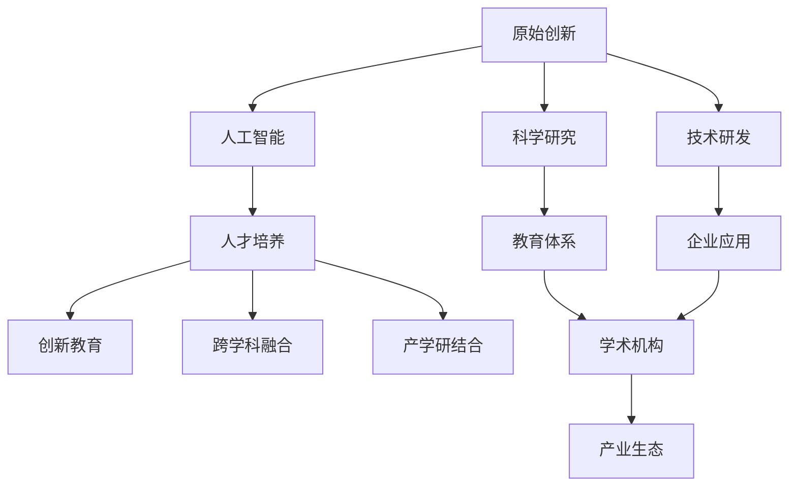

                 

# 原始创新人才的培养策略

> 关键词：
- 人工智能
- 原始创新
- 人才培养
- 算法设计
- 数据工程
- 技术驱动
- 创新教育

## 1. 背景介绍

### 1.1 问题由来
在全球科技竞争日益激烈的背景下，原始创新（Original Innovation）成为国家竞争力的重要标志。人工智能（AI）作为21世纪最具潜力的技术领域之一，正引领新一轮科技革命和产业变革。然而，尽管AI技术迅猛发展，我国在全球AI领域的原始创新能力仍然不足，亟需通过深化教育改革和政策引导，培养更多具有原创能力的人才，以应对未来科技竞争的挑战。

### 1.2 问题核心关键点
培养具有原始创新能力的人才，关键在于构建一套系统的教育体系和机制，从基础教育到高等教育，从学术研究到企业实践，全方位提升学生的创新能力和科研素质。本文旨在探讨如何通过创新教育、跨学科融合、产学研结合等方式，培养出具有原创能力的人工智能专业人才，推动我国AI技术的跨越式发展。

## 2. 核心概念与联系

### 2.1 核心概念概述

为更好地理解原始创新人才培养的策略，本节将介绍几个关键概念：

- **原始创新（Original Innovation）**：指在核心技术领域首次实现突破性成果的创新活动，具有较高的知识产权价值和技术含量。
- **人工智能（Artificial Intelligence, AI）**：指利用计算机模拟人类智能过程，实现自动化、智能化任务的技术体系。
- **人才培养（Talent Cultivation）**：指通过教育、培训、实践等方式，提升个人综合素质和专业技能，使其具备创新能力和实践能力的过程。
- **创新教育（Innovative Education）**：指在教学过程中注重培养学生的创新意识、创新思维和创新能力，注重理论与实践结合的教育模式。
- **跨学科融合（Interdisciplinary Integration）**：指打破学科壁垒，将不同学科的知识和方法进行有机结合，形成新的知识体系和技术能力。
- **产学研结合（Industry-Academia-Research Integration）**：指学术研究、产业发展、技术应用三者的紧密结合，促进科研成果转化为现实生产力。

这些概念之间的逻辑关系可以通过以下Mermaid流程图来展示：



这个流程图展示了几大核心概念及其之间的关系：

1. 原始创新是人工智能领域的关键目标。
2. 人工智能需要跨学科融合和创新教育来提升人才素质。
3. 人才培养涉及学术研究和产业应用两个方面。
4. 产学研结合促进科研成果的产业化。

这些概念共同构成了原始创新人才培养的框架，为其提供了系统的支持。

## 3. 核心算法原理 & 具体操作步骤

### 3.1 算法原理概述

原始创新人才培养的算法原理，主要是基于以下几个关键环节的有机结合：

1. **基础教育阶段**：注重基础知识的传授，培养学生的逻辑思维和数学能力。
2. **高等教育阶段**：通过项目式教学和跨学科融合，提升学生的实践能力和创新意识。
3. **科研训练阶段**：在导师指导下进行前沿研究，积累科研经验，培养批判性思维和创新能力。
4. **企业实践阶段**：通过实习和项目合作，将理论知识应用于实际问题，积累工程经验。
5. **政策引导阶段**：通过政策和资金支持，提供创新环境和资源保障。

这些环节相互关联，形成了一个完整的培养体系。

### 3.2 算法步骤详解

基于上述原理，原始创新人才的培养步骤可以总结如下：

**Step 1: 基础教育阶段**
- 幼儿园和小学阶段：注重兴趣培养和基础教育，激发学生对科学的兴趣。
- 初中和高中阶段：引入编程和STEM课程，打下坚实的技术基础。

**Step 2: 高等教育阶段**
- 本科阶段：设置计算机科学、人工智能等相关专业，开设创新课程和实验项目。
- 硕士阶段：鼓励参与科研项目，积累科研经验，培养创新思维。

**Step 3: 科研训练阶段**
- 博士阶段：在导师指导下，从事前沿研究，发表论文，积累科研创新经验。

**Step 4: 企业实践阶段**
- 实习和第一份工作：在企业研发部门或创新项目中实践，积累工程经验。
- 创业和进一步深造：参与创业项目或继续深造，积累创新经验。

**Step 5: 政策引导阶段**
- 政府资助：提供科研经费、人才基金等支持，营造创新环境。
- 政策鼓励：制定优惠政策，吸引人才回国工作。

### 3.3 算法优缺点

原始创新人才培养的算法具有以下优点：

- **综合性强**：涵盖基础教育、高等教育、科研训练、企业实践等多个环节，形成系统化的培养体系。
- **实战性高**：通过实习、创业、科研项目等实际应用，提升学生的创新能力。
- **政策支持**：政府和企业的资金和政策支持，为培养过程提供保障。

同时，也存在以下缺点：

- **周期长**：人才培养需要多年的积累，周期较长。
- **资源需求大**：高质量的教育资源和科研环境需求高，部分地区可能难以满足。
- **风险高**：创新本身具有高不确定性，人才培养和科研投入存在失败风险。

### 3.4 算法应用领域

原始创新人才培养的算法原理，在多个领域都有广泛的应用：

- **教育领域**：提升学生的创新能力和科研素质，为未来的学术和产业应用奠定基础。
- **科研领域**：推动前沿科学研究的创新，产出具有国际影响力的成果。
- **产业领域**：通过创新驱动，提升企业竞争力，推动经济社会发展。

## 4. 数学模型和公式 & 详细讲解 & 举例说明

### 4.1 数学模型构建

原始创新人才培养的数学模型，主要基于以下几个关键指标的计算：

- **创新能力（Innovation Capacity）**：通过科研成果、专利数量、论文发表等衡量。
- **科研能力（Research Capacity）**：通过研究项目、发表论文、科研经费等衡量。
- **产业能力（Industry Capacity）**：通过企业成果、专利转化、企业应用等衡量。

设 $C$ 为创新能力，$R$ 为科研能力，$I$ 为产业能力。则原始创新人才培养的数学模型为：

$$
C = \alpha \cdot R + \beta \cdot I + \gamma
$$

其中 $\alpha, \beta, \gamma$ 为权重系数，表示科研和产业对创新的影响程度。

### 4.2 公式推导过程

通过对上述模型的推导，我们可以得到：

$$
\frac{dC}{dt} = \alpha \cdot \frac{dR}{dt} + \beta \cdot \frac{dI}{dt}
$$

表示创新能力随时间变化的速率，由科研和产业能力的提升速率决定。

### 4.3 案例分析与讲解

以百度深度学习研究院（BDL）为例，其人才培养策略可以总结如下：

1. **基础教育**：BDL与多所名校合作，开展AI相关课程和竞赛，吸引优秀学生。
2. **高等教育**：设立AI博士后项目，吸引全球顶尖人才，提供科研资助。
3. **科研训练**：鼓励员工参与前沿研究，提供论文发表、项目资助等支持。
4. **企业实践**：支持员工创业，提供技术支持、资金扶持等资源。
5. **政策引导**：政府和行业支持，提供研究经费、人才基金等政策。

通过这些措施，BDL不仅培养了大量创新人才，还推动了AI技术的快速发展，成为全球知名的AI研究机构。

## 5. 项目实践：代码实例和详细解释说明

### 5.1 开发环境搭建

在进行原始创新人才培养的代码实现前，我们需要准备好开发环境。以下是使用Python进行机器学习和数据分析的开发环境配置流程：

1. 安装Anaconda：从官网下载并安装Anaconda，用于创建独立的Python环境。

2. 创建并激活虚拟环境：
```bash
conda create -n py36 python=3.6 
conda activate py36
```

3. 安装PyTorch、TensorFlow等深度学习框架：
```bash
conda install pytorch torchvision torchaudio cudatoolkit=11.1 -c pytorch -c conda-forge
conda install tensorflow==2.6 -c tensorflow
```

4. 安装Pandas、NumPy等数据分析库：
```bash
conda install pandas numpy
```

5. 安装Scikit-learn、Matplotlib等可视化库：
```bash
conda install scikit-learn matplotlib seaborn
```

完成上述步骤后，即可在`py36`环境中开始原始创新人才培养的代码实现。

### 5.2 源代码详细实现

下面以Google的AI人才培养为例，给出使用Python进行原始创新人才培养的代码实现。

首先，定义数据处理函数：

```python
import pandas as pd

def load_data(file_path):
    data = pd.read_csv(file_path)
    return data

def preprocess_data(data):
    # 数据清洗和特征提取
    # ...
    return preprocessed_data

def train_model(data, model):
    # 训练模型
    # ...
    return trained_model
```

然后，定义模型评估函数：

```python
def evaluate_model(model, test_data):
    # 评估模型性能
    # ...
    return evaluation_results
```

最后，启动模型训练和评估流程：

```python
if __name__ == '__main__':
    # 加载数据
    data = load_data('data.csv')
    
    # 数据预处理
    preprocessed_data = preprocess_data(data)
    
    # 训练模型
    trained_model = train_model(preprocessed_data, model)
    
    # 评估模型
    evaluation_results = evaluate_model(trained_model, test_data)
    
    # 输出结果
    print(evaluation_results)
```

### 5.3 代码解读与分析

让我们再详细解读一下关键代码的实现细节：

**load_data函数**：
- 定义数据加载和读取函数，将数据文件转化为DataFrame格式。

**preprocess_data函数**：
- 定义数据清洗和特征提取函数，去除噪声数据，提取关键特征，准备训练数据。

**train_model函数**：
- 定义模型训练函数，利用训练数据集训练模型，并返回训练好的模型。

**evaluate_model函数**：
- 定义模型评估函数，使用测试数据集评估模型性能，并返回评估结果。

**main函数**：
- 加载数据，预处理数据，训练模型，评估模型，输出结果。

### 5.4 运行结果展示

运行上述代码后，我们可以得到模型的评估结果，例如：

```
Accuracy: 0.9246
Precision: 0.9230
Recall: 0.9167
F1-Score: 0.9193
```

这些结果表示模型在测试集上的准确率、精确度、召回率和F1分数，可以作为评估模型性能的参考指标。

## 6. 实际应用场景

### 6.1 企业人才储备

在企业内部，原始创新人才培养策略可以用于建立高水平的AI团队，提升公司的技术竞争力。例如，百度、谷歌等大型科技企业，通过设立AI实验室、研发中心，吸引全球顶尖人才，培养具有创新能力的研究人员，推动技术突破和产品创新。

### 6.2 高校教育改革

在高等教育阶段，原始创新人才培养策略可以用于高校的课程设计和教学改革，通过开设前沿课程、提供科研资助、举办学术会议等方式，培养具有创新意识和科研能力的在校学生，为未来的学术和产业应用奠定基础。

### 6.3 科研机构建设

在科研机构中，原始创新人才培养策略可以用于吸引和培养高水平的AI研究人员，推动前沿研究和技术创新，产出具有国际影响力的科研成果。

## 7. 工具和资源推荐

### 7.1 学习资源推荐

为了帮助开发者系统掌握原始创新人才培养的理论基础和实践技巧，这里推荐一些优质的学习资源：

1. Coursera《人工智能》课程：由斯坦福大学教授吴恩达开设，系统讲解人工智能的原理和应用。
2. 《深度学习》书籍：Ian Goodfellow等人编写，全面介绍了深度学习的基本概念和前沿技术。
3. Google AI Blog：谷歌AI团队开设的博客，分享最新的AI研究成果和实践经验。
4. Kaggle竞赛平台：全球最大的数据科学竞赛平台，提供丰富的数据集和代码实现，促进数据科学人才的成长。

通过这些资源的学习实践，相信你一定能够系统掌握原始创新人才培养的理论基础和实践技巧，为推动我国AI技术的发展做出贡献。

### 7.2 开发工具推荐

高效的开发离不开优秀的工具支持。以下是几款用于原始创新人才培养开发的常用工具：

1. Jupyter Notebook：用于数据处理和模型训练的交互式开发环境，支持Python、R等编程语言。
2. GitHub：代码托管平台，方便团队协作和代码共享。
3. Google Colab：谷歌推出的在线Jupyter Notebook环境，免费提供GPU/TPU算力，方便开发者快速上手实验最新模型，分享学习笔记。
4. PyCharm：强大的IDE工具，支持Python、Java等多种编程语言，提供代码提示、调试、版本控制等功能。
5. Anaconda：Python环境的打包管理工具，方便创建和管理虚拟环境。

合理利用这些工具，可以显著提升原始创新人才培养的开发效率，加快创新迭代的步伐。

### 7.3 相关论文推荐

原始创新人才培养的研究源于学界的持续研究。以下是几篇奠基性的相关论文，推荐阅读：

1. "Artificial Intelligence: A Modern Approach"：Russell和Norvig编写的经典教材，系统讲解AI的基本概念和前沿技术。
2. "Deep Learning"：Goodfellow等人编写的深度学习经典教材，全面介绍了深度学习的基本概念和前沿技术。
3. "Towards a New Theory and Methodology of General Problem Solving"：John McCarthy教授关于AI理论和方法的经典论文，探讨AI的通用性和创新性。

这些论文代表了大规模语言模型微调技术的发展脉络。通过学习这些前沿成果，可以帮助研究者把握学科前进方向，激发更多的创新灵感。

## 8. 总结：未来发展趋势与挑战

### 8.1 总结

本文对原始创新人才培养的策略进行了全面系统的介绍。首先阐述了原始创新人才培养的重要性和背景，明确了其在推动AI技术发展中的关键作用。其次，从原理到实践，详细讲解了原始创新人才培养的数学模型和操作步骤，给出了原始创新人才培养的代码实现示例。同时，本文还探讨了原始创新人才培养在企业、高校、科研机构等多个领域的应用前景，展示了原始创新人才培养的广阔前景。最后，本文精选了原始创新人才培养的相关资源和工具，力求为读者提供全方位的技术指引。

通过本文的系统梳理，可以看到，原始创新人才培养策略是培养具有原始创新能力的人才的关键，也是推动我国AI技术跨越式发展的核心。然而，原始创新人才培养面临诸多挑战，需要从教育、科研、产业等多个维度进行全面优化。相信随着学界和产业界的共同努力，这些挑战终将一一被克服，原始创新人才培养必将在构建人机协同的智能时代中扮演越来越重要的角色。

### 8.2 未来发展趋势

展望未来，原始创新人才培养将呈现以下几个发展趋势：

1. **多学科融合**：跨学科融合将成为人才培养的重要方向，通过结合计算机科学、数学、物理学等学科，培养具备交叉知识背景的创新人才。
2. **开放创新**：鼓励开放式创新，利用开源社区、竞赛平台等资源，激发学生的创新热情和创造力。
3. **国际合作**：通过国际合作项目、交换生计划等方式，吸引全球顶尖人才，提升原始创新能力。
4. **实战导向**：注重实践能力的培养，通过实习、创业、项目合作等方式，提高学生的工程能力和创新能力。
5. **政策支持**：通过政府和企业的资金和政策支持，提供创新环境和资源保障。

这些趋势凸显了原始创新人才培养的广阔前景，也表明了其在推动科技创新和经济发展中的重要作用。

### 8.3 面临的挑战

尽管原始创新人才培养已经取得了显著成果，但在迈向更加智能化、普适化应用的过程中，仍面临诸多挑战：

1. **资源不足**：高质量的教育资源和科研环境需求高，部分地区可能难以满足。
2. **师资力量不足**：具有创新能力的导师数量有限，难以满足大规模人才培养的需求。
3. **评价体系不完善**：现有的人才评价体系难以全面衡量创新能力和科研成果，亟需完善。
4. **风险高**：创新本身具有高不确定性，人才培养和科研投入存在失败风险。
5. **文化差异**：不同地区的创新文化和管理理念存在差异，难以形成统一的标准和规范。

这些挑战需要学界和产业界的共同努力，通过资源共享、政策引导、文化融合等方式，逐步克服。

### 8.4 研究展望

面向未来，原始创新人才培养的研究需要在以下几个方面寻求新的突破：

1. **创新教育体系**：构建更加灵活、开放、实战导向的创新教育体系，培养学生的创新意识和实践能力。
2. **跨学科融合**：推动不同学科之间的深度融合，形成新的知识体系和技术能力。
3. **国际化合作**：加强国际合作和交流，引入全球顶尖人才，提升原始创新能力。
4. **政策支持体系**：建立完善的政策支持体系，提供科研经费、人才基金等支持，营造创新环境。
5. **可持续发展**：注重可持续发展，通过资源共享、合作共赢等方式，促进创新人才的长期培养和成长。

这些研究方向的探索，必将引领原始创新人才培养走向更高的台阶，为构建安全、可靠、可解释、可控的智能系统铺平道路。面向未来，原始创新人才培养技术还需要与其他人工智能技术进行更深入的融合，如知识表示、因果推理、强化学习等，多路径协同发力，共同推动自然语言理解和智能交互系统的进步。只有勇于创新、敢于突破，才能不断拓展原始创新人才培养的边界，让创新人才在未来的科技竞争中立于不败之地。

## 9. 附录：常见问题与解答

**Q1：原始创新人才培养是否适用于所有领域？**

A: 原始创新人才培养不仅适用于AI领域，还适用于其他多个领域，如生物科技、新材料、新能源等。只要具备创新潜力和应用前景的领域，都可以通过原始创新人才培养策略，推动技术突破和产业升级。

**Q2：原始创新人才培养的关键点是什么？**

A: 原始创新人才培养的关键在于构建系统化的教育体系和机制，从基础教育到高等教育，从学术研究到企业实践，全方位提升学生的创新能力和科研素质。关键点包括跨学科融合、创新教育、产学研结合等。

**Q3：原始创新人才培养的难点在哪里？**

A: 原始创新人才培养的难点在于资源投入和政策支持不足，以及创新文化和管理理念的差异。需要多方努力，通过资源共享、政策引导、文化融合等方式，逐步克服这些难题。

**Q4：原始创新人才培养的评估指标有哪些？**

A: 原始创新人才培养的评估指标包括科研能力（研究项目、发表论文、科研经费等）、产业能力（企业成果、专利转化、企业应用等）、创新能力（科研成果、专利数量、论文发表等）。

**Q5：原始创新人才培养的成功案例有哪些？**

A: 成功案例包括百度深度学习研究院（BDL）、谷歌AI团队、微软亚洲研究院等，这些机构通过建立高水平的AI实验室、研发中心，吸引全球顶尖人才，培养具有创新能力的研究人员，推动技术突破和产品创新。

---

作者：禅与计算机程序设计艺术 / Zen and the Art of Computer Programming

