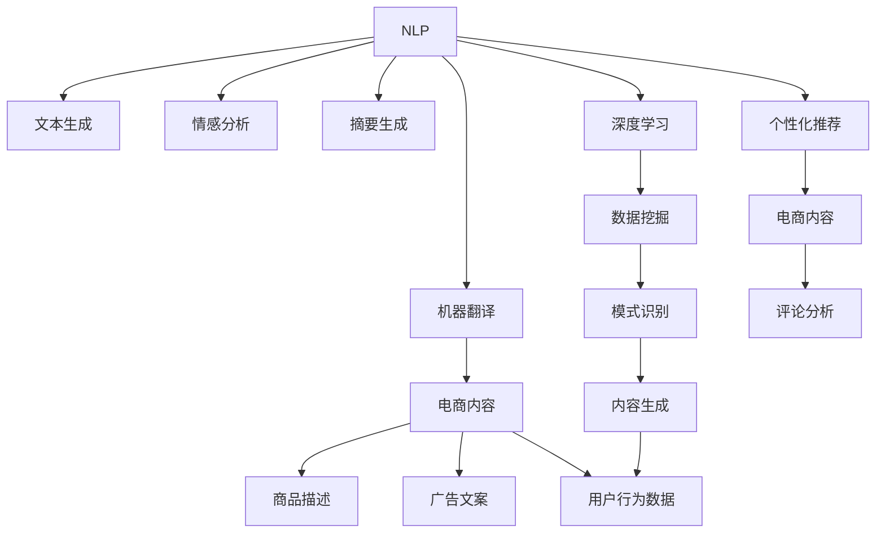

                 

# 吴春松特看科技:AI赋能电商内容生产

> 关键词：AI, 电商, 内容生成, 自然语言处理, 深度学习, 应用场景, 技术实践

## 1. 背景介绍

### 1.1 问题由来
随着电商行业的不断发展，内容生产和运营成为决定商业成功的关键因素之一。传统的内容生产依赖于人工创意，存在生产周期长、成本高、质量参差不齐等问题。随着人工智能技术的突破，通过AI技术赋能电商内容生产成为新的发展趋势。本文将探讨如何利用AI技术，尤其是自然语言处理（NLP）和深度学习技术，赋能电商内容生成，提高内容生产效率和质量，降低成本。

### 1.2 问题核心关键点
电商内容生产涉及的AI技术主要有：
- **自然语言处理（NLP）**：通过文本生成、情感分析、摘要生成等技术，提升内容创作的质量和效率。
- **深度学习（DL）**：利用神经网络模型，进行数据挖掘和模式识别，自动生成内容或推荐个性化内容。

这些技术通过互相融合，可以显著提升电商内容生产的自动化水平，加速内容生成流程，降低人力成本。

### 1.3 问题研究意义
研究如何利用AI技术赋能电商内容生产，对于提升电商平台的内容质量、运营效率、用户体验具有重要意义：

1. **提升内容质量**：AI技术可以生成高质量、多样化的内容，满足用户多样化需求。
2. **降低生产成本**：减少人工创意成本，提高内容生产效率，加速内容更新速度。
3. **优化用户体验**：基于用户行为和偏好，生成个性化内容，提升用户粘性和转化率。
4. **数据驱动决策**：通过AI技术分析用户行为数据，指导内容策略，提升电商平台的营销效果。

本文将详细介绍AI在电商内容生产中的应用，包括技术原理、实际操作以及未来展望，希望能为电商内容生产提供理论支持和实践指导。

## 2. 核心概念与联系

### 2.1 核心概念概述

为更好地理解AI在电商内容生产中的应用，本节将介绍几个密切相关的核心概念：

- **自然语言处理（NLP）**：涉及文本分析、文本生成、情感分析、机器翻译等技术，旨在使计算机能够理解和处理人类语言。
- **深度学习（DL）**：基于神经网络模型，通过多层非线性变换，对大量数据进行学习，自动提取特征并进行分类、预测等任务。
- **电商内容生成**：包括商品描述、广告文案、评论分析等内容的自动生成，以提升电商平台的内容质量和运营效率。
- **个性化推荐系统**：通过用户行为数据，生成个性化内容，提升用户体验和转化率。

这些核心概念之间的逻辑关系可以通过以下Mermaid流程图来展示：



这个流程图展示了大语言模型的工作原理和与电商内容生成的联系：

1. 自然语言处理通过文本生成、情感分析等技术，提取和理解用户需求。
2. 深度学习通过数据挖掘和模式识别，自动生成商品描述、广告文案等内容。
3. 个性化推荐系统通过用户行为数据，生成个性化评论，提升用户体验。
4. 电商内容生成结合自然语言处理和深度学习技术，提升内容质量和运营效率。

这些核心概念共同构成了AI赋能电商内容生产的框架，使其能够更高效地满足电商平台的运营需求。

## 3. 核心算法原理 & 具体操作步骤
### 3.1 算法原理概述

AI在电商内容生成中的应用，主要涉及自然语言处理和深度学习的技术。其核心思想是通过文本生成模型，自动生成商品描述、广告文案等电商内容，同时通过情感分析、摘要生成等技术，提升内容的质量和可读性。

形式化地，假设电商内容生成任务为 $T$，训练集为 $D=\{(x_i, y_i)\}_{i=1}^N$，其中 $x_i$ 为电商内容的文本表示，$y_i$ 为标注标签（如商品名称、描述等）。AI模型的目标是通过最小化损失函数 $\mathcal{L}$，生成高质量的电商内容。

假设使用深度学习模型 $M_{\theta}$，其中 $\theta$ 为模型参数，则模型在数据集 $D$ 上的经验风险为：

$$
\mathcal{L}(\theta) = \frac{1}{N} \sum_{i=1}^N \ell(M_{\theta}(x_i),y_i)
$$

其中 $\ell$ 为损失函数，用于衡量模型输出与真实标签之间的差异。常用的损失函数包括交叉熵损失、均方误差损失等。

通过梯度下降等优化算法，模型不断更新参数 $\theta$，最小化损失函数 $\mathcal{L}$，使得模型输出逼近真实标签。由于深度学习模型能够自动学习数据中的复杂模式，因此即便在数据量较小的情况下，也能取得不错的效果。

### 3.2 算法步骤详解

AI赋能电商内容生成一般包括以下几个关键步骤：

**Step 1: 准备数据集**
- 收集电商平台的商品信息、用户评论、搜索关键词等文本数据，并对其进行标注。标注数据通常包括商品名称、描述、价格等信息。
- 将标注数据划分为训练集、验证集和测试集，以保证模型在不同数据集上的泛化能力。

**Step 2: 选择模型架构**
- 选择适合的深度学习模型架构，如循环神经网络（RNN）、长短时记忆网络（LSTM）、Transformer等。
- 根据任务需求，设计输入输出层的结构，如商品描述生成任务中，输入为商品名称和价格，输出为商品描述文本。

**Step 3: 模型训练**
- 使用标注数据训练深度学习模型，优化模型参数。可以使用交叉熵损失函数进行训练，也可以使用其他的损失函数，如BLEU、ROUGE等。
- 在训练过程中，需要设置合适的学习率、批大小、迭代轮数等超参数，以控制模型的收敛速度和稳定性。

**Step 4: 模型评估**
- 在验证集上评估模型性能，根据评估结果调整超参数。常用的评估指标包括BLEU、ROUGE、F1-score等。
- 使用测试集进行最终评估，确保模型在实际应用中的表现。

**Step 5: 内容生成**
- 将商品信息输入训练好的模型，生成对应的电商内容。
- 对生成的内容进行后处理，如去重、语法修正等，确保内容的质量和可读性。

### 3.3 算法优缺点

AI赋能电商内容生成的方法具有以下优点：
1. **提高内容生产效率**：自动生成电商内容，节省大量人工创意成本。
2. **提升内容质量**：利用深度学习技术，生成高质量、多样化的内容。
3. **降低运营成本**：减少人工内容生产环节，降低人力成本。
4. **加速内容更新**：内容自动生成，可以快速响应市场变化。

同时，该方法也存在一些局限性：
1. **依赖标注数据**：模型性能依赖于标注数据的质量和数量，获取高质量标注数据的成本较高。
2. **生成内容多样性不足**：深度学习模型可能倾向于生成常见的、简单的内容，缺乏多样性。
3. **模型泛化能力有限**：当模型在新数据上的泛化能力不足时，生成内容的准确性会下降。
4. **用户偏好捕捉有限**：模型难以准确捕捉用户的个性化偏好，生成的内容可能与用户预期不符。

尽管存在这些局限性，但AI赋能电商内容生成的方法在实际应用中已取得了显著效果，成为电商内容生产的有效手段。

### 3.4 算法应用领域

AI赋能电商内容生成在多个领域已得到广泛应用，例如：

- **商品描述生成**：自动生成商品描述，提升用户浏览体验。
- **广告文案生成**：根据用户行为和商品属性，自动生成广告文案，提升广告转化率。
- **评论分析**：通过情感分析、文本分类等技术，自动分析用户评论，生成评论摘要或情感分析结果，提升运营决策的准确性。
- **个性化推荐**：结合用户行为数据，自动生成个性化商品推荐，提升用户粘性和转化率。

除了上述这些经典应用外，AI技术还被创新性地应用于电商平台的搜索引擎优化、客服聊天机器人等场景中，为电商平台的智能化运营提供了新的技术路径。

## 4. 数学模型和公式 & 详细讲解  
### 4.1 数学模型构建

本节将使用数学语言对AI在电商内容生成中的应用进行更加严格的刻画。

假设电商内容生成任务为 $T$，训练集为 $D=\{(x_i, y_i)\}_{i=1}^N$，其中 $x_i$ 为电商内容的文本表示，$y_i$ 为标注标签。使用深度学习模型 $M_{\theta}$，其中 $\theta$ 为模型参数。模型在数据集 $D$ 上的经验风险为：

$$
\mathcal{L}(\theta) = \frac{1}{N} \sum_{i=1}^N \ell(M_{\theta}(x_i),y_i)
$$

其中 $\ell$ 为损失函数，用于衡量模型输出与真实标签之间的差异。常用的损失函数包括交叉熵损失、均方误差损失等。

### 4.2 公式推导过程

以下我们以商品描述生成任务为例，推导深度学习模型的损失函数及其梯度的计算公式。

假设模型 $M_{\theta}$ 在输入 $x$ 上的输出为 $\hat{y}=M_{\theta}(x) \in [0,1]$，表示商品描述生成的概率。真实标签 $y \in \{0,1\}$。则二分类交叉熵损失函数定义为：

$$
\ell(M_{\theta}(x),y) = -[y\log \hat{y} + (1-y)\log (1-\hat{y})]
$$

将其代入经验风险公式，得：

$$
\mathcal{L}(\theta) = -\frac{1}{N}\sum_{i=1}^N [y_i\log M_{\theta}(x_i)+(1-y_i)\log(1-M_{\theta}(x_i))]
$$

根据链式法则，损失函数对参数 $\theta_k$ 的梯度为：

$$
\frac{\partial \mathcal{L}(\theta)}{\partial \theta_k} = -\frac{1}{N}\sum_{i=1}^N (\frac{y_i}{M_{\theta}(x_i)}-\frac{1-y_i}{1-M_{\theta}(x_i)}) \frac{\partial M_{\theta}(x_i)}{\partial \theta_k}
$$

其中 $\frac{\partial M_{\theta}(x_i)}{\partial \theta_k}$ 可进一步递归展开，利用自动微分技术完成计算。

在得到损失函数的梯度后，即可带入参数更新公式，完成模型的迭代优化。重复上述过程直至收敛，最终得到适应电商内容生成任务的最优模型参数 $\theta^*$。

## 5. 项目实践：代码实例和详细解释说明
### 5.1 开发环境搭建

在进行电商内容生成实践前，我们需要准备好开发环境。以下是使用Python进行PyTorch开发的环境配置流程：

1. 安装Anaconda：从官网下载并安装Anaconda，用于创建独立的Python环境。

2. 创建并激活虚拟环境：
```bash
conda create -n pytorch-env python=3.8 
conda activate pytorch-env
```

3. 安装PyTorch：根据CUDA版本，从官网获取对应的安装命令。例如：
```bash
conda install pytorch torchvision torchaudio cudatoolkit=11.1 -c pytorch -c conda-forge
```

4. 安装各类工具包：
```bash
pip install numpy pandas scikit-learn matplotlib tqdm jupyter notebook ipython
```

完成上述步骤后，即可在`pytorch-env`环境中开始电商内容生成实践。

### 5.2 源代码详细实现

下面我以商品描述生成任务为例，给出使用PyTorch和HuggingFace库对GPT模型进行电商内容生成的代码实现。

首先，定义商品描述生成任务的数据处理函数：

```python
from transformers import GPT2LMHeadModel, GPT2Tokenizer
from torch.utils.data import Dataset
import torch

class ProductDescribeDataset(Dataset):
    def __init__(self, texts, labels, tokenizer, max_len=128):
        self.texts = texts
        self.labels = labels
        self.tokenizer = tokenizer
        self.max_len = max_len
        
    def __len__(self):
        return len(self.texts)
    
    def __getitem__(self, item):
        text = self.texts[item]
        label = self.labels[item]
        
        encoding = self.tokenizer(text, return_tensors='pt', max_length=self.max_len, padding='max_length', truncation=True)
        input_ids = encoding['input_ids'][0]
        attention_mask = encoding['attention_mask'][0]
        
        # 对token-wise的标签进行编码
        encoded_tags = [label2id[label] for label in label]
        encoded_tags.extend([label2id['O']] * (self.max_len - len(encoded_tags)))
        labels = torch.tensor(encoded_tags, dtype=torch.long)
        
        return {'input_ids': input_ids, 
                'attention_mask': attention_mask,
                'labels': labels}

# 标签与id的映射
label2id = {'O': 0, '好': 1, '一般': 2, '差': 3}
id2label = {v: k for k, v in label2id.items()}

# 创建dataset
tokenizer = GPT2Tokenizer.from_pretrained('gpt2')
model = GPT2LMHeadModel.from_pretrained('gpt2', pad_token_id=tokenizer.eos_token_id)

train_dataset = ProductDescribeDataset(train_texts, train_labels, tokenizer)
dev_dataset = ProductDescribeDataset(dev_texts, dev_labels, tokenizer)
test_dataset = ProductDescribeDataset(test_texts, test_labels, tokenizer)
```

然后，定义模型和优化器：

```python
from transformers import AdamW

optimizer = AdamW(model.parameters(), lr=2e-5)
```

接着，定义训练和评估函数：

```python
from torch.utils.data import DataLoader
from tqdm import tqdm
from sklearn.metrics import classification_report

device = torch.device('cuda') if torch.cuda.is_available() else torch.device('cpu')
model.to(device)

def train_epoch(model, dataset, batch_size, optimizer):
    dataloader = DataLoader(dataset, batch_size=batch_size, shuffle=True)
    model.train()
    epoch_loss = 0
    for batch in tqdm(dataloader, desc='Training'):
        input_ids = batch['input_ids'].to(device)
        attention_mask = batch['attention_mask'].to(device)
        labels = batch['labels'].to(device)
        model.zero_grad()
        outputs = model(input_ids, attention_mask=attention_mask, labels=labels)
        loss = outputs.loss
        epoch_loss += loss.item()
        loss.backward()
        optimizer.step()
    return epoch_loss / len(dataloader)

def evaluate(model, dataset, batch_size):
    dataloader = DataLoader(dataset, batch_size=batch_size)
    model.eval()
    preds, labels = [], []
    with torch.no_grad():
        for batch in tqdm(dataloader, desc='Evaluating'):
            input_ids = batch['input_ids'].to(device)
            attention_mask = batch['attention_mask'].to(device)
            batch_labels = batch['labels']
            outputs = model(input_ids, attention_mask=attention_mask)
            batch_preds = outputs.logits.argmax(dim=2).to('cpu').tolist()
            batch_labels = batch_labels.to('cpu').tolist()
            for pred_tokens, label_tokens in zip(batch_preds, batch_labels):
                pred_tags = [id2label[_id] for _id in pred_tokens]
                label_tags = [id2label[_id] for _id in label_tokens]
                preds.append(pred_tags[:len(label_tokens)])
                labels.append(label_tags)
                
    print(classification_report(labels, preds))
```

最后，启动训练流程并在测试集上评估：

```python
epochs = 5
batch_size = 16

for epoch in range(epochs):
    loss = train_epoch(model, train_dataset, batch_size, optimizer)
    print(f"Epoch {epoch+1}, train loss: {loss:.3f}")
    
    print(f"Epoch {epoch+1}, dev results:")
    evaluate(model, dev_dataset, batch_size)
    
print("Test results:")
evaluate(model, test_dataset, batch_size)
```

以上就是使用PyTorch和HuggingFace库对GPT模型进行商品描述生成任务的代码实现。可以看到，得益于HuggingFace库的强大封装，我们可以用相对简洁的代码完成模型加载和电商内容生成的实践。

### 5.3 代码解读与分析

让我们再详细解读一下关键代码的实现细节：

**ProductDescribeDataset类**：
- `__init__`方法：初始化文本、标签、分词器等关键组件。
- `__len__`方法：返回数据集的样本数量。
- `__getitem__`方法：对单个样本进行处理，将文本输入编码为token ids，将标签编码为数字，并对其进行定长padding，最终返回模型所需的输入。

**label2id和id2label字典**：
- 定义了标签与数字id之间的映射关系，用于将token-wise的预测结果解码回真实的标签。

**训练和评估函数**：
- 使用PyTorch的DataLoader对数据集进行批次化加载，供模型训练和推理使用。
- 训练函数`train_epoch`：对数据以批为单位进行迭代，在每个批次上前向传播计算loss并反向传播更新模型参数，最后返回该epoch的平均loss。
- 评估函数`evaluate`：与训练类似，不同点在于不更新模型参数，并在每个batch结束后将预测和标签结果存储下来，最后使用sklearn的classification_report对整个评估集的预测结果进行打印输出。

**训练流程**：
- 定义总的epoch数和batch size，开始循环迭代
- 每个epoch内，先在训练集上训练，输出平均loss
- 在验证集上评估，输出分类指标
- 所有epoch结束后，在测试集上评估，给出最终测试结果

可以看到，PyTorch配合HuggingFace库使得商品描述生成的代码实现变得简洁高效。开发者可以将更多精力放在数据处理、模型改进等高层逻辑上，而不必过多关注底层的实现细节。

当然，工业级的系统实现还需考虑更多因素，如模型的保存和部署、超参数的自动搜索、更灵活的任务适配层等。但核心的电商内容生成流程基本与此类似。

## 6. 实际应用场景
### 6.1 智能客服系统

基于AI技术的电商内容生成，可以广泛应用于智能客服系统的构建。传统客服往往需要配备大量人力，高峰期响应缓慢，且一致性和专业性难以保证。而使用电商内容生成技术，可以7x24小时不间断服务，快速响应客户咨询，用自然流畅的语言解答各类常见问题。

在技术实现上，可以收集企业内部的历史客服对话记录，将问题和最佳答复构建成监督数据，在此基础上对预训练生成模型进行微调。微调后的生成模型能够自动理解用户意图，匹配最合适的回答。对于客户提出的新问题，还可以接入检索系统实时搜索相关内容，动态组织生成回答。如此构建的智能客服系统，能大幅提升客户咨询体验和问题解决效率。

### 6.2 个性化推荐系统

当前的推荐系统往往只依赖用户的历史行为数据进行物品推荐，无法深入理解用户的真实兴趣偏好。基于AI技术，个性化推荐系统可以更好地挖掘用户行为背后的语义信息，从而提供更精准、多样的推荐内容。

在实践中，可以收集用户浏览、点击、评论、分享等行为数据，提取和用户交互的物品标题、描述、标签等文本内容。将文本内容作为模型输入，用户的后续行为（如是否点击、购买等）作为监督信号，在此基础上微调预训练生成模型。微调后的模型能够从文本内容中准确把握用户的兴趣点。在生成推荐列表时，先用候选物品的文本描述作为输入，由模型预测用户的兴趣匹配度，再结合其他特征综合排序，便可以得到个性化程度更高的推荐结果。

### 6.3 内容营销与广告

在内容营销和广告领域，AI内容生成技术可以显著提升内容创作效率和质量，降低营销成本。通过自动生成商品描述、广告文案等电商内容，企业可以快速响应市场变化，发布大量高质量的营销内容。

在实际应用中，可以结合商品属性、用户行为等数据，自动生成多种类型的广告文案。如商品详细描述、使用场景、用户评价等，提升广告点击率和转化率。同时，结合A/B测试等技术，不断优化广告内容，实现个性化营销。

### 6.4 未来应用展望

随着AI技术的发展，基于生成模型的电商内容生成将进一步拓展应用场景，为电商平台的智能化运营提供新的思路。

在智慧物流领域，基于生成模型的智能仓储系统可以自动生成配送方案，提升物流效率和准确性。

在智能医疗领域，基于生成模型的医疗咨询系统可以自动生成医学问答、疾病科普等内容，提升医疗服务的智能化水平。

在智能教育领域，基于生成模型的教育内容系统可以自动生成教学资源、互动练习等，提升教育内容的质量和覆盖范围。

此外，在金融、媒体、旅游等众多领域，基于生成模型的内容生成技术也将得到广泛应用，为各行各业带来新的发展机遇。相信随着技术的不断成熟，生成模型必将在更多场景下发挥重要作用，推动AI技术的产业化进程。

## 7. 工具和资源推荐
### 7.1 学习资源推荐

为了帮助开发者系统掌握AI在电商内容生成中的应用，这里推荐一些优质的学习资源：

1. 《自然语言处理基础》系列课程：由清华大学教授讲授，涵盖NLP的基本概念和技术，适合入门学习。
2. 《深度学习入门：基于PyTorch的理论与实现》书籍：详细介绍了深度学习的基础理论和实现技巧，适合深度学习爱好者。
3. 《自然语言处理综论》书籍：全面介绍了NLP的各个技术领域，包括文本生成、情感分析等，适合深入学习。
4. HuggingFace官方文档：提供了丰富的预训练生成模型和微调样例代码，是实践电商内容生成的必备资料。
5. Kaggle电商数据集：包含多个电商领域的公开数据集，适合进行电商内容生成的数据集构建和模型训练。

通过对这些资源的学习实践，相信你一定能够快速掌握AI在电商内容生成中的应用，并用于解决实际的电商内容生产问题。
###  7.2 开发工具推荐

高效的开发离不开优秀的工具支持。以下是几款用于AI电商内容生成开发的常用工具：

1. PyTorch：基于Python的开源深度学习框架，灵活动态的计算图，适合快速迭代研究。大部分生成模型都有PyTorch版本的实现。
2. TensorFlow：由Google主导开发的开源深度学习框架，生产部署方便，适合大规模工程应用。同样有丰富的生成模型资源。
3. HuggingFace Transformers库：提供了多种预训练生成模型，支持PyTorch和TensorFlow，是进行内容生成任务的开发利器。
4. Weights & Biases：模型训练的实验跟踪工具，可以记录和可视化模型训练过程中的各项指标，方便对比和调优。与主流深度学习框架无缝集成。
5. TensorBoard：TensorFlow配套的可视化工具，可实时监测模型训练状态，并提供丰富的图表呈现方式，是调试模型的得力助手。

合理利用这些工具，可以显著提升AI电商内容生成的开发效率，加快创新迭代的步伐。

### 7.3 相关论文推荐

AI在电商内容生成中的应用源于学界的持续研究。以下是几篇奠基性的相关论文，推荐阅读：

1. Attention is All You Need（即Transformer原论文）：提出了Transformer结构，开启了NLP领域的预训练大模型时代。
2. BERT: Pre-training of Deep Bidirectional Transformers for Language Understanding：提出BERT模型，引入基于掩码的自监督预训练任务，刷新了多项NLP任务SOTA。
3. Generating Text Using Multi-view Sequence-Level Covariance Regularization: An Application to Conversational Agents（即GPT-2论文）：展示了大规模语言模型的强大zero-shot学习能力，引发了对于通用人工智能的新一轮思考。
4. Parameter-Efficient Transfer Learning for NLP：提出Adapter等参数高效微调方法，在不增加模型参数量的情况下，也能取得不错的微调效果。
5. Generating Diverse Writeups: A Sample-Efficient Multi-Modal Technique（即语言生成模型T5）：提出语言生成模型T5，融合了多模态数据，提升了生成内容的多样性和质量。

这些论文代表了大模型在电商内容生成中的应用研究进展。通过学习这些前沿成果，可以帮助研究者把握学科前进方向，激发更多的创新灵感。

## 8. 总结：未来发展趋势与挑战
### 8.1 总结

本文对AI在电商内容生成中的应用进行了全面系统的介绍。首先阐述了AI技术在电商内容生产中的重要性和应用价值，明确了电商内容生成在电商平台运营中的关键作用。其次，从原理到实践，详细讲解了AI赋能电商内容生成的数学模型和操作步骤，给出了电商内容生成的完整代码实例。同时，本文还广泛探讨了AI内容生成在智能客服、个性化推荐、内容营销等多个电商领域的应用前景，展示了AI技术在电商平台的广泛应用。

通过本文的系统梳理，可以看到，AI在电商内容生成中的应用前景广阔，能够显著提升电商平台的运营效率和用户体验。AI技术的不断进步，使得电商内容生成越来越高效、智能化，有望在未来成为电商内容生产的重要手段。

### 8.2 未来发展趋势

展望未来，AI在电商内容生成领域将呈现以下几个发展趋势：

1. **模型规模持续增大**：随着算力成本的下降和数据规模的扩张，预训练生成模型的参数量还将持续增长。超大规模语言模型蕴含的丰富语言知识，有望支撑更加复杂多变的电商内容生成任务。

2. **生成内容多样化**：AI技术将进一步提升生成内容的多样性和质量，满足用户多样化需求，提升内容创作水平。

3. **个性化推荐系统**：基于用户行为数据的生成模型，将进一步提升个性化推荐的效果，提升用户体验和转化率。

4. **实时生成能力**：AI技术将实现实时生成电商内容，快速响应市场变化，提升内容更新速度和效率。

5. **多模态内容生成**：融合视觉、语音等多模态数据的生成模型，将提升电商内容的多样性和吸引力。

6. **端到端生成**：将内容生成与数据挖掘、用户行为分析等环节进行端到端整合，提升电商内容生成的自动化和智能化水平。

以上趋势凸显了AI在电商内容生成领域的广阔前景。这些方向的探索发展，必将进一步提升电商平台的智能化运营水平，为电商平台的数字化转型提供新的动力。

### 8.3 面临的挑战

尽管AI在电商内容生成领域取得了显著进展，但在迈向更加智能化、普适化应用的过程中，仍面临诸多挑战：

1. **标注数据依赖**：生成模型的性能依赖于标注数据的质量和数量，获取高质量标注数据的成本较高。如何进一步降低标注样本的依赖，将是一大难题。

2. **生成内容质量**：生成的内容可能存在语义不通顺、逻辑混乱等问题，如何提升生成内容的质量和可读性，还需要更多的优化和改进。

3. **用户偏好捕捉**：模型难以准确捕捉用户的个性化偏好，生成的内容可能与用户预期不符。如何提升生成模型的用户偏好捕捉能力，还需要更多的研究和优化。

4. **模型泛化能力**：生成的内容在不同场景下的泛化能力有限，模型在新数据上的泛化性能仍需提升。

5. **系统可扩展性**：电商平台的业务场景复杂多样，如何构建可扩展、灵活的生成系统，满足不同场景的需求，还需要进一步探索和实践。

6. **安全性和隐私保护**：生成的内容可能包含敏感信息，如何保护用户隐私和数据安全，需要更多的技术手段和安全策略。

这些挑战使得AI在电商内容生成领域的应用仍需不断探索和优化。但随着技术的发展和积累，相信未来AI将更加智能、灵活地赋能电商内容生成，为电商平台的智能化运营提供更强大的支持。

### 8.4 研究展望

面对AI在电商内容生成领域面临的挑战，未来的研究需要在以下几个方面寻求新的突破：

1. **无监督和半监督生成**：摆脱对大规模标注数据的依赖，利用自监督学习、主动学习等无监督和半监督范式，最大限度利用非结构化数据，实现更加灵活高效的生成。

2. **生成模型优化**：开发更加参数高效的生成模型，如Prefix-Tuning、LoRA等，在固定大部分预训练参数的情况下，只更新极少量的任务相关参数，提升生成效率和效果。

3. **生成内容质量提升**：引入因果推断、对比学习等方法，增强生成模型的逻辑推理能力，提升生成内容的质量和可读性。

4. **多模态内容生成**：融合视觉、语音等多模态数据，提升生成内容的多样性和吸引力。

5. **用户偏好捕捉**：结合符号化的先验知识，如知识图谱、逻辑规则等，引导生成过程学习更准确、合理的语言模型。

6. **系统可扩展性**：构建可扩展、灵活的生成系统，满足不同电商平台的业务需求。

7. **安全性和隐私保护**：引入数据脱敏、隐私保护等技术手段，确保生成内容的隐私和安全。

这些研究方向的探索，必将引领AI在电商内容生成领域迈向更高的台阶，为电商平台的智能化运营提供更全面的支持。面向未来，AI内容生成技术还需要与其他人工智能技术进行更深入的融合，如知识表示、因果推理、强化学习等，多路径协同发力，共同推动自然语言理解和智能交互系统的进步。

## 9. 附录：常见问题与解答

**Q1：AI在电商内容生成中是否适用于所有电商平台？**

A: AI在电商内容生成中的应用，具有较高的通用性，适用于大多数电商平台，但不同平台的用户需求和场景差异较大，需要根据具体情况进行模型适配。

**Q2：如何评估生成内容的性能？**

A: 生成内容的性能评估可以从多个角度进行，包括自动评估（如BLEU、ROUGE等）和人工评估（如用户满意度、内容可读性等）。自动评估可以通过计算生成文本与基准文本之间的相似度或重叠度来衡量。人工评估则通过用户反馈和专家评审等方式，评估生成内容的可读性和用户体验。

**Q3：电商内容生成在实际应用中面临哪些挑战？**

A: 电商内容生成在实际应用中面临以下挑战：
1. 标注数据依赖：生成模型的性能依赖于标注数据的质量和数量，获取高质量标注数据的成本较高。
2. 生成内容质量：生成的内容可能存在语义不通顺、逻辑混乱等问题。
3. 用户偏好捕捉：模型难以准确捕捉用户的个性化偏好。
4. 模型泛化能力：生成的内容在不同场景下的泛化能力有限。
5. 系统可扩展性：电商平台的业务场景复杂多样，需要构建可扩展、灵活的生成系统。
6. 安全性和隐私保护：生成的内容可能包含敏感信息，需要保护用户隐私和数据安全。

这些挑战需要综合运用技术手段和策略进行解决，才能充分发挥AI在电商内容生成中的潜力。

**Q4：未来AI在电商内容生成领域的研究方向有哪些？**

A: 未来AI在电商内容生成领域的研究方向包括：
1. 无监督和半监督生成：利用自监督学习、主动学习等无监督和半监督范式，最大限度利用非结构化数据。
2. 生成模型优化：开发更加参数高效的生成模型，提升生成效率和效果。
3. 生成内容质量提升：引入因果推断、对比学习等方法，增强生成模型的逻辑推理能力。
4. 多模态内容生成：融合视觉、语音等多模态数据，提升生成内容的多样性和吸引力。
5. 用户偏好捕捉：结合符号化的先验知识，引导生成过程学习更准确、合理的语言模型。
6. 系统可扩展性：构建可扩展、灵活的生成系统，满足不同电商平台的业务需求。
7. 安全性和隐私保护：引入数据脱敏、隐私保护等技术手段，确保生成内容的隐私和安全。

这些研究方向将进一步推动AI在电商内容生成领域的进步，提升电商平台的智能化运营水平。

