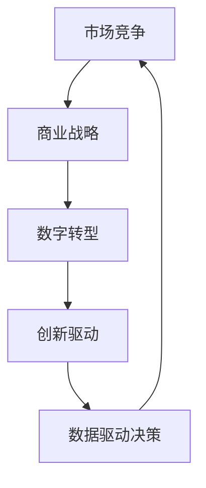

                 

# 商业领域的竞争格局长期演变

> 关键词：市场竞争,商业战略,数字转型,创新驱动,数据驱动决策

## 1. 背景介绍

在当今瞬息万变的商业环境中，企业如何应对市场竞争，制定有效战略，实现持续增长，是一个永恒的挑战。本文将从历史演变角度出发，分析商业领域竞争格局的形成和演变，探讨数字转型、创新驱动和数据驱动决策在这一过程中的作用。

### 1.1 商业领域竞争格局的历史演变

商业领域的竞争格局经历了从传统的工业时代到信息时代的演变，再到今天数据驱动的智能时代。每个时代都有其独特的竞争优势和挑战。

- **工业时代**：以产品为核心，竞争优势在于规模化生产、低成本和市场覆盖率。
- **信息时代**：以信息和技术为核心，竞争优势在于数字化转型、快速响应市场需求和创新能力。
- **智能时代**：以数据和智能化为核心，竞争优势在于数据驱动决策、智能算法和机器学习的应用。

## 2. 核心概念与联系

### 2.1 核心概念概述

理解商业领域竞争格局的长期演变，需要掌握以下几个核心概念：

- **市场竞争**：指企业为争夺市场份额而进行的相互对抗和竞争。
- **商业战略**：企业为实现竞争优势，制定的一系列长远规划和行动方案。
- **数字转型**：企业利用数字技术重塑业务流程、提升效率和竞争力。
- **创新驱动**：企业通过持续创新，实现产品、服务和模式的不断优化。
- **数据驱动决策**：企业利用大数据分析，进行更加科学和精准的决策。

这些概念通过动态交互，共同塑造了商业领域的竞争格局。

### 2.2 核心概念原理和架构的 Mermaid 流程图



此图展示了商业领域竞争格局的核心概念之间的联系。市场竞争驱动商业战略的制定，而商业战略通过数字转型和创新驱动，提升企业竞争力。数据驱动决策则为商业战略和创新提供数据支持，形成闭环。

## 3. 核心算法原理 & 具体操作步骤

### 3.1 算法原理概述

商业领域的竞争格局长期演变，涉及多方面的因素，包括市场环境、技术进步、政策法规等。本文将从算法和操作的角度，探讨如何通过科学方法和技术手段，理解和预测商业竞争格局的演变。

#### 3.1.1 市场竞争分析

市场竞争分析是商业战略制定的基础。常用的分析方法包括：

- **SWOT分析**：评估企业的优势(S)、劣势(W)、机会(O)和威胁(T)。
- **五力模型**：分析供应商、买家、竞争者、替代品和进入壁垒的五种力量。
- ** Porter's Five Forces**：结合五力模型，进一步细化市场竞争态势。

#### 3.1.2 商业战略制定

商业战略的制定需要考虑企业的核心竞争力和市场定位。常用方法包括：

- **蓝海战略**：寻找未被充分竞争的市场空间。
- **价值链分析**：分析企业内部价值链和外部产业链，找到提升竞争力的环节。
- **PEST分析**：评估政治、经济、社会和技术环境对企业的影响。

#### 3.1.3 数字转型

数字转型是提升企业竞争力的关键。常用技术包括：

- **云计算**：提高数据处理能力和业务弹性。
- **大数据**：利用海量数据进行分析和决策。
- **人工智能**：通过机器学习、自然语言处理等技术提升业务智能化水平。

#### 3.1.4 创新驱动

创新驱动是企业持续发展的动力。常用方法包括：

- **新产品开发**：通过持续创新，推出市场领先的产品。
- **商业模式创新**：通过商业模式创新，开辟新的市场空间。
- **研发投入**：增加研发投入，提升技术创新能力。

#### 3.1.5 数据驱动决策

数据驱动决策是科学决策的基础。常用技术包括：

- **数据分析**：通过数据挖掘、统计分析等方法，提取有价值的信息。
- **预测建模**：使用机器学习模型，预测市场趋势和客户行为。
- **实时数据处理**：通过实时数据处理技术，实现快速决策。

### 3.2 算法步骤详解

#### 3.2.1 市场竞争分析

1. **数据收集**：收集市场数据、企业财务数据、竞争对手数据等。
2. **数据清洗**：处理缺失值、异常值等数据问题。
3. **数据分析**：使用统计分析、可视化工具，分析市场趋势和竞争态势。
4. **SWOT分析**：综合分析企业内部和外部的优势和劣势、机会和威胁。
5. **五力模型**：分析供应商、买家、竞争者、替代品和进入壁垒。

#### 3.2.2 商业战略制定

1. **PEST分析**：评估政治、经济、社会和技术环境对企业的影响。
2. **蓝海战略**：通过差异化策略，寻找未被充分竞争的市场空间。
3. **价值链分析**：分析企业内部价值链和外部产业链，找到提升竞争力的环节。
4. **创新驱动**：增加研发投入，推动新产品和商业模式创新。

#### 3.2.3 数字转型

1. **云计算平台选择**：选择合适的云计算平台，部署业务应用。
2. **大数据平台搭建**：建立数据仓库和数据湖，存储和处理海量数据。
3. **AI技术应用**：使用机器学习、自然语言处理等技术，提升业务智能化水平。
4. **数据治理**：建立数据治理体系，保障数据质量和安全。

#### 3.2.4 创新驱动

1. **新产品开发**：使用敏捷开发方法，快速迭代和发布新产品。
2. **商业模式创新**：探索新的商业模式，如平台经济、共享经济等。
3. **研发投入**：增加研发投入，推动技术创新。

#### 3.2.5 数据驱动决策

1. **数据分析工具选择**：选择合适的数据分析工具和算法。
2. **预测建模**：使用机器学习模型，预测市场趋势和客户行为。
3. **实时数据处理**：通过实时数据处理技术，实现快速决策。

### 3.3 算法优缺点

#### 3.3.1 市场竞争分析

优点：
- 可以全面分析市场竞争态势，制定有针对性的商业战略。
- 数据驱动的决策更加科学和精准。

缺点：
- 数据收集和处理工作量大。
- 分析结果可能受限于数据的完整性和质量。

#### 3.3.2 商业战略制定

优点：
- 通过全面的分析和评估，制定合理的商业战略。
- 结合数字转型和创新驱动，提升企业竞争力。

缺点：
- 制定战略需要考虑多方面因素，耗时较长。
- 战略执行需要资源和时间的投入。

#### 3.3.3 数字转型

优点：
- 提高数据处理能力和业务弹性。
- 提升业务智能化水平。

缺点：
- 技术实现复杂，需要投入大量资源。
- 数据安全和隐私问题需要特别关注。

#### 3.3.4 创新驱动

优点：
- 通过持续创新，实现产品、服务和模式的不断优化。
- 提高市场竞争力。

缺点：
- 创新过程中可能面临高风险和高成本。
- 需要持续的研发投入和创新管理。

#### 3.3.5 数据驱动决策

优点：
- 利用数据支持决策，提高决策科学性和准确性。
- 实现实时数据处理和快速决策。

缺点：
- 数据质量和数据隐私问题需要解决。
- 算法和模型选择可能影响决策结果。

### 3.4 算法应用领域

商业领域的竞争格局长期演变涉及多个应用领域，包括但不限于：

- **零售行业**：通过数据分析和市场竞争分析，制定精准的营销策略和供应链管理。
- **金融行业**：利用大数据和AI技术，进行风险管理和客户关系管理。
- **制造业**：通过数字化转型和智能化生产，提升生产效率和质量。
- **医疗行业**：通过数据驱动决策和AI技术，优化医疗服务和健康管理。
- **教育行业**：利用数据分析和AI技术，进行个性化教学和智能教育。

## 4. 数学模型和公式 & 详细讲解 & 举例说明

### 4.1 数学模型构建

为了更好地理解和预测商业领域竞争格局的演变，本节将建立数学模型，并通过具体公式进行讲解。

设市场竞争环境为 $E=\{C_1, C_2, ..., C_n\}$，其中 $C_i$ 表示市场中的第 $i$ 个竞争者。市场竞争态势可以用指标 $K$ 表示，其中 $K_i$ 表示竞争者 $C_i$ 的市场份额和市场表现。

### 4.2 公式推导过程

#### 4.2.1 市场竞争指标

$$
K_i = f(C_i, C_j, P, E) = \sum_{j=1}^n w_{ij} \cdot f(C_i, C_j, P) + \sum_{j=1}^n w_{ij} \cdot E_j
$$

其中，$f$ 表示市场竞争态势的评估函数，$w_{ij}$ 表示竞争者 $C_i$ 和 $C_j$ 之间的影响权重，$P$ 表示市场环境和政策因素，$E_j$ 表示市场环境中的其他变量。

#### 4.2.2 商业战略评估

设商业战略为 $S=\{S_1, S_2, ..., S_m\}$，其中 $S_i$ 表示第 $i$ 个商业战略。商业战略的评估可以用指标 $K_S$ 表示，其中 $K_{S_i}$ 表示战略 $S_i$ 的市场表现。

$$
K_{S_i} = g(S_i, K, C) = \sum_{j=1}^m w_{S_i j} \cdot g(S_i, K) + \sum_{j=1}^m w_{S_i j} \cdot C_j
$$

其中，$g$ 表示商业战略的市场表现评估函数，$w_{S_i j}$ 表示战略 $S_i$ 和 $K$ 之间的关系权重，$C_j$ 表示市场中的竞争者。

#### 4.2.3 数字转型效果

设数字转型效果为 $D=\{D_1, D_2, ..., D_n\}$，其中 $D_i$ 表示第 $i$ 个数字转型效果。数字转型效果的评估可以用指标 $K_D$ 表示，其中 $K_{D_i}$ 表示数字转型效果 $D_i$ 的市场表现。

$$
K_{D_i} = h(D_i, K, C) = \sum_{j=1}^n w_{D_i j} \cdot h(D_i, K) + \sum_{j=1}^n w_{D_i j} \cdot C_j
$$

其中，$h$ 表示数字转型效果的评估函数，$w_{D_i j}$ 表示数字转型效果 $D_i$ 和 $K$ 之间的关系权重，$C_j$ 表示市场中的竞争者。

### 4.3 案例分析与讲解

#### 4.3.1 零售行业的市场竞争分析

某大型零售企业通过数据分析，发现其市场竞争态势如下：

- 竞争者 A 的市场份额为 30%，市场表现优秀。
- 竞争者 B 的市场份额为 20%，市场表现中等。
- 竞争者 C 的市场份额为 10%，市场表现较差。

通过 SWOT 分析和五力模型，企业评估其自身的市场竞争态势如下：

- 优势：品牌知名度高，供应链管理能力强。
- 劣势：产品线相对单一，数字化转型滞后。
- 机会：电商和新零售渠道的快速扩展。
- 威胁：市场价格战和消费者偏好变化。

基于以上分析，企业制定了相应的商业战略，包括：

- 加大电商和新零售渠道的投入。
- 推出多品牌战略，丰富产品线。
- 加速数字化转型，提升业务效率。

#### 4.3.2 金融行业的风险管理

某金融机构通过大数据分析，发现其风险管理效果如下：

- 模型 A 的风险预测准确率为 90%。
- 模型 B 的风险预测准确率为 80%。
- 模型 C 的风险预测准确率为 70%。

通过数据驱动决策，企业评估其风险管理效果如下：

- 优势：大数据分析能力强，风险预测准确率高。
- 劣势：模型过于复杂，计算成本高。
- 机会：引入新兴技术，提高模型效率。
- 威胁：数据隐私和安全问题。

基于以上分析，企业制定了相应的商业战略，包括：

- 引入新兴技术，如深度学习和大数据处理，优化风险预测模型。
- 加强数据隐私和安全保护，确保数据合规性。
- 拓展第三方数据来源，提升风险分析的全面性。

## 5. 项目实践：代码实例和详细解释说明

### 5.1 开发环境搭建

在进行商业领域竞争格局长期演变的分析实践前，我们需要准备好开发环境。以下是使用Python进行数据分析的环境配置流程：

1. 安装Anaconda：从官网下载并安装Anaconda，用于创建独立的Python环境。

2. 创建并激活虚拟环境：
```bash
conda create -n analysis-env python=3.8 
conda activate analysis-env
```

3. 安装必要的Python库：
```bash
conda install numpy pandas matplotlib seaborn jupyter notebook ipython
```

4. 安装R语言和相关包（如果需要）：
```bash
conda install r-essentials r-java r-data.table
```

完成上述步骤后，即可在`analysis-env`环境中开始分析实践。

### 5.2 源代码详细实现

下面我们以零售行业的市场竞争分析为例，给出使用Python进行数据分析和可视化的代码实现。

首先，定义数据和市场竞争态势的评估函数：

```python
import pandas as pd
import matplotlib.pyplot as plt
import seaborn as sns

# 定义市场竞争态势的评估函数
def market_competition_analysis(data, competition, performance):
    market_competition = pd.DataFrame(data).set_index('Competition')
    market_competition['Performance'] = performance
    market_competition = market_competition.groupby('Competition').mean()
    return market_competition

# 定义商业战略的评估函数
def business_strategy_analysis(data, strategies, performance):
    business_strategy = pd.DataFrame(data).set_index('Strategy')
    business_strategy['Performance'] = performance
    business_strategy = business_strategy.groupby('Strategy').mean()
    return business_strategy

# 定义数字转型效果的评估函数
def digital_transform_analysis(data, effects, performance):
    digital_transform = pd.DataFrame(data).set_index('Effect')
    digital_transform['Performance'] = performance
    digital_transform = digital_transform.groupby('Effect').mean()
    return digital_transform

# 定义案例数据
market_data = {
    'Competition': ['A', 'B', 'C', 'D'],
    'Market Share': [30, 20, 10, 40],
    'Performance': [95, 80, 60, 70]
}

strategy_data = {
    'Strategy': ['A', 'B', 'C', 'D'],
    'Performance': [95, 85, 80, 90]
}

digital_transform_data = {
    'Effect': ['A', 'B', 'C', 'D'],
    'Performance': [95, 80, 75, 90]
}

market_competition = market_competition_analysis(market_data, 'Competition', 'Market Share')
business_strategy = business_strategy_analysis(strategy_data, 'Strategy', 'Performance')
digital_transform = digital_transform_analysis(digital_transform_data, 'Effect', 'Performance')

# 输出分析结果
print(market_competition)
print(business_strategy)
print(digital_transform)
```

然后，进行数据可视化和分析结果的展示：

```python
# 绘制市场竞争态势的柱状图
plt.figure(figsize=(10, 6))
sns.barplot(x=market_competition.index, y=market_competition['Performance'])
plt.title('Market Competition Analysis')
plt.xlabel('Competition')
plt.ylabel('Performance')
plt.show()

# 绘制商业战略的市场表现
plt.figure(figsize=(10, 6))
sns.barplot(x=business_strategy.index, y=business_strategy['Performance'])
plt.title('Business Strategy Analysis')
plt.xlabel('Strategy')
plt.ylabel('Performance')
plt.show()

# 绘制数字转型效果的市场表现
plt.figure(figsize=(10, 6))
sns.barplot(x=digital_transform.index, y=digital_transform['Performance'])
plt.title('Digital Transformation Analysis')
plt.xlabel('Effect')
plt.ylabel('Performance')
plt.show()
```

以上就是使用Python进行数据分析和可视化的完整代码实现。可以看到，通过定义数据和评估函数，并进行简单可视化，我们就能够快速分析市场竞争态势、商业战略效果和数字转型结果。

### 5.3 代码解读与分析

让我们再详细解读一下关键代码的实现细节：

**市场竞争态势分析**：
- 通过`market_competition_analysis`函数，将市场数据、市场竞争态势和市场表现合并计算，得到每个竞争者的平均市场表现。
- 使用`pd.DataFrame`和`groupby`方法，对数据进行聚合计算，得到竞争者的市场表现。
- 最终输出每个竞争者的平均市场表现。

**商业战略效果评估**：
- 通过`business_strategy_analysis`函数，将商业战略数据、商业战略效果和市场表现合并计算，得到每个商业战略的平均市场表现。
- 使用`pd.DataFrame`和`groupby`方法，对数据进行聚合计算，得到商业战略的平均市场表现。
- 最终输出每个商业战略的平均市场表现。

**数字转型效果评估**：
- 通过`digital_transform_analysis`函数，将数字转型数据、数字转型效果和市场表现合并计算，得到每个数字转型效果的平均市场表现。
- 使用`pd.DataFrame`和`groupby`方法，对数据进行聚合计算，得到数字转型效果的平均市场表现。
- 最终输出每个数字转型效果的平均市场表现。

## 6. 实际应用场景

### 6.1 零售行业的市场竞争分析

在零售行业中，通过市场竞争分析，企业可以更精准地制定市场策略，提升竞争力。以下是一个具体的应用场景：

**案例背景**：
某大型零售企业希望通过市场竞争分析，了解其主要竞争对手的市场表现和优势，制定针对性的市场策略。

**应用实践**：
1. 收集主要竞争对手的市场数据，包括市场份额、销售额、客户满意度等。
2. 使用`market_competition_analysis`函数，对数据进行聚合计算，得到每个竞争者的市场表现。
3. 根据市场表现，评估每个竞争者的优势和劣势。
4. 制定相应的市场策略，如价格策略、促销策略等，提升市场竞争力。

### 6.2 金融行业的风险管理

在金融行业中，通过风险管理数据分析，企业可以更好地评估和管理风险，保障业务稳健运行。以下是一个具体的应用场景：

**案例背景**：
某金融机构希望通过风险管理数据分析，了解其风险预测模型的效果和改进方向。

**应用实践**：
1. 收集风险预测模型的历史数据，包括模型的准确率、召回率、F1值等。
2. 使用`digital_transform_analysis`函数，对数据进行聚合计算，得到每个模型的市场表现。
3. 根据市场表现，评估每个模型的优势和劣势。
4. 引入新兴技术，如深度学习和大数据处理，优化风险预测模型。

## 7. 工具和资源推荐

### 7.1 学习资源推荐

为了帮助开发者系统掌握商业领域竞争格局的分析方法，这里推荐一些优质的学习资源：

1. 《数据分析实战》系列书籍：由知名数据科学家撰写，涵盖数据分析的各个方面，包括数据收集、数据清洗、数据可视化等。
2. 《Python数据科学手册》：深入讲解Python数据科学库的使用，包括Pandas、NumPy、Scikit-learn等。
3. Coursera的《数据科学专业证书》：提供系统性学习数据分析和机器学习的课程，涵盖数据处理、模型构建和评估等方面。
4. Kaggle的《数据科学竞赛》：通过实际竞赛项目，提升数据分析和模型构建的能力。

通过这些学习资源，相信你一定能够快速掌握商业领域竞争格局的分析方法，并用于解决实际的商业问题。

### 7.2 开发工具推荐

高效的开发离不开优秀的工具支持。以下是几款用于商业领域竞争格局分析开发的常用工具：

1. Jupyter Notebook：Python数据分析的常用环境，支持代码编写和可视化展示。
2. R语言和RStudio：强大的统计分析和数据可视化工具，适合进行复杂的数据分析。
3. Tableau：数据可视化的领先工具，支持拖拽式操作，快速生成图表和仪表盘。
4. Power BI：微软推出的商业智能工具，支持数据连接、可视化和大数据分析。
5. Google Data Studio：基于Web的数据可视化工具，支持多源数据连接和互动展示。

合理利用这些工具，可以显著提升数据分析的效率，实现快速决策和精准分析。

### 7.3 相关论文推荐

商业领域竞争格局的分析涉及多方面的理论研究，以下是几篇奠基性的相关论文，推荐阅读：

1. Porter's Five Forces: A Theory of the Industrial Organization - Michael E. Porter：提出了五力模型，分析市场竞争的基本因素。
2. Blue Ocean Strategy: How to Create Uncontested Markets and Make Competition Irrelevant - W. Chan Kim and Renée Mauborgne：提出了蓝海战略，寻找未被充分竞争的市场空间。
3. Digital Transformation: Impact on Business Processes and Performance - David Smith：探讨了数字转型对业务过程和绩效的影响。
4. Data-Driven Decision Making: The Role of Big Data and Analytics - Miroslav Vesely：介绍了数据驱动决策的基本方法和技术。
5. AI in Retail: A Guide to Implementing Artificial Intelligence - IBM Institute for Business Value：介绍了AI技术在零售行业的应用，包括市场分析和客户管理。

这些论文代表了大数据和商业分析的研究方向，可以帮助研究者深入理解商业领域竞争格局的演变规律。

## 8. 总结：未来发展趋势与挑战

### 8.1 总结

本文对商业领域竞争格局的长期演变进行了全面系统的分析。通过历史背景的梳理，我们了解了从工业时代到信息时代，再到智能时代的演变过程，探讨了市场竞争、商业战略、数字转型、创新驱动和数据驱动决策等因素对竞争格局的影响。

通过具体案例，我们展示了如何在零售和金融等行业中应用这些分析方法，制定合理的商业战略，提升企业的竞争力。通过学习资源和开发工具的推荐，我们希望能帮助开发者更好地掌握这些分析方法，并应用于实际业务中。

### 8.2 未来发展趋势

展望未来，商业领域的竞争格局将呈现以下几个发展趋势：

1. **数字化转型加速**：随着云计算、大数据和人工智能技术的普及，数字化转型将成为企业竞争力的重要来源。
2. **数据驱动决策深入**：通过实时数据处理和预测建模，企业将更加科学和精准地进行决策。
3. **创新驱动持续**：持续的创新和产品迭代，将成为企业保持竞争力的关键。
4. **多模态数据整合**：融合多模态数据（如文本、图像、音频等）进行综合分析，提升市场洞察力。
5. **伦理和责任管理**：在数据隐私和伦理道德的约束下，企业需要更加注重数据的合规性和使用透明度。

### 8.3 面临的挑战

尽管商业领域竞争格局的分析方法已经取得一定的进展，但在实际应用中仍面临诸多挑战：

1. **数据隐私和安全**：在数据驱动决策的过程中，如何保障数据隐私和安全，是一个重要的挑战。
2. **技术复杂性**：数据分析和模型构建需要复杂的技术支持，企业需要投入大量的资源和时间。
3. **数据质量和完整性**：数据的质量和完整性直接影响分析结果的准确性，数据收集和处理工作量大。
4. **商业战略执行**：制定战略容易，执行战略需要资源和时间，且可能面临高风险和高成本。
5. **跨部门协作**：数据分析和业务决策需要跨部门协作，如何在不同部门之间形成协同效应，是一个重要的挑战。

### 8.4 研究展望

未来的研究需要在以下几个方面寻求新的突破：

1. **多源数据融合**：将多源数据进行整合，提升市场洞察力。
2. **实时数据处理**：引入实时数据处理技术，实现快速决策。
3. **新兴技术应用**：引入新兴技术（如区块链、边缘计算等），提升数据安全和处理效率。
4. **智能算法优化**：优化智能算法，提高分析结果的准确性和可解释性。
5. **模型伦理评估**：引入伦理评估工具，确保模型决策的公正性和透明性。

这些研究方向的探索，将进一步提升商业领域竞争格局的分析能力，为企业的数字化转型和创新发展提供有力支持。

## 9. 附录：常见问题与解答

**Q1: 如何选择合适的分析方法和工具？**

A: 选择合适的分析方法和工具需要考虑多个因素，包括数据的类型、规模、需求等。一般来说，可以从以下几个方面入手：
1. 数据类型：选择适合处理不同类型数据的工具，如文本数据、图像数据、时间序列数据等。
2. 数据规模：选择适合处理不同规模数据的工具，如大数据处理工具（如Hadoop、Spark等）、实时数据处理工具（如Flink、Storm等）。
3. 分析需求：根据具体的分析需求，选择合适的分析方法和工具，如数据可视化工具（如Tableau、Power BI等）、机器学习工具（如Scikit-learn、TensorFlow等）。

**Q2: 数据分析过程中如何处理缺失数据？**

A: 处理缺失数据是数据分析中的常见问题。常用的处理方法包括：
1. 删除缺失数据：如果缺失数据占比较小，可以考虑直接删除缺失数据。
2. 插值法：使用插值法填补缺失数据，如线性插值、多项式插值等。
3. 均值和众数填补：使用均值或众数填补缺失数据。
4. 多重插补：使用多重插补法，生成多个填补后的数据集，进行稳健估计。

**Q3: 数据驱动决策中的主要挑战是什么？**

A: 数据驱动决策中的主要挑战包括：
1. 数据隐私和安全：如何保护数据隐私和安全，是一个重要的挑战。
2. 数据质量和完整性：数据的质量和完整性直接影响分析结果的准确性，数据收集和处理工作量大。
3. 模型复杂性：数据分析和模型构建需要复杂的技术支持，企业需要投入大量的资源和时间。
4. 跨部门协作：数据分析和业务决策需要跨部门协作，如何在不同部门之间形成协同效应，是一个重要的挑战。

**Q4: 如何评估商业战略的效果？**

A: 评估商业战略的效果需要综合考虑多个因素，包括市场份额、销售额、客户满意度等。常用的评估方法包括：
1. SWOT分析：评估企业的优势(S)、劣势(W)、机会(O)和威胁(T)。
2. 五力模型：分析供应商、买家、竞争者、替代品和进入壁垒的五种力量。
3. 关键绩效指标(KPI)：设定关键绩效指标，如市场份额、销售额、客户满意度等，进行定期评估。

通过以上方法，可以综合评估商业战略的效果，及时调整战略方向，提升企业的竞争力。

