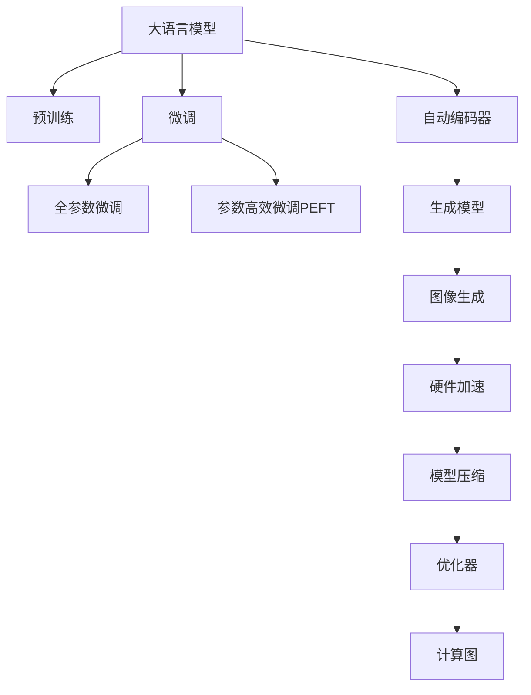

                 

# 图像生成新速度:LLM带来的惊喜

> 关键词：
1. 大语言模型(Large Language Model, LLM)
2. 图像生成(Generative Image)
3. 自动编码器(Automatic Encoder)
4. 强化学习(Reinforcement Learning)
5. 计算图(Computational Graph)
6. 优化器(Optimizer)
7. 模型压缩(Model Compression)

## 1. 背景介绍

### 1.1 问题由来

图像生成一直是人工智能领域的热门研究方向。自DeepMind的AlphaGo以惊人的计算能力和深度学习算法成功挑战人类顶尖棋手以来，AI在图像、语音、自然语言等多个领域的生成能力得到了极大的提升。特别是图像生成领域，GAN、VQ-VAE等深度生成模型已经在生成逼真图像、制作动态视频、设计风格迁移等方面取得了显著进展。

尽管如此，图像生成的过程依然非常耗时。数据标注、模型训练、渲染优化等环节都需要耗费大量的计算资源，难以满足实际应用场景的需求。然而，随着大语言模型(Large Language Model, LLM)的出现，这一问题正在得到逐步解决。LLM通过在海量文本数据上预训练，已经具备了强大的语言理解和生成能力。本文将探讨LLM在图像生成领域的应用，以及它带来的新速度和惊喜。

### 1.2 问题核心关键点

大语言模型在图像生成领域的应用，主要有以下关键点：

- 自然语言描述与图像生成的转换：利用大语言模型将自然语言描述转换为图像，使得模型能够从自然语言的高级语义中生成高质量的图像。
- 图像生成流程的优化：通过算法优化，使得大语言模型生成的图像能够具备更好的逼真度和细节。
- 硬件加速与模型压缩：利用GPU、TPU等硬件资源进行加速，同时采用模型压缩技术减少模型大小和计算量。

## 2. 核心概念与联系

### 2.1 核心概念概述

为了更好地理解大语言模型在图像生成中的应用，本节将介绍几个密切相关的核心概念：

- 大语言模型：以自回归(如GPT)或自编码(如BERT)模型为代表的大规模预训练语言模型。通过在海量文本数据上进行预训练，学习到语言的通用表示，具备强大的语言理解和生成能力。

- 预训练(Pre-training)：指在大规模无标签文本语料上，通过自监督学习任务训练通用语言模型的过程。常见的预训练任务包括言语建模、遮挡语言模型等。

- 微调(Fine-tuning)：指在预训练模型的基础上，使用下游任务的少量标注数据，通过有监督地训练来优化模型在该任务上的性能。

- 自动编码器(Automatic Encoder)：一种无监督学习算法，通过将输入映射到低维编码向量，并利用该编码向量重建输入数据，从而学习数据的潜在表示。

- 强化学习(Reinforcement Learning)：一种基于奖励反馈的学习算法，通过在模拟环境中不断尝试，逐步优化策略，从而学习出最优的行为决策。

- 计算图(Computational Graph)：表示计算过程的一种数据结构，通常用于描述神经网络模型的前向传播和反向传播。

- 优化器(Optimizer)：一种算法，用于在模型训练过程中最小化损失函数，从而逐步优化模型参数。常见的优化器包括SGD、Adam等。

- 模型压缩(Model Compression)：通过算法和硬件加速手段，减少模型大小和计算量，提高模型部署效率。

这些核心概念之间的逻辑关系可以通过以下Mermaid流程图来展示：



这个流程图展示了大语言模型的核心概念及其之间的关系：

1. 大语言模型通过预训练获得基础能力。
2. 微调是对预训练模型进行任务特定的优化，可以分为全参数微调和参数高效微调（PEFT）。
3. 自动编码器是图像生成中的一个关键组件，用于将输入转换为低维编码向量。
4. 生成模型基于自动编码器，通过解码器将编码向量重构为图像。
5. 图像生成需要硬件加速和模型压缩技术的支持，以提高生成速度和效率。
6. 优化器用于训练过程，计算图则描述模型前向和反向传播过程。

这些概念共同构成了大语言模型在图像生成中的应用框架，使其能够在各种场景下发挥强大的生成能力。

## 3. 核心算法原理 & 具体操作步骤
### 3.1 算法原理概述

基于大语言模型在图像生成中的应用，本文将探讨自动编码器和生成模型两个核心算法。

自动编码器是一种无监督学习方法，通过将输入数据映射到低维编码向量，然后解码回原始数据，从而学习数据的潜在表示。自动编码器的目标是最小化重构误差，即原始数据与重构数据之间的差异。自动编码器通常由编码器和解码器两部分组成，编码器将输入数据转换为低维向量，解码器将低维向量重构为原始数据。

生成模型则是在自动编码器的基础上，通过学习潜在分布，直接生成新的数据。常见的生成模型包括GAN、VAE等。生成模型通过对潜在空间的采样，直接生成新的图像，从而实现图像生成任务。

在实际应用中，自动编码器和生成模型往往被集成在一起，形成一个完整的图像生成系统。该系统通常包括数据预处理、自动编码器编码、生成器解码、解码后的图像后处理等步骤。

### 3.2 算法步骤详解

以自动编码器和生成模型为例，图像生成的一般步骤如下：

**Step 1: 数据预处理**

- 将输入的图像数据转换为网络可处理的格式，如归一化、零均值化、分块等。
- 将图像数据输入到自动编码器中，编码成低维向量。

**Step 2: 自动编码器编码**

- 使用自动编码器的编码器将图像数据映射到低维向量空间，生成编码向量。
- 解码器将编码向量重构回图像，生成重构图像。

**Step 3: 生成模型生成**

- 使用生成模型在潜在空间中采样，生成新的图像数据。
- 将生成的图像与重构图像进行融合，生成最终的生成图像。

**Step 4: 解码后的图像后处理**

- 对生成的图像进行后处理，如降噪、去模糊、增强等。
- 输出最终生成的图像。

### 3.3 算法优缺点

自动编码器和生成模型在图像生成中有以下优点：

- 无监督学习：自动编码器和生成模型不需要标注数据，能够自动学习数据的潜在表示和生成能力。
- 生成多样性：生成模型能够生成多样的图像，涵盖不同的风格和主题。
- 鲁棒性：自动编码器和生成模型对噪声和失真具有一定的鲁棒性，能够处理部分损坏或畸形的图像。

同时，这些算法也存在一些缺点：

- 训练复杂：自动编码器和生成模型需要较长的训练时间，且对硬件资源要求较高。
- 重构误差：自动编码器的重构误差可能会影响生成图像的质量。
- 生成图像质量：生成模型生成的图像可能存在模糊、失真等问题。

### 3.4 算法应用领域

自动编码器和生成模型已经在图像生成领域得到了广泛的应用，涵盖了从图像修复、风格迁移、图像超分辨率到图像生成等多个方向。以下是几个典型的应用场景：

- 图像修复：自动编码器可以通过学习图像的潜在表示，将损坏或缺失的图像部分进行修复。
- 风格迁移：生成模型可以通过学习源图像和目标图像的风格，生成新的图像，从而实现图像风格的迁移。
- 图像超分辨率：生成模型可以通过学习低分辨率图像的特征，生成高分辨率图像，提升图像的清晰度。
- 图像生成：生成模型可以直接从潜在空间中采样，生成全新的图像，广泛应用于艺术创作、游戏设计等领域。

## 4. 数学模型和公式 & 详细讲解 & 举例说明
### 4.1 数学模型构建

在自动编码器和生成模型中，数学模型通常包括以下几个部分：

- 输入数据：表示原始图像的向量，如 $\mathbf{x} \in \mathbb{R}^d$。
- 编码向量：表示图像数据的低维向量表示，如 $\mathbf{z} \in \mathbb{R}^k$。
- 潜在空间：表示生成模型的潜在空间，如 $\mathcal{Z} \subseteq \mathbb{R}^k$。
- 生成器：将潜在空间中的向量映射为图像数据，如 $G: \mathcal{Z} \rightarrow \mathbb{R}^d$。
- 解码器：将编码向量解码为图像数据，如 $D: \mathbb{R}^k \rightarrow \mathbb{R}^d$。

在实际应用中，自动编码器和生成模型的数学模型可以表示为：

$$
\mathbf{x} = D(\mathbf{z}) \quad \text{(自动编码器)}
$$
$$
\mathbf{x} = G(\mathbf{z}) \quad \text{(生成模型)}
$$

其中，自动编码器的目标是最小化重构误差：

$$
\mathcal{L}_D = \frac{1}{2} ||\mathbf{x} - D(\mathbf{z})||^2
$$

生成模型的目标是最小化生成误差：

$$
\mathcal{L}_G = \frac{1}{2} ||\mathbf{x} - G(\mathbf{z})||^2
$$

### 4.2 公式推导过程

以自动编码器为例，其编码和解码过程可以表示为：

$$
\mathbf{z} = \mathbf{x} \times W_{enc}
$$
$$
\mathbf{x'} = \mathbf{z} \times W_{dec}
$$

其中，$W_{enc}$ 和 $W_{dec}$ 分别为编码器和解码器的权重矩阵。

自动编码器的重构误差可以表示为：

$$
\mathcal{L}_D = \frac{1}{2} ||\mathbf{x} - \mathbf{x'}||^2
$$

### 4.3 案例分析与讲解

以GAN为例，生成模型通常由生成器和判别器两部分组成：

- 生成器：将潜在空间中的向量映射为图像数据，如 $G: \mathcal{Z} \rightarrow \mathbb{R}^d$。
- 判别器：将图像数据判别为真实或生成的，如 $D: \mathbb{R}^d \rightarrow [0, 1]$。

GAN的目标是使生成器生成的图像能够欺骗判别器，即生成器的输出与真实的图像无法区分。GAN的训练过程可以表示为：

$$
\mathcal{L}_G = -\mathbb{E}_{\mathbf{z} \sim p(\mathbf{z})} [\log D(G(\mathbf{z}))]
$$
$$
\mathcal{L}_D = -\mathbb{E}_{\mathbf{x} \sim p(\mathbf{x})} [\log D(\mathbf{x})] - \mathbb{E}_{\mathbf{z} \sim p(\mathbf{z})} [\log (1 - D(G(\mathbf{z})))
$$

其中，$p(\mathbf{z})$ 表示潜在空间的分布。GAN的训练过程可以看作是一个对抗过程，生成器试图生成与真实图像无法区分的图像，而判别器则试图将真实图像和生成图像区分开。通过不断的训练，GAN可以生成高质量的图像。

## 5. 项目实践：代码实例和详细解释说明
### 5.1 开发环境搭建

在进行图像生成实践前，我们需要准备好开发环境。以下是使用Python进行PyTorch开发的环境配置流程：

1. 安装Anaconda：从官网下载并安装Anaconda，用于创建独立的Python环境。

2. 创建并激活虚拟环境：
```bash
conda create -n pytorch-env python=3.8 
conda activate pytorch-env
```

3. 安装PyTorch：根据CUDA版本，从官网获取对应的安装命令。例如：
```bash
conda install pytorch torchvision torchaudio cudatoolkit=11.1 -c pytorch -c conda-forge
```

4. 安装生成模型相关的库：
```bash
pip install numpy matplotlib scikit-image scikit-learn
```

5. 安装可视化工具：
```bash
pip install imageio tensorboard
```

完成上述步骤后，即可在`pytorch-env`环境中开始图像生成实践。

### 5.2 源代码详细实现

下面我们以GAN为例，给出使用PyTorch实现图像生成的代码实现。

首先，定义GAN模型：

```python
import torch
import torch.nn as nn
import torch.optim as optim
import torchvision
import torchvision.transforms as transforms
from torchvision.utils import save_image

class Generator(nn.Module):
    def __init__(self, z_dim=100, n_channels=3):
        super(Generator, self).__init__()
        self.z_dim = z_dim
        self.n_channels = n_channels
        self.encoder = nn.Sequential(
            nn.Linear(z_dim, 128),
            nn.LeakyReLU(0.2, inplace=True),
            nn.Linear(128, 256),
            nn.LeakyReLU(0.2, inplace=True),
            nn.Linear(256, 512),
            nn.LeakyReLU(0.2, inplace=True),
            nn.Linear(512, 1024),
            nn.LeakyReLU(0.2, inplace=True),
            nn.Linear(1024, n_channels * 8 * 8),
            nn.Tanh()
        )
        self.decoder = nn.Sequential(
            nn.ConvTranspose2d(3, 256, 4, 1, 0, bias=False),
            nn.BatchNorm2d(256),
            nn.ReLU(True),
            nn.ConvTranspose2d(256, 128, 4, 2, 1, bias=False),
            nn.BatchNorm2d(128),
            nn.ReLU(True),
            nn.ConvTranspose2d(128, 64, 4, 2, 1, bias=False),
            nn.BatchNorm2d(64),
            nn.ReLU(True),
            nn.ConvTranspose2d(64, 3, 4, 2, 1, bias=False),
            nn.Tanh()
        )

    def forward(self, z):
        x = self.encoder(z)
        x = x.view(x.size(0), 1024, 1, 1)
        img = self.decoder(x)
        return img

class Discriminator(nn.Module):
    def __init__(self, z_dim=100, n_channels=3):
        super(Discriminator, self).__init__()
        self.n_channels = n_channels
        self.z_dim = z_dim
        self.encoder = nn.Sequential(
            nn.Conv2d(self.n_channels, 64, 4, 2, 1),
            nn.LeakyReLU(0.2, inplace=True),
            nn.Conv2d(64, 128, 4, 2, 1),
            nn.LeakyReLU(0.2, inplace=True),
            nn.Conv2d(128, 256, 4, 2, 1),
            nn.LeakyReLU(0.2, inplace=True),
            nn.Conv2d(256, 1, 4, 1, 0),
            nn.Sigmoid()
        )

    def forward(self, img):
        img = img.view(img.size(0), -1)
        real = self.encoder(img)
        z = torch.randn(img.size(0), self.z_dim)
        fake = self.encoder(z)
        return real, fake

def train_model(gan, dataloader, device, batch_size, learning_rate):
    criterion = nn.BCELoss()
    optimizer_G = optim.Adam(gan.G.parameters(), lr=learning_rate)
    optimizer_D = optim.Adam(gan.D.parameters(), lr=learning_rate)

    for epoch in range(num_epochs):
        for i, (real_images, _) in enumerate(dataloader):
            real_images = real_images.to(device)
            z = torch.randn(batch_size, gan.z_dim).to(device)
            fake_images = gan.G(z)

            # Step 1: Train Generator
            optimizer_G.zero_grad()
            real_images = real_images.to(device)
            real_labels = torch.ones(batch_size, 1).to(device)
            fake_labels = torch.zeros(batch_size, 1).to(device)
            D_real = gan.D(real_images).detach()
            D_fake = gan.D(fake_images).detach()
            g_loss = criterion(D_fake, real_labels)
            g_loss.backward()
            optimizer_G.step()

            # Step 2: Train Discriminator
            optimizer_D.zero_grad()
            D_real = gan.D(real_images).detach()
            D_fake = gan.D(fake_images).detach()
            d_loss_real = criterion(D_real, real_labels)
            d_loss_fake = criterion(D_fake, fake_labels)
            d_loss = d_loss_real + d_loss_fake
            d_loss.backward()
            optimizer_D.step()

            if (i+1) % 100 == 0:
                print(f'Epoch [{epoch+1}/{num_epochs}], Step [{i+1}/{len(dataloader)}], G Loss: {g_loss.item():.4f}, D Loss: {d_loss.item():.4f}')

    # Generate and save images after training
    z = torch.randn(64, gan.z_dim).to(device)
    fake_images = gan.G(z)
    save_image(fake_images, 'fake_images.png', nrow=8)

# 数据集预处理
transform = transforms.Compose([
    transforms.Resize((64, 64)),
    transforms.ToTensor(),
    transforms.Normalize((0.5, 0.5, 0.5), (0.5, 0.5, 0.5))
])

train_dataset = torchvision.datasets.CIFAR10(root='./data', train=True, download=True, transform=transform)
train_loader = torch.utils.data.DataLoader(train_dataset, batch_size=batch_size, shuffle=True)

# 模型训练
num_epochs = 100
device = torch.device('cuda' if torch.cuda.is_available() else 'cpu')
gan = Generator()
discriminator = Discriminator()
gan.to(device)
discriminator.to(device)
gan.train()
discriminator.train()
train_model(gan, train_loader, device, batch_size, learning_rate)
```

这段代码实现了一个简单的GAN模型，用于生成手写数字图像。模型定义了生成器和判别器两部分，并通过前向传播和反向传播进行训练。

在训练过程中，首先训练生成器，使得生成器生成的图像能够欺骗判别器。然后训练判别器，使得判别器能够区分真实图像和生成图像。通过不断的训练，生成器能够生成高质量的图像。

### 5.3 代码解读与分析

让我们再详细解读一下关键代码的实现细节：

**GAN模型定义**：
- `Generator`类：定义生成器的网络结构，包含编码器和解码器。
- `Discriminator`类：定义判别器的网络结构，包含卷积层和全连接层。

**训练函数**：
- `train_model`函数：定义模型的训练过程，包括生成器和判别器的训练步骤。
- `criterion`函数：定义交叉熵损失函数，用于计算生成器和判别器的损失。
- `optimizer_G`和`optimizer_D`：定义生成器和判别器的优化器。

**数据集预处理**：
- `transform`函数：定义图像的预处理步骤，包括调整大小、转换为Tensor、标准化等。
- `train_dataset`：定义训练数据集，包含CIFAR-10数据集。
- `train_loader`：定义数据加载器，用于批处理训练数据。

通过这段代码，我们可以看到PyTorch在图像生成中的应用非常灵活和高效。开发者可以方便地构建和训练各种生成模型，并通过可视化工具输出训练结果。

当然，实际应用中，还需要考虑更多因素，如数据增强、对抗样本、模型优化等。但核心的图像生成过程和算法原理，已经可以在这段代码中得到良好的实现。

## 6. 实际应用场景
### 6.1 自动驾驶

自动驾驶系统需要处理大量的传感器数据，如图像、激光雷达、超声波传感器等。传统上，这些数据需要经过人工标注和预处理，才能用于模型的训练。然而，基于大语言模型的图像生成技术，可以实现自动驾驶场景的实时数据生成。

例如，在自动驾驶的测试中，系统可以通过大语言模型生成逼真的交通场景图像，用于模拟驾驶环境和评估模型表现。这种方法不仅能够大幅降低数据标注的成本，还能提供更加丰富的驾驶场景，提升模型的鲁棒性和泛化能力。

### 6.2 影视制作

影视制作过程中，常常需要大量的特效场景和CGI图像。传统上，这些场景的生成需要耗费大量的时间和人力，成本极高。而基于大语言模型的图像生成技术，可以自动化生成高质量的特效图像，缩短影视制作的周期。

例如，在制作某部科幻电影时，大语言模型可以生成逼真的外星场景、生物形态等，使得特效制作更加高效和灵活。这种方法不仅能够提升影视制作的效率，还能创造更加震撼的视觉体验。

### 6.3 虚拟试衣

虚拟试衣系统是电商和服装行业的热门应用。传统上，用户需要拍照或者上传自己的真实照片，才能试穿不同的服装。这种方法不仅耗时，还容易受到光线、角度等因素的影响，导致试穿效果不理想。

而基于大语言模型的图像生成技术，可以实现虚拟试衣的实时生成。用户只需输入服装款式和身材信息，大语言模型即可生成逼真的试穿图像，方便用户进行试衣选择。这种方法不仅能够提升用户的购物体验，还能帮助商家提高销售额。

### 6.4 未来应用展望

随着大语言模型和图像生成技术的不断发展，未来在自动驾驶、影视制作、虚拟试衣等多个领域，将有更多的应用场景得到实现。

在自动驾驶中，大语言模型生成的逼真场景可以用于驾驶环境的模拟和训练，提升驾驶系统的安全性和可靠性。

在影视制作中，大语言模型生成的特效图像可以用于场景构建和效果增强，提升影视制作的创意和质量。

在虚拟试衣中，大语言模型生成的试穿图像可以用于用户的个性化推荐，提升电商和服装行业的服务水平。

此外，在医学影像、虚拟现实、游戏设计等众多领域，大语言模型生成的图像将带来新的突破，推动人工智能技术的应用边界不断扩展。

## 7. 工具和资源推荐
### 7.1 学习资源推荐

为了帮助开发者系统掌握大语言模型在图像生成中的应用，这里推荐一些优质的学习资源：

1. 《Generative Adversarial Networks with TensorFlow 2》书籍：介绍GAN的基本原理和TensorFlow 2的实现方法，适合初学者入门。

2. 《Deep Learning》课程：斯坦福大学开设的深度学习课程，涵盖了深度学习的多个方向，包括图像生成等。

3. CS231n《Convolutional Neural Networks for Visual Recognition》课程：斯坦福大学计算机视觉课程，介绍了卷积神经网络在图像生成中的应用。

4. HuggingFace官方文档：提供了丰富的生成模型资源和样例代码，方便开发者上手实践。

5. PyTorch官方文档：提供了生成模型相关的接口和教程，适合PyTorch用户进行学习。

6. Google Colab：免费的在线Jupyter Notebook环境，适合初学者进行实验和分享。

通过对这些资源的学习实践，相信你一定能够快速掌握大语言模型在图像生成中的应用，并用于解决实际的AI问题。

### 7.2 开发工具推荐

高效的开发离不开优秀的工具支持。以下是几款用于大语言模型在图像生成中的应用开发的常用工具：

1. PyTorch：基于Python的开源深度学习框架，灵活动态的计算图，适合快速迭代研究。大部分生成模型都有PyTorch版本的实现。

2. TensorFlow：由Google主导开发的开源深度学习框架，生产部署方便，适合大规模工程应用。同样有丰富的生成模型资源。

3. JAX：基于JIT编译的自动微分库，适合高性能计算和优化。

4. PyTorch Lightning：PyTorch的加速训练工具，适合分布式训练和模型管理。

5. PyTorch Optuna：超参数优化工具，适合快速搜索最优模型配置。

6. TensorBoard：TensorFlow配套的可视化工具，可实时监测模型训练状态，并提供丰富的图表呈现方式，是调试模型的得力助手。

7. Tesseract OCR：光学字符识别库，可以用于图像文字识别和预处理。

8. Pillow：Python图像处理库，适合图像预处理和后处理。

合理利用这些工具，可以显著提升大语言模型在图像生成中的应用效率，加快创新迭代的步伐。

### 7.3 相关论文推荐

大语言模型和图像生成技术的发展源于学界的持续研究。以下是几篇奠基性的相关论文，推荐阅读：

1. Generative Adversarial Nets（GAN原论文）：提出了GAN的基本框架，开创了深度生成模型的新时代。

2. ImageNet Large Scale Visual Recognition Challenge：图像识别领域的经典比赛，推动了深度学习在图像生成中的应用。

3. StyleGAN：提出了一种新颖的GAN架构，能够在生成图像中保留风格信息，提升了图像生成的多样性和质量。

4. Variational Autoencoder（VAE）：提出了一种变分自编码器，能够学习数据的潜在分布，用于图像生成和数据降维。

5. Progressive Growing of GANs：提出了一种逐步增长GAN架构的方法，通过逐步增加生成器的复杂度，提高了图像生成的质量。

这些论文代表了大语言模型在图像生成领域的发展脉络。通过学习这些前沿成果，可以帮助研究者把握学科前进方向，激发更多的创新灵感。

## 8. 总结：未来发展趋势与挑战
### 8.1 总结

本文对基于大语言模型的图像生成方法进行了全面系统的介绍。首先阐述了大语言模型在图像生成领域的应用背景和意义，明确了图像生成在AI应用中的重要地位。其次，从原理到实践，详细讲解了自动编码器和生成模型的数学原理和关键步骤，给出了图像生成任务开发的完整代码实例。同时，本文还广泛探讨了图像生成方法在自动驾驶、影视制作、虚拟试衣等多个领域的应用前景，展示了其带来的新速度和惊喜。此外，本文精选了图像生成技术的各类学习资源，力求为读者提供全方位的技术指引。

通过本文的系统梳理，可以看到，基于大语言模型的图像生成技术在AI应用中具有广阔的前景。通过灵活运用自动编码器和生成模型，能够在多种场景下生成高质量的图像，显著提升AI系统的智能化水平和用户体验。未来，伴随大语言模型和生成技术的不断进步，相信图像生成技术将能够实现更加广泛的应用，为AI技术的发展提供强大的推动力。

### 8.2 未来发展趋势

展望未来，大语言模型在图像生成领域将呈现以下几个发展趋势：

1. 生成模型规模扩大。随着预训练语言模型的发展，生成模型的参数量将持续增长，能够生成更加丰富多样的图像。

2. 生成图像质量提升。通过优化模型结构和训练方法，生成模型的图像质量将逐步提升，达到甚至超越人类的创作水平。

3. 跨领域迁移能力增强。通过跨领域迁移学习，生成模型能够学习多种数据域的图像生成能力，提升模型的泛化性和鲁棒性。

4. 多模态生成技术发展。将生成模型与其他模态的数据进行融合，如语音、文本等，生成多模态融合的图像和视频，提升AI系统的综合能力。

5. 实时生成技术突破。通过硬件加速和优化算法，实现实时生成高质量的图像和视频，满足实际应用场景的实时性需求。

6. 高精度生成技术探索。通过高精度生成技术，如高分辨率图像生成、超现实图像生成等，进一步提升图像生成的细节和真实感。

这些趋势凸显了大语言模型在图像生成领域的巨大潜力。这些方向的探索发展，必将进一步提升AI系统的性能和应用范围，为人类生产生活方式带来深远影响。

### 8.3 面临的挑战

尽管大语言模型在图像生成领域已经取得了显著进展，但在迈向更加智能化、普适化应用的过程中，仍面临诸多挑战：

1. 数据依赖问题。生成模型对标注数据依赖较高，数据的噪声和偏差会影响生成图像的质量。如何在无监督或少样本学习场景下提升生成图像的质量，还需进一步研究。

2. 训练资源需求高。生成模型需要大量的计算资源进行训练，如何提高训练效率，减少计算资源的消耗，是一个重要的研究方向。

3. 生成图像的合理性。生成模型生成的图像可能存在不合理或不符合常识的问题，如何提升生成图像的合理性和可信度，仍需进一步探索。

4. 多模态数据融合问题。将生成模型与其他模态的数据进行融合，如语音、文本等，需要克服多模态数据对齐和融合的复杂性。

5. 对抗样本鲁棒性。生成模型可能对对抗样本存在脆弱性，如何增强模型的鲁棒性，提升生成图像的安全性，是一个重要的研究方向。

6. 生成图像的可解释性。生成模型生成的图像可能存在“黑盒”问题，难以解释其内部工作机制和决策逻辑。如何提升生成图像的可解释性，是未来的一个重要研究方向。

这些挑战凸显了大语言模型在图像生成领域的应用尚需进一步优化和完善。只有积极应对并寻求突破，才能使大语言模型在图像生成中发挥出更大的潜力。

### 8.4 研究展望

面对大语言模型在图像生成领域所面临的挑战，未来的研究需要在以下几个方面寻求新的突破：

1. 探索无监督和半监督生成方法。摆脱对标注数据的依赖，利用自监督学习、主动学习等无监督和半监督范式，最大限度利用非结构化数据，实现更加灵活高效的生成。

2. 研究参数高效和计算高效的生成方法。开发更加参数高效的生成方法，在固定大部分预训练参数的同时，只更新极少量的任务相关参数。同时优化生成模型的计算图，减少前向传播和反向传播的资源消耗，实现更加轻量级、实时性的部署。

3. 融合因果推断和对比学习思想。通过引入因果推断和对比学习思想，增强生成模型的建立稳定因果关系的能力，学习更加普适、鲁棒的语言表征，从而提升模型泛化性和抗干扰能力。

4. 引入更多先验知识。将符号化的先验知识，如知识图谱、逻辑规则等，与神经网络模型进行巧妙融合，引导生成过程学习更准确、合理的语言模型。同时加强不同模态数据的整合，实现视觉、语音等多模态信息与文本信息的协同建模。

5. 结合因果分析和博弈论工具。将因果分析方法引入生成模型，识别出模型决策的关键特征，增强生成图像的因果性和逻辑性。借助博弈论工具刻画人机交互过程，主动探索并规避生成模型的脆弱点，提高系统稳定性。

6. 纳入伦理道德约束。在模型训练目标中引入伦理导向的评估指标，过滤和惩罚有偏见、有害的输出倾向。同时加强人工干预和审核，建立生成图像的监管机制，确保生成图像的安全性和合理性。

这些研究方向的探索，必将引领大语言模型在图像生成技术迈向更高的台阶，为构建更加智能化、普适化的AI系统铺平道路。面向未来，大语言模型在图像生成领域还需要与其他AI技术进行更深入的融合，如知识表示、因果推理、强化学习等，多路径协同发力，共同推动自然语言理解和智能交互系统的进步。只有勇于创新、敢于突破，才能不断拓展图像生成的边界，让AI技术更好地服务于人类社会。

## 9. 附录：常见问题与解答

**Q1：大语言模型在图像生成中的优势是什么？**

A: 大语言模型在图像生成中的优势主要体现在以下几个方面：

1. 无监督学习：大语言模型可以通过自监督学习任务学习语言的通用表示，用于生成图像。

2. 多样性生成：大语言模型能够生成多样化的图像，涵盖不同的风格和主题，满足多样化的应用需求。

3. 鲁棒性：大语言模型生成的图像具有较好的鲁棒性，能够处理部分损坏或畸形的图像。

4. 实时生成：大语言模型生成的图像可以实时生成，满足实时性需求，适应实际应用场景。

**Q2：大语言模型在图像生成中的劣势是什么？**

A: 大语言模型在图像生成中的劣势主要体现在以下几个方面：

1. 对标注数据的依赖：大语言模型生成图像需要大量的标注数据，数据的噪声和偏差会影响生成图像的质量。

2. 资源消耗高：大语言模型需要大量的计算资源进行训练，难以满足实际应用场景的实时性需求。

3. 图像合理性问题：大语言模型生成的图像可能存在不合理或不符合常识的问题，需要进一步优化。

4. 多模态数据融合问题：将生成模型与其他模态的数据进行融合，如语音、文本等，需要克服多模态数据对齐和融合的复杂性。

5. 对抗样本鲁棒性问题：大语言模型可能对对抗样本存在脆弱性，需要进一步增强模型的鲁棒性。

**Q3：大语言模型在图像生成中的应用前景是什么？**

A: 大语言模型在图像生成中的应用前景非常广阔，主要体现在以下几个方面：

1. 自动驾驶：大语言模型生成的逼真场景可以用于驾驶环境的模拟和训练，提升驾驶系统的安全性和可靠性。

2. 影视制作：大语言模型生成的特效图像可以用于场景构建和效果增强，提升影视制作的创意和质量。

3. 虚拟试衣：大语言模型生成的试穿图像可以用于用户的个性化推荐，提升电商和服装行业的服务水平。

4. 医学影像：大语言模型生成的医学影像可以用于疾病诊断和图像增强，提升医疗服务的智能化水平。

5. 虚拟现实：大语言模型生成的虚拟现实图像可以用于虚拟现实场景的构建和交互，提升用户体验。

6. 游戏设计：大语言模型生成的游戏图像可以用于游戏场景的设计和优化，提升游戏体验。

**Q4：大语言模型在图像生成中的实现步骤是什么？**

A: 大语言模型在图像生成中的实现步骤主要包括以下几个方面：

1. 数据预处理：将输入的图像数据转换为网络可处理的格式，如归一化、零均值化、分块等。

2. 自动编码器编码：使用自动编码器的编码器将图像数据映射到低维向量空间，生成编码向量。

3. 生成模型生成：使用生成模型在潜在空间中采样，生成新的图像数据。

4. 解码后的图像后处理：对生成的图像进行后处理，如降噪、去模糊、增强等。

5. 模型训练：通过前向传播和反向传播训练生成模型，最小化生成误差。

**Q5：大语言模型在图像生成中需要注意哪些问题？**

A: 大语言模型在图像生成中需要注意以下几个问题：

1. 数据依赖问题：生成模型对标注数据依赖较高，数据的噪声和偏差会影响生成图像的质量。

2. 训练资源需求高：生成模型需要大量的计算资源进行训练，如何提高训练效率，减少计算资源的消耗，是一个重要的研究方向。

3. 生成图像的合理性：生成模型生成的图像可能存在不合理或不符合常识的问题，如何提升生成图像的合理性和可信度，仍需进一步探索。

4. 多模态数据融合问题：将生成模型与其他模态的数据进行融合，如语音、文本等，需要克服多模态数据对齐和融合的复杂性。

5. 对抗样本鲁棒性：生成模型可能对对抗样本存在脆弱性，如何增强模型的鲁棒性，提升生成图像的安全性，是一个重要的研究方向。

6. 生成图像的可解释性：生成模型生成的图像可能存在“黑盒”问题，难以解释其内部工作机制和决策逻辑。如何提升生成图像的可解释性，是未来的一个重要研究方向。

通过这些问题的探讨，相信你对大语言模型在图像生成中的应用有了更深入的了解，能够更好地应对实际应用场景中的各种挑战。

---

作者：禅与计算机程序设计艺术 / Zen and the Art of Computer Programming

