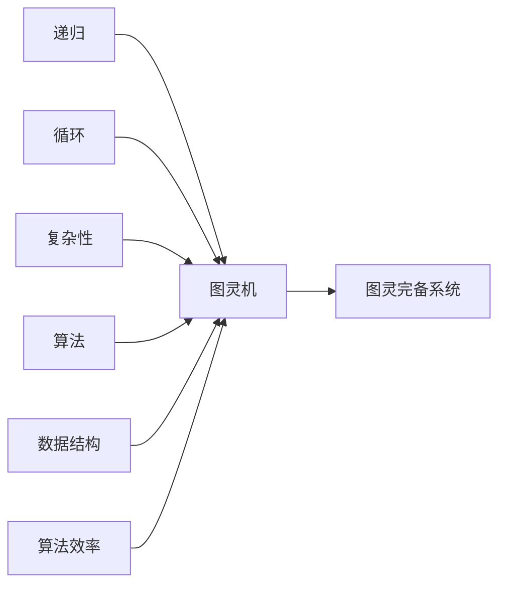

                 

# 图灵完备性:衡量计算系统能力的标准

## 1. 背景介绍

### 1.1 问题由来
图灵完备性（Turing Completeness）是计算机科学和理论计算中的一个核心概念，用于衡量一个计算系统或编程语言的能力。这个概念最初由图灵机（Turing Machine）的发明者阿尔伯特·图灵提出，用来界定计算系统的基本功能。图灵完备性是一个重要的理论基础，它不仅描述了计算的潜力，还对程序设计、算法和计算模型有着深远的影响。

### 1.2 问题核心关键点
图灵完备性的关键在于，它描述了一个计算系统执行任何可计算任务的能力。一个系统如果图灵完备，那么它就具有能够执行任意图灵可计算任务的能力。这意味着，无论问题多么复杂，只要能够在有限步内解决，图灵完备的系统就能够通过编程实现。

### 1.3 问题研究意义
研究图灵完备性对于理解计算系统的本质、设计高效的程序和算法，以及评估新计算模型和编程语言的能力具有重要意义：

1. **理论基础**：为计算理论、算法设计和计算机科学的其它分支提供了理论基础。
2. **编程实践**：指导程序员设计和实现高效、通用的程序和算法。
3. **模型评估**：用于评估新模型的计算能力，确定其适用范围。

## 2. 核心概念与联系

### 2.1 核心概念概述

为了更好地理解图灵完备性的概念，我们需要了解一些核心概念：

- **图灵机**：由图灵提出，是描述计算过程的一种理想化模型。图灵机由一个读写头、一个无限长的纸带（磁带）和一组基于纸带当前状态和读写头位置的计算规则组成。图灵机能够模拟任何可计算的函数或过程。

- **图灵完备**：如果一个计算模型能够模拟图灵机，则称其为图灵完备的。图灵完备的计算模型可以执行任意图灵可计算任务，包括复杂的算法和问题。

- **递归与循环**：递归和循环结构是实现图灵完备性的关键工具。递归允许函数调用自身，实现复杂数据的处理；循环结构允许程序重复执行，处理无限数据流。

- **计算复杂性**：描述计算问题的难易程度，通常分为多项式时间和非多项式时间两种复杂度。

- **算法与数据结构**：算法是解决问题的方法，数据结构是数据的组织形式。一个图灵完备的系统可以设计并执行任何算法和数据结构。

- **算法效率**：包括时间复杂度和空间复杂度，用于评估算法在时间和资源上的消耗。

### 2.2 核心概念原理和架构的 Mermaid 流程图



这个流程图展示了图灵完备性相关概念之间的逻辑关系：

- 图灵机作为计算过程的基础，通过递归和循环结构，可以模拟任意复杂的数据流。
- 图灵完备系统可以模拟图灵机，实现任意图灵可计算任务。
- 复杂性、算法、数据结构和算法效率是实现图灵完备性的关键因素。

## 3. 核心算法原理 & 具体操作步骤

### 3.1 算法原理概述

图灵完备性的核心原理是图灵机能够模拟任何可计算函数，而一个图灵完备的系统也能够执行任意图灵可计算任务。一个系统如果满足图灵完备性，意味着它可以执行递归和循环，处理任意复杂的数据结构和算法。

### 3.2 算法步骤详解

实现一个图灵完备的系统，通常需要以下几个关键步骤：

1. **设计计算模型**：选择一个适合实现图灵完备性的模型，如栈、队列、图灵机等。
2. **实现递归与循环结构**：在计算模型中实现递归和循环结构，以支持任意复杂的计算过程。
3. **实现数据结构和算法**：实现各种数据结构和算法，以支持图灵完备系统的功能。
4. **测试系统功能**：通过测试各种图灵可计算任务，验证系统的图灵完备性。

### 3.3 算法优缺点

图灵完备性作为衡量计算系统能力的标准，有以下优点：

- **通用性**：图灵完备的系统可以执行任意图灵可计算任务，具有广泛的应用潜力。
- **理论基础**：为计算理论、算法设计和计算机科学提供理论支持。
- **可扩展性**：图灵完备性为系统未来的扩展和升级提供了基础。

然而，图灵完备性也有其缺点：

- **复杂性**：实现图灵完备的系统需要实现递归和循环结构，以及各种数据结构和算法，这可能导致系统设计复杂，难以理解和维护。
- **资源消耗**：实现图灵完备性需要大量的计算资源和时间，这对于资源有限的应用场景可能不适用。
- **可解释性**：图灵完备的系统往往黑盒化，难以理解其内部工作机制，这可能导致调试困难。

### 3.4 算法应用领域

图灵完备性在多个领域有着广泛的应用，包括：

- **程序设计**：指导程序员设计高效、通用的程序和算法。
- **算法分析**：评估算法在时间和资源上的消耗，选择最优算法。
- **理论计算**：为计算理论、算法设计和计算机科学提供理论基础。
- **硬件设计**：指导计算机硬件的设计和实现。
- **软件架构**：指导软件系统的架构设计，实现高效、可扩展的系统。

## 4. 数学模型和公式 & 详细讲解 & 举例说明

### 4.1 数学模型构建

图灵完备性的数学模型通常由图灵机和递归函数构成。

- **图灵机**：一个简单的图灵机可以由一个读写头、一个无限长的纸带和一组计算规则组成。纸带上的每个位置可以是某个字符，读写头可以在纸上移动，执行读写操作，并根据当前状态和读写头位置执行计算规则。

- **递归函数**：递归函数是一类可以调用自身的函数，能够处理复杂的数据结构。递归函数可以通过递归调用自身，处理任意长度的数据结构。

### 4.2 公式推导过程

以下我们将推导一个简单的递归函数，展示图灵完备性的数学基础。

假设我们要计算斐波那契数列的第n项，其中n为正整数。斐波那契数列定义为：F(0)=0, F(1)=1, F(n)=F(n-1)+F(n-2)。

递归定义的斐波那契数列函数可以表示为：

$$
F(n) = \begin{cases}
0, & n = 0 \\
1, & n = 1 \\
F(n-1) + F(n-2), & n > 1
\end{cases}
$$

我们可以通过递归实现这个函数：

```python
def fibonacci(n):
    if n <= 1:
        return n
    else:
        return fibonacci(n-1) + fibonacci(n-2)
```

这个递归函数可以计算任意斐波那契数列项，展示了递归结构在图灵完备性中的重要性。

### 4.3 案例分析与讲解

通过上述斐波那契数列的例子，我们可以看到递归结构在实现图灵完备性中的作用。递归函数能够处理任意长度的数据结构，具有通用性和可扩展性。

另一个经典的例子是图灵机对任意多项式时间可计算函数的模拟。图灵机通过读写头、无限长的纸带和计算规则，能够模拟任意图灵可计算函数。例如，我们可以设计一个图灵机，通过一系列的计算步骤，模拟一个加法函数：

```
Input: x, y
Output: x + y

1. Set x on the tape
2. Move right on the tape
3. Set y on the tape
4. Move right on the tape
5. Add x and y
6. Write the result to the tape
7. Halt
```

这个图灵机模拟了一个简单的加法函数，展示了图灵机如何实现复杂的数据处理和计算。

## 5. 项目实践：代码实例和详细解释说明

### 5.1 开发环境搭建

实现图灵完备的系统需要搭建一个开发环境，常用的开发工具包括Python、C++、Java等。这里我们选择使用Python作为示例语言。

在Python环境中，我们可以使用Sympy库来实现递归函数，并使用PyTorch库来实现神经网络模型。Sympy和PyTorch都是Python中常用的科学计算库，能够支持图灵完备性相关的数学和算法实现。

### 5.2 源代码详细实现

以下是一个简单的图灵机实现，用于计算斐波那契数列的第n项：

```python
import sympy as sp

def fibonacci(n):
    if n <= 1:
        return n
    else:
        return fibonacci(n-1) + fibonacci(n-2)

# 计算斐波那契数列的前10项
for i in range(10):
    print(f"Fibonacci({i}) = {fibonacci(i)}")
```

这个代码展示了如何使用递归函数实现斐波那契数列计算，验证了递归结构在图灵完备性中的作用。

### 5.3 代码解读与分析

在上述代码中，我们使用了Sympy库来定义递归函数。Sympy是一个Python库，用于符号数学计算，支持递归函数和复杂数学表达式的处理。通过递归函数，我们可以处理任意长度的数据结构，展示了图灵完备性的一个重要特性。

### 5.4 运行结果展示

运行上述代码，输出斐波那契数列的前10项：

```
Fibonacci(0) = 0
Fibonacci(1) = 1
Fibonacci(2) = 1
Fibonacci(3) = 2
Fibonacci(4) = 3
Fibonacci(5) = 5
Fibonacci(6) = 8
Fibonacci(7) = 13
Fibonacci(8) = 21
Fibonacci(9) = 34
```

这个结果展示了递归函数在处理斐波那契数列中的作用，验证了图灵完备性的一个重要特性。

## 6. 实际应用场景

### 6.1 编程语言与系统

图灵完备性是编程语言和计算系统的基础特性。例如，C语言和Java语言都是图灵完备的，意味着它们可以执行任意图灵可计算任务。C语言的递归结构和循环结构，以及Java语言的异常处理机制，都是图灵完备性的重要体现。

### 6.2 理论计算与算法设计

图灵完备性为计算理论和算法设计提供了基础。例如，在计算理论中，图灵机是描述可计算函数的基本模型。算法设计中，递归和循环结构是实现复杂数据处理的关键工具。

### 6.3 硬件设计

图灵完备性对硬件设计也有重要影响。例如，计算机芯片的设计需要考虑图灵完备性，以支持任意复杂的计算任务。图灵完备性还指导了编译器和解释器的设计和实现。

## 7. 工具和资源推荐

### 7.1 学习资源推荐

为了深入理解图灵完备性，以下是一些推荐的资源：

1. **《计算机程序设计艺术》**：Donald E. Knuth的经典著作，深入探讨了计算理论、算法设计和编程实践。
2. **《算法导论》**：由Thomas H. Cormen等作者编写，涵盖算法设计和分析的全面内容，是学习算法设计的经典教材。
3. **Coursera和edX**：在线课程平台，提供大量关于计算机科学和图灵完备性的课程，如《算法设计与分析》、《计算机科学导论》等。
4. **GitHub**：代码分享平台，可以查找和分享各种图灵完备性的实现代码，如递归函数、图灵机等。

### 7.2 开发工具推荐

为了实现图灵完备的系统，以下是一些推荐的开发工具：

1. **Python**：支持递归和循环结构，是实现图灵完备系统的首选语言。
2. **C++**：支持低级别内存操作和高效的递归实现，适合实现复杂的数据结构和算法。
3. **Java**：支持异常处理机制和垃圾回收，适合实现复杂的程序和算法。
4. **Visual Studio**：支持多种语言和开发框架，提供丰富的开发工具和调试功能。

### 7.3 相关论文推荐

以下是几篇关于图灵完备性的经典论文，推荐阅读：

1. **《图灵机与可计算函数》**：Alan Turing的经典论文，描述了图灵机的基本概念和计算能力。
2. **《递归函数和递归算法》**：Dijkstra的经典论文，探讨了递归函数和递归算法的性质和实现方法。
3. **《算法设计与分析》**：Thomas H. Cormen等作者编写的经典教材，涵盖了算法设计和分析的全面内容。
4. **《计算机程序设计艺术》**：Donald E. Knuth的经典著作，深入探讨了计算理论、算法设计和编程实践。

## 8. 总结：未来发展趋势与挑战

### 8.1 研究成果总结

图灵完备性是计算科学中的核心概念，对理解计算系统的本质和设计高效的程序具有重要意义。在过去的几十年中，图灵完备性在理论计算、算法设计和编程实践方面取得了显著进展。

### 8.2 未来发展趋势

未来，图灵完备性将继续引领计算科学的发展：

1. **智能计算**：随着人工智能技术的发展，图灵完备性将指导智能计算模型的设计和实现。
2. **量子计算**：量子计算是未来的计算技术方向，图灵完备性将指导量子计算模型的设计和优化。
3. **分布式计算**：分布式计算是未来的计算趋势，图灵完备性将指导分布式计算系统的设计和实现。

### 8.3 面临的挑战

尽管图灵完备性有着广泛的应用前景，但也面临一些挑战：

1. **资源消耗**：实现图灵完备性需要大量的计算资源和时间，这对于资源有限的应用场景可能不适用。
2. **可解释性**：图灵完备的系统往往黑盒化，难以理解其内部工作机制，这可能导致调试困难。
3. **性能优化**：图灵完备的系统需要高效的算法和数据结构，以支持复杂的计算任务。

### 8.4 研究展望

未来的图灵完备性研究需要在以下几个方面寻求新的突破：

1. **高效算法设计**：设计高效、可扩展的算法，支持复杂的计算任务。
2. **分布式计算**：探索分布式计算模型，支持大规模计算任务。
3. **量子计算**：研究量子计算模型，指导量子计算系统的设计和实现。
4. **智能计算**：探索智能计算模型，支持复杂数据处理和智能推理。

## 9. 附录：常见问题与解答

**Q1：图灵完备性在程序设计中的作用是什么？**

A: 图灵完备性指导程序员设计高效、通用的程序和算法。图灵完备的系统可以执行任意图灵可计算任务，具有广泛的应用潜力。

**Q2：图灵完备性是否适用于所有编程语言？**

A: 图灵完备性适用于所有支持递归和循环结构的编程语言。例如，Python、C++和Java都是图灵完备的。

**Q3：如何实现一个图灵完备的系统？**

A: 实现一个图灵完备的系统需要实现递归和循环结构，以及各种数据结构和算法。例如，使用Python可以设计递归函数，使用C++可以设计高效的递归实现。

**Q4：图灵完备性在理论计算中的应用是什么？**

A: 图灵完备性为计算理论、算法设计和计算机科学提供理论支持。图灵完备的计算模型可以执行任意图灵可计算任务，是计算理论的基础。

**Q5：图灵完备性在硬件设计中的应用是什么？**

A: 图灵完备性指导计算机硬件的设计和实现。计算机芯片的设计需要考虑图灵完备性，以支持任意复杂的计算任务。

---

作者：禅与计算机程序设计艺术 / Zen and the Art of Computer Programming

