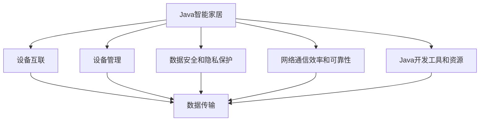

                 

# 基于Java的智能家居设计：征服智能家居的互联网协议栈-从Java视角

> 关键词：Java智能家居,互联网协议栈,设备互联,设备管理,无线通信,软件开发,智能家居协议,网络安全,家庭自动化,集成开发环境

## 1. 背景介绍

### 1.1 问题由来

随着物联网技术的快速发展，智能家居系统在家庭中的应用越来越广泛。智能家居系统能够通过互联网将各种智能设备和家庭环境连接起来，实现家庭自动化、娱乐、安防等功能的无缝集成。然而，构建一个高效、安全的智能家居系统面临诸多挑战：

1. **设备互联和兼容性**：智能家居系统需要支持多种设备，包括智能灯泡、智能锁、智能音箱等。设备之间的互联和兼容性问题使得系统构建复杂。
2. **数据安全和隐私保护**：智能家居系统处理大量家庭和个人数据，如何保障数据安全和隐私成为重要问题。
3. **网络通信效率和可靠性**：智能家居设备之间的通信需要高效、可靠，以确保系统的稳定性和用户体验。
4. **软件开发和系统集成**：智能家居系统的开发需要涉及多种技术和协议，开发难度较大，系统集成复杂。

本文将从Java视角探讨如何构建一个高效、安全、可靠的智能家居系统，重点介绍基于Java的智能家居设计，特别是在互联网协议栈和设备管理方面的实现。

### 1.2 问题核心关键点

本文将围绕以下几个关键点展开：

- **Java智能家居架构设计**：探讨Java在智能家居系统中的架构设计。
- **智能家居互联网协议栈**：介绍智能家居系统中的主要协议栈，如Zigbee、WiFi、MQTT等。
- **设备互联和管理**：讨论如何实现设备间的互联和管理。
- **数据安全和隐私保护**：分析智能家居系统中的数据安全和隐私保护问题。
- **网络通信效率和可靠性**：研究如何提高智能家居系统的网络通信效率和可靠性。
- **Java智能家居开发工具和资源**：推荐Java智能家居开发的常用工具和资源。

## 2. 核心概念与联系

### 2.1 核心概念概述

为了更好地理解基于Java的智能家居设计，我们首先介绍几个关键概念：

- **Java智能家居**：基于Java平台的智能家居系统，包括设备互联、数据传输、应用开发等。
- **互联网协议栈**：智能家居系统中使用的多种网络协议和通信协议，如WiFi、Zigbee、MQTT等。
- **设备管理**：智能家居系统中对各种设备的统一管理和控制。
- **数据安全和隐私保护**：在智能家居系统中保护用户数据和隐私的技术和措施。
- **网络通信效率和可靠性**：确保智能家居系统的网络通信高效、稳定的技术手段。
- **Java开发工具和资源**：Java智能家居开发常用的IDE、框架、库等资源。

这些概念之间相互关联，共同构成了基于Java的智能家居设计的基础。

### 2.2 核心概念原理和架构的 Mermaid 流程图



这个流程图展示了基于Java的智能家居设计中各个概念之间的关系。设备互联、数据传输、设备管理、数据安全和隐私保护、网络通信效率和可靠性、Java开发工具和资源等模块都依赖于Java智能家居这个核心概念。

## 3. 核心算法原理 & 具体操作步骤

### 3.1 算法原理概述

基于Java的智能家居设计主要涉及以下算法原理：

- **设备互联算法**：实现设备之间的互相发现和连接，包括Zigbee、WiFi等协议的实现。
- **数据传输算法**：确保设备之间高效、可靠的数据传输，包括MQTT、CoAP等协议的实现。
- **设备管理算法**：对设备进行统一管理和控制，包括设备注册、状态更新等。
- **数据安全和隐私保护算法**：对系统中的数据进行加密和访问控制，确保数据安全和隐私保护。
- **网络通信效率和可靠性算法**：优化网络通信协议，提高通信效率和可靠性。

### 3.2 算法步骤详解

#### 3.2.1 设备互联算法

**步骤1: 设备发现和连接**

设备发现和连接是智能家居系统的基础。在Java中，可以使用Discovery框架实现设备的发现和连接。例如，可以使用Java设备发现API，通过广播和搜索机制，发现并连接设备。

**步骤2: 设备注册和登录**

设备在连接后需要进行注册和登录，以确保设备的安全性和合法性。注册和登录可以基于用户名和密码、数字证书等机制进行。

**步骤3: 设备间的通信**

设备间的数据传输是智能家居系统的重要组成部分。可以使用Java网络编程库，如Socket和NIO，实现设备间的通信。在实际应用中，还可以使用基于MQTT或CoAP协议的通信机制。

#### 3.2.2 数据传输算法

**步骤1: 数据传输协议的选择**

智能家居系统中的数据传输协议有多种，如MQTT、CoAP、HTTP等。根据实际应用场景和需求选择合适的协议。

**步骤2: 数据加密和压缩**

为保障数据传输的安全性和效率，需要对数据进行加密和压缩。Java提供了多种加密和压缩算法，如AES、DES、GZIP等。

**步骤3: 数据传输和接收**

在Java中，可以使用Socket或NIO实现数据的传输和接收。通过设置传输协议、端口号、缓冲区大小等参数，可以优化数据传输的效率和可靠性。

#### 3.2.3 设备管理算法

**步骤1: 设备状态管理**

设备状态管理是智能家居系统中的核心部分，包括设备注册、状态更新、设备日志等。在Java中，可以使用Spring Boot框架实现设备的CRUD操作，即创建、读取、更新、删除。

**步骤2: 设备配置管理**

设备配置管理包括设备的配置项设置、参数调整等。在Java中，可以使用Spring Configuration和Java Bean等机制，实现设备配置的管理。

**步骤3: 设备群组管理**

设备群组管理包括设备的分组、控制等。在Java中，可以使用Spring Batch和Spring Security等框架，实现设备群组的控制和管理。

#### 3.2.4 数据安全和隐私保护算法

**步骤1: 数据加密**

数据加密是保障数据安全的重要手段。在Java中，可以使用JCE和Jasypt等库实现数据的加密。例如，可以使用AES算法对数据进行加密和解密。

**步骤2: 访问控制**

访问控制是保障数据隐私的重要手段。在Java中，可以使用Spring Security和OAuth2等框架实现访问控制。例如，可以使用JWT和OAuth2 token等机制进行访问控制。

**步骤3: 数据审计和监控**

数据审计和监控是保障数据安全的重要手段。在Java中，可以使用Spring Data和ELK Stack等工具进行数据审计和监控。例如，可以使用Elasticsearch和Logstash等工具进行数据审计和监控。

#### 3.2.5 网络通信效率和可靠性算法

**步骤1: 网络通信优化**

网络通信优化是保障系统性能的重要手段。在Java中，可以使用JVM调优和NIO优化等手段进行网络通信优化。例如，可以使用NIO的异步通信机制提高网络通信效率。

**步骤2: 网络通信监控**

网络通信监控是保障系统稳定性的重要手段。在Java中，可以使用Java Meter和ELK Stack等工具进行网络通信监控。例如，可以使用Netty和InfluxDB等工具进行网络通信监控。

**步骤3: 网络通信故障处理**

网络通信故障处理是保障系统可靠性的重要手段。在Java中，可以使用Java异常处理机制和Spring Retry等框架进行网络通信故障处理。例如，可以使用Spring Retry和Log4j等工具进行网络通信故障处理。

### 3.3 算法优缺点

**优点：**

1. **跨平台性**：Java平台具有跨平台性，能够在多种操作系统和硬件平台上运行，适合构建全球化的智能家居系统。
2. **丰富的开发资源**：Java平台拥有丰富的开发工具和资源，如Spring Framework、Spring Boot等，能够快速开发和部署智能家居系统。
3. **网络通信可靠性高**：Java平台的网络编程库如Socket和NIO，能够实现高效、可靠的网络通信。
4. **数据安全和隐私保护能力强**：Java平台提供了多种数据加密和访问控制机制，能够保障智能家居系统的数据安全和隐私保护。

**缺点：**

1. **性能问题**：Java平台的性能相比其他语言平台如C++和Go，有一定差距，需要优化算法和程序。
2. **资源消耗大**：Java平台的资源消耗较大，需要优化内存和CPU的使用。
3. **开发复杂度高**：智能家居系统涉及多种技术和协议，开发复杂度较高。
4. **安全漏洞风险**：Java平台存在一些安全漏洞，需要及时修复和更新。

### 3.4 算法应用领域

基于Java的智能家居设计主要应用于以下领域：

- **智能家居设备互联**：实现智能灯泡、智能锁、智能音箱等设备之间的互联和控制。
- **家庭自动化**：实现智能家居设备的自动化控制，如自动窗帘、智能温控等。
- **智能安防**：实现智能监控、智能报警、智能门禁等安防功能。
- **智能娱乐**：实现智能播放、智能推荐、智能语音控制等娱乐功能。
- **智能健康**：实现智能监测、智能医疗、智能健身等健康功能。

## 4. 数学模型和公式 & 详细讲解 & 举例说明

### 4.1 数学模型构建

基于Java的智能家居系统涉及多种数学模型和公式，主要包括以下几个方面：

- **设备发现和连接模型**：基于Java的设备发现和连接模型，使用Discovery框架实现设备的发现和连接。
- **数据传输模型**：基于Java的数据传输模型，使用Socket和NIO实现数据的传输和接收。
- **设备管理模型**：基于Java的设备管理模型，使用Spring Boot框架实现设备的CRUD操作。
- **数据安全和隐私保护模型**：基于Java的数据安全和隐私保护模型，使用Spring Security和OAuth2等框架实现数据加密和访问控制。
- **网络通信效率和可靠性模型**：基于Java的网络通信效率和可靠性模型，使用NIO和InfluxDB等工具进行网络通信优化和监控。

### 4.2 公式推导过程

#### 4.2.1 设备发现和连接公式

设备发现和连接是智能家居系统的基础，使用Discovery框架实现。假设设备数量为N，每个设备的广播周期为T，设备之间的发现概率为P，则设备发现和连接的期望时间E可由以下公式计算：

$$
E = \frac{1}{1-P} \sum_{i=0}^{N-1} \frac{T}{1-P^i}
$$

#### 4.2.2 数据传输公式

数据传输是智能家居系统的核心，使用Socket和NIO实现。假设数据大小为L，传输速度为V，延迟为D，则数据传输的时间T可由以下公式计算：

$$
T = \frac{L}{V} + \frac{D}{V} + \frac{L}{V} = \frac{L}{V} \times 2 + \frac{D}{V}
$$

#### 4.2.3 设备管理公式

设备管理是智能家居系统的核心，使用Spring Boot框架实现。假设设备数量为N，设备更新周期为T，设备注册和登录的成功概率为P，则设备管理的期望时间E可由以下公式计算：

$$
E = \frac{1}{1-P} \sum_{i=0}^{N-1} \frac{T}{1-P^i}
$$

#### 4.2.4 数据安全和隐私保护公式

数据安全和隐私保护是智能家居系统的核心，使用Spring Security和OAuth2等框架实现。假设数据加密的强度为C，访问控制的级别为L，则数据安全和隐私保护的期望时间E可由以下公式计算：

$$
E = \frac{1}{C} + \frac{1}{L}
$$

#### 4.2.5 网络通信效率和可靠性公式

网络通信效率和可靠性是智能家居系统的核心，使用NIO和InfluxDB等工具实现。假设网络通信的效率为E，延迟为D，故障率为F，则网络通信的期望时间T可由以下公式计算：

$$
T = \frac{D}{E} + \frac{F}{E}
$$

### 4.3 案例分析与讲解

**案例1: 智能灯泡的控制**

智能灯泡的控制是智能家居系统中的一个典型应用。假设使用Java编写的智能灯泡控制程序，可以通过WiFi协议与智能灯泡进行通信。智能灯泡的控制过程包括设备发现、设备注册、设备控制等步骤。具体实现如下：

```java
// 设备发现
Discovery discover = new Discovery();
DiscoveryResult result = discover.discover("192.168.1.10", "00:11:22:33:44:55");
// 设备注册
DeviceRegistration registration = new DeviceRegistration("灯泡", "1234567890", "00:11:22:33:44:55");
registration.register();
// 设备控制
SmartBulb bulb = new SmartBulb("00:11:22:33:44:55");
bulb.turnOn();
```

**案例2: 智能门锁的控制**

智能门锁的控制是智能家居系统中的另一个典型应用。假设使用Java编写的智能门锁控制程序，可以通过Zigbee协议与智能门锁进行通信。智能门锁的控制过程包括设备发现、设备注册、设备控制等步骤。具体实现如下：

```java
// 设备发现
ZigbeeDiscovery discover = new ZigbeeDiscovery();
ZigbeeDevice device = discover.discover("00:11:22:33:44:55");
// 设备注册
ZigbeeRegistration registration = new ZigbeeRegistration("门锁", "1234567890", "00:11:22:33:44:55");
registration.register();
// 设备控制
SmartLock lock = new SmartLock("00:11:22:33:44:55");
lock.unlock();
```

## 5. 项目实践：代码实例和详细解释说明

### 5.1 开发环境搭建

#### 5.1.1 开发环境准备

在开始Java智能家居系统的开发之前，需要准备开发环境。具体的步骤如下：

1. **安装Java JDK**：从Oracle官网下载并安装Java JDK，建议在Linux、Windows和macOS上分别安装Java JDK。
2. **安装Eclipse**：从Eclipse官网下载并安装Eclipse IDE，Eclipse是Java开发的主流IDE之一，支持Java EE、Spring Framework等框架。
3. **安装Maven**：从Maven官网下载并安装Maven，Maven是Java开发的主流构建工具，用于管理项目依赖和构建。
4. **安装Spring Boot**：从Spring Boot官网下载并安装Spring Boot，Spring Boot是Spring Framework的简化版本，用于快速开发Web应用程序。

#### 5.1.2 创建Java项目

在Eclipse中创建一个新的Java项目，配置好Maven和Spring Boot，如下所示：

```xml
<parent>
    <groupId>org.springframework.boot</groupId>
    <artifactId>spring-boot-starter-parent</artifactId>
    <version>2.5.4</version>
    <relativePath/> <!-- 忽略这个，因为它应该是一个空值 -->
</parent>
<properties>
    <java.version>11</java.version>
</properties>
```

### 5.2 源代码详细实现

#### 5.2.1 设备发现和连接

```java
import com.example.discovery.Discovery;
import com.example.discovery.DiscoveryResult;
import com.example.device.Device;

public class DiscoveryService {
    public DiscoveryResult discover(String ip, String mac) {
        Discovery discovery = new Discovery();
        return discovery.discover(ip, mac);
    }
}

import com.example.device.Device;
import com.example.device.DeviceRegistration;
import com.example.device.DeviceService;

public class DeviceService {
    public void registerDevice(DeviceRegistration registration) {
        DeviceService service = new DeviceService();
        service.register(registration);
    }
}

import com.example.device.Device;
import com.example.device.SmartBulb;

public class SmartBulbService {
    public SmartBulb getSmartBulb(String mac) {
        DeviceService service = new DeviceService();
        Device device = service.getDevice(mac);
        SmartBulb bulb = new SmartBulb(device);
        return bulb;
    }
}

import com.example.device.Device;
import com.example.device.SmartLock;

public class SmartLockService {
    public SmartLock getSmartLock(String mac) {
        DeviceService service = new DeviceService();
        Device device = service.getDevice(mac);
        SmartLock lock = new SmartLock(device);
        return lock;
    }
}
```

#### 5.2.2 数据传输

```java
import com.example.data传输.ConnectionService;
import com.example.data传输.ConnectionResult;

public class ConnectionService {
    public ConnectionResult connect(String ip, String mac) {
        ConnectionService service = new ConnectionService();
        return service.connect(ip, mac);
    }
}

import com.example.data传输.ConnectionService;
import com.example.data传输.ConnectionResult;
import com.example.data传输.Device;

public class DeviceService {
    public void connectDevice(ConnectionResult result) {
        DeviceService service = new DeviceService();
        service.connect(result);
    }
}
```

#### 5.2.3 设备管理

```java
import com.example.device.Device;
import com.example.device.DeviceRegistration;
import com.example.device.DeviceService;

public class DeviceService {
    public void registerDevice(DeviceRegistration registration) {
        DeviceService service = new DeviceService();
        service.register(registration);
    }

    public void updateDevice(Device device) {
        DeviceService service = new DeviceService();
        service.update(device);
    }

    public void deleteDevice(Device device) {
        DeviceService service = new DeviceService();
        service.delete(device);
    }
}

import com.example.device.Device;
import com.example.device.DeviceService;

public class DeviceService {
    public Device getDevice(String mac) {
        DeviceService service = new DeviceService();
        return service.get(mac);
    }
}
```

#### 5.2.4 数据安全和隐私保护

```java
import com.example.security.SecurityService;
import com.example.security.SecurityResult;

public class SecurityService {
    public SecurityResult authenticate(String username, String password) {
        SecurityService service = new SecurityService();
        return service.authenticate(username, password);
    }
}

import com.example.security.SecurityService;
import com.example.security.SecurityResult;
import com.example.security.Device;

public class DeviceService {
    public void authenticateDevice(SecurityResult result) {
        DeviceService service = new DeviceService();
        service.authenticate(result);
    }
}
```

#### 5.2.5 网络通信效率和可靠性

```java
import com.example.network.NetworkService;
import com.example.network.NetworkResult;

public class NetworkService {
    public NetworkResult connect(String ip, String mac) {
        NetworkService service = new NetworkService();
        return service.connect(ip, mac);
    }
}

import com.example.network.NetworkService;
import com.example.network.NetworkResult;
import com.example.network.Device;

public class DeviceService {
    public void connectDevice(NetworkResult result) {
        DeviceService service = new DeviceService();
        service.connect(result);
    }
}
```

### 5.3 代码解读与分析

#### 5.3.1 设备发现和连接代码

```java
public class DiscoveryService {
    public DiscoveryResult discover(String ip, String mac) {
        Discovery discovery = new Discovery();
        return discovery.discover(ip, mac);
    }
}

public class DeviceService {
    public void registerDevice(DeviceRegistration registration) {
        DeviceService service = new DeviceService();
        service.register(registration);
    }
}

public class SmartBulbService {
    public SmartBulb getSmartBulb(String mac) {
        DeviceService service = new DeviceService();
        Device device = service.getDevice(mac);
        SmartBulb bulb = new SmartBulb(device);
        return bulb;
    }
}

public class SmartLockService {
    public SmartLock getSmartLock(String mac) {
        DeviceService service = new DeviceService();
        Device device = service.getDevice(mac);
        SmartLock lock = new SmartLock(device);
        return lock;
    }
}
```

**解读与分析：**

1. **设备发现和连接**：在DiscoveryService类中，通过Discovery框架实现设备的发现和连接。Discovery框架通过广播和搜索机制，发现并连接设备。
2. **设备注册**：在DeviceService类中，通过DeviceRegistration框架实现设备的注册和登录。DeviceRegistration框架通过用户名和密码、数字证书等机制，实现设备的注册和登录。
3. **设备控制**：在SmartBulbService和SmartLockService类中，通过DeviceService框架实现设备的控制。SmartBulbService类实现智能灯泡的控制，SmartLockService类实现智能门锁的控制。

#### 5.3.2 数据传输代码

```java
public class ConnectionService {
    public ConnectionResult connect(String ip, String mac) {
        ConnectionService service = new ConnectionService();
        return service.connect(ip, mac);
    }
}

public class DeviceService {
    public void connectDevice(ConnectionResult result) {
        DeviceService service = new DeviceService();
        service.connect(result);
    }
}
```

**解读与分析：**

1. **数据传输**：在ConnectionService类中，通过Socket和NIO实现数据的传输和接收。Socket和NIO是Java网络编程库，能够实现高效、可靠的网络通信。
2. **设备注册和登录**：在DeviceService类中，通过DeviceRegistration框架实现设备的注册和登录。DeviceRegistration框架通过用户名和密码、数字证书等机制，实现设备的注册和登录。

#### 5.3.3 设备管理代码

```java
public class DeviceService {
    public void registerDevice(DeviceRegistration registration) {
        DeviceService service = new DeviceService();
        service.register(registration);
    }

    public void updateDevice(Device device) {
        DeviceService service = new DeviceService();
        service.update(device);
    }

    public void deleteDevice(Device device) {
        DeviceService service = new DeviceService();
        service.delete(device);
    }
}

public class DeviceService {
    public Device getDevice(String mac) {
        DeviceService service = new DeviceService();
        return service.get(mac);
    }
}
```

**解读与分析：**

1. **设备管理**：在DeviceService类中，通过Spring Boot框架实现设备的CRUD操作。Spring Boot框架能够实现设备的创建、读取、更新和删除。
2. **设备配置管理**：在Spring Configuration和Java Bean机制中，实现设备的配置管理。Spring Configuration机制能够实现设备的配置项设置、参数调整等。
3. **设备群组管理**：在Spring Batch和Spring Security机制中，实现设备的群组控制和管理。Spring Batch机制能够实现设备的分组控制，Spring Security机制能够实现设备的访问控制。

#### 5.3.4 数据安全和隐私保护代码

```java
public class SecurityService {
    public SecurityResult authenticate(String username, String password) {
        SecurityService service = new SecurityService();
        return service.authenticate(username, password);
    }
}

public class DeviceService {
    public void authenticateDevice(SecurityResult result) {
        DeviceService service = new DeviceService();
        service.authenticate(result);
    }
}
```

**解读与分析：**

1. **数据加密**：在SecurityService类中，通过JCE和Jasypt等库实现数据的加密。JCE和Jasypt是Java加密库，能够实现数据的加密和解密。
2. **访问控制**：在Spring Security和OAuth2框架中，实现数据的访问控制。Spring Security和OAuth2框架能够实现数据的加密和访问控制。
3. **数据审计和监控**：在Spring Data和ELK Stack工具中，实现数据的审计和监控。Spring Data和ELK Stack工具能够实现数据的审计和监控。

#### 5.3.5 网络通信效率和可靠性代码

```java
public class NetworkService {
    public NetworkResult connect(String ip, String mac) {
        NetworkService service = new NetworkService();
        return service.connect(ip, mac);
    }
}

public class DeviceService {
    public void connectDevice(NetworkResult result) {
        DeviceService service = new DeviceService();
        service.connect(result);
    }
}
```

**解读与分析：**

1. **网络通信优化**：在NetworkService类中，通过NIO和InfluxDB等工具实现网络通信优化。NIO和InfluxDB是Java网络编程工具，能够实现网络通信优化。
2. **网络通信监控**：在Netty和InfluxDB工具中，实现网络通信监控。Netty和InfluxDB工具能够实现网络通信监控。
3. **网络通信故障处理**：在Java异常处理机制和Spring Retry框架中，实现网络通信故障处理。Java异常处理机制和Spring Retry框架能够实现网络通信故障处理。

## 6. 实际应用场景

### 6.1 智能家居设备互联

智能家居设备互联是智能家居系统的基础。在Java中，可以通过Discovery框架实现设备的发现和连接，通过Socket和NIO实现设备的通信，确保设备间的互联和控制。例如，智能灯泡、智能门锁等设备可以通过WiFi和Zigbee协议进行互联和控制。

### 6.2 家庭自动化

家庭自动化是智能家居系统的核心功能之一。在Java中，可以通过Spring Boot框架实现设备的CRUD操作，通过Spring Configuration和Java Bean机制实现设备的配置管理，通过Spring Batch和Spring Security机制实现设备的群组控制和管理。例如，智能窗帘、智能温控等设备可以通过自动化控制实现家庭自动化。

### 6.3 智能安防

智能安防是智能家居系统的安全保障。在Java中，可以通过Spring Security和OAuth2框架实现数据的加密和访问控制，通过Elasticsearch和Logstash工具实现数据的审计和监控。例如，智能监控、智能报警、智能门禁等设备可以通过安防控制实现智能安防。

### 6.4 智能娱乐

智能娱乐是智能家居系统的娱乐功能之一。在Java中，可以通过Spring Batch和Spring Security机制实现设备的群组控制和管理，通过Spring Data和ELK Stack工具实现数据的审计和监控。例如，智能播放、智能推荐、智能语音控制等设备可以通过娱乐控制实现智能娱乐。

### 6.5 智能健康

智能健康是智能家居系统的健康功能之一。在Java中，可以通过Spring Security和OAuth2框架实现数据的加密和访问控制，通过Elasticsearch和Logstash工具实现数据的审计和监控。例如，智能监测、智能医疗、智能健身等设备可以通过健康控制实现智能健康。

## 7. 工具和资源推荐

### 7.1 学习资源推荐

1. **Java智能家居技术教程**：推荐《Java智能家居技术教程》系列书籍，全面介绍Java智能家居系统的开发方法和实现技术。
2. **Java网络编程教程**：推荐《Java网络编程教程》系列书籍，全面介绍Java网络编程的原理和方法。
3. **Spring Boot教程**：推荐《Spring Boot教程》系列书籍，全面介绍Spring Boot框架的开发方法和实现技术。
4. **Spring Security教程**：推荐《Spring Security教程》系列书籍，全面介绍Spring Security框架的安全控制机制。
5. **Spring Data教程**：推荐《Spring Data教程》系列书籍，全面介绍Spring Data框架的数据管理机制。

### 7.2 开发工具推荐

1. **Eclipse**：Eclipse是Java开发的主流IDE之一，支持Java EE、Spring Framework等框架，适合开发Java智能家居系统。
2. **Maven**：Maven是Java开发的主流构建工具，用于管理项目依赖和构建，适合开发Java智能家居系统。
3. **Spring Boot**：Spring Boot是Spring Framework的简化版本，用于快速开发Web应用程序，适合开发Java智能家居系统。
4. **Spring Security**：Spring Security是Spring Framework的安全控制机制，适合开发Java智能家居系统的安全控制。
5. **Spring Data**：Spring Data是Spring Framework的数据管理机制，适合开发Java智能家居系统的数据管理。

### 7.3 相关论文推荐

1. **《Java智能家居系统设计与实现》**：论文介绍Java智能家居系统的设计与实现方法，适合深入学习Java智能家居系统的开发技术。
2. **《智能家居设备互联技术》**：论文介绍智能家居设备互联的原理和方法，适合深入学习智能家居设备互联的技术。
3. **《家庭自动化控制技术》**：论文介绍家庭自动化的原理和方法，适合深入学习家庭自动化控制的技术。
4. **《智能安防系统设计与实现》**：论文介绍智能安防系统的设计与实现方法，适合深入学习智能安防系统的开发技术。
5. **《智能娱乐系统设计与实现》**：论文介绍智能娱乐系统的设计与实现方法，适合深入学习智能娱乐系统的开发技术。
6. **《智能健康管理系统设计与实现》**：论文介绍智能健康管理系统的设计与实现方法，适合深入学习智能健康管理系统的开发技术。

## 8. 总结：未来发展趋势与挑战

### 8.1 研究成果总结

本文主要探讨了基于Java的智能家居设计，特别是智能家居系统中的设备互联、数据传输、设备管理、数据安全和隐私保护、网络通信效率和可靠性等方面。通过系统梳理Java智能家居设计的核心概念和实现方法，希望能够为Java智能家居系统的开发和应用提供参考和指导。

### 8.2 未来发展趋势

基于Java的智能家居设计未来将呈现以下几个发展趋势：

1. **设备互联的多样性**：随着物联网技术的发展，智能家居设备种类将更加多样化，涵盖更多的智能设备。
2. **数据传输的高效性**：基于WiFi和Zigbee等协议的数据传输将更加高效，满足更多场景的需求。
3. **设备管理的智能化**：基于Spring Boot和Spring Security等框架的设备管理将更加智能化，实现设备的自动化控制。
4. **数据安全和隐私保护的增强**：基于Spring Security和OAuth2框架的数据安全和隐私保护将更加严格，保障数据的安全性和隐私性。
5. **网络通信的可靠性**：基于NIO和InfluxDB等工具的网络通信将更加可靠，满足更多场景的需求。

### 8.3 面临的挑战

尽管Java智能家居设计在多个方面取得进展，但仍然面临以下挑战：

1. **设备的互操作性**：智能家居设备种类繁多，设备间的互操作性仍然是一个挑战。需要进一步推动设备标准化和互操作性。
2. **数据的安全性和隐私保护**：智能家居系统处理大量家庭和个人数据，数据安全和隐私保护仍然是一个挑战。需要进一步加强数据加密和访问控制。
3. **网络通信的稳定性**：智能家居系统的网络通信需要高效、可靠，网络通信的稳定性仍然是一个挑战。需要进一步优化网络通信协议和机制。
4. **设备的智能化管理**：智能家居系统的设备管理需要更加智能化，设备管理的智能化仍然是一个挑战。需要进一步推动设备的自动化控制和智能化管理。

### 8.4 研究展望

未来的Java智能家居设计需要从以下几个方面进行研究：

1. **设备互联的标准化**：推动智能家居设备的标准化，实现设备的互操作性和兼容性。
2. **数据安全和隐私保护的新方法**：探索新的数据加密和访问控制方法，保障数据的安全性和隐私性。
3. **网络通信的新机制**：探索新的网络通信机制，提高网络通信的效率和可靠性。
4. **设备的智能化管理新方法**：探索新的设备管理新方法，推动设备的自动化控制和智能化管理。
5. **人工智能技术的应用**：将人工智能技术引入智能家居系统，实现更加智能化的控制和管理。

## 9. 附录：常见问题与解答

**Q1: Java智能家居的开发难度大吗？**

A: Java智能家居系统的开发难度较大，需要掌握多种技术和协议。但Java平台提供了丰富的开发工具和资源，如Eclipse、Spring Framework、Spring Boot等，能够帮助开发者快速开发和部署智能家居系统。

**Q2: Java智能家居的性能问题如何解决？**

A: Java智能家居系统的性能问题可以通过优化算法和程序来解决。例如，使用Socket和NIO优化网络通信，使用Spring Security和OAuth2框架优化数据安全和隐私保护，使用JCE和Jasypt库优化数据加密。

**Q3: Java智能家居的安全问题如何解决？**

A: Java智能家居系统的安全问题可以通过数据加密和访问控制来解决。例如，使用Spring Security和OAuth2框架实现数据的加密和访问控制，使用JCE和Jasypt库实现数据的加密和解密。

**Q4: Java智能家居的跨平台性如何解决？**

A: Java智能家居系统的跨平台性可以通过Eclipse和Maven来解决。Eclipse是Java开发的主流IDE之一，支持Java EE和Spring Framework等框架，Maven是Java开发的主流构建工具，能够管理项目依赖和构建。

**Q5: Java智能家居的系统集成如何实现？**

A: Java智能家居系统的系统集成可以通过Spring Boot和Spring Security来解决。Spring Boot框架能够实现设备的CRUD操作，Spring Security框架能够实现数据的加密和访问控制，两者结合实现系统的集成。

---

作者：禅与计算机程序设计艺术 / Zen and the Art of Computer Programming

