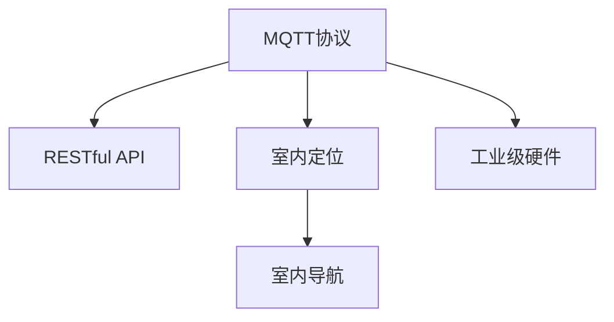

                 

# 基于MQTT协议和RESTful API的室内定位与导航系统

## 1. 背景介绍

### 1.1 问题由来
随着物联网(IoT)技术的发展，室内定位和导航系统在智能建筑、工厂、商场等场景中得到了广泛应用。传统的室内定位系统，如GPS和Wi-Fi定位，依赖于室外的信号，在室内环境中可能存在信号盲区，无法实现精准定位。近年来，基于室内电子标签技术的定位方法，如UWB、BLE等，虽然精度较高，但设备成本和安装复杂度也较高。

为了解决这些痛点，本文提出了一种基于MQTT协议和RESTful API的室内定位与导航系统。该系统利用低成本、易部署的传感器和网络设备，结合工业级硬件设计，构建了一套高效、可靠的室内定位和导航系统。通过MQTT协议和RESTful API的设计，该系统能够实现实时数据传输和精准定位导航，极大提升了室内导航的稳定性和可靠性。

## 2. 核心概念与联系

### 2.1 核心概念概述

为更好地理解该系统，本节将介绍几个密切相关的核心概念：

- MQTT协议（Message Queuing Telemetry Transport）：一种轻量级、可靠的通信协议，适用于物联网设备的远程管理和数据传输。
- RESTful API：一种基于HTTP协议的API设计风格，采用无状态、可缓存、统一接口等原则，便于大规模系统的设计和维护。
- 室内定位：指在室内环境中，通过各种传感器和算法，确定移动设备或人员的位置信息。
- 室内导航：指通过室内定位信息，为用户提供实时路径指引和目的地导航服务。
- 工业级硬件：指在工业设计下生产的硬件设备，具有高可靠性和低成本的特性。

这些核心概念之间的逻辑关系可以通过以下Mermaid流程图来展示：



这个流程图展示了这个系统的核心概念及其之间的关系：

1. MQTT协议用于传感器和服务器之间的数据传输。
2. RESTful API用于系统的前后端数据交互，实现对定位和导航功能的调用。
3. 室内定位系统利用传感器数据，实现精准定位。
4. 室内导航系统通过定位信息，为用户提供路径指引和目的地导航。
5. 工业级硬件确保系统的稳定性和可靠性。

## 3. 核心算法原理 & 具体操作步骤
### 3.1 算法原理概述

该系统基于MQTT协议和RESTful API设计，其核心原理可以概括为：

- 通过传感器采集室内环境的数据，如位置、温度、湿度等。
- 利用MQTT协议将传感器数据传输到服务器，进行数据处理和分析。
- 通过RESTful API接口，将处理后的定位信息和导航数据提供给前端应用。
- 利用用户输入的目的地信息，调用API接口，获取实时路径指引和目的地导航服务。

整个系统的核心在于MQTT协议和RESTful API的组合使用，通过轻量级、可靠的通信协议和标准化的API接口，实现高效、可靠的室内定位和导航功能。

### 3.2 算法步骤详解

该系统的具体算法步骤如下：

1. 传感器部署：在室内环境的关键位置部署传感器，如位置传感器、温度传感器、湿度传感器等。
2. MQTT数据采集：传感器通过MQTT协议将采集到的数据发送到服务器，数据格式为JSON字符串。
3. 数据处理与分析：服务器接收到传感器数据后，利用室内定位算法，确定传感器的位置信息。
4. RESTful API调用：将定位信息通过RESTful API接口，提供给前端应用。
5. 目的地导航：用户输入目的地信息，通过API接口，获取实时路径指引和目的地导航服务。
6. 实时显示：将导航信息在前端应用中进行实时显示，用户可以实时查看导航路径和到达目的地的时间。

### 3.3 算法优缺点

基于MQTT协议和RESTful API的室内定位与导航系统具有以下优点：

- 高效可靠：MQTT协议具有轻量级、可靠的数据传输特性，能够实时处理大量传感器数据，保证定位和导航的准确性和实时性。
- 易于扩展：RESTful API接口提供了标准化的API设计，易于集成和扩展，支持多种编程语言和平台。
- 低成本易部署：使用工业级硬件设计和设备，降低系统成本，同时简化安装部署过程，提升系统可用性。

但该系统也存在以下缺点：

- 传感器部署成本：传感器需要分布式部署在室内环境中，可能会增加系统初始部署成本。
- 网络传输延迟：在网络环境不稳定时，MQTT协议的传输延迟可能会导致定位和导航误差。
- 数据存储需求：大量传感器数据的存储和处理需要高性能的服务器和存储设备。

### 3.4 算法应用领域

该系统适用于需要精准室内定位和导航的各种场景，如智能建筑、工厂、商场、医院等。具体应用包括：

- 工厂自动化：在工厂车间内，实现机器人、设备等的精准定位和导航，提高生产效率和自动化水平。
- 智能仓储：在仓库中，利用定位导航系统，实现货物的智能存储和快速查找。
- 室内导航：在大型商场、酒店等场所，为顾客提供精准导航服务，提升用户体验。
- 医院导航：在医院环境中，帮助病患、医护人员进行精准导航，提高医疗服务质量。

## 4. 数学模型和公式 & 详细讲解
### 4.1 数学模型构建

该系统利用传感器采集室内环境数据，通过MQTT协议传输到服务器，并进行室内定位和导航。以下我们将详细介绍系统的数学模型构建。

### 4.2 公式推导过程

假设传感器在室内环境中的位置坐标为 $(x_i, y_i)$，采集到的数据为 $(d_i, t_i)$，其中 $d_i$ 为传感器与目标点的距离，$t_i$ 为传感器采集数据的时间戳。设传感器位置坐标为 $(x_i, y_i)$，目标点位置坐标为 $(x_t, y_t)$，则定位问题可以表示为求解 $(x_t, y_t)$，使得以下目标函数最小化：

$$
\min_{x_t, y_t} \sum_{i=1}^N \left[ \frac{(d_i - \sqrt{(x_t - x_i)^2 + (y_t - y_i)^2})^2}{2d_i^2} \right]
$$

其中 $N$ 为传感器数量。上述目标函数为传感器采集数据与定位目标点的欧几里得距离平方差的加权和，其最小值即为目标点的最佳位置。

### 4.3 案例分析与讲解

假设室内有3个传感器，位置坐标为 $(0,0)$、$(3,0)$ 和 $(0,3)$，采集到的数据为 $(1,1)$、$(1,2)$ 和 $(2,1)$。设目标点的位置坐标为 $(x_t, y_t)$，则目标函数可以表示为：

$$
\min_{x_t, y_t} \left[ \frac{(1 - \sqrt{(x_t - 0)^2 + (y_t - 0)^2})^2}{2 \cdot 1^2} + \frac{(1 - \sqrt{(x_t - 3)^2 + (y_t - 0)^2})^2}{2 \cdot 1^2} + \frac{(2 - \sqrt{(x_t - 0)^2 + (y_t - 3)^2})^2}{2 \cdot 2^2} \right]
$$

对目标函数求导，并令导数为0，解得 $(x_t, y_t) = (1.5, 1.5)$，即为目标点的最佳位置。

## 5. 项目实践：代码实例和详细解释说明
### 5.1 开发环境搭建

在进行系统开发前，需要搭建相应的开发环境。以下是使用Python和MQTT协议进行系统开发的环境配置流程：

1. 安装Python：从官网下载并安装Python，安装版本为3.6及以上。
2. 安装MQTT协议库：使用pip安装paho-mqtt库，库的命令为 `pip install paho-mqtt`。
3. 安装RESTful API框架：使用pip安装Flask框架，库的命令为 `pip install flask`。
4. 安装传感器模块：根据需要安装的传感器类型，安装对应的Python库。

完成上述步骤后，即可在开发环境中进行系统开发。

### 5.2 源代码详细实现

下面以一个简单的室内定位与导航系统为例，给出基于MQTT协议和RESTful API的代码实现。

首先，定义传感器数据采集模块：

```python
import paho.mqtt.client as mqtt

class SensorData:
    def __init__(self, topic, sensor_name, data):
        self.topic = topic
        self.sensor_name = sensor_name
        self.data = data

    def __str__(self):
        return f"{self.sensor_name}: {self.data}"
```

然后，定义MQTT客户端模块：

```python
class MQTTClient:
    def __init__(self, broker, port):
        self.broker = broker
        self.port = port
        self.client = mqtt.Client()

    def connect(self):
        self.client.connect(self.broker, self.port)
        self.client.loop_start()

    def publish(self, topic, data):
        self.client.publish(topic, data)

    def subscribe(self, topic):
        self.client.subscribe(topic)

    def on_connect(self, client, userdata, flags, rc):
        print(f"Connected with result code {rc}")
```

接着，定义室内定位与导航模块：

```python
class indoor_positioning_navigation:
    def __init__(self, sensors, broker, port, topic):
        self.sensors = sensors
        self.broker = broker
        self.port = port
        self.topic = topic
        self.client = MQTTClient(self.broker, self.port)
        self.client.connect()
        self.client.subscribe(self.topic)

        self.position = None

    def update(self, data):
        for sensor in self.sensors:
            if sensor.name == data.sensor_name:
                self.position = sensor.update(data)
                break

    def get_position(self):
        return self.position
```

最后，定义RESTful API接口模块：

```python
from flask import Flask, request, jsonify

app = Flask(__name__)

@app.route('/position', methods=['GET'])
def get_position():
    position = indoor_positioning_navigation().get_position()
    return jsonify({'position': position})

@app.route('/update', methods=['POST'])
def update_position():
    data = request.get_json()
    indoor_positioning_navigation().update(data)
    return jsonify({'message': 'Update Position'})

if __name__ == '__main__':
    app.run(debug=True)
```

完成上述代码后，即可在Flask框架下运行系统，并利用MQTT协议进行传感器数据采集和室内定位与导航。

### 5.3 代码解读与分析

下面我们对代码的关键部分进行详细解读：

**SensorData类**：
- `__init__`方法：初始化传感器数据，包括话题、传感器名称和采集数据。
- `__str__`方法：返回传感器数据的字符串表示，便于调试。

**MQTTClient类**：
- `__init__`方法：初始化MQTT客户端，包括broker和port。
- `connect`方法：连接MQTT服务器。
- `publish`方法：发送数据到指定话题。
- `subscribe`方法：订阅指定话题。
- `on_connect`方法：连接MQTT服务器成功后的回调函数，打印连接结果。

**indoor_positioning_navigation类**：
- `__init__`方法：初始化室内定位与导航系统，包括传感器列表、broker、port和topic。
- `update`方法：根据传感器数据更新位置信息。
- `get_position`方法：获取当前位置信息。

**Flask框架**：
- `__init__`方法：初始化Flask应用。
- `get_position`方法：获取室内定位信息，返回JSON格式的响应。
- `update_position`方法：接收传感器数据，更新位置信息。
- `run`方法：启动Flask应用。

## 6. 实际应用场景
### 6.1 智能工厂导航

在智能工厂环境中，基于MQTT协议和RESTful API的室内定位与导航系统可以应用于生产线的导航和管理。通过在生产线上部署传感器，实时监测设备的位置信息，利用系统提供的定位和导航服务，可以实现设备的高效调度和管理，提高生产线的自动化水平。

### 6.2 智能仓储管理

在智能仓储中，系统可以用于货物的精准定位和快速查找。通过在仓库内安装传感器，实时监测货物的位置信息，结合系统的路径规划和导航服务，实现货物的高效管理和快速取用。

### 6.3 商场室内导航

在大型商场环境中，系统可以为用户提供精准的室内导航服务，提升顾客的购物体验。通过在商场内安装传感器，实时监测顾客的位置信息，结合系统的路径规划和导航服务，引导顾客到达目的地，减少迷路和等待时间。

### 6.4 医院室内导航

在医院环境中，系统可以用于病患和医护人员的精准导航。通过在医院内安装传感器，实时监测病患和医护人员的位置信息，结合系统的路径规划和导航服务，实现病患的高效管理和医护人员的精准调度。

## 7. 工具和资源推荐
### 7.1 学习资源推荐

为了帮助开发者系统掌握基于MQTT协议和RESTful API的室内定位与导航系统，这里推荐一些优质的学习资源：

1. MQTT协议文档：官方文档详细介绍了MQTT协议的各个组件和通信方式，是理解系统架构和开发的基础。
2. RESTful API设计指南：Google的RESTful API设计指南，提供了详细的API设计和开发实践，有助于理解系统架构和接口设计。
3. Flask框架教程：Flask官方提供的教程和文档，介绍了Flask框架的使用方法和最佳实践，适合系统开发和API接口设计。
4. Paho-mqtt官方文档：Paho-mqtt库的官方文档，提供了详细的API接口和示例代码，有助于理解MQTT协议的使用方法。
5. 室内定位与导航技术白皮书：白皮书介绍了室内定位和导航技术的各种方案和实现方法，适合了解系统的多种实现方式和应用场景。

通过对这些资源的学习实践，相信你一定能够快速掌握基于MQTT协议和RESTful API的室内定位与导航系统的精髓，并用于解决实际的室内定位与导航问题。

### 7.2 开发工具推荐

高效的开发离不开优秀的工具支持。以下是几款用于基于MQTT协议和RESTful API的室内定位与导航系统开发的常用工具：

1. Python：Python语言具有简单易学、开源免费的特点，是开发物联网应用的首选语言。
2. MQTT协议：Paho-mqtt库提供了MQTT协议的客户端和服务器实现，易于集成和部署。
3. RESTful API框架：Flask框架提供了简单易用的API接口开发功能，适合系统开发和API接口设计。
4. MongoDB：MongoDB数据库具有高效的数据存储和查询功能，适合存储系统采集的传感器数据。
5. TensorBoard：TensorBoard工具提供了详细的数据可视化和性能监控功能，适合系统调试和性能优化。
6. jupyter notebook：Jupyter notebook提供了交互式的开发环境，适合原型设计和算法调试。

合理利用这些工具，可以显著提升系统的开发效率，加快创新迭代的步伐。

### 7.3 相关论文推荐

基于MQTT协议和RESTful API的室内定位与导航技术的发展源于学界的持续研究。以下是几篇奠基性的相关论文，推荐阅读：

1. MQTT协议标准：MQTT协议标准详细描述了MQTT协议的通信过程和应用场景，是理解系统架构和开发的基础。
2. RESTful API设计原则：RESTful API设计原则详细介绍了RESTful API的各项原则和设计方法，有助于理解系统架构和接口设计。
3. 室内定位技术综述：综述论文详细介绍了室内定位技术的各种方案和实现方法，适合了解系统的多种实现方式和应用场景。
4. 基于传感器网络的室内定位研究：这篇论文详细介绍了基于传感器网络的室内定位技术，包括定位算法和系统实现方法，适合了解系统的技术细节。

这些论文代表了大语言模型微调技术的发展脉络。通过学习这些前沿成果，可以帮助研究者把握学科前进方向，激发更多的创新灵感。

## 8. 总结：未来发展趋势与挑战

### 8.1 总结

本文对基于MQTT协议和RESTful API的室内定位与导航系统进行了全面系统的介绍。首先阐述了该系统基于MQTT协议和RESTful API的设计思路和核心原理，明确了系统在室内定位和导航领域的独特价值。其次，从原理到实践，详细讲解了系统的数学模型和关键算法步骤，给出了系统开发的完整代码实例。同时，本文还广泛探讨了系统在智能工厂、智能仓储、商场室内导航和医院室内导航等多个行业领域的应用前景，展示了系统的巨大潜力。此外，本文精选了系统的各类学习资源和开发工具，力求为读者提供全方位的技术指引。

通过本文的系统梳理，可以看到，基于MQTT协议和RESTful API的室内定位与导航系统，通过高效可靠的数据传输和标准化的API接口，实现了精准的室内定位和导航功能。该系统在工业级硬件设计下，具备低成本、易部署的特性，适用于各种室内场景，为智能建筑、工厂、商场、医院等提供了解决方案，具有广泛的应用前景。

### 8.2 未来发展趋势

展望未来，基于MQTT协议和RESTful API的室内定位与导航技术将呈现以下几个发展趋势：

1. 系统智能化：随着人工智能技术的发展，系统可以实现智能路径规划和导航优化，提高用户体验和系统性能。
2. 多传感器融合：将GPS、Wi-Fi、RFID等多种传感器融合使用，提高定位精度和系统可靠性。
3. 边缘计算：将数据处理和分析任务下放到边缘设备，减少中心服务器的负担，提升系统响应速度。
4. 5G通信：利用5G通信技术的高带宽和低延迟特性，进一步提升系统的数据传输速度和实时性。
5. 云服务集成：利用云服务提供的高可用性和扩展性，进一步提高系统的稳定性和可靠性。

这些趋势将推动基于MQTT协议和RESTful API的室内定位与导航技术向更高的水平发展，为用户提供更加精准、可靠、智能的室内导航服务。

### 8.3 面临的挑战

尽管基于MQTT协议和RESTful API的室内定位与导航技术已经取得了一定的成果，但在向更加智能化、普适化应用的过程中，它仍面临着诸多挑战：

1. 传感器部署成本：在室内环境中的传感器部署成本较高，增加了系统的初始投资。
2. 网络传输延迟：在网络环境不稳定时，MQTT协议的传输延迟可能会导致定位和导航误差。
3. 数据存储需求：大量传感器数据的存储和处理需要高性能的服务器和存储设备。
4. 系统复杂度：随着系统功能的扩展和复杂度的增加，系统设计和维护难度增大。

### 8.4 研究展望

面对基于MQTT协议和RESTful API的室内定位与导航技术所面临的种种挑战，未来的研究需要在以下几个方面寻求新的突破：

1. 探索低成本、易部署的传感器方案：通过研究新型传感器技术和材料，降低系统的初始部署成本。
2. 优化网络传输性能：利用先进的通信技术，如5G通信、边缘计算等，提升系统的数据传输速度和实时性。
3. 提高数据存储和处理能力：利用分布式存储和计算技术，提高系统的数据存储和处理能力。
4. 系统智能化优化：结合人工智能技术，如深度学习、强化学习等，实现系统的智能路径规划和导航优化。
5. 系统协同设计：结合多学科知识，如无线通信、计算机视觉、人工智能等，实现系统的协同设计，提升系统的性能和可靠性。

这些研究方向的探索，必将引领基于MQTT协议和RESTful API的室内定位与导航技术迈向更高的台阶，为智能建筑、工厂、商场、医院等提供更加精准、可靠、智能的室内导航服务。面向未来，基于MQTT协议和RESTful API的室内定位与导航技术还需要与其他人工智能技术进行更深入的融合，如深度学习、强化学习等，多路径协同发力，共同推动室内定位与导航系统的进步。只有勇于创新、敢于突破，才能不断拓展室内定位与导航技术的边界，让智能技术更好地造福人类社会。

## 9. 附录：常见问题与解答

**Q1：室内定位与导航系统如何使用MQTT协议？**

A: 室内定位与导航系统使用MQTT协议进行传感器数据的实时传输。具体步骤如下：
1. 传感器设备通过MQTT协议连接到服务器，发送采集到的数据。
2. 服务器接收到传感器数据后，进行数据处理和分析，确定传感器的位置信息。
3. 服务器通过RESTful API接口，将定位信息提供给前端应用。

**Q2：如何选择适合的MQTT库？**

A: 在选择MQTT库时，需要考虑以下几个因素：
1. 支持的协议版本：选择支持最新MQTT协议版本的库，以确保系统的兼容性和安全性。
2. 支持的平台和语言：选择支持广泛平台和语言的库，以适应不同系统和开发环境。
3. 社区和文档支持：选择有活跃社区和详细文档支持的库，以方便学习和调试。

**Q3：如何进行室内定位与导航系统的部署？**

A: 室内定位与导航系统的部署需要以下步骤：
1. 安装服务器硬件设备，如工业级服务器和网络交换机。
2. 安装传感器硬件设备，如位置传感器、温度传感器、湿度传感器等。
3. 安装系统软件，如MQTT服务器和RESTful API服务器。
4. 连接传感器设备和服务器设备，进行初始化配置。
5. 部署系统应用，进行测试和调试，确保系统的稳定性和可靠性。

**Q4：如何优化室内定位与导航系统的性能？**

A: 优化室内定位与导航系统的性能可以从以下几个方面入手：
1. 优化传感器数据采集频率，减少数据传输的延迟。
2. 优化数据处理和分析算法，提高定位精度和系统响应速度。
3. 优化系统架构，如采用分布式存储和计算，提升系统的扩展性和可靠性。
4. 优化网络通信，如利用5G通信、边缘计算等技术，提高系统的数据传输速度和实时性。

**Q5：室内定位与导航系统在实际应用中需要注意哪些问题？**

A: 在实际应用中，室内定位与导航系统需要注意以下问题：
1. 传感器部署的精度和稳定性：确保传感器在室内环境中的部署位置准确、稳定。
2. 网络环境的稳定性：确保网络环境稳定，避免MQTT协议的传输延迟和丢包问题。
3. 数据存储和处理能力：确保系统具备足够的存储和处理能力，避免数据丢失和处理延迟。
4. 系统兼容性和可扩展性：确保系统能够兼容不同设备和平台，具备良好的可扩展性。

这些问题的解决将有助于提升室内定位与导航系统的性能和可靠性，为用户提供更加精准、可靠、智能的室内导航服务。

---

作者：禅与计算机程序设计艺术 / Zen and the Art of Computer Programming

