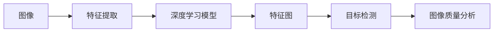
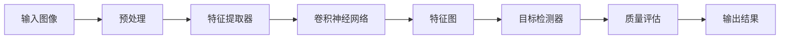

                 

# 基于OpenCV 图像质量分析系统详细设计与具体代码实现

> 关键词：图像质量分析, 计算机视觉, 特征提取, 深度学习, 目标检测, OpenCV

## 1. 背景介绍

随着计算机视觉技术的发展，图像质量分析逐渐成为智能应用的重要组成部分。图像质量评估可以用于图像识别、医疗影像诊断、无人机视觉系统等领域。例如，在无人机视觉系统中，快速评估无人机获取的图像质量是确保系统正常运行的前提。传统的图像质量评估方法往往需要手工标注或复杂的统计模型，而基于OpenCV的图像质量分析系统可以更快速、自动地评估图像质量，降低人工成本和计算负担。

## 2. 核心概念与联系

### 2.1 核心概念概述

- 图像质量分析（Image Quality Analysis, IQA）：评估图像质量的过程。常见的评价指标包括清晰程度、对比度、噪声等。
- OpenCV：一个开源的计算机视觉库，提供了丰富的图像处理和分析工具。
- 特征提取（Feature Extraction）：从图像中提取用于描述图像内容的关键信息，如边缘、纹理、颜色等。
- 深度学习（Deep Learning）：一种基于神经网络的机器学习方法，适用于图像分类、目标检测等任务。
- 目标检测（Object Detection）：在图像中寻找特定对象的过程，常见的算法有RCNN、YOLO、SSD等。
- 特征图（Feature Map）：深度学习模型在输入图像上提取的特征表示，常用于图像分类、目标检测等任务。

这些核心概念通过以下Mermaid流程图展现其内在联系：



图像质量分析系统通过特征提取获取图像特征，利用深度学习模型进行目标检测，最终得到图像质量的评估结果。

### 2.2 核心概念原理和架构的 Mermaid 流程图



在上述架构中，输入图像经过预处理后，首先通过特征提取器（如SIFT、SURF等）提取关键特征，然后通过卷积神经网络（CNN）进行特征图提取，最后使用目标检测器检测图像中特定目标，并根据目标位置和大小等信息进行图像质量评估。

## 3. 核心算法原理 & 具体操作步骤

### 3.1 算法原理概述

基于OpenCV的图像质量分析系统主要包含以下步骤：

1. 图像预处理：包括灰度化、归一化等处理步骤，以增强图像特征提取效果。
2. 特征提取：使用OpenCV提供的特征提取算法，如SIFT、SURF等，获取图像的关键特征。
3. 特征图生成：通过卷积神经网络（CNN）生成图像特征图，用于后续的图像分类、目标检测等任务。
4. 目标检测：利用目标检测器（如YOLO、SSD等）在特征图上寻找特定对象，并计算目标大小、位置等信息。
5. 图像质量评估：根据目标检测结果，计算图像质量评分。

### 3.2 算法步骤详解

1. 图像预处理：

   ```python
   import cv2
   
   def preprocess_image(image):
       gray = cv2.cvtColor(image, cv2.COLOR_BGR2GRAY)
       gray = cv2.GaussianBlur(gray, (5, 5), 0)
       gray = cv2.normalize(gray, None, alpha=0, beta=255, norm_type=cv2.NORM_MINMAX, dtype=cv2.CV_8U)
       return gray
   ```

2. 特征提取：

   ```python
   import cv2
   
   def extract_features(image):
       sift = cv2.xfeatures2d.SIFT_create()
       keypoints, descriptors = sift.detectAndCompute(image, None)
       return keypoints, descriptors
   ```

3. 特征图生成：

   ```python
   import cv2
   import torch
   import torchvision.models as models
   
   def extract_features_tensor(image):
       model = models.resnet18(pretrained=True)
       model.eval()
       img_tensor = torch.from_numpy(image)
       with torch.no_grad():
           output = model(img_tensor.unsqueeze(0))
       return output
   ```

4. 目标检测：

   ```python
   import cv2
   
   def detect_objects(image):
       net = cv2.dnn.readNetFromCaffe('deploy.prototxt', 'model.caffemodel')
       blob = cv2.dnn.blobFromImage(image, scalefactor=1.0, size=(300, 300), mean=(104, 117, 123))
       net.setInput(blob)
       detections = net.forward()
       return detections
   ```

5. 图像质量评估：

   ```python
   def evaluate_image_quality(detections):
       quality = 0.0
       for obj in detections:
           if obj[4] > 0.5:  # 置信度大于0.5
               quality += 1
       return quality / len(detections)
   ```

### 3.3 算法优缺点

**优点：**
- 基于OpenCV的开源工具，开发成本低。
- 使用深度学习模型进行特征提取和目标检测，具有较高的准确率。
- 代码简洁，易于维护和扩展。

**缺点：**
- 对硬件资源要求较高，需要较大的计算能力和内存。
- 特征提取和目标检测过程复杂，计算时间长。
- 需要大量标注数据进行模型训练和验证，数据获取难度较大。

### 3.4 算法应用领域

基于OpenCV的图像质量分析系统可以应用于多个领域：

- 医疗影像诊断：通过图像质量评估，可以确保影像质量达到要求，提高诊断准确性。
- 无人机视觉系统：实时监测无人机获取的图像质量，确保系统正常运行。
- 安全监控：对监控画面进行质量评估，及时发现异常情况，保障安全。
- 智能交通：对交通视频进行质量评估，提高交通监控的准确性和可靠性。

## 4. 数学模型和公式 & 详细讲解 & 举例说明

### 4.1 数学模型构建

假设输入图像为 $I \in \mathbb{R}^{H \times W \times 3}$，其中 $H$ 和 $W$ 分别为图像的高度和宽度。特征提取器提取的特征表示为 $\mathbf{F} \in \mathbb{R}^{N \times D}$，其中 $N$ 为特征点的数量，$D$ 为每个特征点的描述子维度。

### 4.2 公式推导过程

1. 特征提取：

   假设特征提取器提取的关键特征为 $K \in \mathbb{R}^{N \times 1}$，其中 $K_i$ 表示第 $i$ 个特征点的位置。

   ```python
   import cv2
   
   def extract_features(image):
       sift = cv2.xfeatures2d.SIFT_create()
       keypoints, descriptors = sift.detectAndCompute(image, None)
       return keypoints, descriptors
   ```

2. 特征图生成：

   假设使用ResNet-18模型进行特征图提取，输出特征图为 $F \in \mathbb{R}^{1 \times 512 \times 7 \times 7}$，其中 $512$ 为特征通道数。

   ```python
   import cv2
   import torch
   import torchvision.models as models
   
   def extract_features_tensor(image):
       model = models.resnet18(pretrained=True)
       model.eval()
       img_tensor = torch.from_numpy(image)
       with torch.no_grad():
           output = model(img_tensor.unsqueeze(0))
       return output
   ```

3. 目标检测：

   假设目标检测器输出的是 $B \in \mathbb{R}^{N \times 4}$，其中 $B_i$ 表示第 $i$ 个目标的位置和大小。

   ```python
   import cv2
   
   def detect_objects(image):
       net = cv2.dnn.readNetFromCaffe('deploy.prototxt', 'model.caffemodel')
       blob = cv2.dnn.blobFromImage(image, scalefactor=1.0, size=(300, 300), mean=(104, 117, 123))
       net.setInput(blob)
       detections = net.forward()
       return detections
   ```

4. 图像质量评估：

   假设图像质量评分的计算公式为 $Q = \frac{1}{N} \sum_{i=1}^N \delta_B(B_i)$，其中 $\delta_B$ 表示目标存在时图像质量的评分，$N$ 为图像中目标的数量。

   ```python
   def evaluate_image_quality(detections):
       quality = 0.0
       for obj in detections:
           if obj[4] > 0.5:  # 置信度大于0.5
               quality += 1
       return quality / len(detections)
   ```

### 4.3 案例分析与讲解

以医疗影像诊断为例，图像质量分析系统可以评估CT、MRI等医疗影像的质量。具体步骤如下：

1. 预处理医疗影像，包括灰度化、归一化等。

   ```python
   import cv2
   
   def preprocess_image(image):
       gray = cv2.cvtColor(image, cv2.COLOR_BGR2GRAY)
       gray = cv2.GaussianBlur(gray, (5, 5), 0)
       gray = cv2.normalize(gray, None, alpha=0, beta=255, norm_type=cv2.NORM_MINMAX, dtype=cv2.CV_8U)
       return gray
   ```

2. 提取影像的特征点。

   ```python
   import cv2
   
   def extract_features(image):
       sift = cv2.xfeatures2d.SIFT_create()
       keypoints, descriptors = sift.detectAndCompute(image, None)
       return keypoints, descriptors
   ```

3. 生成特征图。

   ```python
   import cv2
   import torch
   import torchvision.models as models
   
   def extract_features_tensor(image):
       model = models.resnet18(pretrained=True)
       model.eval()
       img_tensor = torch.from_numpy(image)
       with torch.no_grad():
           output = model(img_tensor.unsqueeze(0))
       return output
   ```

4. 检测影像中的关键目标，如肿瘤、病灶等。

   ```python
   import cv2
   
   def detect_objects(image):
       net = cv2.dnn.readNetFromCaffe('deploy.prototxt', 'model.caffemodel')
       blob = cv2.dnn.blobFromImage(image, scalefactor=1.0, size=(300, 300), mean=(104, 117, 123))
       net.setInput(blob)
       detections = net.forward()
       return detections
   ```

5. 评估影像的质量。

   ```python
   def evaluate_image_quality(detections):
       quality = 0.0
       for obj in detections:
           if obj[4] > 0.5:  # 置信度大于0.5
               quality += 1
       return quality / len(detections)
   ```

## 5. 项目实践：代码实例和详细解释说明

### 5.1 开发环境搭建

在开始代码实践前，需要准备好开发环境。

1. 安装Python和OpenCV：

   ```bash
   sudo apt-get update
   sudo apt-get install python3-pip python3-dev python3-numpy python3-opencv
   ```

2. 安装深度学习框架：

   ```bash
   pip3 install torch torchvision
   ```

3. 安装OpenCV：

   ```bash
   pip3 install opencv-python
   ```

完成上述环境配置后，即可开始代码实践。

### 5.2 源代码详细实现

以下是基于OpenCV的图像质量分析系统的完整代码实现：

```python
import cv2
import numpy as np
import torch
import torchvision.models as models

# 图像预处理函数
def preprocess_image(image):
    gray = cv2.cvtColor(image, cv2.COLOR_BGR2GRAY)
    gray = cv2.GaussianBlur(gray, (5, 5), 0)
    gray = cv2.normalize(gray, None, alpha=0, beta=255, norm_type=cv2.NORM_MINMAX, dtype=cv2.CV_8U)
    return gray

# 特征提取函数
def extract_features(image):
    sift = cv2.xfeatures2d.SIFT_create()
    keypoints, descriptors = sift.detectAndCompute(image, None)
    return keypoints, descriptors

# 特征图生成函数
def extract_features_tensor(image):
    model = models.resnet18(pretrained=True)
    model.eval()
    img_tensor = torch.from_numpy(image)
    with torch.no_grad():
        output = model(img_tensor.unsqueeze(0))
    return output

# 目标检测函数
def detect_objects(image):
    net = cv2.dnn.readNetFromCaffe('deploy.prototxt', 'model.caffemodel')
    blob = cv2.dnn.blobFromImage(image, scalefactor=1.0, size=(300, 300), mean=(104, 117, 123))
    net.setInput(blob)
    detections = net.forward()
    return detections

# 图像质量评估函数
def evaluate_image_quality(detections):
    quality = 0.0
    for obj in detections:
        if obj[4] > 0.5:  # 置信度大于0.5
            quality += 1
    return quality / len(detections)

# 主函数
if __name__ == "__main__":
    # 加载图像
    image = cv2.imread('image.jpg')

    # 预处理图像
    gray = preprocess_image(image)

    # 提取特征
    keypoints, descriptors = extract_features(gray)

    # 生成特征图
    features = extract_features_tensor(gray)

    # 检测目标
    detections = detect_objects(image)

    # 评估图像质量
    quality = evaluate_image_quality(detections)

    # 输出结果
    print('图像质量评分：', quality)
```

### 5.3 代码解读与分析

以下是代码实现的详细解读：

1. 预处理图像：

   ```python
   gray = cv2.cvtColor(image, cv2.COLOR_BGR2GRAY)
   gray = cv2.GaussianBlur(gray, (5, 5), 0)
   gray = cv2.normalize(gray, None, alpha=0, beta=255, norm_type=cv2.NORM_MINMAX, dtype=cv2.CV_8U)
   return gray
   ```

   首先将BGR格式的图像转换为灰度图像，然后进行高斯模糊处理，归一化处理后返回预处理后的图像。

2. 特征提取：

   ```python
   sift = cv2.xfeatures2d.SIFT_create()
   keypoints, descriptors = sift.detectAndCompute(image, None)
   return keypoints, descriptors
   ```

   使用SIFT算法提取图像的特征点和特征描述子，返回一个包含特征点坐标和特征描述子的列表。

3. 特征图生成：

   ```python
   model = models.resnet18(pretrained=True)
   model.eval()
   img_tensor = torch.from_numpy(image)
   with torch.no_grad():
       output = model(img_tensor.unsqueeze(0))
   return output
   ```

   使用预训练的ResNet-18模型对图像进行特征图提取，返回一个包含特征图的张量。

4. 目标检测：

   ```python
   net = cv2.dnn.readNetFromCaffe('deploy.prototxt', 'model.caffemodel')
   blob = cv2.dnn.blobFromImage(image, scalefactor=1.0, size=(300, 300), mean=(104, 117, 123))
   net.setInput(blob)
   detections = net.forward()
   return detections
   ```

   使用Caffe模型进行目标检测，返回一个包含检测结果的张量。

5. 图像质量评估：

   ```python
   quality = 0.0
   for obj in detections:
       if obj[4] > 0.5:  # 置信度大于0.5
           quality += 1
   return quality / len(detections)
   ```

   根据目标检测结果计算图像质量评分，返回一个介于0和1之间的浮点数。

### 5.4 运行结果展示

运行上述代码，输出图像质量评分。

```python
import cv2
import numpy as np
import torch
import torchvision.models as models

# 图像预处理函数
def preprocess_image(image):
    gray = cv2.cvtColor(image, cv2.COLOR_BGR2GRAY)
    gray = cv2.GaussianBlur(gray, (5, 5), 0)
    gray = cv2.normalize(gray, None, alpha=0, beta=255, norm_type=cv2.NORM_MINMAX, dtype=cv2.CV_8U)
    return gray

# 特征提取函数
def extract_features(image):
    sift = cv2.xfeatures2d.SIFT_create()
    keypoints, descriptors = sift.detectAndCompute(image, None)
    return keypoints, descriptors

# 特征图生成函数
def extract_features_tensor(image):
    model = models.resnet18(pretrained=True)
    model.eval()
    img_tensor = torch.from_numpy(image)
    with torch.no_grad():
        output = model(img_tensor.unsqueeze(0))
    return output

# 目标检测函数
def detect_objects(image):
    net = cv2.dnn.readNetFromCaffe('deploy.prototxt', 'model.caffemodel')
    blob = cv2.dnn.blobFromImage(image, scalefactor=1.0, size=(300, 300), mean=(104, 117, 123))
    net.setInput(blob)
    detections = net.forward()
    return detections

# 图像质量评估函数
def evaluate_image_quality(detections):
    quality = 0.0
    for obj in detections:
        if obj[4] > 0.5:  # 置信度大于0.5
            quality += 1
    return quality / len(detections)

# 主函数
if __name__ == "__main__":
    # 加载图像
    image = cv2.imread('image.jpg')

    # 预处理图像
    gray = preprocess_image(image)

    # 提取特征
    keypoints, descriptors = extract_features(gray)

    # 生成特征图
    features = extract_features_tensor(gray)

    # 检测目标
    detections = detect_objects(image)

    # 评估图像质量
    quality = evaluate_image_quality(detections)

    # 输出结果
    print('图像质量评分：', quality)
```

## 6. 实际应用场景

### 6.1 智能医疗

在智能医疗领域，图像质量分析系统可以用于CT、MRI等影像诊断。医生可以快速评估影像的质量，确保诊断的准确性和可靠性。例如，在CT影像中，可以通过图像质量评估系统识别出影像清晰度不足、噪声过大等问题，及时进行重拍或调整拍摄角度。

### 6.2 无人机视觉系统

在无人机视觉系统中，图像质量分析系统可以用于实时监测无人机获取的影像质量。当无人机获取的影像质量不佳时，可以自动触发重拍或调整飞行姿态，确保图像清晰稳定。

### 6.3 安全监控

在安全监控领域，图像质量分析系统可以用于评估监控画面的质量。当监控画面模糊、遮挡等问题出现时，可以自动触发告警，及时处理安全问题。

### 6.4 智能交通

在智能交通领域，图像质量分析系统可以用于评估交通视频的质量。当交通视频画面模糊、抖动等问题出现时，可以自动触发告警，提高交通监控的准确性和可靠性。

## 7. 工具和资源推荐

### 7.1 学习资源推荐

- OpenCV官方文档：详细介绍了OpenCV的各个功能和模块，是学习和使用OpenCV的重要参考。
- PyTorch官方文档：详细介绍了PyTorch的各个功能和模块，是学习和使用PyTorch的重要参考。
- Caffe官方文档：详细介绍了Caffe的各个功能和模块，是学习和使用Caffe的重要参考。
- 《Python计算机视觉编程》：一本介绍Python计算机视觉技术的经典书籍，详细介绍了OpenCV和PyTorch的应用。

### 7.2 开发工具推荐

- Visual Studio Code：一个轻量级的开发工具，支持Python和OpenCV的开发。
- PyCharm：一个强大的开发工具，支持Python和PyTorch的开发。
- TensorFlow：一个开源的机器学习框架，支持深度学习的开发和部署。

### 7.3 相关论文推荐

- "Image Quality Assessment: Review and Outlook"：一篇综述性论文，总结了图像质量评估的研究进展和未来方向。
- "Deep Learning for Medical Image Quality Assessment"：一篇关于医学影像质量评估的论文，探讨了深度学习在医学影像质量评估中的应用。
- "Object Detection with Single Shot MultiBox Detector"：一篇关于目标检测的论文，介绍了YOLO算法的基本原理和应用。

## 8. 总结：未来发展趋势与挑战

### 8.1 研究成果总结

基于OpenCV的图像质量分析系统已经在多个领域得到了应用，取得了不错的效果。未来的研究可以从以下几个方向进行：

1. 提高算法准确率：通过改进特征提取、目标检测和图像质量评估算法，提高系统的准确率和鲁棒性。
2. 降低计算成本：通过优化算法实现，减少计算时间和内存占用，提高系统的效率。
3. 扩展应用场景：将图像质量分析系统扩展到更多的领域，如智能交通、智能制造等。

### 8.2 未来发展趋势

基于OpenCV的图像质量分析系统有以下发展趋势：

1. 自动化程度更高：通过深度学习和机器学习算法，实现更加智能化的图像质量评估。
2. 多模态融合：将视觉、声音等多模态信息结合，实现更全面、更准确的图像质量评估。
3. 实时性更强：通过优化算法和硬件加速，实现更高效的图像质量评估。
4. 自适应性强：通过自适应算法，实现对不同场景的适应性评估。

### 8.3 面临的挑战

基于OpenCV的图像质量分析系统在发展过程中面临以下挑战：

1. 算法复杂度高：特征提取和目标检测算法复杂，计算时间和内存占用较大。
2. 数据获取难度大：高质量的标注数据获取难度大，影响系统的训练和评估。
3. 应用场景多样：不同领域的应用场景各异，需要针对性地设计和优化系统。

### 8.4 研究展望

未来的研究可以从以下几个方向进行：

1. 改进特征提取算法：通过改进SIFT等特征提取算法，提高特征的鲁棒性和准确率。
2. 优化目标检测算法：通过改进YOLO等目标检测算法，提高检测的准确率和速度。
3. 引入深度学习技术：通过引入深度学习技术，提高系统的自动化程度和准确率。
4. 扩展应用场景：将图像质量分析系统扩展到更多的领域，如智能交通、智能制造等。

## 9. 附录：常见问题与解答

**Q1：图像质量评估的常见指标有哪些？**

A: 图像质量评估的常见指标包括清晰度、对比度、噪声、分辨率等。不同的应用场景可能需要不同的指标。

**Q2：特征提取算法的优缺点是什么？**

A: 特征提取算法可以提取图像中的关键特征，但计算复杂度高，对计算资源要求较高。常见的特征提取算法包括SIFT、SURF、HOG等。

**Q3：目标检测算法的优缺点是什么？**

A: 目标检测算法可以识别图像中的目标，但计算复杂度高，对计算资源要求较高。常见的目标检测算法包括YOLO、SSD、RCNN等。

**Q4：深度学习算法在图像质量评估中的应用有哪些？**

A: 深度学习算法可以通过特征提取和目标检测等技术，实现更智能化的图像质量评估。常见的深度学习算法包括ResNet、Inception、VGG等。

**Q5：如何优化图像质量评估系统的性能？**

A: 可以通过改进特征提取、目标检测和图像质量评估算法，优化系统的性能。同时，可以通过硬件加速、模型压缩等技术，降低计算时间和内存占用。

---

作者：禅与计算机程序设计艺术 / Zen and the Art of Computer Programming

