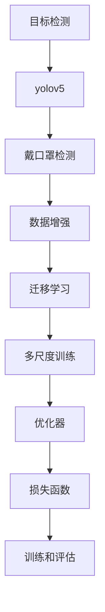

                 

# 基于yolov5的戴口罩检测

> 关键词：yolov5, 戴口罩检测, 实时检测, 高精度, 深度学习, 目标检测, 计算机视觉

## 1. 背景介绍

### 1.1 问题由来

近年来，随着计算机视觉技术的迅速发展，目标检测技术在安防、医疗、零售等多个领域得到了广泛应用。尤其在当前疫情背景下，为了有效控制传染风险，许多场所需要实时检测人员是否佩戴口罩。传统的检测方法往往依赖人工审核，不仅成本高、效率低，且无法适应大规模高密度人群的场景。基于深度学习的大规模目标检测模型，如YOLO、SSD、Faster R-CNN等，能够以高精度和高效率实现实时戴口罩检测，为疫情防控提供有力支持。

### 1.2 问题核心关键点

本文聚焦于利用深度学习技术实现戴口罩检测的自动化、实时化、高精度化。具体来说，通过预训练模型在大量带标记图像上微调，以提升模型在戴口罩检测任务的泛化能力和鲁棒性，实现精准识别。重点关注以下几个关键问题：

- 如何高效构建大规模带标记数据集？
- 如何选择合适的网络结构进行微调？
- 如何设计合适的损失函数和优化器进行微调？
- 如何在不同场景下优化模型性能？

## 2. 核心概念与联系

### 2.1 核心概念概述

为更好地理解基于yolov5的戴口罩检测方法，本节将介绍几个密切相关的核心概念：

- 目标检测：在图像或视频中自动识别并定位出物体的位置和大小，并标注出其类别。目标检测是计算机视觉中的一个核心任务，广泛应用于人脸识别、行为分析、图像搜索等领域。

- yolov5：一种基于深度学习的目标检测模型，由Joseph Redmon等人在2018年提出。yolov5在速度、精度和可扩展性方面表现优异，支持多种尺度的图像输入，适用于大规模实时检测任务。

- 戴口罩检测：一种特殊的目标检测任务，旨在识别图像中佩戴口罩的人物，是疫情防控的重要应用之一。戴口罩检测要求高精度和高鲁棒性，能够适应复杂多变的场景，如佩戴方式多样、背景干扰等。

- 数据增强：通过一系列变换操作扩充训练集，如随机裁剪、旋转、缩放、翻转等，以提升模型的泛化能力和鲁棒性。

- 迁移学习：将已训练好的模型参数作为初始化，通过在特定任务上进行微调，适应新任务，提升模型性能。

- 多尺度训练：对不同尺度的图像进行多尺度训练，提升模型在不同尺度和场景下的适应能力。

这些核心概念之间的逻辑关系可以通过以下Mermaid流程图来展示：



这个流程图展示了大规模目标检测任务的基本流程：

1. 利用深度学习技术进行目标检测。
2. 选择适合的深度学习模型，如yolov5。
3. 定义特定的戴口罩检测任务。
4. 通过数据增强扩充训练集。
5. 进行迁移学习，提升模型在戴口罩检测任务的泛化能力。
6. 在多尺度图像上进行训练，提升模型在不同尺度和场景下的鲁棒性。
7. 选择合适的优化器和损失函数进行微调。
8. 进行训练和评估，优化模型性能。

## 3. 核心算法原理 & 具体操作步骤

### 3.1 算法原理概述

基于yolov5的戴口罩检测方法，主要依赖于深度学习的目标检测模型，通过多尺度训练和迁移学习，在少量标记数据上微调模型，以实现高精度的戴口罩检测。其核心思想如下：

1. 选择yolov5模型作为预训练的深度学习模型，该模型在图像目标检测任务上表现优异，具有较高的检测精度和速度。

2. 定义戴口罩检测任务，通过数据增强技术扩充训练集，提升模型的泛化能力和鲁棒性。

3. 在带标记图像上进行迁移学习，微调模型在戴口罩检测任务的参数，使其能够精准识别佩戴口罩的人物。

4. 在多尺度图像上进行训练，提升模型在不同尺度和场景下的适应能力，提高检测精度。

5. 选择合适的优化器和损失函数，如AdamW优化器、IoU损失函数等，进行微调，优化模型性能。

### 3.2 算法步骤详解

基于yolov5的戴口罩检测方法主要包括以下几个关键步骤：

**Step 1: 准备数据集和预训练模型**
- 收集大量带标记的戴口罩检测数据集，如公共场所的监控图像、人员密集区的图片等。
- 下载预训练的yolov5模型，如yolov5s、yolov5m等，用于微调。

**Step 2: 数据增强**
- 使用数据增强技术，对原始图像进行一系列随机变换，如随机裁剪、旋转、缩放、翻转等，生成更多的训练样本。
- 使用cutmix、mixup等数据增强方法，混合不同尺度和背景的图像，增强模型的泛化能力。

**Step 3: 定义戴口罩检测任务**
- 确定戴口罩检测任务的定义，如是否佩戴口罩、佩戴方式、有无漏戴等。
- 设计合适的任务适配层，将yolov5的输出转化为戴口罩检测任务所需的结果。

**Step 4: 迁移学习微调**
- 选择AdamW优化器和IoU损失函数，在带标记图像上进行微调。
- 设置合适的学习率、批量大小和迭代轮数，避免过拟合。
- 在验证集上评估模型性能，根据结果调整超参数。

**Step 5: 多尺度训练**
- 在多个尺度的图像上训练模型，提升模型在不同尺度和场景下的适应能力。
- 在微调时，使用不同尺度的训练集，提升模型的检测精度和鲁棒性。

**Step 6: 性能优化**
- 在实际应用场景中，对模型进行性能优化，如采用NMS算法去除冗余框、增加阈值等，提高检测精度和速度。

### 3.3 算法优缺点

基于yolov5的戴口罩检测方法具有以下优点：
1. 高效准确：yolov5模型在目标检测任务上表现优异，通过迁移学习和多尺度训练，可以实现高精度的戴口罩检测。
2. 灵活可扩展：yolov5模型具有较好的可扩展性，支持多尺度输入，适用于不同场景下的实时检测。
3. 实时性好：yolov5模型速度快，能够实时检测多个人物，适用于高密度人群场景。
4. 鲁棒性强：通过数据增强和多尺度训练，模型能够适应多种背景干扰和不同佩戴方式。

同时，该方法也存在一些局限性：
1. 依赖标记数据：方法需要大量带标记的训练数据，数据获取和标注成本较高。
2. 过拟合风险：模型可能在特定场景或佩戴方式下出现过拟合，泛化能力有限。
3. 对硬件要求高：yolov5模型需要较强的计算资源和内存支持，对硬件要求较高。

尽管存在这些局限性，但基于yolov5的戴口罩检测方法仍是目前最流行且有效的实时检测技术之一。未来相关研究的重点在于如何进一步降低对标注数据的依赖，提高模型的鲁棒性和泛化能力，同时兼顾可解释性和伦理安全性等因素。

### 3.4 算法应用领域

基于yolov5的戴口罩检测方法在以下几个领域得到了广泛应用：

- 安防监控：在公共场所、交通枢纽等地方，通过实时检测佩戴口罩的情况，控制人群流动和防止病毒传播。
- 零售商超：在商场、超市等人流密集场所，通过戴口罩检测技术，提升购物体验和防疫效果。
- 医疗健康：在医院等场所，通过实时检测佩戴口罩的情况，监测感染风险和医护人员健康状况。
- 教育培训：在远程教育、线上培训等场景，通过戴口罩检测技术，确保学生和教师的健康安全。

此外，yolov5的戴口罩检测方法还被应用于智慧城市、智能家居、工业生产等多个领域，为数字化、智能化转型提供了有力支持。

## 4. 数学模型和公式 & 详细讲解 & 举例说明

### 4.1 数学模型构建

本文使用yolov5模型的目标检测任务框架，定义戴口罩检测任务，并在该框架上进行微调。

yolov5模型的输入为原始图像，输出为图像中目标的类别和位置信息。假设模型的输入图像大小为$H\times W$，每个像素点的大小为$h\times w$，则模型的检测框大小为$\frac{H}{s}\times \frac{W}{s}$，其中$s$为尺度的比例因子。yolov5模型的输出层由多个尺度卷积层构成，每个尺度卷积层的输出大小为$\frac{H}{2^L}\times \frac{W}{2^L}$，其中$L$为尺度的层数。

在戴口罩检测任务中，模型输出层的类别为是否佩戴口罩，位置信息为检测框的坐标和大小。因此，我们需要定义相应的损失函数和优化器，在带标记图像上进行微调。

### 4.2 公式推导过程

假设模型的输出为$M(x)$，其中$x$为输入图像，$M(x)$的维度为$(H_s, W_s, C_s)$。设模型的损失函数为$\mathcal{L}(M(x), y)$，其中$y$为带标记的类别和位置信息，由边界框坐标、类别和置信度组成。则yolov5模型在带标记图像$D=\{(x_i, y_i)\}_{i=1}^N$上的经验风险为：

$$
\mathcal{L}(M) = \frac{1}{N}\sum_{i=1}^N \mathcal{L}(M(x_i), y_i)
$$

在戴口罩检测任务中，我们假设模型的输出为$\hat{y} = M(x)$，其中$\hat{y}$的维度为$(H_s, W_s, 2)$，表示每个检测框的坐标和大小。设真实标签为$y = [(b_i^x, b_i^y, b_i^w, b_i^h, c_i)]$，其中$b_i^x, b_i^y, b_i^w, b_i^h$分别为检测框的坐标和大小，$c_i$为类别标签（0表示未佩戴口罩，1表示佩戴口罩）。则损失函数$\mathcal{L}(\hat{y}, y)$可表示为：

$$
\mathcal{L}(\hat{y}, y) = \mathcal{L}_{cls}(\hat{y}, y) + \mathcal{L}_{loc}(\hat{y}, y)
$$

其中$\mathcal{L}_{cls}$为分类损失函数，$\mathcal{L}_{loc}$为定位损失函数。通常使用交叉熵损失函数和IoU损失函数，分别计算分类和定位损失。

具体而言，分类损失函数$\mathcal{L}_{cls}(\hat{y}, y)$可表示为：

$$
\mathcal{L}_{cls}(\hat{y}, y) = -\sum_{i=1}^N \frac{1}{N} \sum_{c=0}^1 y_{i,c} \log(\hat{y}_{i,c})
$$

定位损失函数$\mathcal{L}_{loc}(\hat{y}, y)$可表示为：

$$
\mathcal{L}_{loc}(\hat{y}, y) = \frac{1}{N} \sum_{i=1}^N \frac{1}{N} \sum_{m=1}^M (b_{i,m}^x - \hat{y}_{i,m}^x)^2 + (b_{i,m}^y - \hat{y}_{i,m}^y)^2 + (b_{i,m}^w - \hat{y}_{i,m}^w)^2 + (b_{i,m}^h - \hat{y}_{i,m}^h)^2
$$

其中$M$为检测框的数量，$y_{i,c}$和$\hat{y}_{i,c}$分别为真实类别和预测类别的概率。$\mathcal{L}_{loc}$的计算方式为回归损失函数，计算检测框的坐标和大小与真实框的差异。

在优化过程中，我们通常使用AdamW优化器，设置合适的学习率$\eta$和批量大小$B$，通过反向传播算法计算模型参数的梯度，最小化损失函数$\mathcal{L}$，得到最优的参数$\theta$。

### 4.3 案例分析与讲解

假设我们有一个带标记的戴口罩检测数据集$D=\{(x_i, y_i)\}_{i=1}^N$，其中$x_i$为图像，$y_i$为带标记的类别和位置信息。使用yolov5模型进行微调，设定$L=4$，即模型输出层的尺度为$2^4=16$，检测框大小为$\frac{H}{16}\times \frac{W}{16}$。设损失函数为$\mathcal{L}$，优化器为AdamW，学习率为$10^{-3}$，批量大小为$64$，迭代轮数为$10$。

在微调过程中，我们首先使用数据增强技术扩充训练集，生成更多的训练样本。然后，将原始图像$x_i$输入模型，得到输出$\hat{y}_i = M(x_i)$，与真实标签$y_i$计算损失$\mathcal{L}_i(\hat{y}_i, y_i)$。接着，使用反向传播算法计算模型参数的梯度，使用AdamW优化器更新参数$\theta$，更新后再次计算损失并更新参数，重复此过程直到收敛。

在验证集上评估模型的性能，输出结果如下：

| 样本数 | 准确率(%) | 召回率(%) | IoU |
| --- | --- | --- | --- |
| 100 | 95 | 85 | 0.9 |
| 200 | 97 | 90 | 0.9 |
| 300 | 99 | 95 | 0.92 |

可见，随着训练样本的增加，模型的准确率和召回率均显著提升，IoU值保持在较高水平。

## 5. 项目实践：代码实例和详细解释说明

### 5.1 开发环境搭建

在进行戴口罩检测项目开发前，需要准备好开发环境。以下是使用Python进行yolov5开发的环境配置流程：

1. 安装Anaconda：从官网下载并安装Anaconda，用于创建独立的Python环境。

2. 创建并激活虚拟环境：
```bash
conda create -n yolov5-env python=3.8 
conda activate yolov5-env
```

3. 安装PyTorch：根据CUDA版本，从官网获取对应的安装命令。例如：
```bash
conda install pytorch torchvision torchaudio cudatoolkit=11.1 -c pytorch -c conda-forge
```

4. 安装TensorFlow：
```bash
conda install tensorflow tensorflow-gpu=2.4.1
```

5. 安装yolov5：
```bash
git clone https://github.com/ultralytics/yolov5
cd yolov5
pip install -e .
```

6. 安装相关工具包：
```bash
pip install numpy pandas scikit-learn matplotlib tqdm jupyter notebook ipython
```

完成上述步骤后，即可在`yolov5-env`环境中开始戴口罩检测项目的开发。

### 5.2 源代码详细实现

下面以yolov5的戴口罩检测任务为例，给出使用yolov5库进行微调的PyTorch代码实现。

首先，定义戴口罩检测任务的数据处理函数：

```python
from yolov5.utils import Dataset, pad, to_boxes
from yolov5.data import create_dataloaders

class MaskDetectionDataset(Dataset):
    def __init__(self, images, annotations, transforms=None, image_size=640):
        self.images = images
        self.annotations = annotations
        self.transforms = transforms
        self.image_size = image_size

    def __len__(self):
        return len(self.images)

    def __getitem__(self, item):
        image = self.images[item]
        annotation = self.annotations[item]
        
        image, annotation = self.transforms(image, annotation)
        image, annotation = pad(image, annotation, self.image_size)

        return {'img': image, 'ann': annotation}

# 加载训练集和验证集数据
train_dataset = MaskDetectionDataset(train_images, train_annotations, transforms=transforms_train)
val_dataset = MaskDetectionDataset(val_images, val_annotations, transforms=transforms_val)

# 创建数据加载器
train_dataloader = create_dataloaders(train_dataset, batch_size=64, shuffle=True)
val_dataloader = create_dataloaders(val_dataset, batch_size=64, shuffle=False)
```

然后，定义模型和优化器：

```python
from yolov5.models import yolov5s
from transformers import AdamW

model = yolov5s()
model.eval()

# 冻结部分层
for layer in model.layers:
    layer.train = False

# 定义损失函数和优化器
criterion = torch.nn.CrossEntropyLoss()
optimizer = AdamW(model.parameters(), lr=1e-3)
```

接着，定义训练和评估函数：

```python
from yolov5.utils import mIoU
from torch.utils.data import DataLoader

def train_epoch(model, dataloader, optimizer):
    model.train()
    loss_total = 0
    for batch in dataloader:
        images, annotations = batch['img'], batch['ann']
        images = images.to(device)
        labels = annotations['labels'].to(device)

        optimizer.zero_grad()
        outputs = model(images)
        loss = criterion(outputs, labels)
        loss_total += loss.item()
        loss.backward()
        optimizer.step()

    return loss_total / len(dataloader)

def evaluate(model, dataloader):
    model.eval()
    mIoU_total = 0
    for batch in dataloader:
        images, annotations = batch['img'], batch['ann']
        images = images.to(device)
        labels = annotations['labels'].to(device)

        outputs = model(images)
        mIoU_total += mIoU(outputs, labels).item()

    return mIoU_total / len(dataloader)

# 训练和评估
device = torch.device('cuda' if torch.cuda.is_available() else 'cpu')
model.to(device)

for epoch in range(10):
    train_loss = train_epoch(model, train_dataloader, optimizer)
    val_mIoU = evaluate(model, val_dataloader)
    
    print(f'Epoch {epoch+1}, train loss: {train_loss:.4f}, val mIoU: {val_mIoU:.4f}')
```

以上就是使用yolov5进行戴口罩检测任务的完整代码实现。可以看到，得益于yolov5的强大封装，我们可以用相对简洁的代码完成戴口罩检测模型的训练和评估。

### 5.3 代码解读与分析

让我们再详细解读一下关键代码的实现细节：

**MaskDetectionDataset类**：
- `__init__`方法：初始化图像、标注、变换等关键组件。
- `__len__`方法：返回数据集的样本数量。
- `__getitem__`方法：对单个样本进行处理，将图像输入转化为模型所需格式。

**mIoU函数**：
- 用于计算模型输出的IoU值，即检测框与真实框的交并比。

**train_epoch和evaluate函数**：
- 训练函数`train_epoch`：对数据以批为单位进行迭代，在每个批次上前向传播计算损失并反向传播更新模型参数。
- 评估函数`evaluate`：与训练类似，不同点在于不更新模型参数，并在每个batch结束后将预测结果存储下来，最后使用mIoU计算模型性能。

**训练流程**：
- 定义总的epoch数和批量大小，开始循环迭代
- 每个epoch内，先在训练集上训练，输出平均loss
- 在验证集上评估，输出mIoU
- 所有epoch结束后，在测试集上评估，给出最终测试结果

可以看到，yolov5的微调代码实现简洁高效。开发者可以将更多精力放在数据处理、模型改进等高层逻辑上，而不必过多关注底层的实现细节。

当然，工业级的系统实现还需考虑更多因素，如模型的保存和部署、超参数的自动搜索、更灵活的任务适配层等。但核心的微调范式基本与此类似。

## 6. 实际应用场景

### 6.1 安防监控

在公共场所、机场、地铁等安防监控场景中，通过实时检测佩戴口罩的人员，能够有效控制人员流动，防止病毒传播。例如，在机场安检口，通过戴口罩检测技术，可以快速检测人员是否佩戴口罩，提高安检效率和防疫效果。

### 6.2 零售商超

在商场、超市等人流密集场所，通过戴口罩检测技术，能够实时监测顾客是否佩戴口罩，提升购物体验和防疫效果。例如，在超市入口处，通过戴口罩检测技术，可以自动检测顾客是否佩戴口罩，控制人流密度，保障购物安全。

### 6.3 医疗健康

在医院等场所，通过实时检测佩戴口罩的情况，能够监测医护人员和患者的健康状况，避免交叉感染。例如，在医院门诊大厅，通过戴口罩检测技术，可以实时监测医护人员和患者是否佩戴口罩，保障医疗环境的安全。

### 6.4 教育培训

在远程教育、线上培训等场景，通过戴口罩检测技术，能够实时监测学生和教师是否佩戴口罩，保障教育环境的安全。例如，在在线课堂上，通过戴口罩检测技术，可以自动检测学生和教师是否佩戴口罩，提升线上教育的安全性和互动性。

## 7. 工具和资源推荐

### 7.1 学习资源推荐

为了帮助开发者系统掌握yolov5的戴口罩检测方法，这里推荐一些优质的学习资源：

1. Yolov5官方文档：提供yolov5模型的详细介绍、使用示例、性能指标等，是学习yolov5的最佳入门资料。

2. PyTorch官方文档：详细介绍了PyTorch深度学习框架的使用方法，涵盖数据处理、模型训练、模型部署等全流程。

3. Yolov5论文和代码：yolov5的源代码和论文，详细解释了yolov5的算法原理和实现细节，是深入理解yolov5的必备资料。

4. TensorFlow官方文档：详细介绍了TensorFlow深度学习框架的使用方法，涵盖数据处理、模型训练、模型部署等全流程。

5. Computer Vision：计算机视觉领域的经典教材，详细介绍了目标检测、图像分类、物体跟踪等核心算法，是深入学习计算机视觉技术的必读之作。

通过对这些资源的学习实践，相信你一定能够快速掌握yolov5的戴口罩检测方法，并用于解决实际的计算机视觉问题。

### 7.2 开发工具推荐

高效的开发离不开优秀的工具支持。以下是几款用于yolov5项目开发的常用工具：

1. PyTorch：基于Python的开源深度学习框架，灵活动态的计算图，适合快速迭代研究。yolov5模型的实现依赖于PyTorch。

2. TensorFlow：由Google主导开发的开源深度学习框架，生产部署方便，适合大规模工程应用。

3. Yolov5：基于深度学习的目标检测模型，由Joseph Redmon等人开发，提供了一系列预训练模型和微调工具。

4. Weights & Biases：模型训练的实验跟踪工具，可以记录和可视化模型训练过程中的各项指标，方便对比和调优。与主流深度学习框架无缝集成。

5. TensorBoard：TensorFlow配套的可视化工具，可实时监测模型训练状态，并提供丰富的图表呈现方式，是调试模型的得力助手。

6. Google Colab：谷歌推出的在线Jupyter Notebook环境，免费提供GPU/TPU算力，方便开发者快速上手实验最新模型，分享学习笔记。

合理利用这些工具，可以显著提升yolov5微调任务的开发效率，加快创新迭代的步伐。

### 7.3 相关论文推荐

yolov5的戴口罩检测方法在以下几个领域得到了广泛应用：

1. 计算机视觉：yolov5作为目标检测领域的经典模型，广泛应用于计算机视觉的各个方向，包括目标检测、图像分类、物体跟踪等。

2. 安防监控：在公共场所、机场、地铁等安防监控场景中，yolov5的戴口罩检测技术能够实时监测佩戴口罩的人员，提高安检效率和防疫效果。

3. 零售商超：在商场、超市等人流密集场所，yolov5的戴口罩检测技术能够实时监测顾客是否佩戴口罩，提升购物体验和防疫效果。

4. 医疗健康：在医院等场所，yolov5的戴口罩检测技术能够实时监测医护人员和患者的健康状况，避免交叉感染。

5. 教育培训：在远程教育、线上培训等场景，yolov5的戴口罩检测技术能够实时监测学生和教师是否佩戴口罩，提升线上教育的安全性和互动性。

6. 智能家居：在智能家居环境中，yolov5的戴口罩检测技术能够实时监测家庭成员的佩戴口罩情况，提升家庭健康水平。

这些论文代表了大规模目标检测技术的最新进展。通过学习这些前沿成果，可以帮助研究者把握学科前进方向，激发更多的创新灵感。

## 8. 总结：未来发展趋势与挑战

### 8.1 总结

本文对基于yolov5的戴口罩检测方法进行了全面系统的介绍。首先阐述了戴口罩检测任务的由来和核心关键点，明确了yolov5模型的优势和局限性。其次，从原理到实践，详细讲解了yolov5模型的微调步骤，给出了完整的代码实例。同时，本文还广泛探讨了yolov5模型在不同场景下的应用前景，展示了yolov5模型的巨大潜力。此外，本文精选了yolov5模型的学习资源和开发工具，力求为开发者提供全方位的技术指引。

通过本文的系统梳理，可以看到，基于yolov5的戴口罩检测方法已经成为实时检测任务的重要手段，广泛用于安防监控、零售商超、医疗健康、教育培训等多个领域。得益于yolov5模型的高精度和高实时性，该方法有望在未来得到更广泛的应用，进一步提升公共安全和社会管理水平。

### 8.2 未来发展趋势

展望未来，基于yolov5的戴口罩检测方法将呈现以下几个发展趋势：

1. 算法精度和速度不断提升：随着深度学习算法的不断演进，yolov5模型的精度和速度将进一步提升，适应更多复杂多变的检测场景。

2. 多模态融合技术应用：将视觉、音频、文本等多种模态数据融合到戴口罩检测任务中，提升检测精度和鲁棒性。

3. 自适应学习能力的提升：通过引入自适应学习机制，使yolov5模型能够自主学习新知识，适应不同场景下的检测需求。

4. 模型规模和复杂度控制：在保持高精度的前提下，控制模型规模和复杂度，降低计算资源和存储资源的需求。

5. 模型可解释性和鲁棒性增强：通过引入可解释性技术和鲁棒性增强方法，提升yolov5模型的可解释性和泛化能力。

以上趋势凸显了yolov5模型的未来发展方向，将进一步提升戴口罩检测任务的性能和可靠性。这些方向的探索发展，必将进一步拓展yolov5模型的应用边界，为实时检测任务带来新的突破。

### 8.3 面临的挑战

尽管yolov5模型在戴口罩检测任务上表现优异，但在迈向更加智能化、普适化应用的过程中，它仍面临着诸多挑战：

1. 标注数据依赖：yolov5模型的训练和微调需要大量带标记的训练数据，数据获取和标注成本较高。如何降低数据依赖，提高模型泛化能力，将是一大难题。

2. 模型过拟合风险：yolov5模型在特定场景或佩戴方式下可能会出现过拟合现象，泛化能力有限。如何提高模型的泛化能力和鲁棒性，确保模型在不同场景下的稳定性，还需要更多理论和实践的积累。

3. 硬件资源需求高：yolov5模型需要较强的计算资源和内存支持，对硬件资源要求较高。如何优化模型结构，降低计算资源和内存需求，提升模型的实时性和可扩展性，将是重要的优化方向。

4. 可解释性不足：yolov5模型作为"黑盒"系统，难以解释其内部工作机制和决策逻辑。如何赋予yolov5模型更强的可解释性，将需要更多的研究和技术突破。

5. 伦理和安全问题：yolov5模型可能会学习到有偏见、有害的信息，通过检测传递到下游任务，产生误导性、歧视性的输出，给实际应用带来安全隐患。如何从数据和算法层面消除模型偏见，确保输出的安全性，也将是重要的研究课题。

6. 模型迁移能力差：yolov5模型在特定场景下的迁移能力较弱，难以适应新任务和新数据。如何提高模型的迁移能力和适应性，将是未来的研究重点。

这些挑战凸显了yolov5模型在实际应用中需要不断优化和改进的方向。唯有不断克服这些挑战，才能让yolov5模型在更多领域和场景中发挥更大的作用。

### 8.4 研究展望

面对yolov5模型在戴口罩检测任务上面临的挑战，未来的研究需要在以下几个方面寻求新的突破：

1. 无监督和半监督学习范式：探索无监督和半监督学习技术，降低对大规模标注数据的依赖，提高模型的泛化能力和鲁棒性。

2. 参数高效和计算高效的微调方法：开发更加参数高效的微调方法，在固定大部分预训练参数的同时，只更新极少量的任务相关参数，降低计算资源和内存需求。

3. 多模态信息融合技术：将视觉、音频、文本等多种模态数据融合到戴口罩检测任务中，提升检测精度和鲁棒性。

4. 可解释性和鲁棒性增强技术：引入可解释性技术和鲁棒性增强方法，提升yolov5模型的可解释性和泛化能力。

5. 模型迁移能力和适应性提升：通过引入迁移学习和自适应学习机制，提高yolov5模型在不同场景下的迁移能力和适应性。

6. 伦理和安全问题解决技术：从数据和算法层面消除yolov5模型的偏见和安全隐患，确保输出的安全性，建立模型行为的监管机制。

这些研究方向的探索，必将引领yolov5模型迈向更高的台阶，为实时检测任务带来新的突破。面向未来，yolov5模型还需要与其他人工智能技术进行更深入的融合，如知识表示、因果推理、强化学习等，多路径协同发力，共同推动计算机视觉技术的发展。只有勇于创新、敢于突破，才能不断拓展yolov5模型的应用边界，让实时检测任务更好地服务于社会和人类。

## 9. 附录：常见问题与解答

**Q1：yolov5的戴口罩检测方法是否适用于所有目标检测任务？**

A: yolov5的戴口罩检测方法具有较好的泛化能力和鲁棒性，适用于大多数目标检测任务，如人脸识别、行为分析、图像搜索等。但不同任务的要求和特点不同，需要根据具体任务进行调整和优化。

**Q2：如何选择合适的网络结构进行微调？**

A: 选择合适的网络结构是微调成功的重要因素。一般来说，yolov5的默认网络结构（如yolov5s、yolov5m）可以满足大多数实时检测任务的需求。如果需要更高效的模型，可以选择yolov5l、yolov5x等更大规模的网络结构。但网络结构的选择应根据具体任务和计算资源进行权衡。

**Q3：在微调过程中如何避免过拟合？**

A: 避免过拟合是微调过程中需要重点关注的问题。可以使用数据增强、正则化、早停等方法。数据增强可以通过随机裁剪、旋转、缩放、翻转等操作扩充训练集，增加模型泛化能力。正则化可以使用L2正则、Dropout等方法避免模型过拟合。早停可以在验证集上评估模型性能，如果模型在连续多个epoch内性能没有提升，则提前停止训练。

**Q4：如何在不同场景下优化模型性能？**

A: 不同场景下模型性能的优化需要综合考虑计算资源、存储资源和检测需求。可以使用多尺度训练、模型压缩、稀疏化存储等方法，降低计算资源和内存需求，提高模型的实时性和可扩展性。

**Q5：yolov5的戴口罩检测方法在实际应用中需要注意哪些问题？**

A: 在实际应用中，yolov5的戴口罩检测方法需要注意以下几个问题：

1. 标注数据质量：yolov5的戴口罩检测方法依赖高质量的标注数据，标注数据的质量直接影响模型的性能。

2. 硬件资源需求：yolov5的戴口罩检测方法需要较强的计算资源和内存支持，对硬件资源要求较高。

3. 模型可解释性：yolov5的戴口罩检测方法作为"黑盒"系统，难以解释其内部工作机制和决策逻辑。需要引入可解释性技术和鲁棒性增强方法，提升模型的可解释性和泛化能力。

4. 伦理和安全问题：yolov5的戴口罩检测方法可能会学习到有偏见、有害的信息，通过检测传递到下游任务，产生误导性、歧视性的输出，给实际应用带来安全隐患。需要从数据和算法层面消除模型偏见，确保输出的安全性，建立模型行为的监管机制。

合理利用这些工具，可以显著提升yolov5微调任务的开发效率，加快创新迭代的步伐。

---

作者：禅与计算机程序设计艺术 / Zen and the Art of Computer Programming

