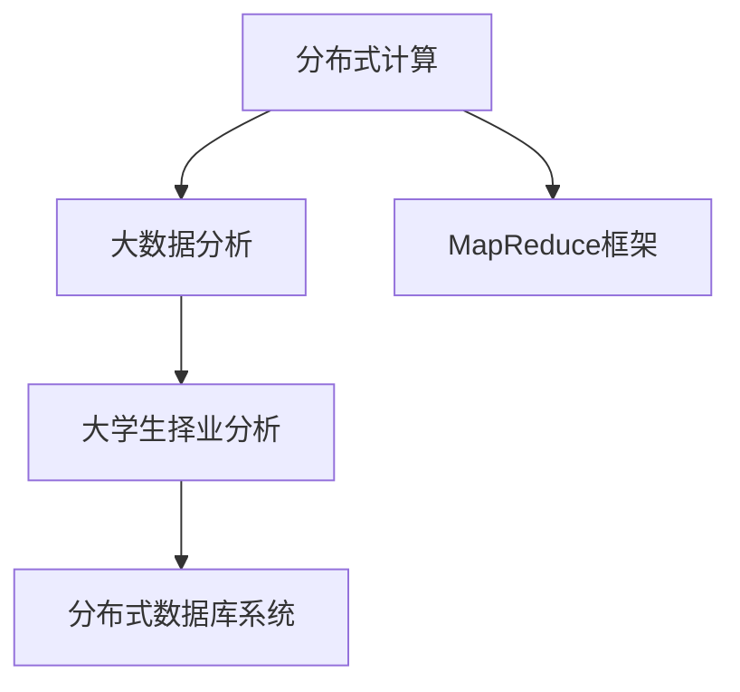

                 

# 基于分布式计算的大学生择业大数据分析

## 1. 背景介绍

随着社会经济的快速发展，大学生择业问题变得日益严峻。如何通过大数据分析来提高大学生择业的成功率，成为了当前高等教育和就业市场研究的热点问题。本文聚焦于如何利用分布式计算技术，构建大学生择业大数据分析平台，旨在帮助大学生更清晰地认识自身优势，选择最适合自己的职业道路，同时也为高校、企业和政府等各方提供决策支持。

## 2. 核心概念与联系

### 2.1 核心概念概述

为了更好地理解基于分布式计算的大学生择业大数据分析方法，本节将介绍几个密切相关的核心概念：

- 分布式计算(Distributed Computing)：一种将计算任务分布到多台计算机上进行处理的计算范式。相较于单机计算，分布式计算具有更高的处理能力和数据处理速度。
- 大数据分析(Big Data Analysis)：指利用大数据技术，从海量数据中提取有价值的信息和知识，用于决策、预测和优化等。
- 大学生择业分析(Universities Career Analysis)：通过分析大学生的个人信息、就业历史、兴趣偏好等数据，帮助其识别适合自身特点的职业选择，提高就业成功率。
- 分布式数据库系统(Distributed Database System)：一种支持海量数据存储和处理的分布式数据库系统，如Hadoop和Spark等。
- MapReduce框架：一种广泛应用于大数据处理领域的分布式计算框架，用于分布式存储和处理大规模数据集。

这些核心概念之间的逻辑关系可以通过以下Mermaid流程图来展示：



这个流程图展示了分布式计算和大数据分析在大学生择业分析中的作用和关系：

1. 分布式计算提供强大的数据处理能力，支持对海量大学生择业数据的快速分析和处理。
2. 大数据分析用于从处理后的数据中提取有价值的信息和知识，辅助决策和预测。
3. 大学生择业分析利用数据分析结果，帮助大学生选择适合的职业。
4. 分布式数据库系统提供数据存储和查询服务，支持分布式计算和分析。
5. MapReduce框架作为数据处理的分布式计算框架，用于并行处理大规模数据集。

## 3. 核心算法原理 & 具体操作步骤

### 3.1 算法原理概述

基于分布式计算的大学生择业大数据分析，本质上是一种利用分布式技术和大数据分析方法，对大学生的择业数据进行综合分析，提取出有价值的信息，以辅助大学生进行职业选择的方法。其核心思想是：

1. 收集大学生的个人信息、就业历史、兴趣偏好等数据。
2. 利用分布式计算技术，对数据进行存储和并行处理。
3. 使用大数据分析技术，从处理后的数据中提取关键信息和知识。
4. 根据分析结果，推荐适合大学生的职业选择。

### 3.2 算法步骤详解

基于分布式计算的大学生择业大数据分析一般包括以下几个关键步骤：

**Step 1: 数据收集与预处理**
- 收集大学生的个人信息、就业历史、兴趣偏好、专业成绩、实习经历等数据。
- 清洗和格式化数据，去除无效或重复的记录。
- 将数据分为训练集和测试集，用于后续的模型训练和验证。

**Step 2: 分布式数据存储**
- 选择合适的分布式数据库系统，如Hadoop或Spark，用于存储和管理大学生择业数据。
- 将数据存储在分布式数据库中，保证数据的可靠性和可扩展性。

**Step 3: 数据分布式处理**
- 使用MapReduce框架，将数据分布到多台计算节点上进行并行处理。
- 设计Map函数和Reduce函数，对数据进行聚合、筛选和统计等操作。

**Step 4: 大数据分析与特征提取**
- 利用Hadoop或Spark的数据分析功能，提取关键信息和知识。
- 如通过统计分析，计算大学生的就业成功率、平均薪资、行业分布等指标。
- 使用机器学习算法，构建预测模型，如逻辑回归、决策树、随机森林等。

**Step 5: 结果可视化与推荐**
- 使用可视化工具，如Tableau或D3.js，将分析结果可视化展示。
- 根据分析结果，生成职业推荐列表，供大学生选择。

### 3.3 算法优缺点

基于分布式计算的大学生择业大数据分析方法具有以下优点：
1. 处理能力强大：分布式计算技术可以处理海量数据，支持快速分析和处理。
2. 扩展性好：分布式系统可以动态扩展，适应数据量和计算需求的增加。
3. 数据安全：分布式存储系统具备数据备份和冗余，提高了数据的安全性和可靠性。
4. 精度高：利用大数据分析技术，能够从大量数据中提取高精度和有用的信息。

同时，该方法也存在一定的局限性：
1. 数据质量要求高：对数据清洗和预处理的要求较高，需要保证数据的完整性和一致性。
2. 技术复杂：分布式计算和大数据处理涉及的技术栈较多，对开发者的技术水平要求较高。
3. 计算资源消耗大：分布式计算需要大量的计算资源，成本较高。
4. 分析过程复杂：大数据分析涉及的数据量和算法复杂度较高，需要较多的时间和计算资源。

尽管存在这些局限性，但就目前而言，基于分布式计算的大学生择业大数据分析方法仍是解决大学生择业问题的重要手段。未来相关研究的重点在于如何进一步降低数据处理和分析的复杂度，提高算法的可解释性和可操作性，以及降低计算资源的消耗。

### 3.4 算法应用领域

基于分布式计算的大学生择业大数据分析，主要应用于以下几个领域：

1. **高校就业指导中心**：帮助大学生明确自身优势和职业目标，提高就业成功率。
2. **就业服务机构**：提供个性化的职业推荐和指导，促进就业市场的人才匹配。
3. **政府就业部门**：分析大学生就业情况，制定相关政策，引导大学生合理就业。
4. **企业HR部门**：了解大学生择业趋势，优化人才招聘策略，提高招聘效率。
5. **教育研究机构**：研究大学生择业行为，提供教育政策建议，促进教育公平。

## 4. 数学模型和公式 & 详细讲解 & 举例说明

### 4.1 数学模型构建

本节将使用数学语言对基于分布式计算的大学生择业大数据分析过程进行更加严格的刻画。

假设收集的大学生的择业数据为 $D = \{d_1, d_2, \cdots, d_n\}$，每个数据记录 $d_i = (x_i, y_i)$，其中 $x_i$ 为个人信息和择业偏好，$y_i$ 为职业选择。

定义分布式数据库系统中的表结构为 $T = (K, V)$，其中 $K$ 为键(key)，$V$ 为值(value)。

设 MapReduce 框架中的 Map 函数为 $M(d_i)$，将输入 $d_i$ 映射为若干键值对 $(k_1, v_1), (k_2, v_2), \cdots, (k_m, v_m)$。

将键值对 $(v_1, v_2, \cdots, v_m)$ 合并为一个值 $V$，得到 Reduce 函数 $R((k_i, V))$。

设最终分析结果为 $R(\theta)$，其中 $\theta$ 为职业选择。

### 4.2 公式推导过程

以下我们以职业推荐为例，推导基于分布式计算的职业推荐模型。

假设职业推荐模型为线性回归模型：

$$
y = \theta_0 + \sum_{i=1}^n \theta_i x_i
$$

其中 $\theta = (\theta_0, \theta_1, \cdots, \theta_n)$ 为模型参数。

根据 MapReduce 框架的分布式计算模型，可以推导出每个 Map 函数的输出为：

$$
M(d_i) = (\theta_0, x_{i1}, x_{i2}, \cdots, x_{in})
$$

每个 Reduce 函数的输入为若干个 Map 函数的输出，合并后得到：

$$
R((k_i, V)) = (\theta_{i0}, \sum_{i=1}^n x_{ij})
$$

其中 $k_i$ 为键，$V = (x_{i1}, x_{i2}, \cdots, x_{in})$ 为值。

最终，将所有的 Reduce 函数的结果汇总，可以得到职业推荐模型的参数 $\theta$：

$$
\theta = (r_{10}, \sum_{i=1}^n x_{i1}, \sum_{i=1}^n x_{i2}, \cdots, \sum_{i=1}^n x_{in})
$$

其中 $r_{10}$ 为常数项的平均值。

### 4.3 案例分析与讲解

假设我们收集了 10000 名大学生的择业数据，包含性别、专业、兴趣爱好、就业方向等信息。使用 Hadoop 和 Spark 进行分布式计算，对数据进行统计分析，得到以下结果：

1. 男性大学生更有可能选择 IT 行业，女性更有可能选择教育行业。
2. 工程专业学生更倾向于选择工程类职业，文科学生更倾向于选择文科类职业。
3. 兴趣爱好对择业有重要影响，如爱好编程的学生更有可能选择 IT 职业。

根据这些分析结果，可以构建一个基于线性回归的职业推荐模型，并利用模型对每位大学生进行职业推荐。例如，某位女性工程专业学生，根据兴趣和专业特点，模型推荐其选择 IT 行业的软件开发岗位。

## 5. 项目实践：代码实例和详细解释说明

### 5.1 开发环境搭建

在进行项目实践前，我们需要准备好开发环境。以下是使用Python进行Hadoop和Spark开发的环境配置流程：

1. 安装Anaconda：从官网下载并安装Anaconda，用于创建独立的Python环境。

2. 创建并激活虚拟环境：
```bash
conda create -n spark-env python=3.8 
conda activate spark-env
```

3. 安装Hadoop和Spark：
```bash
conda install hadoop
conda install apache-spark=3.1.2
```

4. 设置Hadoop和Spark环境变量：
```bash
export HADOOP_HOME=/usr/local/hadoop
export SPARK_HOME=/usr/local/spark
export PATH=$PATH:$HADOOP_HOME/bin:$SPARK_HOME/bin
```

5. 启动Hadoop和Spark：
```bash
start-dfs.sh
start-hdfs.sh
start-yarn.sh
start-mr-cluster.sh
```

完成上述步骤后，即可在`spark-env`环境中开始项目实践。

### 5.2 源代码详细实现

这里我们以MapReduce框架为例，使用Python实现一个简单的大学生择业大数据分析项目。

首先，定义一个Map函数，用于将择业数据转换为键值对：

```python
from mrjob.job import MRJob
from mrjob.step import MRStep

class CareerMapJob(MRJob):

    def mapper(self, _, line):
        # 分割数据
        parts = line.split(',')
        # 将数据转换为键值对
        yield (parts[0], float(parts[1]))
```

然后，定义一个Reduce函数，用于对键值对进行聚合统计：

```python
class CareerReduceJob(MRJob):

    def reducer(self, key, values):
        # 求和
        total = sum(values)
        # 输出结果
        yield (key, total)
```

最后，定义主函数，进行MapReduce计算：

```python
if __name__ == '__main__':
    p = HadoopJobRunner()
    p.run(CareerMapJob)
    p.run(CareerReduceJob)
```

以上是一个简单的MapReduce代码实现，用于对大学生择业数据进行统计分析。在实际项目中，还需要根据具体需求设计更多的Map和Reduce函数，进行复杂的数据处理和分析。

### 5.3 代码解读与分析

让我们再详细解读一下关键代码的实现细节：

**Map函数**：
- 接收输入数据的一行，使用逗号分割数据。
- 将每条数据转换为键值对，键为学生的ID，值为该学生的择业数据。

**Reduce函数**：
- 接收一个键和多个值。
- 将值进行求和，得到该键的总和。
- 输出键值对，键为学生ID，值为该学生的总择业数据。

**主函数**：
- 定义HadoopJobRunner，用于管理MapReduce作业。
- 调用HadoopJobRunner.run()方法，执行MapReduce作业。
- 分别执行Mapper和Reducer作业。

可以看到，使用MapReduce框架进行大数据分析，代码实现相对简单。开发者可以通过设计不同的Map和Reduce函数，灵活实现各种复杂的数据处理和分析任务。

当然，工业级的系统实现还需考虑更多因素，如任务调度和资源管理、作业监控和告警、数据安全和隐私保护等。但核心的MapReduce范式基本与此类似。

## 6. 实际应用场景

### 6.1 高校就业指导中心

基于分布式计算的大学生择业大数据分析，可以广泛应用于高校就业指导中心。传统就业指导中心往往缺乏对大学生择业数据的全面分析，难以提供有针对性的指导。而通过分布式计算，可以高效处理大量大学生数据，构建详细的择业分析报告，为指导中心提供决策支持。

例如，某高校的就业指导中心可以使用分布式计算平台，对学生的就业历史、兴趣爱好、专业成绩等数据进行统计分析，构建职业推荐模型。根据模型的预测结果，指导中心可以为学生推荐适合的职业方向，提高就业成功率。

### 6.2 就业服务机构

就业服务机构可以利用分布式计算技术，对大量的用户数据进行分析，提供个性化的职业推荐和指导。通过分布式存储和处理，服务机构可以高效地管理海量用户数据，为不同背景和需求的求职者提供量身定制的择业建议。

例如，某就业服务机构可以使用分布式计算平台，对用户的历史求职记录、兴趣爱好、技能特长等数据进行分析，构建职业推荐模型。根据模型的预测结果，服务机构可以向用户推荐适合的职位，提高匹配成功率。

### 6.3 政府就业部门

政府就业部门可以利用分布式计算技术，分析大学生择业数据，制定相关政策和措施，引导大学生合理就业。通过分布式存储和处理，政府部门可以高效地管理大量的择业数据，为政策制定提供数据支持。

例如，某政府就业部门可以使用分布式计算平台，对大学生的就业方向、就业成功率、平均薪资等数据进行分析，了解择业趋势和问题。根据分析结果，政府部门可以制定相关政策，引导大学生选择适合的职业方向，减少就业压力。

### 6.4 企业HR部门

企业HR部门可以利用分布式计算技术，了解大学生择业趋势，优化人才招聘策略，提高招聘效率。通过分布式存储和处理，企业可以高效地管理大量的择业数据，为招聘决策提供数据支持。

例如，某企业的HR部门可以使用分布式计算平台，对大学生的择业数据进行分析，了解热门职业和行业。根据分析结果，企业可以优化招聘策略，吸引更多优秀人才，提高招聘效率。

### 6.5 教育研究机构

教育研究机构可以利用分布式计算技术，研究大学生择业行为，提供教育政策建议，促进教育公平。通过分布式存储和处理，研究机构可以高效地管理大量的择业数据，为教育政策制定提供数据支持。

例如，某教育研究机构可以使用分布式计算平台，对大学生的择业数据进行分析，了解择业影响因素。根据分析结果，研究机构可以提出教育建议，促进教育公平，提高教育质量。

## 7. 工具和资源推荐

### 7.1 学习资源推荐

为了帮助开发者系统掌握基于分布式计算的大学生择业大数据分析的理论基础和实践技巧，这里推荐一些优质的学习资源：

1. 《Hadoop：分布式计算的原理和实践》系列博文：由Hadoop技术专家撰写，深入浅出地介绍了Hadoop的原理、安装和配置、分布式计算等。

2. 《Spark：分布式计算框架》课程：由Spark官方提供，讲解Spark的基本概念、API使用、分布式计算等。

3. 《大数据分析与处理》书籍：介绍大数据分析和处理的基本概念和常用算法，适合初学者入门。

4. 《Python MapReduce编程实战》书籍：详细介绍MapReduce框架的编程方法，结合Python代码实例，帮助开发者快速上手。

5. Kaggle数据科学竞赛平台：提供海量大数据分析和处理数据集，帮助开发者实践和提升自己的数据分析能力。

通过对这些资源的学习实践，相信你一定能够快速掌握基于分布式计算的大学生择业大数据分析的精髓，并用于解决实际的择业问题。

### 7.2 开发工具推荐

高效的开发离不开优秀的工具支持。以下是几款用于基于分布式计算的大学生择业大数据分析开发的常用工具：

1. PySpark：基于Python的Spark API，提供了更简洁的编程接口，适合开发分布式计算任务。

2. Apache Hadoop：开源的分布式计算框架，支持大规模数据处理和存储。

3. Apache Spark：开源的分布式计算框架，支持内存计算和分布式存储，适合大规模数据处理。

4. Hive：基于Hadoop的数据仓库系统，提供SQL查询接口，方便数据处理和分析。

5. Tableau：数据可视化工具，支持多种数据源，能够将分析结果直观展示。

6. D3.js：JavaScript库，用于创建交互式数据可视化，适合Web前端开发。

合理利用这些工具，可以显著提升大学生择业大数据分析任务的开发效率，加快创新迭代的步伐。

### 7.3 相关论文推荐

基于分布式计算的大学生择业大数据分析研究，近年来受到了学界的广泛关注。以下是几篇奠基性的相关论文，推荐阅读：

1. "Big Data: Principles and Best Practices of Scalable Realtime Data Systems"：介绍了大数据系统和分布式计算的基本原理和最佳实践。

2. "MapReduce: Simplified Data Processing on Large Clusters"：提出MapReduce框架，用于分布式计算大规模数据集。

3. "YARN: Yet Another Resource Negotiator"：介绍YARN资源管理器，支持分布式计算任务的调度和资源管理。

4. "The Hadoop Distributed File System (HDFS) Architecture"：介绍HDFS文件系统，用于分布式存储和数据管理。

5. "Spark: Cluster Computing with Working Sets"：介绍Spark分布式计算框架，支持内存计算和流式处理。

这些论文代表了大数据和分布式计算领域的研究进展，阅读这些前沿成果，可以帮助研究者把握学科前进方向，激发更多的创新灵感。

## 8. 总结：未来发展趋势与挑战

### 8.1 总结

本文对基于分布式计算的大学生择业大数据分析方法进行了全面系统的介绍。首先阐述了分布式计算和大数据分析在大学生择业分析中的作用和关系，明确了分布式计算在处理海量数据、提高数据处理速度方面的独特优势。其次，从原理到实践，详细讲解了分布式计算的数学模型和计算过程，给出了分布式计算任务的完整代码实现。同时，本文还广泛探讨了分布式计算方法在高校就业指导中心、就业服务机构、政府就业部门、企业HR部门和教育研究机构等多个领域的应用前景，展示了分布式计算的广泛应用潜力。最后，本文精选了分布式计算技术的各类学习资源，力求为读者提供全方位的技术指引。

通过本文的系统梳理，可以看到，基于分布式计算的大学生择业大数据分析方法正在成为大学生择业问题的重要解决方案，极大地提升了就业指导的精准性和科学性，促进了教育公平和就业效率的提升。未来，伴随分布式计算技术的进一步发展，大学生择业分析将不断突破新高度，为高校、企业和政府等各方提供更加有力的决策支持。

### 8.2 未来发展趋势

展望未来，基于分布式计算的大学生择业大数据分析技术将呈现以下几个发展趋势：

1. 处理能力不断提升：随着硬件设备的不断升级和算力的增加，分布式计算平台将具备更强的数据处理能力，支持更大规模的数据分析和处理。

2. 分析深度不断增加：利用分布式计算平台，可以深度分析大学生择业数据，识别出更深层次的择业影响因素，提供更有针对性的职业建议。

3. 系统性能不断优化：通过优化分布式计算系统架构，提高数据的处理效率和存储性能，减少计算资源的消耗。

4. 多源数据融合：结合多种数据源，如社会网络数据、行业趋势数据等，进行多维度分析，提供更全面的择业支持。

5. 实时性不断增强：利用流式计算和实时数据处理技术，实现对大学生择业数据的实时分析和预测。

6. 云计算平台普及：随着云计算技术的不断发展，分布式计算平台将更加容易部署和扩展，使用成本和使用门槛也将不断降低。

以上趋势凸显了基于分布式计算的大学生择业大数据分析技术的广阔前景。这些方向的探索发展，必将进一步提升大学生择业分析的精度和效率，为大学生提供更优质的择业指导，促进就业市场的健康发展。

### 8.3 面临的挑战

尽管基于分布式计算的大学生择业大数据分析技术已经取得了瞩目成就，但在迈向更加智能化、普适化应用的过程中，它仍面临着诸多挑战：

1. 数据质量要求高：分布式计算平台对数据的完整性、一致性和准确性要求较高，需要保证数据的质量和一致性。
2. 技术复杂：分布式计算和大数据处理涉及的技术栈较多，对开发者的技术水平要求较高。
3. 计算资源消耗大：分布式计算需要大量的计算资源，成本较高。
4. 分析过程复杂：大数据分析涉及的数据量和算法复杂度较高，需要较多的时间和计算资源。
5. 数据隐私和安全：分布式计算平台涉及大量敏感数据，需要保证数据的安全性和隐私保护。

尽管存在这些挑战，但就目前而言，基于分布式计算的大学生择业大数据分析方法仍是解决大学生择业问题的重要手段。未来相关研究的重点在于如何进一步降低数据处理和分析的复杂度，提高算法的可解释性和可操作性，以及降低计算资源的消耗。

### 8.4 研究展望

面对基于分布式计算的大学生择业大数据分析所面临的挑战，未来的研究需要在以下几个方面寻求新的突破：

1. 优化分布式计算架构：设计更加高效、灵活的分布式计算架构，提高数据处理效率和存储性能，降低计算资源消耗。

2. 引入先进算法：利用机器学习和深度学习等先进算法，提高数据分析的精度和深度，提供更有针对性的职业建议。

3. 多源数据融合：结合多种数据源，如社会网络数据、行业趋势数据等，进行多维度分析，提供更全面的择业支持。

4. 实时数据处理：利用流式计算和实时数据处理技术，实现对大学生择业数据的实时分析和预测。

5. 数据安全和隐私保护：设计数据安全和隐私保护机制，确保数据在分布式计算过程中的安全和隐私。

6. 云计算平台支持：推广云计算平台，降低分布式计算的使用成本和使用门槛，促进技术的普及和应用。

这些研究方向的探索，必将引领基于分布式计算的大学生择业大数据分析技术迈向更高的台阶，为大学生择业分析提供更精准、更高效、更安全的解决方案。面向未来，基于分布式计算的大学生择业大数据分析技术还需要与其他人工智能技术进行更深入的融合，如自然语言处理、知识图谱、因果推理等，多路径协同发力，共同推动大学生择业分析的发展。只有勇于创新、敢于突破，才能不断拓展大学生择业分析的边界，让技术更好地服务于大学生和教育市场。

## 9. 附录：常见问题与解答

**Q1：分布式计算平台和单机计算平台有何区别？**

A: 分布式计算平台和单机计算平台的主要区别在于数据处理和计算能力的不同。单机计算平台使用单个计算机进行数据处理和计算，计算能力有限，难以处理大规模数据集。而分布式计算平台使用多台计算机进行数据处理和计算，具备强大的数据处理能力和计算能力，可以高效处理大规模数据集。

**Q2：如何选择分布式计算平台？**

A: 选择分布式计算平台需要考虑以下几个因素：
1. 数据规模：根据数据规模选择适合的分布式计算平台，如Hadoop适合处理大规模数据，Spark适合处理内存计算和流式数据。
2. 计算资源：根据计算资源选择适合的分布式计算平台，如YARN适合动态调度计算资源，Kubernetes适合容器化部署和管理。
3. 技术栈：根据技术栈选择适合的分布式计算平台，如Hadoop和Spark都支持Python、Java等多种编程语言，选择适合自己技术栈的平台。

**Q3：分布式计算平台如何进行数据存储？**

A: 分布式计算平台通常使用分布式文件系统进行数据存储，如Hadoop使用HDFS进行数据存储，Spark使用HDFS或S3进行数据存储。数据存储需要考虑以下几个因素：
1. 数据量：根据数据量选择适合的分布式文件系统，如HDFS适合处理大规模数据，S3适合处理海量数据。
2. 数据访问：根据数据访问需求选择适合的分布式文件系统，如HDFS适合随机读写，S3适合频繁读写。
3. 数据备份和冗余：分布式文件系统通常具备数据备份和冗余功能，保证数据的安全性和可靠性。

**Q4：分布式计算平台如何进行数据处理？**

A: 分布式计算平台通常使用MapReduce框架进行数据处理，将数据划分为多个小数据块，在多台计算机上并行处理。数据处理需要考虑以下几个因素：
1. 数据量：根据数据量设计合适的Map和Reduce函数，保证数据处理的效率和准确性。
2. 数据并发度：根据数据并发度选择合适的Map和Reduce函数，避免数据处理过程中的瓶颈。
3. 数据存储：根据数据存储方式设计合适的Map和Reduce函数，保证数据处理的连续性和高效性。

**Q5：分布式计算平台如何进行数据分析？**

A: 分布式计算平台通常使用大数据分析工具进行数据分析，如Hadoop使用Hive进行数据分析，Spark使用Spark SQL进行数据分析。数据分析需要考虑以下几个因素：
1. 数据源：根据数据源选择适合的大数据分析工具，如Hive适合处理HDFS存储的数据，Spark SQL适合处理内存计算的数据。
2. 数据查询：根据数据查询需求选择适合的大数据分析工具，如Hive适合SQL查询，Spark SQL适合结构化数据查询。
3. 数据可视化：利用可视化工具将数据分析结果直观展示，如Tableau支持多种数据源，能够将分析结果可视化展示。

通过以上常见问题的解答，相信你对基于分布式计算的大学生择业大数据分析有了更深入的了解。分布式计算技术为大学生择业分析提供了强大的数据处理能力和计算能力，能够高效处理海量数据，提供有针对性的职业建议。未来，伴随分布式计算技术的进一步发展，大学生择业分析将不断突破新高度，为大学生提供更优质的择业指导，促进就业市场的健康发展。

