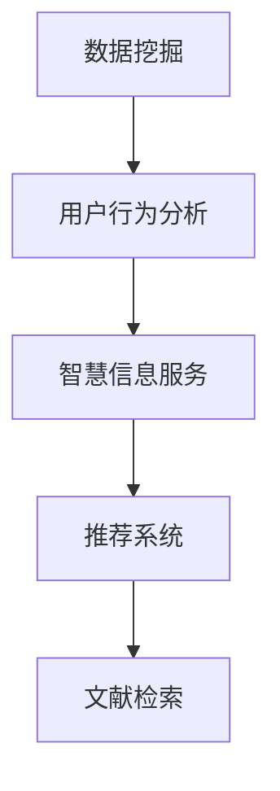

                 

# 基于数据挖掘的图书馆智慧信息服务研究

> 关键词：数据挖掘，图书馆智慧信息服务，用户行为分析，推荐系统，文献检索

## 1. 背景介绍

在数字化时代，图书馆正面临传统业务模式与新兴技术需求之间的冲突。面对大量电子资源和海量用户数据，如何利用数据挖掘技术提升图书馆智慧信息服务水平，成为当下的一大热门话题。

## 2. 核心概念与联系

### 2.1 核心概念概述

为更好地理解基于数据挖掘的图书馆智慧信息服务，本节将介绍几个密切相关的核心概念：

- **数据挖掘**（Data Mining）：从海量数据中自动发现有用信息和知识的过程。数据挖掘通常包括分类、聚类、关联规则、预测等技术手段。
- **智慧信息服务**（Intelligent Information Service）：指利用人工智能、大数据等技术，为用户提供智能、个性化、高效的图书馆信息服务。
- **用户行为分析**（User Behavior Analysis）：通过对用户访问、借阅、咨询等行为数据进行挖掘分析，了解用户需求和兴趣，为用户提供更个性化的服务。
- **推荐系统**（Recommendation System）：通过分析用户行为和资源特征，为用户推荐最合适的信息资源。推荐系统分为基于协同过滤、基于内容的推荐等不同算法。
- **文献检索**（Literature Retrieval）：根据用户查询关键词，从大量文献中检索出最相关的结果。通常使用倒排索引、向量空间模型等技术。

这些核心概念之间的逻辑关系可以通过以下Mermaid流程图来展示：



这个流程图展示了大数据挖掘技术对图书馆智慧信息服务过程的全面影响。

## 3. 核心算法原理 & 具体操作步骤
### 3.1 算法原理概述

基于数据挖掘的图书馆智慧信息服务，本质上是一个信息检索与推荐的闭环系统。其核心思想是：通过数据挖掘技术，分析和挖掘用户行为数据和资源特征，为每个用户构建个性化用户画像，进而基于该画像为用户推荐最相关的信息资源。

形式化地，假设用户集合为 $U$，资源集合为 $R$，用户与资源的关联矩阵为 $X$，用户行为数据为 $D$。数据挖掘过程分为以下几个步骤：

1. 用户画像构建：通过分析用户行为数据 $D$，挖掘出用户兴趣 $I$。
2. 资源特征提取：从资源集合 $R$ 中提取资源特征 $F$。
3. 用户-资源匹配：通过相似性度量，找到与用户 $i$ 最相关的资源 $r$。

推荐系统可以通过分类、聚类等方法实现：

- **协同过滤**：基于用户行为相似性进行推荐，主要分为基于用户的协同过滤和基于项目的协同过滤。
- **基于内容的推荐**：根据资源特征 $F$ 与用户兴趣 $I$ 的相似度，推荐相关资源。

### 3.2 算法步骤详解

基于数据挖掘的图书馆智慧信息服务一般包括以下几个关键步骤：

**Step 1: 数据收集与预处理**
- 收集图书馆的各类数据，如用户登录记录、借阅历史、查询日志、资源元数据等。
- 对数据进行清洗、去重、缺失值处理，保证数据质量。

**Step 2: 用户画像构建**
- 使用分类、聚类等算法，对用户行为数据进行建模，提取用户兴趣 $I$。
- 通常使用协同过滤、基于内容的推荐等方法，根据用户历史行为构建用户画像。

**Step 3: 资源特征提取**
- 对资源元数据进行处理，提取关键词、类别、作者等特征，构建资源特征向量 $F$。
- 通常使用TF-IDF、Word2Vec、GloVe等技术对文本特征进行建模。

**Step 4: 相似性度量**
- 使用余弦相似度、欧氏距离等度量方法，计算用户兴趣 $I$ 和资源特征 $F$ 的相似度 $S$。
- 相似度度量是推荐系统的核心，直接影响推荐效果。

**Step 5: 推荐结果排序**
- 将相似度 $S$ 映射到推荐分数，对推荐结果进行排序，选择topN个结果输出。
- 排序策略包括基于阈值的排序、基于增量的排序、基于模型的排序等。

**Step 6: 结果反馈与迭代**
- 记录用户对推荐结果的点击、借阅、评价等反馈数据，用于后续模型迭代和优化。
- 推荐系统需要不断迭代优化，提高推荐效果。

### 3.3 算法优缺点

基于数据挖掘的图书馆智慧信息服务具有以下优点：
1. 个性化服务：通过分析用户行为，提供个性化推荐，提升用户满意度。
2. 提高资源利用率：推荐系统能够将优质资源推荐给最需要的人，提高资源利用效率。
3. 减少信息过载：通过推荐系统过滤无用信息，减轻用户信息过载压力。
4. 数据驱动决策：通过数据分析，指导图书馆的资源采购、布局优化等工作。

同时，该方法也存在一定的局限性：
1. 依赖数据质量：用户行为数据和资源特征数据的准确性直接影响推荐效果。
2. 推荐算法复杂：推荐算法的选择和调参需要经验和实践，可能导致过度拟合。
3. 冷启动问题：新用户或资源缺乏足够数据，推荐效果差。
4. 数据隐私保护：用户数据隐私需要得到充分保护，避免泄露。

尽管存在这些局限性，但就目前而言，基于数据挖掘的智慧信息服务已经成为图书馆领域的重要应用范式，可以有效提升用户体验和资源利用率。未来相关研究的重点在于如何进一步降低推荐算法对标注数据的依赖，提高模型的少样本学习和跨领域迁移能力，同时兼顾数据隐私和安全等因素。

### 3.4 算法应用领域

基于数据挖掘的智慧信息服务方法，在图书馆领域已经得到了广泛的应用，覆盖了以下多个方面：

- **个性化推荐**：针对每位用户的阅读、借阅、浏览行为，推荐其可能感兴趣的新书、期刊等资源。
- **智能书位导航**：通过分析用户行为，优化书架布局和书籍排序，提升用户找书效率。
- **实时咨询服务**：根据用户提问历史，推荐相关知识库、FAQ等内容，提升用户自服务体验。
- **专题资源推荐**：对特定主题的资源进行分类聚类，推荐相关资源，满足用户深度学习需求。
- **自动化借阅管理**：分析用户借阅行为，自动更新租借规则，提升借阅管理效率。

除了上述这些经典应用外，基于数据挖掘的智慧信息服务还被创新性地应用到更多场景中，如智能导引、智慧空间构建、用户行为分析等，为图书馆的数字化转型升级提供新的技术路径。随着数据挖掘和推荐算法的不断进步，相信智慧信息服务必将在更多领域大放异彩。

## 4. 数学模型和公式 & 详细讲解 & 举例说明
### 4.1 数学模型构建

本节将使用数学语言对基于数据挖掘的图书馆智慧信息服务过程进行更加严格的刻画。

记用户集合为 $U$，资源集合为 $R$，用户与资源的关联矩阵为 $X$，用户行为数据为 $D$。

### 4.2 公式推导过程

**用户画像构建**：

- **协同过滤**：假设用户 $i$ 和用户 $j$ 的兴趣相似度为 $s_{ij}$，用户 $i$ 对资源 $r$ 的评分 $r_i$ 为1，否则为0。利用余弦相似度计算用户兴趣相似度：

$$
s_{ij} = \frac{\sum_{r \in R} (r_i \times r_j)}{\sqrt{\sum_{r \in R} r_i^2} \times \sqrt{\sum_{r \in R} r_j^2}}
$$

其中，$r_i = \sum_{j \in U} (X_{ij} \times s_{ij})$。

- **基于内容的推荐**：假设资源 $r$ 的特征向量为 $F_r$，用户 $i$ 的兴趣向量为 $I_i$，计算资源与用户兴趣相似度：

$$
S(r,i) = \frac{\langle F_r, I_i \rangle}{\|F_r\| \times \|I_i\|}
$$

其中，$\langle \cdot, \cdot \rangle$ 为向量点积，$\|\cdot\|$ 为向量范数。

**相似性度量**：

- **余弦相似度**：计算用户兴趣 $I$ 和资源特征 $F$ 的相似度：

$$
S(I,F) = \frac{\langle I, F \rangle}{\|I\| \times \|F\|}
$$

**推荐结果排序**：

- **阈值排序**：设定阈值 $T$，对推荐结果进行排序：

$$
r^* = \arg \max_{r \in R} S(r,i)
$$

其中，$S(r,i) \geq T$。

- **增量排序**：利用增量排序算法，不断更新推荐列表。

### 4.3 案例分析与讲解

假设图书馆有一批资源 $R$ 和一组用户 $U$，收集了部分用户借阅数据 $D$。我们使用协同过滤和基于内容的推荐算法，对用户 $i$ 进行资源推荐。

首先，利用协同过滤算法构建用户兴趣 $I$，使用以下公式：

$$
I_i = \sum_{j \in U} (X_{ij} \times s_{ij})
$$

然后，提取资源 $r$ 的特征向量 $F_r$，并计算用户兴趣 $I_i$ 和资源特征 $F_r$ 的相似度 $S(I_i,F_r)$，推荐得分最高的资源：

$$
r^* = \arg \max_{r \in R} S(I_i,F_r)
$$

最后，将推荐结果进行排序，输出 topN 个资源。

## 5. 项目实践：代码实例和详细解释说明
### 5.1 开发环境搭建

在进行智慧信息服务实践前，我们需要准备好开发环境。以下是使用Python进行PyTorch开发的环境配置流程：

1. 安装Anaconda：从官网下载并安装Anaconda，用于创建独立的Python环境。

2. 创建并激活虚拟环境：
```bash
conda create -n pytorch-env python=3.8 
conda activate pytorch-env
```

3. 安装PyTorch：根据CUDA版本，从官网获取对应的安装命令。例如：
```bash
conda install pytorch torchvision torchaudio cudatoolkit=11.1 -c pytorch -c conda-forge
```

4. 安装必要的第三方库：
```bash
pip install pandas numpy matplotlib scikit-learn
```

完成上述步骤后，即可在`pytorch-env`环境中开始实践。

### 5.2 源代码详细实现

这里我们以协同过滤算法为例，展示使用PyTorch实现基于数据挖掘的图书馆智慧信息服务。

首先，定义用户和资源的数据结构：

```python
class User:
    def __init__(self, user_id):
        self.user_id = user_id
        self.rated_items = []

class Item:
    def __init__(self, item_id):
        self.item_id = item_id
        self.title = "Item %d" % item_id
        self.features = ["Some feature1", "Some feature2"]
```

然后，定义数据加载和预处理函数：

```python
def load_data():
    users = []
    items = []
    
    # 读取用户数据
    with open('users.txt', 'r') as f:
        for line in f:
            user_id, item_id, rating = line.strip().split(' ')
            user = User(user_id)
            item = Item(item_id)
            user.rated_items.append((item, float(rating)))
            items.append(item)
    
    # 读取资源数据
    with open('items.txt', 'r') as f:
        for line in f:
            item_id, title, features = line.strip().split(' | ')
            item = Item(int(item_id))
            item.title = title
            item.features = features.split(',')
            
    return users, items

def preprocess_data(users, items):
    # 构造用户-资源关联矩阵
    X = np.zeros((len(users), len(items)))
    for user, items in users:
        for item, rating in user.rated_items:
            X[user.user_id-1, item.item_id-1] = rating
            
    # 标准化数据
    X = (X - X.mean()) / X.std()
    
    return X
```

接着，定义协同过滤推荐函数：

```python
def collaborative_filtering(X, topN=5):
    # 构建用户兴趣向量
    users = []
    for i in range(X.shape[0]):
        user = []
        for j in range(X.shape[1]):
            user.append(X[i][j])
        users.append(user)
    
    # 基于余弦相似度计算推荐结果
    scores = []
    for i in range(len(users)):
        scores.append([0.0] * len(items))
        for j in range(len(users)):
            if i == j:
                continue
            for k in range(len(items)):
                if X[i][k] == 0 or X[j][k] == 0:
                    continue
                similarity = np.dot(users[i], users[j]) / (np.linalg.norm(users[i]) * np.linalg.norm(users[j]))
                if similarity > 0:
                    scores[i][k] += X[j][k] * similarity
    
    # 排序并输出结果
    ranking = sorted(enumerate(scores[i]), key=lambda x: x[1], reverse=True)[:topN]
    return [item.item_id for _, item in ranking]
```

最后，使用示例数据进行测试：

```python
users, items = load_data()
X = preprocess_data(users, items)
top_items = collaborative_filtering(X)
print(top_items)
```

以上就是使用PyTorch实现基于数据挖掘的图书馆智慧信息服务的完整代码实现。可以看到，使用简单的协同过滤算法，图书馆可以为用户推荐其可能感兴趣的新书、期刊等资源。

### 5.3 代码解读与分析

让我们再详细解读一下关键代码的实现细节：

**User类和Item类**：
- `User`类和`Item`类分别表示用户和资源，其中`User`类保存用户的历史评分，`Item`类保存资源的基本信息和特征。

**load_data函数**：
- 读取用户数据和资源数据，构造用户-资源关联矩阵`X`，并对数据进行标准化处理。

**preprocess_data函数**：
- 对用户-资源关联矩阵进行标准化处理，方便协同过滤算法的计算。

**collaborative_filtering函数**：
- 根据用户-资源关联矩阵`X`，构建用户兴趣向量，并计算推荐得分。
- 使用余弦相似度计算用户与用户之间的相似度，并根据相似度计算推荐得分。
- 对推荐得分进行排序，输出topN个推荐结果。

可以看到，通过简单的代码实现，协同过滤算法已经能够较好地为用户推荐相关资源。

## 6. 实际应用场景
### 6.1 智能书位导航

基于数据挖掘的智慧信息服务，可以应用于图书馆的智能书位导航系统。用户可以通过移动设备扫描书架上书籍的条形码或二维码，系统即时检索到该书籍的信息，并根据用户的历史阅读习惯，推荐其可能感兴趣的其他书籍，优化书架的排列顺序。

### 6.2 实时咨询服务

图书馆可以基于用户的历史咨询记录，建立用户知识图谱，推荐相关资料和FAQ，帮助用户自行解决问题。系统还可以通过用户提问的多样性和复杂度，不断优化推荐模型，提升用户自服务体验。

### 6.3 专题资源推荐

图书馆可以基于用户的历史借阅行为和阅读兴趣，推荐相关专题资源，如数据库、期刊等。通过智能推荐，图书馆能够提供更深层次、更精准的资源服务，提升用户的学习效果。

### 6.4 未来应用展望

随着数据挖掘和推荐算法的不断发展，基于数据挖掘的智慧信息服务将在更多领域得到应用，为图书馆的数字化转型升级提供新的技术路径。

在智慧医疗领域，数据挖掘可以用于患者诊疗信息的分析，推荐个性化的医疗建议和健康指导。在智慧教育领域，系统可以通过分析学生的学习记录，推荐适合的学习资源和课程，提升学习效果。在智慧城市治理中，数据挖掘可以用于城市事件的监测和预警，优化城市管理。

此外，在企业知识管理、电商推荐系统等众多领域，基于数据挖掘的智慧信息服务也将不断涌现，为各行各业带来新的变革。

## 7. 工具和资源推荐
### 7.1 学习资源推荐

为了帮助开发者系统掌握数据挖掘和智慧信息服务的技术基础，这里推荐一些优质的学习资源：

1. 《Python数据分析基础》：全面介绍了Python在数据分析中的应用，适合初学者入门。
2. 《深度学习》课程：斯坦福大学开设的深度学习课程，涵盖了神经网络、卷积神经网络等前沿内容。
3. 《信息检索与推荐系统》书籍：系统介绍了信息检索和推荐系统的原理与算法，适合进阶学习。
4. Weights & Biases：模型训练的实验跟踪工具，可以记录和可视化模型训练过程中的各项指标。
5. TensorBoard：TensorFlow配套的可视化工具，可实时监测模型训练状态，提供丰富的图表呈现方式。

通过对这些资源的学习实践，相信你一定能够快速掌握数据挖掘和智慧信息服务的技术精髓，并用于解决实际的图书馆应用问题。

### 7.2 开发工具推荐

高效的开发离不开优秀的工具支持。以下是几款用于智慧信息服务开发的常用工具：

1. PyTorch：基于Python的开源深度学习框架，灵活高效的计算图，适合快速迭代研究。
2. TensorFlow：由Google主导开发的开源深度学习框架，生产部署方便，适合大规模工程应用。
3. Weights & Biases：模型训练的实验跟踪工具，可以记录和可视化模型训练过程中的各项指标。
4. TensorBoard：TensorFlow配套的可视化工具，可实时监测模型训练状态，提供丰富的图表呈现方式。
5. Jupyter Notebook：交互式编程环境，方便开发者调试和测试代码。

合理利用这些工具，可以显著提升智慧信息服务的开发效率，加快创新迭代的步伐。

### 7.3 相关论文推荐

数据挖掘和智慧信息服务的发展源于学界的持续研究。以下是几篇奠基性的相关论文，推荐阅读：

1. 《A Survey on Recommender Systems》：介绍了推荐系统的多种算法及其应用场景。
2. 《Collaborative Filtering Techniques》：介绍了协同过滤算法的基本原理和应用方法。
3. 《Top-K Accuracy of Recommender Systems》：比较了不同推荐算法的准确性和效率，提供了多种评价指标。
4. 《Information Retrieval: An Introduction》：介绍了信息检索的基础概念和技术方法。
5. 《A Survey of Online User Behavior Analysis Techniques》：介绍了用户行为分析的多种方法和应用案例。

这些论文代表了大数据挖掘和智慧信息服务的发展脉络。通过学习这些前沿成果，可以帮助研究者把握学科前进方向，激发更多的创新灵感。

## 8. 总结：未来发展趋势与挑战

### 8.1 总结

本文对基于数据挖掘的图书馆智慧信息服务进行了全面系统的介绍。首先阐述了数据挖掘技术在图书馆智慧信息服务中的应用背景和意义，明确了数据挖掘对提升图书馆信息服务水平的重要作用。其次，从原理到实践，详细讲解了数据挖掘的数学原理和关键步骤，给出了智慧信息服务任务开发的完整代码实例。同时，本文还广泛探讨了智慧信息服务在智能书位导航、实时咨询服务、专题资源推荐等多个领域的应用前景，展示了数据挖掘技术的强大潜力。最后，本文精选了数据挖掘技术的各类学习资源，力求为读者提供全方位的技术指引。

通过本文的系统梳理，可以看到，基于数据挖掘的智慧信息服务已经成为图书馆领域的重要应用范式，可以有效提升用户体验和资源利用率。未来，伴随数据挖掘和推荐算法的不断进步，基于数据挖掘的智慧信息服务必将在更多领域大放异彩，为图书馆的数字化转型升级提供新的技术路径。

### 8.2 未来发展趋势

展望未来，数据挖掘和智慧信息服务将呈现以下几个发展趋势：

1. 数据规模持续增大：随着互联网和物联网的不断发展，数据量将呈指数级增长，数据挖掘技术将在更多场景中发挥作用。
2. 推荐算法不断优化：推荐系统将继续借鉴先进算法，如深度学习、强化学习、因果推断等，提升推荐效果。
3. 用户画像更加精准：通过融合多源数据，建立更加全面、丰富的用户画像，提升个性化推荐准确性。
4. 智能决策辅助：利用数据挖掘技术，优化图书馆的资源采购、布局优化等工作，提升图书馆管理效率。
5. 跨领域应用推广：数据挖掘技术将在更多领域得到推广应用，如智能医疗、智慧教育、智慧城市等。

以上趋势凸显了数据挖掘和智慧信息服务的广阔前景。这些方向的探索发展，必将进一步提升信息服务的智能化和个性化水平，为构建人机协同的智能系统铺平道路。

### 8.3 面临的挑战

尽管数据挖掘和智慧信息服务已经取得了瞩目成就，但在迈向更加智能化、普适化应用的过程中，它仍面临着诸多挑战：

1. 数据质量瓶颈：用户数据和资源数据的准确性直接影响推荐效果，如何保证数据质量是一大难题。
2. 算法复杂度高：数据挖掘和推荐算法的复杂性高，需要大量计算资源和时间。
3. 隐私保护难题：用户隐私保护成为制约数据挖掘和智慧信息服务发展的关键因素，如何保护用户隐私，避免数据泄露，是亟需解决的问题。
4. 推荐系统偏见：推荐系统可能学习到用户数据中的偏见，导致推荐结果不公平、不全面。
5. 用户反馈处理：如何处理用户反馈，优化推荐模型，提升推荐效果，是一个复杂的过程。

尽管存在这些挑战，但就目前而言，数据挖掘和智慧信息服务已经成为图书馆领域的重要应用范式，可以有效提升用户体验和资源利用率。未来相关研究的重点在于如何进一步降低推荐算法对标注数据的依赖，提高模型的少样本学习和跨领域迁移能力，同时兼顾数据隐私和安全等因素。

### 8.4 研究展望

面对数据挖掘和智慧信息服务所面临的挑战，未来的研究需要在以下几个方面寻求新的突破：

1. 探索无监督和半监督数据挖掘方法。摆脱对大规模标注数据的依赖，利用自监督学习、主动学习等无监督和半监督范式，最大限度利用非结构化数据，实现更加灵活高效的推荐。
2. 研究参数高效和计算高效的推荐算法。开发更加参数高效的推荐方法，在固定大部分预训练参数的同时，只更新极少量的任务相关参数。同时优化推荐系统的计算图，减少前向传播和反向传播的资源消耗，实现更加轻量级、实时性的部署。
3. 融合因果分析和博弈论工具。将因果分析方法引入推荐系统，识别出推荐决策的关键特征，增强推荐结果的因果性和逻辑性。借助博弈论工具刻画人机交互过程，主动探索并规避推荐的脆弱点，提高系统稳定性。
4. 引入先验知识进行推荐。将符号化的先验知识，如知识图谱、逻辑规则等，与神经网络模型进行巧妙融合，引导推荐过程学习更准确、合理的推荐结果。同时加强不同模态数据的整合，实现视觉、语音等多模态信息与文本信息的协同建模。
5. 加强伦理道德约束。在推荐系统目标中引入伦理导向的评估指标，过滤和惩罚有偏见、有害的推荐结果。同时加强人工干预和审核，建立推荐行为的监管机制，确保推荐结果符合人类价值观和伦理道德。

这些研究方向的探索，必将引领数据挖掘和智慧信息服务技术迈向更高的台阶，为构建安全、可靠、可解释、可控的智能系统铺平道路。面向未来，数据挖掘和智慧信息服务技术还需要与其他人工智能技术进行更深入的融合，如知识表示、因果推理、强化学习等，多路径协同发力，共同推动自然语言理解和智能交互系统的进步。只有勇于创新、敢于突破，才能不断拓展数据挖掘和智慧信息服务的边界，让智能技术更好地造福人类社会。

## 9. 附录：常见问题与解答

**Q1：数据挖掘和智慧信息服务是否适用于所有图书馆类型？**

A: 数据挖掘和智慧信息服务在大多数图书馆类型上都能取得不错的效果，特别是对于数据量较大的图书馆。但对于一些小型图书馆，由于数据量有限，推荐效果可能不佳。此时可以考虑利用预训练模型和迁移学习等技术，在有限数据上也能取得较好结果。

**Q2：如何选择合适的数据挖掘算法？**

A: 选择合适的数据挖掘算法需要考虑数据类型、数据量、任务类型等多个因素。对于文本数据，可以选择基于内容的推荐算法；对于推荐系统，可以选择协同过滤算法；对于分类任务，可以选择分类算法；对于聚类任务，可以选择聚类算法。一般需要根据具体任务和数据特点进行灵活组合。

**Q3：在数据挖掘和智慧信息服务中如何保证数据隐私？**

A: 在数据挖掘和智慧信息服务中，保护用户隐私是至关重要的。可以采用数据匿名化、差分隐私等技术，对用户数据进行脱敏处理。同时，采用联邦学习等技术，使得模型训练过程在本地进行，不泄露敏感数据。

**Q4：在智慧信息服务中如何处理推荐系统的冷启动问题？**

A: 在智慧信息服务中，冷启动问题是一个常见难题。可以使用基于内容的推荐算法，利用资源元数据进行推荐；同时，可以引入用户画像的构建，使用基于用户画像的推荐算法，快速为新用户推荐相关资源。

**Q5：在智慧信息服务中如何评估推荐模型的性能？**

A: 在智慧信息服务中，推荐模型的性能评估需要综合考虑多个指标。常见的评价指标包括准确率、召回率、F1分数、覆盖率等。同时，可以引入用户满意度、点击率等实际使用效果指标进行综合评估。

通过本文的系统梳理，可以看到，基于数据挖掘的智慧信息服务已经成为图书馆领域的重要应用范式，可以有效提升用户体验和资源利用率。未来，伴随数据挖掘和推荐算法的不断进步，基于数据挖掘的智慧信息服务必将在更多领域大放异彩，为图书馆的数字化转型升级提供新的技术路径。

总之，数据挖掘和智慧信息服务技术需要在数据质量、算法复杂度、隐私保护、推荐偏见等多个方面进行全面优化，方能充分发挥其潜力。相信随着技术的不断进步，基于数据挖掘的智慧信息服务必将在更多领域大放异彩，为图书馆的数字化转型升级提供新的技术路径。

