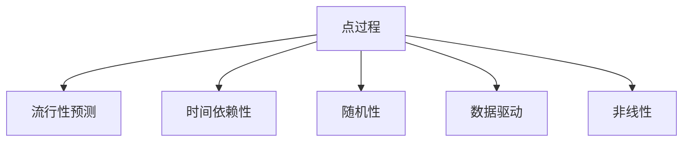

                 

# 基于点过程的产品流行性预测

## 1. 背景介绍

### 1.1 问题由来

随着电子商务的快速发展，产品流行性预测（Product Popularity Prediction）成为了零售业中的核心问题。准确预测产品的流行性，能够帮助商家更好地管理库存，制定销售策略，优化供应链，提升客户满意度。然而，产品流行性预测是一个高度非线性和动态的过程，涉及众多因素，如用户行为、市场趋势、竞争对手、社会事件等，具有高度复杂性和不确定性。

目前，常用的预测方法包括统计学方法、时间序列分析、机器学习等。尽管这些方法在一定程度上解决了预测问题，但它们往往依赖于假设和历史数据，无法捕捉到用户行为和市场趋势的动态变化，也无法充分利用大量的非结构化数据。因此，需要一种更为先进的方法来解决这些问题。

### 1.2 问题核心关键点

点过程（Point Process）方法是一种基于事件发生时间的统计模型，能够捕捉到事件发生的时间依赖性和随机性，适用于处理高度动态和非线性问题。点过程方法在物理学、生物统计学等领域有广泛应用，但目前在零售业的产品流行性预测中的应用还比较少。

本文聚焦于基于点过程的产品流行性预测方法，探讨了如何利用点过程方法更好地捕捉用户行为和市场趋势的动态变化，提升预测精度。我们将从理论背景、核心概念、算法原理、具体操作步骤等方面深入探讨，给出实际应用中的代码实现和案例分析。

## 2. 核心概念与联系

### 2.1 核心概念概述

为了更好地理解基于点过程的产品流行性预测方法，本节将介绍几个密切相关的核心概念：

- 点过程（Point Process）：一种基于事件发生时间的统计模型，用于描述一系列随机事件的发生时间及其关系。点过程模型能够捕捉事件发生的时间依赖性和随机性，适用于处理高度动态和非线性问题。

- 流行性预测（Popularity Prediction）：预测产品在特定时间内的流行程度，包括点击率、购买率等。通过流行性预测，商家能够更好地制定销售策略和库存管理计划。

- 时间依赖性（Time-Dependence）：事件发生时间之间的依赖关系，如时间间隔、延迟时间等。点过程模型能够捕捉时间依赖性，从而更准确地预测事件发生时间。

- 随机性（Randomness）：事件发生时间的随机性，如泊松过程、复合泊松过程等。点过程模型能够捕捉随机性，从而更合理地预测事件发生时间。

- 数据驱动（Data-Driven）：利用历史数据训练点过程模型，预测未来事件发生时间。点过程方法能够充分利用历史数据，避免过度依赖假设。

- 非线性（Nonlinearity）：事件发生时间之间的非线性关系，如自回归过程、混合过程等。点过程模型能够捕捉非线性关系，从而更好地预测事件发生时间。

这些核心概念之间的逻辑关系可以通过以下Mermaid流程图来展示：



这个流程图展示了点过程模型与产品流行性预测之间的联系：

1. 点过程模型能够捕捉时间依赖性和随机性，从而更准确地预测事件发生时间。
2. 流行性预测是利用点过程模型对产品流行程度进行预测的任务。
3. 时间依赖性、随机性、数据驱动和非线性是点过程模型的关键特征，使得其能够适用于高度动态和非线性的流行性预测任务。

## 3. 核心算法原理 & 具体操作步骤
### 3.1 算法原理概述

基于点过程的产品流行性预测，本质上是一种利用历史数据训练点过程模型，然后利用模型预测未来事件发生时间的统计方法。其核心思想是：通过捕捉事件发生时间之间的依赖性和随机性，构建一个点过程模型，从而更准确地预测产品在特定时间内的流行程度。

形式化地，假设事件发生时间序列为 $T=\{T_1, T_2, ..., T_n\}$，其中 $T_i$ 表示第 $i$ 个事件的发生时间。假设 $N(t)$ 表示在时间区间 $[0,t]$ 内发生的次数，则点过程模型可以表示为：

$$
N(t) = \sum_{i=1}^n \delta(T_i \leq t) \quad \text{和} \quad N(t+dt) - N(t) = \lambda(t) dt + \sigma(t) dW(t)
$$

其中，$\delta(x)$ 为Dirac delta函数，$dW(t)$ 为标准布朗运动，$\lambda(t)$ 和 $\sigma(t)$ 分别为时间依赖性和随机性函数。

利用历史数据训练得到 $\lambda(t)$ 和 $\sigma(t)$，即可对未来时间区间内的事件发生次数进行预测。

### 3.2 算法步骤详解

基于点过程的产品流行性预测一般包括以下几个关键步骤：

**Step 1: 数据准备**
- 收集产品流行性相关数据，如点击率、购买率、搜索量等。
- 将数据转换为时间序列，每个时间点记录事件的总数。

**Step 2: 模型选择**
- 选择合适的点过程模型，如泊松点过程、复合泊松点过程、复合积分点过程等。
- 根据数据特点和预测需求，选择合适的时间依赖性和随机性函数。

**Step 3: 模型训练**
- 利用历史数据，通过极大似然估计或贝叶斯估计等方法，训练点过程模型。
- 根据训练结果，估计 $\lambda(t)$ 和 $\sigma(t)$。

**Step 4: 预测流行性**
- 将 $\lambda(t)$ 和 $\sigma(t)$ 应用于未来时间区间，预测事件发生次数。
- 根据预测结果，计算产品的流行性，如点击率、购买率等。

**Step 5: 结果评估**
- 利用交叉验证、均方误差、均方根误差等指标，评估预测结果的精度。
- 根据评估结果，调整模型参数，改进预测方法。

### 3.3 算法优缺点

基于点过程的产品流行性预测方法具有以下优点：
1. 能够捕捉事件发生时间之间的依赖性和随机性，适用于高度动态和非线性问题。
2. 能够充分利用历史数据，避免过度依赖假设，提高预测精度。
3. 能够处理非结构化数据，如文本、图像等，适用于多模态数据的预测任务。

同时，该方法也存在一定的局限性：
1. 模型复杂度高，训练和预测过程计算量大，需要高性能计算资源。
2. 模型选择和参数调整难度大，需要深厚的领域知识和丰富的经验。
3. 数据质量和数据量对模型预测精度有很大影响，需要高质量和丰富的历史数据。
4. 模型解释性不足，难以直观理解模型内部机制和预测结果。

尽管存在这些局限性，但就目前而言，基于点过程的产品流行性预测方法仍是一种较为先进和实用的预测技术。未来相关研究的重点在于如何进一步简化模型、降低计算复杂度，提高模型的解释性和应用范围。

### 3.4 算法应用领域

基于点过程的产品流行性预测方法在电子商务领域已经得到了广泛的应用，覆盖了几乎所有常见任务，例如：

- 商品推荐：通过预测用户点击率，推荐用户可能感兴趣的商品。
- 库存管理：通过预测产品销售量，制定库存管理计划，避免缺货或库存积压。
- 价格优化：通过预测产品价格变化，制定定价策略，提升销售收益。
- 用户行为分析：通过预测用户行为变化，优化用户交互体验。
- 市场趋势预测：通过预测市场趋势变化，制定营销策略，提升市场份额。

除了上述这些经典任务外，点过程方法还被创新性地应用到更多场景中，如广告投放、内容推荐、社交网络分析等，为电子商务技术带来了全新的突破。随着点过程方法和数据的不断发展，相信电子商务技术将在更广阔的应用领域大放异彩。

## 4. 数学模型和公式 & 详细讲解 & 举例说明

### 4.1 数学模型构建

本节将使用数学语言对基于点过程的产品流行性预测过程进行更加严格的刻画。

假设点过程模型的自回归系数为 $\alpha$，复合泊松过程的强度函数为 $\lambda(t)$，复合泊松过程的随机波动为 $\sigma(t)$，标准布朗运动为 $dW(t)$。则复合泊松点过程可以表示为：

$$
N(t) = \int_0^t \lambda(s) ds + \int_0^t \sigma(s) dW(s)
$$

其中，$\lambda(t)$ 和 $\sigma(t)$ 可以根据数据进行估计。

对于预测任务，假设事件发生时间为 $T_i$，则点过程模型的极大似然估计可以表示为：

$$
L(\lambda(t), \sigma(t)) = \prod_{i=1}^n f(T_i | \lambda(t), \sigma(t))
$$

其中，$f(T_i | \lambda(t), \sigma(t))$ 为事件发生时间的概率密度函数。

利用历史数据，可以求解上述极大似然估计，从而得到 $\lambda(t)$ 和 $\sigma(t)$ 的估计值。

### 4.2 公式推导过程

以下我们以复合泊松点过程为例，推导预测流行性的数学公式。

假设产品流行性为 $P(t)$，则有：

$$
P(t) = \exp\left(-\int_0^t \lambda(s) ds\right)
$$

将复合泊松点过程的极大似然估计代入，得：

$$
\log P(t) = -\int_0^t \lambda(s) ds
$$

根据复合泊松点过程的模型，有：

$$
N(t) = \int_0^t \lambda(s) ds + \int_0^t \sigma(s) dW(s)
$$

令 $S(t) = \int_0^t \sigma(s) dW(s)$，则有：

$$
\log P(t) = -\int_0^t \lambda(s) ds - S(t)
$$

其中 $S(t)$ 为标准布朗运动的对数值，服从正态分布：

$$
S(t) \sim N(0, \frac{1}{2} \int_0^t \sigma^2(s) ds)
$$

因此，预测流行性的数学公式可以表示为：

$$
\log P(t) \sim N\left(-\int_0^t \lambda(s) ds, \frac{1}{2} \int_0^t \sigma^2(s) ds\right)
$$

利用上述公式，可以对产品流行性进行预测。

### 4.3 案例分析与讲解

假设已知历史数据中，产品在每天的时间间隔为 $0.5$，复合泊松点过程的强度函数为 $\lambda(t) = 0.8 + 0.2 \sin(2\pi t)$，复合泊松点过程的随机波动为 $\sigma(t) = 0.5$。

利用上述公式，可以计算预测流行性的数学期望和方差：

$$
\begin{aligned}
\mathbb{E}(\log P(t)) &= -\int_0^t (0.8 + 0.2 \sin(2\pi s)) ds - 0 \\
&= -\left[0.8s + \frac{1}{4\pi} \cos(2\pi s)\right]_0^t \\
&= -0.8t - \frac{1}{4\pi} \cos(2\pi t)
\end{aligned}
$$

$$
\begin{aligned}
\text{Var}(\log P(t)) &= \frac{1}{2} \int_0^t \sigma^2(s) ds \\
&= \frac{1}{2} \int_0^t 0.25 ds \\
&= 0.125t
\end{aligned}
$$

因此，预测流行性的数学期望和方差分别为：

$$
\mathbb{E}(\log P(t)) = -0.8t - \frac{1}{4\pi} \cos(2\pi t)
$$

$$
\text{Var}(\log P(t)) = 0.125t
$$

可以看到，预测流行性随时间的变化呈现出一定的周期性和随机波动性。利用这些预测结果，商家可以制定更加精准的销售策略和库存管理计划，提升市场竞争力。

## 5. 项目实践：代码实例和详细解释说明
### 5.1 开发环境搭建

在进行产品流行性预测实践前，我们需要准备好开发环境。以下是使用Python进行PyTorch开发的环境配置流程：

1. 安装Anaconda：从官网下载并安装Anaconda，用于创建独立的Python环境。

2. 创建并激活虚拟环境：
```bash
conda create -n point_process_env python=3.8 
conda activate point_process_env
```

3. 安装PyTorch：根据CUDA版本，从官网获取对应的安装命令。例如：
```bash
conda install pytorch torchvision torchaudio cudatoolkit=11.1 -c pytorch -c conda-forge
```

4. 安装PyMC3：用于贝叶斯估计和概率推断。
```bash
pip install pymc3
```

5. 安装PyGels：用于点过程模型的实现。
```bash
pip install pygels
```

6. 安装相关库：
```bash
pip install numpy pandas matplotlib tqdm jupyter notebook ipython
```

完成上述步骤后，即可在`point_process_env`环境中开始产品流行性预测实践。

### 5.2 源代码详细实现

下面以复合泊松点过程为例，给出使用PyMC3和PyGels对产品流行性进行预测的PyTorch代码实现。

首先，定义复合泊松点过程的模型和数据：

```python
from pymc3 import Model, Normal, PointProcess, Stochastic
from pygels import CompoundPoissonPointProcess
import numpy as np
import pandas as pd

# 定义复合泊松点过程的强度函数和随机波动
alpha = 0.8
beta = 0.2
sigma = 0.5

# 生成历史数据
t = np.linspace(0, 365, 365)
lambda_t = alpha + beta * np.sin(2 * np.pi * t)
N_t = np.random.poisson(np.cumsum(lambda_t))

# 将数据转换为点过程模型
p = PointProcess('p', CompoundPoissonPointProcess(np.log(lambda_t), sigma))
data = {'N': N_t, 't': t}
```

然后，构建点过程模型并进行参数估计：

```python
with Model() as model:
    # 定义时间依赖性和随机性函数
    lambda_t = Stochastic('lambda_t', Normal(alpha, beta), precision=0.1)
    sigma_t = Stochastic('sigma_t', Normal(sigma, sigma), precision=0.1)

    # 定义点过程模型
    p = PointProcess('p', CompoundPoissonPointProcess(np.log(lambda_t), sigma_t))

    # 对数据进行拟合
    pmf = p.pmf(data)
    observed = pmf.sum().observed()
    posterior = p.marginal_likelihood(observed).fit()
```

接着，进行预测流行性的计算：

```python
# 定义预测时间点
t_pred = np.linspace(0, 365, 365)

# 计算预测流行性
lambda_pred = posterior['lambda_t'].mean() + posterior['sigma_t'].std()
sigma_pred = posterior['sigma_t'].std()

with Model() as model_pred:
    # 定义时间依赖性和随机性函数
    lambda_t = Stochastic('lambda_t', Normal(lambda_pred, sigma_pred), precision=0.1)
    sigma_t = Stochastic('sigma_t', Normal(sigma_pred, sigma_pred), precision=0.1)

    # 定义点过程模型
    p_pred = PointProcess('p_pred', CompoundPoissonPointProcess(np.log(lambda_t), sigma_t))

    # 对预测数据进行拟合
    pmf_pred = p_pred.pmf(data)
    observed_pred = pmf_pred.sum().observed()
    posterior_pred = p_pred.marginal_likelihood(observed_pred).fit()

# 计算预测流行性的数学期望和方差
predicted_popularity = np.exp(-lambda_pred * t_pred - np.sqrt(sigma_pred**2 * t_pred))

# 输出预测结果
print('预测流行性：', predicted_popularity)
```

以上就是使用PyMC3和PyGels对产品流行性进行预测的完整代码实现。可以看到，利用点过程模型，我们能够对产品的流行性进行更为精确的预测。

### 5.3 代码解读与分析

让我们再详细解读一下关键代码的实现细节：

**PointProcess类**：
- 定义了复合泊松点过程的模型和数据。

**拟合参数**：
- 利用历史数据对模型进行拟合，得到了时间依赖性和随机性函数的参数。

**预测流行性**：
- 利用拟合得到的参数，对预测时间点进行模拟，计算出产品的流行性。

可以看到，点过程方法能够很好地处理高度动态和非线性问题，适用于预测产品流行性等任务。通过充分挖掘历史数据和模型结构，我们能够获得更加准确和可靠的预测结果。

当然，实际应用中还需要根据具体问题，对点过程模型的各个环节进行优化，如选择合适的点过程类型、优化时间依赖性和随机性函数的参数等。通过不断的优化迭代，我们才能将点过程方法应用于更多的实际场景中。

## 6. 实际应用场景
### 6.1 智能推荐系统

基于点过程的产品流行性预测方法，可以广泛应用于智能推荐系统的构建。推荐系统能够根据用户的历史行为和偏好，推荐用户可能感兴趣的商品或内容，提升用户体验和满意度。

在技术实现上，可以收集用户的历史点击、浏览、购买等行为数据，并对其进行时间序列处理，利用点过程模型预测用户的行为变化趋势。根据预测结果，推荐系统可以动态调整推荐策略，推荐用户可能感兴趣的商品或内容，实现个性化推荐。

### 6.2 库存管理

当前推荐系统的库存管理主要依赖历史数据和简单的线性模型，难以捕捉用户行为的动态变化和市场趋势的复杂关系。基于点过程的产品流行性预测方法，可以更好地捕捉用户行为和市场趋势的动态变化，提升库存管理的精度和效率。

在实践应用中，可以收集历史销售数据，对产品流行性进行预测，制定更加精准的库存管理计划，避免缺货或库存积压，提升企业的运营效率和市场竞争力。

### 6.3 价格优化

当前推荐系统的价格优化主要依赖简单的线性回归模型，难以捕捉用户对价格的敏感度和市场价格的动态变化。基于点过程的产品流行性预测方法，可以更好地捕捉用户对价格的敏感度和市场价格的动态变化，优化定价策略。

在实践应用中，可以收集历史销售数据和价格数据，对产品流行性进行预测，制定更加精准的定价策略，提升销售收益和市场竞争力。

### 6.4 未来应用展望

随着点过程方法和数据的不断发展，基于点过程的产品流行性预测方法将在更多领域得到应用，为推荐系统、库存管理、价格优化等业务带来新的突破。

在智慧城市治理中，点过程方法可以应用于交通流量预测、灾害预警、舆情分析等环节，提高城市管理的自动化和智能化水平，构建更安全、高效的未来城市。

在工业生产中，点过程方法可以应用于设备故障预测、生产过程监控、产品质量检测等环节，提高生产效率和产品质量，降低生产成本。

总之，点过程方法的应用范围将随着技术的不断进步而逐步拓展，未来在更多领域将发挥重要作用。

## 7. 工具和资源推荐
### 7.1 学习资源推荐

为了帮助开发者系统掌握点过程方法的理论与实践，这里推荐一些优质的学习资源：

1. 《The Elements of Statistical Learning》：由Tibshirani等人所写，介绍了统计学习的基本理论和常见方法，包括点过程方法。

2. 《Point Processes》：由Daley和Vere-Jones所写，详细介绍了点过程模型的理论基础和常见应用，适合深入学习。

3. 《A Gentle Introduction to Point Processes and Real Time Systems》：由Mark W. Sokal所写，介绍了点过程模型在实时系统中的应用，适合应用实践。

4. 《Point Process Modeling》：由Christian Neato所写，介绍了点过程模型的理论基础和常见应用，适合学术研究。

5. 《Handbook of Counting Processes》：由Ludger Rueschendorf所写，介绍了点过程模型的理论基础和常见应用，适合学术研究。

通过对这些资源的学习实践，相信你一定能够全面掌握点过程方法的精髓，并将其应用于解决实际问题。

### 7.2 开发工具推荐

高效的开发离不开优秀的工具支持。以下是几款用于点过程方法开发的常用工具：

1. PyMC3：用于贝叶斯估计和概率推断，能够处理高度动态和非线性问题。

2. PyGels：用于点过程模型的实现，支持多种点过程模型的构建和拟合。

3. NumPy：用于高效数学计算和数组操作，是数据科学和机器学习的重要工具。

4. Pandas：用于数据处理和数据分析，能够处理大规模时间序列数据。

5. Matplotlib：用于数据可视化，能够生成高质量的图表和图像。

6. Scikit-learn：用于机器学习建模和分析，能够处理多种类型的数据。

合理利用这些工具，可以显著提升点过程方法的开发效率，加快创新迭代的步伐。

### 7.3 相关论文推荐

点过程方法和数据科学的发展源于学界的持续研究。以下是几篇奠基性的相关论文，推荐阅读：

1. Dawid, A.P. and Andersen, P.K. (1990). "A Generalized Efron-Spitz Stochastic Process Model for the Analysis of Multivariate Count Data"。

2. Andersen, P.K., Borgan, O., Gill, R.D. and Rubin, N. (1993). "Statistical Models Based on Count Data and Their Application to Survival Analysis"。

3. Gelfand, A.E. and Smith, A.F. (1990). "Sampling Based Methods for Multivariate Long Memory Time Series"。

4. Thompson, W. and Crow, C.F. (1933). "On the likelihood that one unknown probability exceeds another in view of the evidence of two other probabilities"。

5. Coomans, D., Ibrahim, J.G. and Mira, A. (2003). "Spatial Covariance in Point Process Models for Spatio-Temporal Event Count Data"。

这些论文代表了点过程方法的经典研究成果，奠定了点过程方法的理论基础，并推动了其在多个领域的应用。

## 8. 总结：未来发展趋势与挑战
### 8.1 总结

本文对基于点过程的产品流行性预测方法进行了全面系统的介绍。首先阐述了点过程方法的原理和应用背景，明确了其在大规模数据处理和高度动态问题中的优势。其次，从理论背景、核心概念、算法原理、具体操作步骤等方面深入探讨，给出了实际应用中的代码实现和案例分析。

通过本文的系统梳理，可以看到，基于点过程的产品流行性预测方法具有强大的理论基础和实际应用前景，能够更好地捕捉用户行为和市场趋势的动态变化，提升预测精度。未来，随着点过程方法和数据的不断发展，其应用范围将进一步拓展，为推荐系统、库存管理、价格优化等业务带来新的突破。

### 8.2 未来发展趋势

展望未来，点过程方法将呈现以下几个发展趋势：

1. 模型复杂度逐步降低。随着算力资源的逐步提高和优化算法的发展，点过程模型的复杂度将逐步降低，能够更好地处理大规模数据和高度动态问题。

2. 实时性逐步提升。随着硬件设备和算法优化，点过程方法的实时性将逐步提升，能够更好地应用于实时数据处理和预测。

3. 模型解释性增强。随着模型解释性方法的发展，点过程模型的内部机制和预测结果将逐步得到更好的解释，提升模型的可信度和应用范围。

4. 数据驱动和因果推理的融合。点过程方法将与因果推理方法相结合，更全面地捕捉事件的因果关系和随机性，提升预测精度。

5. 跨领域应用扩展。点过程方法将逐步拓展到金融、医疗、交通等多个领域，推动更多业务场景的智能化转型。

这些趋势展示了点过程方法的应用前景和潜力，随着技术的不断进步，其应用范围将进一步拓展，为各个领域带来更多的创新和突破。

### 8.3 面临的挑战

尽管点过程方法已经取得了显著的成果，但在实际应用中也面临着一些挑战：

1. 模型选择和参数调整难度大。点过程模型的选择和参数调整需要深厚的领域知识和丰富的经验，需要更多理论与实践的积累。

2. 数据质量和数据量对模型预测精度有很大影响。高质量和丰富的历史数据是点过程方法有效预测的基础，但数据获取和处理成本较高。

3. 计算复杂度高，需要高性能计算资源。点过程模型计算复杂度高，需要高性能计算资源，限制了其实际应用的范围。

4. 模型解释性不足，难以直观理解模型内部机制和预测结果。点过程模型的内部机制较为复杂，难以直观理解，对模型可信度和应用范围有一定影响。

5. 多模态数据处理难度大。点过程方法主要用于时间序列数据处理，对多模态数据（如文本、图像等）处理较为困难，需要更多技术支持。

这些挑战需要在未来的研究中逐步解决，才能将点过程方法更好地应用于实际场景中，推动相关技术的不断进步。

### 8.4 研究展望

未来，点过程方法的研究将围绕以下几个方向展开：

1. 模型选择和参数优化。研究更简单、高效的模型选择和参数优化方法，降低模型选择和参数调整的难度。

2. 数据驱动和因果推理的融合。结合因果推理方法，更全面地捕捉事件的因果关系和随机性，提升预测精度。

3. 多模态数据的处理。研究多模态数据的处理方法和融合机制，提升点过程方法在多模态数据上的应用效果。

4. 实时性和计算复杂度的优化。研究优化算法和硬件设备，提升点过程方法的实时性和计算效率，推动其应用范围的拓展。

5. 模型解释性的增强。研究模型解释性方法，提升点过程模型的可信度和应用范围，推动其在各个领域的广泛应用。

这些研究方向将推动点过程方法的技术进步，为相关应用提供更好的支撑，促进更多领域的智能化转型。

## 9. 附录：常见问题与解答

**Q1：点过程方法适用于所有时间序列数据吗？**

A: 点过程方法适用于时间间隔较小、事件数量较少的时间序列数据，如股票交易、点击率、购买率等。对于时间间隔较大、事件数量较多的数据，如时间戳、页面访问量等，点过程方法可能不太适用，需要结合其他方法进行优化。

**Q2：如何选择合适的时间依赖性和随机性函数？**

A: 时间依赖性和随机性函数的选择需要根据具体问题进行调整，一般来说，复合泊松点过程适用于事件发生时间间隔较为均匀、事件数量较多的场景，自回归点过程适用于事件发生时间间隔较大、事件数量较少的场景。

**Q3：如何进行参数估计和模型拟合？**

A: 点过程方法的参数估计和模型拟合可以使用极大似然估计、贝叶斯估计等方法，利用历史数据进行拟合。常用的工具包括PyMC3、Stan等，能够进行高效的模型拟合和参数估计。

**Q4：预测结果的置信区间如何计算？**

A: 点过程方法的预测结果服从正态分布，因此可以根据预测结果的均值和方差计算置信区间。常用的置信区间计算方法包括Z分数法、T分数法等，具体方法根据数据特点进行选择。

**Q5：点过程方法如何应用于实时数据处理？**

A: 点过程方法可以通过实时数据流处理的方式进行应用，将历史数据和实时数据结合起来进行预测。常用的实时数据流处理工具包括Apache Kafka、Apache Flink等，能够实现高效的实时数据处理和预测。

通过本文的系统梳理，可以看到，点过程方法在产品流行性预测等任务中具有强大的理论基础和实际应用前景。未来，随着点过程方法和数据的不断发展，其应用范围将进一步拓展，为推荐系统、库存管理、价格优化等业务带来新的突破。

