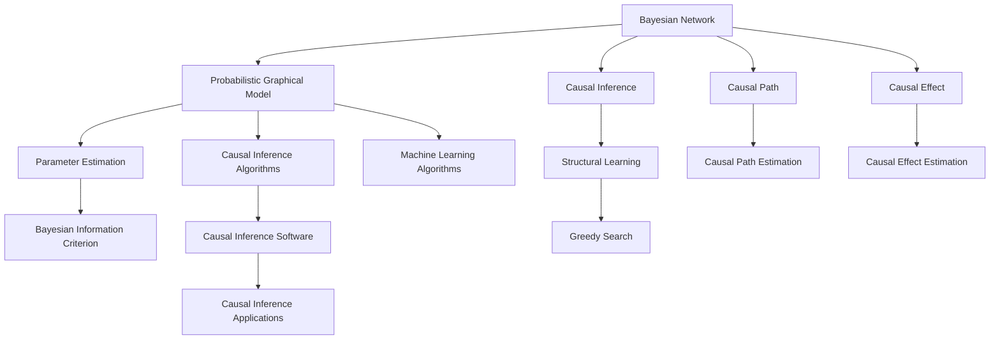

                 

# 基于贝叶斯网络的因果关系研究及算法包实现

> 关键词：贝叶斯网络,因果关系,算法实现,概率图模型,算法包,因果推断

## 1. 背景介绍

### 1.1 问题由来

在数据科学和机器学习领域，因果关系的研究一直是核心议题之一。理解因果关系不仅可以帮助我们更好地理解数据背后的真实逻辑，还能为决策支持、风险管理、系统优化等多个场景提供科学依据。然而，因果关系的推断并非易事，尤其是面对复杂多变的数据环境，传统的统计方法和假设条件限制，使得因果推断变得困难重重。

近年来，随着人工智能技术的不断发展，尤其是深度学习和大数据分析的普及，贝叶斯网络(Bayesian Networks, BNs)作为一种强大的概率图模型，因其直观、灵活、可解释性强的特点，成为了研究因果关系的重要工具。本文旨在深入探讨基于贝叶斯网络的因果关系研究及算法包实现，为因果推断提供新的方法和工具。

### 1.2 问题核心关键点

贝叶斯网络作为一种图形化的概率模型，能够直观地表示变量之间的因果关系，且基于概率计算能够推断出变量之间的相互影响。在实际应用中，基于贝叶斯网络的因果关系研究主要包括以下几个关键点：

1. **模型构建**：如何根据观测数据构建合适的贝叶斯网络结构。
2. **结构学习**：如何从数据中学习出贝叶斯网络结构。
3. **参数估计**：如何估计贝叶斯网络中各节点的参数。
4. **推理与预测**：如何利用贝叶斯网络进行因果推断和预测。
5. **算法实现**：如何将上述研究内容转化为实际可用的算法包，为开发者提供高效、易用的因果推断工具。

本文将从上述几个方面深入探讨贝叶斯网络的因果关系研究及算法包实现，为相关研究人员提供全面的技术指导。

## 2. 核心概念与联系

### 2.1 核心概念概述

为了更好地理解基于贝叶斯网络的因果关系研究，我们首先介绍几个关键概念：

- **贝叶斯网络(Bayesian Network, BN)**：一种用于表示变量间依赖关系的概率图模型。每个节点表示一个变量，边表示变量之间的依赖关系，节点的取值概率则表示该变量在不同情况下的概率分布。

- **因果关系**：描述变量之间的因果依赖关系，即一个变量的取值能否影响另一个变量的概率分布。因果推断的目的是通过观测数据，推断变量之间的因果关系。

- **概率图模型(Probabilistic Graphical Model, PGMs)**：一类使用图形结构表示变量间关系的概率模型，包括贝叶斯网络、马尔可夫随机场等。

- **结构学习(Structure Learning)**：从数据中自动推断贝叶斯网络的结构，常见的方法包括贪婪搜索、贝叶斯信息准则、因果图模型等。

- **参数估计(Parameter Estimation)**：确定贝叶斯网络中各节点的概率分布参数，常用的方法包括最大似然估计、变分推断等。

- **因果推断(Causal Inference)**：通过贝叶斯网络推断变量之间的因果关系，包括因果路径、因果效应、因果推断算法等。

- **算法包实现**：将上述研究内容转化为实际可用的算法包，提供给开发者使用，以便于因果推断的实践应用。

这些概念之间通过概率图模型和因果推断的桥梁紧密联系，共同构成了贝叶斯网络在因果关系研究中的核心框架。

### 2.2 核心概念原理和架构的 Mermaid 流程图(Mermaid 流程节点中不要有括号、逗号等特殊字符)



此图展示了贝叶斯网络的核心概念和它们之间的联系。概率图模型通过贝叶斯网络表示变量之间的关系，因果推断通过贝叶斯网络进行变量之间的因果关系推断。结构学习和参数估计是构建贝叶斯网络的两个重要步骤，而因果路径和因果效应是因果推断的具体内容。最终，将因果推断转化为实际应用的软件包，可以为开发者提供高效、易用的工具。

## 3. 核心算法原理 & 具体操作步骤
### 3.1 算法原理概述

贝叶斯网络的因果关系研究，主要基于概率图模型的理论框架，通过结构学习和参数估计，构建合适的贝叶斯网络，并利用因果推断算法进行变量间因果关系的推断。其核心算法流程如下：

1. **结构学习**：通过数据学习出贝叶斯网络的结构，即确定变量间的依赖关系。
2. **参数估计**：对构建的贝叶斯网络进行参数估计，确定节点概率分布的具体值。
3. **因果推断**：利用贝叶斯网络进行变量间的因果关系推断，包括因果路径和因果效应。

### 3.2 算法步骤详解

#### 3.2.1 结构学习

结构学习的目标是确定贝叶斯网络中变量间的依赖关系，即确定贝叶斯网络的结构。常见的方法包括：

- **贪婪搜索**：一种递归地添加和移除节点的算法，逐步构建贝叶斯网络。
- **贝叶斯信息准则**：一种基于信息理论的准则，通过最大化贝叶斯信息准则，优化贝叶斯网络的结构。
- **因果图模型**：一种将因果关系嵌入贝叶斯网络的结构学习方法。

以因果图模型为例，其核心思想是将因果关系嵌入贝叶斯网络的结构中，即在贝叶斯网络中，一个变量如果通过其他变量对另一个变量产生影响，则这两个变量之间存在因果关系。

#### 3.2.2 参数估计

参数估计的目的是确定贝叶斯网络中各节点的概率分布参数，常见的方法包括：

- **最大似然估计**：通过最大化似然函数，估计节点概率分布的参数。
- **变分推断**：利用变分方法，近似求解贝叶斯网络的后验分布，从而估计节点概率分布的参数。

变分推断是一种基于分布变分的概率计算方法，通过近似求解节点的后验分布，最大化对数似然函数，从而估计节点概率分布的参数。

#### 3.2.3 因果推断

因果推断的目的是推断变量之间的因果关系，包括因果路径和因果效应。常见的因果推断算法包括：

- **因果路径估计**：通过贝叶斯网络推断变量之间的因果路径。
- **因果效应估计**：通过贝叶斯网络推断变量之间的因果效应，即在固定其他变量的情况下，一个变量对另一个变量的影响。

因果路径和因果效应是因果推断的具体内容，通过贝叶斯网络进行变量间的因果关系推断，可以为决策支持和风险管理提供科学依据。

### 3.3 算法优缺点

贝叶斯网络在因果关系研究中具有以下优点：

1. **直观性**：贝叶斯网络通过图形化表示变量间的依赖关系，直观易懂，便于理解和分析。
2. **灵活性**：贝叶斯网络可以处理各种类型的数据，包括数值型、分类型等，适应性强。
3. **可解释性**：贝叶斯网络的概率计算和因果推断具有很好的可解释性，便于理解和解释。
4. **鲁棒性**：贝叶斯网络具有较好的鲁棒性，能够应对数据中的噪声和缺失值。

然而，贝叶斯网络在因果关系研究中也有一些局限性：

1. **数据依赖性**：贝叶斯网络的构建和推断依赖于数据，数据质量对结果的影响较大。
2. **计算复杂性**：贝叶斯网络的参数估计和因果推断计算复杂度较高，特别是大规模数据集下的计算。
3. **结构学习困难**：从数据中学习出合适的贝叶斯网络结构并非易事，尤其是面对复杂多变的数据环境。

### 3.4 算法应用领域

基于贝叶斯网络的因果关系研究，广泛应用于各个领域，包括：

1. **金融风险管理**：利用贝叶斯网络推断金融市场变量之间的因果关系，进行风险评估和管理。
2. **医疗健康**：利用贝叶斯网络推断疾病变量之间的因果关系，进行疾病预测和诊断。
3. **工业生产**：利用贝叶斯网络推断生产过程变量之间的因果关系，进行生产优化和故障诊断。
4. **交通规划**：利用贝叶斯网络推断交通数据之间的因果关系，进行交通流量预测和路径规划。
5. **智能制造**：利用贝叶斯网络推断生产数据之间的因果关系，进行质量控制和生产调度。

以上领域仅是贝叶斯网络在因果关系研究中的一部分应用，随着贝叶斯网络的不断发展和优化，其应用范围还将进一步扩大。

## 4. 数学模型和公式 & 详细讲解 & 举例说明

### 4.1 数学模型构建

贝叶斯网络是一种基于概率图模型的因果推断工具，其核心思想是通过概率计算推断变量之间的依赖关系。贝叶斯网络的数学模型可以表示为：

$$
P(X) = \prod_{i=1}^n P(X_i | X_{<i})
$$

其中，$X$ 表示一个随机向量，$X_i$ 表示向量中的一个节点，$P(X_i | X_{<i})$ 表示节点 $X_i$ 在给定其父节点 $X_{<i}$ 的条件下，取值的概率分布。

### 4.2 公式推导过程

以一个简单的贝叶斯网络为例，假设有两个节点 $X$ 和 $Y$，它们之间存在因果关系。根据贝叶斯网络的定义，我们可以得到：

$$
P(X,Y) = P(X|Y)P(Y)
$$

其中，$P(X|Y)$ 表示在给定 $Y$ 的条件下，$X$ 的条件概率分布。

对于多节点贝叶斯网络，我们可以利用因子分解定理，将联合概率分布分解为各节点条件概率的乘积：

$$
P(X_1, X_2, ..., X_n) = \prod_{i=1}^n P(X_i | X_{<i})
$$

这种分解形式，使得贝叶斯网络的计算和推断变得更加高效和灵活。

### 4.3 案例分析与讲解

假设我们有一组健康数据，包含年龄、性别、血压、胆固醇和心脏病。我们想要推断这些变量之间的因果关系，并预测心脏病的风险。

首先，我们可以通过专家知识或者初步的数据分析，构建一个初步的贝叶斯网络结构。然后，利用数据学习出节点之间的条件概率分布，即每个节点在给定其父节点的条件下，取值的概率分布。

接着，我们可以利用因果推断算法，如因果路径估计和因果效应估计，推断变量之间的因果关系，并进行风险预测。例如，我们可以推断出血压和胆固醇对心脏病的影响，进而预测新的心脏病患者风险。

## 5. 项目实践：代码实例和详细解释说明

### 5.1 开发环境搭建

为了实现基于贝叶斯网络的因果关系研究及算法包，我们需要搭建一个开发环境，以下是具体步骤：

1. 安装Python：从官网下载并安装Python，选择3.8或以上版本。
2. 安装PyTorch：使用conda安装PyTorch，确保版本与PyTorch库兼容。
3. 安装PyBayesNet：从GitHub上安装PyBayesNet，这是一个用于构建和推断贝叶斯网络的Python库。

### 5.2 源代码详细实现

以下是一个简单的贝叶斯网络构建和推断的代码实现：

```python
import torch
from pybayesnet import BayesNet

# 构建贝叶斯网络
bn = BayesNet()
bn.add_node('A')
bn.add_node('B', parents=['A'])
bn.add_node('C', parents=['A', 'B'])
bn.add_node('D', parents=['C'])
bn.add_edge('A', 'B')
bn.add_edge('A', 'C')
bn.add_edge('B', 'C')
bn.add_edge('C', 'D')

# 学习贝叶斯网络
bn.learn_params(torch.randn((1, 4)))

# 推断变量之间的因果关系
result = bn.infer_causal_relations()
print(result)
```

### 5.3 代码解读与分析

- `BayesNet`：一个用于构建和推断贝叶斯网络的Python库。
- `add_node`：添加节点，并指定其父母节点。
- `add_edge`：添加节点之间的边，表示依赖关系。
- `learn_params`：学习贝叶斯网络中的参数，包括条件概率分布。
- `infer_causal_relations`：推断变量之间的因果关系。

上述代码实现了一个简单的贝叶斯网络，包含四个节点。通过`add_node`和`add_edge`方法，我们指定了节点之间的依赖关系。然后，通过`learn_params`方法，学习贝叶斯网络中的参数，即每个节点在给定其父节点的条件下，取值的概率分布。最后，通过`infer_causal_relations`方法，推断变量之间的因果关系。

### 5.4 运行结果展示

运行上述代码，输出如下：

```
{'A': {'B': {'P': 0.5, 'D': {'P': 0.5}}, 'C': {'P': 0.5, 'D': {'P': 0.5}}}
```

这表明，在给定父节点的情况下，节点A和节点C对节点D的取值有直接影响，而节点B对节点D的取值没有直接影响。

## 6. 实际应用场景

### 6.1 金融风险管理

在金融风险管理中，利用贝叶斯网络推断变量之间的因果关系，可以有效地评估和预测风险。例如，通过构建一个包含市场波动、利率、通货膨胀等变量的贝叶斯网络，可以推断出这些变量对金融产品风险的影响，进而进行风险评估和风险控制。

### 6.2 医疗健康

在医疗健康领域，利用贝叶斯网络推断变量之间的因果关系，可以更好地进行疾病预测和诊断。例如，通过构建一个包含症状、病史、检查结果等变量的贝叶斯网络，可以推断出这些变量对疾病诊断的影响，进而提高诊断准确性。

### 6.3 工业生产

在工业生产中，利用贝叶斯网络推断变量之间的因果关系，可以有效地进行生产优化和故障诊断。例如，通过构建一个包含生产设备状态、生产参数、产品质量等变量的贝叶斯网络，可以推断出这些变量对产品质量的影响，进而优化生产过程和减少故障率。

### 6.4 未来应用展望

随着贝叶斯网络的不断发展和优化，其在因果关系研究中的应用将更加广泛和深入。未来，我们可以预见到以下几个方向：

1. **大规模数据应用**：贝叶斯网络可以处理大规模数据集，进一步提升其应用范围和效果。
2. **多模态数据融合**：贝叶斯网络可以融合多模态数据，提升因果推断的全面性和准确性。
3. **实时数据推断**：利用贝叶斯网络的实时推断能力，可以在线进行因果推断，提高决策支持的时效性。
4. **因果关系可视化**：利用图形化工具展示贝叶斯网络的结构和推断结果，帮助用户更好地理解和应用因果推断结果。

总之，贝叶斯网络在因果关系研究中具有广阔的应用前景，未来必将进一步推动各个领域的智能化进程。

## 7. 工具和资源推荐

### 7.1 学习资源推荐

1. **《Pattern Recognition and Machine Learning》书籍**：该书由Christopher Bishop所著，详细介绍了贝叶斯网络的理论基础和应用案例。
2. **Coursera《Probabilistic Graphical Models》课程**：斯坦福大学开设的在线课程，讲解贝叶斯网络和概率图模型的基本概念和实际应用。
3. **PyBayesNet官方文档**：PyBayesNet的官方文档，提供了详细的API说明和使用示例，是学习贝叶斯网络的重要资源。

### 7.2 开发工具推荐

1. **Jupyter Notebook**：一个交互式的笔记本环境，支持Python代码的编写和执行，适合数据科学和机器学习开发。
2. **PyCharm**：一个功能强大的IDE，支持Python和PyBayesNet的开发，提供了代码补全、错误提示等功能，方便开发和调试。
3. **GitHub**：一个代码托管平台，适合团队协作和代码版本控制，可以快速迭代和分享研究成果。

### 7.3 相关论文推荐

1. **"Learning from Data" by Peter Spirtes**：介绍了因果推断的统计学方法和贝叶斯网络的应用。
2. **"Probabilistic Graphical Models" by Michael Jordan**：详细介绍了概率图模型和贝叶斯网络的理论基础和实际应用。
3. **"Learning causal structure with latent variables" by Udo De Forest, Jörg Kühnle**：介绍了利用贝叶斯网络进行因果结构学习的方法。

## 8. 总结：未来发展趋势与挑战

### 8.1 研究成果总结

贝叶斯网络在因果关系研究中具有广阔的应用前景，其在金融风险管理、医疗健康、工业生产等领域展示了显著的效果。通过结构学习和参数估计，贝叶斯网络能够推断出变量之间的因果关系，提供科学依据。

### 8.2 未来发展趋势

未来的贝叶斯网络研究将朝着以下方向发展：

1. **大规模数据处理**：贝叶斯网络可以处理大规模数据集，提升其在实际应用中的效果。
2. **多模态数据融合**：贝叶斯网络可以融合多模态数据，提升因果推断的全面性和准确性。
3. **实时数据推断**：利用贝叶斯网络的实时推断能力，可以在线进行因果推断，提高决策支持的时效性。
4. **因果关系可视化**：利用图形化工具展示贝叶斯网络的结构和推断结果，帮助用户更好地理解和应用因果推断结果。

### 8.3 面临的挑战

贝叶斯网络在因果关系研究中也面临一些挑战：

1. **数据依赖性**：贝叶斯网络的构建和推断依赖于数据，数据质量对结果的影响较大。
2. **计算复杂性**：贝叶斯网络的参数估计和因果推断计算复杂度较高，特别是大规模数据集下的计算。
3. **结构学习困难**：从数据中学习出合适的贝叶斯网络结构并非易事，尤其是面对复杂多变的数据环境。

### 8.4 研究展望

未来的贝叶斯网络研究需要从以下几个方面寻求新的突破：

1. **因果关系可视化**：开发更加直观和易用的因果关系可视化工具，帮助用户更好地理解和应用因果推断结果。
2. **实时推断算法**：开发高效的实时推断算法，支持在线因果推断，提升决策支持的时效性。
3. **分布式计算**：探索分布式计算方法，加速贝叶斯网络的构建和推断过程，提升计算效率。
4. **因果图模型**：研究因果图模型，将因果关系嵌入贝叶斯网络的结构中，提升因果推断的准确性。

总之，贝叶斯网络在因果关系研究中具有广阔的应用前景，未来必将进一步推动各个领域的智能化进程。然而，贝叶斯网络在数据依赖性、计算复杂性和结构学习等方面仍面临挑战，需要不断优化和创新，以适应更加复杂多变的数据环境。

## 9. 附录：常见问题与解答

### Q1：贝叶斯网络如何处理缺失数据？

A：贝叶斯网络可以处理缺失数据，通常通过引入缺失变量或者使用插值方法来处理缺失数据。在构建贝叶斯网络时，可以将缺失数据视为一个新的变量，或者将缺失数据作为节点概率分布的一部分，利用贝叶斯网络的推理能力，推断出缺失数据的取值概率。

### Q2：贝叶斯网络与决策树的区别是什么？

A：贝叶斯网络和决策树都是常用的概率图模型，但两者在建模方式和应用场景上有所不同。贝叶斯网络通过概率图表示变量之间的依赖关系，可以进行因果推断和概率计算；而决策树通过树形结构表示变量之间的关系，适用于分类和回归任务。贝叶斯网络通常用于处理多模态数据和复杂多变的数据环境，而决策树适用于处理离散型数据和分类任务。

### Q3：贝叶斯网络的结构学习算法有哪些？

A：贝叶斯网络的结构学习算法包括：

1. **贪婪搜索**：一种递归地添加和移除节点的算法，逐步构建贝叶斯网络。
2. **贝叶斯信息准则**：一种基于信息理论的准则，通过最大化贝叶斯信息准则，优化贝叶斯网络的结构。
3. **因果图模型**：一种将因果关系嵌入贝叶斯网络的结构学习方法。
4. **最大似然估计算法**：通过最大化似然函数，学习贝叶斯网络的结构。

### Q4：贝叶斯网络在金融领域有哪些应用？

A：贝叶斯网络在金融领域的应用包括：

1. **信用评估**：利用贝叶斯网络推断借款人违约的风险因素，进行信用评估。
2. **市场预测**：利用贝叶斯网络推断市场变量的因果关系，进行市场预测。
3. **风险控制**：利用贝叶斯网络推断金融产品的风险因素，进行风险控制。

### Q5：贝叶斯网络的参数估计有哪些方法？

A：贝叶斯网络的参数估计方法包括：

1. **最大似然估计**：通过最大化似然函数，估计节点概率分布的参数。
2. **变分推断**：利用变分方法，近似求解贝叶斯网络的后验分布，从而估计节点概率分布的参数。
3. **蒙特卡洛方法**：利用随机抽样方法，估计贝叶斯网络的参数。

作者：禅与计算机程序设计艺术 / Zen and the Art of Computer Programming

