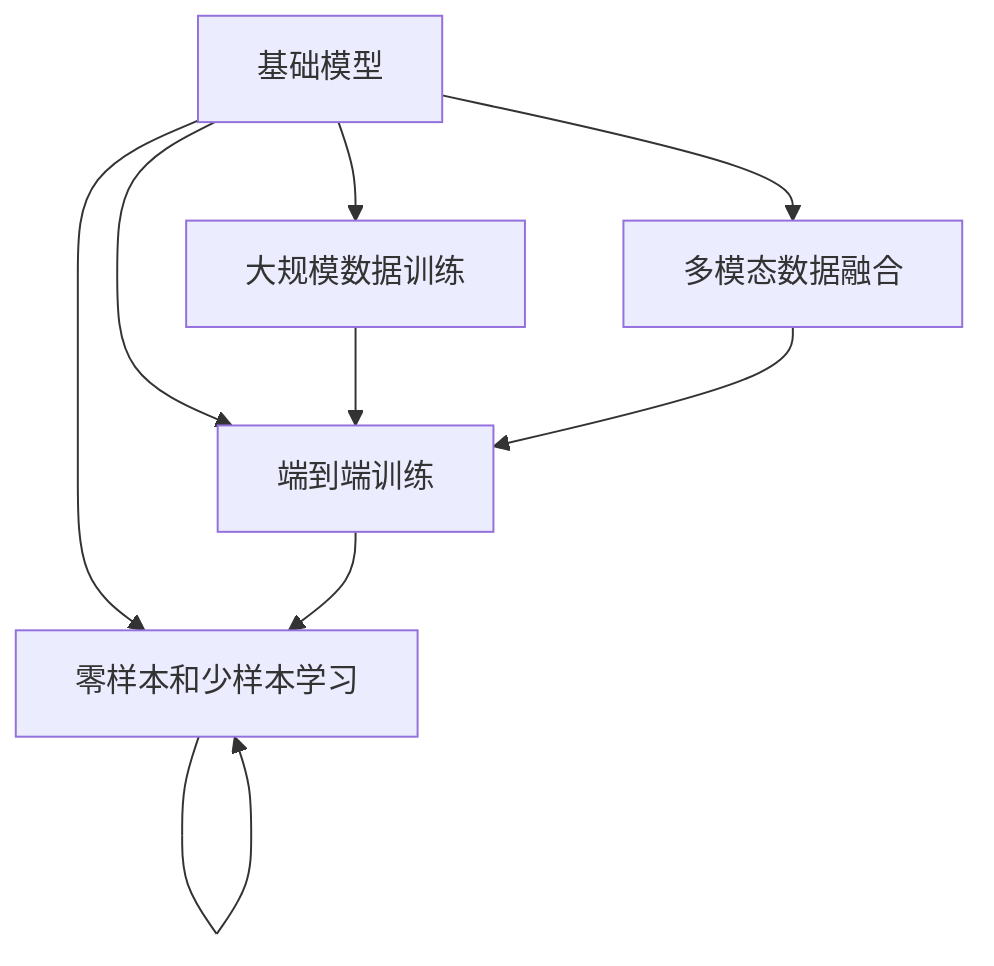

                 

# 基础模型的未来机遇与风险

## 1. 背景介绍

### 1.1 问题由来

近年来，随着深度学习技术的快速发展，基础模型在人工智能领域取得了显著进展。这些模型通过在海量数据上进行训练，具备了强大的数据表达能力。它们不仅在图像识别、语音识别等领域取得了显著成果，也在自然语言处理(NLP)、推荐系统等应用中展现出了巨大潜力。

然而，基础模型的发展也伴随着诸多挑战和风险。模型的过拟合、数据偏见、安全性和隐私保护等问题，不断困扰着研究者和工程师。为了深入理解基础模型的发展机遇和面临的风险，本文将从模型的未来趋势、技术挑战和伦理道德角度进行全面探讨。

### 1.2 问题核心关键点

基础模型具备以下核心特点：

- **大规模数据训练**：依赖于海量的标注和无标注数据进行训练，以获得更广泛的知识和更强的泛化能力。
- **多模态数据融合**：能够处理图像、文本、语音等多种数据类型，实现不同模态之间的联合建模。
- **端到端训练**：从数据预处理、模型训练到输出预测，整个过程均由模型自动完成，无需手工特征工程。
- **零样本和少样本学习**：无需标注数据，仅通过输入文本或简单的提示，就能进行推理和生成。

这些特点使得基础模型在许多领域具有广泛的应用前景，但也带来了诸如模型可解释性不足、数据偏见、隐私保护等问题。如何平衡机遇与风险，成为研究者和工程师面临的重要课题。

## 2. 核心概念与联系

### 2.1 核心概念概述

为了更好地理解基础模型的未来机遇与风险，本文将介绍几个核心概念：

- **基础模型(Foundation Model)**：指通过大规模数据预训练获得广泛知识，具备多模态数据融合、端到端训练等特性的通用模型，如BERT、GPT-3等。
- **模型泛化能力(Generalization)**：指模型在新数据上的表现，是衡量模型好坏的最重要指标之一。
- **数据偏见(Data Bias)**：指模型在训练过程中学习到的数据分布与实际数据分布不符，导致模型输出存在偏见。
- **模型透明性(Transparency)**：指模型的决策过程和内部机制是否易于理解和解释。
- **隐私保护(Privacy)**：指保护数据来源和用户隐私，防止模型被滥用。

这些概念之间存在着紧密的联系，共同构成了基础模型研究的框架。通过理解这些概念，我们可以更好地把握基础模型的工作原理和优化方向。

### 2.2 核心概念原理和架构的 Mermaid 流程图



这个流程图展示了基础模型的核心组成和训练流程：

1. **大规模数据训练**：基础模型通过在海量数据上进行预训练，学习广泛的语义知识。
2. **多模态数据融合**：能够处理和融合多种数据类型，如文本、图像、音频等。
3. **端到端训练**：从数据预处理、模型训练到输出预测，整个过程由模型自动完成。
4. **零样本和少样本学习**：无需标注数据，通过输入文本或简单的提示进行推理和生成。

这些核心概念共同构成了基础模型的核心价值，推动其在各个领域的应用和发展。

## 3. 核心算法原理 & 具体操作步骤

### 3.1 算法原理概述

基础模型的核心算法原理基于深度学习框架，主要包括自监督预训练、多任务学习、迁移学习等技术。自监督预训练通过在大规模无标签数据上进行训练，学习到语言或视觉的基本表示；多任务学习通过同时训练多个相关任务，提高模型的泛化能力；迁移学习通过在大规模数据上预训练模型，然后在特定任务上进行微调，获得高性能模型。

这些技术使得基础模型能够具备强大的知识表达和泛化能力，能够在不同的应用场景中展现出卓越的性能。

### 3.2 算法步骤详解

基础模型的训练步骤主要包括以下几个环节：

**Step 1: 数据预处理**
- 收集大规模无标签和有标签数据，如大规模文本语料库、图像数据集等。
- 对数据进行预处理，如文本分词、图像尺寸调整等。

**Step 2: 模型构建**
- 选择合适的深度学习模型架构，如Transformer、卷积神经网络等。
- 定义模型损失函数，如交叉熵、均方误差等。
- 设置优化算法及其参数，如Adam、SGD等。

**Step 3: 预训练过程**
- 在大规模无标签数据上，进行自监督预训练，学习语言或视觉的基本表示。
- 根据多任务学习框架，同时训练多个相关任务，如语言建模、目标检测等。

**Step 4: 迁移学习**
- 在特定任务上有标签数据集上，进行微调，优化模型在该任务上的性能。
- 选择适当的损失函数和优化器，调整模型参数。

**Step 5: 模型评估和部署**
- 在验证集上评估模型性能，确定最优参数。
- 将模型部署到实际应用中，进行推理预测。

这些步骤构成了基础模型的训练流程，每一环节都至关重要。通过合理的算法设计和参数设置，可以实现高性能的基础模型。

### 3.3 算法优缺点

基础模型的优点在于：

- **泛化能力强**：在处理新数据时，能够表现出优秀的性能。
- **应用广泛**：在图像识别、NLP、推荐系统等多个领域有广泛应用。
- **自动特征提取**：无需手工特征工程，能够自动学习数据特征。

同时，基础模型也存在以下缺点：

- **计算资源需求高**：需要大量的计算资源进行训练。
- **数据偏见**：如果训练数据存在偏见，模型也会继承这些偏见。
- **模型可解释性不足**：模型的决策过程难以解释，难以进行调试。
- **隐私保护风险**：模型可能泄漏用户隐私信息，需要采取保护措施。

尽管存在这些缺点，基础模型的发展前景仍然非常广阔，需要在未来的研究中加以改进和优化。

### 3.4 算法应用领域

基础模型在多个领域已经展现出了显著的应用价值：

- **图像识别**：通过多模态数据融合，实现高效的图像分类和目标检测。
- **自然语言处理**：通过自监督预训练和多任务学习，实现了语言模型的通用表示。
- **推荐系统**：通过联合建模，提高推荐系统的个性化和准确性。
- **智能医疗**：通过多模态数据融合和零样本学习，实现医疗影像的自动分析和诊断。
- **金融分析**：通过端到端训练和多任务学习，实现对复杂金融数据的处理和预测。

这些应用领域展示了基础模型的巨大潜力，推动了人工智能技术的产业化进程。

## 4. 数学模型和公式 & 详细讲解 & 举例说明

### 4.1 数学模型构建

基础模型的数学模型构建通常基于深度学习框架，主要包括自监督预训练、多任务学习、迁移学习等技术。

- **自监督预训练**：通常使用语言建模或掩码语言模型任务，如BERT的预训练过程。数学模型可以表示为：

  $$
  \min_{\theta} \mathcal{L}(\theta, D_{\text{unlabeled}})
  $$

  其中，$\theta$ 为模型参数，$D_{\text{unlabeled}}$ 为无标签数据集，$\mathcal{L}$ 为自监督预训练损失函数。

- **多任务学习**：通过同时训练多个相关任务，如语言建模、目标检测等。数学模型可以表示为：

  $$
  \min_{\theta} \mathcal{L}(\theta, \{D_t\})
  $$

  其中，$\{D_t\}$ 为多个任务的训练数据集，$\mathcal{L}$ 为多任务学习损失函数。

- **迁移学习**：在特定任务上有标签数据集上，进行微调，优化模型在该任务上的性能。数学模型可以表示为：

  $$
  \min_{\theta} \mathcal{L}(\theta, D_{\text{task}})
  $$

  其中，$D_{\text{task}}$ 为特定任务的训练数据集，$\mathcal{L}$ 为迁移学习损失函数。

### 4.2 公式推导过程

以下以BERT的预训练过程为例，推导自监督预训练的损失函数。

BERT的预训练任务包括掩码语言模型和下一句预测。对于掩码语言模型，假设输入序列为 $x = [w_1, w_2, \cdots, w_n]$，其中 $w_i$ 为单词。模型需要对每个单词进行掩码，计算掩盖后的预测概率。假设 $p(x|x^m)$ 为掩盖单词 $x^m$ 的概率分布，则损失函数可以表示为：

$$
\mathcal{L}(x) = -\sum_{m=1}^n \sum_{i=1}^n \log p(x_i|x^m)
$$

其中 $x_i$ 为输入序列中未被掩盖的单词。通过在大量无标签数据上反复迭代上述过程，模型能够学习到单词之间的依赖关系，从而获得较强的语言理解能力。

### 4.3 案例分析与讲解

假设有一个文本分类任务，训练数据集为 $\{(x_i, y_i)\}_{i=1}^N$，其中 $x_i$ 为文本，$y_i$ 为标签。通过迁移学习，我们可以在大规模预训练模型基础上进行微调，得到新的分类器。微调的数学模型可以表示为：

$$
\min_{\theta} \mathcal{L}(\theta, D_{\text{task}})
$$

其中，$D_{\text{task}}$ 为分类任务的训练数据集，$\mathcal{L}$ 为分类任务损失函数，如交叉熵损失。

假设 $M_{\theta}$ 为预训练模型，$f(x)$ 为模型在输入 $x$ 上的预测概率分布。则微调的优化目标为：

$$
\min_{\theta} \mathcal{L}(f(x), y)
$$

其中，$\mathcal{L}(f(x), y)$ 为交叉熵损失函数。

通过在微调过程中调整模型参数 $\theta$，使得模型在特定任务上的预测概率逼近真实标签，从而实现任务适配。

## 5. 项目实践：代码实例和详细解释说明

### 5.1 开发环境搭建

在进行基础模型实践前，我们需要准备好开发环境。以下是使用Python进行PyTorch开发的环境配置流程：

1. 安装Anaconda：从官网下载并安装Anaconda，用于创建独立的Python环境。

2. 创建并激活虚拟环境：
```bash
conda create -n pytorch-env python=3.8 
conda activate pytorch-env
```

3. 安装PyTorch：根据CUDA版本，从官网获取对应的安装命令。例如：
```bash
conda install pytorch torchvision torchaudio cudatoolkit=11.1 -c pytorch -c conda-forge
```

4. 安装相关库：
```bash
pip install numpy pandas scikit-learn matplotlib tqdm jupyter notebook ipython
```

完成上述步骤后，即可在`pytorch-env`环境中开始基础模型实践。

### 5.2 源代码详细实现

这里我们以BERT模型为例，使用PyTorch库进行文本分类的微调实践。

首先，定义文本分类任务的数据处理函数：

```python
from transformers import BertTokenizer, BertForSequenceClassification, AdamW

tokenizer = BertTokenizer.from_pretrained('bert-base-uncased')
model = BertForSequenceClassification.from_pretrained('bert-base-uncased', num_labels=2)

def process_data(data):
    input_ids = tokenizer.encode(data['text'], add_special_tokens=True)
    attention_mask = [1]*len(input_ids)
    return {'input_ids': input_ids, 'attention_mask': attention_mask}

def train_epoch(model, data_loader, optimizer):
    model.train()
    for batch in data_loader:
        input_ids = batch['input_ids'].to(device)
        attention_mask = batch['attention_mask'].to(device)
        labels = batch['labels'].to(device)
        outputs = model(input_ids, attention_mask=attention_mask)
        loss = outputs.loss
        optimizer.zero_grad()
        loss.backward()
        optimizer.step()

def evaluate(model, data_loader):
    model.eval()
    preds, labels = [], []
    for batch in data_loader:
        input_ids = batch['input_ids'].to(device)
        attention_mask = batch['attention_mask'].to(device)
        labels = batch['labels'].to(device)
        outputs = model(input_ids, attention_mask=attention_mask)
        preds.append(outputs.logits.argmax(dim=1).cpu().numpy().tolist())
        labels.append(labels.cpu().numpy().tolist())
    
    print(classification_report(labels, preds))
```

然后，定义训练和评估函数：

```python
from sklearn.metrics import classification_report
from torch.utils.data import DataLoader, Dataset
import torch

device = torch.device('cuda') if torch.cuda.is_available() else torch.device('cpu')

class TextClassificationDataset(Dataset):
    def __init__(self, data):
        self.data = data
        self.tokenizer = BertTokenizer.from_pretrained('bert-base-uncased')
        
    def __len__(self):
        return len(self.data)
    
    def __getitem__(self, index):
        data = self.data[index]
        text = data['text']
        label = data['label']
        input_ids = self.tokenizer(text, add_special_tokens=True)
        attention_mask = [1]*len(input_ids)
        return {'input_ids': input_ids, 'attention_mask': attention_mask, 'label': label}

# 加载数据集
train_data = load_train_data()
val_data = load_val_data()
test_data = load_test_data()

# 定义数据处理函数
process_func = process_data

# 定义优化器
optimizer = AdamW(model.parameters(), lr=2e-5)

# 训练过程
epochs = 5
batch_size = 16

for epoch in range(epochs):
    train_loader = DataLoader(train_data, batch_size=batch_size, shuffle=True, collate_fn=process_func)
    train_epoch(model, train_loader, optimizer)
    
    val_loader = DataLoader(val_data, batch_size=batch_size, shuffle=False, collate_fn=process_func)
    evaluate(model, val_loader)

# 测试过程
test_loader = DataLoader(test_data, batch_size=batch_size, shuffle=False, collate_fn=process_func)
evaluate(model, test_loader)
```

以上就是使用PyTorch对BERT进行文本分类任务微调的完整代码实现。可以看到，通过使用Transformers库，我们可以用相对简洁的代码完成BERT模型的加载和微调。

### 5.3 代码解读与分析

让我们再详细解读一下关键代码的实现细节：

**TextClassificationDataset类**：
- `__init__`方法：初始化数据集和分词器。
- `__len__`方法：返回数据集的样本数量。
- `__getitem__`方法：对单个样本进行处理，将文本分词编码为token ids，并进行定长padding。

**process_data函数**：
- 对输入文本进行分词和编码，并生成对应的attention mask。

**训练和评估函数**：
- 使用PyTorch的DataLoader对数据集进行批次化加载，供模型训练和推理使用。
- 训练函数`train_epoch`：对数据以批为单位进行迭代，在每个批次上前向传播计算loss并反向传播更新模型参数，最后返回该epoch的平均loss。
- 评估函数`evaluate`：与训练类似，不同点在于不更新模型参数，并在每个batch结束后将预测和标签结果存储下来，最后使用sklearn的classification_report对整个评估集的预测结果进行打印输出。

**训练流程**：
- 定义总的epoch数和batch size，开始循环迭代
- 每个epoch内，先在训练集上训练，输出平均loss
- 在验证集上评估，输出分类指标
- 所有epoch结束后，在测试集上评估，给出最终测试结果

可以看到，PyTorch配合Transformers库使得BERT微调的代码实现变得简洁高效。开发者可以将更多精力放在数据处理、模型改进等高层逻辑上，而不必过多关注底层的实现细节。

当然，工业级的系统实现还需考虑更多因素，如模型的保存和部署、超参数的自动搜索、更灵活的任务适配层等。但核心的微调范式基本与此类似。

## 6. 实际应用场景

### 6.1 智能客服系统

基础模型在智能客服系统中的应用非常广泛。智能客服能够7x24小时不间断服务，快速响应客户咨询，用自然流畅的语言解答各类常见问题。

在技术实现上，可以收集企业内部的历史客服对话记录，将问题和最佳答复构建成监督数据，在此基础上对基础模型进行微调。微调后的基础模型能够自动理解用户意图，匹配最合适的答案模板进行回复。对于客户提出的新问题，还可以接入检索系统实时搜索相关内容，动态组织生成回答。如此构建的智能客服系统，能大幅提升客户咨询体验和问题解决效率。

### 6.2 金融舆情监测

金融机构需要实时监测市场舆论动向，以便及时应对负面信息传播，规避金融风险。基础模型可以通过微调，自动判断文本属于何种主题，情感倾向是正面、中性还是负面。将基础模型应用到实时抓取的网络文本数据，就能够自动监测不同主题下的情感变化趋势，一旦发现负面信息激增等异常情况，系统便会自动预警，帮助金融机构快速应对潜在风险。

### 6.3 个性化推荐系统

当前的推荐系统往往只依赖用户的历史行为数据进行物品推荐，无法深入理解用户的真实兴趣偏好。基础模型通过微调，可以更好地挖掘用户行为背后的语义信息，从而提供更精准、多样的推荐内容。

在实践中，可以收集用户浏览、点击、评论、分享等行为数据，提取和用户交互的物品标题、描述、标签等文本内容。将文本内容作为模型输入，用户的后续行为（如是否点击、购买等）作为监督信号，在此基础上微调基础模型。微调后的基础模型能够从文本内容中准确把握用户的兴趣点。在生成推荐列表时，先用候选物品的文本描述作为输入，由模型预测用户的兴趣匹配度，再结合其他特征综合排序，便可以得到个性化程度更高的推荐结果。

### 6.4 未来应用展望

随着基础模型的不断发展，其在更多领域的应用前景将更加广阔。

在智慧医疗领域，基础模型可以通过微调，实现对医疗影像的自动分析和诊断。在智能教育领域，基础模型可应用于作业批改、学情分析、知识推荐等方面，因材施教，促进教育公平，提高教学质量。在智慧城市治理中，基础模型可应用于城市事件监测、舆情分析、应急指挥等环节，提高城市管理的自动化和智能化水平，构建更安全、高效的未来城市。

此外，在企业生产、社会治理、文娱传媒等众多领域，基础模型微调技术也将不断涌现，为NLP技术带来新的突破。相信随着预训练语言模型和微调方法的不断进步，基础模型将在更广阔的应用领域大放异彩。

## 7. 工具和资源推荐

### 7.1 学习资源推荐

为了帮助开发者系统掌握基础模型的理论基础和实践技巧，这里推荐一些优质的学习资源：

1. 《深度学习》系列课程：斯坦福大学提供的深度学习基础课程，涵盖机器学习、深度学习、神经网络等核心内容。
2. 《自然语言处理》课程：斯坦福大学提供的自然语言处理课程，涵盖文本分类、信息检索、机器翻译等NLP核心技术。
3. 《Transformer》书籍：Transformer模型的权威指南，由Google和OpenAI的研究人员共同编写，深入浅出地介绍了Transformer模型的原理和实践。
4. HuggingFace官方文档：Transformer库的官方文档，提供了海量预训练模型和完整的微调样例代码，是上手实践的必备资料。
5. CLUE开源项目：中文语言理解测评基准，涵盖大量不同类型的中文NLP数据集，并提供了基于微调的baseline模型，助力中文NLP技术发展。

通过对这些资源的学习实践，相信你一定能够快速掌握基础模型的精髓，并用于解决实际的NLP问题。

### 7.2 开发工具推荐

高效的开发离不开优秀的工具支持。以下是几款用于基础模型微调开发的常用工具：

1. PyTorch：基于Python的开源深度学习框架，灵活动态的计算图，适合快速迭代研究。大部分预训练语言模型都有PyTorch版本的实现。
2. TensorFlow：由Google主导开发的开源深度学习框架，生产部署方便，适合大规模工程应用。同样有丰富的预训练语言模型资源。
3. Transformers库：HuggingFace开发的NLP工具库，集成了众多SOTA语言模型，支持PyTorch和TensorFlow，是进行基础模型微调开发的利器。
4. Weights & Biases：模型训练的实验跟踪工具，可以记录和可视化模型训练过程中的各项指标，方便对比和调优。与主流深度学习框架无缝集成。
5. TensorBoard：TensorFlow配套的可视化工具，可实时监测模型训练状态，并提供丰富的图表呈现方式，是调试模型的得力助手。

合理利用这些工具，可以显著提升基础模型微调任务的开发效率，加快创新迭代的步伐。

### 7.3 相关论文推荐

基础模型和微调技术的发展源于学界的持续研究。以下是几篇奠基性的相关论文，推荐阅读：

1. Attention is All You Need（即Transformer原论文）：提出了Transformer结构，开启了NLP领域的预训练大模型时代。
2. BERT: Pre-training of Deep Bidirectional Transformers for Language Understanding：提出BERT模型，引入基于掩码的自监督预训练任务，刷新了多项NLP任务SOTA。
3. Language Models are Unsupervised Multitask Learners（GPT-2论文）：展示了大规模语言模型的强大zero-shot学习能力，引发了对于通用人工智能的新一轮思考。
4. Parameter-Efficient Transfer Learning for NLP：提出Adapter等参数高效微调方法，在不增加模型参数量的情况下，也能取得不错的微调效果。
5. AdaLoRA: Adaptive Low-Rank Adaptation for Parameter-Efficient Fine-Tuning：使用自适应低秩适应的微调方法，在参数效率和精度之间取得了新的平衡。
6. Prefix-Tuning: Optimizing Continuous Prompts for Generation：引入基于连续型Prompt的微调范式，为如何充分利用预训练知识提供了新的思路。

这些论文代表了大语言模型微调技术的发展脉络。通过学习这些前沿成果，可以帮助研究者把握学科前进方向，激发更多的创新灵感。

## 8. 总结：未来发展趋势与挑战

### 8.1 总结

本文对基础模型的未来机遇与风险进行了全面系统的介绍。首先阐述了基础模型的研究背景和机遇，明确了其在NLP、推荐系统、智能客服等领域的应用价值。其次，从原理到实践，详细讲解了基础模型的数学模型构建和关键步骤，给出了微调任务开发的完整代码实例。同时，本文还广泛探讨了基础模型在实际应用中的前景，展示了其在多个领域的巨大潜力。此外，本文精选了微调技术的各类学习资源，力求为读者提供全方位的技术指引。

通过本文的系统梳理，可以看到，基础模型在各个领域的应用前景非常广阔，推动了人工智能技术的产业化进程。但同时，基础模型也面临诸多挑战，如数据偏见、模型透明性不足、隐私保护等，需要通过多方面的努力才能实现其应用价值的最大化。

### 8.2 未来发展趋势

展望未来，基础模型的发展趋势将主要集中在以下几个方面：

1. **模型规模继续增大**：随着算力成本的下降和数据规模的扩张，基础模型的参数量还将持续增长，进一步提升模型的泛化能力。
2. **多模态融合加强**：基础模型将进一步增强对图像、视频、音频等多种数据类型的处理能力，实现多模态信息的联合建模。
3. **端到端训练优化**：基础模型的训练过程将更加注重模型结构的优化，如剪枝、量化等技术，提高推理速度和计算效率。
4. **知识图谱融合**：基础模型将更好地与知识图谱结合，提升模型的推理能力和语义理解能力。
5. **动态知识更新**：基础模型将具备动态更新知识的能力，通过在线学习不断更新知识库，提高模型的时效性和适应性。

这些趋势凸显了基础模型的巨大潜力，推动其在更广泛的领域中发挥更大的作用。

### 8.3 面临的挑战

尽管基础模型具备广泛的应用前景，但仍然面临诸多挑战：

1. **数据偏见**：基础模型在训练过程中可能学习到数据中的偏见，导致输出结果存在偏差。
2. **透明性不足**：基础模型的决策过程难以解释，难以进行调试和优化。
3. **隐私保护**：基础模型可能泄漏用户隐私信息，需要采取保护措施。
4. **计算资源需求高**：基础模型需要大量的计算资源进行训练，如何提高训练效率和降低资源消耗，是一个重要的研究方向。
5. **知识整合能力不足**：基础模型通常只局限于特定的领域知识，难以灵活吸收和运用更广泛的先验知识。

这些挑战需要在未来的研究中加以克服，以实现基础模型的广泛应用和普及。

### 8.4 研究展望

未来的基础模型研究需要在以下几个方面进行突破：

1. **数据多样化**：收集更多类型和来源的数据，提升模型的泛化能力和鲁棒性。
2. **模型透明性增强**：开发更多的可解释性技术，如特征可视化、知识图谱融合等，提升模型的透明性和可解释性。
3. **隐私保护加强**：采用差分隐私、联邦学习等技术，保护用户隐私和数据安全。
4. **计算资源优化**：采用混合精度训练、分布式训练等技术，提高基础模型的训练效率和资源利用率。
5. **跨领域知识融合**：将符号化的先验知识与神经网络模型结合，提升模型的知识整合能力和推理能力。

这些研究方向将引领基础模型技术的发展，推动其在更广泛的领域中实现大规模应用。

## 9. 附录：常见问题与解答

**Q1：基础模型是否适用于所有NLP任务？**

A: 基础模型在大多数NLP任务上都能取得不错的效果，特别是对于数据量较小的任务。但对于一些特定领域的任务，如医学、法律等，仅仅依靠通用语料预训练的模型可能难以很好地适应。此时需要在特定领域语料上进一步预训练，再进行微调，才能获得理想效果。

**Q2：微调过程中如何选择合适的学习率？**

A: 微调的学习率一般要比预训练时小1-2个数量级，如果使用过大的学习率，容易破坏预训练权重，导致过拟合。一般建议从1e-5开始调参，逐步减小学习率，直至收敛。也可以使用warmup策略，在开始阶段使用较小的学习率，再逐渐过渡到预设值。需要注意的是，不同的优化器(如AdamW、Adafactor等)以及不同的学习率调度策略，可能需要设置不同的学习率阈值。

**Q3：采用基础模型微调时会面临哪些资源瓶颈？**

A: 目前主流的预训练基础模型动辄以亿计的参数规模，对算力、内存、存储都提出了很高的要求。GPU/TPU等高性能设备是必不可少的，但即便如此，超大批次的训练和推理也可能遇到显存不足的问题。因此需要采用一些资源优化技术，如梯度积累、混合精度训练、模型并行等，来突破硬件瓶颈。同时，模型的存储和读取也可能占用大量时间和空间，需要采用模型压缩、稀疏化存储等方法进行优化。

**Q4：如何缓解微调过程中的过拟合问题？**

A: 过拟合是微调面临的主要挑战，尤其是在标注数据不足的情况下。常见的缓解策略包括：
1. 数据增强：通过回译、近义替换等方式扩充训练集。
2. 正则化：使用L2正则、Dropout、Early Stopping等避免过拟合。
3. 对抗训练：引入对抗样本，提高模型鲁棒性。
4. 参数高效微调：只调整少量参数(如Adapter、Prefix等)，减小过拟合风险。
5. 多模型集成：训练多个基础模型，取平均输出，抑制过拟合。

这些策略往往需要根据具体任务和数据特点进行灵活组合。只有在数据、模型、训练、推理等各环节进行全面优化，才能最大限度地发挥基础模型的性能。

**Q5：基础模型在落地部署时需要注意哪些问题？**

A: 将基础模型转化为实际应用，还需要考虑以下因素：
1. 模型裁剪：去除不必要的层和参数，减小模型尺寸，加快推理速度。
2. 量化加速：将浮点模型转为定点模型，压缩存储空间，提高计算效率。
3. 服务化封装：将基础模型封装为标准化服务接口，便于集成调用。
4. 弹性伸缩：根据请求流量动态调整资源配置，平衡服务质量和成本。
5. 监控告警：实时采集系统指标，设置异常告警阈值，确保服务稳定性。
6. 安全防护：采用访问鉴权、数据脱敏等措施，保障数据和模型安全。

基础模型微调为NLP应用开启了广阔的想象空间，但如何将强大的性能转化为稳定、高效、安全的业务价值，还需要工程实践的不断打磨。唯有从数据、算法、工程、业务等多个维度协同发力，才能真正实现人工智能技术在垂直行业的规模化落地。总之，微调需要开发者根据具体任务，不断迭代和优化模型、数据和算法，方能得到理想的效果。

---

作者：禅与计算机程序设计艺术 / Zen and the Art of Computer Programming

