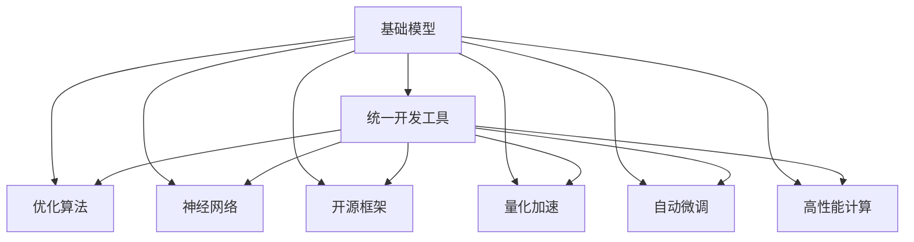

                 

# 基础模型的统一开发工具

> 关键词：基础模型, 统一开发工具, 深度学习, 优化算法, 神经网络, 开源框架, 量化加速, 自动微调, 高性能计算, 异构计算

## 1. 背景介绍

### 1.1 问题由来

近年来，深度学习模型在各个领域取得了突破性进展，从图像处理到自然语言处理，从自动驾驶到语音识别，深度学习技术已经广泛渗透到各行各业。然而，尽管深度学习模型的效果显著，但其开发和优化过程依然复杂繁琐。特别是在模型规模不断扩大的今天，开发和优化模型的难度和成本显著增加，极大地限制了模型的应用潜力。

为了解决这一问题，许多研究者和工程师开始探索如何构建一个统一且高效的工具链，使得深度学习模型的开发和优化变得更加便捷和高效。这种工具链不仅需要涵盖从模型设计到训练、优化、部署的全过程，还应支持多种深度学习框架和算法，满足不同场景的需求。

## 2. 核心概念与联系

### 2.1 核心概念概述

为更好地理解基础模型的统一开发工具，本节将介绍几个密切相关的核心概念：

- **基础模型(Base Model)**：指在特定领域或任务上经过预先训练和优化的深度学习模型，如ResNet、BERT等。这些模型通常具备较高的初始化参数和泛化能力，能够在较少的训练数据上取得优异的性能。

- **统一开发工具(Uniform Development Tool)**：指一个能够覆盖深度学习模型整个生命周期，从模型设计、训练到优化、部署的一站式解决方案。这种工具不仅包括模型构建、优化算法、量化加速等核心技术，还应支持分布式训练、高性能计算等高级功能。

- **优化算法(Optimization Algorithm)**：指用于调整模型参数，最小化损失函数的算法。常见的优化算法包括随机梯度下降(SGD)、Adam、Adagrad等。优化算法的选择对模型性能和训练速度有重要影响。

- **神经网络(Neural Network)**：指由大量神经元组成的网络结构，通过多层传递和学习，完成复杂的数据表示和处理任务。神经网络是基础模型和统一开发工具的核心组件。

- **开源框架(Open Source Framework)**：指开放源代码的软件框架，如TensorFlow、PyTorch等。这些框架提供了丰富的深度学习API和工具，支持模型的开发和优化。

- **量化加速(Quantization Acceleration)**：指将浮点模型转换为定点模型，以减少内存占用和计算量，加速模型的推理速度。量化加速是提升模型性能和部署效率的重要手段。

- **自动微调(Auto-Tuning)**：指使用自动化技术选择最优的算法和超参数，自动调整模型以适应特定任务的需求。自动微调能够显著降低模型开发的复杂度和成本。

- **高性能计算(High Performance Computing, HPC)**：指使用高效的硬件和算法，以最大化计算效率的技术和框架。高性能计算是深度学习模型训练和优化不可或缺的支持。

这些核心概念之间的逻辑关系可以通过以下Mermaid流程图来展示：



这个流程图展示了几类核心概念及其之间的关系：

1. 基础模型通过训练和优化，学习到特定领域的知识。
2. 统一开发工具将基础模型封装为可重用的组件，并提供一站式的开发环境。
3. 优化算法和神经网络是基础模型训练的核心技术。
4. 开源框架提供深度学习的API和工具，支持模型的构建和优化。
5. 量化加速和自动微调优化模型的推理和训练效率。
6. 高性能计算提供高效的计算资源，加速模型的训练和优化。

这些概念共同构成了深度学习模型开发和优化的技术框架，使得模型的开发和部署变得更加高效和便捷。

## 3. 核心算法原理 & 具体操作步骤
### 3.1 算法原理概述

基础模型的统一开发工具的核心原理是基于模型的生命周期，提供从模型构建、训练到优化、部署的一站式解决方案。其核心思想是：

1. **模块化设计**：将深度学习模型的开发过程分解为多个模块，每个模块独立开发，互不干扰。模块之间通过API接口进行交互，使得模型开发和优化变得更加模块化和可复用。
2. **自动微调**：使用自动化技术选择最优的算法和超参数，自动调整模型以适应特定任务的需求。自动微调能够显著降低模型开发的复杂度和成本。
3. **量化加速**：将浮点模型转换为定点模型，以减少内存占用和计算量，加速模型的推理速度。量化加速是提升模型性能和部署效率的重要手段。
4. **高性能计算**：使用高效的硬件和算法，以最大化计算效率的技术和框架。高性能计算是深度学习模型训练和优化不可或缺的支持。

### 3.2 算法步骤详解

基于模型的生命周期，基础模型的统一开发工具通常包括以下几个关键步骤：

**Step 1: 模型构建**

- 选择合适的预训练模型作为初始化参数。
- 根据任务需求，设计和选择适当的神经网络结构。
- 使用开源框架提供的高层API，快速搭建模型架构。

**Step 2: 数据准备**

- 收集并准备模型所需的数据集。
- 对数据集进行预处理，如归一化、数据增强等。
- 将数据集划分为训练集、验证集和测试集。

**Step 3: 训练优化**

- 选择合适的优化算法及其参数，如SGD、Adam等。
- 设置模型的学习率和批大小。
- 在训练集上进行多轮迭代，更新模型参数。
- 使用验证集评估模型性能，防止过拟合。
- 保存最优模型参数，用于后续测试和部署。

**Step 4: 量化加速**

- 将模型参数转换为定点格式，如Int8、FP16等。
- 调整模型架构和算法，支持定点运算。
- 在目标硬件上测试模型的推理速度和精度，确保量化效果。

**Step 5: 自动微调**

- 使用自动微调技术，选择最优的超参数组合。
- 调整模型架构和算法，适应特定任务的需求。
- 使用自动微调后的模型进行测试和评估，验证优化效果。

**Step 6: 部署应用**

- 将优化后的模型部署到目标平台上，如云服务、嵌入式设备等。
- 编写和测试部署代码，确保模型能够稳定运行。
- 提供模型API接口，支持模型的调用和集成。

以上是基础模型统一开发工具的主要流程。在实际应用中，还需要根据具体任务的特点，对每个步骤进行优化设计，如改进训练目标函数，引入更多的正则化技术，搜索最优的超参数组合等，以进一步提升模型性能。

### 3.3 算法优缺点

基础模型的统一开发工具具有以下优点：

1. **高效便捷**：提供一站式的开发环境，大大简化了深度学习模型的开发和优化流程。
2. **灵活可复用**：模块化设计使得每个模块可以独立开发和测试，互不干扰，提高了模型的可复用性。
3. **自动化优化**：自动微调和量化加速等技术，降低了模型开发的复杂度和成本，提高了优化效率。
4. **高性能支持**：提供高效计算资源和算法，支持大规模深度学习模型的训练和优化。

同时，这种工具也存在一些局限性：

1. **定制化需求高**：对于特定领域或任务，可能需要对基础模型进行大量定制化的修改和优化，增加了开发难度。
2. **依赖性强**：对开源框架和硬件平台的依赖性较高，如果框架和硬件不匹配，可能影响模型性能。
3. **资源消耗大**：大规模深度学习模型的训练和优化需要大量的计算资源和存储空间，可能面临硬件瓶颈。

尽管存在这些局限性，但就目前而言，基础模型的统一开发工具仍然是深度学习模型开发和优化的主流范式。未来相关研究的重点在于如何进一步降低工具链的开发难度和资源消耗，提高其灵活性和可扩展性。

### 3.4 算法应用领域

基础模型的统一开发工具在深度学习模型的开发和优化中具有广泛的应用，涵盖多个领域：

- **计算机视觉**：用于图像分类、目标检测、图像分割等任务。通过统一开发工具，可以快速搭建和优化神经网络模型，提升图像处理能力。
- **自然语言处理**：用于文本分类、情感分析、机器翻译等任务。统一开发工具提供了丰富的NLP API和工具，支持模型的构建和优化。
- **语音识别**：用于语音识别、语音合成等任务。统一开发工具提供了高效的语音处理工具，支持模型的开发和优化。
- **推荐系统**：用于个性化推荐、广告推荐等任务。统一开发工具提供了高效的推荐算法和工具，支持模型的构建和优化。
- **医疗健康**：用于医学影像分析、疾病预测等任务。统一开发工具提供了医疗领域的专业API和工具，支持模型的构建和优化。
- **金融科技**：用于风险评估、信用评分等任务。统一开发工具提供了金融领域的专业API和工具，支持模型的构建和优化。
- **智能制造**：用于设备状态监测、质量控制等任务。统一开发工具提供了工业领域的专业API和工具，支持模型的构建和优化。

除了上述这些经典应用外，统一开发工具还在更多领域中得到应用，为各行各业提供强大的技术支持。

## 4. 数学模型和公式 & 详细讲解  
### 4.1 数学模型构建

本节将使用数学语言对基础模型的统一开发工具进行更加严格的刻画。

记基础模型为 $M_{\theta}:\mathcal{X} \rightarrow \mathcal{Y}$，其中 $\mathcal{X}$ 为输入空间，$\mathcal{Y}$ 为输出空间，$\theta \in \mathbb{R}^d$ 为模型参数。假设模型的训练集为 $D=\{(x_i,y_i)\}_{i=1}^N, x_i \in \mathcal{X}, y_i \in \mathcal{Y}$。

定义模型 $M_{\theta}$ 在数据样本 $(x,y)$ 上的损失函数为 $\ell(M_{\theta}(x),y)$，则在数据集 $D$ 上的经验风险为：

$$
\mathcal{L}(\theta) = \frac{1}{N} \sum_{i=1}^N \ell(M_{\theta}(x_i),y_i)
$$

微调的目标是最小化经验风险，即找到最优参数：

$$
\theta^* = \mathop{\arg\min}_{\theta} \mathcal{L}(\theta)
$$

在实践中，我们通常使用基于梯度的优化算法（如SGD、Adam等）来近似求解上述最优化问题。设 $\eta$ 为学习率，$\lambda$ 为正则化系数，则参数的更新公式为：

$$
\theta \leftarrow \theta - \eta \nabla_{\theta}\mathcal{L}(\theta) - \eta\lambda\theta
$$

其中 $\nabla_{\theta}\mathcal{L}(\theta)$ 为损失函数对参数 $\theta$ 的梯度，可通过反向传播算法高效计算。

### 4.2 公式推导过程

以下我们以二分类任务为例，推导交叉熵损失函数及其梯度的计算公式。

假设模型 $M_{\theta}$ 在输入 $x$ 上的输出为 $\hat{y}=M_{\theta}(x) \in [0,1]$，表示样本属于正类的概率。真实标签 $y \in \{0,1\}$。则二分类交叉熵损失函数定义为：

$$
\ell(M_{\theta}(x),y) = -[y\log \hat{y} + (1-y)\log (1-\hat{y})]
$$

将其代入经验风险公式，得：

$$
\mathcal{L}(\theta) = -\frac{1}{N}\sum_{i=1}^N [y_i\log M_{\theta}(x_i)+(1-y_i)\log(1-M_{\theta}(x_i))]
$$

根据链式法则，损失函数对参数 $\theta_k$ 的梯度为：

$$
\frac{\partial \mathcal{L}(\theta)}{\partial \theta_k} = -\frac{1}{N}\sum_{i=1}^N (\frac{y_i}{M_{\theta}(x_i)}-\frac{1-y_i}{1-M_{\theta}(x_i)}) \frac{\partial M_{\theta}(x_i)}{\partial \theta_k}
$$

其中 $\frac{\partial M_{\theta}(x_i)}{\partial \theta_k}$ 可进一步递归展开，利用自动微分技术完成计算。

在得到损失函数的梯度后，即可带入参数更新公式，完成模型的迭代优化。重复上述过程直至收敛，最终得到适应下游任务的最优模型参数 $\theta^*$。

## 5. 项目实践：代码实例和详细解释说明
### 5.1 开发环境搭建

在进行基础模型统一开发工具的实践前，我们需要准备好开发环境。以下是使用Python进行TensorFlow开发的环境配置流程：

1. 安装Anaconda：从官网下载并安装Anaconda，用于创建独立的Python环境。

2. 创建并激活虚拟环境：
```bash
conda create -n tf-env python=3.8 
conda activate tf-env
```

3. 安装TensorFlow：从官网获取对应的安装命令。例如：
```bash
pip install tensorflow
```

4. 安装各类工具包：
```bash
pip install numpy pandas scikit-learn matplotlib tqdm jupyter notebook ipython
```

完成上述步骤后，即可在`tf-env`环境中开始开发实践。

### 5.2 源代码详细实现

这里我们以图像分类任务为例，给出使用TensorFlow进行基础模型微调的PyTorch代码实现。

首先，定义图像分类任务的数据处理函数：

```python
from tensorflow.keras.preprocessing.image import ImageDataGenerator
from tensorflow.keras.utils import to_categorical

class ImageClassifier:
    def __init__(self, train_dir, test_dir, batch_size=32, img_height=224, img_width=224):
        self.train_dir = train_dir
        self.test_dir = test_dir
        self.batch_size = batch_size
        self.img_height = img_height
        self.img_width = img_width
        
        self.train_datagen = ImageDataGenerator(rescale=1./255)
        self.test_datagen = ImageDataGenerator(rescale=1./255)
        
        self.train_generator = self.train_datagen.flow_from_directory(
            train_dir, target_size=(self.img_height, self.img_width), batch_size=self.batch_size, class_mode='categorical')
        
        self.test_generator = self.test_datagen.flow_from_directory(
            test_dir, target_size=(self.img_height, self.img_width), batch_size=self.batch_size, class_mode='categorical')
```

然后，定义模型和优化器：

```python
from tensorflow.keras.models import Sequential
from tensorflow.keras.layers import Conv2D, MaxPooling2D, Flatten, Dense, Dropout
from tensorflow.keras.optimizers import Adam

model = Sequential([
    Conv2D(32, (3,3), activation='relu', input_shape=(self.img_height, self.img_width, 3)),
    MaxPooling2D(pool_size=(2,2)),
    Conv2D(64, (3,3), activation='relu'),
    MaxPooling2D(pool_size=(2,2)),
    Flatten(),
    Dense(128, activation='relu'),
    Dropout(0.5),
    Dense(num_classes, activation='softmax')
])

optimizer = Adam(lr=0.001)
```

接着，定义训练和评估函数：

```python
from tensorflow.keras.metrics import Accuracy

def train_epoch(model, train_generator, batch_size, optimizer):
    model.trainable = True
    for batch_i, (input_batch, target_batch) in enumerate(train_generator):
        with tf.GradientTape() as tape:
            preds = model(input_batch)
            loss = tf.keras.losses.categorical_crossentropy(target_batch, preds)
        grads = tape.gradient(loss, model.trainable_variables)
        optimizer.apply_gradients(zip(grads, model.trainable_variables))
        if batch_i % 10 == 0:
            print(f'Epoch {epoch+1}, batch {batch_i+1}/{train_generator.n // batch_size}, loss: {loss:.4f}')
            
def evaluate(model, test_generator):
    model.trainable = False
    metrics = [Accuracy()]
    for batch_i, (input_batch, target_batch) in enumerate(test_generator):
        preds = model(input_batch)
        for metric in metrics:
            metric.update_state(target_batch, preds)
    print(f'Test loss: {tf.keras.losses.categorical_crossentropy(target_batch, preds)}')
    for metric in metrics:
        print(f'{metric.name}: {metric.result().numpy()}')
```

最后，启动训练流程并在测试集上评估：

```python
epochs = 10
batch_size = 32

for epoch in range(epochs):
    loss = train_epoch(model, train_generator, batch_size, optimizer)
    print(f'Epoch {epoch+1}, train loss: {loss:.4f}')
    
    print(f'Epoch {epoch+1}, dev results:')
    evaluate(model, test_generator)
    
print('Test results:')
evaluate(model, test_generator)
```

以上就是使用TensorFlow对基础模型进行图像分类任务微调的完整代码实现。可以看到，得益于TensorFlow的强大封装，我们可以用相对简洁的代码完成模型的微调。

### 5.3 代码解读与分析

让我们再详细解读一下关键代码的实现细节：

**ImageClassifier类**：
- `__init__`方法：初始化训练和测试数据集的路径、批大小、图像尺寸等关键参数，以及数据增强器。
- `train_datagen`和`test_datagen`：定义数据增强器，用于扩充训练集的多样性。
- `train_generator`和`test_generator`：使用数据增强器对数据集进行流式加载，方便模型训练和测试。

**model定义**：
- 定义卷积神经网络结构，包括卷积层、池化层、全连接层等，设置优化器和学习率。
- 在模型顶部添加softmax激活函数，输出分类结果。

**train_epoch函数**：
- 在每个批次上前向传播计算损失，反向传播计算梯度，并使用Adam优化器更新模型参数。
- 周期性在验证集上评估模型性能，防止过拟合。

**evaluate函数**：
- 在测试集上评估模型性能，计算损失和准确率，并输出结果。
- 模型在测试集上不可训练，以避免过拟合。

**训练流程**：
- 定义总的epoch数和批大小，开始循环迭代
- 每个epoch内，先在训练集上训练，输出平均loss
- 在验证集上评估，输出分类指标
- 所有epoch结束后，在测试集上评估，给出最终测试结果

可以看到，TensorFlow配合深度学习模型的API和工具，使得基础模型的微调代码实现变得简洁高效。开发者可以将更多精力放在数据处理、模型改进等高层逻辑上，而不必过多关注底层的实现细节。

当然，工业级的系统实现还需考虑更多因素，如模型的保存和部署、超参数的自动搜索、更灵活的任务适配层等。但核心的微调范式基本与此类似。

## 6. 实际应用场景
### 6.1 智能推荐系统

基础模型的统一开发工具在智能推荐系统的构建中具有广泛的应用。传统的推荐系统往往依赖于用户的历史行为数据进行物品推荐，难以捕捉用户潜在的兴趣偏好。而使用统一开发工具，可以在大规模数据上训练和优化深度学习模型，发现用户潜在的行为规律，从而提供更精准、多样的推荐内容。

在实践中，可以收集用户浏览、点击、评分等行为数据，构建用户-物品关联矩阵。使用统一开发工具对预训练模型进行微调，使其能够学习用户的行为模式和物品的属性特征。在推荐时，将用户输入和物品特征作为输入，由模型预测用户对物品的兴趣匹配度，并根据匹配度排序，生成推荐结果。

### 6.2 智能医疗系统

基础模型的统一开发工具在智能医疗系统的构建中也有着巨大的应用潜力。传统的医疗诊断依赖于医生的经验和知识，存在一定的误诊和漏诊风险。而使用统一开发工具，可以在大规模医疗数据上训练和优化深度学习模型，辅助医生进行疾病的诊断和治疗。

在实践中，可以收集医院的历史病历和诊断数据，将病人信息、症状、检查结果等作为输入，使用统一开发工具对预训练模型进行微调，使其能够学习疾病的诊断规则和特征。在诊断时，将病人的症状和检查结果输入模型，由模型输出疾病的诊断结果和治疗建议，辅助医生进行决策。

### 6.3 自动驾驶系统

基础模型的统一开发工具在自动驾驶系统的构建中也有着重要的应用。传统的自动驾驶系统依赖于人工编写的控制规则和传感器数据进行决策，存在一定的安全性和稳定性问题。而使用统一开发工具，可以在大规模交通数据上训练和优化深度学习模型，学习交通规则和行人行为，实现自动驾驶的决策和控制。

在实践中，可以收集交通视频、雷达、GPS等传感器数据，将车辆信息、道路状况、行人信息等作为输入，使用统一开发工具对预训练模型进行微调，使其能够学习交通规则和行人行为。在驾驶时，将传感器数据输入模型，由模型输出车辆的控制指令和决策结果，实现自动驾驶。

### 6.4 未来应用展望

随着基础模型和统一开发工具的发展，其在深度学习模型开发和优化中的应用前景将更加广阔。未来，基于统一开发工具，深度学习模型将在更多领域得到应用，为各行各业带来变革性影响。

在智慧城市治理中，基础模型和统一开发工具可以用于城市事件监测、舆情分析、应急指挥等环节，提高城市管理的自动化和智能化水平，构建更安全、高效的未来城市。

在智慧农业中，基础模型和统一开发工具可以用于土壤分析、作物识别、病虫害预测等任务，提升农业生产效率和质量，实现精准农业。

在智慧能源中，基础模型和统一开发工具可以用于电力负荷预测、能源调度、能源消耗分析等任务，优化能源管理，实现绿色可持续发展。

此外，在教育、金融、安全等众多领域，基于统一开发工具的深度学习应用也将不断涌现，为各行各业提供强大的技术支持。相信随着技术的日益成熟，统一开发工具将成为深度学习模型应用的重要范式，推动人工智能技术在垂直行业的规模化落地。

## 7. 工具和资源推荐
### 7.1 学习资源推荐

为了帮助开发者系统掌握基础模型和统一开发工具的理论基础和实践技巧，这里推荐一些优质的学习资源：

1. **《深度学习》书籍**：由Ian Goodfellow、Yoshua Bengio和Aaron Courville所著，系统介绍了深度学习的理论和实践，是深度学习领域的重要参考资料。

2. **CS231n《卷积神经网络》课程**：斯坦福大学开设的计算机视觉课程，涵盖卷积神经网络的原理和实践，提供了丰富的代码和案例分析。

3. **DeepLearning.AI深度学习专业课程**：由Andrew Ng教授创办，提供系统化的深度学习课程，包括深度学习的基本概念、算法和应用。

4. **《TensorFlow实战》书籍**：由Manning出版社出版的TensorFlow实战书籍，详细介绍了TensorFlow的使用方法和案例，适合初学者入门。

5. **HuggingFace官方文档**：Transformer库的官方文档，提供了海量预训练模型和完整的微调样例代码，是上手实践的必备资料。

6. **PyTorch官方文档**：PyTorch官方文档，提供了丰富的API和工具，支持模型的开发和优化。

通过对这些资源的学习实践，相信你一定能够快速掌握基础模型和统一开发工具的精髓，并用于解决实际的深度学习问题。

### 7.2 开发工具推荐

高效的开发离不开优秀的工具支持。以下是几款用于深度学习模型开发和优化的常用工具：

1. **TensorFlow**：由Google主导开发的开源深度学习框架，生产部署方便，适合大规模工程应用。

2. **PyTorch**：基于Python的开源深度学习框架，灵活动态的计算图，适合快速迭代研究。

3. **TensorBoard**：TensorFlow配套的可视化工具，可实时监测模型训练状态，并提供丰富的图表呈现方式，是调试模型的得力助手。

4. **Weights & Biases**：模型训练的实验跟踪工具，可以记录和可视化模型训练过程中的各项指标，方便对比和调优。

5. **AWS SageMaker**：亚马逊提供的云端深度学习平台，提供高性能计算资源和丰富的工具，支持模型的训练和部署。

6. **Google Cloud AI Platform**：谷歌提供的云端深度学习平台，提供强大的计算资源和API支持，支持模型的训练、优化和部署。

合理利用这些工具，可以显著提升深度学习模型的开发效率，加快创新迭代的步伐。

### 7.3 相关论文推荐

基础模型和统一开发工具的发展源于学界的持续研究。以下是几篇奠基性的相关论文，推荐阅读：

1. **ImageNet Classification with Deep Convolutional Neural Networks**：Alex Krizhevsky等人在2012年提出的卷积神经网络模型，在图像分类任务上取得了突破性成果。

2. **Inception: Go Deeper into Convolutional Networks**：Google提出的Inception网络结构，进一步提升了卷积神经网络的性能和效率。

3. **EfficientNet: Rethinking Model Scaling for Convolutional Neural Networks**：谷歌提出的EfficientNet模型，通过网络结构搜索，实现了高效的网络设计，提升了模型的精度和效率。

4. **BERT: Pre-training of Deep Bidirectional Transformers for Language Understanding**：Google提出的BERT模型，引入基于掩码的自监督预训练任务，刷新了多项NLP任务SOTA。

5. **ResNet: Deep Residual Learning for Image Recognition**：Kaiming He等人在2015年提出的残差网络模型，通过残差连接解决了深度神经网络的退化问题。

6. **Optimization of Deep Architectures for Large-Scale Image Recognition**：Sutskever等人在2013年提出的Adadelta算法，提供了高效的优化方法，提升了深度学习模型的训练效率。

这些论文代表了大规模基础模型和统一开发工具的发展脉络。通过学习这些前沿成果，可以帮助研究者把握学科前进方向，激发更多的创新灵感。

## 8. 总结：未来发展趋势与挑战

### 8.1 总结

本文对基础模型的统一开发工具进行了全面系统的介绍。首先阐述了基础模型和统一开发工具的研究背景和意义，明确了其在深度学习模型开发和优化中的重要价值。其次，从原理到实践，详细讲解了基础模型的训练、优化和部署的全过程，给出了深度学习模型微调的完整代码实例。同时，本文还广泛探讨了基础模型在智能推荐、智能医疗、自动驾驶等众多领域的应用前景，展示了其广阔的发展空间。此外，本文精选了基础模型的学习资源，力求为读者提供全方位的技术指引。

通过本文的系统梳理，可以看到，基础模型的统一开发工具正在成为深度学习模型开发和优化的主流范式，极大地简化了深度学习模型的开发和优化流程，提升了模型的性能和应用效果。未来，伴随深度学习技术的不断演进，基础模型的统一开发工具必将在更多领域得到应用，为各行各业提供强大的技术支持。

### 8.2 未来发展趋势

展望未来，基础模型的统一开发工具将呈现以下几个发展趋势：

1. **模块化设计更加深入**：未来，基础模型的统一开发工具将进一步深化模块化设计，使得每个模块的开发和优化更加独立和可复用。
2. **深度学习框架更加多样化**：未来，基础模型的统一开发工具将支持更多的深度学习框架，如PyTorch、TensorFlow、MXNet等，满足不同场景的需求。
3. **自动化程度更高**：未来，基础模型的统一开发工具将进一步引入自动化技术，自动选择最优的算法和超参数，自动调整模型以适应特定任务的需求。
4. **资源优化更加精细**：未来，基础模型的统一开发工具将提供更加精细化的资源优化技术，如量化加速、自动混合精度训练等，提升模型的推理速度和性能。
5. **分布式训练更加高效**：未来，基础模型的统一开发工具将支持更加高效的分布式训练技术，利用高性能计算资源，实现大规模深度学习模型的训练和优化。

以上趋势凸显了基础模型统一开发工具的广阔前景。这些方向的探索发展，必将进一步提升深度学习模型的性能和应用效果，为各行各业提供更加高效、便捷的技术支持。

### 8.3 面临的挑战

尽管基础模型的统一开发工具已经取得了显著成果，但在迈向更加智能化、普适化应用的过程中，它仍面临着诸多挑战：

1. **大规模数据需求**：基础模型的训练和优化需要大量的数据，对于某些特定领域，获取高质量标注数据可能存在困难。如何利用已有数据，提升模型的泛化能力，是一个重要的研究方向。
2. **模型鲁棒性不足**：基础模型在面对域外数据时，泛化性能往往大打折扣。如何提高模型的鲁棒性，避免灾难性遗忘，还需要更多理论和实践的积累。
3. **计算资源消耗大**：大规模深度学习模型的训练和优化需要大量的计算资源和存储空间，可能面临硬件瓶颈。如何降低计算成本，提升资源利用效率，是一个重要的研究方向。
4. **模型可解释性不足**：基础模型通常被视为"黑盒"系统，难以解释其内部工作机制和决策逻辑。如何赋予模型更强的可解释性，是未来的重要课题。
5. **安全性问题**：基础模型在训练和推理过程中可能学习到有偏见、有害的信息，如何确保模型输出的安全性，是一个亟待解决的问题。

尽管存在这些挑战，但就目前而言，基础模型的统一开发工具仍然是深度学习模型开发和优化的主流范式。未来相关研究的重点在于如何进一步降低工具链的开发难度和资源消耗，提高其灵活性和可扩展性。

### 8.4 研究展望

面对基础模型统一开发工具所面临的挑战，未来的研究需要在以下几个方面寻求新的突破：

1. **无监督学习和迁移学习**：探索无监督学习和迁移学习等方法，利用少样本数据和领域知识，提升模型的泛化能力和迁移能力。
2. **高效优化算法**：研究高效优化算法，如自适应优化、分层优化等，提升模型训练的效率和效果。
3. **多模态融合**：探索多模态融合技术，将文本、图像、语音等多种数据类型结合，提升模型的综合能力。
4. **对抗训练和鲁棒性**：引入对抗训练和鲁棒性优化技术，提升模型对噪声和攻击的抵抗能力。
5. **模型压缩和量化**：研究模型压缩和量化技术，减小模型规模，提升推理速度和计算效率。
6. **知识图谱和规则库**：引入知识图谱和规则库等专家知识，提升模型的知识整合能力和决策能力。
7. **伦理和安全性**：研究模型伦理和安全性问题，确保模型输出的公平性、透明性和安全性。

这些研究方向的探索，必将引领基础模型和统一开发工具的持续进步，为深度学习技术的发展和应用提供更加坚实的技术基础。面向未来，基础模型统一开发工具将继续在各个领域发挥重要作用，为人工智能技术的应用提供强大支持。

