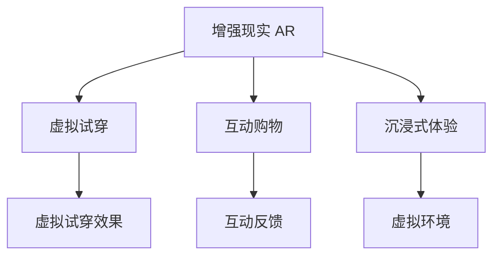

                 

# 增强现实技术在电商领域的应用：案例分析与展望

> 关键词：增强现实(AR), 电商领域, 虚拟试穿, 互动购物, 沉浸式体验, 电商平台, 智能交互

## 1. 背景介绍

### 1.1 问题由来

随着消费者对购物体验要求日益提升，传统的平面展示方式已经难以满足需求。增强现实技术（AR）以其沉浸式、互动性的特点，为电商领域带来了全新的可能性。通过AR技术，消费者可以在现实世界中虚拟试穿、试用产品，获得更为直观和真实的购物体验。在疫情背景下，居家隔离成为了常态，线上购物愈发成为主流，而AR技术在电商中的应用，则进一步推动了这一趋势的加速。

### 1.2 问题核心关键点

增强现实技术在电商领域的应用，关键在于如何将AR与电商的购物流程深度融合，实现以下目标：
- 提升用户体验：使消费者能够通过虚拟试穿、试用等体验，更好地了解产品特性。
- 提高销售转化率：通过增强的互动性和信息展示，降低购物决策难度，提升购买意愿。
- 优化库存管理：通过虚拟试穿的反馈，及时调整库存，避免缺货或积压。
- 个性化推荐：基于用户的虚拟试穿行为，进行个性化推荐，提升用户满意度。

## 2. 核心概念与联系

### 2.1 核心概念概述

为更好地理解增强现实技术在电商领域的应用，本节将介绍几个密切相关的核心概念：

- **增强现实(AR)**：通过将虚拟信息叠加在现实世界的图像上，增强用户的感官体验。AR技术在电商领域主要应用于虚拟试穿、虚拟试用、虚拟导购等场景，提升消费者的购物体验。

- **虚拟试穿(Virtual Try-On)**：通过AR技术，消费者可以在家中虚拟试穿衣物、鞋子等商品，获得真实的穿戴效果。这种技术在电商平台上得到了广泛应用。

- **互动购物(Interactive Shopping)**：通过增强现实，消费者可以与虚拟模型、商品互动，如调整衣服大小、查看细节等，大大提升了购物的互动性和沉浸感。

- **沉浸式体验(Immersive Experience)**：结合虚拟现实(VR)技术，消费者可以进入一个完全虚拟的购物环境，进行虚拟漫游，与虚拟商品互动，获得更加沉浸的购物体验。

这些核心概念之间的逻辑关系可以通过以下Mermaid流程图来展示：



这个流程图展示出AR技术通过虚拟试穿和互动购物，提升了消费者的购物体验。同时，沉浸式体验进一步拓展了AR在电商中的应用场景。

## 3. 核心算法原理 & 具体操作步骤

### 3.1 算法原理概述

增强现实技术在电商领域的应用，核心在于通过计算机视觉和图像处理技术，将虚拟信息叠加在现实世界中，生成增强的现实图像。这一过程涉及以下关键技术：

1. **图像捕获**：通过摄像头、移动设备等设备，捕捉用户的现实世界图像。
2. **目标识别**：对现实图像中的物体进行识别和定位，确定虚拟信息叠加的位置。
3. **虚拟信息渲染**：将虚拟信息（如衣服、鞋子等商品）渲染在现实图像中，生成增强的现实图像。
4. **交互控制**：通过手势、点击等交互方式，控制虚拟信息的展示和交互。

### 3.2 算法步骤详解

以下是增强现实技术在电商应用中的典型算法步骤：

**Step 1: 图像捕获和预处理**

1. 用户使用摄像头或移动设备，对准现实世界中的商品。
2. 设备捕获实时视频流，通过摄像头输入，进行图像预处理，包括去噪、校正等操作。

**Step 2: 目标识别**

1. 使用计算机视觉算法，如YOLO、Faster R-CNN等，对现实图像中的物体进行检测和分类。
2. 确定虚拟信息需要叠加的位置，如衣服的上衣、下衣等。

**Step 3: 虚拟信息渲染**

1. 加载虚拟物品的3D模型，根据目标物体的尺度、位置等信息，进行缩放和旋转。
2. 将虚拟物品渲染到增强的现实图像中，使用图像处理算法如Alpha通道合成、深度图像合成等技术，生成增强的现实图像。

**Step 4: 交互控制**

1. 使用手势识别、点击等方式，控制虚拟物品的展示和交互。
2. 根据用户的互动反馈，调整虚拟物品的展示效果，如改变颜色、调整大小等。

**Step 5: 反馈和优化**

1. 通过用户反馈（如评分、评论等），不断优化虚拟试穿的体验。
2. 使用机器学习算法，如强化学习、迁移学习等，进一步提升AR模型的性能。

### 3.3 算法优缺点

增强现实技术在电商领域的应用，具有以下优点：

1. **提升用户体验**：虚拟试穿和互动购物大大提升了用户的购物体验，使其更直观、更真实地了解产品特性。
2. **降低决策难度**：通过虚拟试穿和试用，用户可以快速了解产品的尺寸、样式等信息，降低了购物决策的难度。
3. **提高转化率**：增强的互动性和沉浸感，使用户更容易产生购买意愿，从而提高电商平台的转化率。

同时，AR技术在电商领域的应用也存在一些局限性：

1. **技术门槛高**：需要较高的计算机视觉和图像处理技术，设备成本较高。
2. **用户适应性**：部分用户可能对AR技术不适应，需要一段时间的适应和学习。
3. **数据隐私**：AR应用中涉及用户的实时图像和互动数据，需要保护用户隐私。

### 3.4 算法应用领域

增强现实技术在电商领域的应用非常广泛，具体包括：

- **虚拟试穿**：如服装、鞋子、眼镜等商品的虚拟试穿，让用户在家中即可体验穿戴效果。
- **虚拟试用**：如化妆品、珠宝等商品的虚拟试用，让用户通过增强现实技术试用产品。
- **虚拟导购**：通过AR技术，提供虚拟导购服务，如商品导购、搭配建议等。
- **个性化推荐**：基于用户的虚拟试穿行为，进行个性化商品推荐，提升用户满意度。
- **虚拟购物车**：在虚拟环境中模拟购物车，方便用户浏览和选择商品。

## 4. 数学模型和公式 & 详细讲解 & 举例说明

### 4.1 数学模型构建

增强现实技术在电商领域的应用，主要涉及计算机视觉和图像处理中的对象检测、3D渲染等技术。以下将以虚拟试穿为例，构建增强现实的数学模型。

**目标检测模型**

目标检测模型可以使用YOLO、Faster R-CNN等算法。以Faster R-CNN为例，其模型结构包括特征提取网络、候选区域生成器、分类器等部分。特征提取网络通常使用卷积神经网络（CNN），如ResNet、Inception等，提取图像特征。候选区域生成器使用RPN（Region Proposal Network）生成候选区域，分类器使用全连接网络进行分类。

**3D渲染模型**

3D渲染模型通常使用图形处理单元（GPU）进行计算。其基本流程包括：
1. 加载3D模型，进行纹理贴图。
2. 对模型进行缩放、旋转等变换，确定模型在现实世界中的位置。
3. 使用GPU进行渲染，生成增强的现实图像。

### 4.2 公式推导过程

以下是虚拟试穿的数学模型推导过程：

1. **目标检测模型**：
   - 输入图像：$I_{in}$，尺寸为$H \times W \times C$。
   - 卷积层提取特征：$I_{conv} = Conv3(x, \omega_1)$，其中$x$为卷积核，$\omega_1$为卷积层权重。
   - 候选区域生成器：$R_{rcnn} = RPN(I_{conv})$，生成候选区域。
   - 分类器：$y = FC(R_{rcnn}, \omega_2)$，其中$FC$为全连接网络，$\omega_2$为分类器权重。
   - 目标框回归：$b = BBoxReg(R_{rcnn}, \omega_3)$，其中$BBoxReg$为目标框回归网络，$\omega_3$为目标框回归器权重。

2. **3D渲染模型**：
   - 加载3D模型：$M_{3D} = loadModel()$，生成3D模型。
   - 模型变换：$M_{transform} = transform(M_{3D}, \omega_4)$，其中$\omega_4$为模型变换矩阵。
   - 渲染：$I_{AR} = render(M_{transform}, I_{in}, \omega_5)$，其中$I_{AR}$为增强的现实图像，$render$为渲染函数，$\omega_5$为渲染器权重。

### 4.3 案例分析与讲解

以虚拟试穿为例，具体流程如下：

1. 用户通过摄像头对准衣物，设备捕获实时视频流。
2. 使用YOLO模型对视频流中的图像进行目标检测，确定衣物的位置和尺寸。
3. 加载虚拟衣物的3D模型，进行缩放和旋转，使其与真实衣物对齐。
4. 将虚拟衣物渲染到视频流中，生成增强的现实图像。
5. 用户可以通过手势或点击，控制虚拟衣物的展示和交互，如改变颜色、调整大小等。

## 5. 项目实践：代码实例和详细解释说明

### 5.1 开发环境搭建

在进行虚拟试穿应用开发前，需要准备好开发环境。以下是使用Python进行OpenCV和PyTorch开发的环境配置流程：

1. 安装Anaconda：从官网下载并安装Anaconda，用于创建独立的Python环境。

2. 创建并激活虚拟环境：
```bash
conda create -n ar-dev python=3.8 
conda activate ar-dev
```

3. 安装OpenCV和PyTorch：
```bash
conda install opencv-python pytorch torchvision torchaudio cudatoolkit=11.1 -c pytorch -c conda-forge
```

4. 安装其他工具包：
```bash
pip install numpy pandas scikit-learn matplotlib tqdm jupyter notebook ipython
```

完成上述步骤后，即可在`ar-dev`环境中开始虚拟试穿应用的开发。

### 5.2 源代码详细实现

以下是使用Python和OpenCV实现虚拟试穿的代码示例：

```python
import cv2
import numpy as np
from torchvision.models import resnet50
from torchvision.transforms import transforms

# 加载YOLO模型
model = cv2.dnn.readNet('yolo.weights', 'yolo.cfg')

# 加载目标检测类别标签
classes = []
with open('coco.names', 'r') as f:
    classes = [line.strip() for line in f.readlines()]

# 加载虚拟衣物3D模型
M_3D = loadModel()

# 定义目标检测网络
net = resnet50(pretrained=True)
net.eval()

# 定义模型输入尺寸
input_size = (416, 416)

# 定义目标检测模型
def detect_objects(image):
    blob = cv2.dnn.blobFromImage(image, 1/255.0, input_size, swapRB=True, crop=False)
    model.setInput(blob)
    detections = model.forward()
    detections = detections[0, 0, :, :]
    boxes = detections[:, 0:4]
    scores = detections[:, 5:6]
    class_ids = detections[:, 6:7].astype(np.int32)
    return boxes, scores, class_ids

# 加载虚拟衣物3D模型
def render_clothes(image, boxes, scores, class_ids):
    for i in range(boxes.shape[0]):
        if class_ids[i] == 0:  # 如果检测到衣物
            box = boxes[i, :]
            clothes_model = loadModel()
            clothes_model.load_clothes(clothes)
            clothes_model.set_position(box)
            clothes_image = clothes_model.render(image)
            image = cv2.addWeighted(image, 0.5, clothes_image, 0.5, 0)
    return image

# 示例代码
cap = cv2.VideoCapture(0)

while True:
    ret, frame = cap.read()
    frame = cv2.cvtColor(frame, cv2.COLOR_BGR2RGB)
    frame = cv2.resize(frame, (416, 416))
    boxes, scores, class_ids = detect_objects(frame)
    frame = render_clothes(frame, boxes, scores, class_ids)
    cv2.imshow('AR试穿', frame)
    if cv2.waitKey(1) == ord('q'):
        break

cap.release()
cv2.destroyAllWindows()
```

### 5.3 代码解读与分析

让我们再详细解读一下关键代码的实现细节：

**detect_objects函数**：
- 定义了目标检测函数，使用YOLO模型对输入图像进行检测，返回目标框、置信度和类别ID。

**render_clothes函数**：
- 定义了虚拟衣物渲染函数，使用加载的3D模型对检测到的衣物进行渲染，将渲染后的衣物叠加到输入图像中。

**示例代码**：
- 使用OpenCV捕获实时视频流，对每帧图像进行目标检测和虚拟衣物渲染。
- 将渲染后的图像显示出来，并在按下'q'键时退出循环。

可以看到，通过OpenCV和PyTorch的结合，可以很方便地实现虚拟试穿应用。开发者可以根据具体需求，进行进一步的优化和改进。

## 6. 实际应用场景

### 6.1 智能试衣间

智能试衣间是虚拟试穿在电商平台上的典型应用场景。用户通过智能手机摄像头对准衣物，即可在屏幕上虚拟试穿。试衣间的屏幕通常会展示实时视频流和虚拟衣物的叠加效果，用户可以通过手势或点击，调整衣物大小、颜色等参数，获得更为真实和沉浸的试穿体验。智能试衣间在大型购物中心、线上服装店等场景中得到了广泛应用。

### 6.2 虚拟试用室

虚拟试用室是增强现实在电商领域应用的另一大方向。用户可以进入虚拟试用室，体验各种商品的试用效果。例如，用户可以在虚拟试用室中试用化妆品、眼镜等商品，查看其在不同肤色、眼型下的效果，从而做出更加明智的购买决策。虚拟试用室在化妆品、眼镜、配饰等商品上得到了广泛应用。

### 6.3 虚拟导购服务

虚拟导购服务是通过增强现实技术，提供智能导购解决方案。用户可以在虚拟环境中浏览商品，并由虚拟导购机器人提供推荐和建议。虚拟导购机器人可以基于用户的浏览记录和试穿行为，进行个性化推荐，大大提升用户购物体验。虚拟导购服务在大型电商平台、家居用品店等场景中得到了广泛应用。

### 6.4 未来应用展望

随着增强现实技术的不断进步，其在电商领域的应用也将更加广泛和深入。未来可能的应用方向包括：

1. **全场景虚拟购物体验**：通过虚拟现实(VR)技术，将用户带入一个完全虚拟的购物环境中，进行沉浸式购物体验。用户可以在虚拟环境中浏览、试穿、试用各种商品，获得更加真实的购物感受。

2. **智能推荐系统**：基于增强现实技术，构建更加智能化的推荐系统。通过分析用户的虚拟试穿行为和互动数据，进行精准推荐，提升用户满意度和转化率。

3. **互动式购物助手**：开发智能购物助手，通过增强现实技术，提供即时互动和辅助。购物助手可以回答问题、提供建议、处理订单等，提升购物体验和效率。

4. **个性化定制服务**：结合增强现实技术，提供个性化定制服务。用户可以在虚拟环境中试穿、试用商品，并与设计师进行互动，定制个性化的服装、配饰等产品。

5. **虚拟试穿游戏**：将虚拟试穿与游戏元素结合，开发趣味性强的虚拟试穿游戏。通过互动性强的游戏体验，吸引用户参与，增加购物乐趣。

6. **智能客服系统**：利用增强现实技术，构建智能客服系统。通过虚拟导购和智能推荐，提供个性化、实时的客服服务，提升客户满意度。

以上应用方向展示了增强现实技术在电商领域的巨大潜力，未来的发展将更加多样和深入。相信随着技术的进步和应用的推广，增强现实技术将进一步改变人们的购物方式，提升电商平台的竞争力。

## 7. 工具和资源推荐

### 7.1 学习资源推荐

为了帮助开发者系统掌握增强现实技术在电商领域的应用，这里推荐一些优质的学习资源：

1. **《增强现实技术》（AR Technology）**：详细介绍了增强现实技术的基本原理、主要应用和开发工具。

2. **《计算机视觉与深度学习》（Computer Vision and Deep Learning）**：介绍了计算机视觉和深度学习的基本概念和算法，特别是目标检测和3D渲染等关键技术。

3. **《深度学习与增强现实》（Deep Learning and Augmented Reality）**：介绍了深度学习与增强现实技术的结合，特别是卷积神经网络在目标检测和3D渲染中的应用。

4. **《虚拟试穿技术》（Virtual Try-On Technology）**：介绍了虚拟试穿技术的基本原理、关键技术和开发实践。

5. **《增强现实开发实战》（AR Development Best Practices）**：提供了增强现实应用开发的最佳实践，包括技术选型、性能优化等。

通过对这些资源的学习实践，相信你一定能够快速掌握增强现实技术在电商领域的应用，并用于解决实际的电商问题。

### 7.2 开发工具推荐

高效的工具支持是成功应用增强现实技术的关键。以下是几款用于增强现实电商应用开发的常用工具：

1. **OpenCV**：开源的计算机视觉库，提供了强大的图像处理和目标检测功能。

2. **PyTorch**：基于Python的开源深度学习框架，支持GPU加速，适合进行复杂的图像处理和3D渲染。

3. **Unity3D**：强大的游戏引擎，支持虚拟现实和增强现实应用开发，提供了丰富的渲染和交互功能。

4. **Blender**：免费的开源3D创作工具，支持模型加载、渲染、动画制作等功能，适合进行3D模型的设计和渲染。

5. **ARKit**：苹果公司的增强现实开发框架，提供了简单易用的AR开发工具，适合在iOS平台上进行AR应用开发。

6. **ARCore**：谷歌的增强现实开发框架，提供了丰富的AR功能，支持Android平台上的AR应用开发。

合理利用这些工具，可以显著提升增强现实电商应用开发的效率，加快创新迭代的步伐。

### 7.3 相关论文推荐

增强现实技术在电商领域的应用涉及计算机视觉、深度学习、图像处理等多个领域，以下是几篇奠基性的相关论文，推荐阅读：

1. **"AR试穿技术综述"（A Review of AR Try-On Technology）**：总结了虚拟试穿技术的发展历程和应用案例，提供了详细的技术路线图。

2. **"增强现实技术在电商中的应用"（Applications of Augmented Reality in E-commerce）**：分析了增强现实技术在电商领域的应用场景和实际案例，提供了实用的开发建议。

3. **"智能试衣间设计"（Design of Smart Try-On Room）**：介绍了智能试衣间的实现原理和关键技术，提供了具体的开发思路和算法实现。

4. **"虚拟试用室设计"（Design of Virtual Trying Room）**：介绍了虚拟试用室的实现原理和关键技术，提供了详细的算法和模型设计。

5. **"虚拟导购系统设计"（Design of Virtual Shopping Assistant）**：介绍了虚拟导购系统的实现原理和关键技术，提供了具体的算法和系统设计。

这些论文代表了增强现实技术在电商领域的研究前沿，通过学习这些前沿成果，可以帮助研究者把握学科前进方向，激发更多的创新灵感。

## 8. 总结：未来发展趋势与挑战

### 8.1 总结

本文对增强现实技术在电商领域的应用进行了全面系统的介绍。首先阐述了增强现实技术的基本原理和核心概念，明确了增强现实在电商领域的应用价值。其次，从原理到实践，详细讲解了增强现实技术的算法步骤和关键技术，给出了增强现实应用开发的完整代码实例。同时，本文还广泛探讨了增强现实技术在电商领域的应用前景，展示了增强现实技术的巨大潜力。

通过本文的系统梳理，可以看到，增强现实技术在电商领域的应用前景广阔，有望通过沉浸式、互动性的购物体验，提升用户的购物满意度和转化率。随着技术的进步和应用的推广，增强现实技术必将在电商领域发挥更大的作用，引领未来的电商潮流。

### 8.2 未来发展趋势

展望未来，增强现实技术在电商领域的应用将呈现以下几个发展趋势：

1. **全场景虚拟购物体验**：通过虚拟现实(VR)技术，将用户带入一个完全虚拟的购物环境中，进行沉浸式购物体验。这将大大提升用户的购物体验和满意度。

2. **智能推荐系统**：基于增强现实技术，构建更加智能化的推荐系统。通过分析用户的虚拟试穿行为和互动数据，进行精准推荐，提升用户满意度和转化率。

3. **互动式购物助手**：开发智能购物助手，通过增强现实技术，提供即时互动和辅助。购物助手可以回答问题、提供建议、处理订单等，提升购物体验和效率。

4. **个性化定制服务**：结合增强现实技术，提供个性化定制服务。用户可以在虚拟环境中试穿、试用商品，并与设计师进行互动，定制个性化的服装、配饰等产品。

5. **虚拟试穿游戏**：将虚拟试穿与游戏元素结合，开发趣味性强的虚拟试穿游戏。通过互动性强的游戏体验，吸引用户参与，增加购物乐趣。

6. **智能客服系统**：利用增强现实技术，构建智能客服系统。通过虚拟导购和智能推荐，提供个性化、实时的客服服务，提升客户满意度。

以上趋势凸显了增强现实技术在电商领域的应用前景广阔，未来将有更多创新应用不断涌现，为电商领域带来革命性变革。

### 8.3 面临的挑战

尽管增强现实技术在电商领域的应用已经取得了显著进展，但在迈向更加智能化、普适化应用的过程中，它仍面临着诸多挑战：

1. **技术门槛高**：需要较高的计算机视觉和图像处理技术，设备成本较高。
2. **用户适应性**：部分用户可能对AR技术不适应，需要一段时间的适应和学习。
3. **数据隐私**：AR应用中涉及用户的实时图像和互动数据，需要保护用户隐私。
4. **硬件资源限制**：当前的增强现实应用对设备硬件性能要求较高，可能限制了应用的普及。
5. **内容丰富度**：现有的虚拟试穿和试用场景较为单一，需要更多的内容设计和交互方式创新。

### 8.4 研究展望

面对增强现实技术在电商领域面临的挑战，未来的研究需要在以下几个方面寻求新的突破：

1. **降低技术门槛**：通过开源和标准化的工具库，降低AR应用开发的技术门槛，推广增强现实技术的应用。
2. **提升用户体验**：通过更多的交互设计和内容创新，提升用户对增强现实技术的适应性，增强其沉浸感和互动性。
3. **保护用户隐私**：通过加密和安全技术，保护用户隐私数据，建立用户信任。
4. **优化硬件资源**：通过算法优化和资源管理，提升AR应用的性能，降低硬件要求。
5. **丰富内容场景**：结合最新的计算机视觉和3D渲染技术，丰富虚拟试穿和试用的场景，提升用户体验。

这些研究方向将有助于增强现实技术在电商领域进一步落地和普及，推动电商行业进入新的发展阶段。通过技术创新和应用实践，相信增强现实技术必将在电商领域发挥更大作用，引领未来的电商潮流。

## 9. 附录：常见问题与解答

**Q1: 增强现实技术在电商领域应用的主要优势是什么？**

A: 增强现实技术在电商领域应用的主要优势包括：
1. **提升用户体验**：通过虚拟试穿、试用等体验，用户可以更直观、更真实地了解产品特性。
2. **降低决策难度**：通过虚拟试穿和试用，用户可以快速了解产品尺寸、样式等信息，降低了购物决策的难度。
3. **提高转化率**：增强的互动性和沉浸感，使用户更容易产生购买意愿，从而提高电商平台的转化率。
4. **优化库存管理**：通过虚拟试穿的反馈，及时调整库存，避免缺货或积压。
5. **个性化推荐**：基于用户的虚拟试穿行为，进行个性化推荐，提升用户满意度。

**Q2: 增强现实技术在电商领域应用中存在哪些挑战？**

A: 增强现实技术在电商领域应用中存在以下挑战：
1. **技术门槛高**：需要较高的计算机视觉和图像处理技术，设备成本较高。
2. **用户适应性**：部分用户可能对AR技术不适应，需要一段时间的适应和学习。
3. **数据隐私**：AR应用中涉及用户的实时图像和互动数据，需要保护用户隐私。
4. **硬件资源限制**：当前的增强现实应用对设备硬件性能要求较高，可能限制了应用的普及。
5. **内容丰富度**：现有的虚拟试穿和试用场景较为单一，需要更多的内容设计和交互方式创新。

**Q3: 增强现实技术在电商领域有哪些典型的应用场景？**

A: 增强现实技术在电商领域有以下典型的应用场景：
1. **虚拟试穿**：如服装、鞋子、眼镜等商品的虚拟试穿，让用户在家中即可体验穿戴效果。
2. **虚拟试用室**：用户可以进入虚拟试用室，体验各种商品的试用效果，如化妆品、珠宝等商品。
3. **虚拟导购服务**：通过增强现实技术，提供智能导购解决方案，用户可以在虚拟环境中浏览商品，并由虚拟导购机器人提供推荐和建议。
4. **个性化推荐系统**：基于增强现实技术，构建更加智能化的推荐系统，通过分析用户的虚拟试穿行为和互动数据，进行精准推荐。
5. **虚拟购物车**：在虚拟环境中模拟购物车，方便用户浏览和选择商品。

**Q4: 增强现实技术在电商领域应用中需要注意哪些问题？**

A: 增强现实技术在电商领域应用中需要注意以下问题：
1. **技术选择**：根据实际需求选择合适的技术方案和工具，如YOLO、Faster R-CNN等目标检测模型。
2. **模型优化**：优化目标检测和3D渲染模型的性能，提高实时性和准确性。
3. **用户适应性**：通过交互设计和用户反馈，提升用户对增强现实技术的适应性，增强其沉浸感和互动性。
4. **数据隐私**：保护用户隐私数据，建立用户信任，确保数据安全。
5. **资源管理**：优化模型和算法，提升硬件资源的利用效率，降低设备成本。

**Q5: 增强现实技术在电商领域应用的未来展望是什么？**

A: 增强现实技术在电商领域应用的未来展望包括：
1. **全场景虚拟购物体验**：通过虚拟现实(VR)技术，将用户带入一个完全虚拟的购物环境中，进行沉浸式购物体验。
2. **智能推荐系统**：基于增强现实技术，构建更加智能化的推荐系统，通过分析用户的虚拟试穿行为和互动数据，进行精准推荐。
3. **互动式购物助手**：开发智能购物助手，通过增强现实技术，提供即时互动和辅助，提升购物体验和效率。
4. **个性化定制服务**：结合增强现实技术，提供个性化定制服务，用户可以在虚拟环境中试穿、试用商品，并与设计师进行互动，定制个性化的服装、配饰等产品。
5. **虚拟试穿游戏**：将虚拟试穿与游戏元素结合，开发趣味性强的虚拟试穿游戏，通过互动性强的游戏体验，吸引用户参与，增加购物乐趣。
6. **智能客服系统**：利用增强现实技术，构建智能客服系统，通过虚拟导购和智能推荐，提供个性化、实时的客服服务，提升客户满意度。

通过不断探索和创新，增强现实技术在电商领域的应用前景将更加广阔，有望引领未来的电商潮流。

