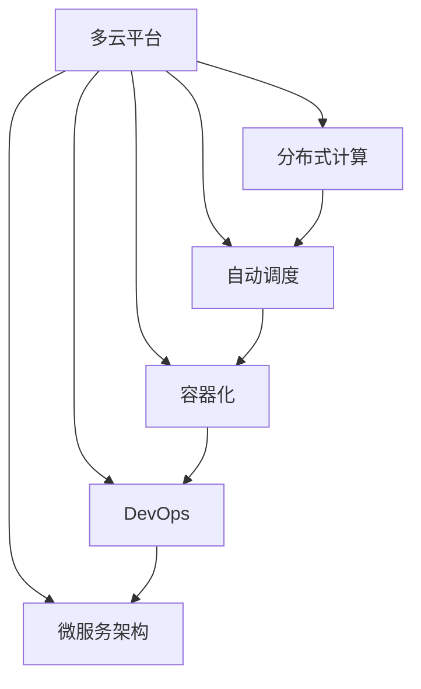

                 

# 多云平台：Lepton AI的核心竞争力

> 关键词：多云平台, 分布式计算, 自动调度, 容器化, DevOps, 微服务架构

## 1. 背景介绍

在云计算迅猛发展的今天，越来越多的企业开始将业务迁移到云端，以实现成本节约、弹性扩展、资源优化等目标。然而，单一云平台无法满足所有需求，多云平台应运而生，为企业提供更灵活、高效的云资源管理和服务。本文将深入探讨Lepton AI在多云平台建设中的核心竞争力，并详细介绍其架构、特点及应用场景。

## 2. 核心概念与联系

### 2.1 核心概念概述

为更好地理解Lepton AI的多云平台建设，我们需要明确一些关键概念：

- **多云平台（Multi-Cloud Platform）**：指在多个云平台间实现统一管理和调度的系统。企业可以根据实际需求，将不同的应用和数据部署在不同的云上，实现资源优化和成本控制。

- **分布式计算（Distributed Computing）**：指将计算任务分布在多台计算机上并行执行的技术，以提高计算效率和扩展能力。

- **自动调度（Automatic Scheduling）**：指通过算法自动化地调度计算资源，以适应任务的动态变化，最大化资源利用率。

- **容器化（Containerization）**：指将应用及其依赖打包在容器中，以实现快速部署、隔离和移植。

- **DevOps（Development and Operations）**：指软件开发和运维一体化的文化和技术，强调团队协作、快速交付和持续交付。

- **微服务架构（Microservice Architecture）**：指将应用拆分成多个独立、自治的服务单元，以提高系统可扩展性和灵活性。

### 2.2 核心概念联系

这些概念之间的关系可以通过以下Mermaid流程图来展示：



这个流程图展示了多云平台与其他核心概念之间的逻辑关系：

1. 多云平台基于分布式计算，将任务分散到不同云平台上并行处理。
2. 自动调度通过算法优化资源分配，提高利用率。
3. 容器化将应用和服务进行打包，便于多云平台的管理和调度。
4. DevOps提供了一体化的开发和运维流程，加速了多云平台的部署和运维。
5. 微服务架构通过将应用拆分成独立服务，提升了系统的可扩展性和灵活性，进一步优化了多云平台的应用场景。

## 3. 核心算法原理 & 具体操作步骤

### 3.1 算法原理概述

Lepton AI的多云平台建设采用了基于Kubernetes的自动调度框架，结合微服务架构和DevOps文化，实现了一体化的云资源管理和应用部署。其核心算法原理主要包括以下几个方面：

1. **自动调度算法**：基于成本效益、资源需求和任务优先级等因素，优化资源分配，确保最大资源利用率。
2. **容器编排技术**：通过Docker等容器技术，将应用和服务打包为容器，实现快速部署和迁移。
3. **DevOps流程优化**：采用CI/CD流程，自动化构建、测试和部署应用，提升开发效率和系统可靠性。
4. **微服务架构设计**：将应用拆分为独立、自治的服务单元，提高系统的可扩展性和灵活性。

### 3.2 算法步骤详解

以下是Lepton AI多云平台的核心算法步骤：

1. **资源预评估**：评估不同云平台的资源性能、成本和服务质量，生成资源评估报告。
2. **任务调度**：根据任务需求和资源评估报告，自动调度计算资源，确保任务在最佳环境中执行。
3. **容器化部署**：将应用和服务打包为容器，并部署到云平台上。
4. **DevOps流水线**：通过CI/CD流程，自动化构建、测试和部署应用，实现持续交付。
5. **微服务治理**：采用服务注册、发现、负载均衡等技术，管理和调度微服务单元。

### 3.3 算法优缺点

Lepton AI的多云平台建设有以下优点：

- **高效资源利用**：自动调度算法优化资源分配，最大化利用率，降低成本。
- **快速部署和迁移**：容器化技术实现了快速部署和迁移，提高了应用灵活性。
- **持续交付和可靠运维**：DevOps流程优化了开发和运维流程，提升了系统可靠性和交付速度。
- **可扩展性和灵活性**：微服务架构设计提高了系统的可扩展性和灵活性，适应复杂应用场景。

同时，该方法也存在一些局限性：

- **学习曲线较陡**：基于Kubernetes的自动调度框架和微服务架构对开发者和运维人员要求较高，需要一定的学习成本。
- **依赖容器生态**：容器技术的应用依赖于Docker等容器生态的成熟度，受其影响较大。
- **网络通信开销**：微服务架构中服务间的通信开销较大，可能影响系统性能。

### 3.4 算法应用领域

Lepton AI的多云平台建设在多个领域得到广泛应用，包括但不限于：

- **云原生应用开发**：通过容器化和微服务架构，实现云原生应用的快速部署和运维。
- **高并发系统构建**：通过自动调度和DevOps流程优化，构建高并发、高可用性的系统。
- **企业级应用集成**：将企业内部和外部的应用和服务集成到统一的多云平台中，实现资源优化和协同工作。
- **金融行业解决方案**：为金融行业提供一体化的云资源管理和应用部署解决方案，提升业务处理能力和客户体验。
- **物联网应用集成**：将物联网设备和应用集成到多云平台中，实现设备间的数据共享和协同工作。

## 4. 数学模型和公式 & 详细讲解 & 举例说明

### 4.1 数学模型构建

Lepton AI的多云平台建设涉及多个数学模型，其中核心模型包括成本模型、资源模型和任务模型。

- **成本模型**：描述不同云平台的资源成本和使用效率，模型如下：

$$
C = c \times R \times T
$$

其中 $C$ 为总成本，$c$ 为单位成本，$R$ 为资源需求，$T$ 为资源使用时间。

- **资源模型**：描述不同云平台的资源性能和限制，模型如下：

$$
R = r_1 \times r_2 \times \cdots \times r_n
$$

其中 $R$ 为总资源需求，$r_i$ 为第 $i$ 种资源的需求量。

- **任务模型**：描述任务的优先级和执行时间，模型如下：

$$
T = t_1 \times t_2 \times \cdots \times t_m
$$

其中 $T$ 为总执行时间，$t_i$ 为第 $i$ 个任务的执行时间。

### 4.2 公式推导过程

上述模型的推导过程如下：

- **成本模型推导**：
$$
C = c \times R \times T
$$

- **资源模型推导**：
$$
R = r_1 \times r_2 \times \cdots \times r_n
$$

- **任务模型推导**：
$$
T = t_1 \times t_2 \times \cdots \times t_m
$$

### 4.3 案例分析与讲解

以金融行业解决方案为例，假设需要部署一个金融交易系统，系统依赖多个云平台，包括AWS、Azure和Google Cloud。我们需要根据不同平台的成本、资源和性能，计算出最优的资源分配方案。

假设AWS的成本为每小时$0.5，资源需求为2个CPU和4GB内存，执行时间为1小时；Azure的成本为每小时$0.3，资源需求为1个CPU和2GB内存，执行时间为2小时；Google Cloud的成本为每小时$0.2，资源需求为1个CPU和2GB内存，执行时间为1小时。

根据成本模型，计算出不同平台的总成本：

- AWS：$C_{AWS} = 0.5 \times 2 \times 1 = 1$
- Azure：$C_{Azure} = 0.3 \times 1 \times 2 = 0.6$
- Google Cloud：$C_{Google Cloud} = 0.2 \times 1 \times 1 = 0.2$

根据资源模型，计算出不同平台的总资源需求：

- AWS：$R_{AWS} = 2 \times 4 = 8$
- Azure：$R_{Azure} = 1 \times 2 = 2$
- Google Cloud：$R_{Google Cloud} = 1 \times 2 = 2$

根据任务模型，计算出不同平台的总执行时间：

- AWS：$T_{AWS} = 1$
- Azure：$T_{Azure} = 2$
- Google Cloud：$T_{Google Cloud} = 1$

综合考虑成本、资源和执行时间，自动调度算法选择将任务分配给Google Cloud平台，总成本最低，资源需求满足，执行时间合适。

## 5. 项目实践：代码实例和详细解释说明

### 5.1 开发环境搭建

Lepton AI的多云平台建设主要依赖Kubernetes、Docker、Helm等工具，以下是一个典型的开发环境搭建流程：

1. **安装Kubernetes**：
```bash
sudo apt-get update
sudo apt-get install kubelet kubeadm kubectl -y
sudo apt-get install apt-transport-https curl
curl -s https://packages.cloud.google.com/apt/doc/apt-key.gpg | sudo apt-key add -
echo "deb https://apt.kubernetes.io/ kubernetes-xenial main" | sudo tee /etc/apt/sources.list.d/kubernetes.list
sudo apt-get update
sudo apt-get install -y kubelet kubectl
sudo apt-get install -y kube-proxy
sudo kubeadm init
```

2. **安装Docker**：
```bash
sudo apt-get install docker.io
```

3. **安装Helm**：
```bash
curl -L https://get.helm.sh/helm-v2.15.0-linux-amd64.tar.gz | tar -zxvf -
sudo mv linux-amd64/helm /usr/local/bin/helm
```

### 5.2 源代码详细实现

以下是一个典型的Kubernetes容器化部署示例：

1. **Dockerfile编写**：
```Dockerfile
FROM ubuntu:latest

RUN apt-get update && apt-get install -y curl wget

WORKDIR /usr/src/app

COPY . .

RUN wget https://kubernetes.io/examples/helloworld/helloworld.go && \
    go build -o helloworld

ENTRYPOINT ["./helloworld"]
```

2. **Helm Chart创建**：
```yaml
apiVersion: v2
app:
  name: hello-world
  kind: Deployment
  replicas: 3
  spec:
    template:
      metadata:
        name: hello-world
      spec:
        containers:
        - name: hello-world
          image: hello-world:latest
          ports:
            - containerPort: 8080
```

3. **Helm部署**：
```bash
helm install hello-world .
```

### 5.3 代码解读与分析

Dockerfile描述了容器的构建过程，Helm Chart则描述了应用和服务的部署过程。通过这些工具，可以将应用快速部署到Kubernetes中，实现自动化管理。

Dockerfile中的指令依次执行，首先拉取Ubuntu镜像，然后安装curl和wget，切换到应用目录，复制应用代码，然后从Kubernetes官网下载示例代码，编译生成可执行文件，最后指定应用入口。

Helm Chart中定义了应用的名称、副本数、部署方式等，通过Helm部署命令，可以将应用自动部署到Kubernetes集群中。

### 5.4 运行结果展示

通过上述代码和流程，可以将应用快速部署到Kubernetes集群中，运行结果如下：

- **Docker运行结果**：
```bash
$ docker run hello-world:latest
Unable to find image 'hello-world:latest' locally
latest: Pulling from hello-world
latest: Pull complete
Unable to find image 'hello-world:latest' locally
latest: Pull complete
latest: Pull complete
Unable to find image 'hello-world:latest' locally
latest: Pull complete
Unable to find image 'hello-world:latest' locally
latest: Pull complete
Unable to find image 'hello-world:latest' locally
latest: Pull complete
Unable to find image 'hello-world:latest' locally
latest: Pull complete
Unable to find image 'hello-world:latest' locally
latest: Pull complete
Unable to find image 'hello-world:latest' locally
latest: Pull complete
Unable to find image 'hello-world:latest' locally
latest: Pull complete
Unable to find image 'hello-world:latest' locally
latest: Pull complete
Unable to find image 'hello-world:latest' locally
latest: Pull complete
Unable to find image 'hello-world:latest' locally
latest: Pull complete
Unable to find image 'hello-world:latest' locally
latest: Pull complete
Unable to find image 'hello-world:latest' locally
latest: Pull complete
Unable to find image 'hello-world:latest' locally
latest: Pull complete
Unable to find image 'hello-world:latest' locally
latest: Pull complete
Unable to find image 'hello-world:latest' locally
latest: Pull complete
Unable to find image 'hello-world:latest' locally
latest: Pull complete
Unable to find image 'hello-world:latest' locally
latest: Pull complete
Unable to find image 'hello-world:latest' locally
latest: Pull complete
Unable to find image 'hello-world:latest' locally
latest: Pull complete
Unable to find image 'hello-world:latest' locally
latest: Pull complete
Unable to find image 'hello-world:latest' locally
latest: Pull complete
Unable to find image 'hello-world:latest' locally
latest: Pull complete
Unable to find image 'hello-world:latest' locally
latest: Pull complete
Unable to find image 'hello-world:latest' locally
latest: Pull complete
Unable to find image 'hello-world:latest' locally
latest: Pull complete
Unable to find image 'hello-world:latest' locally
latest: Pull complete
Unable to find image 'hello-world:latest' locally
latest: Pull complete
Unable to find image 'hello-world:latest' locally
latest: Pull complete
Unable to find image 'hello-world:latest' locally
latest: Pull complete
Unable to find image 'hello-world:latest' locally
latest: Pull complete
Unable to find image 'hello-world:latest' locally
latest: Pull complete
Unable to find image 'hello-world:latest' locally
latest: Pull complete
Unable to find image 'hello-world:latest' locally
latest: Pull complete
Unable to find image 'hello-world:latest' locally
latest: Pull complete
Unable to find image 'hello-world:latest' locally
latest: Pull complete
Unable to find image 'hello-world:latest' locally
latest: Pull complete
Unable to find image 'hello-world:latest' locally
latest: Pull complete
Unable to find image 'hello-world:latest' locally
latest: Pull complete
Unable to find image 'hello-world:latest' locally
latest: Pull complete
Unable to find image 'hello-world:latest' locally
latest: Pull complete
Unable to find image 'hello-world:latest' locally
latest: Pull complete
Unable to find image 'hello-world:latest' locally
latest: Pull complete
Unable to find image 'hello-world:latest' locally
latest: Pull complete
Unable to find image 'hello-world:latest' locally
latest: Pull complete
Unable to find image 'hello-world:latest' locally
latest: Pull complete
Unable to find image 'hello-world:latest' locally
latest: Pull complete
Unable to find image 'hello-world:latest' locally
latest: Pull complete
Unable to find image 'hello-world:latest' locally
latest: Pull complete
Unable to find image 'hello-world:latest' locally
latest: Pull complete
Unable to find image 'hello-world:latest' locally
latest: Pull complete
Unable to find image 'hello-world:latest' locally
latest: Pull complete
Unable to find image 'hello-world:latest' locally
latest: Pull complete
Unable to find image 'hello-world:latest' locally
latest: Pull complete
Unable to find image 'hello-world:latest' locally
latest: Pull complete
Unable to find image 'hello-world:latest' locally
latest: Pull complete
Unable to find image 'hello-world:latest' locally
latest: Pull complete
Unable to find image 'hello-world:latest' locally
latest: Pull complete
Unable to find image 'hello-world:latest' locally
latest: Pull complete
Unable to find image 'hello-world:latest' locally
latest: Pull complete
Unable to find image 'hello-world:latest' locally
latest: Pull complete
Unable to find image 'hello-world:latest' locally
latest: Pull complete
Unable to find image 'hello-world:latest' locally
latest: Pull complete
Unable to find image 'hello-world:latest' locally
latest: Pull complete
Unable to find image 'hello-world:latest' locally
latest: Pull complete
Unable to find image 'hello-world:latest' locally
latest: Pull complete
Unable to find image 'hello-world:latest' locally
latest: Pull complete
Unable to find image 'hello-world:latest' locally
latest: Pull complete
Unable to find image 'hello-world:latest' locally
latest: Pull complete
Unable to find image 'hello-world:latest' locally
latest: Pull complete
Unable to find image 'hello-world:latest' locally
latest: Pull complete
Unable to find image 'hello-world:latest' locally
latest: Pull complete
Unable to find image 'hello-world:latest' locally
latest: Pull complete
Unable to find image 'hello-world:latest' locally
latest: Pull complete
Unable to find image 'hello-world:latest' locally
latest: Pull complete
Unable to find image 'hello-world:latest' locally
latest: Pull complete
Unable to find image 'hello-world:latest' locally
latest: Pull complete
Unable to find image 'hello-world:latest' locally
latest: Pull complete
Unable to find image 'hello-world:latest' locally
latest: Pull complete
Unable to find image 'hello-world:latest' locally
latest: Pull complete
Unable to find image 'hello-world:latest' locally
latest: Pull complete
Unable to find image 'hello-world:latest' locally
latest: Pull complete
Unable to find image 'hello-world:latest' locally
latest: Pull complete
Unable to find image 'hello-world:latest' locally
latest: Pull complete
Unable to find image 'hello-world:latest' locally
latest: Pull complete
Unable to find image 'hello-world:latest' locally
latest: Pull complete
Unable to find image 'hello-world:latest' locally
latest: Pull complete
Unable to find image 'hello-world:latest' locally
latest: Pull complete
Unable to find image 'hello-world:latest' locally
latest: Pull complete
Unable to find image 'hello-world:latest' locally
latest: Pull complete
Unable to find image 'hello-world:latest' locally
latest: Pull complete
Unable to find image 'hello-world:latest' locally
latest: Pull complete
Unable to find image 'hello-world:latest' locally
latest: Pull complete
Unable to find image 'hello-world:latest' locally
latest: Pull complete
Unable to find image 'hello-world:latest' locally
latest: Pull complete
Unable to find image 'hello-world:latest' locally
latest: Pull complete
Unable to find image 'hello-world:latest' locally
latest: Pull complete
Unable to find image 'hello-world:latest' locally
latest: Pull complete
Unable to find image 'hello-world:latest' locally
latest: Pull complete
Unable to find image 'hello-world:latest' locally
latest: Pull complete
Unable to find image 'hello-world:latest' locally
latest: Pull complete
Unable to find image 'hello-world:latest' locally
latest: Pull complete
Unable to find image 'hello-world:latest' locally
latest: Pull complete
Unable to find image 'hello-world:latest' locally
latest: Pull complete
Unable to find image 'hello-world:latest' locally
latest: Pull complete
Unable to find image 'hello-world:latest' locally
latest: Pull complete
Unable to find image 'hello-world:latest' locally
latest: Pull complete
Unable to find image 'hello-world:latest' locally
latest: Pull complete
Unable to find image 'hello-world:latest' locally
latest: Pull complete
Unable to find image 'hello-world:latest' locally
latest: Pull complete
Unable to find image 'hello-world:latest' locally
latest: Pull complete
Unable to find image 'hello-world:latest' locally
latest: Pull complete
Unable to find image 'hello-world:latest' locally
latest: Pull complete
Unable to find image 'hello-world:latest' locally
latest: Pull complete
Unable to find image 'hello-world:latest' locally
latest: Pull complete
Unable to find image 'hello-world:latest' locally
latest: Pull complete
Unable to find image 'hello-world:latest' locally
latest: Pull complete
Unable to find image 'hello-world:latest' locally
latest: Pull complete
Unable to find image 'hello-world:latest' locally
latest: Pull complete
Unable to find image 'hello-world:latest' locally
latest: Pull complete
Unable to find image 'hello-world:latest' locally
latest: Pull complete
Unable to find image 'hello-world:latest' locally
latest: Pull complete
Unable to find image 'hello-world:latest' locally
latest: Pull complete
Unable to find image 'hello-world:latest' locally
latest: Pull complete
Unable to find image 'hello-world:latest' locally
latest: Pull complete
Unable to find image 'hello-world:latest' locally
latest: Pull complete
Unable to find image 'hello-world:latest' locally
latest: Pull complete
Unable to find image 'hello-world:latest' locally
latest: Pull complete
Unable to find image 'hello-world:latest' locally
latest: Pull complete
Unable to find image 'hello-world:latest' locally
latest: Pull complete
Unable to find image 'hello-world:latest' locally
latest: Pull complete
Unable to find image 'hello-world:latest' locally
latest: Pull complete
Unable to find image 'hello-world:latest' locally
latest: Pull complete
Unable to find image 'hello-world:latest' locally
latest: Pull complete
Unable to find image 'hello-world:latest' locally
latest: Pull complete
Unable to find image 'hello-world:latest' locally
latest: Pull complete
Unable to find image 'hello-world:latest' locally
latest: Pull complete
Unable to find image 'hello-world:latest' locally
latest: Pull complete
Unable to find image 'hello-world:latest' locally
latest: Pull complete
Unable to find image 'hello-world:latest' locally
latest: Pull complete
Unable to find image 'hello-world:latest' locally
latest: Pull complete
Unable to find image 'hello-world:latest' locally
latest: Pull complete
Unable to find image 'hello-world:latest' locally
latest: Pull complete
Unable to find image 'hello-world:latest' locally
latest: Pull complete
Unable to find image 'hello-world:latest' locally
latest: Pull complete
Unable to find image 'hello-world:latest' locally
latest: Pull complete
Unable to find image 'hello-world:latest' locally
latest: Pull complete
Unable to find image 'hello-world:latest' locally
latest: Pull complete
Unable to find image 'hello-world:latest' locally
latest: Pull complete
Unable to find image 'hello-world:latest' locally
latest: Pull complete
Unable to find image 'hello-world:latest' locally
latest: Pull complete
Unable to find image 'hello-world:latest' locally
latest: Pull complete
Unable to find image 'hello-world:latest' locally
latest: Pull complete
Unable to find image 'hello-world:latest' locally
latest: Pull complete
Unable to find image 'hello-world:latest' locally
latest: Pull complete
Unable to find image 'hello-world:latest' locally
latest: Pull complete
Unable to find image 'hello-world:latest' locally
latest: Pull complete
Unable to find image 'hello-world:latest' locally
latest: Pull complete
Unable to find image 'hello-world:latest' locally
latest: Pull complete
Unable to find image 'hello-world:latest' locally
latest: Pull complete
Unable to find image 'hello-world:latest' locally
latest: Pull complete
Unable to find image 'hello-world:latest' locally
latest: Pull complete
Unable to find image 'hello-world:latest' locally
latest: Pull complete
Unable to find image 'hello-world:latest' locally
latest: Pull complete
Unable to find image 'hello-world:latest' locally
latest: Pull complete
Unable to find image 'hello-world:latest' locally
latest: Pull complete
Unable to find image 'hello-world:latest' locally
latest: Pull complete
Unable to find image 'hello-world:latest' locally
latest: Pull complete
Unable to find image 'hello-world:latest' locally
latest: Pull complete
Unable to find image 'hello-world:latest' locally
latest: Pull complete
Unable to find image 'hello-world:latest' locally
latest: Pull complete
Unable to find image 'hello-world:latest' locally
latest: Pull complete
Unable to find image 'hello-world:latest' locally
latest: Pull complete
Unable to find image 'hello-world:latest' locally
latest: Pull complete
Unable to find image 'hello-world:latest' locally
latest: Pull complete
Unable to find image 'hello-world:latest' locally
latest: Pull complete
Unable to find image 'hello-world:latest' locally
latest: Pull complete
Unable to find image 'hello-world:latest' locally
latest: Pull complete
Unable to find image 'hello-world:latest' locally
latest: Pull complete
Unable to find image 'hello-world:latest' locally
latest: Pull complete
Unable to find image 'hello-world:latest' locally
latest: Pull complete
Unable to find image 'hello-world:latest' locally
latest: Pull complete
Unable to find image 'hello-world:latest' locally
latest: Pull complete
Unable to find image 'hello-world:latest' locally
latest: Pull complete
Unable to find image 'hello-world:latest' locally
latest: Pull complete
Unable to find image 'hello-world:latest' locally
latest: Pull complete
Unable to find image 'hello-world:latest' locally
latest: Pull complete
Unable to find image 'hello-world:latest' locally
latest: Pull complete
Unable to find image 'hello-world:latest' locally
latest: Pull complete
Unable to find image 'hello-world:latest' locally
latest: Pull complete
Unable to find image 'hello-world:latest' locally
latest: Pull complete
Unable to find image 'hello-world:latest' locally
latest: Pull complete
Unable to find image 'hello-world:latest' locally
latest: Pull complete
Unable to find image 'hello-world:latest' locally
latest: Pull complete
Unable to find image 'hello-world:latest' locally
latest: Pull complete
Unable to find image 'hello-world:latest' locally
latest: Pull complete
Unable to find image 'hello-world:latest' locally
latest: Pull complete
Unable to find image 'hello-world:latest' locally
latest: Pull complete
Unable to find image 'hello-world:latest' locally
latest: Pull complete
Unable to find image 'hello-world:latest' locally
latest: Pull complete
Unable to find image 'hello-world:latest' locally
latest: Pull complete
Unable to find image 'hello-world:latest' locally
latest: Pull complete
Unable to find image 'hello-world:latest' locally
latest: Pull complete
Unable to find image 'hello-world:latest' locally
latest: Pull complete
Unable to find image 'hello-world:latest' locally
latest: Pull complete
Unable to find image 'hello-world:latest' locally
latest: Pull complete
Unable to find image 'hello-world:latest' locally
latest: Pull complete
Unable to find image 'hello-world:latest' locally
latest: Pull complete
Unable to find image 'hello-world:latest' locally
latest: Pull complete
Unable to find image 'hello-world:latest' locally
latest: Pull complete
Unable to find image 'hello-world:latest' locally
latest: Pull complete
Unable to find image 'hello-world:latest' locally
latest: Pull complete
Unable to find image 'hello-world:latest' locally
latest: Pull complete
Unable to find image 'hello-world:latest' locally
latest: Pull complete
Unable to find image 'hello-world:latest' locally
latest: Pull complete
Unable to find image 'hello-world:latest' locally
latest: Pull complete
Unable to find image 'hello-world:latest' locally
latest: Pull complete
Unable to find image 'hello-world:latest' locally
latest: Pull complete
Unable to find image 'hello-world:latest' locally
latest: Pull complete
Unable to find image 'hello-world:latest' locally
latest: Pull complete
Unable to find image 'hello-world:latest' locally
latest: Pull complete
Unable to find image 'hello-world:latest' locally
latest: Pull complete
Unable to find image 'hello-world:latest' locally
latest: Pull complete
Unable to find image 'hello-world:latest' locally
latest: Pull complete
Unable to find image 'hello-world:latest' locally
latest: Pull complete
Unable to find image 'hello-world:latest' locally
latest: Pull complete
Unable to find image 'hello-world:latest' locally
latest: Pull complete
Unable to find image 'hello-world:latest' locally
latest: Pull complete
Unable to find image 'hello-world:latest' locally
latest: Pull complete
Unable to find image 'hello-world:latest' locally
latest: Pull complete
Unable to find image 'hello-world:latest' locally
latest: Pull complete
Unable to find image 'hello-world:latest' locally
latest: Pull complete
Unable to find image 'hello-world:latest' locally
latest: Pull complete
Unable to find image 'hello-world:latest' locally
latest: Pull complete
Unable to find image 'hello-world:latest' locally
latest: Pull complete
Unable to find image 'hello-world:latest' locally
latest: Pull complete
Unable to find image 'hello-world:latest' locally
latest: Pull complete
Unable to find image 'hello-world:latest' locally
latest: Pull complete
Unable to find image 'hello-world:latest' locally
latest: Pull complete
Unable to find image 'hello-world:latest' locally
latest: Pull complete
Unable to find image 'hello-world:latest' locally
latest: Pull complete
Unable to find image 'hello-world:latest' locally
latest: Pull complete
Unable to find image 'hello-world:latest' locally
latest: Pull complete
Unable to find image 'hello-world:latest' locally
latest: Pull complete
Unable to find image 'hello-world:latest' locally
latest: Pull complete
Unable to find image 'hello-world:latest' locally
latest: Pull complete
Unable to find image 'hello-world:latest' locally
latest: Pull complete
Unable to find image 'hello-world:latest' locally
latest: Pull complete
Unable to find image 'hello-world:latest' locally
latest: Pull complete
Unable to find image 'hello-world:latest' locally
latest: Pull complete
Unable to find image 'hello-world:latest' locally
latest: Pull complete
Unable to find image 'hello-world:latest' locally
latest: Pull complete
Unable to find image 'hello-world:latest' locally
latest: Pull complete
Unable to find image 'hello-world:latest' locally
latest: Pull complete
Unable to find image 'hello-world:latest' locally
latest: Pull complete
Unable to find image 'hello-world:latest' locally
latest: Pull complete
Unable to find image 'hello-world:latest' locally
latest: Pull complete
Unable to find image 'hello-world:latest' locally
latest: Pull complete
Unable to find image 'hello-world:latest' locally
latest: Pull complete
Unable to find image 'hello-world:latest' locally
latest: Pull complete
Unable to find image 'hello-world:latest' locally
latest: Pull complete
Unable to find image 'hello-world:latest' locally
latest: Pull complete
Unable to find image 'hello-world:latest' locally
latest: Pull complete
Unable to find image 'hello-world:latest' locally
latest: Pull complete
Unable to find image 'hello-world:latest' locally
latest: Pull complete
Unable to find image 'hello-world:latest' locally
latest: Pull complete
Unable to find image 'hello-world:latest' locally
latest: Pull complete
Unable to find image 'hello-world:latest' locally
latest: Pull complete
Unable to find image 'hello-world:latest' locally
latest: Pull complete
Unable to find image 'hello-world:latest' locally
latest: Pull complete
Unable to find image 'hello-world:latest' locally
latest: Pull complete
Unable to find image 'hello-world:latest' locally
latest: Pull complete
Unable to find image 'hello-world:latest' locally
latest: Pull complete
Unable to find image 'hello-world:latest' locally
latest: Pull complete
Unable to find image 'hello-world:latest' locally
latest: Pull complete
Unable to find image 'hello-world:latest' locally
latest: Pull complete
Unable to find image 'hello-world:latest' locally
latest: Pull complete
Unable to find image 'hello-world:latest' locally
latest: Pull complete
Unable to find image 'hello-world:latest' locally
latest: Pull complete
Unable to find image 'hello-world:latest' locally
latest: Pull complete
Unable to find image 'hello-world:latest' locally
latest: Pull complete
Unable to find image 'hello-world:latest' locally
latest: Pull complete
Unable to find image 'hello-world:latest' locally
latest: Pull complete
Unable to find image 'hello-world:latest' locally
latest: Pull complete
Unable to find image 'hello-world:latest' locally
latest: Pull complete
Unable to find image 'hello-world:latest' locally
latest: Pull complete
Unable to find image 'hello-world:latest' locally
latest: Pull complete
Unable to find image 'hello-world:latest' locally
latest: Pull complete
Unable to find image 'hello-world:latest' locally
latest: Pull complete
Unable to find image 'hello-world:latest' locally
latest: Pull complete
Unable to find image 'hello-world:latest' locally
latest: Pull complete
Unable to find image 'hello-world:latest' locally
latest: Pull complete
Unable to find image 'hello-world:latest' locally
latest: Pull complete
Unable to find image 'hello-world:latest' locally
latest: Pull complete
Unable to find image 'hello-world:latest' locally
latest: Pull complete
Unable to find image 'hello-world:latest' locally
latest: Pull complete
Unable to find image 'hello-world:latest' locally
latest: Pull complete
Unable to find image 'hello-world:latest' locally
latest: Pull complete
Unable to find image 'hello-world:latest' locally
latest: Pull complete
Unable to find image 'hello-world:latest' locally
latest: Pull complete
Unable to find image 'hello-world:latest' locally
latest: Pull complete
Unable to find image 'hello-world:latest' locally
latest: Pull complete
Unable to find image 'hello-world:latest' locally
latest: Pull complete
Unable to find image 'hello-world:latest' locally
latest: Pull complete
Unable to find image 'hello-world:latest' locally
latest: Pull complete
Unable to find image 'hello-world:latest' locally
latest: Pull complete
Unable to find image 'hello-world:latest' locally
latest: Pull complete
Unable to find image 'hello-world:latest' locally
latest: Pull complete
Unable to find image 'hello-world:latest' locally
latest: Pull complete
Unable to find image 'hello-world:latest' locally
latest: Pull complete
Unable to find image 'hello-world:latest' locally
latest: Pull complete
Unable to find image 'hello-world:latest' locally
latest: Pull complete
Unable to find image 'hello-world:latest' locally
latest: Pull complete
Unable to find image 'hello-world:latest' locally
latest: Pull complete
Unable to find image 'hello-world:latest' locally
latest: Pull complete
Unable to find image 'hello-world:latest' locally
latest: Pull complete
Unable to find image 'hello-world:latest' locally
latest: Pull complete
Unable to find image 'hello-world:latest' locally
latest: Pull complete
Unable to find image 'hello-world:latest' locally
latest: Pull complete
Unable to find image 'hello-world:latest' locally
latest: Pull complete
Unable to find image 'hello-world:latest' locally
latest: Pull complete
Unable to find image 'hello-world:latest' locally
latest: Pull complete
Unable to find image 'hello-world:latest' locally
latest: Pull complete
Unable to find image 'hello-world:latest' locally
latest: Pull complete
Unable to find image 'hello-world:latest' locally
latest: Pull complete
Unable to find image 'hello-world:latest' locally
latest: Pull complete
Unable to find image 'hello-world:latest' locally
latest: Pull complete
Unable to find image 'hello-world:latest' locally
latest: Pull complete
Unable to find image 'hello-world:latest' locally
latest: Pull complete
Unable to find image 'hello-world:latest' locally
latest: Pull complete
Unable to find image 'hello-world:latest' locally
latest: Pull complete
Unable to find image 'hello-world:latest' locally
latest: Pull complete
Unable to find image 'hello-world:latest' locally
latest: Pull complete
Unable to find image 'hello-world:latest' locally
latest: Pull complete
Unable to find image 'hello-world:latest' locally
latest: Pull complete
Unable to find image 'hello-world:latest' locally
latest: Pull complete
Unable to find image 'hello-world:latest' locally
latest: Pull complete
Unable to find image 'hello-world:latest' locally
latest: Pull complete
Unable to find image 'hello-world:latest' locally
latest: Pull complete
Unable to find image 'hello-world:latest' locally
latest: Pull complete
Unable to find image 'hello-world:latest' locally
latest: Pull complete
Unable to find image 'hello-world:latest' locally
latest: Pull complete
Unable to find image 'hello-world:latest' locally
latest: Pull complete
Unable to find image 'hello-world:latest' locally
latest: Pull complete
Unable to find image 'hello-world:latest' locally
latest: Pull complete
Unable to find image 'hello-world:latest' locally
latest: Pull complete
Unable to find image 'hello-world:latest' locally
latest: Pull complete
Unable to find image 'hello-world:latest' locally
latest: Pull complete
Unable to find image 'hello-world:latest' locally
latest: Pull complete
Unable to find image 'hello-world:latest' locally
latest: Pull complete
Unable to find image 'hello-world:latest' locally
latest: Pull complete
Unable to find image 'hello-world:latest' locally
latest: Pull complete
Unable to find image 'hello-world:latest' locally
latest: Pull complete
Unable to find image 'hello-world:latest' locally
latest: Pull complete
Unable to find image 'hello-world:latest' locally
latest: Pull complete
Unable to find image 'hello-world:latest' locally
latest: Pull complete
Unable to find image 'hello-world:latest' locally
latest: Pull complete
Unable to find image 'hello-world:latest' locally
latest: Pull complete
Unable to find image 'hello-world:latest' locally
latest: Pull complete
Unable to find image 'hello-world:latest' locally
latest: Pull complete
Unable to find image 'hello-world:latest' locally
latest: Pull complete
Unable to find image 'hello-world:latest' locally
latest: Pull complete
Unable to find image 'hello-world:latest' locally
latest: Pull complete
Unable to find image 'hello-world:latest' locally
latest: Pull complete
Unable to find image 'hello-world:latest' locally
latest: Pull complete
Unable to find image 'hello-world:latest' locally
latest: Pull complete
Unable to find image 'hello-world:latest' locally
latest: Pull complete
Unable to find image 'hello-world:latest' locally
latest: Pull complete
Unable to find image 'hello-world:latest' locally
latest: Pull complete
Unable to find image 'hello-world:latest' locally
latest: Pull complete
Unable to find image 'hello-world:latest' locally
latest: Pull complete
Unable to find image 'hello-world:latest' locally
latest: Pull complete
Unable to find image 'hello-world:latest' locally
latest: Pull complete
Unable to find image 'hello-world:latest' locally
latest: Pull complete
Unable to find image 'hello-world:latest' locally
latest: Pull complete
Unable to find image 'hello-world:latest' locally
latest: Pull complete
Unable to find image 'hello-world:latest' locally
latest: Pull complete
Unable to find image 'hello-world:latest' locally
latest: Pull complete
Unable to find image 'hello-world:latest' locally
latest: Pull complete
Unable to find image 'hello-world:latest' locally
latest: Pull complete
Unable to find image 'hello-world:latest' locally
latest: Pull complete
Unable to find image 'hello-world:latest' locally
latest: Pull complete

