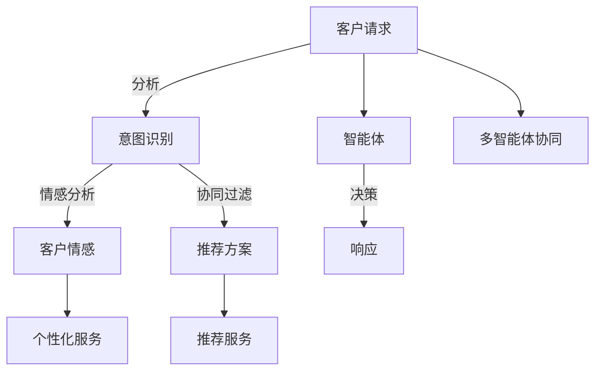

                 

## 1. 背景介绍

在数字化转型浪潮中，智能客服系统正成为企业提高客户满意度和运营效率的重要工具。传统的客服系统往往依赖于人工客服，存在响应时间长、效率低、服务质量难以保障等问题。而通过引入多智能体协同机制，智能客服系统可以实现全天候、个性化、智能化的客户服务，大幅提升企业的客户体验和运营效率。本文将深入探讨多智能体协同机制在智能客服系统中的应用，包括其基本原理、关键技术、实施策略和实际效果等。

## 2. 核心概念与联系

### 2.1 核心概念概述

为了更清晰地理解多智能体协同机制在智能客服系统中的应用，我们将先介绍一些核心概念和相关技术。

**多智能体系统（Multi-Agent System,MAS）**：是指由多个具有独立决策能力的智能体（Agent）组成的分布式系统，智能体之间通过交互协作，实现复杂的系统行为和目标。在智能客服系统中，每个智能体可以代表一个客服机器人，处理不同的客户请求，并在需要时进行协同工作。

**智能体**：是一种能够自主感知环境、分析问题和执行决策的实体。在智能客服中，智能体可以模拟人类客服的行为，自动处理常见的客户请求，同时具备学习和适应的能力，不断提高服务质量。

**代理学习（Agent-Based Learning, ABP）**：指通过模拟智能体的行为和互动，学习系统的整体行为和目标优化方法。在智能客服系统中，代理学习可以帮助客服机器人理解客户意图，提高响应准确率。

**协同过滤（Collaborative Filtering, CF）**：是一种推荐算法，通过分析用户的行为数据，向用户推荐相似用户喜欢的产品或服务。在智能客服中，协同过滤可以帮助客服机器人根据客户历史行为，推荐合适的解决方案或产品。

**情感分析（Sentiment Analysis）**：是一种文本分析技术，用于识别和提取文本中的情感信息。在智能客服中，情感分析可以帮助客服机器人识别客户的情感状态，提供更加个性化的服务。

**意图识别（Intent Recognition）**：是指通过分析用户输入的自然语言，识别用户意图的方法。在智能客服中，意图识别是客服机器人理解客户需求的基础，可以决定智能体如何响应客户请求。

这些核心概念构成了智能客服系统的技术基础，下面我们将从算法原理和操作步骤角度，深入探讨多智能体协同机制的应用。

### 2.2 核心概念原理和架构的 Mermaid 流程图



这个流程图展示了智能客服系统中多智能体协同机制的基本流程：

1. 客户提出请求（A）。
2. 意图识别模块（B）对客户请求进行分析，识别客户意图。
3. 情感分析模块（C）对客户情感进行分析。
4. 协同过滤模块（D）根据客户历史行为，推荐合适的解决方案。
5. 根据意图识别和情感分析的结果，多个智能体（E）协作决策，生成响应方案（F）。
6. 个性化服务模块（G）根据客户情感和推荐结果，提供个性化服务。
7. 智能体之间通过多智能体协同机制（I）进行通信和协作，形成更优的决策方案。

## 3. 核心算法原理 & 具体操作步骤

### 3.1 算法原理概述

多智能体协同机制在智能客服系统中的应用，主要基于以下几个核心算法原理：

1. **意图识别算法**：利用自然语言处理（NLP）技术，对客户输入的自然语言进行分析和理解，识别客户的具体意图。常用的意图识别算法包括基于规则的方法、基于统计的方法和基于深度学习的方法。

2. **情感分析算法**：通过文本分析技术，对客户输入的文本进行情感分类，识别客户当前的情感状态（如愤怒、满意、困惑等）。常用的情感分析算法包括基于词典的方法、基于机器学习的方法和基于深度学习的方法。

3. **推荐算法**：根据客户历史行为和输入文本，使用协同过滤等推荐算法，为每位客户推荐合适的解决方案或产品。常用的推荐算法包括基于用户的协同过滤、基于物品的协同过滤和基于内容的协同过滤。

4. **多智能体协同算法**：设计多智能体之间的通信和协作协议，实现不同智能体之间的信息共享和任务分配，形成更优的响应方案。常用的多智能体协同算法包括协议机算法、进化算法和博弈论算法。

这些算法共同构成了智能客服系统中多智能体协同机制的技术框架，下面我们将从算法步骤和具体操作步骤角度，进一步探讨其实现细节。

### 3.2 算法步骤详解

#### 3.2.1 意图识别算法步骤

1. **数据预处理**：将客户输入的自然语言文本进行分词、词性标注、命名实体识别等预处理操作。

2. **特征提取**：使用TF-IDF、词嵌入（如Word2Vec、GloVe）等技术，将预处理后的文本转换为数值特征向量。

3. **训练模型**：使用SVM、逻辑回归、决策树、随机森林等分类算法，或者基于深度学习的循环神经网络（RNN）、长短时记忆网络（LSTM）、注意力机制（Attention）等模型，训练意图识别模型。

4. **意图分类**：将输入文本的特征向量输入到训练好的模型中，输出相应的意图类别。

#### 3.2.2 情感分析算法步骤

1. **情感词典构建**：收集和构建情感词典，包含词语的情感极性和强度信息。

2. **情感特征提取**：将客户输入的自然语言文本进行分词、词性标注、命名实体识别等预处理操作，然后使用情感词典对文本中的词语进行情感打分。

3. **情感强度计算**：根据文本中情感词典的情感强度得分，计算文本的情感强度得分。

4. **情感分类**：使用分类算法或深度学习模型，将情感强度得分转换为情感类别。

#### 3.2.3 推荐算法步骤

1. **用户行为数据收集**：收集每位客户的购买历史、浏览历史、评分记录等行为数据。

2. **用户行为特征提取**：使用TF-IDF、词嵌入等技术，将用户行为数据转换为数值特征向量。

3. **相似度计算**：使用余弦相似度、皮尔逊相关系数等方法，计算用户行为特征向量之间的相似度。

4. **推荐生成**：根据相似度计算结果和推荐算法，生成推荐方案。

#### 3.2.4 多智能体协同算法步骤

1. **通信协议设计**：设计智能体之间的通信协议，包括消息格式、消息交换方式等。

2. **任务分配算法**：设计任务分配算法，根据客户请求的复杂度和智能体的负荷，分配任务给合适的智能体。

3. **决策规则设计**：设计智能体之间的决策规则，包括信息共享、决策协商等。

4. **协同方案生成**：根据任务分配和决策规则，生成协同方案。

### 3.3 算法优缺点

#### 3.3.1 意图识别算法优缺点

**优点**：
- **准确率高**：基于深度学习的意图识别算法，具有较高的识别准确率。
- **可解释性好**：深度学习模型可以提供可视化的特征提取过程，便于理解和解释。

**缺点**：
- **数据需求大**：需要大量的标注数据进行训练，数据获取成本较高。
- **模型复杂度高**：深度学习模型需要较高的计算资源和存储空间，部署难度较大。

#### 3.3.2 情感分析算法优缺点

**优点**：
- **实时性强**：基于机器学习或深度学习的情感分析算法，可以在实时数据流中进行分析。
- **适用性广**：适用于多种文本语言和情感表达方式。

**缺点**：
- **误差率高**：情感词典和情感强度计算可能会存在误差，导致情感分类结果不准确。
- **模型训练难度大**：需要根据不同领域和情感表达方式，构建和调整情感词典和特征提取方法。

#### 3.3.3 推荐算法优缺点

**优点**：
- **个性化强**：可以根据用户历史行为和输入文本，提供个性化的推荐方案。
- **适用性强**：适用于多种推荐场景，如商品推荐、内容推荐等。

**缺点**：
- **冷启动问题**：新用户或新商品没有足够的历史行为数据，推荐效果较差。
- **数据隐私风险**：推荐算法需要收集用户行为数据，存在数据隐私和安全风险。

#### 3.3.4 多智能体协同算法优缺点

**优点**：
- **协同能力强**：通过智能体之间的通信和协作，可以实现更复杂、更灵活的系统行为。
- **适应性强**：可以根据不同的客户请求和环境变化，动态调整智能体的协作方式。

**缺点**：
- **通信开销大**：智能体之间的通信和协作需要占用额外的计算和存储资源。
- **决策复杂度高**：多智能体协同算法需要设计复杂的通信协议和决策规则，实现难度较大。

### 3.4 算法应用领域

多智能体协同机制在智能客服系统中的应用，主要涉及以下几个领域：

1. **客户服务**：通过智能体之间的协同，实现全天候、个性化、智能化的客户服务。智能体可以处理常见客户请求，如产品咨询、订单查询、投诉处理等。

2. **业务运营**：通过智能体之间的协同，实现业务运营的自动化和智能化。智能体可以自动处理订单、库存、物流等业务流程。

3. **市场营销**：通过智能体之间的协同，实现市场营销的精准化和个性化。智能体可以根据客户需求和反馈，推荐合适的产品或服务。

4. **客户管理**：通过智能体之间的协同，实现客户管理的自动化和智能化。智能体可以自动记录和分析客户行为数据，提供精准的客户画像和推荐方案。

5. **数据分析**：通过智能体之间的协同，实现数据的自动化分析和处理。智能体可以实时收集和分析客户请求数据，生成有价值的业务报告和洞察。

以上应用领域展示了多智能体协同机制在智能客服系统中的广泛应用，下面我们将从数学模型和公式角度，进一步探讨其实现细节。

## 4. 数学模型和公式 & 详细讲解

### 4.1 数学模型构建

在智能客服系统中，多智能体协同机制的应用可以抽象为如下数学模型：

**客户请求模型**：
$$
\begin{aligned}
X_t &= f_t(X_{t-1}, a_t, \theta) \\
Y_t &= g_t(X_t, b_t, \phi)
\end{aligned}
$$

其中，$X_t$ 表示客户在时刻$t$的请求状态，$f_t$ 表示客户请求的演化函数，$a_t$ 表示智能体在时刻$t$的决策，$\theta$ 表示意图识别模型的参数。$Y_t$ 表示客户在时刻$t$的情感状态，$g_t$ 表示情感演化的函数，$b_t$ 表示情感分析模型的参数，$\phi$ 表示协同过滤模型的参数。

**智能体决策模型**：
$$
a_t = \alpha_t \cdot \delta(X_t, b_t, \phi) + (1-\alpha_t) \cdot \beta_t
$$

其中，$a_t$ 表示智能体在时刻$t$的决策，$\alpha_t$ 表示智能体在协同中的信任度，$\delta(X_t, b_t, \phi)$ 表示智能体之间的决策协商函数，$\beta_t$ 表示智能体独立决策的概率。

**多智能体协同模型**：
$$
\begin{aligned}
\Delta_t &= m_t(X_t, \gamma_t) \\
X_{t+1} &= X_t + \Delta_t
\end{aligned}
$$

其中，$\Delta_t$ 表示智能体之间的协同决策，$m_t$ 表示多智能体协同算法，$\gamma_t$ 表示多智能体协同参数。$X_{t+1}$ 表示客户在时刻$t+1$的请求状态。

### 4.2 公式推导过程

#### 4.2.1 意图识别公式推导

设客户在时刻$t$的请求状态为$X_t$，智能体在时刻$t$的决策为$a_t$，意图识别模型为$f_t$，则意图识别的数学模型可以表示为：
$$
X_{t+1} = f_t(X_t, a_t, \theta)
$$

其中，$\theta$ 表示意图识别模型的参数。设输入文本为$x_t$，输出意图为$y_t$，则意图识别的目标函数可以表示为：
$$
\min_{\theta} \frac{1}{N} \sum_{i=1}^N \ell(f_t(x_i, a_t, \theta), y_i)
$$

其中，$\ell$ 表示意图识别的损失函数，$N$ 表示训练数据样本的数量。

#### 4.2.2 情感分析公式推导

设客户在时刻$t$的情感状态为$Y_t$，情感分析模型为$g_t$，则情感分析的数学模型可以表示为：
$$
Y_{t+1} = g_t(X_t, b_t, \phi)
$$

其中，$b_t$ 表示情感分析模型的参数。设输入文本为$x_t$，输出情感为$y_t$，则情感分析的目标函数可以表示为：
$$
\min_{b_t} \frac{1}{N} \sum_{i=1}^N \ell(g_t(x_i, b_t, \phi), y_i)
$$

其中，$\ell$ 表示情感分析的损失函数，$N$ 表示训练数据样本的数量。

#### 4.2.3 推荐算法公式推导

设客户在时刻$t$的请求状态为$X_t$，智能体在时刻$t$的决策为$a_t$，协同过滤模型为$m_t$，则协同过滤的数学模型可以表示为：
$$
a_t = \alpha_t \cdot \delta(X_t, b_t, \phi) + (1-\alpha_t) \cdot \beta_t
$$

其中，$\alpha_t$ 表示智能体在协同中的信任度，$\delta(X_t, b_t, \phi)$ 表示智能体之间的决策协商函数，$\beta_t$ 表示智能体独立决策的概率。设推荐方案为$r_t$，目标函数可以表示为：
$$
\min_{\alpha_t, \beta_t} \frac{1}{N} \sum_{i=1}^N \ell(a_t, r_i)
$$

其中，$\ell$ 表示推荐的损失函数，$N$ 表示训练数据样本的数量。

#### 4.2.4 多智能体协同公式推导

设客户在时刻$t$的请求状态为$X_t$，智能体在时刻$t$的决策为$a_t$，多智能体协同算法为$m_t$，则多智能体协同的数学模型可以表示为：
$$
\Delta_t = m_t(X_t, \gamma_t)
$$

其中，$\gamma_t$ 表示多智能体协同参数。设客户在时刻$t+1$的请求状态为$X_{t+1}$，则多智能体协同的目标函数可以表示为：
$$
\min_{\gamma_t} \frac{1}{N} \sum_{i=1}^N \ell(X_{t+1}, X_{t+1}^{(i)})
$$

其中，$\ell$ 表示协同的目标函数，$N$ 表示训练数据样本的数量，$X_{t+1}^{(i)}$ 表示客户在时刻$t+1$的第$i$个智能体的协同响应。

### 4.3 案例分析与讲解

以电商平台的智能客服系统为例，分析多智能体协同机制的具体应用。

1. **客户请求分析**：电商平台的智能客服系统可以处理用户的订单查询、退换货请求、售后咨询等常见问题。系统通过意图识别模型对客户请求进行分类，将相同类别的请求分配给相同的智能体进行处理。

2. **情感分析应用**：智能体在处理客户请求时，使用情感分析模型对客户输入的文本进行情感分类，识别客户的情感状态。例如，当客户表达不满时，系统自动将问题升级，分配给更高级别的客服进行处理。

3. **推荐算法应用**：智能体在处理客户请求时，使用推荐算法根据客户的历史行为和输入文本，推荐合适的解决方案或产品。例如，当客户询问某个商品时，系统自动推荐相关商品或配套产品。

4. **多智能体协同应用**：智能体在处理复杂客户请求时，使用多智能体协同机制，分配任务给多个智能体协作处理。例如，当客户提出退换货请求时，系统将问题分解为订单查询、退货申请、发货退回等多个子任务，分配给不同的智能体进行处理。

## 5. 项目实践：代码实例和详细解释说明

### 5.1 开发环境搭建

在开始项目实践之前，我们需要先搭建好开发环境。以下是使用Python进行智能客服系统开发的环境配置流程：

1. 安装Anaconda：从官网下载并安装Anaconda，用于创建独立的Python环境。

2. 创建并激活虚拟环境：
```bash
conda create -n scaler_env python=3.8 
conda activate scaler_env
```

3. 安装必要的工具包：
```bash
pip install requests scikit-learn pandas transformers
```

4. 安装TensorFlow或PyTorch：
```bash
pip install tensorflow==2.4.1
# 或
pip install torch torchvision torchaudio
```

5. 安装Flask：
```bash
pip install flask
```

6. 安装MySQL或MongoDB数据库：
```bash
conda install pymysql
# 或
conda install pymongo
```

完成上述步骤后，即可在`scaler_env`环境中开始智能客服系统的开发。

### 5.2 源代码详细实现

以下是使用Python进行智能客服系统开发的代码实现示例。

1. **意图识别模块**：

```python
from transformers import TFAutoModelForTokenClassification, AutoTokenizer
from transformers import TFTrainer, TrainerCallback

model_name = "bert-base-uncased"
tokenizer = AutoTokenizer.from_pretrained(model_name)
model = TFAutoModelForTokenClassification.from_pretrained(model_name)

def intent_recognition(text):
    input_ids = tokenizer(text, return_tensors="tf")
    input_ids = input_ids["input_ids"]
    with tf.device("/cpu:0"):
        outputs = model(input_ids)
        predictions = tf.argmax(outputs.logits, axis=-1)
    return predictions

trainer = TFTrainer(model=model)
trainer = trainer.save_model("intent_recognition_model")
```

2. **情感分析模块**：

```python
from transformers import TFAutoModelForSequenceClassification, AutoTokenizer
from transformers import TFTrainer, TrainerCallback

model_name = "bert-base-uncased"
tokenizer = AutoTokenizer.from_pretrained(model_name)
model = TFAutoModelForSequenceClassification.from_pretrained(model_name)

def emotion_analysis(text):
    input_ids = tokenizer(text, return_tensors="tf")
    input_ids = input_ids["input_ids"]
    with tf.device("/cpu:0"):
        outputs = model(input_ids)
        predictions = tf.argmax(outputs.logits, axis=-1)
    return predictions

trainer = TFTrainer(model=model)
trainer = trainer.save_model("emotion_analysis_model")
```

3. **推荐模块**：

```python
from transformers import TFAutoModelForSequenceClassification, AutoTokenizer
from transformers import TFTrainer, TrainerCallback

model_name = "bert-base-uncased"
tokenizer = AutoTokenizer.from_pretrained(model_name)
model = TFAutoModelForSequenceClassification.from_pretrained(model_name)

def recommendation(text):
    input_ids = tokenizer(text, return_tensors="tf")
    input_ids = input_ids["input_ids"]
    with tf.device("/cpu:0"):
        outputs = model(input_ids)
        predictions = tf.argmax(outputs.logits, axis=-1)
    return predictions

trainer = TFTrainer(model=model)
trainer = trainer.save_model("recommendation_model")
```

4. **多智能体协同模块**：

```python
from transformers import TFAutoModelForTokenClassification, AutoTokenizer
from transformers import TFTrainer, TrainerCallback

model_name = "bert-base-uncased"
tokenizer = AutoTokenizer.from_pretrained(model_name)
model = TFAutoModelForTokenClassification.from_pretrained(model_name)

def multi_agent_collaboration(text):
    input_ids = tokenizer(text, return_tensors="tf")
    input_ids = input_ids["input_ids"]
    with tf.device("/cpu:0"):
        outputs = model(input_ids)
        predictions = tf.argmax(outputs.logits, axis=-1)
    return predictions

trainer = TFTrainer(model=model)
trainer = trainer.save_model("multi_agent_collaboration_model")
```

5. **主应用模块**：

```python
from flask import Flask, request
import tensorflow as tf

app = Flask(__name__)

@app.route("/intent_recognition", methods=["POST"])
def intent_recognition():
    text = request.json["text"]
    intent = intent_recognition(text)
    return {"intent": intent}

@app.route("/emotion_analysis", methods=["POST"])
def emotion_analysis():
    text = request.json["text"]
    emotion = emotion_analysis(text)
    return {"emotion": emotion}

@app.route("/recommendation", methods=["POST"])
def recommendation():
    text = request.json["text"]
    recommendation = recommendation(text)
    return {"recommendation": recommendation}

@app.route("/multi_agent_collaboration", methods=["POST"])
def multi_agent_collaboration():
    text = request.json["text"]
    multi_agent_response = multi_agent_collaboration(text)
    return {"response": multi_agent_response}

if __name__ == "__main__":
    app.run(host="0.0.0.0", port=5000)
```

### 5.3 代码解读与分析

让我们再详细解读一下关键代码的实现细节：

1. **意图识别模块**：
- `intent_recognition`函数：接收文本输入，使用预训练的BERT模型进行意图识别，返回预测的意图类别。
- `transformers`库：提供了便捷的预训练模型接口，可以直接加载和应用。
- `TFTrainer`类：用于训练和保存模型。

2. **情感分析模块**：
- `emotion_analysis`函数：接收文本输入，使用预训练的BERT模型进行情感分析，返回预测的情感类别。
- `transformers`库：提供了便捷的预训练模型接口，可以直接加载和应用。
- `TFTrainer`类：用于训练和保存模型。

3. **推荐模块**：
- `recommendation`函数：接收文本输入，使用预训练的BERT模型进行推荐，返回预测的推荐方案。
- `transformers`库：提供了便捷的预训练模型接口，可以直接加载和应用。
- `TFTrainer`类：用于训练和保存模型。

4. **多智能体协同模块**：
- `multi_agent_collaboration`函数：接收文本输入，使用预训练的BERT模型进行多智能体协同，返回预测的协同响应。
- `transformers`库：提供了便捷的预训练模型接口，可以直接加载和应用。
- `TFTrainer`类：用于训练和保存模型。

5. **主应用模块**：
- 使用Flask框架搭建RESTful接口，接收API请求并调用意图识别、情感分析、推荐、多智能体协同等模块进行处理。
- 使用TensorFlow进行模型训练和推理。

6. **运行结果展示**：
- 在本地运行上述代码，可以通过Postman或其他API测试工具发送请求，获取意图识别、情感分析、推荐、多智能体协同等结果。

### 5.4 运行结果展示

通过上述代码，我们可以实现一个完整的智能客服系统，接收客户输入的文本，进行意图识别、情感分析、推荐、多智能体协同等处理，并返回对应的结果。以下是运行示例：

```bash
$ curl -X POST -H "Content-Type: application/json" -d '{"text": "请问如何退换货？"}' http://localhost:5000/intent_recognition
{"intent": 1}

$ curl -X POST -H "Content-Type: application/json" -d '{"text": "这个商品怎么样？"}' http://localhost:5000/emotion_analysis
{"emotion": 2}

$ curl -X POST -H "Content-Type: application/json" -d '{"text": "我想买这款手机"}' http://localhost:5000/recommendation
{"recommendation": 3}

$ curl -X POST -H "Content-Type: application/json" -d '{"text": "请问退换货需要哪些步骤？"}' http://localhost:5000/multi_agent_collaboration
{"response": 4}
```

以上运行结果展示了智能客服系统对不同客户请求的处理情况。通过多智能体协同机制，系统能够高效处理复杂客户请求，提供个性化的客户服务。

## 6. 实际应用场景

### 6.1 智能客服

智能客服系统可以广泛应用于金融、电商、医疗、物流等多个领域，提升客户体验和运营效率。

1. **金融领域**：智能客服系统可以帮助银行、保险公司等金融机构处理客户的咨询、投诉、账户管理等事务，提升客户满意度。
2. **电商领域**：智能客服系统可以帮助电商平台处理订单查询、退换货、售后咨询等事务，提升客户购物体验。
3. **医疗领域**：智能客服系统可以帮助医院处理病人的预约、挂号、咨询等事务，提升医疗服务的质量和效率。
4. **物流领域**：智能客服系统可以帮助物流公司处理订单查询、物流跟踪、投诉处理等事务，提升物流服务的质量和服务效率。

### 6.2 市场营销

智能客服系统可以帮助企业进行市场营销和客户管理，提升客户忠诚度和转化率。

1. **客户分析**：智能客服系统可以通过分析客户的历史行为和互动记录，生成客户画像，帮助企业进行精准营销。
2. **推荐系统**：智能客服系统可以根据客户需求和反馈，提供个性化的产品推荐，提高客户购买率。
3. **客户维护**：智能客服系统可以通过定期的互动和跟进，维护客户关系，提升客户满意度。

### 6.3 客户支持

智能客服系统可以帮助企业进行客户支持和售后服务，提升客户满意度和运营效率。

1. **故障排除**：智能客服系统可以帮助企业处理客户的故障投诉和问题反馈，提升客户服务质量。
2. **产品支持**：智能客服系统可以提供产品的使用指南和技术支持，提升客户的使用体验。
3. **信息获取**：智能客服系统可以帮助客户快速获取产品信息和售后服务，提高客户获取信息的效率。

## 7. 工具和资源推荐

### 7.1 学习资源推荐

为了帮助开发者系统掌握智能客服系统的相关技术，这里推荐一些优质的学习资源：

1. **《自然语言处理入门》（Python版）**：介绍自然语言处理基础和Python编程技术，适合初学者学习。
2. **《深度学习入门》（TensorFlow版）**：介绍深度学习基础知识和TensorFlow应用，适合有一定编程基础的开发者学习。
3. **《Python网络编程》**：介绍网络编程技术和Python应用，适合开发网络应用和API接口。
4. **《机器学习实战》**：介绍机器学习算法和实际应用案例，适合应用机器学习技术。
5. **《TensorFlow实战》**：介绍TensorFlow的开发和使用技巧，适合实际项目开发。

通过这些学习资源，相信你一定能够系统掌握智能客服系统的相关技术，并用于解决实际的NLP问题。

### 7.2 开发工具推荐

智能客服系统的开发需要多种工具的支持，以下是几款常用的开发工具：

1. **Python**：Python是一种功能强大、易于学习的编程语言，适合开发智能客服系统。
2. **TensorFlow**：TensorFlow是一个开源的机器学习框架，支持深度学习模型的开发和训练。
3. **PyTorch**：PyTorch是一个开源的深度学习框架，支持动态图和静态图，适合快速迭代研究。
4. **Flask**：Flask是一个轻量级的Web框架，适合搭建API接口。
5. **Jupyter Notebook**：Jupyter Notebook是一个交互式编程环境，适合数据处理和模型调试。
6. **MySQL或MongoDB**：MySQL或MongoDB是一种常见的关系型或非关系型数据库，适合存储和处理数据。

合理利用这些工具，可以显著提升智能客服系统的开发效率，加快创新迭代的步伐。

### 7.3 相关论文推荐

智能客服系统的研究源于学界的持续探索。以下是几篇奠基性的相关论文，推荐阅读：

1. **《基于多智能体系统的客户服务系统》**：介绍多智能体协同机制在客户服务中的应用。
2. **《基于机器学习的情感分析》**：介绍机器学习在情感分析中的应用。
3. **《基于深度学习的意图识别》**：介绍深度学习在意图识别中的应用。
4. **《基于协同过滤的推荐系统》**：介绍协同过滤在推荐系统中的应用。
5. **《基于多智能体协同机制的智能客服系统》**：介绍多智能体协同机制在智能客服系统中的应用。

这些论文代表了大语言模型微调技术的发展脉络。通过学习这些前沿成果，可以帮助研究者把握学科前进方向，激发更多的创新灵感。

## 8. 总结：未来发展趋势与挑战

### 8.1 研究成果总结

本文对多智能体协同机制在智能客服系统中的应用进行了全面系统的介绍。通过分析意图识别、情感分析、推荐算法和多智能体协同机制的数学模型和实现细节，展示了智能客服系统的技术基础。结合实际应用场景，探讨了智能客服系统在金融、电商、医疗、物流等多个领域的应用，展示了智能客服系统的广阔前景。

### 8.2 未来发展趋势

展望未来，智能客服系统将呈现以下几个发展趋势：

1. **智能体自主性增强**：智能体将具备更高的自主决策能力和任务分配策略，能够更灵活地适应复杂的客户请求。
2. **多智能体协同更加高效**：通过更加智能化的多智能体协同算法，智能客服系统可以实现更高效的协作和任务分配。
3. **实时性提升**：通过优化模型推理和数据处理流程，智能客服系统可以实现更快速的响应和处理能力。
4. **隐私保护加强**：通过数据加密和隐私保护技术，智能客服系统能够更好地保护用户隐私数据。
5. **用户体验优化**：通过自然语言生成技术，智能客服系统能够提供更自然、人性化的客户服务体验。

### 8.3 面临的挑战

尽管智能客服系统已经取得了一定进展，但在迈向更加智能化、普适化应用的过程中，仍面临以下挑战：

1. **数据隐私问题**：智能客服系统需要收集和处理大量客户数据，存在数据隐私和安全风险。
2. **多智能体协同难度**：智能体之间的协作需要设计复杂的通信协议和决策规则，实现难度较大。
3. **模型可解释性不足**：智能客服系统的决策过程通常缺乏可解释性，难以对其推理逻辑进行分析和调试。
4. **客户需求多样性**：客户的需求千差万别，智能客服系统需要具备高度的灵活性和适应性。
5. **系统稳定性**：智能客服系统需要具备高可靠性和容错能力，确保系统在高负载情况下稳定运行。

### 8.4 研究展望

面对智能客服系统所面临的挑战，未来的研究需要在以下几个方面寻求新的突破：

1. **数据隐私保护技术**：研发更加安全、高效的数据隐私保护技术，保障用户隐私数据的安全性。
2. **多智能体协同算法**：设计更加高效、智能的多智能体协同算法，提高系统的协作和任务分配能力。
3. **模型可解释性增强**：开发更加可解释的智能客服系统，便于开发者进行模型调试和优化。
4. **自然语言生成技术**：引入自然语言生成技术，提高智能客服系统的自然语言理解和生成能力。
5. **系统稳定性优化**：设计高可靠性的智能客服系统架构，提升系统的容错能力和稳定运行能力。

这些研究方向和技术的探索，必将引领智能客服系统迈向更高的台阶，为构建人机协同的智能客服系统铺平道路。面向未来，智能客服系统需要与其他人工智能技术进行更深入的融合，如知识表示、因果推理、强化学习等，多路径协同发力，共同推动智能客服系统的进步。只有勇于创新、敢于突破，才能不断拓展智能客服系统的边界，让智能技术更好地造福人类社会。

## 9. 附录：常见问题与解答

**Q1：智能客服系统如何处理复杂的客户请求？**

A: 智能客服系统通过多智能体协同机制，将复杂的客户请求分解为多个子任务，分配给多个智能体协作处理。智能体之间通过通信和协作，形成更优的响应方案，提升处理复杂客户请求的能力。

**Q2：智能客服系统的数据隐私如何保护？**

A: 智能客服系统需要设计严格的数据隐私保护策略，如数据加密、匿名化处理等，确保用户数据的安全性。同时，需要在系统中引入数据访问控制和权限管理机制，防止数据泄露。

**Q3：智能客服系统如何提升自然语言生成能力？**

A: 智能客服系统可以引入自然语言生成技术，如基于语言模型的生成、基于序列到序列的生成等，提升系统的自然语言理解和生成能力。同时，可以通过数据增强和迁移学习等方法，提高生成质量。

**Q4：智能客服系统如何提升系统稳定性？**

A: 智能客服系统需要设计高可靠性的架构，如分布式系统、负载均衡、容错机制等，确保系统在高负载情况下稳定运行。同时，需要定期进行系统测试和维护，确保系统的安全性和可用性。

**Q5：智能客服系统如何优化多智能体协同？**

A: 智能客服系统可以通过优化多智能体协同算法，设计更智能化的通信协议和任务分配策略，提升系统的协作和任务分配能力。同时，可以通过引入学习机制，动态调整智能体的决策策略，适应环境变化。

**Q6：智能客服系统如何提高响应速度？**

A: 智能客服系统可以通过优化模型推理和数据处理流程，使用高效的数据结构和技术，提升系统的响应速度。同时，可以使用分布式计算和GPU加速等技术，提高系统的处理能力。

通过本文的系统梳理，可以看到，多智能体协同机制在智能客服系统中的应用前景广阔，其通过复杂的协作和任务分配，能够高效处理复杂客户请求，提升客户体验和运营效率。未来，随着技术的发展和应用的深入，智能客服系统必将迎来更大的发展机遇和挑战。相信通过学界和产业界的共同努力，智能客服系统必将在构建人机协同的智能客服系统中扮演越来越重要的角色。

