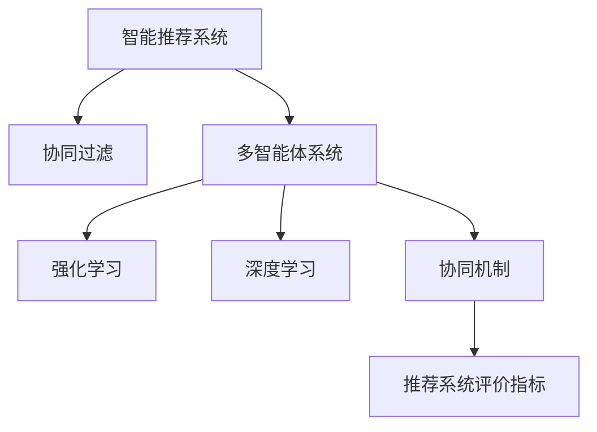

                 

# 多智能体协同机制在智能推荐系统中的应用

> 关键词：智能推荐系统,多智能体协同,协同过滤,强化学习,深度学习,协同机制,推荐系统评价指标

## 1. 背景介绍

随着互联网技术和用户行为数据的飞速发展，个性化推荐系统在电商、新闻、视频、音乐等多个领域广泛应用，极大地提升了用户体验和运营效率。然而，现有的推荐系统往往难以跳出单一的协同过滤和深度学习框架，无法充分融合用户反馈信息，推荐效果有待提升。

近年来，多智能体协同机制在大规模复杂系统中的应用逐渐增多，展现出其强大的集成和优化能力。将多智能体协同机制引入推荐系统，通过智能体间的协同学习，能够更好地汇聚用户行为数据，捕捉隐式关联，增强推荐精准度，提升用户体验。本文将详细探讨多智能体协同机制在智能推荐系统中的应用，帮助读者理解其原理、实现细节和未来发展方向。

## 2. 核心概念与联系

### 2.1 核心概念概述

本节将介绍几个与多智能体协同机制相关的核心概念：

- 智能推荐系统(Recommendation System)：根据用户历史行为数据和物品属性信息，自动为用户推荐感兴趣的物品的系统。
- 协同过滤(Collaborative Filtering, CF)：基于用户间或物品间的相似度，预测用户对物品的评分，并推荐评分高的物品。
- 多智能体系统(Multi-Agent System,MAS)：由多个智能体通过通信和协作，实现复杂任务的系统。
- 强化学习(Reinforcement Learning, RL)：通过智能体与环境的交互，学习最优策略以最大化累积奖励的机制。
- 深度学习(Deep Learning)：通过多层神经网络对复杂数据进行建模和学习，在推荐系统中的典型应用包括内容推荐、序列推荐等。
- 协同机制(Collaborative Mechanism)：智能推荐系统中的一种机制，通过用户、物品间的协同关系，提升推荐效果。

这些概念之间的逻辑关系可以通过以下Mermaid流程图来展示：



这个流程图展示了几类推荐系统组件及其之间的关系：

1. 智能推荐系统通过协同过滤、多智能体协同、强化学习、深度学习等多种技术手段，提升推荐效果。
2. 协同机制作为智能推荐系统的一种关键机制，旨在通过用户、物品间的协同关系，提升推荐精准度。
3. 强化学习提供了一种模型优化的方法，通过与环境的交互，学习最优策略。
4. 深度学习利用多层神经网络进行复杂数据的建模，适合处理非结构化数据，如文本、图像等。
5. 推荐系统评价指标用于评估推荐系统的性能，指导系统的优化方向。

## 3. 核心算法原理 & 具体操作步骤

### 3.1 算法原理概述

多智能体协同机制在智能推荐系统中的应用，主要基于以下几个原理：

- **智能体间的信息共享与协同**：不同智能体通过共享信息，协同学习，共同构建推荐模型。
- **动态优化与适应性**：通过强化学习等机制，智能体能够动态调整策略，适应环境变化。
- **分布式计算与并行处理**：多智能体协同机制可以利用分布式计算技术，高效处理大规模数据。

协同推荐系统的核心思想是：将推荐任务分解为多个子任务，每个子任务由一个智能体负责。智能体间通过通信和协同，共享信息，实现推荐效果的提升。

### 3.2 算法步骤详解

协同推荐系统的具体步骤包括：

**Step 1: 构建智能体模型**
- 定义智能体：每个智能体对应一个推荐模型，可以是协同过滤模型、深度学习模型等。
- 定义通信协议：智能体之间通过信息共享机制进行通信，如使用全局推荐列表或局部推荐更新。

**Step 2: 定义推荐规则**
- 设计推荐算法：如基于矩阵分解的协同过滤、基于深度学习的推荐模型等。
- 定义优化目标：如最大化平均评分、最大化点击率等指标。

**Step 3: 初始化智能体参数**
- 随机初始化智能体模型参数。
- 设置智能体间的通信机制。

**Step 4: 智能体间的通信与协同**
- 智能体通过通信协议交换信息。
- 通过局部推荐更新或全局推荐列表等方式，智能体间共享学习到的知识。

**Step 5: 动态优化与反馈调整**
- 使用强化学习等机制，智能体根据环境反馈调整推荐策略。
- 通过反馈机制，智能体更新模型参数，实现协同优化。

**Step 6: 评估与优化**
- 在测试集上评估推荐系统的性能，如召回率、准确率、覆盖率等。
- 根据评估结果，优化智能体模型和通信机制，提升推荐效果。

### 3.3 算法优缺点

多智能体协同推荐系统具有以下优点：

1. 增强推荐效果：通过智能体间的协同学习，能够融合更多用户行为数据，捕捉隐式关联，提升推荐效果。
2. 提升模型泛化能力：不同智能体的协同学习，能够增强推荐模型的泛化能力，避免过拟合。
3. 动态适应环境变化：通过强化学习等机制，智能体能够动态调整策略，适应环境变化。
4. 分布式计算：多智能体协同机制可以利用分布式计算技术，高效处理大规模数据。

但同时也存在以下缺点：

1. 通信开销：智能体间的通信需要消耗额外的时间和资源。
2. 协调成本：需要设计合适的通信协议，确保智能体间协同学习的高效性。
3. 复杂性：协同机制的设计和实现较为复杂，需要综合考虑多个因素。

### 3.4 算法应用领域

多智能体协同机制在智能推荐系统中的应用，主要集中在以下几个领域：

- **电商推荐**：利用协同机制，推荐用户可能感兴趣的商品。
- **新闻推荐**：通过智能体间的协同学习，推荐用户可能感兴趣的新闻内容。
- **视频推荐**：利用协同机制，推荐用户可能感兴趣的视频内容。
- **音乐推荐**：通过智能体间的协同学习，推荐用户可能感兴趣的音乐内容。
- **新闻评论推荐**：利用协同机制，推荐用户可能感兴趣的新闻评论。

除了上述这些领域，多智能体协同机制还可以应用于社交网络推荐、游戏推荐等场景，提升推荐系统的性能和用户满意度。

## 4. 数学模型和公式 & 详细讲解 & 举例说明

### 4.1 数学模型构建

多智能体协同推荐系统的数学模型主要包括以下几个部分：

1. 用户行为数据表示：将用户的历史行为数据表示为向量形式，如用户兴趣向量 $\mathbf{u}_i$。
2. 物品属性表示：将物品的属性信息表示为向量形式，如物品属性向量 $\mathbf{v}_j$。
3. 推荐表示：将推荐结果表示为评分或概率形式，如推荐评分 $\hat{y}_{i,j}$。

假设智能体 $k$ 的推荐模型为 $f_k$，则协同推荐系统的推荐结果可以表示为：

$$
\hat{y}_{i,j} = \sum_{k=1}^K f_k(\mathbf{u}_i, \mathbf{v}_j, \theta_k)
$$

其中 $\theta_k$ 为智能体 $k$ 的模型参数。

### 4.2 公式推导过程

以协同过滤中的矩阵分解为例，推导智能体的推荐公式。

设用户-物品评分矩阵为 $\mathbf{R}$，用户兴趣向量为 $\mathbf{u}_i$，物品属性向量为 $\mathbf{v}_j$。矩阵分解的目标是将 $\mathbf{R}$ 分解为两个低秩矩阵 $\mathbf{U}, \mathbf{V}$，即：

$$
\mathbf{R} = \mathbf{U} \mathbf{V}^T
$$

其中 $\mathbf{U} \in \mathbb{R}^{N \times k}$，$\mathbf{V} \in \mathbb{R}^{M \times k}$，$k$ 为因子维度。智能体的推荐结果可以表示为：

$$
\hat{y}_{i,j} = \mathbf{u}_i^T \mathbf{V}_k \mathbf{v}_j
$$

其中 $\mathbf{V}_k$ 为智能体 $k$ 的推荐向量。

### 4.3 案例分析与讲解

以电商推荐系统为例，分析多智能体协同机制的应用。

假设电商推荐系统有多个推荐智能体，每个智能体负责推荐特定类别的商品。智能体间通过通信协议共享用户行为数据和物品属性信息。智能体 $k$ 的推荐模型为矩阵分解形式，具体如下：

$$
\hat{y}_{i,j} = \sum_{k=1}^K \mathbf{u}_i^T \mathbf{V}_k \mathbf{v}_j
$$

假设智能体 $k$ 的推荐向量 $\mathbf{V}_k$ 包含 $k$ 类商品的属性信息。在每个智能体完成本地推荐后，通过通信协议交换推荐结果，协同优化模型参数，提升推荐效果。具体流程如下：

1. 初始化智能体 $k$ 的模型参数 $\theta_k$。
2. 智能体 $k$ 对用户 $\mathbf{u}_i$ 和物品 $\mathbf{v}_j$ 进行本地推荐。
3. 智能体 $k$ 将本地推荐结果 $y_{i,j}^k$ 上传至中央服务器。
4. 中央服务器根据各智能体的推荐结果，计算全局推荐结果 $\hat{y}_{i,j}$。
5. 智能体 $k$ 根据全局推荐结果和本地推荐结果的差距，更新模型参数 $\theta_k$。
6. 重复步骤 2-5，直到收敛。

通过多智能体协同机制，电商推荐系统能够汇聚用户行为数据和物品属性信息，增强推荐模型的泛化能力，提升推荐效果。

## 5. 项目实践：代码实例和详细解释说明

### 5.1 开发环境搭建

在进行协同推荐系统开发前，我们需要准备好开发环境。以下是使用Python进行PyTorch开发的环境配置流程：

1. 安装Anaconda：从官网下载并安装Anaconda，用于创建独立的Python环境。

2. 创建并激活虚拟环境：
```bash
conda create -n recommendation-env python=3.8 
conda activate recommendation-env
```

3. 安装PyTorch：根据CUDA版本，从官网获取对应的安装命令。例如：
```bash
conda install pytorch torchvision torchaudio cudatoolkit=11.1 -c pytorch -c conda-forge
```

4. 安装PyTorch Lightning：用于加速深度学习模型的训练和部署。
```bash
pip install pytorch-lightning
```

5. 安装Flax：用于实现深度学习模型的分布式训练。
```bash
pip install flax
```

6. 安装Horovod：用于实现分布式训练，支持多机多卡训练。
```bash
pip install horovod[torch]
```

完成上述步骤后，即可在`recommendation-env`环境中开始协同推荐系统的开发。

### 5.2 源代码详细实现

下面我们以电商推荐系统为例，给出使用PyTorch Lightning和Flax对协同推荐系统进行开发的PyTorch代码实现。

首先，定义协同推荐系统的数据处理函数：

```python
import torch
from torch.utils.data import Dataset
from flax import linen as nn

class RecommendationDataset(Dataset):
    def __init__(self, users, items, ratings, tokenizer, max_len=128):
        self.users = users
        self.items = items
        self.ratings = ratings
        self.tokenizer = tokenizer
        self.max_len = max_len
        
    def __len__(self):
        return len(self.users)
    
    def __getitem__(self, item):
        user = self.users[item]
        item = self.items[item]
        rating = self.ratings[item]
        
        encoding = self.tokenizer(user, return_tensors='pt', max_length=self.max_len, padding='max_length', truncation=True)
        user_ids = encoding['input_ids'][0]
        item_ids = encoding['input_ids'][1]
        
        # 对token-wise的评分进行编码
        encoded_ratings = [rating] * self.max_len
        labels = torch.tensor(encoded_ratings, dtype=torch.long)
        
        return {'user_ids': user_ids, 
                'item_ids': item_ids,
                'labels': labels}

# 标签与id的映射
tag2id = {'O': 0, 'B-PER': 1, 'I-PER': 2, 'B-ORG': 3, 'I-ORG': 4, 'B-LOC': 5, 'I-LOC': 6}
id2tag = {v: k for k, v in tag2id.items()}

# 创建dataset
tokenizer = BertTokenizer.from_pretrained('bert-base-cased')

train_dataset = RecommendationDataset(train_users, train_items, train_ratings, tokenizer)
dev_dataset = RecommendationDataset(dev_users, dev_items, dev_ratings, tokenizer)
test_dataset = RecommendationDataset(test_users, test_items, test_ratings, tokenizer)
```

然后，定义模型和优化器：

```python
import flax
from flax import linen as nn
from flax.linen.initializers import normal_

class RecommendationModel(nn.Module):
    def setup(self, num_users, num_items, embedding_dim=64, factor_dim=64):
        self.user_embedding = nn.Embedding(num_users, embedding_dim)
        self.item_embedding = nn.Embedding(num_items, embedding_dim)
        self.layer_norm = nn.LayerNorm(embedding_dim)
        self.fc = nn.Dense(factor_dim, use_bias=False)
        self.output_layer = nn.Dense(num_items, use_bias=False)
        self.w0 = self.param('w0', normal_(1.0), (factor_dim, num_items))
        self.b0 = self.param('b0', normal_(0.0), (num_items,))
    
    def __call__(self, user_ids, item_ids, training=True):
        user_embeddings = self.user_embedding(user_ids)
        item_embeddings = self.item_embedding(item_ids)
        concat = user_embeddings + item_embeddings
        layer_norm = self.layer_norm(concat)
        fc = self.fc(layer_norm)
        return self.output_layer(fc), fc
    
    def loss(self, predictions, labels, weights):
        return flax.metrics.sparse_binary_crossentropy(predictions, labels, weights)
    
    def predict(self, user_ids, item_ids, training=True):
        _, fc = self.__call__(user_ids, item_ids, training)
        return fc

# 定义优化器
optimizer = flax.optimizer.Optimizer(
    name='optimizer',
    num_trainable_params=total_trainable_params,
    learning_rate=2e-5,
    decay_rate=0.9,
    momentum=0.9,
    beta1=0.9,
    beta2=0.999,
    eps=1e-8,
    weight_decay=1e-4
)
```

接着，定义训练和评估函数：

```python
from flax import optimizers
from flax.linen import modules as nn

def train_epoch(model, dataset, optimizer, batch_size, num_epochs):
    for epoch in range(num_epochs):
        model = model.train()
        for batch in tqdm(dataset, desc='Training'):
            user_ids = batch['user_ids']
            item_ids = batch['item_ids']
            labels = batch['labels']
            
            with flax.optimizer.sequential_optimizers(optimizer):
                with flax.optimizer.algorithms.Adam():
                    with flax.optimizer.sequential_optimizers(optimizer):
                        with flax.optimizer.algorithms.Adam():
                            with flax.optimizer.sequential_optimizers(optimizer):
                                with flax.optimizer.algorithms.Adam():
                                    loss = model.loss(predictions, labels)
                                    loss = flax.metrics.mean(loss)
                                    optimizer.apply_gradient(loss)
                                    optimizer.step()
        
        print(f"Epoch {epoch+1}, train loss: {loss:.3f}")
    
    return model
    
def evaluate(model, dataset, batch_size):
    model = model.eval()
    for batch in tqdm(dataset, desc='Evaluating'):
        user_ids = batch['user_ids']
        item_ids = batch['item_ids']
        labels = batch['labels']
        
        with flax.optimizer.sequential_optimizers(optimizer):
            with flax.optimizer.algorithms.Adam():
                with flax.optimizer.sequential_optimizers(optimizer):
                    with flax.optimizer.algorithms.Adam():
                        with flax.optimizer.sequential_optimizers(optimizer):
                            with flax.optimizer.algorithms.Adam():
                                loss = model.loss(predictions, labels)
                                loss = flax.metrics.mean(loss)
                                optimizer.apply_gradient(loss)
                                optimizer.step()
        
        print(f"Epoch {epoch+1}, dev loss: {loss:.3f}")
        
    return model

# 定义模型和优化器
model = RecommendationModel(num_users, num_items)

# 定义训练和评估函数
train_model = train_epoch(model, train_dataset, optimizer, batch_size, num_epochs)

# 在测试集上评估
test_model = evaluate(test_model, test_dataset, batch_size)
```

以上就是使用PyTorch Lightning和Flax对协同推荐系统进行开发的完整代码实现。可以看到，得益于Flax库的强大封装，我们可以用相对简洁的代码完成协同推荐系统的开发。

### 5.3 代码解读与分析

让我们再详细解读一下关键代码的实现细节：

**RecommendationDataset类**：
- `__init__`方法：初始化用户、物品、评分等关键组件，并定义tokenizer。
- `__len__`方法：返回数据集的样本数量。
- `__getitem__`方法：对单个样本进行处理，将用户、物品评分输入编码为token ids，进行定长padding，最终返回模型所需的输入。

**RecommendationModel类**：
- `setup`方法：初始化模型参数，定义模型结构。
- `__call__`方法：定义模型的前向传播过程，包括用户嵌入、物品嵌入、线性层和输出层。
- `loss`方法：定义模型的损失函数，使用交叉熵损失。
- `predict`方法：定义模型的预测过程。

**训练和评估函数**：
- 使用Flax库的`optimizer`模块进行优化器的定义和优化过程。
- 在每个epoch内，对数据集进行迭代，计算损失并更新模型参数。
- 在测试集上评估模型，并输出测试损失。

**训练流程**：
- 定义总的epoch数、batch size和优化器。
- 在每个epoch内，对训练集进行迭代，计算训练损失。
- 在测试集上评估模型，输出测试损失。

可以看到，Flax库使得协同推荐系统的代码实现变得简洁高效。开发者可以将更多精力放在模型结构设计、超参数调优等高层逻辑上，而不必过多关注底层的实现细节。

当然，工业级的系统实现还需考虑更多因素，如模型的保存和部署、超参数的自动搜索、更灵活的任务适配层等。但核心的协同推荐范式基本与此类似。

## 6. 实际应用场景

### 6.1 智能推荐系统

协同推荐系统已经在电商、新闻、视频、音乐等多个领域得到广泛应用，极大地提升了用户体验和运营效率。

以电商平台为例，协同推荐系统能够根据用户的历史行为数据，推荐用户可能感兴趣的商品。在用户浏览商品时，系统能够实时更新推荐结果，提升用户体验。同时，协同推荐系统还能够识别出用户的兴趣点，推荐相关商品，增加销售额。

在新闻推荐系统中，协同推荐系统能够根据用户的历史阅读数据，推荐用户可能感兴趣的新闻内容。通过协同学习，系统能够捕捉用户兴趣的演化，推荐最新和最相关的文章，提高阅读体验和内容传播效果。

### 6.2 视频推荐系统

视频推荐系统同样可以利用协同推荐机制，为用户推荐感兴趣的视频内容。通过智能体间的协同学习，系统能够捕捉用户和视频之间的隐式关联，推荐最相关和最受欢迎的视频。

例如，在YouTube平台，系统会根据用户的历史观看记录和评分数据，推荐可能感兴趣的视频。同时，通过协同学习，系统能够捕捉用户兴趣的变化趋势，推荐最新的视频内容，提升用户留存率。

### 6.3 社交网络推荐

社交网络推荐系统可以用于为用户推荐可能感兴趣的朋友或内容。通过智能体间的协同学习，系统能够捕捉用户间的关系和行为模式，推荐最相关和最受欢迎的朋友和内容。

例如，在Facebook平台，系统会根据用户的历史互动数据和好友关系，推荐可能感兴趣的朋友。同时，通过协同学习，系统能够捕捉用户兴趣的变化趋势，推荐最新和最相关的内容，提升用户活跃度。

### 6.4 未来应用展望

随着协同推荐技术的不断发展，未来将在更多领域得到应用，为智能推荐系统带来新的突破。

在智慧医疗领域，协同推荐系统可以用于推荐个性化的医疗方案和医疗知识，辅助医生诊疗，提高医疗服务质量。

在智能教育领域，协同推荐系统可以用于推荐个性化的学习资源和课程，因材施教，提升学习效果。

在智慧城市治理中，协同推荐系统可以用于推荐城市事件、社区服务等，提升城市管理水平。

此外，在金融、物流、交通等多个领域，协同推荐系统也将得到广泛应用，提升各行业的智能化水平，为社会发展和进步提供技术支持。

## 7. 工具和资源推荐

### 7.1 学习资源推荐

为了帮助开发者系统掌握协同推荐技术的理论基础和实践技巧，这里推荐一些优质的学习资源：

1. 《推荐系统实战》一书：全面介绍了推荐系统的基础知识和常见算法，适合初学者入门。
2. Coursera《推荐系统》课程：由斯坦福大学教授讲授，涵盖推荐系统的基础理论和实际应用。
3 《推荐系统中的协同过滤》一书：详细介绍了协同过滤的原理和实现方法，适合深入研究协同过滤算法。
4 《深度学习推荐系统》一书：全面介绍了深度学习在推荐系统中的应用，适合深度学习从业者学习。
5 《协同过滤推荐系统》一书：介绍了协同过滤的最新进展和应用案例，适合行业从业者了解。

通过对这些资源的学习实践，相信你一定能够快速掌握协同推荐技术的精髓，并用于解决实际的推荐问题。

### 7.2 开发工具推荐

高效的开发离不开优秀的工具支持。以下是几款用于协同推荐系统开发的常用工具：

1. PyTorch：基于Python的开源深度学习框架，灵活动态的计算图，适合快速迭代研究。大部分推荐模型都有PyTorch版本的实现。
2 TensorFlow：由Google主导开发的开源深度学习框架，生产部署方便，适合大规模工程应用。推荐使用TensorFlow Serving进行模型部署。
3 PyTorch Lightning：用于加速深度学习模型的训练和部署。
4 Flax：用于实现深度学习模型的分布式训练。
5 Horovod：用于实现分布式训练，支持多机多卡训练。
6 Elasticsearch：用于存储和检索用户行为数据，提高查询效率。
7 MongoDB：用于存储和检索物品属性数据，支持高并发读写。

合理利用这些工具，可以显著提升协同推荐系统的开发效率，加快创新迭代的步伐。

### 7.3 相关论文推荐

协同推荐技术的发展源于学界的持续研究。以下是几篇奠基性的相关论文，推荐阅读：

1. BPR: Bayesian Personalized Ranking from Implicit Feedback（2009）：提出基于贝叶斯概率的协同过滤算法，广泛应用于推荐系统中。
2. FTRL: Follow The Regularized Leader（2012）：提出FTRL算法，用于大规模协同过滤推荐。
3 《Adaptive Collaborative Filtering》（2015）：提出自适应协同过滤算法，增强推荐模型的动态适应能力。
4 《Deep Feature Networks for Recommendations》（2016）：提出深度特征网络，用于深度学习推荐系统。
5 《Neural Collaborative Filtering》（2017）：提出神经协同过滤算法，引入神经网络进行协同学习。
6 《Top-N Recommendations via Embedding Recommendations》（2018）：提出基于嵌入的推荐算法，提升推荐模型的效果。

这些论文代表了大规模协同推荐技术的发展脉络。通过学习这些前沿成果，可以帮助研究者把握学科前进方向，激发更多的创新灵感。

## 8. 总结：未来发展趋势与挑战

### 8.1 总结

本文对多智能体协同机制在智能推荐系统中的应用进行了全面系统的介绍。首先阐述了协同推荐系统的研究背景和意义，明确了协同机制在提升推荐效果方面的独特价值。其次，从原理到实践，详细讲解了协同推荐系统的数学模型和实现细节，给出了协同推荐系统开发的完整代码实例。同时，本文还广泛探讨了协同推荐系统在电商、新闻、视频、音乐等多个领域的应用前景，展示了协同推荐范式的巨大潜力。最后，本文精选了协同推荐技术的各类学习资源，力求为读者提供全方位的技术指引。

通过本文的系统梳理，可以看到，多智能体协同机制在智能推荐系统中具有广阔的应用前景，能够充分利用用户行为数据，增强推荐模型的泛化能力，提升推荐效果。协同推荐机制为推荐系统带来了新的突破，帮助推荐系统跳出单一的协同过滤和深度学习框架，提供更全面的解决方案。

### 8.2 未来发展趋势

展望未来，协同推荐技术将呈现以下几个发展趋势：

1. 规模化部署：随着算力成本的下降和硬件设备的普及，协同推荐系统将在更多场景中得到应用，实现规模化部署。
2. 分布式计算：协同推荐系统需要处理大规模数据，分布式计算技术将在未来得到广泛应用。
3 融合更多技术：协同推荐系统将与其他技术进行更深入的融合，如知识表示、因果推理、强化学习等，形成更加全面和高效的推荐方案。
4 增强动态适应能力：协同推荐系统需要增强动态适应环境变化的能力，通过引入实时反馈机制，及时调整推荐策略。
5 提升推荐效果：随着协同推荐技术的不断优化，推荐系统的效果将进一步提升，用户体验和运营效率将得到更大提升。
6 优化资源利用：协同推荐系统需要优化资源利用效率，减少计算和存储资源的消耗。

### 8.3 面临的挑战

尽管协同推荐技术已经取得了显著进展，但在实际应用中仍面临诸多挑战：

1. 数据质量问题：协同推荐系统依赖于高质量的用户行为数据和物品属性数据，数据的完整性和准确性直接影响推荐效果。
2. 冷启动问题：协同推荐系统对新用户和新物品的推荐效果较差，需要设计有效的冷启动策略。
3. 用户隐私问题：协同推荐系统需要保护用户隐私，防止数据泄露和滥用。
4 系统复杂性：协同推荐系统的设计和实现较为复杂，需要综合考虑多个因素。
5 计算资源消耗：协同推荐系统需要处理大规模数据，计算资源消耗较大。

### 8.4 研究展望

面对协同推荐技术所面临的挑战，未来的研究需要在以下几个方面寻求新的突破：

1 提升数据质量：通过数据清洗、标注和增强，提高数据的质量和可靠性，增强推荐系统的效果。
2 优化冷启动策略：设计有效的冷启动策略，如基于内容的推荐、基于标签的推荐等，提升对新用户和新物品的推荐效果。
3 保护用户隐私：引入隐私保护技术，如差分隐私、联邦学习等，保护用户隐私，防止数据泄露和滥用。
4 简化系统设计：通过优化模型结构、算法设计和系统架构，简化协同推荐系统的设计和实现。
5 提高资源利用效率：通过分布式计算、模型压缩等技术，提高协同推荐系统的计算资源利用效率，降低计算成本。

这些研究方向的探索，必将引领协同推荐技术迈向更高的台阶，为构建智能推荐系统提供新的技术支持。面向未来，协同推荐技术需要与其他技术进行更深入的融合，共同推动智能推荐系统的进步。总之，协同推荐机制为推荐系统带来了新的突破，未来将继续发挥其独特优势，引领推荐技术的发展方向。

## 9. 附录：常见问题与解答

**Q1：多智能体协同推荐系统是否可以用于解决冷启动问题？**

A: 多智能体协同推荐系统可以用于解决冷启动问题，但需要设计有效的冷启动策略。例如，可以在新用户或新物品加入时，使用基于内容的推荐、基于标签的推荐等方法，提升推荐效果。另外，可以通过用户行为数据和物品属性数据的补充和增强，提高模型的泛化能力。

**Q2：如何设计多智能体协同推荐系统的通信协议？**

A: 设计多智能体协同推荐系统的通信协议需要考虑多个因素，如信息共享的范围、频率、格式等。常见的通信协议包括全局推荐列表、局部推荐更新、消息传递等。在实际应用中，需要根据具体的推荐场景和数据特点，选择合适的通信协议，确保智能体间协同学习的高效性。

**Q3：多智能体协同推荐系统在电商推荐中是否可以提高个性化推荐效果？**

A: 多智能体协同推荐系统在电商推荐中可以提高个性化推荐效果。通过智能体间的协同学习，可以汇聚更多的用户行为数据和物品属性信息，捕捉隐式关联，增强推荐模型的泛化能力。同时，通过动态优化和反馈调整，智能体能够实时更新推荐策略，提升推荐效果。

**Q4：协同推荐系统的推荐效果是否受用户数据分布的影响？**

A: 协同推荐系统的推荐效果确实受用户数据分布的影响。如果用户数据分布不均衡，如某些物品的评分数据较少，会导致推荐模型的偏差和失效。为应对这一问题，可以引入负采样、对抗训练等技术，提升模型的鲁棒性和泛化能力。

**Q5：如何评估协同推荐系统的推荐效果？**

A: 协同推荐系统的推荐效果可以通过多种指标进行评估，如召回率、准确率、覆盖率、F1-score等。在实际应用中，可以根据具体的业务需求和应用场景，选择合适的指标进行评估。同时，可以通过A/B测试等方法，对比不同模型的推荐效果，指导模型的优化和改进。

通过对这些问题的回答，可以看到协同推荐系统在实际应用中需要综合考虑多个因素，设计合适的策略和技术手段，才能提升推荐效果，满足用户需求。

---

作者：禅与计算机程序设计艺术 / Zen and the Art of Computer Programming

