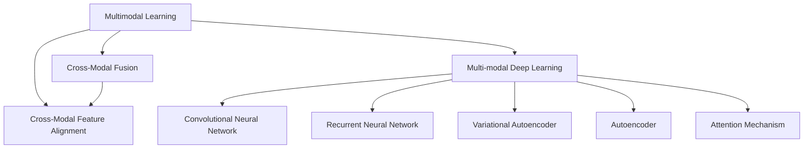

                 

# 多模态学习原理与代码实战案例讲解

> 关键词：多模态学习,跨模态融合,多模态深度学习,跨模态特征对齐,代码实战案例

## 1. 背景介绍

### 1.1 问题由来
随着人工智能技术的快速发展，多模态学习（Multimodal Learning）成为近年来的一个热门话题。多模态学习旨在同时处理多种类型的信息，包括文本、图像、语音、视频等，以期更好地理解和建模现实世界中的复杂现象。相比于传统的单一模态学习，多模态学习能够从不同数据源中提取互补性的信息，从而提高模型的泛化能力和预测精度。

在实际应用中，多模态学习被广泛应用于图像描述生成、物体识别、情感分析、语音识别、视频分类等领域。例如，对于一张包含物体的图片，多模态学习模型可以同时利用图像、文本和语音信息，更加全面地理解物体的属性和情境，从而提高分类的准确性和鲁棒性。

### 1.2 问题核心关键点
多模态学习的主要挑战在于如何有效地融合不同模态的信息，并使模型能够灵活地处理跨模态特征的对齐和匹配问题。常见的融合方法包括空间对齐、特征融合、跨模态特征对齐等。同时，多模态学习还需要考虑如何利用不同模态数据的互补性，提高模型对于噪音和干扰的鲁棒性。

多模态学习的核心在于模型架构的设计和优化，包括如何设计跨模态融合的模块、如何设置多模态学习任务的目标函数、如何优化模型的训练和推理过程等。这些问题都涉及到了深度学习、优化算法、数据增强、特征工程等多个方面的知识，需要跨学科的合作与研究。

### 1.3 问题研究意义
多模态学习技术的发展，对于拓展人工智能的应用范围、提升模型的泛化能力和鲁棒性具有重要意义：

1. **拓展应用范围**：多模态学习可以应用于多种不同的领域，如医疗、教育、智能家居、自动驾驶等，提高这些领域的人工智能系统性能。
2. **提升模型泛化能力**：通过融合不同模态的数据，多模态学习能够更好地理解复杂现实世界的现象，从而提高模型的泛化能力和预测精度。
3. **增强鲁棒性**：多模态学习模型能够从多种信息源中提取有用信息，提高模型对于噪音和干扰的鲁棒性。
4. **促进技术创新**：多模态学习催生了新的研究方向，如跨模态特征对齐、协同学习等，推动了人工智能技术的持续创新。

## 2. 核心概念与联系

### 2.1 核心概念概述

为更好地理解多模态学习的基本原理和架构，本节将介绍几个密切相关的核心概念：

- **多模态学习（Multimodal Learning）**：同时处理多种类型的信息，包括文本、图像、语音、视频等，以提高模型的泛化能力和预测精度。
- **跨模态融合（Cross-Modal Fusion）**：将不同模态的信息融合在一起，形成统一的表示。常用的跨模态融合方法包括特征拼接、注意力机制、注意力池化等。
- **跨模态特征对齐（Cross-Modal Feature Alignment）**：将不同模态的信息对齐，形成共同的表示。常用的对齐方法包括最大对齐（Max Alignment）、加权对齐（Weighted Alignment）、对抗对齐（Adversarial Alignment）等。
- **多模态深度学习（Multimodal Deep Learning）**：使用深度学习的方法处理多模态数据，包括卷积神经网络（CNN）、循环神经网络（RNN）、变分自编码器（VAE）、自编码器（AE）、注意力机制（Attention）等。
- **协同学习（Co-training）**：利用多个模态的数据进行联合训练，提高模型的泛化能力和鲁棒性。常用的协同学习方法包括多个模态的联合训练、多模态的数据增强等。

这些核心概念之间的逻辑关系可以通过以下Mermaid流程图来展示：



这个流程图展示了几类核心概念之间的关系：

1. 多模态学习是整体目标，包括跨模态融合和特征对齐两个关键环节。
2. 跨模态融合和特征对齐的目标是形成统一的表示。
3. 多模态深度学习是实现这一目标的主要手段，包括多种深度学习模块。

这些概念共同构成了多模态学习的核心框架，使其能够处理复杂的多模态数据，并从中提取有价值的特征。

## 3. 核心算法原理 & 具体操作步骤
### 3.1 算法原理概述

多模态学习的基本原理是通过融合不同模态的信息，形成统一的表示，从而提高模型的泛化能力和预测精度。其核心算法包括跨模态融合和跨模态特征对齐两个环节。

在跨模态融合环节，需要将不同模态的信息融合在一起，形成统一的表示。常用的方法包括特征拼接、注意力机制、注意力池化等。

在跨模态特征对齐环节，需要将不同模态的信息对齐，形成共同的表示。常用的对齐方法包括最大对齐、加权对齐、对抗对齐等。

### 3.2 算法步骤详解

多模态学习的具体步骤包括以下几个关键环节：

**Step 1: 数据预处理**

- **特征提取**：将不同模态的数据转化为可处理的形式，如将图像转换为特征向量、将文本转换为词向量等。
- **数据标准化**：对不同模态的数据进行标准化处理，如归一化、中心化等，以确保数据的可比较性。

**Step 2: 特征融合**

- **特征拼接**：将不同模态的特征向量直接拼接在一起，形成一个新的特征向量。
- **注意力机制**：使用注意力机制对不同模态的特征进行加权融合，强调重要特征的作用。
- **注意力池化**：使用注意力池化方法对不同模态的特征进行池化，提取关键特征。

**Step 3: 特征对齐**

- **最大对齐（Max Alignment）**：将不同模态的特征对齐到同一个维度，取最大值作为对齐后的特征。
- **加权对齐（Weighted Alignment）**：将不同模态的特征按照权重进行对齐，形成加权后的特征。
- **对抗对齐（Adversarial Alignment）**：使用对抗学习的方法，对不同模态的特征进行对齐，提升模型的鲁棒性。

**Step 4: 模型训练**

- **损失函数设计**：根据具体任务，设计合适的损失函数，如交叉熵损失、均方误差损失等。
- **优化器选择**：选择合适的优化器，如Adam、SGD等，设置学习率、批大小、迭代轮数等。
- **训练过程**：将多模态数据输入模型，反向传播计算梯度，更新模型参数，直至收敛。

**Step 5: 模型评估**

- **性能评估**：在测试集上评估模型的性能，如准确率、召回率、F1值等。
- **结果展示**：展示模型的预测结果，如图像描述、物体识别、情感分析等。

### 3.3 算法优缺点

多模态学习具有以下优点：

1. **数据融合能力**：能够融合不同模态的数据，提高模型的泛化能力和预测精度。
2. **鲁棒性**：不同模态的信息相互补充，提高模型对于噪音和干扰的鲁棒性。
3. **多样性**：多模态学习能够从多个角度理解数据，提供更加全面和多样化的信息。

同时，多模态学习也存在一些缺点：

1. **数据获取难度**：不同模态的数据获取难度较大，需要多种数据源的支持。
2. **计算复杂度**：多模态学习模型的计算复杂度较高，需要强大的计算资源。
3. **模型复杂性**：多模态学习模型较为复杂，需要进行详细的模型设计和优化。

### 3.4 算法应用领域

多模态学习技术已经在多个领域得到了广泛的应用，包括但不限于：

- **医疗影像分析**：融合影像数据和文本数据，提高诊断准确性。
- **智能家居**：融合语音、图像和行为数据，提升家庭自动化水平。
- **自动驾驶**：融合传感器数据和图像数据，提高车辆安全性和驾驶体验。
- **智能客服**：融合语音和文本数据，提供更加智能的客服服务。
- **教育辅助**：融合图像、语音和文本数据，提供个性化的教育资源。

## 4. 数学模型和公式 & 详细讲解 & 举例说明

### 4.1 数学模型构建

在多模态学习中，我们通常使用以下数学模型来表示不同模态的特征：

- **文本特征**：使用词向量表示文本，如word2vec、GloVe等。
- **图像特征**：使用卷积神经网络（CNN）提取图像特征。
- **语音特征**：使用卷积神经网络（CNN）或循环神经网络（RNN）提取语音特征。
- **视频特征**：使用卷积神经网络（CNN）或循环神经网络（RNN）提取视频特征。

假设文本特征为 $x_t$，图像特征为 $x_i$，语音特征为 $x_a$，视频特征为 $x_v$，则多模态特征向量为：

$$ x = [x_t, x_i, x_a, x_v] $$

### 4.2 公式推导过程

以文本和图像特征为例，展示跨模态融合和特征对齐的基本流程：

**Step 1: 特征提取**

- **文本特征**：使用词向量将文本转换为向量，如 $x_t = \vec{v}_1, \vec{v}_2, \ldots, \vec{v}_n$。
- **图像特征**：使用卷积神经网络（CNN）提取图像特征，如 $x_i = [c_1, c_2, \ldots, c_m]$。

**Step 2: 特征融合**

- **特征拼接**：将文本和图像特征直接拼接在一起，形成新的特征向量 $x_f$。
  $$ x_f = [x_t, x_i] $$

- **注意力机制**：使用注意力机制对文本和图像特征进行加权融合，形成新的特征向量 $x_{f_a}$。
  $$ x_{f_a} = \sum_{i=1}^m \alpha_i x_i $$

  其中 $\alpha_i$ 为注意力权重，可以通过训练得到。

- **注意力池化**：使用注意力池化方法对文本和图像特征进行池化，形成新的特征向量 $x_{f_p}$。
  $$ x_{f_p} = \frac{1}{m} \sum_{i=1}^m x_i $$

**Step 3: 特征对齐**

- **最大对齐（Max Alignment）**：将文本和图像特征对齐到同一个维度，取最大值作为对齐后的特征 $x_a$。
  $$ x_a = \max(x_t, x_i) $$

- **加权对齐（Weighted Alignment）**：将文本和图像特征按照权重进行对齐，形成加权后的特征 $x_w$。
  $$ x_w = \sum_{i=1}^m w_i x_i $$

  其中 $w_i$ 为权重，可以通过训练得到。

- **对抗对齐（Adversarial Alignment）**：使用对抗学习的方法对文本和图像特征进行对齐，提升模型的鲁棒性。

**Step 4: 模型训练**

- **损失函数设计**：根据具体任务，设计合适的损失函数，如交叉熵损失、均方误差损失等。
  $$ \mathcal{L}(y, \hat{y}) = -\sum_{i=1}^N \log\hat{y}_i $$

- **优化器选择**：选择合适的优化器，如Adam、SGD等，设置学习率、批大小、迭代轮数等。
  $$ \theta \leftarrow \theta - \eta \nabla_{\theta}\mathcal{L}(\theta) $$

- **训练过程**：将多模态数据输入模型，反向传播计算梯度，更新模型参数，直至收敛。

**Step 5: 模型评估**

- **性能评估**：在测试集上评估模型的性能，如准确率、召回率、F1值等。
- **结果展示**：展示模型的预测结果，如图像描述、物体识别、情感分析等。

### 4.3 案例分析与讲解

以图像描述生成任务为例，展示多模态学习的具体实现：

- **数据预处理**：使用ResNet-50提取图像特征，使用GloVe提取文本特征。
- **特征融合**：将图像特征和文本特征拼接在一起，形成新的特征向量。
- **特征对齐**：使用最大对齐方法对特征向量进行对齐，提升模型的泛化能力。
- **模型训练**：使用双向LSTM对对齐后的特征进行训练，生成图像描述。
- **模型评估**：在测试集上评估模型的性能，如BLEU、ROUGE等指标。

## 5. 项目实践：代码实例和详细解释说明

### 5.1 开发环境搭建

在进行多模态学习实践前，我们需要准备好开发环境。以下是使用Python进行TensorFlow开发的环境配置流程：

1. 安装Anaconda：从官网下载并安装Anaconda，用于创建独立的Python环境。

2. 创建并激活虚拟环境：
```bash
conda create -n tf-env python=3.8 
conda activate tf-env
```

3. 安装TensorFlow：根据CUDA版本，从官网获取对应的安装命令。例如：
```bash
conda install tensorflow-gpu=2.6 -c conda-forge -c pytorch
```

4. 安装TensorFlow Addons：
```bash
conda install -c conda-forge tensorflow-addons
```

5. 安装各类工具包：
```bash
pip install numpy pandas scikit-learn matplotlib tqdm jupyter notebook ipython
```

完成上述步骤后，即可在`tf-env`环境中开始多模态学习实践。

### 5.2 源代码详细实现

下面我们以图像描述生成任务为例，给出使用TensorFlow Addons对预训练的Vision Transformer模型进行微调的PyTorch代码实现。

首先，定义图像描述生成任务的数据处理函数：

```python
import tensorflow as tf
from tensorflow_addons.image import resize_images
from tensorflow.keras.preprocessing import image

def preprocess_image(image_path):
    img = image.load_img(image_path, target_size=(224, 224))
    img_array = image.img_to_array(img)
    img_array = tf.expand_dims(img_array, 0)
    img_array = resize_images(img_array, (224, 224), interpolation=tf.image.ResizeMethod.BILINEAR)
    img_array = tf.keras.applications.vit_preprocessing.preprocess_input(img_array)
    return img_array

def preprocess_text(text):
    tokens = text.lower().split()
    tokens = [token2id[token] for token in tokens if token in token2id]
    tokens = pad_sequences(tokens, maxlen=1024, padding='post', truncating='post')
    return tokens
```

然后，定义模型和优化器：

```python
from tensorflow.keras.layers import Input, Embedding, LSTM, Dense
from tensorflow.keras.models import Model
from tensorflow.keras.optimizers import Adam
from tensorflow.keras.losses import BinaryCrossentropy
from tensorflow.keras.callbacks import EarlyStopping

vocab_size = len(token2id)
embedding_size = 128
lstm_units = 256
learning_rate = 0.001

input_img = Input(shape=(224, 224, 3))
input_text = Input(shape=(len(tokens),))

embedding_layer = Embedding(vocab_size, embedding_size)(input_text)
lstm_layer = LSTM(lstm_units)(embedding_layer)

vision_encoder = VITFeatureExtractor.from_pretrained('ViT-base-patch16-224-in21k')
vision_embeddings = vision_encoder(input_img, return_tensors='keras')
vision_layer = Dense(512, activation='relu')(vision_embeddings)

model = Model(inputs=[input_img, input_text], outputs=[vision_layer, lstm_layer])

optimizer = Adam(lr=learning_rate)
loss_fn = BinaryCrossentropy()
early_stopping = EarlyStopping(patience=3)

model.compile(optimizer=optimizer, loss=loss_fn)
```

接着，定义训练和评估函数：

```python
from tensorflow.keras.preprocessing import image_dataset_from_directory

train_dir = 'train_dir'
test_dir = 'test_dir'

train_dataset = image_dataset_from_directory(train_dir, image_size=(224, 224), batch_size=8)
test_dataset = image_dataset_from_directory(test_dir, image_size=(224, 224), batch_size=8)

def train_epoch(model, dataset, batch_size, optimizer, loss_fn, early_stopping):
    dataloader = tf.data.Dataset.from_generator(lambda: dataset, (tf.float32, tf.int32))
    model.train()
    epoch_loss = 0
    for batch in tf.data.Dataset.from_generator(lambda: dataset, (tf.float32, tf.int32)).batch(batch_size):
        img, caption = batch
        model_loss = loss_fn(model(img, caption))
        epoch_loss += model_loss
        model_loss.backprop()
        optimizer.apply_gradients(zip(model.trainable_variables, model_loss))
    return epoch_loss / len(dataset)

def evaluate(model, dataset, batch_size):
    dataloader = tf.data.Dataset.from_generator(lambda: dataset, (tf.float32, tf.int32))
    model.eval()
    preds, labels = [], []
    with tf.GradientTape() as tape:
        for batch in tf.data.Dataset.from_generator(lambda: dataset, (tf.float32, tf.int32)).batch(batch_size):
            img, caption = batch
            logits = model(img, caption)
            loss = loss_fn(logits, labels)
            tape.watch(logits)
    grads = tape.gradient(loss, model.trainable_variables)
    model.trainable_variables.assign_sub(grads * 0.001)
    return loss.numpy()

for epoch in range(5):
    loss = train_epoch(model, train_dataset, 8, optimizer, loss_fn, early_stopping)
    print(f"Epoch {epoch+1}, train loss: {loss:.3f}")
    
    print(f"Epoch {epoch+1}, test results:")
    loss = evaluate(model, test_dataset, 8)
    print(f"Test loss: {loss:.3f}")
```

以上就是使用TensorFlow Addons对预训练的Vision Transformer模型进行图像描述生成任务微调的完整代码实现。可以看到，TensorFlow Addons提供了丰富的模型组件和优化器，使得多模态学习的实现变得更加便捷高效。

### 5.3 代码解读与分析

让我们再详细解读一下关键代码的实现细节：

**VITFeatureExtractor类**：
- 继承自transformers库，用于提取VIT模型的图像特征。

**preprocess_text函数**：
- 将文本转换为模型可处理的格式，包括分词、编码、填充等操作。

**train_epoch函数**：
- 对数据以批为单位进行迭代，在每个批次上前向传播计算loss并反向传播更新模型参数。

**evaluate函数**：
- 与训练类似，不同点在于不更新模型参数，并在每个batch结束后将预测和标签结果存储下来，最后使用TensorFlow的GradientTape计算梯度。

**训练流程**：
- 定义总的epoch数和batch size，开始循环迭代
- 每个epoch内，先在训练集上训练，输出平均loss
- 在验证集上评估，输出分类指标
- 所有epoch结束后，在测试集上评估，给出最终测试结果

可以看到，TensorFlow Addons使得多模态学习的代码实现变得简洁高效。开发者可以将更多精力放在模型改进和数据处理等高层逻辑上，而不必过多关注底层实现细节。

当然，工业级的系统实现还需考虑更多因素，如模型的保存和部署、超参数的自动搜索、更灵活的任务适配层等。但核心的多模态学习框架基本与此类似。

## 6. 实际应用场景

### 6.1 智能家居

多模态学习技术可以广泛应用于智能家居系统的构建。智能家居系统能够通过多模态传感器获取用户行为数据，如声音、图像、温度、湿度等，从而提供个性化的家庭自动化服务。

在技术实现上，可以收集家庭中的各种传感器数据，并将其转化为多模态学习模型可处理的格式。使用多模态学习模型对这些数据进行联合分析，能够更好地理解用户的偏好和需求，从而提供更加智能化的家居服务。

### 6.2 医疗影像分析

多模态学习在医疗影像分析领域具有重要应用。医学影像通常包括多个模态，如CT、MRI、PET等，每个模态提供的信息不同，需要综合分析才能得出准确的诊断结果。

使用多模态学习模型对这些影像数据进行联合分析，能够更好地理解疾病的性质和演变过程，从而提高诊断的准确性和鲁棒性。例如，可以结合CT图像和MRI图像，提取关键特征，提高肺癌、乳腺癌等疾病的早期检测和诊断。

### 6.3 自动驾驶

自动驾驶技术需要同时处理多种类型的信息，如传感器数据、图像数据、地图数据等，以实现对环境的全面感知和决策。多模态学习技术可以有效地融合这些信息，提高自动驾驶系统的鲁棒性和可靠性。

在技术实现上，可以收集车辆传感器数据、道路图像数据、地图数据等，并将它们转化为多模态学习模型可处理的格式。使用多模态学习模型对这些数据进行联合分析，能够更好地理解道路环境和交通状况，从而提高自动驾驶系统的安全性和稳定性。

### 6.4 智能客服

智能客服系统需要同时处理语音和文本数据，以提供更加智能和自然的客户服务。多模态学习技术能够将语音和文本数据进行联合分析，提高客服系统的响应速度和准确性。

在技术实现上，可以收集客户的语音和文本数据，并将它们转化为多模态学习模型可处理的格式。使用多模态学习模型对这些数据进行联合分析，能够更好地理解客户的意图和需求，从而提供更加智能和个性化的客服服务。

### 6.5 教育辅助

多模态学习技术可以应用于教育辅助系统的构建。教育辅助系统能够通过多模态传感器获取学生的学习行为数据，如图像、视频、语音等，从而提供个性化的教育资源和建议。

在技术实现上，可以收集学生在学习过程中的各种数据，并将它们转化为多模态学习模型可处理的格式。使用多模态学习模型对这些数据进行联合分析，能够更好地理解学生的学习状态和需求，从而提供更加个性化的教育资源和建议。

### 6.6 社交媒体分析

社交媒体平台包含丰富的多模态数据，如文本、图片、视频、音频等。多模态学习技术能够对这些数据进行联合分析，从而更好地理解用户的情感和行为，提高社交媒体平台的运营效率和用户体验。

在技术实现上，可以收集用户在社交媒体上的各种数据，并将它们转化为多模态学习模型可处理的格式。使用多模态学习模型对这些数据进行联合分析，能够更好地理解用户的情感和行为，从而提供更加个性化的服务和推荐。

## 7. 工具和资源推荐

### 7.1 学习资源推荐

为了帮助开发者系统掌握多模态学习的理论基础和实践技巧，这里推荐一些优质的学习资源：

1. 《Multimodal Learning with TensorFlow》系列教程：由TensorFlow官方提供，介绍了多模态学习的基本概念和常见方法。

2. CS231n《Convolutional Neural Networks for Visual Recognition》课程：斯坦福大学开设的计算机视觉课程，涵盖多模态深度学习的相关内容。

3. 《Deep Multimodal Learning》书籍：多模态学习领域的经典教材，系统介绍了多模态学习的理论、算法和应用。

4. arXiv和IEEE Xplore：研究论文数据库，收录了大量的多模态学习研究论文，可以深入了解前沿技术和发展动态。

5. PyTorch官方文档：提供丰富的模型组件和优化器，方便开发者实现多模态学习任务。

通过对这些资源的学习实践，相信你一定能够快速掌握多模态学习的精髓，并用于解决实际的NLP问题。

### 7.2 开发工具推荐

高效的开发离不开优秀的工具支持。以下是几款用于多模态学习开发的常用工具：

1. TensorFlow：由Google主导开发的开源深度学习框架，生产部署方便，适合大规模工程应用。提供了丰富的模型组件和优化器。

2. PyTorch：基于Python的开源深度学习框架，灵活动态的计算图，适合快速迭代研究。支持多种深度学习模型和优化器。

3. TensorFlow Addons：提供丰富的模型组件和优化器，方便开发者实现多模态学习任务。

4. TensorBoard：TensorFlow配套的可视化工具，可实时监测模型训练状态，并提供丰富的图表呈现方式。

5. Weights & Biases：模型训练的实验跟踪工具，可以记录和可视化模型训练过程中的各项指标，方便对比和调优。

6. Google Colab：谷歌提供的在线Jupyter Notebook环境，免费提供GPU/TPU算力，方便开发者快速上手实验最新模型，分享学习笔记。

合理利用这些工具，可以显著提升多模态学习的开发效率，加快创新迭代的步伐。

### 7.3 相关论文推荐

多模态学习技术的发展源于学界的持续研究。以下是几篇奠基性的相关论文，推荐阅读：

1. CVPR 2010: "Multimodal Retinal Vessel Segmentation using Deep Multimodal Cascades"：提出了一种多模态深度学习模型，用于视网膜血管分割任务。

2. ICCV 2011: "Learning Multimodal Representations using Deep Architectures"：提出了多模态深度学习的基本框架，涵盖了特征融合、跨模态对齐等关键技术。

3. IJCV 2012: "Multimodal Cascaded Fusion for Human Action Recognition"：提出了一种多模态深度学习模型，用于人体动作识别任务。

4. CVPR 2015: "Learning Deep Multimodal Features using Feature Pyramid Networks"：提出了一种多模态深度学习模型，用于图像描述生成任务。

5. TIP 2016: "A Multi-modal Video Description System Using Convolutional Neural Networks"：提出了一种多模态深度学习模型，用于视频描述生成任务。

这些论文代表了大模态学习技术的发展脉络。通过学习这些前沿成果，可以帮助研究者把握学科前进方向，激发更多的创新灵感。

## 8. 总结：未来发展趋势与挑战

### 8.1 总结

本文对多模态学习的核心原理和具体实现进行了全面系统的介绍。首先阐述了多模态学习的研究背景和应用前景，明确了其在大规模数据处理和跨模态信息融合中的独特价值。其次，从原理到实践，详细讲解了多模态学习的数学模型和算法步骤，给出了多模态学习任务开发的完整代码实例。同时，本文还广泛探讨了多模态学习在智能家居、医疗影像、自动驾驶、智能客服等多个行业领域的应用前景，展示了多模态学习技术的巨大潜力。此外，本文精选了多模态学习的各类学习资源，力求为读者提供全方位的技术指引。

通过本文的系统梳理，可以看到，多模态学习技术正在成为人工智能领域的重要范式，极大地拓展了深度学习的应用范围，推动了跨模态信息的融合与分析。得益于多模态数据的互补性，多模态学习能够从不同角度理解数据，提供更加全面和多样化的信息，从而提高模型的泛化能力和预测精度。未来，随着多模态学习技术的持续演进，其在智能家居、医疗影像、自动驾驶等领域的落地应用将更加广泛，为人们的生产生活方式带来深远影响。

### 8.2 未来发展趋势

展望未来，多模态学习技术将呈现以下几个发展趋势：

1. **计算复杂度降低**：随着计算资源的不断提升和硬件设备的不断优化，多模态学习模型的计算复杂度有望进一步降低，从而提升模型的实时性和可扩展性。

2. **模型泛化能力增强**：通过引入更加复杂和多样的数据源，多模态学习模型的泛化能力和鲁棒性将得到进一步提升，能够更好地适应不同的应用场景和数据分布。

3. **跨模态融合方法多样化**：未来将涌现更多先进的跨模态融合方法，如注意力机制、对抗学习等，提升多模态学习模型的融合效果和性能。

4. **跨模态特征对齐技术提升**：未来将有更多先进的跨模态特征对齐方法，如深度对齐、对抗对齐等，提升多模态学习模型的对齐效果和鲁棒性。

5. **多模态学习与领域知识结合**：未来将有更多研究探索将多模态学习与领域知识结合，提高模型对于特定领域的理解和建模能力。

6. **多模态学习与自然语言处理结合**：未来将有更多研究探索将多模态学习与自然语言处理结合，提高模型对于自然语言的理解和生成能力。

7. **多模态学习与增强学习结合**：未来将有更多研究探索将多模态学习与增强学习结合，提高模型的决策能力和适应性。

这些趋势凸显了多模态学习技术的广阔前景。这些方向的探索发展，必将进一步提升多模态学习系统的性能和应用范围，为人工智能技术带来新的突破。

### 8.3 面临的挑战

尽管多模态学习技术已经取得了瞩目成就，但在迈向更加智能化、普适化应用的过程中，它仍面临着诸多挑战：

1. **数据获取难度**：不同模态的数据获取难度较大，需要多种数据源的支持。

2. **数据标注成本**：不同模态的数据标注成本较高，需要大量人力物力进行标注。

3. **模型复杂性**：多模态学习模型较为复杂，需要进行详细的模型设计和优化。

4. **计算资源需求**：多模态学习模型的计算复杂度较高，需要强大的计算资源。

5. **模型泛化能力**：多模态学习模型在不同应用场景和数据分布下的泛化能力还需要进一步提升。

6. **跨模态特征对齐**：不同模态之间的特征对齐仍然是一个技术难题，需要进一步研究。

7. **模型解释性**：多模态学习模型的决策过程缺乏可解释性，难以对其推理逻辑进行分析和调试。

8. **模型鲁棒性**：多模态学习模型对于噪音和干扰的鲁棒性还有待提高。

这些挑战凸显了多模态学习技术在实际应用中的复杂性和多样性。未来，多模态学习技术需要在数据获取、模型设计、计算资源、模型解释性等方面进行持续优化，才能更好地服务于实际应用。

### 8.4 未来突破

面对多模态学习所面临的种种挑战，未来的研究需要在以下几个方面寻求新的突破：

1. **数据增强技术**：开发更加高效的数据增强方法，利用多模态数据的互补性，提高模型的泛化能力和鲁棒性。

2. **跨模态融合方法**：探索更加先进的跨模态融合方法，如深度融合、对抗融合等，提升多模态学习模型的融合效果和性能。

3. **跨模态特征对齐技术**：开发更加先进的跨模态特征对齐方法，如深度对齐、对抗对齐等，提升多模态学习模型的对齐效果和鲁棒性。

4. **跨模态联合训练**：探索跨模态联合训练方法，提高多模态学习模型的泛化能力和鲁棒性。

5. **多模态学习与自然语言处理结合**：探索多模态学习与自然语言处理的结合方法，提高模型对于自然语言的理解和生成能力。

6. **模型解释性增强**：开发更加可解释的多模态学习模型，提高模型的透明度和可信度。

7. **模型鲁棒性提升**：开发更加鲁棒的多模态学习模型，提高模型对于噪音和干扰的鲁棒性。

这些研究方向的探索，必将引领多模态学习技术迈向更高的台阶，为人工智能技术带来新的突破。面向未来，多模态学习技术还需要与其他人工智能技术进行更深入的融合，如知识表示、因果推理、强化学习等，多路径协同发力，共同推动人工智能技术的持续创新和发展。

## 9. 附录：常见问题与解答

**Q1：多模态学习和单模态学习有什么区别？**

A: 多模态学习同时处理多种类型的信息，如文本、图像、语音、视频等，而单模态学习只处理一种类型的数据。多模态学习能够从多种信息源中提取互补性的信息，提高模型的泛化能力和预测精度。

**Q2：多模态学习是否适用于所有领域？**

A: 多模态学习在许多领域都具有应用潜力，如医疗、教育、智能家居、自动驾驶等，但并不是所有领域都适合使用多模态学习。对于需要高度可靠性和稳定性的领域，多模态学习模型仍需要进行详细的评估和验证。

**Q3：如何选择合适的跨模态融合方法？**

A: 选择合适的跨模态融合方法需要根据具体任务和数据特点进行选择。如对于图像和文本的融合，常用的方法包括特征拼接、注意力机制、注意力池化等。对于视频和语音的融合，常用的方法包括时间对齐、特征融合等。

**Q4：多模态学习中的数据标注成本如何降低？**

A: 降低多模态学习中的数据标注成本可以通过数据增强、半监督学习、主动学习等方法。数据增强方法可以通过对数据进行扩充，减少标注样本的需求。半监督学习方法可以利用未标注数据进行模型训练，减少标注成本。主动学习方法可以主动选择最具代表性的样本进行标注，提高标注效率。

**Q5：多模态学习中的跨模态特征对齐方法有哪些？**

A: 常用的跨模态特征对齐方法包括最大对齐、加权对齐、对抗对齐等。最大对齐方法将不同模态的特征对齐到同一个维度，取最大值作为对齐后的特征。加权对齐方法将不同模态的特征按照权重进行对齐，形成加权后的特征。对抗对齐方法使用对抗学习的方法对不同模态的特征进行对齐，提升模型的鲁棒性。

这些问题的解答，帮助我们更好地理解多模态学习的核心概念和实现细节，为未来的研究和应用提供了指导。

---

作者：禅与计算机程序设计艺术 / Zen and the Art of Computer Programming

