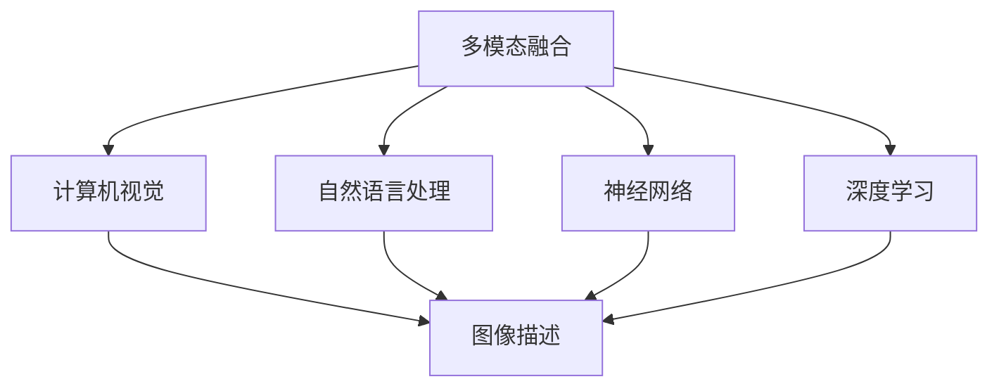

                 

# 多模态融合的应用：图像字幕

> 关键词：多模态融合, 图像字幕, 计算机视觉, 自然语言处理, 神经网络, 图像描述, 深度学习, 特征表示

## 1. 背景介绍

随着深度学习技术的快速发展，多模态融合已成为当前计算机视觉和自然语言处理领域的重要研究方向。其中，图像字幕（Image Captioning）是融合视觉和文本信息的一个典型应用。图像字幕是指给定一张图片，自动生成一段描述该图片内容的自然语言文本。这一任务不仅能够提升计算机对图像的理解能力，还能够辅助视觉信息的检索、分类和标注，具有广泛的应用前景。

### 1.1 问题由来

图像字幕作为多模态融合的一个重要分支，近年来在学术界和工业界都得到了广泛关注。其核心挑战在于如何将视觉特征和语言表示进行高效融合，以实现对图像内容的准确描述。传统方法多依赖于图像分割、特征提取等任务，往往需要额外的标注和计算资源。近年来，深度学习技术的发展为图像字幕提供了新的解决方案，尤其是基于Transformer的模型在自然语言处理领域取得了显著进展，进一步推动了图像字幕技术的发展。

### 1.2 问题核心关键点

图像字幕的核心问题可以归纳为以下几个关键点：
- 多模态数据融合：如何将图像的视觉特征和文本描述融合为一个统一的表示。
- 上下文理解：如何理解图像中的语义信息，并生成连贯的文本描述。
- 泛化能力：如何让模型在多变的数据分布下仍能保持高性能。
- 数据驱动：如何高效利用标注数据，降低对额外标注的依赖。
- 计算效率：如何在保持高性能的同时，提高模型的计算效率，减少推理时间。

### 1.3 问题研究意义

图像字幕技术在图像检索、视频自动字幕生成、内容生成等领域具有重要应用价值。通过图像字幕技术，可以提升智能助手、搜索引擎、电商平台等产品的智能化水平，为用户提供更加精准、自然的视觉信息服务。同时，图像字幕也有助于无障碍辅助设备的开发，帮助视力受损者更好地理解视觉内容。总之，图像字幕技术的多模态融合能力，将在未来的智能交互中扮演重要角色。

## 2. 核心概念与联系

### 2.1 核心概念概述

为更好地理解图像字幕技术，本节将介绍几个密切相关的核心概念：

- 多模态融合(Multimodal Fusion)：指将不同类型的数据（如图像、文本、音频等）进行统一表示，实现跨模态信息的互补和融合。
- 计算机视觉(Computer Vision)：利用计算机对视觉信息的处理和理解，包括图像识别、对象检测、图像分割等任务。
- 自然语言处理(Natural Language Processing, NLP)：利用计算机对自然语言文本的生成、理解、处理和分析。
- 神经网络(Neural Network)：一种能够自动学习特征表示的计算模型，广泛应用于图像、文本等数据处理任务。
- 图像描述(Image Description)：将视觉信息转换成自然语言文本的过程，实现对图像内容的自动描述。
- 深度学习(Deep Learning)：一类利用多层神经网络进行特征表示学习的算法，能够自动从数据中提取复杂特征。

这些核心概念之间的逻辑关系可以通过以下Mermaid流程图来展示：



这个流程图展示了几类核心概念及其之间的关系：

1. 多模态融合是将图像和文本信息进行融合的桥梁。
2. 计算机视觉专注于图像信息的理解，而自然语言处理专注于文本信息的处理。
3. 神经网络是图像和文本描述的关键工具，通过多层结构学习特征表示。
4. 深度学习是神经网络的核心技术，能够自动学习高层次的特征表示。

## 3. 核心算法原理 & 具体操作步骤

### 3.1 算法原理概述

图像字幕的算法核心在于融合视觉和文本信息，生成连贯、准确的描述。其算法流程一般包括以下几个步骤：

1. 图像预处理：对输入图像进行预处理，如调整大小、归一化等。
2. 特征提取：利用卷积神经网络(CNN)等方法提取图像特征。
3. 语言生成：将图像特征和文本特征进行融合，利用循环神经网络(RNN)或Transformer等模型生成描述文本。
4. 后处理：对生成的文本进行后处理，如修正语法错误、增强流畅性等。

整个算法流程的实现需要高效的计算资源和优化的模型架构。

### 3.2 算法步骤详解

以下是一个典型的图像字幕算法流程的详细步骤：

**Step 1: 图像预处理**
- 对输入图像进行缩放、归一化等处理，确保输入尺寸一致。
- 将图像转换为张量格式，输入到卷积神经网络中进行特征提取。

**Step 2: 特征提取**
- 使用卷积神经网络提取图像特征。常见的模型包括ResNet、Inception等。
- 将提取出的特征向量输入到循环神经网络或Transformer模型中，作为图像-文本融合的输入。

**Step 3: 语言生成**
- 使用循环神经网络(RNN)或Transformer模型，将图像特征和文本特征进行融合。
- 在模型中设置词向量嵌入层，将文本序列转换为向量表示。
- 通过Attention机制，将图像特征和文本特征进行交互，生成描述文本。
- 使用语言模型对生成的文本进行解码，生成最终字幕。

**Step 4: 后处理**
- 对生成的文本进行语法修正、标点添加等后处理。
- 使用分词、词性标注等技术，提升文本描述的自然度。

### 3.3 算法优缺点

图像字幕算法具有以下优点：
- 多模态融合能力：能够同时处理视觉和文本信息，实现信息的互补和融合。
- 深度学习技术：通过多层神经网络自动学习特征表示，提升了模型的泛化能力和表达能力。
- 高效计算：利用GPU、TPU等高性能设备，能够快速处理大规模图像和文本数据。

同时，该算法也存在以下局限性：
- 数据依赖性高：依赖于大量的标注数据，获取高质量标注数据成本较高。
- 模型复杂度高：复杂的多模态融合模型需要大量的计算资源和存储空间。
- 鲁棒性不足：对图像噪声、光照变化等环境因素较为敏感，可能影响模型性能。
- 输出解释性差：生成的文本缺乏语义解释，难以理解模型的推理过程。

### 3.4 算法应用领域

图像字幕技术广泛应用于以下几个领域：

- 图像搜索：通过图像描述生成技术，辅助图像检索系统，提升检索结果的相关性。
- 视频字幕生成：为视频自动生成字幕，辅助听障用户理解视频内容。
- 内容生成：辅助文本生成器，生成对视觉内容的描述，增强文本的丰富度。
- 广告制作：生成对广告图像的描述，辅助广告创意设计。
- 教育培训：辅助教育软件，生成对教学内容的描述，提升学习效果。
- 旅游应用：为旅游图片生成描述，辅助旅游决策。

这些领域的应用场景展示了图像字幕技术的广泛应用价值。

## 4. 数学模型和公式 & 详细讲解 & 举例说明

### 4.1 数学模型构建

本节将使用数学语言对图像字幕技术的算法进行详细描述。

设输入图像为 $I$，图像特征提取器为 $F$，文本生成器为 $G$。图像字幕算法的数学模型可以表示为：

$$
\mathcal{L} = \mathcal{L}_{img} + \mathcal{L}_{text}
$$

其中，$\mathcal{L}_{img}$ 为图像特征提取损失，$\mathcal{L}_{text}$ 为文本生成损失。

设 $I$ 的大小为 $h \times w$，特征提取器 $F$ 的输出大小为 $d$。则图像特征表示为 $F(I) \in \mathbb{R}^d$。文本生成器 $G$ 输入为图像特征 $F(I)$，输出为文本描述 $C$。

图像特征提取损失 $\mathcal{L}_{img}$ 可以通过对比提取的特征与目标特征的相似度来计算。常用的损失函数包括均方误差、交叉熵等。

文本生成损失 $\mathcal{L}_{text}$ 可以通过训练语言模型来优化。常用的损失函数包括交叉熵损失、CTC损失等。

### 4.2 公式推导过程

以交叉熵损失为例，设文本描述 $C$ 的长度为 $T$，目标文本为 $C^*$，则交叉熵损失可以表示为：

$$
\mathcal{L}_{text} = -\frac{1}{T}\sum_{t=1}^T \log P(C^*_t | F(I))
$$

其中 $P(C^*_t | F(I))$ 为在给定图像特征 $F(I)$ 下，生成文本 $C^*$ 的概率。

通过上述公式，可以将图像字幕算法中的多模态融合和文本生成过程形式化表示。然而，实际的算法实现还需要结合具体的模型结构和计算方法，进一步优化算法性能。

### 4.3 案例分析与讲解

以下是一个基于Transformer模型的图像字幕生成案例。

**数据集准备**
- 使用COCO数据集，包含大量物体标注图像。
- 提取每个图像的物体类别、位置、属性等信息，生成对应的文本描述。

**模型搭建**
- 使用ResNet作为图像特征提取器，将图像特征映射到高维空间。
- 使用Transformer模型作为文本生成器，将图像特征与文本信息融合。
- 设置词向量嵌入层，将文本序列转换为向量表示。

**训练与评估**
- 使用交叉熵损失函数，训练图像字幕生成模型。
- 在验证集上评估模型性能，调整模型参数和超参数，优化损失函数。
- 在测试集上生成图像描述，对比人工标注的准确性和自然度。

## 5. 项目实践：代码实例和详细解释说明

### 5.1 开发环境搭建

在进行图像字幕项目实践前，我们需要准备好开发环境。以下是使用Python进行PyTorch开发的环境配置流程：

1. 安装Anaconda：从官网下载并安装Anaconda，用于创建独立的Python环境。

2. 创建并激活虚拟环境：
```bash
conda create -n pytorch-env python=3.8 
conda activate pytorch-env
```

3. 安装PyTorch：根据CUDA版本，从官网获取对应的安装命令。例如：
```bash
conda install pytorch torchvision torchaudio cudatoolkit=11.1 -c pytorch -c conda-forge
```

4. 安装相关库：
```bash
pip install torch text
pip install transformers
pip install numpy pandas scikit-learn matplotlib tqdm jupyter notebook ipython
```

完成上述步骤后，即可在`pytorch-env`环境中开始图像字幕项目的开发。

### 5.2 源代码详细实现

以下是使用PyTorch和Transformers库实现图像字幕的示例代码：

```python
from transformers import BertForSequenceClassification, BertTokenizer
import torch.nn as nn
import torch.optim as optim
from torch.utils.data import DataLoader, Dataset

# 定义图像描述任务的数据集类
class ImageDescriptionDataset(Dataset):
    def __init__(self, images, captions, tokenizer):
        self.images = images
        self.captions = captions
        self.tokenizer = tokenizer
        
    def __len__(self):
        return len(self.captions)
    
    def __getitem__(self, index):
        image = self.images[index]
        caption = self.captions[index]
        
        # 对图像进行预处理
        image_tensor = preprocess_image(image)
        
        # 对文本进行编码
        caption_tokens = self.tokenizer.tokenize(caption)
        caption_input_ids = self.tokenizer.convert_tokens_to_ids(caption_tokens)
        
        # 对序列进行padding
        padding_length = 512 - len(caption_input_ids)
        caption_input_ids = caption_input_ids + [tokenizer.pad_token_id] * padding_length
        caption_attention_mask = [1] * len(caption_input_ids)
        
        # 返回预处理后的数据
        return {'image_tensor': image_tensor, 
                'caption_input_ids': caption_input_ids,
                'caption_attention_mask': caption_attention_mask}

# 定义图像描述生成模型
class ImageDescriptionModel(nn.Module):
    def __init__(self, image_model, text_model, num_labels):
        super(ImageDescriptionModel, self).__init__()
        self.image_model = image_model
        self.text_model = text_model
        
        # 定义输出层，输出文本描述
        self.fc = nn.Linear(image_model.output_dim, num_labels)
        
    def forward(self, image_tensor, caption_input_ids, caption_attention_mask):
        # 提取图像特征
        image_feature = self.image_model(image_tensor)
        
        # 生成文本表示
        caption_token_ids, caption_attention_mask = self.text_model(caption_input_ids, caption_attention_mask)
        
        # 将图像特征和文本表示进行拼接
        fused_feature = torch.cat([image_feature, caption_token_ids], dim=1)
        
        # 输出文本描述
        caption_logits = self.fc(fused_feature)
        return caption_logits

# 定义图像特征提取器和文本生成器
image_model = ResNet()
text_model = BertForSequenceClassification()

# 定义模型参数和超参数
num_labels = len(tag2id)
learning_rate = 5e-5
batch_size = 16
num_epochs = 10

# 定义优化器和损失函数
optimizer = optim.AdamW(list(image_model.parameters()) + list(text_model.parameters()), lr=learning_rate)
loss_fn = nn.CrossEntropyLoss()

# 定义训练函数
def train_epoch(model, data_loader, optimizer, loss_fn):
    model.train()
    epoch_loss = 0
    for batch in tqdm(data_loader):
        image_tensor = batch['image_tensor'].to(device)
        caption_input_ids = batch['caption_input_ids'].to(device)
        caption_attention_mask = batch['caption_attention_mask'].to(device)
        optimizer.zero_grad()
        outputs = model(image_tensor, caption_input_ids, caption_attention_mask)
        loss = loss_fn(outputs, batch['caption_labels'])
        epoch_loss += loss.item()
        loss.backward()
        optimizer.step()
    return epoch_loss / len(data_loader)

# 定义评估函数
def evaluate(model, data_loader, loss_fn):
    model.eval()
    epoch_loss = 0
    with torch.no_grad():
        for batch in tqdm(data_loader):
            image_tensor = batch['image_tensor'].to(device)
            caption_input_ids = batch['caption_input_ids'].to(device)
            caption_attention_mask = batch['caption_attention_mask'].to(device)
            outputs = model(image_tensor, caption_input_ids, caption_attention_mask)
            loss = loss_fn(outputs, batch['caption_labels'])
            epoch_loss += loss.item()
    return epoch_loss / len(data_loader)

# 训练和评估模型
device = torch.device('cuda' if torch.cuda.is_available() else 'cpu')
model.to(device)

train_loader = DataLoader(train_dataset, batch_size=batch_size, shuffle=True)
val_loader = DataLoader(val_dataset, batch_size=batch_size, shuffle=False)
test_loader = DataLoader(test_dataset, batch_size=batch_size, shuffle=False)

for epoch in range(num_epochs):
    train_loss = train_epoch(model, train_loader, optimizer, loss_fn)
    val_loss = evaluate(model, val_loader, loss_fn)
    
    print(f'Epoch {epoch+1}, train loss: {train_loss:.4f}, val loss: {val_loss:.4f}')
    
print('Training complete.')
```

### 5.3 代码解读与分析

让我们再详细解读一下关键代码的实现细节：

**ImageDescriptionDataset类**
- `__init__`方法：初始化图像、文本描述和分词器等组件。
- `__len__`方法：返回数据集的样本数量。
- `__getitem__`方法：对单个样本进行处理，将图像和文本描述转换为模型所需的格式。

**ImageDescriptionModel类**
- `__init__`方法：初始化图像特征提取器、文本生成器和输出层。
- `forward`方法：对输入数据进行前向传播，生成文本描述。

**ResNet类**
- 定义ResNet模型，提取图像特征。

**BertForSequenceClassification类**
- 定义Transformer模型，生成文本表示。

**训练和评估函数**
- `train_epoch`函数：对数据集进行迭代训练，计算损失并更新模型参数。
- `evaluate`函数：在验证集和测试集上评估模型性能。

**训练流程**
- 设置总的epoch数、batch size和超参数。
- 使用AdamW优化器和交叉熵损失函数。
- 在训练集上进行训练，在验证集上评估模型性能。
- 在测试集上评估模型性能，输出最终的损失值。

## 6. 实际应用场景

### 6.1 智能助手
图像字幕技术可以应用于智能助手系统，帮助用户理解和操作视觉内容。例如，当用户想要查看某张照片时，智能助手可以自动生成该照片的描述，用户可以通过语音或文本输入进行搜索和选择。

### 6.2 电商平台
电商平台可以使用图像字幕技术为商品生成详细描述，提升用户的购物体验。用户可以通过查看商品图像和描述，更好地了解产品信息，辅助决策。

### 6.3 视频网站
视频网站可以利用图像字幕技术为视频自动生成字幕，提升用户的观看体验。字幕可以辅助听力受损者理解视频内容，提升视频的可访问性。

### 6.4 旅游应用
旅游应用可以使用图像字幕技术为旅游图片生成描述，辅助用户决策和导航。用户可以根据描述了解旅游景点的特色，规划旅游路线。

## 7. 工具和资源推荐

### 7.1 学习资源推荐

为了帮助开发者系统掌握图像字幕技术，这里推荐一些优质的学习资源：

1. 《计算机视觉: 基础与实践》系列博文：由大模型技术专家撰写，深入浅出地介绍了计算机视觉基础和常用模型。

2. CS231n《卷积神经网络》课程：斯坦福大学开设的计算机视觉明星课程，详细讲解了CNN、RNN等深度学习模型。

3. 《自然语言处理基础》书籍：全面介绍了自然语言处理的基本概念和算法，包括文本生成、语言模型等。

4. 《深度学习理论与实践》书籍：详细讲解了深度学习的基本原理和应用，包含图像、文本等多个领域。

5. Weights & Biases：模型训练的实验跟踪工具，可以记录和可视化模型训练过程中的各项指标。

6. Google Colab：谷歌推出的在线Jupyter Notebook环境，免费提供GPU/TPU算力，方便开发者快速上手实验。

通过对这些资源的学习实践，相信你一定能够快速掌握图像字幕技术的精髓，并用于解决实际的NLP问题。

### 7.2 开发工具推荐

高效的开发离不开优秀的工具支持。以下是几款用于图像字幕开发的常用工具：

1. PyTorch：基于Python的开源深度学习框架，灵活易用，适用于深度学习模型的开发。

2. TensorFlow：由Google主导开发的深度学习框架，支持多种GPU/TPU设备，适合大规模工程应用。

3. Transformers库：HuggingFace开发的NLP工具库，集成了众多SOTA语言模型，支持PyTorch和TensorFlow，是进行图像字幕开发的利器。

4. TensorBoard：TensorFlow配套的可视化工具，可以实时监测模型训练状态，提供丰富的图表呈现方式。

5. Weights & Biases：模型训练的实验跟踪工具，可以记录和可视化模型训练过程中的各项指标。

6. Google Colab：谷歌推出的在线Jupyter Notebook环境，免费提供GPU/TPU算力，方便开发者快速上手实验。

合理利用这些工具，可以显著提升图像字幕任务的开发效率，加快创新迭代的步伐。

### 7.3 相关论文推荐

图像字幕技术的发展得益于学界的持续研究。以下是几篇奠基性的相关论文，推荐阅读：

1. Show and Tell: A Neural Image Caption Generator：提出了基于RNN和CNN的图像字幕生成模型，刷新了图像字幕任务的SOTA。

2. Dense Captioning for Visually Rich Descriptions：提出了Dense Captioning模型，利用全局和局部视觉特征生成详细的图像描述。

3. Show, Attend and Tell：提出了基于Transformer的图像字幕生成模型，提升了模型的语义理解和生成能力。

4. Hierarchical Attention Network for Document Image Captioning：提出了一种基于多层注意力机制的图像字幕生成模型，适用于文档图像字幕。

5. Deep Image Caption Generation using Attention-based Recurrent Neural Network：提出了一种基于注意力机制的图像字幕生成模型，实现了对视觉信息的深度理解。

这些论文代表了大规模图像字幕生成技术的发展脉络。通过学习这些前沿成果，可以帮助研究者把握学科前进方向，激发更多的创新灵感。

## 8. 总结：未来发展趋势与挑战

### 8.1 研究成果总结

图像字幕技术在多模态融合、自然语言处理等领域取得了重要进展，提升了计算机对图像的理解能力和生成能力。基于深度学习的图像字幕算法，已经在实际应用中取得了显著效果，为用户的视觉信息服务提供了新的解决方案。

### 8.2 未来发展趋势

展望未来，图像字幕技术将呈现以下几个发展趋势：

1. 多模态融合能力提升：未来将有更多先进的多模态融合方法被引入，实现更高效的信息互补和融合。

2. 语言生成技术进步：随着语言生成模型的不断发展，图像字幕的质量将进一步提升，生成文本的自然度和准确性将显著改善。

3. 计算效率优化：未来的图像字幕算法将更加注重计算效率，通过模型压缩、优化算法等手段，提升推理速度和内存占用。

4. 数据驱动技术：基于无监督和半监督学习的图像字幕生成方法将进一步发展，降低对标注数据的依赖。

5. 跨领域应用拓展：图像字幕技术将逐步拓展到更多领域，如医学影像、工业视觉等，为这些领域的智能化应用提供支持。

6. 智能系统集成：图像字幕技术将与智能助手、电商平台等系统深度集成，提升系统的智能化水平和用户体验。

### 8.3 面临的挑战

尽管图像字幕技术已经取得了瞩目成就，但在迈向更加智能化、普适化应用的过程中，它仍面临着诸多挑战：

1. 数据依赖性高：依赖于大量的标注数据，获取高质量标注数据成本较高。

2. 模型复杂度高：复杂的多模态融合模型需要大量的计算资源和存储空间。

3. 鲁棒性不足：对图像噪声、光照变化等环境因素较为敏感，可能影响模型性能。

4. 输出解释性差：生成的文本缺乏语义解释，难以理解模型的推理过程。

5. 计算效率低：高维特征的提取和处理可能导致计算效率低下，难以实现实时性要求。

6. 跨领域适应性差：不同领域的图像字幕任务具有差异性，通用模型难以适应所有场景。

### 8.4 研究展望

面对图像字幕技术面临的种种挑战，未来的研究需要在以下几个方面寻求新的突破：

1. 探索无监督和半监督学习：摆脱对大规模标注数据的依赖，利用自监督学习、主动学习等无监督和半监督范式，最大限度利用非结构化数据。

2. 开发高效计算模型：利用模型压缩、优化算法等手段，提高模型的推理速度和内存占用，实现实时性要求。

3. 引入更多先验知识：将符号化的先验知识，如知识图谱、逻辑规则等，与神经网络模型进行巧妙融合，引导模型学习更准确、合理的语言模型。

4. 融合因果分析和博弈论工具：将因果分析方法引入图像字幕模型，识别出模型决策的关键特征，增强输出解释的因果性和逻辑性。

5. 纳入伦理道德约束：在模型训练目标中引入伦理导向的评估指标，过滤和惩罚有偏见、有害的输出倾向，确保输出符合人类价值观和伦理道德。

这些研究方向的探索，必将引领图像字幕技术迈向更高的台阶，为构建安全、可靠、可解释、可控的智能系统铺平道路。面向未来，图像字幕技术还需要与其他人工智能技术进行更深入的融合，如知识表示、因果推理、强化学习等，多路径协同发力，共同推动智能交互系统的进步。只有勇于创新、敢于突破，才能不断拓展图像字幕的边界，让智能技术更好地造福人类社会。

## 9. 附录：常见问题与解答

**Q1：图像字幕算法如何生成高质量的描述？**

A: 生成高质量的描述需要优化模型结构和训练方法。以下是一些关键步骤：
1. 选择合适的模型结构：如Transformer、LSTM等，根据任务特点进行选择。
2. 设计合适的损失函数：如交叉熵、CTC等，根据任务需求设计。
3. 使用正则化技术：如L2正则、Dropout等，防止模型过拟合。
4. 优化模型训练：如学习率调参、batch size调整等，找到最佳训练方案。
5. 引入更多先验知识：如知识图谱、逻辑规则等，提升模型语义理解能力。

**Q2：图像字幕算法对图像噪声和光照变化敏感吗？**

A: 是的，图像字幕算法对图像噪声和光照变化较为敏感。为解决这一问题，可以引入数据增强技术，如随机裁剪、旋转、缩放等，增强模型的鲁棒性。此外，使用多尺度、多角度的图像输入，也能提高模型的泛化能力。

**Q3：图像字幕算法对计算资源有较高要求吗？**

A: 是的，高维特征的提取和处理可能导致计算效率低下。为优化计算资源，可以采用模型压缩、优化算法等手段，如知识蒸馏、剪枝、量化等，提升模型的推理速度和内存占用。

**Q4：图像字幕算法如何处理长尾图像描述？**

A: 长尾图像描述可以通过以下方法处理：
1. 使用多任务学习：将图像字幕任务与分类、分割等任务一起训练，共享参数，提升模型泛化能力。
2. 引入元学习：通过小样本学习的方法，训练模型快速适应新的描述任务。
3. 使用主动学习：在标注数据不足的情况下，利用主动学习技术，从少量标注数据中提取重要信息。

**Q5：图像字幕算法如何提升文本描述的自然度？**

A: 提升文本描述的自然度可以从以下几个方面入手：
1. 设计合适的词向量嵌入：如Word2Vec、GloVe等，提升词向量的语义表达能力。
2. 引入上下文信息：利用Attention机制，让模型关注重要的视觉特征，生成连贯的文本描述。
3. 后处理技术：如语法修正、标点添加等，提升文本的自然度和流畅度。

总之，图像字幕技术在多模态融合、自然语言处理等领域具有广泛应用前景。通过不断优化模型结构、训练方法，提升模型的泛化能力和生成质量，未来图像字幕技术将为用户的视觉信息服务提供新的解决方案，推动智能系统的智能化水平。

---

作者：禅与计算机程序设计艺术 / Zen and the Art of Computer Programming

