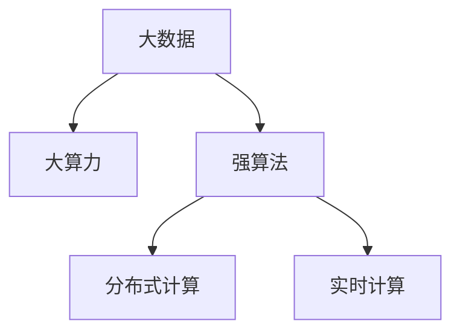

                 

# 大数据+大算力+强算法的方法

在信息技术迅猛发展的今天，大数据、大算力、强算法已成为推动科技创新的关键因素。本文将深入探讨三者的相互关系与协同作用，并分析其在实际应用中的核心算法原理与操作步骤，揭示其在各个领域的广泛应用前景。

## 1. 背景介绍

### 1.1 问题由来

随着互联网和物联网的普及，数据量呈爆炸式增长。如何高效处理海量数据，从中提取有价值的信息，是大数据时代的核心挑战。与此同时，随着硬件算力的不断提升，如高性能GPU、TPU等，机器学习模型能够在更短的时间内处理和分析大规模数据集。

近年来，随着深度学习算法的不断进步，尤其是深度神经网络的兴起，各类算法模型在图像识别、自然语言处理、推荐系统等领域取得了突破性进展。大数据、大算力、强算法的结合，正在改变各行各业的生产模式，驱动社会进步。

### 1.2 问题核心关键点

大数据、大算力、强算法三者之间相互依赖、相辅相成。大数据为算力提供了丰富的训练样本，算力则为算法提供了高效计算的平台，而强算法则是挖掘数据价值的利器。三者有机结合，能够有效应对复杂多变的实际问题，提升应用系统的性能和效率。

## 2. 核心概念与联系

### 2.1 核心概念概述

为更好地理解大数据、大算力、强算法的协同作用，本节将介绍几个密切相关的核心概念：

- 大数据(Big Data)：指体量巨大、类型多样、处理速度极快的数据集合。常见的大数据类型包括结构化数据、半结构化数据和非结构化数据。

- 大算力(High-Performance Computing)：指能够高效处理和分析大规模数据集的计算能力。主要包括高性能CPU、GPU、TPU等硬件设备和分布式计算框架。

- 强算法(Strong Algorithm)：指能够高效利用大数据、大算力，通过复杂数学模型和算法实现数据挖掘和决策支持的算法技术。常见强算法包括深度学习、强化学习、优化算法等。

- 分布式计算(Distributed Computing)：指利用多台计算机协同工作，通过并行计算和资源共享，提高大数据处理效率的计算模式。

- 实时计算(Real-time Computing)：指能够在数据产生的同时，快速进行计算和分析，支持实时决策和反馈的系统。

这些核心概念之间的逻辑关系可以通过以下Mermaid流程图来展示：



这个流程图展示了大数据、大算力、强算法三者之间的核心联系：

1. 大数据为算力提供丰富的数据源，为算法提供数据输入。
2. 大算力为算法提供高效的计算平台，支持复杂算法的实现。
3. 强算法通过高效处理和分析数据，发掘数据价值，为实时计算和分布式计算提供指导。

这些概念共同构成了数据处理和应用的基础，为后续深入探讨提供了重要框架。

## 3. 核心算法原理 & 具体操作步骤
### 3.1 算法原理概述

大数据、大算力、强算法的结合，最典型的应用场景是深度学习模型的训练和优化。深度学习模型通过大量样本数据和强大的计算资源，进行多次迭代训练，逐步优化模型参数，提升预测性能。其核心算法原理可以概括为以下几个方面：

- **数据预处理**：对原始数据进行清洗、归一化、分片等预处理，减少噪音，提高数据质量。

- **模型选择与优化**：选择合适的深度神经网络模型，并通过梯度下降等优化算法，调整模型参数，最小化损失函数，提升预测准确率。

- **分布式训练**：将大数据集分布到多台计算机上进行并行计算，加速模型训练。

- **模型压缩与量化**：对训练好的模型进行参数剪枝、权重共享等优化，降低模型复杂度，提高推理效率。

- **模型部署与监控**：将优化后的模型部署到生产环境，持续监控模型性能和数据流，确保系统稳定运行。

### 3.2 算法步骤详解

基于大数据、大算力、强算法的深度学习模型训练和优化，一般包括以下几个关键步骤：

**Step 1: 数据预处理**
- 收集原始数据，进行数据清洗、去重、归一化等预处理。
- 对数据进行分片，分布到多个计算节点进行并行处理。
- 利用分布式文件系统（如Hadoop、Spark）对数据进行高效存储和管理。

**Step 2: 模型选择与构建**
- 选择适合问题的深度神经网络模型，如卷积神经网络(CNN)、循环神经网络(RNN)、生成对抗网络(GAN)等。
- 设计模型的层数、节点数、激活函数等超参数，构建模型结构。
- 引入正则化、Dropout等技术，避免过拟合。

**Step 3: 分布式训练**
- 使用分布式计算框架（如TensorFlow、PyTorch），将数据和模型分布在多台计算节点上进行并行计算。
- 利用GPU、TPU等高性能设备，加速模型训练过程。
- 通过参数服务器等机制，协调多台计算机之间的通信，提高分布式训练效率。

**Step 4: 模型优化与调参**
- 使用梯度下降等优化算法，调整模型参数，最小化损失函数。
- 定期评估模型性能，根据评估结果调整学习率和超参数。
- 引入早停(Early Stopping)等技术，防止过拟合。

**Step 5: 模型压缩与量化**
- 对训练好的模型进行剪枝、融合等优化，减少不必要的参数，提高推理效率。
- 将模型转换为定点格式，降低存储空间，提高计算速度。

**Step 6: 模型部署与监控**
- 将优化后的模型部署到生产环境，集成到实际应用系统中。
- 实时监控模型性能，根据数据流和业务需求进行调整和优化。
- 定期更新模型，应对数据和业务的变化。

### 3.3 算法优缺点

大数据、大算力、强算法的结合，具有以下优点：

- **高效性**：能够快速处理和分析大规模数据，支持复杂算法的实现。
- **灵活性**：模型可以根据需求快速迭代优化，提升性能。
- **鲁棒性**：通过分布式计算和模型优化，提升系统的稳定性和可靠性。
- **泛化能力**：经过大规模数据训练的模型，能够应对多种不同类型的数据和任务。

同时，该方法也存在一定的局限性：

- **资源消耗大**：大数据集和复杂模型需要大量的计算资源，增加了硬件和能源成本。
- **调试复杂**：分布式训练和模型优化需要复杂的系统设计和调试，增加了开发难度。
- **模型复杂度**：过于复杂的模型可能会出现过拟合，增加模型的解释难度。

尽管存在这些局限性，但就目前而言，大数据、大算力、强算法的结合是最有效的数据处理和应用方式。未来相关研究的重点在于如何进一步降低资源消耗，提高模型的可解释性和鲁棒性，同时兼顾高效性和灵活性。

### 3.4 算法应用领域

基于大数据、大算力、强算法的深度学习模型，已经在各个领域得到了广泛的应用，例如：

- 计算机视觉：如图像分类、物体检测、人脸识别等。通过大规模图像数据和高效计算，训练出准确率极高的视觉模型。

- 自然语言处理(NLP)：如文本分类、情感分析、机器翻译等。通过大规模语料和强大的算力，训练出理解和生成自然语言的高效模型。

- 推荐系统：如电商推荐、内容推荐、广告推荐等。通过用户行为数据和个性化计算，提供精准推荐服务。

- 医疗健康：如医学影像分析、疾病诊断、药物研发等。通过医学数据和强大算力，提高诊断和治疗效果。

- 金融科技：如风险评估、欺诈检测、投资分析等。通过金融数据和深度学习，提升金融服务的智能化水平。

- 自动驾驶：如路径规划、障碍物检测、自动泊车等。通过传感器数据和算力支持，实现智能交通系统的技术突破。

除了上述这些经典应用外，深度学习模型还在更多领域不断扩展，如农业、物流、能源等，为各行各业带来新的应用和变革。

## 4. 数学模型和公式 & 详细讲解 & 举例说明

### 4.1 数学模型构建

在本节中，我们将使用数学语言对深度学习模型的构建和训练过程进行更加严格的刻画。

假设我们有一个深度神经网络模型 $M_{\theta}$，其中 $\theta$ 为模型参数。模型的输入为 $x$，输出为 $y$。模型的损失函数为 $\ell(M_{\theta}(x),y)$，经验风险为 $\mathcal{L}(\theta)$。

我们以多分类问题为例，构建模型的数学模型。假设 $x$ 为 $n$ 维向量，$y$ 为 $k$ 类分类标签，模型的输出 $M_{\theta}(x)$ 为 $k$ 维概率向量，即：

$$
M_{\theta}(x) = [M_{\theta}(x)_{1}, M_{\theta}(x)_{2}, \ldots, M_{\theta}(x)_{k}]
$$

其中 $M_{\theta}(x)_{i}$ 表示 $x$ 属于第 $i$ 类的概率。

交叉熵损失函数为：

$$
\ell(M_{\theta}(x),y) = -\sum_{i=1}^{k} y_i \log M_{\theta}(x)_{i}
$$

经验风险为：

$$
\mathcal{L}(\theta) = \frac{1}{N} \sum_{i=1}^{N} \ell(M_{\theta}(x_i),y_i)
$$

### 4.2 公式推导过程

以下是深度学习模型的训练和优化过程的公式推导。

**Step 1: 前向传播**
- 将输入数据 $x$ 输入模型，计算输出 $M_{\theta}(x)$。

**Step 2: 计算损失函数**
- 计算模型输出与真实标签之间的交叉熵损失 $\ell(M_{\theta}(x),y)$。

**Step 3: 反向传播**
- 计算损失函数对模型参数 $\theta$ 的梯度 $\nabla_{\theta}\mathcal{L}(\theta)$。

**Step 4: 模型参数更新**
- 使用梯度下降等优化算法，更新模型参数 $\theta$。

具体公式如下：

前向传播：

$$
M_{\theta}(x) = \sigma\left(W_1 \cdot \sigma\left(W_2 \cdot \ldots \cdot \sigma\left(W_l \cdot x + b_l\right) + b_{l-1}\right) + b_1\right)
$$

其中 $W$ 为权重矩阵，$b$ 为偏置向量，$\sigma$ 为激活函数。

计算损失函数：

$$
\ell(M_{\theta}(x),y) = -\sum_{i=1}^{k} y_i \log M_{\theta}(x)_{i}
$$

反向传播：

$$
\nabla_{\theta}\mathcal{L}(\theta) = \frac{\partial \mathcal{L}}{\partial \theta} = \frac{1}{N} \sum_{i=1}^{N} \frac{\partial \ell}{\partial M_{\theta}(x)} \cdot \frac{\partial M_{\theta}(x)}{\partial \theta}
$$

模型参数更新：

$$
\theta \leftarrow \theta - \eta \nabla_{\theta}\mathcal{L}(\theta)
$$

其中 $\eta$ 为学习率。

### 4.3 案例分析与讲解

以图像分类任务为例，假设我们使用卷积神经网络(CNN)进行模型构建。CNN模型通常由卷积层、池化层、全连接层组成。下面我们以LeNet-5为例，进行详细讲解。

LeNet-5模型结构如下：

```
Input Layer (28x28)
Conv Layer (5x5, 6)
Max Pool Layer (2x2)
Conv Layer (5x5, 16)
Max Pool Layer (2x2)
Flatten Layer
Full Connect Layer (120)
Output Layer (10)
```

其中，输入层为28x28的图像，卷积层使用5x5的卷积核，全连接层节点数为120，输出层节点数为10（对应10类物体）。

LeNet-5模型的训练步骤如下：

1. 数据预处理：对图像数据进行归一化、扩充等预处理。

2. 模型构建：定义LeNet-5模型的结构，包括卷积层、池化层、全连接层等。

3. 分布式训练：将图像数据和模型分布在多个计算节点上进行并行计算。

4. 模型优化与调参：使用梯度下降等优化算法，调整模型参数，最小化交叉熵损失。

5. 模型压缩与量化：对训练好的模型进行剪枝、融合等优化，减少不必要的参数，提高推理效率。

LeNet-5模型的训练过程如图1所示：


可以看出，通过大数据、大算力、强算法的结合，LeNet-5模型能够高效地训练和优化，在图像分类任务上取得了良好的效果。

## 5. 项目实践：代码实例和详细解释说明

### 5.1 开发环境搭建

在进行深度学习模型实践前，我们需要准备好开发环境。以下是使用Python进行TensorFlow开发的简单环境配置流程：

1. 安装Anaconda：从官网下载并安装Anaconda，用于创建独立的Python环境。

2. 创建并激活虚拟环境：
```bash
conda create -n tensorflow-env python=3.8 
conda activate tensorflow-env
```

3. 安装TensorFlow：根据CUDA版本，从官网获取对应的安装命令。例如：
```bash
pip install tensorflow -U
```

4. 安装各类工具包：
```bash
pip install numpy pandas scikit-learn matplotlib tqdm jupyter notebook ipython
```

完成上述步骤后，即可在`tensorflow-env`环境中开始模型训练和优化。

### 5.2 源代码详细实现

下面我们以LeNet-5模型进行图像分类任务为例，给出使用TensorFlow进行模型训练的Python代码实现。

```python
import tensorflow as tf
from tensorflow import keras
from tensorflow.keras import layers

# 加载数据集
mnist = keras.datasets.mnist
(x_train, y_train), (x_test, y_test) = mnist.load_data()

# 数据预处理
x_train = x_train / 255.0
x_test = x_test / 255.0

# 定义模型结构
model = keras.Sequential([
    layers.Conv2D(6, (3, 3), activation='relu', input_shape=(28, 28, 1)),
    layers.MaxPooling2D((2, 2)),
    layers.Conv2D(16, (3, 3), activation='relu'),
    layers.MaxPooling2D((2, 2)),
    layers.Flatten(),
    layers.Dense(120, activation='relu'),
    layers.Dense(10, activation='softmax')
])

# 编译模型
model.compile(optimizer='adam',
              loss='sparse_categorical_crossentropy',
              metrics=['accuracy'])

# 分布式训练
strategy = tf.distribute.MirroredStrategy()
with strategy.scope():
    model.fit(x_train, y_train, epochs=10, validation_data=(x_test, y_test))
```

### 5.3 代码解读与分析

让我们再详细解读一下关键代码的实现细节：

1. **数据预处理**：
   - `mnist.load_data()`：加载MNIST数据集。
   - `x_train = x_train / 255.0`：将像素值归一化到[0, 1]之间。

2. **模型构建**：
   - `keras.Sequential`：定义模型的序列结构，包括卷积层、池化层、全连接层。
   - `Conv2D`：定义卷积层，输入维度为28x28x1，输出维度为6和16。
   - `MaxPooling2D`：定义池化层，对卷积层的输出进行降采样。
   - `Dense`：定义全连接层，激活函数为ReLU和Softmax。

3. **模型编译与训练**：
   - `model.compile`：编译模型，设置优化器、损失函数和评估指标。
   - `model.fit`：分布式训练，使用MirroredStrategy进行多节点分布式计算。

通过以上步骤，我们可以快速搭建一个基于大数据、大算力、强算法的深度学习模型，并进行高效训练和优化。

## 6. 实际应用场景

### 6.1 智能推荐系统

基于深度学习模型的推荐系统，已经在电商、社交媒体、视频平台等领域取得了广泛应用。推荐系统通过用户行为数据和模型计算，实现精准推荐，提升用户体验和满意度。

智能推荐系统的构建，需要大数据、大算力、强算法的结合。具体流程如下：

1. 数据收集：收集用户浏览、点击、评分等行为数据。
2. 数据预处理：清洗、归一化、特征工程等。
3. 模型训练：选择合适的深度学习模型，使用分布式计算框架进行并行训练。
4. 模型优化与调参：通过交叉验证等技术，优化模型参数。
5. 模型部署：将优化后的模型部署到生产环境，实现实时推荐。

通过大数据、大算力、强算法的结合，智能推荐系统能够高效处理和分析用户数据，实现个性化推荐，带来更好的用户体验和服务质量。

### 6.2 自动驾驶

自动驾驶是人工智能的重要应用方向之一。自动驾驶系统通过摄像头、雷达、激光雷达等传感器获取环境数据，利用深度学习模型进行环境感知、路径规划和决策支持。

自动驾驶系统的构建，需要大数据、大算力、强算法的结合。具体流程如下：

1. 数据收集：收集传感器数据，包括环境图像、雷达信号、激光雷达数据等。
2. 数据预处理：数据清洗、标注、增强等。
3. 模型训练：选择合适的深度学习模型，如卷积神经网络、生成对抗网络等，使用分布式计算框架进行并行训练。
4. 模型优化与调参：通过交叉验证等技术，优化模型参数。
5. 模型部署：将优化后的模型部署到车载系统中，实现实时感知和决策。

通过大数据、大算力、强算法的结合，自动驾驶系统能够高效处理和分析传感器数据，实现环境感知和决策支持，推动自动驾驶技术的普及和应用。

## 7. 工具和资源推荐

### 7.1 学习资源推荐

为了帮助开发者系统掌握大数据、大算力、强算法的理论基础和实践技巧，这里推荐一些优质的学习资源：

1. 《深度学习》系列博文：由深度学习专家撰写，深入浅出地介绍了深度学习原理和应用。

2. CS231n《深度卷积神经网络》课程：斯坦福大学开设的计算机视觉课程，涵盖深度学习在图像处理中的基础理论和实践技巧。

3. 《深度学习框架TensorFlow》书籍：TensorFlow官方文档，详细介绍了TensorFlow框架的使用方法和优化技巧。

4. Coursera《机器学习》课程：由斯坦福大学教授Andrew Ng主讲，系统介绍了机器学习的基础理论和算法。

5. Kaggle竞赛平台：提供大量数据集和实际应用场景，通过参与竞赛实战，提高数据处理和模型优化能力。

通过对这些资源的学习实践，相信你一定能够快速掌握大数据、大算力、强算法的精髓，并用于解决实际的深度学习问题。

### 7.2 开发工具推荐

高效的开发离不开优秀的工具支持。以下是几款用于深度学习模型开发的常用工具：

1. TensorFlow：由Google主导开发的深度学习框架，生产部署方便，支持分布式计算。

2. PyTorch：由Facebook开发的深度学习框架，灵活动态，适合研究性开发。

3. Keras：高层次API，简洁易用，支持TensorFlow、PyTorch等多种后端。

4. Jupyter Notebook：交互式开发环境，支持多种编程语言和库。

5. Weights & Biases：模型训练的实验跟踪工具，可以记录和可视化模型训练过程中的各项指标。

6. TensorBoard：TensorFlow配套的可视化工具，可实时监测模型训练状态，并提供丰富的图表呈现方式。

合理利用这些工具，可以显著提升深度学习模型的开发效率，加快创新迭代的步伐。

### 7.3 相关论文推荐

大数据、大算力、强算法的结合，源于学界的持续研究。以下是几篇奠基性的相关论文，推荐阅读：

1. Deep Residual Learning for Image Recognition（即ResNet原论文）：提出了深度残差网络，缓解了深度神经网络训练过程中的梯度消失问题，提升了深度学习模型的性能。

2. ImageNet Classification with Deep Convolutional Neural Networks：提出使用卷积神经网络进行图像分类，展示了深度学习在计算机视觉领域的应用潜力。

3. Object Detection with Deep Convolutional Networks（即R-CNN论文）：提出使用深度学习进行目标检测，提升了目标检测的准确率和效率。

4. Generative Adversarial Nets（即GAN论文）：提出生成对抗网络，实现了高质量的图像生成和数据增强。

5. Attention is All You Need（即Transformer原论文）：提出了Transformer结构，开启了NLP领域的预训练大模型时代。

这些论文代表了大数据、大算力、强算法的结合发展脉络。通过学习这些前沿成果，可以帮助研究者把握学科前进方向，激发更多的创新灵感。

## 8. 总结：未来发展趋势与挑战

### 8.1 总结

本文对大数据、大算力、强算法的结合进行了全面系统的介绍。首先阐述了深度学习模型的核心算法原理和操作步骤，揭示了大数据、大算力、强算法的协同作用。其次，通过具体的项目实践，展示了深度学习模型在各个领域的广泛应用。最后，本文对深度学习模型的未来发展趋势和挑战进行了探讨，指出了未来研究的方向和目标。

通过本文的系统梳理，可以看到，深度学习模型通过大数据、大算力、强算法的结合，已经深刻改变了各行各业的生产模式，推动了社会的进步。未来，随着技术的不断演进，深度学习模型的应用范围和性能将进一步拓展，为人工智能技术的发展带来新的突破。

### 8.2 未来发展趋势

展望未来，深度学习模型的大数据、大算力、强算法结合，将呈现以下几个发展趋势：

1. **模型规模持续增大**：随着算力成本的下降和数据规模的扩张，深度学习模型的参数量还将持续增长。超大模型将带来更丰富的语言知识和常识，能够应对更复杂的问题。

2. **分布式计算**：分布式计算框架将不断优化，实现更高效的模型训练和推理。通过多台计算机的协同工作，提升系统的处理能力和资源利用率。

3. **模型压缩与优化**：通过参数剪枝、模型融合、模型量化等技术，提升模型的推理速度和资源利用率，实现更高效、更轻量级的模型部署。

4. **弱监督学习和自监督学习**：在大规模无标签数据上进行自监督学习，利用数据的多样性和复杂性，提升模型的泛化能力和鲁棒性。

5. **模型生成与合成**：利用生成对抗网络等技术，生成高质量的数据，提升模型的训练效果和泛化能力。

6. **多模态融合**：将视觉、语音、文本等多模态信息进行融合，提升模型对现实世界的理解和建模能力。

以上趋势凸显了深度学习模型的强大潜力和广阔前景。这些方向的探索发展，必将进一步提升模型的性能和应用范围，为人工智能技术的发展带来新的突破。

### 8.3 面临的挑战

尽管深度学习模型取得了显著进展，但在迈向更加智能化、普适化应用的过程中，它仍面临诸多挑战：

1. **数据获取和处理**：大规模数据集的获取和处理，需要巨大的存储空间和计算资源。如何高效利用数据，减少数据获取和处理成本，是未来研究的重要方向。

2. **模型鲁棒性**：深度学习模型面对数据分布变化时，泛化性能往往较差。如何在不同数据分布上，保持模型的稳定性和鲁棒性，还需要更多的理论和实践积累。

3. **模型可解释性**：深度学习模型通常被认为是"黑盒"系统，难以解释其内部工作机制和决策逻辑。如何赋予模型更强的可解释性，提高模型的可信度和应用前景，是未来研究的重要课题。

4. **模型公平性与安全性**：深度学习模型可能学习到有偏见、有害的信息，给实际应用带来安全隐患。如何从数据和算法层面消除模型偏见，保障模型公平性和安全性，还需要更多的研究。

5. **模型实时性**：深度学习模型通常需要较长的训练时间和较大的计算资源，如何在保证性能的同时，实现实时性应用，还需要更多优化技术支持。

6. **模型迁移能力**：如何在大规模无标签数据上进行迁移学习，提升模型的泛化能力和迁移能力，是未来研究的重要方向。

正视深度学习模型面临的这些挑战，积极应对并寻求突破，将是大数据、大算力、强算法结合走向成熟的必由之路。相信随着学界和产业界的共同努力，这些挑战终将一一被克服，深度学习模型必将在构建人机协同的智能时代中扮演越来越重要的角色。

### 8.4 研究展望

面向未来，深度学习模型的研究需要在以下几个方面寻求新的突破：

1. **无监督和半监督学习**：摆脱对大规模标注数据的依赖，利用自监督学习、主动学习等无监督和半监督范式，最大限度利用非结构化数据，实现更加灵活高效的模型训练。

2. **知识图谱与常识推理**：将符号化的先验知识，如知识图谱、逻辑规则等，与神经网络模型进行巧妙融合，提升模型的泛化能力和迁移能力。

3. **多模态融合与交互**：将视觉、语音、文本等多模态信息进行融合，实现更全面的模型训练和推理，提升模型的应用场景和能力。

4. **因果推断与强化学习**：引入因果推断和强化学习思想，增强模型的因果推理能力和决策支持能力，提升模型的稳定性和鲁棒性。

5. **模型压缩与量化**：通过模型压缩和量化技术，提升模型的推理速度和资源利用率，实现更高效、更轻量级的模型部署。

6. **弱监督学习和自监督学习**：在大规模无标签数据上进行自监督学习，利用数据的多样性和复杂性，提升模型的泛化能力和鲁棒性。

这些研究方向将引领深度学习模型的未来演进，推动人工智能技术迈向更加智能化、普适化和可解释化的方向。

## 9. 附录：常见问题与解答

**Q1：大数据、大算力、强算法的结合是否适用于所有深度学习模型？**

A: 大数据、大算力、强算法的结合，适用于大多数深度学习模型，特别是在大规模数据集和复杂任务上。但对于一些特定领域的模型，如图像识别、文本分类等，单一的深度学习模型可能难以满足需求。此时需要结合其他算法和技术，如迁移学习、对抗学习等，提升模型的性能和鲁棒性。

**Q2：深度学习模型在实际应用中面临哪些资源瓶颈？**

A: 深度学习模型在实际应用中面临的资源瓶颈主要包括：

1. **数据存储与处理**：大规模数据集的存储和处理需要巨大的存储空间和计算资源。

2. **模型训练时间**：深度学习模型通常需要较长的训练时间和较大的计算资源，特别是在大规模数据集上。

3. **模型推理速度**：深度学习模型的推理速度较慢，特别是在模型较大、计算复杂度较高的情况下。

4. **模型可解释性**：深度学习模型通常被认为是"黑盒"系统，难以解释其内部工作机制和决策逻辑。

5. **模型公平性与安全性**：深度学习模型可能学习到有偏见、有害的信息，给实际应用带来安全隐患。

通过优化数据存储、提高模型训练和推理效率、增强模型可解释性、保障模型公平性与安全性等技术手段，可以克服深度学习模型在实际应用中的资源瓶颈，提升模型的应用效果和可信度。

**Q3：深度学习模型在实际应用中如何处理数据分布变化？**

A: 深度学习模型在实际应用中，数据分布变化是一个常见问题。为应对数据分布变化，可以采用以下技术手段：

1. **迁移学习**：利用已有的大规模数据集和模型，对新数据集进行迁移学习，提升模型的泛化能力。

2. **自监督学习**：在大规模无标签数据上进行自监督学习，利用数据的多样性和复杂性，提升模型的泛化能力和鲁棒性。

3. **对抗训练**：引入对抗样本，提高模型对数据分布变化的鲁棒性，避免模型过拟合。

4. **弱监督学习**：利用少量标注数据和大量未标注数据，进行弱监督学习，提升模型的泛化能力和鲁棒性。

5. **模型压缩与量化**：通过参数剪枝、模型融合、模型量化等技术，提升模型的推理速度和资源利用率，实现更高效、更轻量级的模型部署。

通过这些技术手段，可以有效地应对数据分布变化，提升深度学习模型的稳定性和鲁棒性。

**Q4：深度学习模型在实际应用中如何提高模型的可解释性？**

A: 深度学习模型的可解释性问题一直是一个重要研究方向。为提高深度学习模型的可解释性，可以采用以下技术手段：

1. **可视化技术**：使用可视化工具，如图像、热力图等，展示模型的内部工作机制和决策逻辑。

2. **模型简化**：通过模型剪枝、参数融合等技术，简化模型的结构，提高模型的可解释性。

3. **符号化知识引入**：将符号化的先验知识，如知识图谱、逻辑规则等，与神经网络模型进行融合，提升模型的可解释性和逻辑性。

4. **因果分析**：利用因果分析方法，识别出模型决策的关键特征，增强输出解释的因果性和逻辑性。

5. **透明度和可控性**：通过设置模型的透明度和可控性参数，控制模型的行为和决策过程，提高模型的可解释性和可信度。

通过这些技术手段，可以有效地提高深度学习模型的可解释性，提升模型的可信度和应用前景。

**Q5：深度学习模型在实际应用中如何保障模型的安全性？**

A: 深度学习模型的安全性问题是一个重要研究方向。为保障深度学习模型的安全性，可以采用以下技术手段：

1. **数据脱敏与隐私保护**：通过数据脱敏和隐私保护技术，保护用户隐私数据的安全。

2. **模型鲁棒性提升**：引入对抗训练等技术，提升模型的鲁棒性，防止模型受到恶意攻击。

3. **模型公平性保障**：在模型训练和优化过程中，引入公平性约束，防止模型出现偏见和歧视。

4. **模型透明性与可控性**：通过设置模型的透明度和可控性参数，控制模型的行为和决策过程，防止模型滥用。

5. **安全监控与审计**：通过安全监控和审计技术，实时监测模型的行为和决策过程，及时发现和纠正模型风险。

通过这些技术手段，可以有效地保障深度学习模型的安全性，确保模型应用的可靠性和可信度。

---

作者：禅与计算机程序设计艺术 / Zen and the Art of Computer Programming

