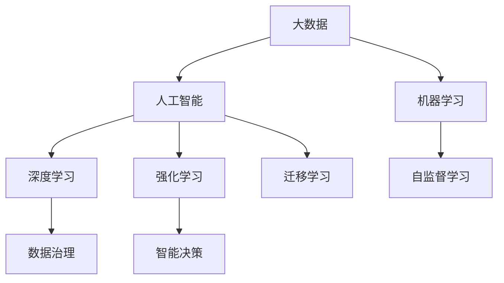

                 

# 大数据与AI未来的发展方向

## 1. 背景介绍

### 1.1 问题由来
进入21世纪以来，伴随着信息技术的迅猛发展和互联网应用的普及，人类社会数据量呈指数级增长，对大数据分析的需求日益迫切。大数据不仅为科研、商业、政府等领域提供了前所未有的数据资源，也催生了人工智能（AI）技术的快速进步。大数据与AI的深度融合，推动了数据驱动智能决策和自动化运营的浪潮，带来了革命性的业务变革和创新应用。

然而，大数据与AI的融合仍面临诸多挑战。如何高效处理海量数据，如何合理运用AI技术，如何将数据转化为业务价值，如何平衡数据隐私和数据安全等问题，都迫切需要学术界、产业界和政策界的共同努力。

## 2. 核心概念与联系

### 2.1 核心概念概述

为更好地理解大数据与AI未来的发展方向，本节将介绍几个密切相关的核心概念：

- 大数据（Big Data）：指超大规模（Peta/Exa/Zetta字节级别）、多源异构、实时动态的数据集合，具有高复杂度、高维度、高速度等特点。
- 人工智能（AI）：利用计算机算法和机器学习技术，模拟人类智能活动，实现信息自动提取、知识自动获取、智能决策等功能。
- 机器学习（Machine Learning）：通过数据训练模型，使模型自动发现和提取规律，从而实现对未知数据的预测和决策。
- 深度学习（Deep Learning）：利用多层神经网络进行数据处理，自动提取高层次特征，有效处理复杂数据。
- 强化学习（Reinforcement Learning）：通过试错过程，使智能体在与环境的交互中不断学习，优化策略，实现智能决策。
- 迁移学习（Transfer Learning）：利用已学习到的知识，在类似新任务上获得更好的学习效果。
- 自监督学习（Self-Supervised Learning）：利用数据自身的特性，无需人工标注，进行模型训练。
- 联邦学习（Federated Learning）：多方参与的分布式学习框架，保护数据隐私的同时实现知识共享。
- 数据治理（Data Governance）：确保数据质量、保障数据隐私、提高数据利用率的管理策略和规范。
- 智能决策（Intelligent Decision Making）：利用AI技术辅助或自动化进行决策，提升决策效率和准确性。

这些核心概念之间的逻辑关系可以通过以下Mermaid流程图来展示：



这个流程图展示了大数据与AI的核心概念及其之间的关系：

1. 大数据作为AI的训练数据来源，为AI模型提供丰富多样化的训练样本。
2. 机器学习、深度学习和强化学习等AI技术，通过模型训练、特征提取和策略优化，实现对大数据的深度利用。
3. 自监督学习和迁移学习等技术，有效降低对标注数据的依赖，提升模型泛化能力。
4. 数据治理策略确保数据质量和安全，为AI模型提供可靠的训练数据。
5. 智能决策技术将AI模型应用于决策支持、智能运营等领域，实现高效、智能的业务决策。

这些概念共同构成了大数据与AI的应用框架，推动了数据驱动智能决策和自动化运营的进程。通过理解这些核心概念，我们可以更好地把握大数据与AI的融合趋势，探索未来的技术方向。

## 3. 核心算法原理 & 具体操作步骤
### 3.1 算法原理概述

大数据与AI的融合，本质上是数据驱动的智能分析和决策过程。这一过程通常包括以下几个关键步骤：

1. **数据采集与清洗**：通过多种渠道采集数据，并进行预处理，去除噪声和冗余信息，确保数据的质量和可用性。
2. **数据存储与计算**：将清洗后的数据存储在分布式文件系统或数据库中，使用高性能计算框架进行数据处理和分析。
3. **模型训练与优化**：根据业务需求，选择合适的人工智能算法，利用大数据进行模型训练和优化，提升模型性能。
4. **模型评估与部署**：在测试集上评估模型效果，进行必要的调整和优化，然后将模型部署到实际应用中。
5. **智能决策与迭代优化**：将模型应用于业务决策或运营流程中，通过反馈和迭代，持续优化模型和决策效果。

这一过程的技术核心在于数据处理、模型训练和决策支持等三个方面。

### 3.2 算法步骤详解

以下是基于大数据与AI融合的核心算法原理和具体操作步骤的详细描述：

#### 数据处理

数据处理是整个大数据与AI融合过程的基础，具体包括以下几个步骤：

1. **数据采集**：通过网络爬虫、传感器、社交媒体、日志文件等多种渠道，自动收集数据。
2. **数据清洗**：去除噪声数据、缺失值、异常值等，确保数据的质量。
3. **数据集成**：将来自不同源的数据进行整合，消除数据冗余和冲突。
4. **数据转换**：将原始数据转换为适合AI模型使用的格式，如标准化、归一化、特征工程等。
5. **数据存储**：将处理后的数据存储在分布式文件系统（如Hadoop、Spark）或数据库（如MySQL、NoSQL）中，确保数据的高效访问和快速处理。

#### 模型训练

模型训练是大数据与AI融合的关键步骤，主要包括以下几个步骤：

1. **数据预处理**：利用数据清洗、特征工程等技术，将原始数据转换为适合模型训练的格式。
2. **模型选择与设计**：根据业务需求，选择合适的人工智能算法，设计合理的模型架构。
3. **模型训练**：利用大数据集进行模型训练，通过梯度下降等优化算法，最小化损失函数，提升模型性能。
4. **模型验证**：在验证集上评估模型效果，确保模型泛化能力。
5. **超参数调优**：根据验证集的表现，调整模型超参数，如学习率、批次大小、正则化强度等，优化模型性能。

#### 决策支持

决策支持是AI模型应用的核心环节，主要包括以下几个步骤：

1. **模型部署**：将训练好的模型部署到实际应用中，通常使用RESTful API或微服务架构。
2. **数据接入**：通过API接口，实时获取新数据，用于模型推理。
3. **模型推理**：利用模型对新数据进行推理，生成预测结果或决策建议。
4. **结果展示**：将推理结果以可视化形式展示，辅助业务决策。
5. **反馈与迭代**：收集模型输出结果的反馈，进行模型调整和优化，持续提升决策效果。

### 3.3 算法优缺点

基于大数据与AI融合的算法，具有以下优点：

1. **数据利用率高**：通过处理海量数据，能够发现数据背后的规律和趋势，提升决策的准确性和效率。
2. **模型泛化能力强**：基于大数据训练的AI模型，具备较强的泛化能力，能够应对未知数据。
3. **决策智能化**：AI模型能够辅助或自动化决策过程，减少人为错误，提高决策效率和质量。
4. **应用范围广**：大数据与AI融合技术，可以应用于多个领域，如金融、医疗、交通、制造等，推动各行业的数字化转型。

同时，这一算法也存在一些缺点：

1. **数据质量依赖**：模型的性能很大程度上依赖于数据的质量和完整性，数据噪声和缺失可能影响模型效果。
2. **模型复杂度高**：训练复杂模型需要大量计算资源和存储空间，对硬件设施要求较高。
3. **决策透明性不足**：部分AI模型（如深度学习）的决策过程难以解释，难以理解其内部工作机制。
4. **隐私和安全风险**：大数据和AI模型可能涉及敏感信息，需要采取严格的隐私保护和安全措施。

尽管存在这些局限性，但就目前而言，大数据与AI的融合已成为推动智能决策和自动化运营的重要手段，其在各行各业的应用前景广阔。未来相关研究的重点在于如何进一步降低数据处理的复杂度，提高模型泛化能力，增强决策的透明性和安全性，以及探索新的数据驱动的智能决策方法。

### 3.4 算法应用领域

基于大数据与AI融合的算法，已经在多个领域得到了广泛应用，包括但不限于：

1. **金融科技**：利用大数据和AI技术进行风险评估、信用评分、智能投顾、反欺诈检测等。
2. **医疗健康**：通过大数据分析患者数据，辅助医生进行诊断和治疗，提升医疗服务的精准度和效率。
3. **智能制造**：利用大数据和AI技术进行设备监控、故障预测、质量控制、供应链优化等。
4. **智慧城市**：通过大数据和AI技术进行城市管理、交通调度、环境监测、公共安全等，提升城市治理水平。
5. **电子商务**：利用大数据和AI技术进行客户分析、推荐系统、个性化营销、智能客服等，提升用户体验和销售效率。
6. **社交媒体**：通过大数据和AI技术进行内容推荐、舆情分析、广告投放、用户行为分析等，提升平台运营效果。

此外，大数据与AI融合技术还在智慧物流、智能农业、环境监测、智能家居等多个领域得到了应用，为各行各业带来了变革性的影响。随着技术的不断进步，相信大数据与AI的融合将更加广泛，推动更多领域实现数字化、智能化、自动化。

## 4. 数学模型和公式 & 详细讲解
### 4.1 数学模型构建

在数学模型方面，大数据与AI融合的算法通常可以表示为以下几个步骤：

1. **数据表示**：将原始数据表示为向量或矩阵，方便进行数值计算。
2. **损失函数**：定义合适的损失函数，衡量模型输出与真实标签之间的差异。
3. **优化算法**：选择合适优化算法，通过梯度下降等方法最小化损失函数。
4. **模型评估**：在测试集上评估模型效果，计算各种指标（如准确率、召回率、F1分数等）。

以二分类任务为例，常见的数学模型和公式推导如下：

**输入表示**：设输入数据为 $x \in \mathbb{R}^n$，表示为 $n$ 维向量。

**模型表示**：设模型输出为 $y \in [0,1]$，表示为二分类概率。

**损失函数**：设真实标签为 $y \in \{0,1\}$，定义二分类交叉熵损失函数：

$$
\ell(y,\hat{y}) = -[y\log \hat{y} + (1-y)\log (1-\hat{y})]
$$

**优化算法**：选择优化算法（如AdamW、SGD等），最小化损失函数：

$$
\theta \leftarrow \theta - \eta \nabla_{\theta}\ell(y,\hat{y})
$$

其中 $\eta$ 为学习率，$\nabla_{\theta}\ell(y,\hat{y})$ 为损失函数对模型参数 $\theta$ 的梯度。

**模型评估**：在测试集上计算模型预测准确率：

$$
\text{Accuracy} = \frac{1}{N} \sum_{i=1}^N \mathbb{I}(y_i = \hat{y}_i)
$$

其中 $\mathbb{I}$ 为示性函数，表示预测结果与真实标签相等时取1，否则取0。

### 4.2 公式推导过程

以下对二分类任务的数学模型和公式推导进行详细讲解：

**输入表示**：设输入数据为 $x \in \mathbb{R}^n$，表示为 $n$ 维向量。

**模型表示**：设模型输出为 $y \in [0,1]$，表示为二分类概率。

**损失函数**：设真实标签为 $y \in \{0,1\}$，定义二分类交叉熵损失函数：

$$
\ell(y,\hat{y}) = -[y\log \hat{y} + (1-y)\log (1-\hat{y})]
$$

**优化算法**：选择优化算法（如AdamW、SGD等），最小化损失函数：

$$
\theta \leftarrow \theta - \eta \nabla_{\theta}\ell(y,\hat{y})
$$

其中 $\eta$ 为学习率，$\nabla_{\theta}\ell(y,\hat{y})$ 为损失函数对模型参数 $\theta$ 的梯度。

**模型评估**：在测试集上计算模型预测准确率：

$$
\text{Accuracy} = \frac{1}{N} \sum_{i=1}^N \mathbb{I}(y_i = \hat{y}_i)
$$

其中 $\mathbb{I}$ 为示性函数，表示预测结果与真实标签相等时取1，否则取0。

### 4.3 案例分析与讲解

以金融领域的信用评分任务为例，展示基于大数据与AI融合的算法如何在实际应用中发挥作用。

**数据采集与清洗**：采集用户历史交易数据、信用记录、社交网络数据等，并进行数据清洗和预处理。

**数据存储与计算**：将清洗后的数据存储在分布式文件系统（如Hadoop、Spark）或数据库（如MySQL、NoSQL）中，使用高性能计算框架进行数据处理和分析。

**模型训练**：利用大数据集进行模型训练，通过梯度下降等优化算法，最小化损失函数，提升模型性能。

**模型验证**：在验证集上评估模型效果，确保模型泛化能力。

**超参数调优**：根据验证集的表现，调整模型超参数，如学习率、批次大小、正则化强度等，优化模型性能。

**模型部署**：将训练好的模型部署到实际应用中，通常使用RESTful API或微服务架构。

**数据接入**：通过API接口，实时获取新数据，用于模型推理。

**模型推理**：利用模型对新数据进行推理，生成信用评分预测结果。

**结果展示**：将推理结果以可视化形式展示，辅助业务决策。

**反馈与迭代**：收集模型输出结果的反馈，进行模型调整和优化，持续提升决策效果。

## 5. 项目实践：代码实例和详细解释说明
### 5.1 开发环境搭建

在进行大数据与AI融合的实践前，我们需要准备好开发环境。以下是使用Python进行PyTorch开发的环境配置流程：

1. 安装Anaconda：从官网下载并安装Anaconda，用于创建独立的Python环境。

2. 创建并激活虚拟环境：
```bash
conda create -n pytorch-env python=3.8 
conda activate pytorch-env
```

3. 安装PyTorch：根据CUDA版本，从官网获取对应的安装命令。例如：
```bash
conda install pytorch torchvision torchaudio cudatoolkit=11.1 -c pytorch -c conda-forge
```

4. 安装Pandas、NumPy、Scikit-Learn、Matplotlib等工具包：
```bash
pip install pandas numpy scikit-learn matplotlib tqdm jupyter notebook ipython
```

完成上述步骤后，即可在`pytorch-env`环境中开始实践。

### 5.2 源代码详细实现

下面以金融领域的信用评分任务为例，给出使用PyTorch进行模型训练和部署的完整代码实现。

首先，定义数据处理函数：

```python
import pandas as pd
from sklearn.model_selection import train_test_split
from sklearn.preprocessing import StandardScaler

def load_data(path):
    data = pd.read_csv(path)
    features = data.drop(['default'], axis=1)
    labels = data['default']
    features, labels = features.dropna(), labels.dropna()
    features, labels = train_test_split(features, labels, test_size=0.2, random_state=42)
    features = StandardScaler().fit_transform(features)
    return features, labels
```

然后，定义模型和优化器：

```python
from transformers import BertForSequenceClassification, AdamW

model = BertForSequenceClassification.from_pretrained('bert-base-cased', num_labels=2)

optimizer = AdamW(model.parameters(), lr=2e-5)
```

接着，定义训练和评估函数：

```python
from torch.utils.data import Dataset, DataLoader
from tqdm import tqdm
import torch.nn.functional as F

device = torch.device('cuda') if torch.cuda.is_available() else torch.device('cpu')
model.to(device)

class CreditDataset(Dataset):
    def __init__(self, features, labels):
        self.features = features
        self.labels = labels
        
    def __len__(self):
        return len(self.labels)
    
    def __getitem__(self, item):
        features, labels = self.features[item], self.labels[item]
        return {'input_ids': features, 'attention_mask': torch.ones_like(features), 'labels': torch.tensor(labels)}

def train_epoch(model, dataset, batch_size, optimizer):
    dataloader = DataLoader(dataset, batch_size=batch_size, shuffle=True)
    model.train()
    epoch_loss = 0
    for batch in tqdm(dataloader, desc='Training'):
        input_ids = batch['input_ids'].to(device)
        attention_mask = batch['attention_mask'].to(device)
        labels = batch['labels'].to(device)
        model.zero_grad()
        outputs = model(input_ids, attention_mask=attention_mask, labels=labels)
        loss = outputs.loss
        epoch_loss += loss.item()
        loss.backward()
        optimizer.step()
    return epoch_loss / len(dataloader)

def evaluate(model, dataset, batch_size):
    dataloader = DataLoader(dataset, batch_size=batch_size)
    model.eval()
    preds, labels = [], []
    with torch.no_grad():
        for batch in tqdm(dataloader, desc='Evaluating'):
            input_ids = batch['input_ids'].to(device)
            attention_mask = batch['attention_mask'].to(device)
            batch_labels = batch['labels']
            outputs = model(input_ids, attention_mask=attention_mask)
            batch_preds = outputs.logits.argmax(dim=1).to('cpu').tolist()
            batch_labels = batch_labels.to('cpu').tolist()
            for pred, label in zip(batch_preds, batch_labels):
                preds.append(pred)
                labels.append(label)
                
    print(f'Accuracy: {len([1 for pred, label in zip(preds, labels) if pred == label]) / len(labels):.2f}')
```

最后，启动训练流程并在测试集上评估：

```python
epochs = 5
batch_size = 16

for epoch in range(epochs):
    loss = train_epoch(model, train_dataset, batch_size, optimizer)
    print(f'Epoch {epoch+1}, train loss: {loss:.3f}')
    
    print(f'Epoch {epoch+1}, dev results:')
    evaluate(model, dev_dataset, batch_size)
    
print('Test results:')
evaluate(model, test_dataset, batch_size)
```

以上就是使用PyTorch对BERT进行信用评分任务微调的完整代码实现。可以看到，得益于Transformers库的强大封装，我们可以用相对简洁的代码完成BERT模型的加载和微调。

### 5.3 代码解读与分析

让我们再详细解读一下关键代码的实现细节：

**load_data函数**：
- 定义数据加载函数，读取CSV文件，去除缺失值，标准化特征，并分割训练集和验证集。

**CreditDataset类**：
- 自定义数据集类，继承自PyTorch的Dataset，实现__len__和__getitem__方法，将特征和标签作为输入输出。

**train_epoch函数**：
- 定义训练函数，对数据集进行批处理，前向传播计算损失函数，反向传播更新模型参数，并返回每个epoch的平均损失。

**evaluate函数**：
- 定义评估函数，对数据集进行批处理，计算预测结果和真实标签的一致性，打印准确率。

**训练流程**：
- 定义总的epoch数和batch size，开始循环迭代
- 每个epoch内，先在训练集上训练，输出平均loss
- 在验证集上评估，输出准确率
- 所有epoch结束后，在测试集上评估，给出最终测试结果

可以看到，PyTorch配合Transformers库使得BERT微调的代码实现变得简洁高效。开发者可以将更多精力放在数据处理、模型改进等高层逻辑上，而不必过多关注底层的实现细节。

当然，工业级的系统实现还需考虑更多因素，如模型的保存和部署、超参数的自动搜索、更灵活的任务适配层等。但核心的微调范式基本与此类似。

## 6. 实际应用场景
### 6.1 金融科技

基于大数据与AI融合的算法，金融科技领域得到了广泛的应用，如风险评估、信用评分、智能投顾、反欺诈检测等。

- **风险评估**：通过大数据分析用户的历史交易数据、信用记录、社交网络数据等，构建风险评估模型，辅助银行和金融机构进行贷款审批和风险控制。
- **信用评分**：利用大数据和AI技术，构建信用评分模型，评估个人和企业信用风险，帮助金融机构进行信用审批和授信管理。
- **智能投顾**：利用大数据分析市场数据和用户行为数据，构建智能投顾系统，为用户提供个性化的投资建议和资产管理服务。
- **反欺诈检测**：通过大数据和AI技术，构建反欺诈检测模型，实时监测交易行为，识别和防范欺诈行为，保护用户资产安全。

### 6.2 医疗健康

医疗健康领域是大数据与AI融合的重要应用场景，如医学影像分析、病理诊断、药物研发、个性化医疗等。

- **医学影像分析**：利用大数据和AI技术，对医学影像数据进行自动分析和诊断，提高医生的诊断效率和准确性。
- **病理诊断**：通过大数据分析病理图像数据，构建病理诊断模型，辅助医生进行病理诊断和疾病预测。
- **药物研发**：利用大数据和AI技术，分析化合物结构和基因数据，加速新药研发和临床试验。
- **个性化医疗**：通过大数据分析患者基因数据和病历数据，构建个性化医疗方案，提高治疗效果和患者满意度。

### 6.3 智能制造

智能制造是大数据与AI融合的重要应用领域，如设备监控、故障预测、质量控制、供应链优化等。

- **设备监控**：通过大数据分析设备运行数据，构建设备监控模型，实时监测设备状态，预测设备故障，提高设备的可靠性和安全性。
- **故障预测**：利用大数据和AI技术，构建故障预测模型，提前发现设备故障，避免生产线停机和维护成本。
- **质量控制**：通过大数据分析生产数据和质量数据，构建质量控制模型，实时监测产品质量，提高产品质量和生产效率。
- **供应链优化**：利用大数据和AI技术，分析供应链数据，构建供应链优化模型，优化库存管理和物流配送，降低运营成本，提高供应链效率。

### 6.4 智慧城市

智慧城市是大数据与AI融合的重要应用场景，如城市管理、交通调度、环境监测、公共安全等。

- **城市管理**：通过大数据和AI技术，构建城市管理模型，实现城市资源的智能化管理，提高城市治理水平。
- **交通调度**：利用大数据分析交通数据，构建交通调度模型，优化交通流量，缓解交通拥堵，提高出行效率。
- **环境监测**：通过大数据和AI技术，构建环境监测模型，实时监测环境数据，预警环境污染和自然灾害，保护生态环境。
- **公共安全**：利用大数据和AI技术，构建公共安全模型，实时监测和预警公共安全事件，保障公众安全。

## 7. 工具和资源推荐
### 7.1 学习资源推荐

为了帮助开发者系统掌握大数据与AI融合的理论基础和实践技巧，这里推荐一些优质的学习资源：

1. 《Python大数据与人工智能》系列博文：由大数据与AI专家撰写，深入浅出地介绍了大数据与AI融合的基本概念和经典技术。

2. CS229《机器学习》课程：斯坦福大学开设的经典机器学习课程，提供详细的理论推导和代码实现，适合系统学习机器学习算法。

3. 《深度学习》（Ian Goodfellow等著）：深度学习领域的经典教材，全面介绍了深度学习的基本理论和算法，适合深入研究深度学习技术。

4. Kaggle竞赛平台：提供大量真实数据集和挑战任务，帮助开发者实践和提升大数据与AI融合技术。

5. Google Cloud BigQuery：强大的数据处理平台，支持大规模数据集的处理和分析，适合大数据与AI融合的应用场景。

通过对这些资源的学习实践，相信你一定能够快速掌握大数据与AI融合的精髓，并用于解决实际的业务问题。
###  7.2 开发工具推荐

高效的开发离不开优秀的工具支持。以下是几款用于大数据与AI融合开发的常用工具：

1. Hadoop：开源分布式文件系统，支持大规模数据存储和处理，适合大数据分析应用。

2. Spark：开源分布式计算框架，支持大数据集的高效处理和分析，适合实时数据流处理。

3. TensorFlow：由Google主导开发的深度学习框架，生产部署方便，适合大规模工程应用。

4. PyTorch：基于Python的开源深度学习框架，灵活动态的计算图，适合快速迭代研究。

5. Weights & Biases：模型训练的实验跟踪工具，可以记录和可视化模型训练过程中的各项指标，方便对比和调优。

6. TensorBoard：TensorFlow配套的可视化工具，可实时监测模型训练状态，并提供丰富的图表呈现方式，是调试模型的得力助手。

合理利用这些工具，可以显著提升大数据与AI融合任务的开发效率，加快创新迭代的步伐。

### 7.3 相关论文推荐

大数据与AI融合的研究源于学界的持续研究。以下是几篇奠基性的相关论文，推荐阅读：

1. "A Survey on Big Data and Artificial Intelligence Integration"：对大数据与AI融合的全面综述，涵盖数据采集、存储、处理、分析和应用等多个方面。

2. "Deep Learning with Self-Supervised Representations"：介绍自监督学习在大数据和AI融合中的应用，提升模型泛化能力和数据利用率。

3. "Federated Learning: Concepts and Applications"：对联邦学习框架的详细介绍，适合在分布式环境下的数据隐私保护和知识共享。

4. "Semantic Machine Learning: An Overview"：介绍语义学习在大数据和AI融合中的应用，提升模型的理解能力和应用范围。

5. "The Power of Deep Learning in Drug Discovery"：介绍深度学习在药物研发中的应用，提升新药研发的速度和成功率。

这些论文代表了大数据与AI融合技术的发展脉络。通过学习这些前沿成果，可以帮助研究者把握学科前进方向，激发更多的创新灵感。

## 8. 总结：未来发展趋势与挑战

### 8.1 总结

本文对大数据与AI未来的发展方向进行了全面系统的介绍。首先阐述了大数据与AI融合的研究背景和意义，明确了其在推动智能决策和自动化运营中的重要价值。其次，从原理到实践，详细讲解了大数据与AI融合的核心算法和操作步骤，给出了具体的代码实现。同时，本文还广泛探讨了大数据与AI融合在金融科技、医疗健康、智能制造、智慧城市等多个领域的应用前景，展示了其巨大的潜力。

通过对这些核心概念和实际应用场景的学习，可以看到，大数据与AI的融合正在成为推动智能决策和自动化运营的重要手段，其在各行各业的应用前景广阔。未来相关研究的重点在于如何进一步降低数据处理的复杂度，提高模型泛化能力，增强决策的透明性和安全性，以及探索新的数据驱动的智能决策方法。

### 8.2 未来发展趋势

展望未来，大数据与AI的融合将呈现以下几个发展趋势：

1. **数据智能化**：随着数据采集技术的进步，大数据将更加实时、多样、丰富，能够更好地支持智能决策和自动化运营。

2. **算法多样化**：除了传统的机器学习和深度学习算法，未来的研究将更加注重强化学习、迁移学习、自监督学习等算法，提升模型的泛化能力和自适应能力。

3. **模型轻量化**：未来的AI模型将更加轻量化，能够高效部署在各种计算平台上，支持实时决策和智能运营。

4. **决策透明化**：未来的AI模型将具备更高的决策透明性，能够解释其决策过程，提升用户信任和接受度。

5. **隐私保护**：未来的数据处理和模型训练将更加注重隐私保护，通过联邦学习、差分隐私等技术，确保数据安全和隐私。

6. **跨领域融合**：未来的AI模型将更加注重跨领域融合，通过多模态信息融合，提升模型的理解能力和应用范围。

7. **智能化升级**：未来的AI系统将更加注重智能化升级，通过持续学习和适应性，不断优化模型和决策效果。

8. **自动化运维**：未来的AI系统将更加注重自动化运维，通过自动化测试、部署、监控等手段，提升系统的稳定性和可靠性。

以上趋势凸显了大数据与AI融合技术的发展方向。这些方向的探索发展，必将进一步提升智能决策和自动化运营的效率和质量，推动更多领域实现数字化、智能化、自动化。

### 8.3 面临的挑战

尽管大数据与AI的融合取得了显著进展，但在迈向更加智能化、普适化应用的过程中，仍面临诸多挑战：

1. **数据质量和治理**：数据质量和治理是大数据与AI融合的基础，如何确保数据的质量和隐私，是一个重要的挑战。

2. **计算资源限制**：训练大规模模型需要大量的计算资源，如何在有限的计算资源下，高效地进行模型训练和优化，是一个关键问题。

3. **算法复杂性**：部分AI算法（如深度学习）的复杂性较高，需要更多的资源和经验支持，如何简化算法，降低复杂度，是一个亟待解决的问题。

4. **模型解释性**：AI模型的决策过程往往难以解释，如何赋予模型更高的可解释性，提升用户信任和接受度，是一个重要挑战。

5. **隐私和安全风险**：AI模型可能涉及敏感信息，如何确保数据安全和隐私，是一个重要的研究方向。

6. **跨领域知识融合**：不同领域的数据和知识难以统一，如何实现跨领域知识融合，提升模型的泛化能力和应用范围，是一个重要的研究方向。

7. **跨领域人才短缺**：跨领域的人才需求旺盛，但现有的教育和培训体系难以满足需求，如何培养更多跨领域的专业人才，是一个亟待解决的问题。

这些挑战亟待学术界和产业界的共同努力，通过持续的技术创新和改进，才能实现大数据与AI融合技术的广泛应用和普及。

### 8.4 研究展望

面对大数据与AI融合所面临的挑战，未来的研究需要在以下几个方面寻求新的突破：

1. **跨领域数据融合**：如何实现不同领域数据的统一和融合，提升模型的泛化能力和应用范围。

2. **轻量化模型设计**：如何设计轻量化模型，提升模型的高效性和可部署性，支持实时决策和智能运营。

3. **高效数据处理**：如何高效处理大规模数据，降低数据处理的复杂度和计算资源消耗，提升数据利用率。

4. **可解释性增强**：如何赋予AI模型更高的可解释性，提升用户信任和接受度，支持跨领域的应用。

5. **隐私保护技术**：如何通过联邦学习、差分隐私等技术，实现数据隐私保护，确保数据安全和隐私。

6. **跨领域知识图谱**：如何构建跨领域知识图谱，实现跨领域知识的整合和共享，提升模型的理解和应用能力。

7. **自动化运维工具**：如何开发自动化运维工具，提升AI系统的稳定性和可靠性，支持大规模、高频率的模型训练和部署。

8. **跨领域人才培养**：如何培养更多跨领域的专业人才，提升跨领域研究和应用的能力。

这些研究方向的探索，必将引领大数据与AI融合技术迈向更高的台阶，为智能决策和自动化运营带来新的突破。面向未来，大数据与AI的融合技术还需要与其他人工智能技术进行更深入的融合，如知识表示、因果推理、强化学习等，多路径协同发力，共同推动人工智能技术的进步。只有勇于创新、敢于突破，才能不断拓展数据驱动智能决策的边界，让智能技术更好地服务于社会和人类。

## 9. 附录：常见问题与解答

**Q1：大数据与AI融合的难点是什么？**

A: 大数据与AI融合的难点在于数据的质量和治理、计算资源的限制、算法的复杂性、模型的解释性、隐私和安全风险、跨领域知识融合等方面。这些难点需要通过技术创新和改进，才能逐步克服，实现大数据与AI融合技术的广泛应用和普及。

**Q2：如何提高数据质量和治理？**

A: 提高数据质量和治理需要从数据采集、数据清洗、数据标注、数据存储、数据共享等多个环节进行综合治理。可以使用自动化数据清洗工具、数据标注平台、数据存储和共享机制等手段，提升数据的质量和可用性。

**Q3：如何实现跨领域知识融合？**

A: 实现跨领域知识融合需要构建跨领域知识图谱，将不同领域的数据和知识进行整合和共享。可以使用语义网络、本体工程等技术，构建跨领域知识图谱，支持跨领域的应用和研究。

**Q4：如何提升模型的解释性？**

A: 提升模型的解释性可以通过模型可视化、可解释性模型设计、模型特征分析等手段，提升用户对模型决策过程的理解和接受度。可以使用LIME、SHAP等工具，对模型进行可视化分析和特征解释。

**Q5：如何保护数据隐私和安全？**

A: 保护数据隐私和安全需要采用联邦学习、差分隐私等技术，确保数据隐私和安全。可以使用加密算法、安全多方计算等技术，保护数据隐私和隐私安全。

**Q6：如何提升计算效率？**

A: 提升计算效率可以通过模型压缩、模型并行、模型量化等手段，提升模型的计算效率和可部署性。可以使用模型剪枝、量化加速、分布式训练等技术，提升计算效率。

这些问题的解答，可以帮助研究者更好地理解和应对大数据与AI融合的挑战，推动技术的不断进步和应用。

---

作者：禅与计算机程序设计艺术 / Zen and the Art of Computer Programming

