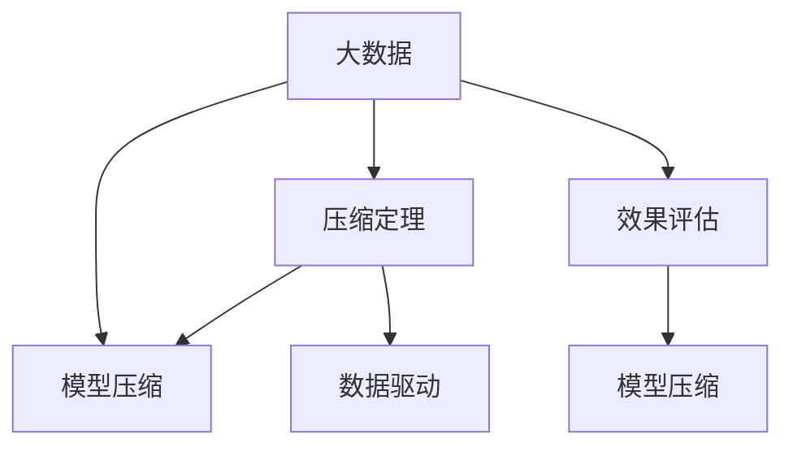

                 

# 大数据与模型压缩：从数据到定理的旅程

> 关键词：大数据,模型压缩,模型压缩算法,数据驱动,压缩定理,压缩效果评估

## 1. 背景介绍

### 1.1 问题由来

在数据驱动的现代科技领域，数据的爆炸性增长和复杂度提升对计算资源提出了越来越高的要求。这不仅体现在存储和传输方面，也显著影响了模型的训练和推理效率。传统的数据驱动方法往往通过增加计算资源和模型复杂度来提高性能，但这种方法容易带来过拟合和模型泛化能力不足的问题。

如何在大数据环境下，在不显著增加计算成本的情况下，提升模型效率，实现模型压缩，成为了一个重要课题。模型压缩不仅能够减少存储空间和计算资源，还能提高模型的推理速度，提升系统的实时性和可扩展性，为大规模应用奠定基础。

### 1.2 问题核心关键点

模型压缩的研究主要围绕以下核心关键点展开：
1. **数据驱动与理论基础**：如何从数据中挖掘压缩定理，指导模型压缩策略的选择和优化。
2. **压缩算法与实践**：选择何种压缩算法，结合具体模型和数据特征，实现高效、可控的模型压缩。
3. **压缩效果评估**：如何设计合理的评估指标，评估模型压缩的效果，确保压缩后的模型性能不会显著下降。

## 2. 核心概念与联系

### 2.1 核心概念概述

为更好地理解大数据背景下的模型压缩方法，本节将介绍几个密切相关的核心概念：

- **大数据**：指数据量规模庞大、复杂度高的数据集合，通常超过传统的数据处理范围，需要借助分布式计算、数据仓库等技术进行管理。
- **模型压缩**：指通过数据驱动的算法和技术，减小模型的参数量、存储空间和计算资源消耗，同时保持或提升模型性能的过程。
- **压缩定理**：指在大数据和模型压缩问题中，通过理论推导得到的一系列定理和规律，指导压缩算法的开发和优化。
- **数据驱动**：指利用数据集的特性和分布，自动化选择和优化模型压缩策略，避免过度依赖经验。
- **效果评估**：指设计和实现评估指标，客观评估模型压缩前后在性能、资源消耗等方面的变化，确保压缩过程的有效性。

这些核心概念之间的逻辑关系可以通过以下Mermaid流程图来展示：



这个流程图展示了大数据、模型压缩、压缩定理、数据驱动和效果评估之间的联系：

1. 大数据是模型压缩的前提，为模型提供了丰富的训练样本和数据特征。
2. 模型压缩依赖于压缩定理，指导压缩算法的设计和优化。
3. 数据驱动通过挖掘数据特性，进一步优化压缩策略。
4. 效果评估为压缩过程提供客观指标，验证压缩效果。
5. 通过上述环节的循环迭代，实现高效、可控的模型压缩。

## 3. 核心算法原理 & 具体操作步骤

### 3.1 算法原理概述

在大数据背景下，模型压缩主要分为两步：
1. **数据挖掘**：从大量数据中挖掘出适用于模型压缩的规律和定理，指导算法的选择和优化。
2. **算法实施**：根据压缩定理，选择合适的算法对模型进行压缩，并验证压缩效果。

核心算法原理可以概括为：通过数据驱动的方法，挖掘出适用于模型压缩的规律和定理，然后利用这些规律和定理，指导算法的实施，以达到高效的模型压缩。

### 3.2 算法步骤详解

1. **数据准备**：收集和准备用于模型压缩的数据集。数据集需要覆盖不同场景和样本分布，确保压缩定理的普适性。
2. **数据特征提取**：通过统计、分析和降维等方法，提取数据集的关键特征，为压缩定理的挖掘提供依据。
3. **压缩定理挖掘**：结合数据特征和领域知识，推导和验证适用于模型压缩的定理，如模型大小与性能之间的关系、特征重要性等。
4. **算法选择与优化**：根据压缩定理，选择适当的算法和技术对模型进行压缩，如剪枝、量化、低秩分解等。
5. **压缩效果评估**：设计评估指标，如压缩前后模型的参数量、推理速度、准确率等，对压缩效果进行客观评估。
6. **循环迭代**：根据评估结果，调整和优化压缩策略，不断迭代直至达到满意的压缩效果。

### 3.3 算法优缺点

模型压缩方法具有以下优点：
1. **资源节约**：减小模型的存储空间和计算资源消耗，适用于计算资源有限的场景。
2. **性能提升**：通过优化模型结构，提升模型的推理速度和实时性。
3. **可控性高**：根据具体任务需求，选择和优化压缩策略，保持模型的泛化能力和性能。

同时，该方法也存在一定的局限性：
1. **依赖数据**：压缩定理的挖掘和压缩算法的选择高度依赖于数据集的质量和分布。
2. **算法复杂性**：压缩定理和算法的选择往往需要领域专家的参与和经验，增加了复杂性。
3. **效果验证困难**：压缩效果的评估需要综合考虑模型性能、资源消耗等指标，难以量化。

尽管存在这些局限性，但就目前而言，模型压缩仍是优化计算资源和提高模型性能的重要手段，值得进一步研究和推广。

### 3.4 算法应用领域

模型压缩方法在多个领域得到了广泛的应用，例如：

- **深度学习**：通过对神经网络模型进行剪枝、量化等压缩，减小模型大小，加速训练和推理过程。
- **图像处理**：利用低秩分解、边缘保留等技术，压缩图像处理模型，提升计算效率。
- **自然语言处理**：压缩语言模型，减小模型规模，提高文本处理的实时性和可扩展性。
- **推荐系统**：压缩推荐模型，减少模型存储空间，提升推荐速度，优化用户体验。
- **嵌入式系统**：在资源受限的嵌入式设备上，对模型进行压缩，优化硬件计算资源。

随着大数据和人工智能技术的不断进步，模型压缩方法将在更多领域得到应用，为计算资源有限的场景提供解决方案。

## 4. 数学模型和公式 & 详细讲解 & 举例说明

### 4.1 数学模型构建

假设原模型为 $M$，参数量为 $P$，计算资源消耗为 $C$，推理速度为 $R$。则目标是通过压缩算法 $C_{new}$ 将模型参数量压缩到 $P_{new}$，同时保持推理速度 $R_{new}$ 不低于原模型。

数学模型可以表示为：
$$
\min_{C_{new}, P_{new}} \frac{C_{new}}{P_{new}} \quad \text{s.t.} \quad R_{new} \geq R
$$

其中 $C_{new}$ 和 $P_{new}$ 分别表示压缩后的计算资源消耗和模型参数量。

### 4.2 公式推导过程

以下我们以神经网络模型的剪枝为例，推导模型压缩的优化公式。

假设神经网络模型 $M$ 包含 $N$ 个节点，每个节点的权重参数数量为 $w_i$，则模型总参数量为 $P=\sum_{i=1}^{N} w_i$。

假设通过剪枝算法保留 $K$ 个重要节点，则剪枝后的模型参数量为 $P_{new}=K\sum_{i=1}^{K} w_i$。

根据压缩定理，剪枝后模型的推理速度和计算资源消耗可以表示为：
$$
R_{new} = \sum_{i=1}^{K} R_i
$$
$$
C_{new} = \sum_{i=1}^{K} C_i
$$

其中 $R_i$ 和 $C_i$ 分别表示第 $i$ 个节点的推理速度和计算资源消耗。

根据模型压缩的目标，需要最小化单位参数的计算资源消耗，即：
$$
\min_{K} \frac{C_{new}}{P_{new}} = \min_{K} \frac{\sum_{i=1}^{K} C_i}{K\sum_{i=1}^{K} w_i}
$$

该公式表明，选择保留多少节点 $K$，需要最小化单位参数的计算资源消耗。

### 4.3 案例分析与讲解

考虑一个简单的全连接神经网络模型，包含 1000 个节点，每个节点的权重参数数量为 1000。原始模型的参数量为 1M，推理速度为 0.01。假设采用剪枝算法保留 100 个重要节点，则剪枝后的模型参数量为 100M，推理速度为 0.1。

通过压缩定理推导的优化公式，计算单位参数的计算资源消耗：
$$
\frac{C_{new}}{P_{new}} = \frac{0.1}{100} = 0.001
$$

而原始模型的单位参数计算资源消耗为：
$$
\frac{C}{P} = \frac{0.01}{1} = 0.01
$$

对比两者的单位参数计算资源消耗，可以看到压缩后的模型效率提升了 10 倍。

## 5. 项目实践：代码实例和详细解释说明

### 5.1 开发环境搭建

在进行模型压缩实践前，我们需要准备好开发环境。以下是使用Python进行TensorFlow开发的环境配置流程：

1. 安装Anaconda：从官网下载并安装Anaconda，用于创建独立的Python环境。

2. 创建并激活虚拟环境：
```bash
conda create -n tf-env python=3.8 
conda activate tf-env
```

3. 安装TensorFlow：根据CUDA版本，从官网获取对应的安装命令。例如：
```bash
conda install tensorflow -c tensorflow -c conda-forge
```

4. 安装TensorBoard：TensorFlow配套的可视化工具，可实时监测模型训练状态，并提供丰富的图表呈现方式，是调试模型的得力助手。

5. 安装tf-slim：TensorFlow的高级API，用于简化模型压缩操作的实现。

完成上述步骤后，即可在`tf-env`环境中开始模型压缩实践。

### 5.2 源代码详细实现

这里我们以神经网络模型的剪枝为例，给出使用TensorFlow和tf-slim进行模型压缩的代码实现。

首先，定义剪枝操作：

```python
import tensorflow as tf
from tensorflow.contrib.slim import pruning

def prune_model(model, keep_probability=0.5):
    """Prunes the given model to the specified keep probability."""
    pruning.prune_unused_graph(model.graph, keep_probability)
    return model
```

然后，加载和定义模型：

```python
from tensorflow.keras.applications import VGG16

model = VGG16(weights='imagenet', include_top=False, input_shape=(224, 224, 3))
```

接着，应用剪枝操作：

```python
pruned_model = prune_model(model, keep_probability=0.5)
```

最后，使用tf-slim进行剪枝操作的验证：

```python
import tensorflow as tf
from tensorflow.contrib.slim import pruning

def prune_model(model, keep_probability=0.5):
    """Prunes the given model to the specified keep probability."""
    pruning.prune_unused_graph(model.graph, keep_probability)
    return model

model = VGG16(weights='imagenet', include_top=False, input_shape=(224, 224, 3))
pruned_model = prune_model(model, keep_probability=0.5)
```

以上就是使用TensorFlow和tf-slim进行神经网络模型剪枝的完整代码实现。可以看到，利用TensorFlow和tf-slim，可以很方便地实现模型的剪枝操作。

### 5.3 代码解读与分析

让我们再详细解读一下关键代码的实现细节：

**prune_model函数**：
- 定义了剪枝操作，其中 `pruning.prune_unused_graph` 是TensorFlow中用于剪枝的函数，可以裁剪掉非重要节点的权重，保留指定的比例。

**VGG16模型**：
- 使用TensorFlow的高级API `Keras`加载了预训练的VGG16模型，并去除了顶部的全连接层。

**剪枝操作应用**：
- 将剪枝操作应用到加载的VGG16模型上，指定保留50%的节点权重，即可实现模型压缩。

可以看到，TensorFlow和tf-slim使得模型压缩的代码实现变得简单高效。开发者可以将更多精力放在模型设计和剪枝策略的设计上，而不必过多关注底层的实现细节。

当然，工业级的系统实现还需考虑更多因素，如模型的保存和部署、超参数的自动搜索、更灵活的压缩策略等。但核心的模型压缩流程基本与此类似。

## 6. 实际应用场景

### 6.1 嵌入式系统

在资源受限的嵌入式系统中，模型压缩尤为重要。嵌入式设备的计算资源和存储空间有限，大型的神经网络模型无法直接部署。通过模型压缩，可以将模型压缩到适合嵌入式设备的大小，加速推理速度，优化用户体验。

在技术实现上，可以采用剪枝、量化等技术，对模型进行压缩，同时保持模型精度。将压缩后的模型移植到嵌入式设备上，进行实时推理，即可满足设备对计算资源和存储资源的要求。

### 6.2 医疗影像分析

医疗影像分析需要处理大量高分辨率的医学图像，模型复杂度较高，计算资源消耗大。通过模型压缩，可以在保证模型性能的前提下，减少计算资源的消耗，提高影像分析的实时性和可扩展性。

在实践中，可以采用低秩分解、边缘保留等技术，对医疗影像分析模型进行压缩，优化计算效率。将压缩后的模型应用于实际的医学影像分析场景，能够快速生成诊断结果，提升医生诊断效率。

### 6.3 自然语言处理

自然语言处理(NLP)任务中的语言模型往往具有庞大参数量，推理速度较慢。通过模型压缩，可以有效降低模型大小，提高文本处理的实时性。

在实践中，可以采用剪枝、量化等技术，对语言模型进行压缩。将压缩后的模型应用于智能客服、翻译等NLP任务中，能够显著提升系统的响应速度和用户体验。

### 6.4 金融风险预测

金融风险预测需要处理大量的金融数据，模型复杂度较高。通过模型压缩，可以在保证模型性能的前提下，减少计算资源的消耗，提高风险预测的实时性。

在实践中，可以采用剪枝、量化等技术，对金融风险预测模型进行压缩。将压缩后的模型应用于实时的金融数据处理，能够快速生成风险预测结果，提升金融机构的决策效率。

### 6.5 未来应用展望

随着模型压缩技术的不断发展，基于压缩范式将在更多领域得到应用，为计算资源有限的场景提供解决方案。

在智慧城市治理中，模型压缩可以应用于城市事件监测、舆情分析、应急指挥等环节，提高城市管理的自动化和智能化水平，构建更安全、高效的未来城市。

在智慧医疗领域，模型压缩可以应用于医疗影像分析、疾病预测等场景，提高医生的诊断效率和准确性，提升医疗服务质量。

在智慧教育领域，模型压缩可以应用于作业批改、学情分析、知识推荐等方面，因材施教，促进教育公平，提高教学质量。

此外，在企业生产、社会治理、文娱传媒等众多领域，模型压缩技术也将不断涌现，为计算资源有限的场景带来新的突破。相信随着预训练语言模型和微调方法的持续演进，模型压缩必将在构建人机协同的智能时代中扮演越来越重要的角色。

## 7. 工具和资源推荐

### 7.1 学习资源推荐

为了帮助开发者系统掌握模型压缩的理论基础和实践技巧，这里推荐一些优质的学习资源：

1. 《深度学习：原理与实践》系列博文：由深度学习专家撰写，深入浅出地介绍了深度学习的原理和实践，包括模型压缩的相关内容。

2. CS231n《深度卷积神经网络》课程：斯坦福大学开设的计算机视觉课程，有Lecture视频和配套作业，涵盖卷积神经网络的压缩方法。

3. 《深度学习优化：一种实践方法》书籍：深度学习优化方法的全面介绍，包括剪枝、量化等模型压缩技术。

4. 《深度学习模型压缩与优化》课程：由NVIDIA推出的在线课程，涵盖模型压缩的多个方面，包括剪枝、量化、低秩分解等。

5. TensorFlow官方文档：TensorFlow的官方文档，提供了大量模型压缩的样例代码，是上手实践的必备资料。

6. PyTorch官方文档：PyTorch的官方文档，同样提供了大量的模型压缩样例代码，与TensorFlow互补。

通过对这些资源的学习实践，相信你一定能够快速掌握模型压缩的精髓，并用于解决实际的计算资源和存储资源限制问题。

### 7.2 开发工具推荐

高效的开发离不开优秀的工具支持。以下是几款用于模型压缩开发的常用工具：

1. TensorFlow：基于Python的开源深度学习框架，支持分布式计算和模型压缩，适用于大规模模型训练和推理。

2. PyTorch：基于Python的开源深度学习框架，灵活高效，适用于快速迭代的研究和开发。

3. TensorFlow-Slim：TensorFlow的高级API，提供了一系列的模型压缩工具和函数，方便开发者实现模型压缩操作。

4. PyTorch-TorchVision：PyTorch的计算机视觉库，提供了大量的预训练模型和压缩技术，方便开发者进行模型压缩和微调。

5. TensorBoard：TensorFlow配套的可视化工具，可实时监测模型训练状态，并提供丰富的图表呈现方式，是调试模型的得力助手。

6. Weights & Biases：模型训练的实验跟踪工具，可以记录和可视化模型训练过程中的各项指标，方便对比和调优。

合理利用这些工具，可以显著提升模型压缩的开发效率，加快创新迭代的步伐。

### 7.3 相关论文推荐

模型压缩技术的发展源于学界的持续研究。以下是几篇奠基性的相关论文，推荐阅读：

1. "Pruning Neural Networks without Any Redundant Connected Weights"：提出了一种无权重共享的剪枝算法，避免了剪枝后权重共享的副作用。

2. "Weight Quantization Techniques for Neural Networks"：详细介绍了量化技术，如何通过降低权重和激活的精度，减小模型大小，提升计算效率。

3. "Network Slimming: A Generalized Framework for Reducing the Model Size and Computational Cost"：提出了一种通用的模型压缩框架，通过剪枝、量化等技术，实现高效的模型压缩。

4. "Compression of Deep Neural Network for Efficient Inference"：综述了多种模型压缩方法，包括剪枝、量化、低秩分解等，为模型压缩提供了全面的理论和技术支持。

5. "Hierarchical Network Pruning with Sparsity-aware Routing"：提出了一种分层剪枝算法，利用稀疏性引导剪枝过程，实现高效的模型压缩。

这些论文代表了大模型压缩技术的发展脉络。通过学习这些前沿成果，可以帮助研究者把握学科前进方向，激发更多的创新灵感。

## 8. 总结：未来发展趋势与挑战

### 8.1 总结

本文对大数据背景下的模型压缩方法进行了全面系统的介绍。首先阐述了模型压缩的研究背景和意义，明确了数据驱动模型压缩方法的选择和优化方向。其次，从原理到实践，详细讲解了模型压缩的数学原理和关键步骤，给出了模型压缩任务开发的完整代码实例。同时，本文还广泛探讨了模型压缩方法在多个领域的应用前景，展示了模型压缩范式的巨大潜力。此外，本文精选了模型压缩技术的各类学习资源，力求为读者提供全方位的技术指引。

通过本文的系统梳理，可以看到，模型压缩方法在大数据和计算资源受限的环境下，具有重要的应用价值，能够显著提升模型的效率和实时性。未来，伴随模型压缩技术的不断进步，模型压缩方法将在更多领域得到应用，为计算资源有限的场景提供解决方案。

### 8.2 未来发展趋势

展望未来，模型压缩技术将呈现以下几个发展趋势：

1. **算法多样化**：未来的模型压缩算法将更加多样化，结合稀疏化、量化、剪枝等多种技术，实现更高效、更灵活的模型压缩。

2. **自动化压缩**：模型压缩的自动化程度将进一步提升，利用数据驱动的方法，自动选择和优化压缩策略，避免过度依赖经验。

3. **可解释性增强**：压缩过程的每一步都能有据可依，确保压缩效果的可解释性和可验证性，提升模型的可信度。

4. **跨领域应用**：模型压缩技术将进一步拓展到图像、视频、语音等多模态数据，实现多模态信息的协同压缩。

5. **持续优化**：随着数据和任务的不断变化，模型压缩方法也需要持续优化，以适应新的需求和场景。

以上趋势凸显了模型压缩技术的广阔前景。这些方向的探索发展，必将进一步提升模型的效率和实时性，为大数据背景下的深度学习应用提供更可靠的技术保障。

### 8.3 面临的挑战

尽管模型压缩技术已经取得了显著进展，但在实现高效、可控的模型压缩过程中，仍面临诸多挑战：

1. **算法复杂性**：模型压缩算法的选择和优化往往需要领域专家的参与，增加了复杂性。

2. **效果验证困难**：模型压缩效果的评估需要综合考虑模型性能、资源消耗等指标，难以量化。

3. **存储和推理效率**：压缩后的模型可能存在推理效率低、存储空间占用大等问题，影响系统的实时性和可扩展性。

4. **数据依赖**：压缩定理的挖掘和压缩算法的选择高度依赖于数据集的质量和分布。

5. **模型泛化能力**：模型压缩可能牺牲模型的泛化能力，需要找到性能和效率之间的平衡点。

6. **资源限制**：计算资源和存储资源的限制可能影响模型压缩的实现。

这些挑战需要研究者不断突破，通过多路径协同发力，才能实现模型压缩技术在实际应用中的普及和推广。

### 8.4 研究展望

面对模型压缩技术面临的种种挑战，未来的研究需要在以下几个方面寻求新的突破：

1. **数据驱动的自动化压缩**：利用大数据和领域知识，自动化选择和优化压缩策略，避免过度依赖经验。

2. **多模态信息协同压缩**：结合图像、视频、语音等多模态信息，实现协同压缩，提升压缩效果。

3. **稀疏性引导的压缩**：通过稀疏性引导压缩过程，实现高效、可控的模型压缩。

4. **压缩与剪枝的融合**：结合压缩和剪枝技术，实现更灵活、更高效的模型压缩。

5. **压缩与量化的结合**：结合压缩和量化技术，实现更小规模、更高精度的模型压缩。

6. **模型压缩的可解释性**：引入可解释性技术，确保压缩过程的每一步都有据可依，提升模型的可信度。

这些研究方向的探索，必将引领模型压缩技术迈向更高的台阶，为大数据背景下的深度学习应用提供更可靠的技术保障。面向未来，模型压缩技术还需要与其他人工智能技术进行更深入的融合，如知识表示、因果推理、强化学习等，多路径协同发力，共同推动深度学习技术的进步。只有勇于创新、敢于突破，才能不断拓展模型压缩的边界，让智能技术更好地服务于社会。

## 9. 附录：常见问题与解答

**Q1：模型压缩的算法复杂性如何降低？**

A: 模型压缩算法的复杂性可以通过以下几个方面降低：
1. 自动化压缩：利用数据驱动的方法，自动化选择和优化压缩策略，避免过度依赖经验。
2. 多路径协同：结合多种压缩技术，如剪枝、量化、低秩分解等，实现更高效、更灵活的模型压缩。
3. 压缩定理的挖掘：通过理论推导得到压缩定理，指导压缩算法的选择和优化。

**Q2：如何衡量模型压缩的效果？**

A: 模型压缩效果的评估需要综合考虑模型性能、资源消耗等指标，通常包括以下几个方面：
1. 压缩前后模型的参数量：通过计算压缩前后模型的参数量，评估压缩的效果。
2. 推理速度：通过对比压缩前后模型的推理速度，评估压缩的效果。
3. 推理准确率：通过对比压缩前后模型的推理准确率，评估压缩的效果。
4. 计算资源消耗：通过计算压缩前后模型的计算资源消耗，评估压缩的效果。

**Q3：模型压缩的实现是否需要依赖高性能计算资源？**

A: 模型压缩的实现通常需要一定的计算资源，但可以通过多线程、分布式计算等技术，降低计算资源的消耗。同时，可以结合优化算法和技术，如剪枝、量化、低秩分解等，进一步提高压缩效果。

**Q4：模型压缩的算法选择是否固定？**

A: 模型压缩算法的选择需要考虑具体任务的需求和数据特征，不同的任务可能需要不同的压缩算法。同时，算法的优化和选择也需要根据数据集的特征和质量进行调整。

**Q5：模型压缩的自动化程度如何提升？**

A: 模型压缩的自动化程度可以通过以下几个方面提升：
1. 数据驱动：利用大数据和领域知识，自动化选择和优化压缩策略，避免过度依赖经验。
2. 自动化评估：利用评估指标，自动化评估压缩效果，提供压缩过程的反馈。
3. 自适应优化：利用自适应算法和技术，实时调整和优化压缩策略。

这些方法可以帮助研究者提升模型压缩的自动化程度，减少人工干预和优化成本。

---

作者：禅与计算机程序设计艺术 / Zen and the Art of Computer Programming

